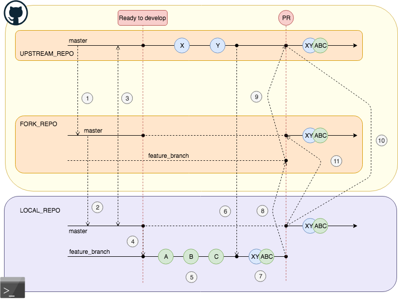

# Contributing Content

The Production Deployment Guides site is hosted in an internal IBM repo. If you are an IBM employee, and would like to contribute, there are two ways you can do that:

- Reporting bugs and making suggestions
- Contributing your own content

## Reporting bugs and making suggestions

This can be done through the use of the 
[**Issues**](https://github.ibm.com/cloudpakbringup/production-deployment-guides/issues) 
page.  

Before opening a new issue, please check the existing list to 
make sure your issue does not already exist. The more explicit you are in opening GitHub Issues, the more efficient your interaction with the maintainers will be. 

## Contributing your own content

We value content contributions, and accept them using the open source contribution model. Open source contributions are made by creating a fork of the site repository, adding your content in the forked repository, then creating a pull request back to the site repository. The detailed steps to do this are provided below.

If you are new to open source contribution and would like some more pointers or guidance, you may want to check out 
[**Your First PR**](http://yourfirstpr.github.io/) and 
[**First Timers Only**](https://www.firsttimersonly.com/). 

### Forks and Pull Requests best practices
Please follow these best practices after you read the 
instructions for contributing:

- One change / documentation update per pull request (PR)
  - Always pull the latest changes from upstream and rebase before 
  creating any pull request.  
  - New pull requests should be created against a branch of your 
  forked repository.
- All new contributions should first be tested locally before PR 
submission. There is a way to run a local development instance of the web site on your own machine. Follow the instructions in the section below to set it up.

## The Open Source Contribution Process Step By Step 

Here is a compact guide to following the open source contribution model for our site. If you are new to github, or just rusty with the details, it is worth some minutes of your time to study this diagram, relating each step
number to its description in the text below. This will help you to understand all the steps in the process, and understand where you are in it as you create your contribution.




1. Create your own fork of the repo in github. This can be done in
the GUI at
[https://github.ibm.com/cloudpakbringup/production-deployment-guides](https://github.ibm.com/cloudpakbringup/production-deployment-guides)
by clicking the **Fork** icon in the upper right corner. A fork or
copy of the repo will be created under your own github id. The URL
will be:

    ```
    https://github.ibm.com/<Your github ID>/production-deployment-guides
    ```

2. Go to the URL of your forked repo, and use the green **Code**
button to copy the repo information so you can paste it
into your clone command in the command line to clone it to your 
local computer.

3. Add a connection from the master branch of your local cloned
repository to the master branch of the upstream repository. 
The details for this step are in 
**Step 3  Configure Git to sync your fork ...** of the link below.
Do not miss this important step.

    !!!note
        You can find more detailed instructions for steps 1-3 by following this link: 
        [https://help.github.com/articles/fork-a-repo](https://help.github.com/articles/fork-a-repo/)
  
4. In a terminal window command line, working from the 
directory of your local
cloned repository, create a new development branch off the targeted 
upstream `master` branch.

    ```
    git checkout -b <my-feature-branch> master
    ```

5. Do your work:

    - Write your contributions or make your changes
    - Pass your tests locally (see the description of setting up your
   local test instance below)
    - Commit your intermediate changes as you go and as appropriate
    - Repeat until satisfied

6. When you are finished with all your commits and ready to push
your changes, fetch the latest upstream changes (in case other changes had been delivered upstream by others while you were working on your contribution).

    ```
    git fetch upstream
    ```

7. Rebase your local cloned repo to the latest upstream changes, 
resolving any conflicts. This will 'replay' your local commits, one by one, after the changes delivered upstream while you were locally developing, letting you manually resolve any conflicts. Instructions on how to manually resolve a conflict and commit the new change or skip your local replayed commit will be presented on screen by the git CLI.

    ```
    git branch --set-upstream-to=upstream/master
    git rebase
    ```

8. Push the changes you added and committed to your forked repository
(see the diagram above to understand this step).

    ```
    git push origin <my-feature-branch>
    ```

9. Create a **pull request** against the same targeted upstream branch.
The easiest way to do this is through the GUI. If you go to the 
upstream repo URL
[https://github.ibm.com/cloudpakbringup/production-deployment-guides](https://github.ibm.com/cloudpakbringup/production-deployment-guides),
after you have done the `push` above, you should see a notice of your
pushed changes and a button to create a pull request. **Click that button**,
fill in a general description of the changes in your pull request, and
preferably choose one or more reviewers from the list on the right 
side. Your pull request needs at least one reviewer's approval before
it can be merged. Once the pull request has been reviewed, accepted and merged into the main github repository, you should synchronize your remote 
and local forked github repository master branch with the 
upstream master branch. To do so, follow the steps below.

    !!!note
       More details on pull requests can be found at 
[Creating a pull request](https://help.github.com/articles/creating-a-pull-request/)

10. In your local cloned repo command line, change your active branch 
to **master**. Then pull to your local cloned repo the latest 
changes from the upstream master branch (that is, the pull request).

    ```
    git checkout master
    git pull upstream master
    ```

11. Now push those latest upstream changes that you just pulled 
locally to your forked repository.

    ```
    git push origin master
    ```

Now your forked repository and your local cloned repository are all caught up and synced with the main upstream repository.

### What Happens to your Pull Request?

This section is just for your information. You do not have to take 
any further steps unless you are requested to by the reviewer(s).

All pull requests are automatically built and unit tested by 
a Travis-CI pipeline. The pipeline will highlight to the
reviewer if there are any missing or mis-matched elements of your 
proposed change that could create problems for the web site. If any
such problems are indicated, the reviewer or maintainer will 
contact you to request the necessary changes to resolve the issue.

The repository maintainer will inspect the content your commit. 
if approved, they will merge your changes into the upstream master branch.

Should a maintainer or reviewer ask for changes to be made to the 
pull request, these can be made locally and pushed to your forked 
repository and branch. This uses the same git add, commit, and push
steps on the same development branch that you used when you first 
created the contribution.

After the maintainer approves and merges your pull request, 
your changes will appear on 
the web site shortly thereafter.

## Testing Your Changes Locally

Please follow the instructions in the **Running a Local Site Instance** page below to set up your own local instance of the web site. This can be used to test the changes you make locally before submitting them as a pull request.