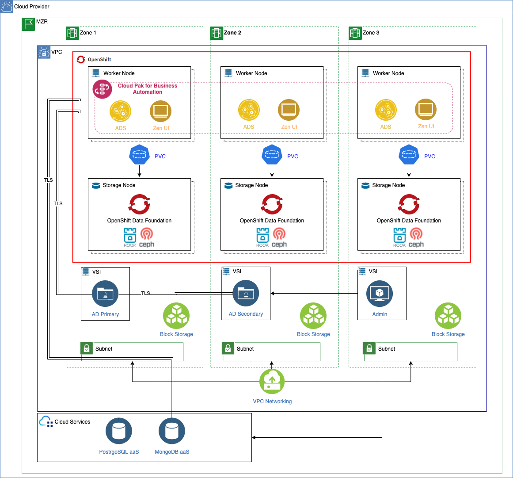

#IBM Automation Decision Services Deployment Architecture

!!! abstract
    This document describes the deployment of [IBM Automation Decision Services](https://www.ibm.com/docs/en/cloud-paks/1.0?topic=software-automation-decision-services) on the [RedHat OpenShift Kubernetes Service on IBM Cloud](https://www.ibm.com/cloud/openshift), known as ROKS, on [Virtual Private Cloud (VPC) Gen 2](https://www.ibm.com/cloud/vpc) infrastructure.

{: style="max-height:1200px"}

As we can see in the topology above, the RedHat OpenShift cluster has been deployed on a MultiZone Region (MZR) data center with three availability zones where Virtual Private Cloud Gen 2 is available.
!!! Note
    IBM Automation Decision Services [requires ReadWriteMany (RWX) storage](https://www.ibm.com/docs/en/cloud-paks/cp-biz-automation/21.0.x?topic=pei-storage-considerations).
    
    In order to offer Read Write Many (RWX) storage for the applications running on our RedHat OpenShift cluster, we need to make OpenShift Data Foundation [available in our RedHat OpenShift cluster](https://cloud.ibm.com/docs/openshift?topic=openshift-ocs-storage-prep). 

[OpenShift Data Foundation (ODF)](https://www.redhat.com/en/resources/openshift-data-foundation-datasheet) is a storage solution that consists of open source technologies [Ceph](https://docs.ceph.com/en/latest/start/intro/), [Noobaa](https://www.noobaa.io/), and [Rook](https://rook.io/). ODF allows you to provision and manage File, Block, and Object storage for your containerized workloads in Red Hat® OpenShift® on IBM Cloud™ clusters. Unlike other storage solutions where you might need to configure separate drivers and operators for each type of storage, ODF is a unified solution capable of adapting or scaling to your storage needs.

The **IBM Automation Decision Service** runtime [requires a MongoDB](https://www.ibm.com/docs/en/cloud-paks/cp-biz-automation/21.0.x?topic=services-configuring-mongodb-storage). For development systems, an embedded MongoDB is provided, however for Production usage an external MongoDB instance is required. In the deployment topology above we are using MongoDB as-a-service which is provided by the Cloud provider (in this case IBM Cloud).

The **Business Automation Navigator** [requires a Postgres DB](https://www.ibm.com/docs/en/cloud-paks/cp-biz-automation/21.0.x?topic=databases-creating-required-in-postgresql). In the deployment topology above we are using Postgres as-a-service which is provided by the Cloud provider (in this case IBM Cloud).

The **User Management Service** [requires LDAP](https://www.ibm.com/docs/en/cloud-paks/1.0?topic=capabilities-enterprise-deployments). For development systems, an embedded LDAP is provided, however for Production usage an external LDAP instance is required. In the deployment topology above we are using the VSIs to host the LDAP implementation, however this may not be required in an environment where an LDAP already exists.
