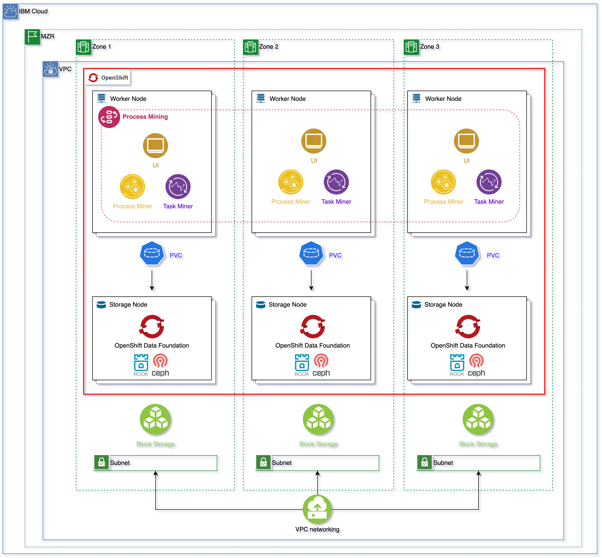

# IBM Process Mining Architecture on IBM Cloud

<!--- cSpell:ignore ibmc APIC Availability unmanaged practioners Pak Paks Quickstart qube cntk autoplay allowfullscreen Ceph Rook Noobaa tolerations -->

!!! abstract
    This document describes the deployment of [IBM Process Mining](https://www.ibm.com/docs/en/cloud-paks/1.0?topic=foundation-process-mining) on the [RedHat OpenShift Kubernetes Service on IBM Cloud](https://www.ibm.com/cloud/openshift), known as ROKS, on [Virtual Private Cloud (VPC) Gen 2](https://www.ibm.com/cloud/vpc) infrastructure.

[{: style="max-height:1000px"}]((https://app.diagrams.net/#Hcloud-native-toolkit%2Fmulti-tenancy-gitops%2Fmaster%2Fdoc%2Fdiagrams%2FPM-IBM-ROKS-VPC-Arch.drawio))

!!! tip
    <a href="https://raw.githubusercontent.com/cloud-native-toolkit/multi-tenancy-gitops/master/doc/diagrams/PM-IBM-ROKS-VPC-Arch.drawio" download>Right-click here and select "Save Link As" to download the DrawIO file</a> used to generate these diagrams or [open the diagram using diagrams.net](https://app.diagrams.net/#Hcloud-native-toolkit%2Fmulti-tenancy-gitops%2Fmaster%2Fdoc%2Fdiagrams%2FPM-IBM-ROKS-VPC-Arch.drawio)

As you can see in the topology above, the RedHat OpenShift Kubernetes Service cluster has been deployed on a MultiZone Region (MZR) data center with three availability zones (AZs) where Virtual Private Cloud (VPC) Gen 2 is available.
!!! warning
    IBM Process Mining **[requires ReadWriteMany (RWX) storage](https://www.ibm.com/docs/en/cloud-paks/1.0?topic=platform-pre-installation-requirements)**. In order to offer Read Write Many (RWX) storage for the applications running on your RedHat OpenShift Kubernetes Service cluster on Virtual Private Cloud (VPC) Gen 2, you need to [make OpenShift Data Foundation available in our RedHat OpenShift cluster](https://cloud.ibm.com/docs/openshift?topic=openshift-ocs-storage-prep). 

[OpenShift Data Foundation (ODF)](https://www.redhat.com/en/resources/openshift-data-foundation-datasheet) is a storage solution that consists of open source technologies [Ceph](https://docs.ceph.com/en/latest/start/intro/), [Noobaa](https://www.noobaa.io/), and [Rook](https://rook.io/). ODF allows you to provision and manage File, Block, and Object storage for your containerized workloads in Red Hat® OpenShift® on IBM Cloud™ clusters. Unlike other storage solutions where you might need to configure separate drivers and operators for each type of storage, ODF is a unified solution capable of adapting or scaling to your storage needs.

In order to [install OpenShift Data Foundation (ODF)](https://cloud.ibm.com/docs/openshift?topic=openshift-deploy-odf-vpc) in your RedHat OpenShift Kubernetes Service (ROKS) cluster on IBM Cloud on a Virtual Private Cloud (VPC) Gen 2, you need to make sure that your RedHat OpenShift Kubernetes Service cluster counts with at least three worker nodes. For high availability, you must create your RedHat OpenShift Kubernetes Service cluster with at least one worker node per zone across the three zones. Each worker node must have a **minimum of 16 CPUs and 64 GB RAM**.

!!! warning "Important"
    The `storageClass` used to configure OpenShift Data Foundation to request storage volumes **must be of type** [**`metro`**](https://cloud.ibm.com/docs/openshift?topic=openshift-vpc-block#vpc-block-reference). What `metro` means is that the `volumeBindingMode` of that `storageClass` will be set to `WaitForFirstConsumer` as opposed to the default `Immediate`. And what that means is that the Persistent Volume creation and allocation by the IBM Cloud Object Storage, as a result of its Persistent Volume Claim, will not happen until the pod linked to that Persistent Volume Claim is scheduled. This allows IBM Cloud Object Storage to know what Availability Zone of your MultiZone Region cluster the pod requesting block storage ended up on and, as a result, to be able to provision such storage in the appropriate place. Otherwise, if we used a `storageClass` whose `volumeBindingMode` was the default `Immediate`, IBM Cloud Object Storage would create and allocate the Persistent Volume in one of the Availability Zones which might not be the same Availability Zone the pod requiring such storage ends up on as a result of the OpenShift pod scheduler which would make the storage inaccessible to the pod. See Kubernetes official documentation [here](https://kubernetes.io/docs/concepts/storage/storage-classes/#volume-binding-mode) for further detail.

!!! warning "Important"
    The `storageClass` you need to configure OpenShift Data Foundation to use with **must not have Retain Reclaim policy**. If you retain the Persistent Volume, it might end up assigned to a pod in a different Availability Zone later, making that storage inaccessible to the pod allocated to. 

Therefore, the `storageClassName` you need to configure OpenShift Data Foundation to use with, in the [deployment section](../../process-mining/deployment/ibm-cloud.md), will need to be of either **`ibmc-vpc-block-metro-10iops-tier`**, **`ibmc-vpc-block-metro-5iops-tier`** or **`ibmc-vpc-block-metro-custom`** types.

## Storage

The full install of IBM Process mining requires two mandatory persistent volumes and two optional persistent volumes. The mandatory persistent volumes are for storing process mining events and task mining events. The optional storage is for IBM DB2 and MongoDB. IBM Process Mining requires MongoDB for the process mining component and IBM DB2 (or optionally Mysql) for the task mining component. The IBM Process Mining Operator will automatically install an embedded MongoDB and IDM DB2 by default. However, this deployment is suitable for demonstration or evaluation use cases. For production environments, where performance is more important, please configure your process mining component and task mining component with a external database that you provisioned yourself. For production environments the following databases are required:

- Mongo DB v3.6 or higher for the process mining component.
- IBM DB2 11.5.6.0 for the task mining component.

See the [Links](#links) section at the bottom for more information on storage for IBM Process Mining.

## Security

TLS certificates are mandatory to secure the exposed routes of the application.

The certificates are required for the following routes:

- Process Mining public Rest API.
- Task Mining REST API for Agent and Designer integration.
  
In a default installation, self-signed certificates are automatically created by the operator and no further action is required. However, for a production environment, your own certificates that are issued by a trusted CA should be provided within the ProcessMining CSV.

See the [Links](#links) section at the bottom for more information on security and certificates for IBM Process Mining.

## High Availability

It is recommended that for production environments IBM Process Mining is installed highly available for better resiliency. All components of IBM Process Mining can be highly available deployed except from the embedded IBM DB2 and MongoDB components, which are not recommended for production environments and external self provisioned MongoDB and IBM DB2 databases are strongly recommended instead (see [Storage](#storage) section above).

The highly available deployment of each of the IBM Process Mining components can be through the IBM Process Mining Custom Resource Definition (CRD) when installing your IBM Process Mining instance.

See the [Links](#links) section at the bottom for more information on deployment profiles for IBM Process Mining.

## Backup and Restore

#### Back up and restore procedure for Process Mining

The Process Mining component stores information in two places.

1. Raw events and process analysis by directly accessing the file system, by using a persistent volume.
2. More meta-information on processes, organizations, user-profiling on Mongo DB. The Mongo DB instance can be external or hosted in a cluster Pod. In the latter case, it stores the information on a persistent volume.

#### Back up and Restore Procedure for Task Mining

The Task Mining component stores information in two places:

1. Task events and activity logs by directly accessing the file system, by using a persistent volume.
2. Process and workflow metadata in IBM DB2 (or MySQL) DB. The IBM DB2 (or MySql) DB can be provided externally or it can be hosted in a cluster Pod. In the latter case, it will be an IBM DB2 DB and it will store the information on a persistent volume.

See the [Links](#links) section at the bottom for full detail on how to backup and restore the process mining and task mining components of IBM Process Mining.

## Sizing

Listed below are two sizing configurations for IBM Process Mining. In order to appropriately sizing your Red Hat OpenShift cluster on IBM Cloud, you need to consider data volumes and data complexity (i.e. number of events), plus the number of concurrent users active on the application; it’s not so important how many users are working, but what they are doing concurrently.

#### Minimum Resources required for IBM Process Mining

The following table details the minimum resources required for installing IBM Process Mining on Red Hat OpenShift for 10 concurrent users with up to 10 Million events.

|Software|Memory (GB)|CPU (cores)|Disk (GB)|Nodes|
|--------|-----------|-----------|---------|-----|
|Process Mining|64|16|100|1|
|Task Mining|32|8|100|1|
|**Total**|96|24|200|1|

#### Highly Available Setup

The following table details the minimum resources required for installing IBM Process Mining on Red Hat OpenShift for 10 concurrent users with up to 50 Million events with each of the IBM Process Mining components highly available

|Software|Memory (GB)|CPU (cores)|Disk (GB)|Nodes|
|--------|-----------|-----------|---------|-----|
|Process Mining|128|48|200|3|
|Task Mining|32|8|300|3|
|**Total**|160|56|500|3|

See the [Deployment Profiles](https://www.ibm.com/docs/en/cloud-paks/1.0?topic=platform-deployment-profiles) section in the official IBM Process Mining documentation.

!!! success "Summary"
    As you can see in the topology diagram above for the production reference architecture of IBM Process Mining on the RedHat OpenShift Kubernetes Service (ROKS) on IBM Cloud on Virtual Private Cloud (VPC) Gen 2, we strongly recommend you create your RedHat OpenShift Kubernetes Service cluster with **6 worker nodes**, where three of them could be used for OpenShift Data Foundation only (see tip below) while the other three would be reserved to run the IBM Process Mining components. You can review above in this section the sizes for each of the worker nodes running OpenShift Data Foundation as well as the total sizing of the other three worker nodes running the IBM Process Mining components. Finally, make sure you are using a **metro** storage class with **delete** reclaim policy for OpenShift Data Foundation which will provide IBM Process Mining the required Read Write Many (RWX) storage.

!!! tip
    You could use labels, tolerations and taints if you want that OpenShift Data Foundation specific workloads get deployed on completely separate worker nodes as your application workloads (IBM Process Mining in this case). Check the OpenShift Data Foundation documentation [here](https://cloud.ibm.com/docs/openshift?topic=openshift-deploy-odf-vpc#odf-vpc-param-ref) and pay attention to the `workerNodes` parameter.

## Links

- [IBM Process Mining Knowledge Center](https://www.ibm.com/docs/en/cloud-paks/1.0?topic=pm-installation-setup-guide-process-mining-openshift-container-platform)