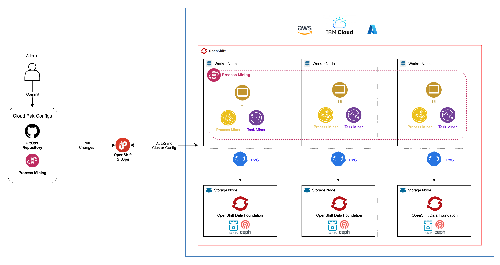

# GitOps & ArgoCD

<!--- cSpell:ignore CICD qube cntk autoplay allowfullscreen clusterrole clusterrolebinding -->

## Overview

A [GitOps](https://www.openshift.com/blog/introduction-to-gitops-with-openshift) model must be at the core of the methodology or approach used to deploy and manage any IBM capability in production. It ensures that the installation, configuration and changes of these IBM capabilities, as well as their configuration and citizens (applications, integration flows, APIs, etc), is only done through code.

GitOps puts git repositories and git commands such as **git push** (to request a change) and **git merge** (to approve a change) at the heart of configuration management. A GitOps approach helps an organization implement best practices in version control and release governance based on a widely used open standard -- **git**.

The following diagram outlines the major components in an IBM Process Mining GitOps model:

[{: style="max-height:1000px"}](https://app.diagrams.net/#Hcloud-native-toolkit%2Fmulti-tenancy-gitops%2Fmaster%2Fdoc%2Fdiagrams%2FPM-GitOps.drawio)

!!! tip
    <a href="https://raw.githubusercontent.com/cloud-native-toolkit/multi-tenancy-gitops/master/doc/diagrams/PM-GitOps.drawio" download>Right-click here and select "Save Link As" to download the DrawIO file</a> used to generate these diagrams or [open the diagram using diagrams.net](https://app.diagrams.net/#Hcloud-native-toolkit%2Fmulti-tenancy-gitops%2Fmaster%2Fdoc%2Fdiagrams%2FPM-GitOps.drawio)

**ArgoCD (OpenShift GitOps)**  applications watch a Git config repository for changes. OpenShift GitOps applies the Kubernetes resources thus identified to the cluster, resulting in new or updated Kubernetes resources that represent the changed IBM Process Mining cluster and its ecosystem, such as pods, routes etc. OpenShift GitOps changes are durable; they remain as defined unless and until they are explicitly changed or deleted in the GitOps repository. Moreover, if the cluster resources drift from their Git config values, ArgoCD will restore them to their desired values; only changes that are applied to the Git config repository affect the long term state of the cluster. In general, in application development, OpenShift GitOps is used for *Continuous Deployment*.

In this section of the tutorial, you're going to set up the GitOps repository, and install ArgoCD. More precisely, you are going to

* Create a Github Organization
* Download a sample GitOps repository and briefly review it
* Install ArgoCD
* Customize ArgoCD
* Login in to the ArgoCD UI

By the end of this topic you'll have a all the basic components in place to perform GitOps in your cluster.

## Pre-requisites

Before attempting this section, you must have completed the previous *Create the Cluster* section.

--8<-- "gitops-sample-repo-creation.md"

--8<-- "gitops-install-argocd.md"

!!! success "Congratulations!"
    You have created the GitOps organization based on the sample GitOps repositories that will be used to manage the IBM capabilities and applications that you will install on your cluster. You have also briefly examined the structure of the main GitOps repository driving what will get installed. You have also installed ArgoCD. You have created a specific **clusterrole** and **clusterrolebinding** for the ArgoCD service account to ensure that it is able to manage the cluster in a well governed manner. Finally, you have launched the ArgoCD UI; you will make extensive use of it during this tutorial.