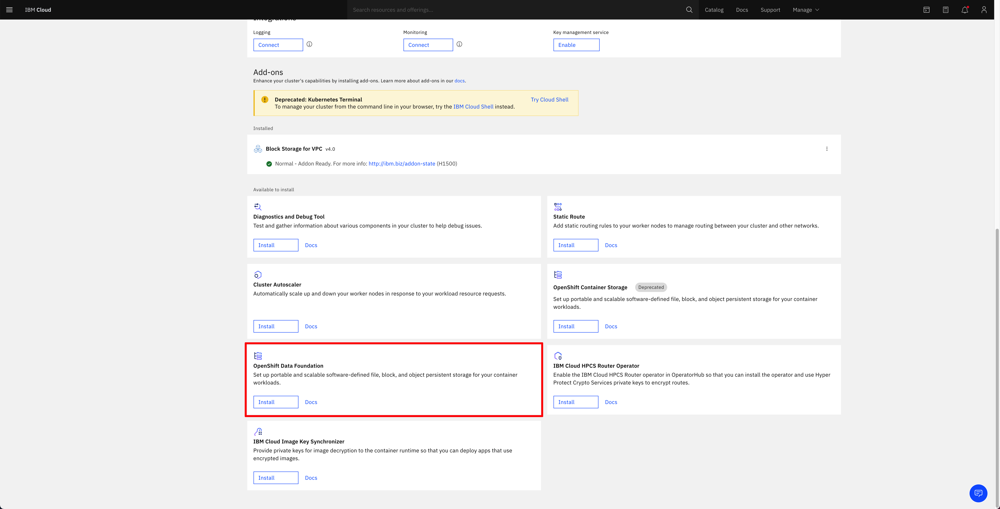
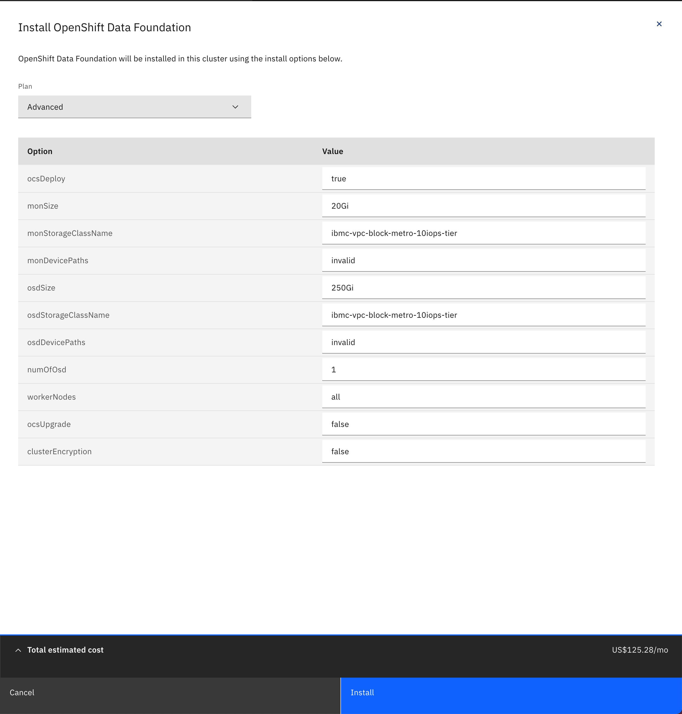
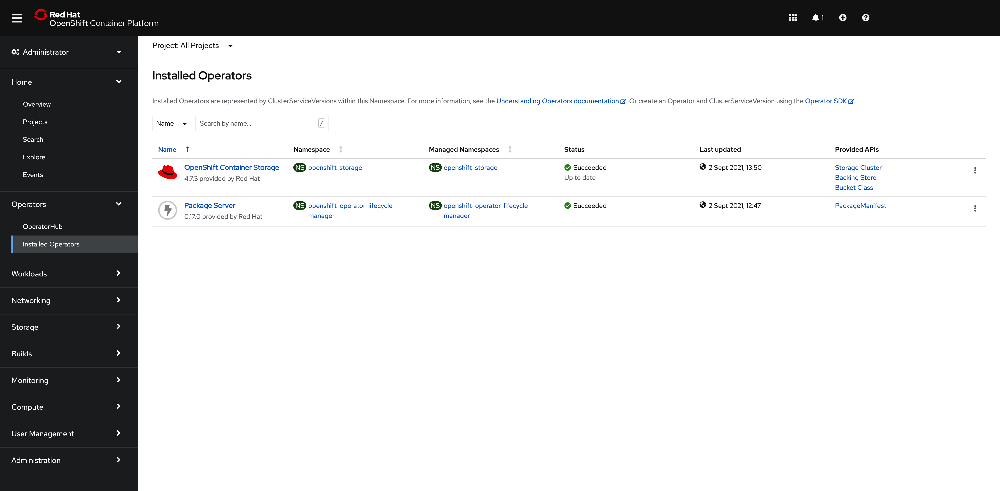
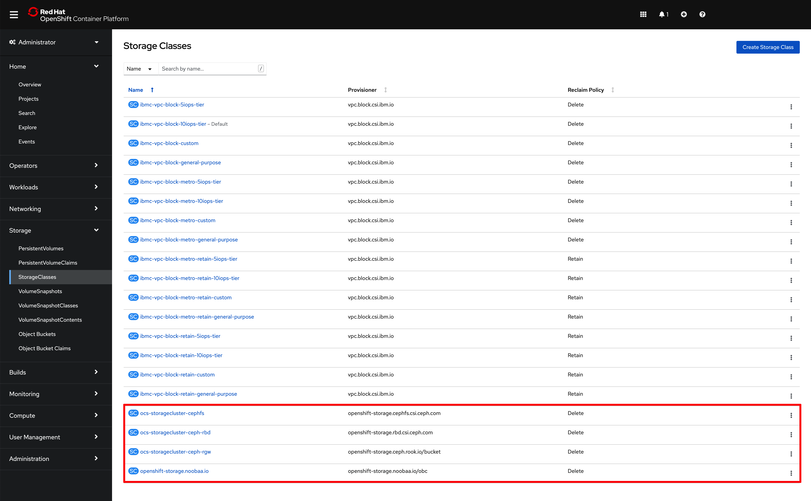

# Creating a cluster on IBM Cloud

<!--- cSpell:ignore storagecluster cephfs -->

!!! abstract
    This document explains what are the options to create a Red Hat OpenShift cluster on IBM Cloud.

## Create a Red Hat OpenShift cluster instance.

You can choose either IBM Technology Zone or your IBM Cloud account to create a Red Hat OpenShift cluster.

1. You can use IBM Technology Zone to request a Red Hat OpenShift cluster on IBM Cloud. See the instructions [here](../../../cp4i/mq/cluster-create/ibm-setup.md). The Red Hat OpenShift cluster on IBM Cloud you will be provided with will be hosted on **classic** infrastructure.
1. You can use your IBM Cloud account to create a new Red Hat OpenShift cluster following these instructions [here](https://cloud.ibm.com/docs/openshift?topic=openshift-getting-started). You can choose to create your Red Hat OpenShift cluster on IBM Cloud either on **classic** infrastructure or on **Virtual Private Cloud (VPC)** infrastructure.

!!! warning "Important"
    Make sure you create your Red Hat OpenShift cluster on IBM Cloud with the following specs as explained [here](../architecture/ibm-cloud.md#minimum-resources-required-for-ibm-process-mining):
        
      * OCP Version = **4.7**
      * Worker Size (at least) = **24 CPU x 96 GB RAM**
      * Worker Node Count (at least) = **1**
      * Storage = **200 GB**

!!! note
    Even though you do not require 3 worker nodes, since the IBM Process Mining instance you will deploy in this tutorial isn't a highly available IBM Process Mining instance due to the amount of resources required, the Red Hat OpenShift clusters you usually request or create come with 3 worker nodes for better high availability and resiliency purposes. Make sure you comply with the specs above when adding the resources of each worker node.

## Storage

As explained in the IBM Process Mining on IBM Cloud architecture section [here](../architecture/ibm-cloud.md), IBM Process Mining **[requires ReadWriteMany (RWX) storage](https://www.ibm.com/docs/en/cloud-paks/1.0?topic=platform-pre-installation-requirements)**.

Based on how you created your Red Hat OpenShift cluster on IBM Cloud explained in the previous section,

1. If you requested your Red Hat OpenShift cluster through IBM Technology Zone, this will be a Red Hat OpenShift cluster on IBM Cloud on **classic** infrastructure which an NFS drive will be attached to. The storage class name will be **managed-nfs-storage** and it is the default in the GitOps repositories that will drive the deployment of your IBM Process Mining instance which are explained in the next sections.
2. If you requested a Red Hat OpenShift cluster on IBM Cloud using your own IBM Cloud account,
    1. If you requested that Red Hat OpenShift cluster on IBM Cloud **classic** infrastructure, you will have [RWX storage available out of the box](https://cloud.ibm.com/docs/containers?topic=containers-storage_planning). However, you must use those file storage classes whose name ends with **-gid** to [allow non-root user access to persistent storage](https://cloud.ibm.com/docs/containers?topic=containers-cs_storage_nonroot), which is a requirement for the embedded IBM DB2 DB that IBM Process Mining will deploy (if using external IBM DB2 database, as explained in the IBM Process Mining on IBM Cloud architecture section [here](../architecture/ibm-cloud.md), you would not need to use the storage classes whose name ends with **-gid**. Just any file storage class)
    2. If you requested that Red Hat OpenShift cluster on IBM Cloud **Virtual Private Cloud (VPC)** infrastructure, you **must** enable OpenShift Data Foundation for your Red Hat OpenShift cluster. Review the IBM Process Mining on IBM Cloud architecture section [here](../architecture/ibm-cloud.md) for more details and go through the following OpenShift Data Foundation subsection to get it enabled on your Red Hat OpenShift cluster.

!!! tip "Remember"
    Do not forget the RWX storage class name based on the above as you will need to provide it when deploying your IBM Process Mining instance later in this tutorial.

### OpenShift Data Foundation

1. Once your RedHat OpenShift cluster on IBM Cloud Virtual Private Cloud infrastructure is available on your IBM Cloud dashboard, you must install the OpenShift Data Foundation add-on on it:
    1. From the OpenShift clusters console, select the cluster where you want to install the add-on.
    1. On the cluster Overview page, scroll down to the Add-ons section.
    1. On the OpenShift Data Foundation card, click Install.

    {: style="max-height:1200px"}

1. On the Install OpenShift Data Foundation configuration panel that opens, make sure of
    1. The parameter `ocsDeploy` is set to `true`
    1. The parameter `numOfOsd` is set to `1`
    1. The parameter `monStorageClassName` and `osdStorageClassName` is set to any of the **metro** storage classes provided by IBM Cloud as explained in the IBM Process Mining Architecture on IBM Cloud page [here](../architecture/ibm-cloud.md)
    
    {: style="max-height:1200px"}

1. Click Install. This should get OpenShift Data Foundation installation for your cluster started. After some time, you should see the OpenShift Data Foundation add-on under the installed subsection of the Add-ons section of your OpenShift cluster in the IBM Cloud web console with a green tick icon indicating the add-on is fine and ready (this process may take several minutes)

    {: style="max-height:1200px"}

1. If you go into your OpenShift cluster web console and go to `Operators --> Installed Operators` on the left hand side menu, you should see the OpenShift Container Storage (old name for OpenShift Data Foundation) operator installed
   
    {: style="max-height:1000px"}

1. Finally, if you go to `Storage --> Storage Classes` on the left hand side menu, you should see the following four new storage classes as a result of a successful OpenShift Data Foundation installation. These are the classes you should now use in your containerized workloads should you need File, Block or Object storage.

    {: style="max-height:1200px"}

And the storage class you would need to provide when deploying your IBM Process Mining instance later on in this tutorial would be **ocs-storagecluster-cephfs**

## Tools

In order to interact with your Red Hat OpenShift cluster(s) and complete this tutorial successfully, we strongly recommend to install the following tools in your workstation.

1. The `oc` command that matches the version of your cluster. Use these [instructions](https://docs.openshift.com/container-platform/4.7/cli_reference/openshift_cli/getting-started-cli.html) to get the latest version of `oc`. Use `oc version` to confirm that you have
    - `Client Version: 4.6` or higher
    - `Server Version: 4.7` or higher
1. The `npm`, `git`, `tree` and `jq` commands.