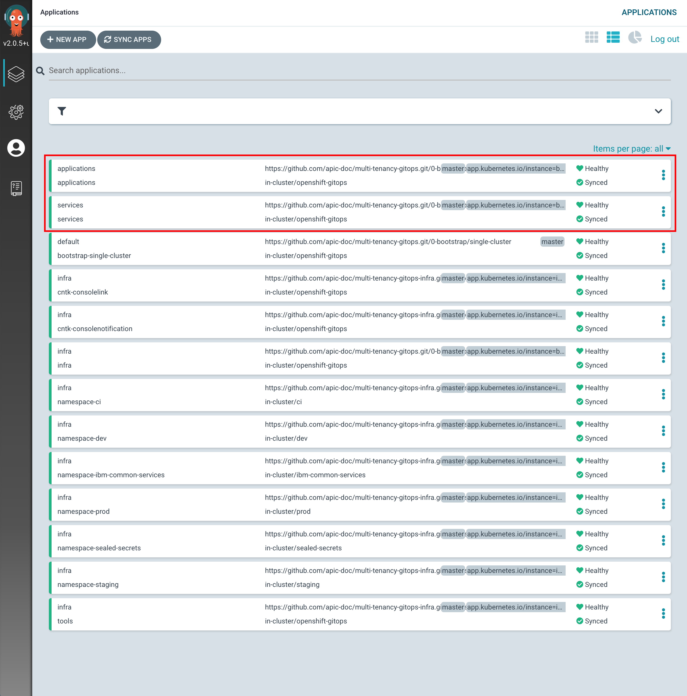
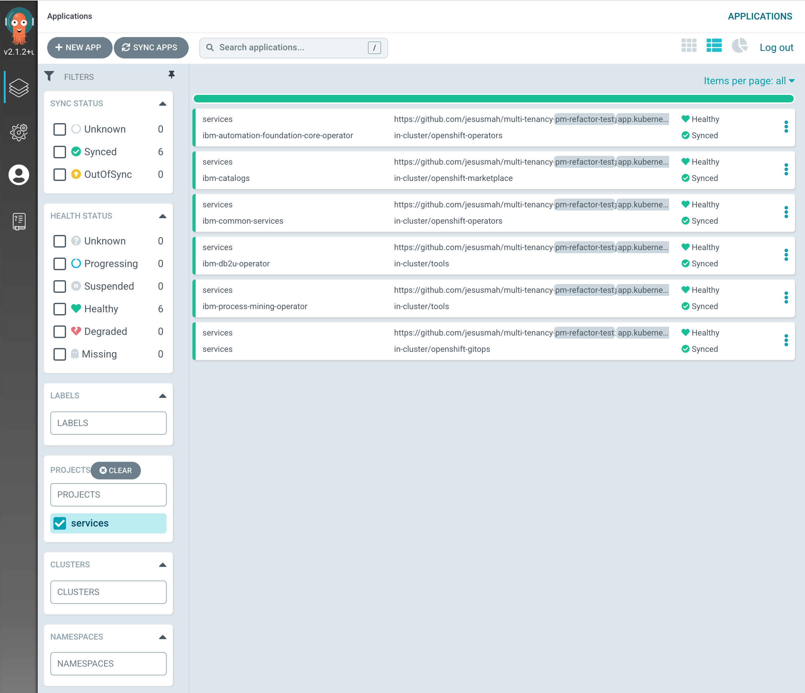
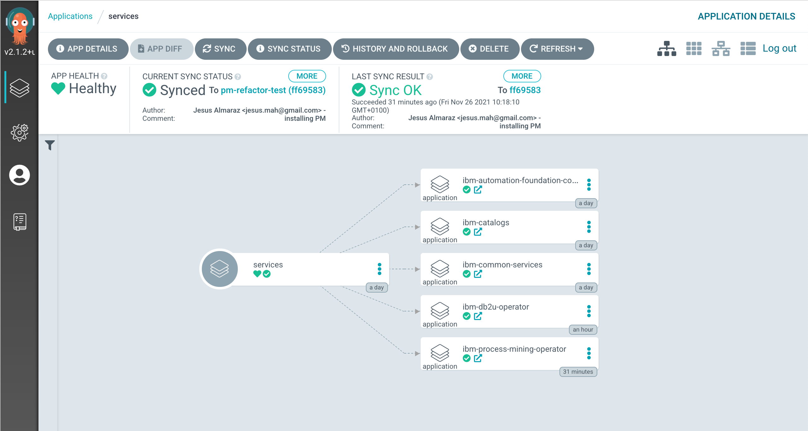
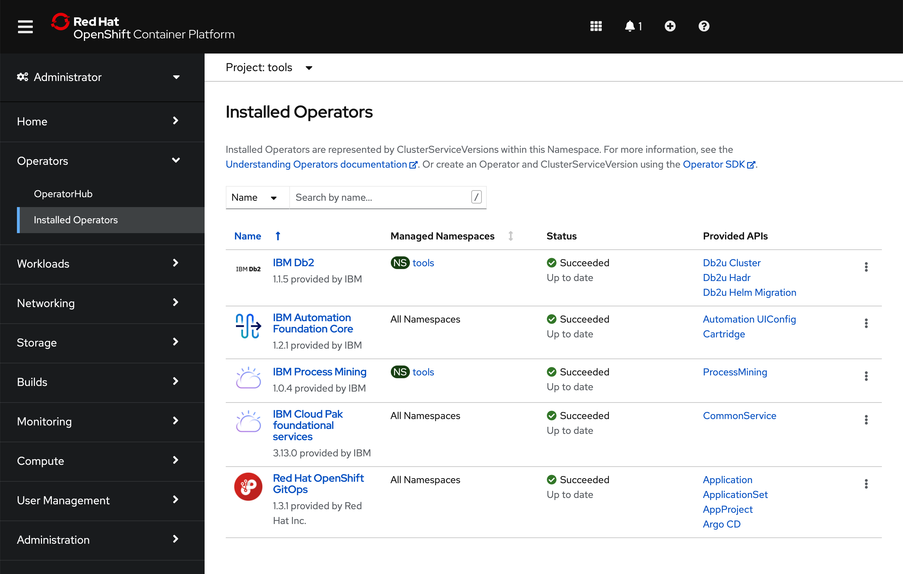
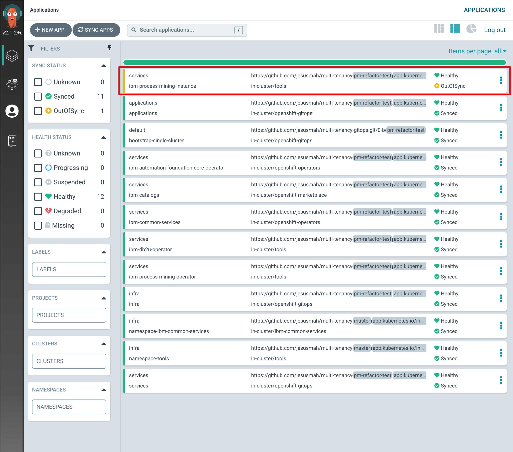
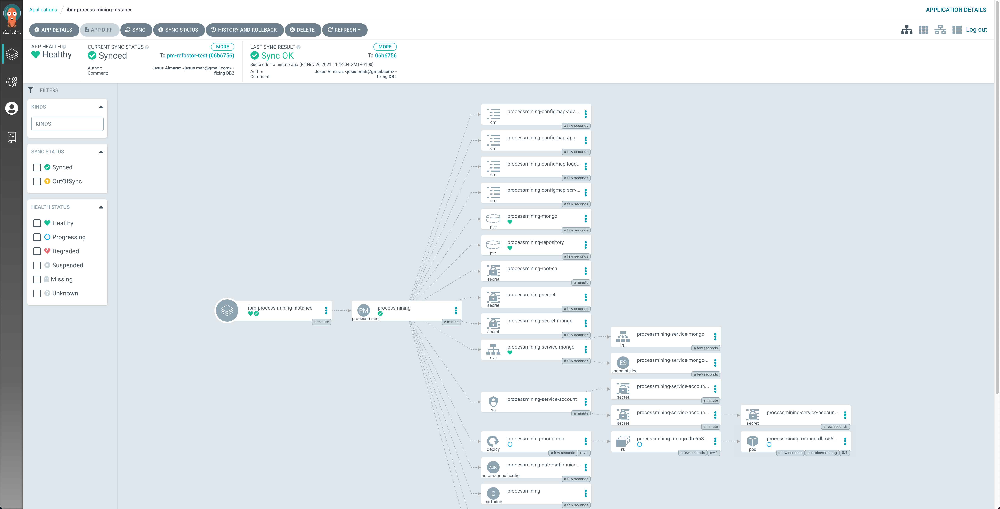
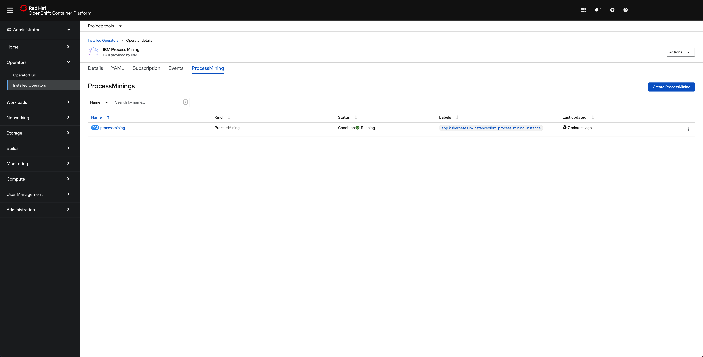
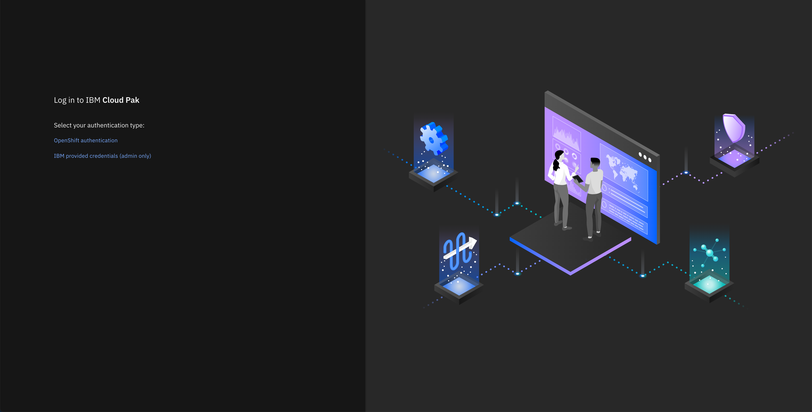
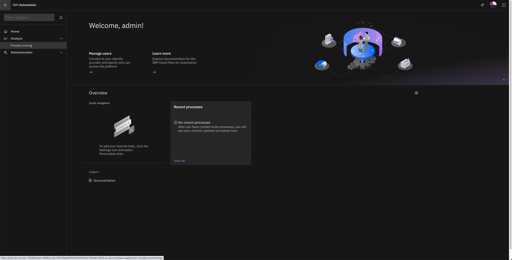
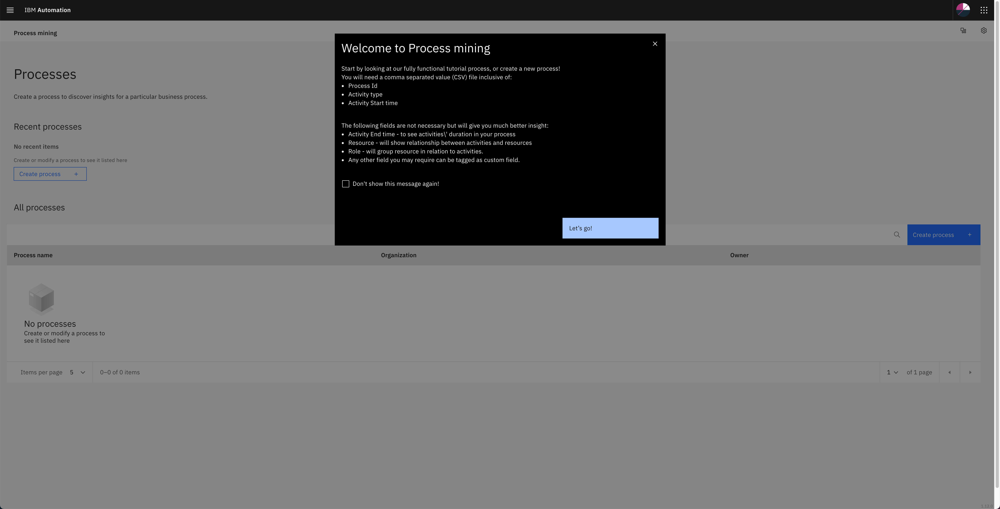

# Deployment on IBM Cloud

<!--- cSpell:ignore processmining -->

!!! danger "Important"
    This deployment automation of the IBM Process Mining on RedHat OpenShift Kubernetes Service is only supported for clusters running **OpenShift Container Platform version 4.7**

## Overview

In the previous chapter of this tutorial, you have worked with ArgoCD and the GitOps repositories to understand what these are and how these work together and interact amongst them. You have seen how to create ArgoCD applications that watch their respective GitOps repository folders for details of the resources they should apply to the cluster. You have seen how you can dynamically change deployed resources by updating the resource definition in their GitOps repository. Finally, you've experienced how ArgoCD keeps the cluster synchronized with the GitOps repository as the source of truth; any unexpected configuration drift will be corrected without intervention.

Now, in this section, you are going to look at what changes you need to do to that GitOps repository so that you get IBM Process Mining and all the components it needs/depends on deployed in your cluster.

## Services

You have seen in the previous chapter of this tutorial that in the `0-bootstrap/single-cluster/kustomization.yaml` file you have defined what layers out of `infra`, `services` and `apps` you want the main `bootstrap-single-cluster` ArgoCD application to watch. Before, you had it set up to watch only the `infra` layer. However, you now need it to watch the `services` and `apps` layers too in order to deploy IBM Process Mining and all the components it needs/depends on.

1. Ensure you are logged in to the cluster

    Start a terminal window and log into your OCP cluster, substituting the `--token` and `--server` parameters with your values:

    ```bash
      oc login --token=<token> --server=<server>
    ```

    If you are unsure of these values, click your user ID in the OpenShift web console and select "Copy Login Command".

1. Locate your GitOps repository

    If necessary, change to the root of your GitOps repository, which is typically
    `$HOME/git`.

    Issue the following command to change to your GitOps repository:

    ```bash
    cd $HOME/git
    cd multi-tenancy-gitops
    ```

1. Make sure the `infra`, `services` and `apps` layers are un-commented, and therefore active, for the main `bootstrap-single-cluster` ArgoCD application to watch them in the file `0-bootstrap/single-cluster/kustomization.yaml`

    ```yaml
    resources:
    - 1-infra/1-infra.yaml
    - 2-services/2-services.yaml
    - 3-apps/3-apps.yaml
    ```

1. Add all changes in the current folder to a git index, commit them, and push them to GitHub:

    ```bash
    git add .
    git commit -s -m "Adding services and applications layers"
    git push origin $GIT_BRANCH
    ```

1. If you go to your ArgoCD UI, you will see two new ArgoCD applications, one that will watch for resources on the `services` layer and another that will watch for resources on the `apps` layer.

    {: style="max-height:900px"}

    !!! tip
        You might want to manually sync your ArgoCD applications, instead of waiting for changes to get automatically picked up. For manually synchronize ArgoCD applications, you can click on the `SYNC APPS` button at the top. Then, select all the ArgoCD applications you want to get synched (or all for easiness) and click `SYNC`

You are now all set to start deploying IBM Process Mining and all the components it needs/depends on. However, you will do it in two steps. In the first step, you will deploy all of the components that IBM Process Mining needs/depends on. These are things like the IBM Operators catalog to be able to install IBM Operators, the IBM Foundations, IBM Automation Foundation Core, IBM DB2 and IBM Process Mining operators where the first three are a dependency of the IBM Process Mining operator.

To get all of that installed, all you need to do, in the same fashion you did for the components you wanted to get installed on the infra layer, is to un-comment these from the `0-bootstrap/single-cluster/2-services/kustomization.yaml` file.

1. Open the `0-bootstrap/single-cluster/2-services/kustomization.yaml` file and un-comment the following resources:

    ```yaml
    - argocd/operators/ibm-process-mining-operator.yaml
    - argocd/operators/ibm-db2u-operator.yaml
    - argocd/operators/ibm-foundations.yaml
    - argocd/operators/ibm-automation-foundation-core-operator.yaml
    - argocd/operators/ibm-catalogs.yaml
    ```

1. Add all changes in the current folder to a git index, commit them, and push them to GitHub:

    ```bash
    git add .
    git commit -s -m "Installing services"
    git push origin $GIT_BRANCH
    ```

1. If you go to your ArgoCD UI and filter by `services` project on the left hand side, you will now see the new ArgoCD applications you have just specified in your code above to be created.
   
    {: style="max-height:900px"}

1. If you click on the `services` main ArgoCD application, you will see that it has created five new ArgoCD applications that correspond to each of the components we have un-commented and therefore bring to active state in the `0-bootstrap/single-cluster/2-services/kustomization.yaml` file.

    {: style="max-height:600px"}

1. After 5-10 mins, if you go to your Red Hat OpenShift web console and click on `Operators --> Installed Operators` on the right hand side menu and select the the `tools` project on the pull down menu at the top bar, you will see that the IBM Db2, IBM Automation Foundation Core, IBM Process Mining and IBM Cloud Pak foundational services have been successfully installed already (apart from the OpenShift GitOps operator that was installed previously). Not only that but should also be able to realise that the IBM Db2 and IBM Process Mining operators have been installed on the `tools` namespace as opposed to in all namespaces like the rest of the operators and this is, as already explained, a limitation of the IBM Db2 operator that must be installed per namespace.

    {: style="max-height:700px"}

## IBM Process Mining

Last step, is to get an IBM Process Mining instance created through the IBM Process Mining operator. However, before being able to deploy any IBM capability we must have an IBM Entitlement Key to be able to pull IBM software down from IBM's software registry available in the Red Hat OpenShift project where we are deploying such IBM capability.

1. Log in to [MyIBM Container Software Library](https://myibm.ibm.com/products-services/containerlibrary) with an IBMid and password associated with the entitled software.  
1. Select the **View library** option to verify your entitlement(s). 
1. Select the **Get entitlement key** to retrieve the key.
1. Create a secret containing your IBM Entitlement Key in the `tools` namespace (which is where the IBM Process Mining operator has been installed/deployed into and where the IBM Process Mining instance it will create afterwards will end up into as a result). 

    ```bash
    oc create secret docker-registry ibm-entitlement-key -n tools \
    --docker-username=cp \
    --docker-password="<entitlement_key>" \
    --docker-server=cp.icr.io
    ```

1. Link that `docker-registry` secret containing your IBM Entitlement Key with the default secret for pulling Docker images within your Red Hat OpenShift project

    ```bash
    oc secrets link default ibm-entitlement-key --for=pull
    ```

Finally, to get an IBM Process Mining instance created, all you need to do is to make sure that the definition of the IBM Process Mining instance you want to deploy is correct on your GitOps repository and then, once again, tell the ArgoCD application that is watching over the `services` layer to activate such resource. This resource will, in turn, create another ArgoCD application that will watch over the resources specified in your definition of the IBM Process Mining instance.

1. Open the `0-bootstrap/single-cluster/2-services/kustomization.yaml` file and un-comment the following resource:

    ```yaml
    - argocd/instances/ibm-process-mining-instance.yaml
    ```

1. Make sure the **storage** settings for your IBM Process Mining instance you are about to deploy are correct based on where you requested/created your Red Hat OpenShift cluster on IBM Cloud. **Please, review the [Create the cluster section](../cluster-create/ibm-cloud.md#storage) to understand what storage class you must ensure your IBM Process Mining instance definition is configured with**. You can adjust storage settings in `0-bootstrap/single-cluster/2-services/argocd/instances/ibm-process-mining-instance.yaml` with the `defaultStorageClassName` property.

1. Add all changes in the current folder to a git index, commit them, and push them to GitHub:

    ```bash
    git add .
    git commit -s -m "Installing an IBM Process Mining instance"
    git push origin $GIT_BRANCH
    ```

1. If you go to your ArgoCD UI, you will now see the new `ibm-process-mining-instance` ArgoCD application.

    {: style="max-height:900px"}

1. If you go into that ArgoCD application, you can monitor the IBM Process Mining instance installation. You will see how Red Hat OpenShift resources are being created as a result of having the `ibm-process-mining-instance` ArgoCD application created the initial `ProcessMining` resource, which was then picked up by the IBM Process Mining operator.

    {: style="max-height:1000px"}

1. If you go to `Operators --> Installed Operators` under the `tools` project, click on the `IBM Process Mining` operator and then on the `ProcessMining` tab, you should see the `processmining` `ProcessMining` object.

    {: style="max-height:1000px"}

#### IBM Db2 IBM Entitlement Key

IBM DB2 requires certain privileges in order to properly run in Red Hat OpenShift. As a result, the IBM Db2 operator creates a specific privileged Red Hat OpenShift Service Account that the IBM Db2 pods will use to run in. However, in order for that Red Hat OpenShift Service Account to be able to pull the IBM Software images from the IBM Software registry, it needs to be provided with the IBM Entitlement Key. You can see that IBM Db2 pods are not running on your cluster at the moment by getting the pods within the `tools` project with `oc get pods`. You should see the IBM Db2 pods with a `ImagePullBackOff` status:

```text
NAME                                                         READY   STATUS             RESTARTS   AGE
c-processmining-db2-instdb-n7mdp                             0/1     ImagePullBackOff   0          8m17s
c-processmining-db2-ldap-766c5bd4cf-8zkn7                    0/1     ImagePullBackOff   0          8m19s
...
```

If you describe any of those IBM Db2 pods with `oc describe pod c-processmining-db2-xxxxx` you should see the following events at the very bottom:

```text
Events:
  Type     Reason          Age                 From               Message
  ----     ------          ----                ----               -------
  Normal   Scheduled       20m                 default-scheduler  Successfully assigned tools/c-processmining-db2-instdb-n7mdp to 10.13.177.6
  Normal   AddedInterface  20m                 multus             Add eth0 [172.30.14.251/32]
  Normal   Pulling         18m (x4 over 20m)   kubelet            Pulling image "cp.icr.io/cp/db2u.instdb@sha256:17a854b803ba50b14ce332223a0023e49817bb919e961e829a9b219e5257efc6"
  Warning  Failed          18m (x4 over 20m)   kubelet            Failed to pull image "cp.icr.io/cp/db2u.instdb@sha256:17a854b803ba50b14ce332223a0023e49817bb919e961e829a9b219e5257efc6": rpc error: code = Unknown desc = unable to retrieve auth token: invalid username/password: unauthorized: The login credentials are not valid, or your IBM Cloud account is not active.
  Warning  Failed          18m (x4 over 20m)   kubelet            Error: ErrImagePull
  Warning  Failed          10m (x39 over 20m)  kubelet            Error: ImagePullBackOff
  Normal   BackOff         37s (x82 over 20m)  kubelet            Back-off pulling image "cp.icr.io/cp/db2u.instdb@sha256:17a854b803ba50b14ce332223a0023e49817bb919e961e829a9b219e5257efc6"
```

where you would find messages about not being able to pull the IBM Db2 images due to not being able to `retrieve auth token` in the first place. And what that means is that, as already explained, the Red Hat OpenShift Service Account the IBM Db2 creates to run its pods in needs to be provided with the IBM Entitlement Key.

Ideally, when you created the IBM Entitlement Key secret above, you could have added such credentials to the Red Hat OpenShift Global Pull Secret that is available to all Red Hat OpenShift projects and Service Accounts which is what the IBM Db2 Operator official documentation in the IBM Knowledge Center [here](https://www.ibm.com/docs/en/db2/11.5?topic=ido-installing-from-command-line) explains. However, IBM Red Hat OpenShift Kubernetes Service clusters, like the one you are using here, requires a reload of their worker nodes in order for that Red Hat OpenShift Global Pull Secret to be updated. Since that would add some unneeded complexity to this tutorial, you are going to simply add the existing IBM Entitlement Key credentials to the Red Hat OpenShift Service Account the IBM Db2 Operator created to run its pods in very much like you did for the `default` Red Hat OpenShift Service Account earlier when you created the IBM Entitlement Key secret.

In order to find out what is the Red Hat OpenShift Service Account that the IBM Db2 operator created, execute the following command in your terminal:

```text
oc get ServiceAccount
```

you should see a service account called `account-<project>-<process_mining_instance_name>-db2` which in our case should be, if you did not change any of the defaults of this tutorial, `account-tools-processmining-db2`.

You can inspect what `imagePullSecrets` a service account is provided with to pull software down from container registries using 

```text
oc get sa <service_account_name> -o jsonpath='{.imagePullSecrets}'
```

If you use that command with the `account-tools-processmining-db2` service account, you will see that the `ibm-entitlement-key` secret is not included. To include such secret into the `imagePullSecrets` property of the `account-tools-processmining-db2` you can execute:

```text
oc secrets link account-tools-processmining-db2 ibm-entitlement-key --for=pull
```

Once you have done that you can check again the `imagePullSecrets` property of the `account-tools-processmining-db2` service account to make sure the `ibm-entitlement-key` is now listed in there. Last step to get the IBM Db2 pods to properly deploy is to delete the existing IBM Db2 pods so that the IBM Db2 operator re-deploys these but now the Red Hat OpenShift Service Account responsible for doing that should have the IBM Entitlement Key available to successfully pull down IBM Db2 container images. You can delete your existing IBM Db2 pods executing:

```text
for i in `oc get pods -n tools | grep processmining-db2 | awk '{print $1}'`; do oc delete pod $i -n tools; done
```

After 10 minutes or so, you should see all your pods running fine:

```text
$ oc get pods -n tools

NAME                                                         READY   STATUS             RESTARTS   AGE
c-processmining-db2-db2u-0                                   1/1     Running            0          2m8s
c-processmining-db2-etcd-0                                   1/1     Running            0          7m34s
c-processmining-db2-instdb-tzjjt                             0/1     Completed          0          8m55s
c-processmining-db2-ldap-766c5bd4cf-rc9st                    1/1     Running            0          8m47s
c-processmining-db2-restore-morph-4sxnf                      1/1     Running            0          2m33s
create-secrets-job-8cd9r                                     0/1     Completed          0          48m
db2u-operator-manager-5f6b49c9b4-mxgvb                       1/1     Running            0          175m
iaf-zen-tour-job-lwd54                                       0/1     Completed          0          27m
iaf-zen-tour-job-mnfsk                                       0/1     Completed          0          27m
iam-config-job-n2gh9                                         0/1     Completed          0          32m
ibm-nginx-7cd694dc97-2mzzl                                   1/1     Running            0          27m
ibm-nginx-7cd694dc97-rzbcx                                   1/1     Running            0          27m
processmining-analytics-9759f477-rjl6d                       1/1     Running            0          50m
processmining-bpa-694885c44f-jg6t6                           1/1     Running            0          50m
processmining-connectors-5c96d94966-c4tmd                    1/1     Running            0          50m
processmining-dr-749f85bc75-rsvnb                            1/1     Running            0          50m
processmining-engine-bdb99bb49-dh56c                         0/1     Running            0          50m
processmining-mongo-db-65888cb58b-p8zf2                      1/1     Running            0          52m
processmining-operator-controller-manager-7fd5669999-gdc5k   1/1     Running            0          138m
processmining-processmining-nginx-7c8f8cb467-9l9t5           1/1     Running            0          52m
processmining-processmining-um-84b5c7d9c6-wfkr2              1/1     Running            0          50m
setup-nginx-job-tv87p                                        0/1     Completed          0          41m
usermgmt-578588d5f8-8v7ml                                    1/1     Running            0          32m
usermgmt-578588d5f8-jqwvz                                    1/1     Running            0          32m
zen-audit-59546cb554-zl5j9                                   1/1     Running            0          37m
zen-core-7bfbcbf949-bq2pj                                    1/1     Running            0          37m
zen-core-7bfbcbf949-r7drl                                    1/1     Running            0          37m
zen-core-api-557d8f574b-7xpss                                1/1     Running            0          37m
zen-core-api-557d8f574b-twkpm                                1/1     Running            0          37m
zen-metastoredb-0                                            1/1     Running            0          45m
zen-metastoredb-1                                            1/1     Running            0          45m
zen-metastoredb-2                                            1/1     Running            0          45m
zen-metastoredb-certs-bh4dz                                  0/1     Completed          0          47m
zen-metastoredb-init-pl8b2                                   0/1     Completed          0          45m
zen-post-requisite-job-7l6ch                                 0/1     Completed          0          35m
zen-pre-requisite-job-chgzf                                  0/1     Completed          0          37m
zen-watcher-7b695c76d6-xd7j5                                 1/1     Running            0          37m
```

!!! tip
    As you can see you have not deployed a highly available instance of IBM Process Mining. The reason for this is the amount of resources that it requires. However, the GitOps process and steps would exactly be the same for a highly available deployment of IBM Process Mining. If you wanted a highly available deployment of IBM Process Mining, you can find the ProcessMining Custom Resource Definition for it in the IBM Process Mining official documentation in the IBM Knowledge Center [here](https://www.ibm.com/docs/en/cloud-paks/1.0?topic=platform-custom-resource-definition) and you would need to apply that in `0-bootstrap/single-cluster/2-services/argocd/instances/ibm-process-mining-instance.yaml`

### Accessing IBM Process Mining

You can access the IBM Process Mining User Interface by first accessing the IBM Cloud Pak Dashboard. To find your IBM Cloud Pak Dashboard url you simple get the Red Hat OpenShift Routes in your `tools` Red Hat OpenShift Project, which is where you have deployed your IBM Process Mining Instance:

```text
$ oc get routes -n tools

NAME               HOST/PORT                                                PATH   SERVICES                         PORT                   TERMINATION            WILDCARD
cpd                cpd-tools.xxxx.containers.appdomain.cloud                       ibm-nginx-svc                    ibm-nginx-https-port   passthrough/Redirect   None
processmining-pm   processmining-pm-tools.xxxx.containers.appdomain.cloud          processmining-service-web        7443-tcp               reencrypt/Redirect     None
processmining-tm   processmining-tm-tools.xxxx.containers.appdomain.cloud          processmining-service-tm-nginx   8443-tcp               reencrypt/Redirect     None
```

The route you are interested on that you should point your browser to is called `cpd`. Open that url on your web browser:

{: style="max-height:1000px"}

Click on `IBM provided credentials (admin only)` to log in with your IBM Cloud Pak credentials. Your username will be `admin` and you can find the password with the following command:

```text
oc -n ibm-common-services get secret platform-auth-idp-credentials -o jsonpath='{.data.admin_password}' | base64 -d && echo
```

Once you are in the IBM Cloud Pak Dashboard, click on the hamburger icon on the top left corner to open the `Navigation Menu`. In there, click on `Analyze` and then in `Process Mining`.

{: style="max-height:1000px"}

You should get redirected to your IBM Process Mining instance User Interface.

{: style="max-height:1000px"}

!!! success
    You have now completed the in-depth IBM Process Mining tutorial. You have successfully deployed IBM Process Mining on a RedHat OpenShift Kubernetes Service (ROKS) cluster using GitOps