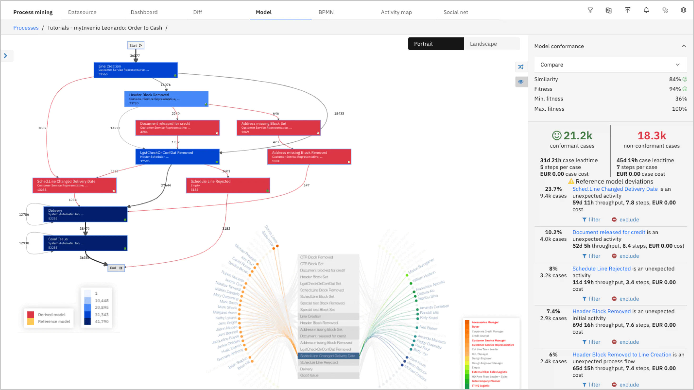

# IBM Process Mining

<!--- cSpell:ignore Invenio automations hyperautomation unmanaged practioners Pak Paks Quickstart qube cntk autoplay allowfullscreen -->

## IBM Process Mining powered by myInvenio

IBM Process Mining is a process mining solution that automatically discovers, constantly monitors, and optimizes business processes. Process mining uses business system data to create and visualize an end-to-end process that includes all the process activities involved along with the various process paths. Businesses can easily analyze the discovered process to gain actionable insights for process improvement.

Simulation is a feature of IBM Process Mining that businesses can use to test unlimited process changes. Simulation combines historical data with contextual data, like decision rules, to create what-if scenarios that are then analyzed for incredibly fast and simple results. Simulation shows how process changes affect future process behavior along with new benefits and reliable ROI. Businesses can also create simulations from scratch without the need for historical data so that processes can be tested and successfully introduced to business operations with immediate benefits.

IBM Process Mining facilitates process automation by finding the best process candidates for automation, calculating expected ROI, and showing the impact of automation initiatives on the entire process before implementation. IBM Task Mining integrates with IBM Process Mining for a better understanding of how manual processes impact the business process. IBM Task Mining captures and sends real user interaction data to IBM Process Mining to create an augmented process model. The result is deeper insights for automation projects than what process mining alone can provide.

IBM Process Mining is a component of the IBM Automation Foundation.

{: style="max-height:1000px"}

## What is IBM Automation foundation?

IBM Automation foundation is an intelligent automation platform. IBM Automation foundation is aimed at providing Artificial Intelligence (AI) or Machine Learning (ML), and Robotic Process Automation (RPA) driven hyperautomation solutions to users who are looking to resolve challenges and inefficiencies in business and IT processes.

IBM Automation foundation provides a foundation for the IBM Cloud Paks for Automation. Each Cloud Pak is a domain-specific set of capabilities that augments it. IBM Automation foundation provides the user interface which IBM Cloud Paks extend. 

IBM Cloud Paks with IBM Automation foundation together provide an intelligent automation platform that provides AI/ML-assisted automation recommendations, and RPA-driven automations for users who are looking to resolve their challenges and inefficiencies in business and IT processes.

Red Hat® OpenShift® Container Platform provides the secure and stable infrastructure for Automation foundation.

You are entitled to use process mining in the context of one of the IBM Cloud Pak (IBM Cloud Pak for Business Automation, IBM Cloud Pak for Integration, IBM Cloud Pak for Network Automation, IBM Cloud Pak for Watson AI Ops). If you do not want to install the Cloud Pak, you can still deploy the Process Mining.
  
## Links

- [IBM Cloud Pak for Business Automation](https://www.ibm.com/cloud/cloud-pak-for-business-automation)
- [IBM Cloud Pak for Business Automation - Process Mining](https://www.ibm.com/cloud/cloud-pak-for-business-automation/process-mining)
- [IBM Automation Foundation](https://www.ibm.com/docs/en/cloud-paks/1.0?topic=automation-foundation)
- [IBM Process Mining](https://www.ibm.com/docs/en/cloud-paks/1.0?topic=foundation-process-mining)