# Cloud Pak for Data Deployment

<!--- cSpell:ignore Ceph singl apiconnectcluster ibmc APIC Availability unmanaged practioners Pak Paks Quickstart qube cntk autoplay allowfullscreen -->


## CPD Deployment on IBM Cloud

--8<-- "cpd_intro_snippet.md"

### 1 - Prereqs

1. Obtain a clean RedHat OpenShift cluster where nothing else has been installed on top. This RedHat OpenShift cluster must be composed of five worker nodes where three of these will be entirely dedicated to OpenShift Data Foundation (ODF). The storage nodes must be 16 CPUs and 64 GB RAM at least.

    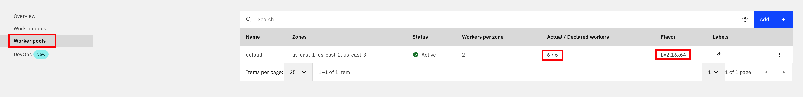

1. Once your RedHat OpenShift cluster is available on your IBM Cloud dashboard, you must install the OpenShift Data Foundation add-on:
    1. From the OpenShift clusters console, select the cluster where you want to install the add-on.
    1. On the cluster Overview page, click Add-ons.
    1. On the OpenShift Data Foundation card, click Install.
    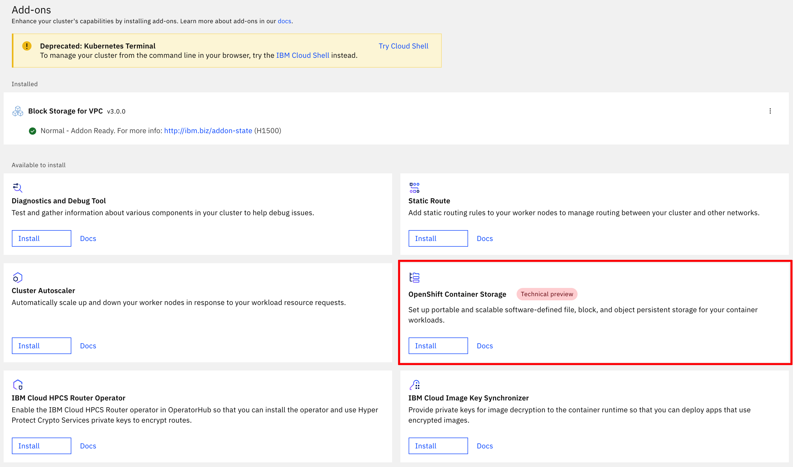

1. On the cluster Nodes page, select one node per availability zone and write down it's IP address.

    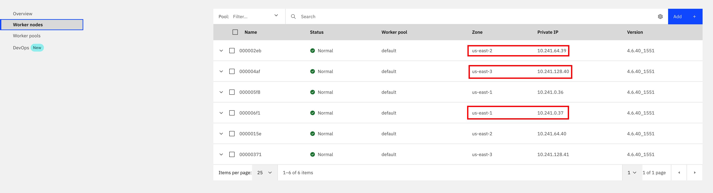

1. Log into your RedHat OpenShift web console using the button on the top right corner of your cluster dashboard on IBM Cloud.

1. Go to the Compute --> Nodes section on the navigation index on the left hand side and for each of the nodes you picked in the previous step:

    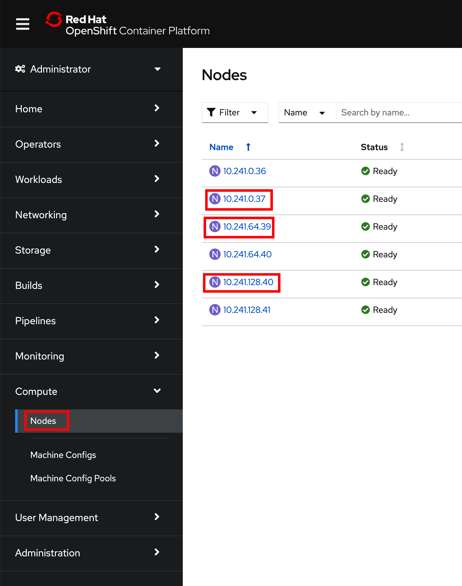{: style="max-height:750px"}

    1. Click on the node and in its Node Details dashboard, click on the Actions drop down menu that appears on the top right corner and select Edit Labels.
    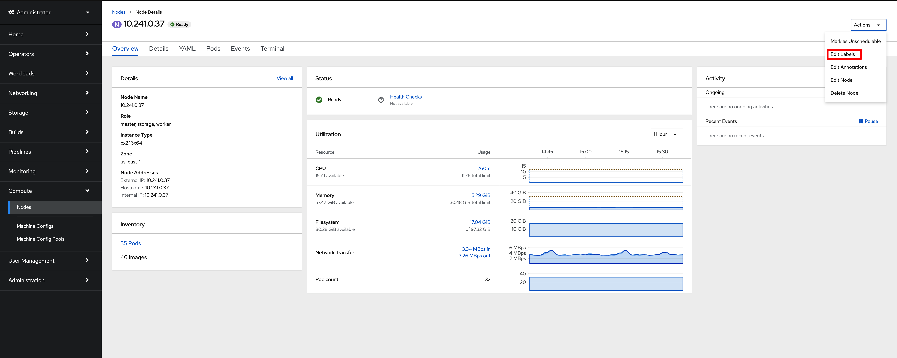
    1. Type `node-role.kubernetes.io/storage=true` and hit enter to add that label to the node. Click Save.
    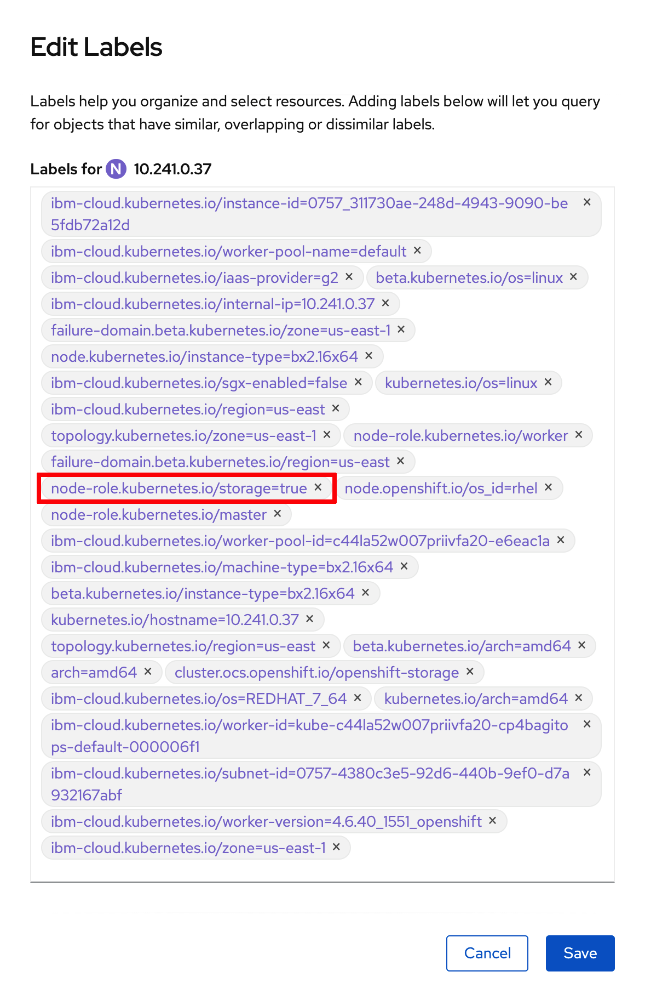{: style="max-height:800px"}

1. Once you have completed the process above for the three nodes you selected to be entirely dedicated to storage, you should see such role in the Compute --> Nodes section of your RedHat OpenShift cluster.

    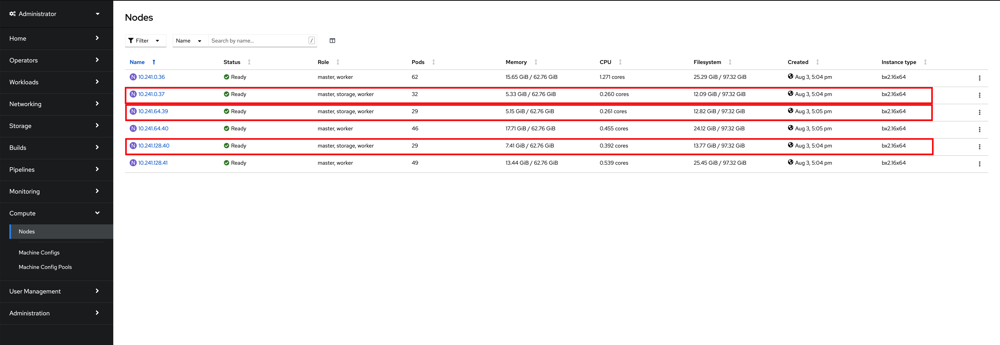

1. Log into your RedHat OpenShift cluster through the RedHat OpenShift CLI in order to execute commands to interact with it through your terminal.

### 2 - Sealed Secrets

--8<-- "cpd_sealed_secrets.md"

### 3 - RedHat OpenShift GitOps Operator

1. Clone the following GitHub repository that contains the GitOps structure that the Cloud Native Toolkit GitOps Framework understands.

    ```
    git clone https://github.com/cloud-native-toolkit-demos/multi-tenancy-gitops-cp4d.git
    ```

1. Change directory into `multi-tenancy-gitops-cp4d`.

    ```
    cd multi-tenancy-gitops-cp4d
    ```

1. Install the RedHat OpenShift GitOps operator on your RedHat OpenShift cluster and wait for it to be available:

    * If your RedHat OpenShift cluster version is 4.6
    ```
    oc apply -f setup/ocp46/
    while ! kubectl wait --for=condition=Established crd applications.argoproj.io; do sleep 30; done
    ```
    * If your RedHat OpenShift cluster version is 4.7
    ```
    oc apply -f setup/ocp47/
    while ! kubectl wait --for=condition=Established crd applications.argoproj.io; do sleep 30; done
    ```

    Once the above command returns, you can open your RedHat OpenShift Web Console and check out that the RedHat OpenShift GitOps operator has been successfully installed in the `openshift-gitops` project.

    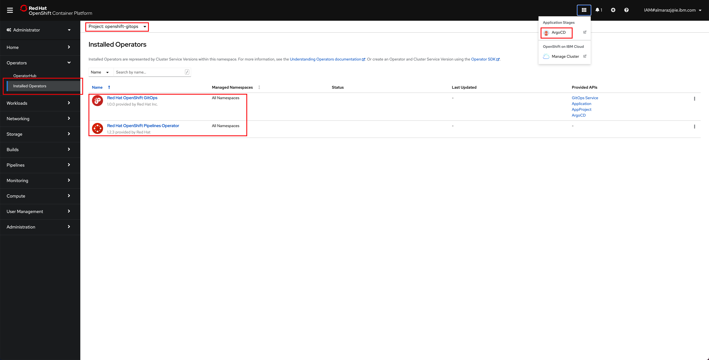

    As you can see in the image, the RedHat OpenShift GitOps operator also installs the RedHat OpenShift Pipelines operator and ArgoCD (which will be that GitOps tool that synchronizes the Infrastructure/Configuration as Code we have stored in GitHub with the state of the RedHat OpenShift cluster). 
  
    !!! note "Important"
        The RedHat OpenShift Pipelines operator gets installed by the RedHat OpenShift GitOps Subscription **only for RedHat OpenShift version 4.6**. If your RedHat OpenShift cluster is version 4.7, you will need to install the RedHat OpenShift Pipelines operator as part of the GitOps process explained in this section. For getting such RedHat OpenShift Pipelines operator installed, you would need to specify that in the `kustomize.yaml` file for the services layer [here](https://github.com/cloud-native-toolkit-demos/multi-tenancy-gitops-cp4d/blob/kustomize/0-bootstrap/argocd/single-cluster/2-services/kustomization.yaml#L66-L67).

1. Once ArgoCD is deployed, get the `admin` password

    * If your RedHat OpenShift cluster version is 4.6
    ```
    oc extract secrets/argocd-cluster-cluster --keys=admin.password -n openshift-gitops --to=-
    ```
    * If your RedHat OpenShift cluster version is 4.7
    ```
    oc extract secrets/openshift-gitops-cluster --keys=admin.password -n openshift-gitops --to=-
    ```

1. Open the ArgoCD web console by clicking on the ArgoCD console link you can see at the top of your RedHat OpenShift web console and log in.

    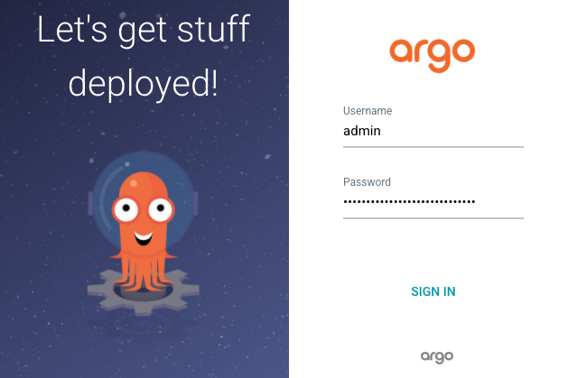


1. Once you login, you should see that your ArgoCD web console is empty as we have not deployed any Argo Application yet.

    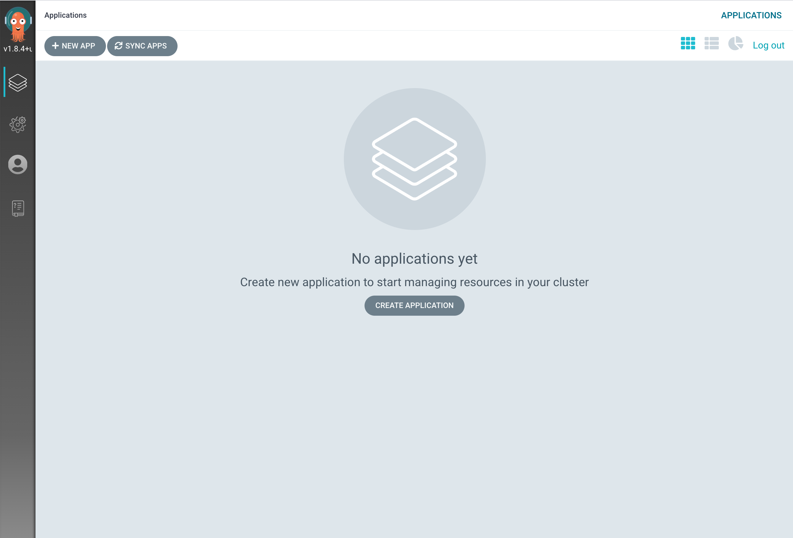

### 4 - IBM Cloud Pak for Data

1. Before deploying an instance of IBM Cloud Pak for Data on the RedHat OpenShift cluster, we need to provide the storage node's IP addresses to the configuration of the OpenShift Data Foundation operator. You can provide custom configuration to the OpenShift Data Foundation operator in the `ibm-odf.yaml` file you can find in this IBM Cloud Pak for Data GitOps GitHub repository that was cloned at the beginning under `multi-tenancy-gitops-process-mining/0-bootstrap/argocd/single-cluster/1-infra/argocd`. Edit that file and provide your storage node's IP addresses to the `worker_ip_X` configuration parameters for the OpenShift Data Foundation operator.

    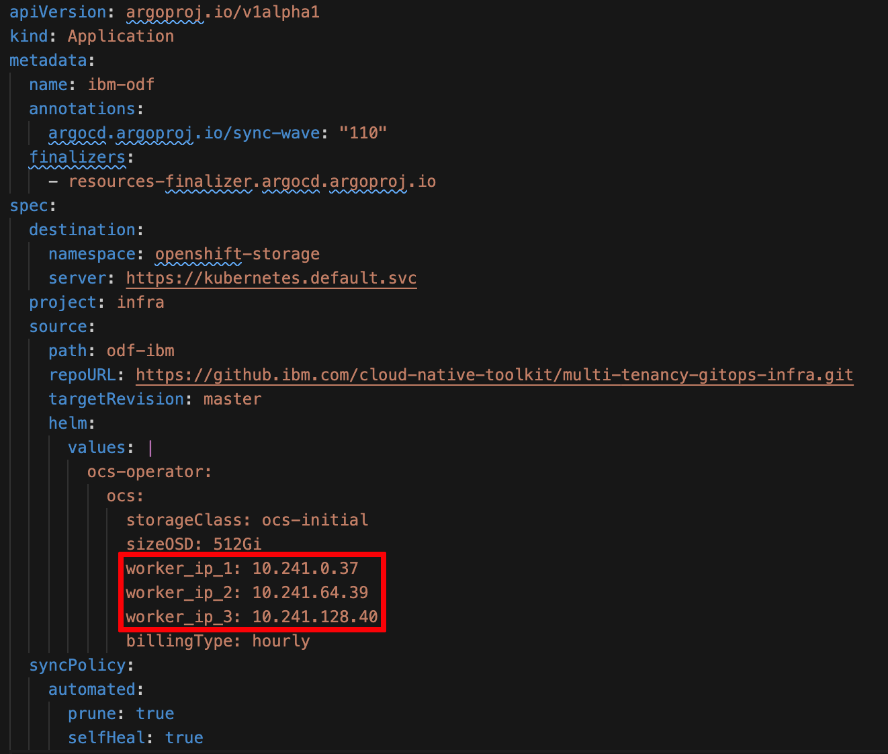{: style="max-height:750px"}

1. Install the ArgoCD Bootstrap Application

    ```
    oc apply -n openshift-gitops -f 0-bootstrap/argocd/bootstrap.yaml
    ```

    This ArgoCD Bootstrap Application will bootstrap the deployment of IBM Process Mining based on the configuration you have defined in the GitOps GitHub repository we cloned earlier. You can see that we integrate [Kustomize](https://kustomize.io/) for configuration management in the GitOps approach.

    As soon as you create this ArgoCD Bootstrap Application, the rest of the ArgoCD Applications and the respective RedHat Openshift resources these manage start to get created as a result of the synchronization process the GitOps approach is based on. You can see these ArgoCD Applications being created in the ArgoCD web console.

    

1. If you go to the Operators --> Installed Operators section of your RedHat OpenShift cluster web console and select the `openshift-storage` project in the Project drop down list at the top, you will see that the OpenShift Container Storage operator (which has been recently renamed to OpenShift Data Foundation) is being installed.

1. If you go to the Workloads --> Pods section of your RedHat OpenShift cluster web console you should see pods being created as a result of the OpenShift Container Storage operator being told to create an OpenShift Container Storage Cluster.

1. After some time, you should see the OpenShift Container Storage operator successfully installed

    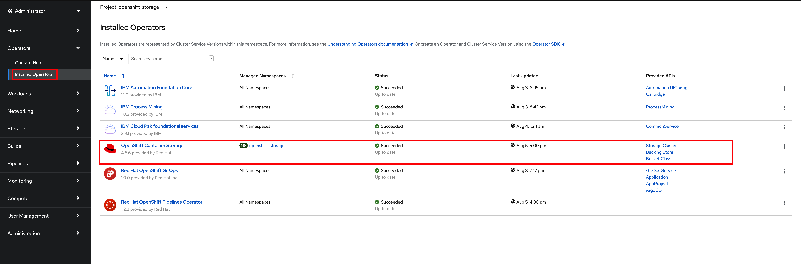

    and the following new Storage Classes available on the Storage --> Storage Classes section of your RedHat OpenShift cluster web console

    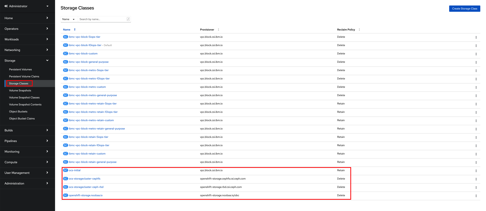

    that will be used by the IBM Process Mining operator to create an IBM Process Mining instance.

1. If you go again to the Operators --> Installed Operators section of your RedHat OpenShift cluster web console and select the `openshift-operators` project in the Project drop down list at the top, you should see that the IBM Process Mining operator has been successfully installed as well as the IBM Automation Foundation Core and IBM Cloud Pak foundational services operators it depends on.

    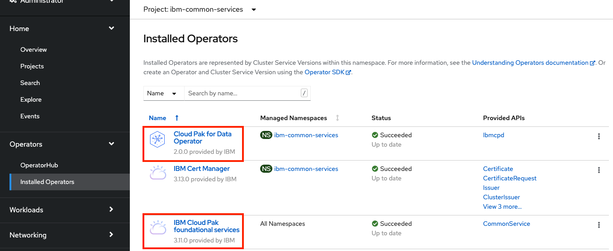

1. If you go to the Operators --> Installed Operators section of your RedHat OpenShift cluster web console and select the `prod` project in the Project drop down list at the top, since in our IBM Process Mining GitOps process we have configured the IBM Process Mining instance to be deployed in the `prod` project, and click on the IBM Process Mining operator and then on the Process Mining tab, you should see the IBM Process Mining instance and that this is Running and Ready.

    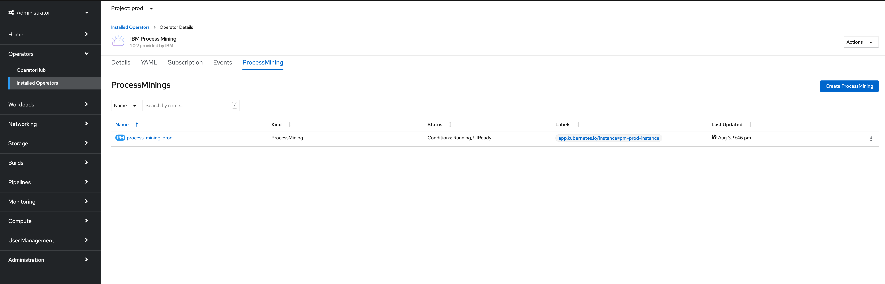

1. If you go back to the ArgoCD web console, you should see all of the Argo Application in green.

    

### 5 - IBM Cloud Pak for Data UI
<!--- 
Let's make sure that our IBM Cloud Pak for Data instance is up and running. Do that by logging into the IBM Cloud Pak for Data user interface.

1. Go to the Networking -> Routes section of your RedHat OpenShift cluster web console and select the `prod` project in the Project drop down list at the top. You should see a Route called `cpd`. Now, click on the `Location` value for that Route.

    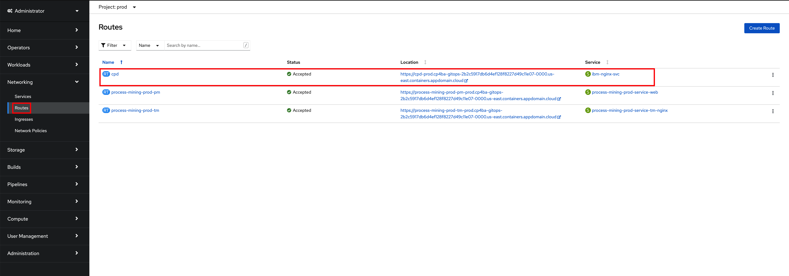

1. You will be presented with the IBM Cloud Pak for Data user interface login option. Select `IBM provided credentials (admin only)`.

    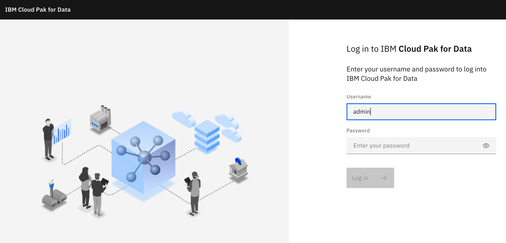

1. Obtain IBM Cloud Pak for Data administrator credentials by executing

    ```
    oc -n ibm-common-services get secret platform-auth-idp-credentials -o jsonpath='{.data.admin_password}' | base64 -d && echo
    ```

1. Log into the IBM Cloud Pak for Data UI using the credentials from previous step.

    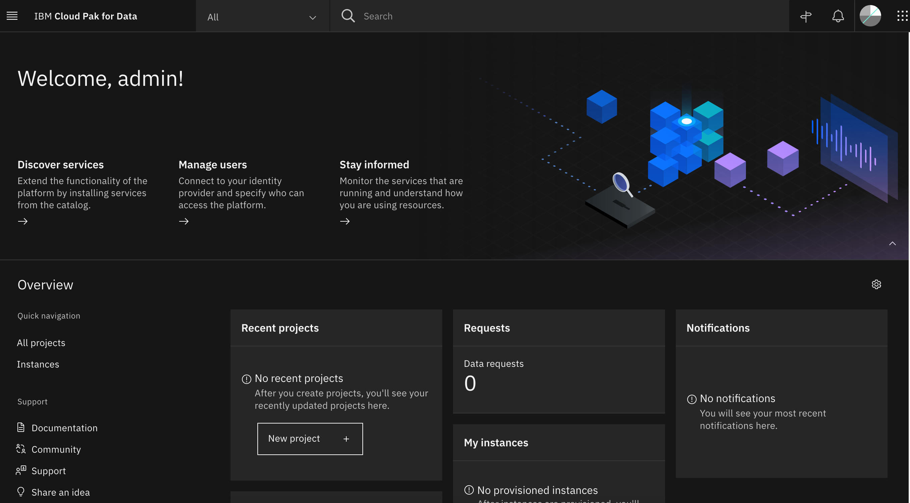

1. Click on the navigation menu icon on the top left corner. Click on Services menu option to expand it, then select Services catalog.

    { width=50% }

1. The various services installed with IBM Cloud Pak for Data will be displayed.

    

That is it to get a working instance of IBM Cloud Pak for Data.
--->

--8<-- "cpd_ui_snippet.md"
