# Cloud Pak for Data Deployment

<!--- cSpell:ignore cpdbase fyre cloudpak Ceph singl apiconnectcluster ibmc APIC Availability unmanaged practioners Pak Paks Quickstart qube cntk autoplay allowfullscreen -->


## CPD Deployment on-premises

Here we document the deployment of [Cloud Pak for Data](https://www.ibm.com/support/producthub/icpdata/docs/content/SSQNUZ_latest/cpd/plan/deployment-environments.html) in an on-premises environment running RedHat OpenShift v4.6 or higher. 

<!--- the [RedHat OpenShift Kubernetes Service on IBM Cloud](https://www.ibm.com/cloud/openshift), known as ROKS, on [Virtual Private Cloud (VPC) Gen 2](https://www.ibm.com/cloud/vpc) infrastructure. --->

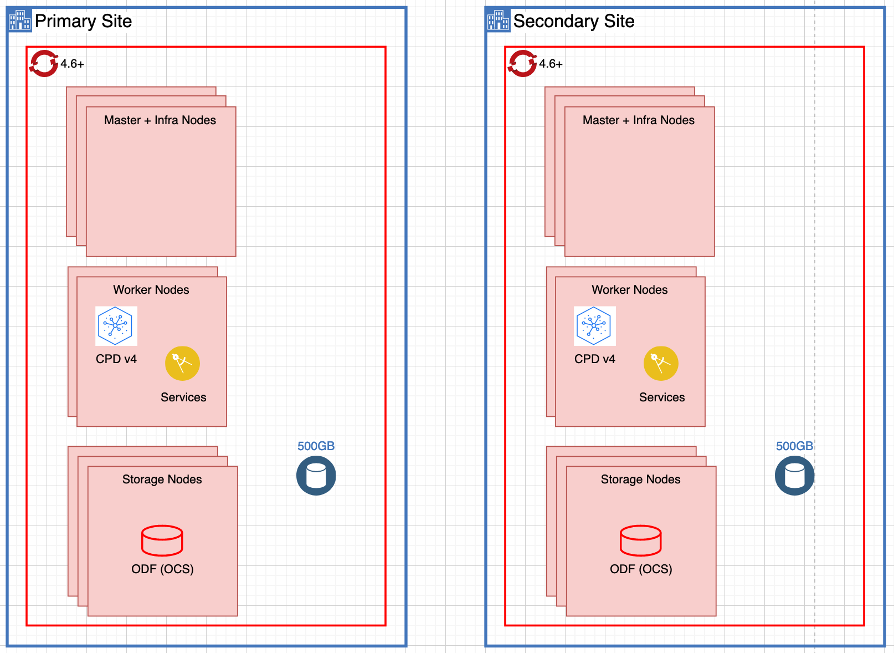

We start with a large RedHat OpenShift cluster with 3 Master nodes and 5 Worker nodes, deployed on-prem. Three of those worker nodes are tagged as Storage nodes.

--8<-- "cpd_intro_snippet.md"

### 1 - Prereqs

1. Provision a `Large OCP+ Cluster` from [Technology Zone](https://techzone.ibm.com/collection/fyre-ocp-clusters)

    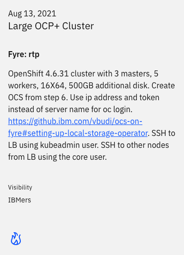{: style="max-height:500px"}

1. Select `Reserve now` for immediate provisioning of cluster.

    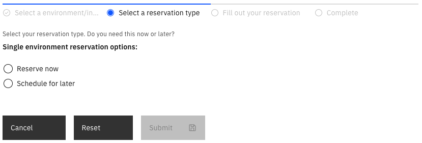{: style="max-height:280px"}

1. Fill the form and Submit.

    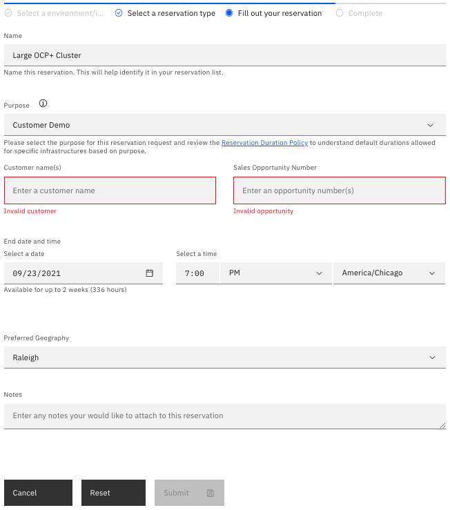{: style="max-height:740px"}

1. Check the status of the cluster from My library > My reservations on the top left corner of your Technology Zone dashboard.

    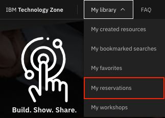{: style="max-height:230px"}

1. Once the Status of your cluster is `Ready`, open the cluster tile from My reservations page, note down the URL for RedHat OpenShift web console, load balancer IP address and the password to the cluster. Your username is `kubeadmin`.

1. Login to your cluster using `oc` CLI

    ```bash
    oc login -u kubeadmin -p <password> api.<clustername>.cp.fyre.ibm.com:6443
    ```
   or using token obtained from RedHat OpenShift web console

    ```bash
    oc login --token=<token> --server=https://api.<clustername>.cp.fyre.ibm.com:6443
    ```

1. Set up local storage operator as per these [instructions](https://github.ibm.com/vbudi/ocs-on-fyre#setting-up-local-storage-operator).

1. Set up OpenShift Container Storage as per these [instructions](https://github.ibm.com/vbudi/ocs-on-fyre#install-openshift-container-storage).


### 2 - Sealed Secrets

--8<-- "cpd_sealed_secrets.md"

### 3 - RedHat OpenShift GitOps Operator

1. Clone the following GitHub repository that contains the GitOps structure that the Cloud Native Toolkit GitOps Framework understands.

    ```
    git clone https://github.com/cloud-native-toolkit-demos/multi-tenancy-gitops-cp4d.git
    ```

1. Change directory into `multi-tenancy-gitops-cp4d`.

    ```
    cd multi-tenancy-gitops-cp4d
    ```

1. Install the RedHat OpenShift GitOps operator on your RedHat OpenShift cluster and wait for it to be available:

    * If your RedHat OpenShift cluster version is 4.6
    ```
    oc apply -f setup/ocp46/
    while ! kubectl wait --for=condition=Established crd applications.argoproj.io; do sleep 30; done
    ```
    * If your RedHat OpenShift cluster version is 4.7
    ```
    oc apply -f setup/ocp47/
    while ! kubectl wait --for=condition=Established crd applications.argoproj.io; do sleep 30; done
    ```

    Once the above command returns, you can open your RedHat OpenShift Web Console and check out that the RedHat OpenShift GitOps operator has been successfully installed in the `openshift-gitops` project.

    

    As you can see in the image, the RedHat OpenShift GitOps operator also installs the RedHat OpenShift Pipelines operator and ArgoCD (which will be that GitOps tool that synchronizes the Infrastructure/Configuration as Code we have stored in GitHub with the state of the RedHat OpenShift cluster). 
  
    !!! note "Important"
        The RedHat OpenShift Pipelines operator gets installed by the RedHat OpenShift GitOps Subscription **only for RedHat OpenShift version 4.6**. If your RedHat OpenShift cluster is version 4.7, you will need to install the RedHat OpenShift Pipelines operator as part of the GitOps process explained in this section. For getting such RedHat OpenShift Pipelines operator installed, you would need to specify that in the `kustomize.yaml` file for the services layer [here](https://github.com/cloud-native-toolkit-demos/multi-tenancy-gitops-cp4d/blob/kustomize/0-bootstrap/argocd/single-cluster/2-services/kustomization.yaml#L66-L67).

1. Once ArgoCD is deployed, get the `admin` password

    * If your RedHat OpenShift cluster version is 4.6
    ```
    oc extract secrets/argocd-cluster-cluster --keys=admin.password -n openshift-gitops --to=-
    ```
    * If your RedHat OpenShift cluster version is 4.7
    ```
    oc extract secrets/openshift-gitops-cluster --keys=admin.password -n openshift-gitops --to=-
    ```

1. Open the ArgoCD web console by clicking on the ArgoCD console link you can see at the top of your RedHat OpenShift web console and log in.

    


1. Once you login, you should see that your ArgoCD web console is empty as we have not deployed any Argo Application yet.

    

### 4 - IBM Cloud Pak for Data

1. Install the ArgoCD Bootstrap Application

    ```
    oc apply -n openshift-gitops -f 0-bootstrap/argocd/bootstrap.yaml
    ```

    This ArgoCD Bootstrap Application will bootstrap the deployment of IBM Cloud Pak for Data based on the configuration you have defined in the GitOps GitHub repository we cloned earlier. You can see that we integrate [Kustomize](https://kustomize.io/) for configuration management in the GitOps approach.

    As soon as you create this ArgoCD Bootstrap Application, the rest of the ArgoCD Applications and the respective RedHat Openshift resources these manage start to get created as a result of the synchronization process the GitOps approach is based on. You can see these ArgoCD Applications being created in the ArgoCD web console.

    

1. If you go to the Operators > Installed Operators section of your RedHat OpenShift cluster web console and select the `ibm-common-services` project in the Project drop down list at the top, you should see that the Cloud Pak for Data Operator has been successfully installed as well as the IBM Cloud Pak foundational services.

    

1. If you go to the Home > Search section of your RedHat OpenShift cluster web console and select the `cloudpak` project in the Project drop down list at the top, since in our Cloud Pak for Data GitOps process we have configured the IBM Cloud Pak for Data instance to be deployed in the `cloudpak` project, and search for `ZenService` in `Resources`, you should see `ZenService` listed.

    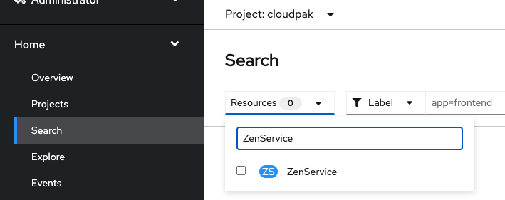{: style="max-height:280px"}

1. Select the listed `ZenService` resource and you should see lite-cr listed.

    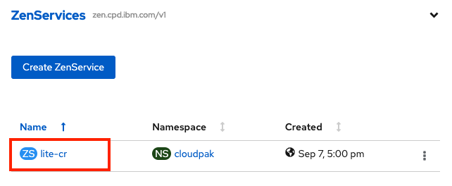{: style="max-height:265px"}

1. Click on the `lite-cr` link and you should see it Running and Successful.

    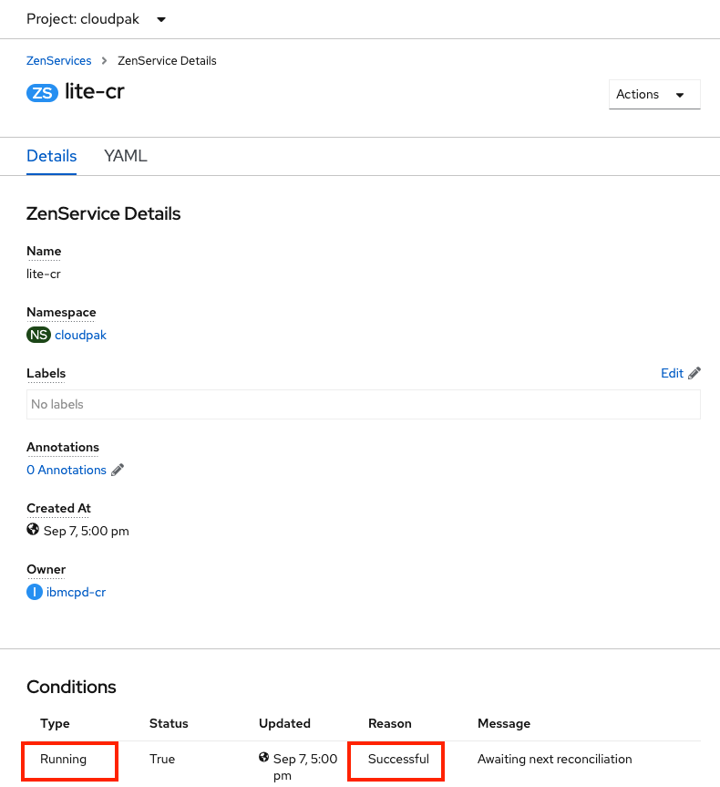{: style="max-height:860px"}

1. If you go back to the ArgoCD web console, you should see all of the Argo Application in green.

    

### 5 - IBM Cloud Pak for Data UI

<!---
Verify that Cloud Pak for Data instance is up and running by logging into the IBM Cloud Pak for Data user interface.

1. Go to the Networking -> Routes section of your RedHat OpenShift cluster web console and select the `prod` project in the Project drop down list at the top. You should see a Route called `cpd`. Now, click on the `Location` value for that Route.

    

1. You will be presented with the IBM Automation platform user interface login option. Select `IBM provided credentials (admin only)`.

    

1. Get your IBM Automation platform admin credentials by executing

    ```
    oc -n ibm-common-services get secret platform-auth-idp-credentials -o jsonpath='{.data.admin_password}' | base64 -d && echo
    ```

1. Log into the IBM Automation platform using the credentials from previous step.

    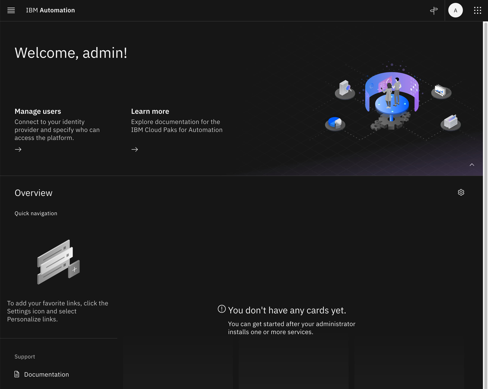

1. Click on the navigation menu icon on the top left corner to get that navigation menu displayed. Finally, click on Process Mining under the Analyze section.

    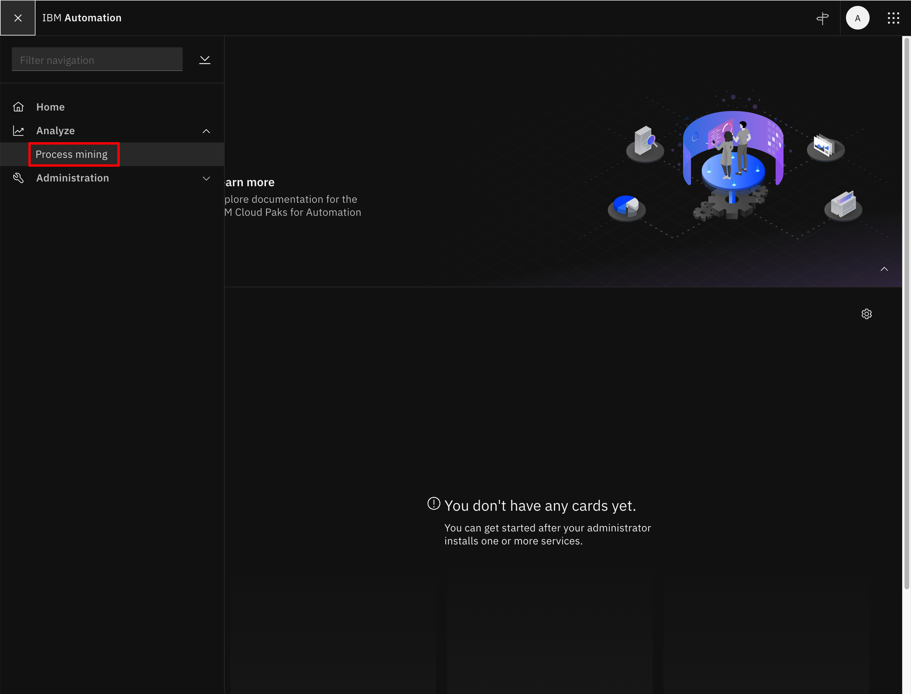

1. You should now be able to see the IBM Process Mining web console and start working with it.

    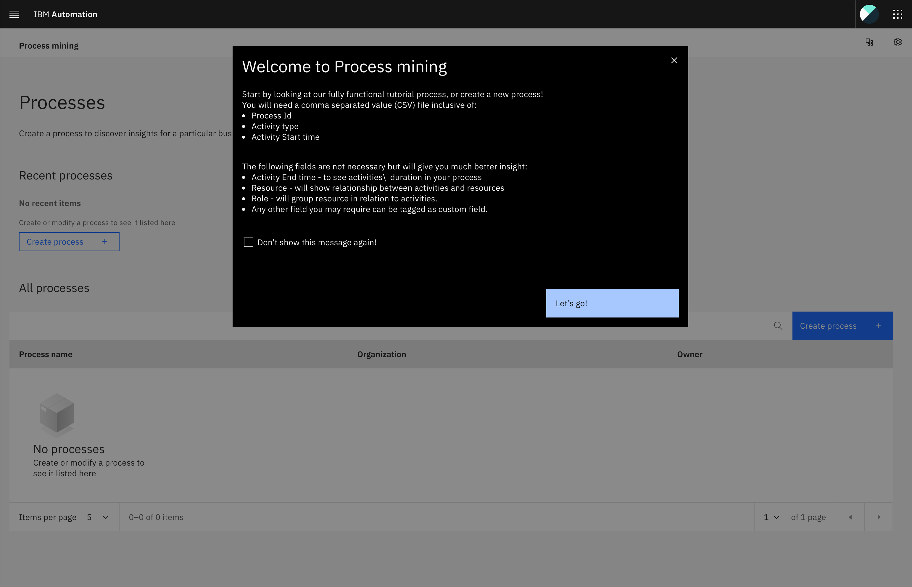
--->

--8<-- "cpd_ui_snippet.md"
