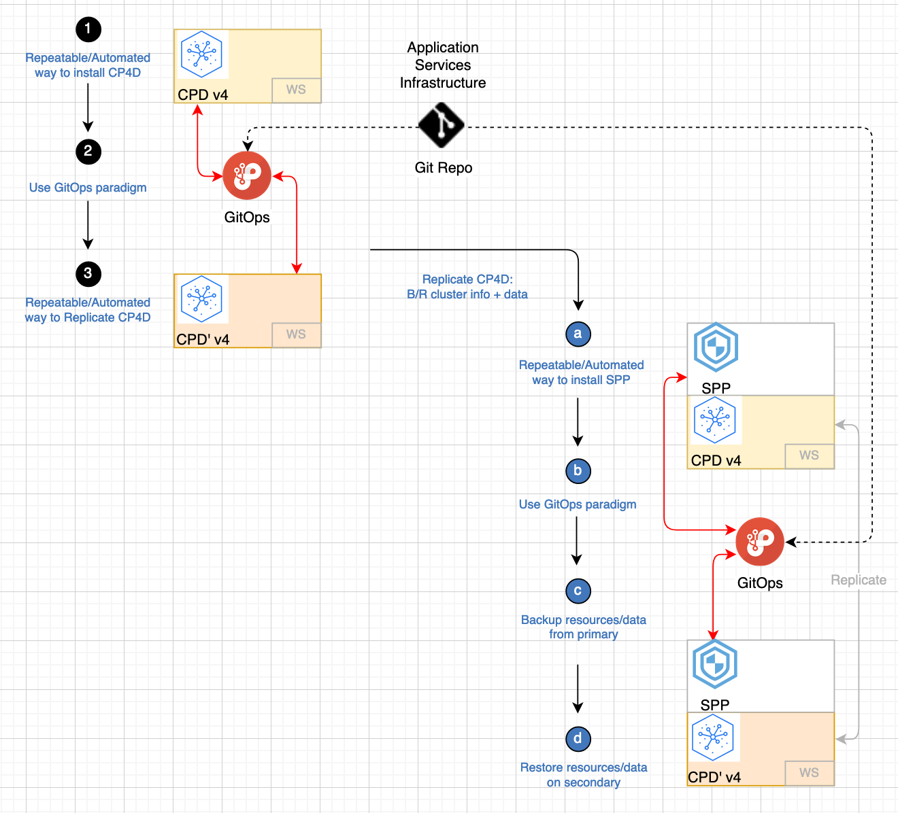
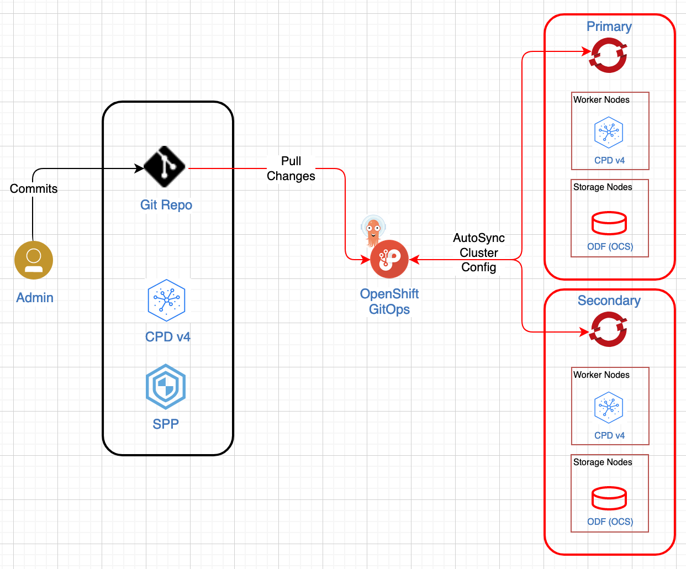

# IBM Cloud Pak for Data

<!--- cSpell:ignore OADP Velero Invenio automations hyperautomation unmanaged practioners Pak Paks Quickstart qube cntk autoplay allowfullscreen -->

## Putting your data to work quickly and efficiently
IBM Cloud Pak for Data can run on a Red Hat® OpenShift® cluster, whether it's behind a firewall or on the cloud. Red Hat® OpenShift® Container Platform provides the secure and stable infrastructure. If most of the enterprise data lives behind a firewall, it makes sense to put the applications that access the data behind the firewall to prevent accidentally sharing the data.

* On the cloud
    
    Deploy Cloud Pak for Data on an OpenShift cluster on IBM Cloud, AWS, Microsoft Azure, or Google Cloud.

* On premises
    
    Run Cloud Pak for Data on your private, on-premises cluster.

## Objective
The objective of these production deployments is to address non-functional requirements (NFRs) like continuous availability, disaster recovery, backup and restore, and security. There are 2 major steps to achieve that:

1. Quickly and consistently deploy a production topology.
1. Backup all data associated with the cluster and instance and restore that data in a new environment.

The goal is to provide customers the ability to recover as quickly as possible in case of a major disaster like a ransomware attack.

## Data & Storage
Given that this cloud pak is all about data, one of the main challenges in restoring to a new environment is to move all the data over. Backing up the data is part of the task, restoring that data in the proper schema and sequence is the harder task. For that we use OpenShift APIs for Data Protection (OADP), an operator that Red Hat has created to create backup and restore APIs in the OpenShift cluster. OADP installs Velero and OpenShift plugins for Velero while providing APIs to backup and restore OpenShift cluster resources (yaml files), internal images and persistent volume data. Red Hat has not added, removed or modified any of the APIs as documented in the Velero upstream project. 

We recommend using **IBM Spectrum Protect Plus** (SPP) to provide the complete backup and restore solution. IBM Spectrum Protect Plus is a data resilience solution that provides recovery, replication, retention, and reuse for VMs, databases, applications, file systems, SaaS workloads, and containers in hybrid cloud environments.

## Entitlements
The following three license types are available for Cloud Pak for Data:

- Trial license for non-production use
- Standard Edition
- Enterprise Edition

For starters, you can use the Red Hat® OpenShift® license bundled with your Cloud Pak for Data entitlement. 

A Cloud Pak for Data entitlement API key is needed to download images from the IBM entitled Cloud Pak registry. If you want to try things out, you can create a 60 day trial subscription key. You can retrieve your entitlement key from the container software library.

## Deployments
Cloud Pak for Data can be deployed in various private cloud and public cloud environments.

- On-premises Private Cloud
- IBM Cloud
- Amazon Web Services (AWS) Infrastructure as a service
- Microsoft Azure Infrastructure as a service
- Google Cloud
- Cloud Pak for Data System

## Operators
The GitOps approach is facilitated by the use of operators. Three Cloud Pak for Data operators are available:

- Cloud Pak for Data Foundational Services Operator
- Cloud Pak for Data Operator with Services
- Cloud Pak for Data Bootstrap Operator

The steps to install either of these operators is the same. We recommend using the **Cloud Pak for Data Bootstrap Operator** because it allows administrators to install the service or services that they choose.

## GitOps
All deployments are done using the GitOps framework. The GitOps approach is used to create and manage production environments. That way, any interaction with your production environment will be done through committing changes to Infrastructure, Configuration, etc., as Code. This is stored in a SCM repository such as GitHub that describes the desired state of your cluster. The task to apply any needed changes to the production environment is left to the GitOps tools, such as the RedHat OpenShift GitOps operator that uses ArgoCD for the mentioned task.

{ height=50% }