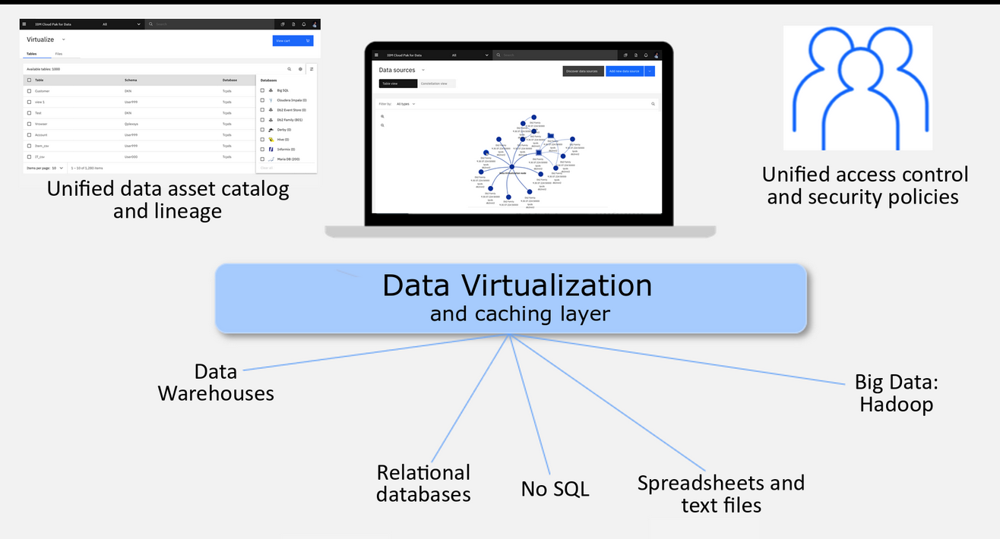

# Data Virtualization

<!--- cSpell:ignore storagecluster cephfs portworx Portworx ibmc automations hyperautomation unmanaged practioners Pak Paks Quickstart qube cntk autoplay allowfullscreen -->

## Virtual Data View

Data Virtualization (DV) connects multiple data sources across locations and turns all of this data into one logical data view. DV service is used to create data sets from different data sources so that you can query and use the data as if it came from a single source.

## Information about Data Virtualization

Data Virtualization service is included with IBM® Cloud Pak for Data. A project administrator can install Data Virtualization on the cloud pak. The requirements are:

* Data Virtualization requires a custom security context constraint (SCC).
* Data Virtualization must be installed in the same project as Cloud Pak for Data.
* Data Virtualization requires IBM Db2® Data Management Console and Cloud Pak for Data common core services. 
* Data Virtualization uses one of these following storage classes:
    * OpenShift Container Storage: *ocs-storagecluster-cephfs*
    * NFS: *managed-nfs-storage*
    * Portworx: *portworx-db2-rwx-sc*
    * IBM Cloud File Storage: *ibmc-file-gold-gid* or *ibm-file-custom-gold-gid*

  
## Links

- [IBM Cloud Pak for Data](https://www.ibm.com/products/cloud-pak-for-data)
- [IBM Cloud Pak for Data Knowledge Center](https://www.ibm.com/docs/en/cloud-paks/cp-data/4.0)
- [IBM Cloud Pak for Data System](https://www.ibm.com/products/cloud-pak-for-data/system)
