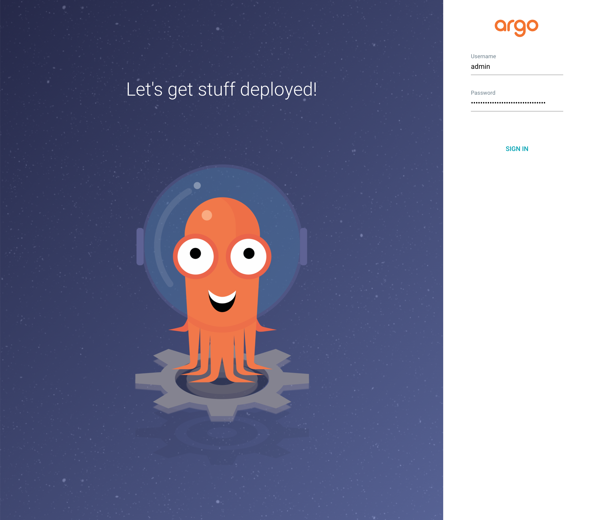
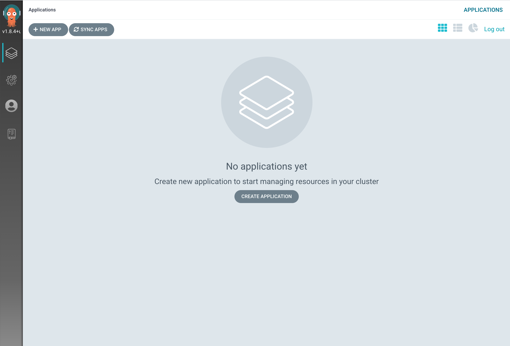
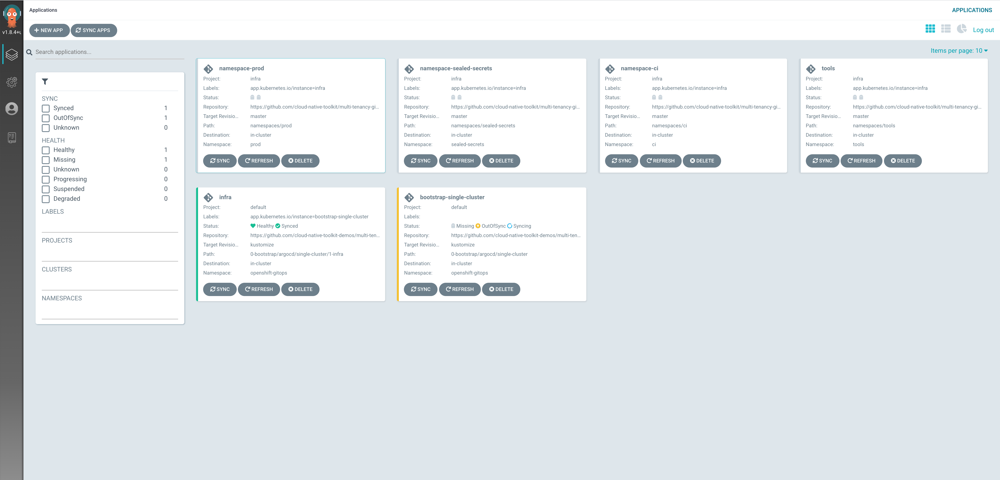
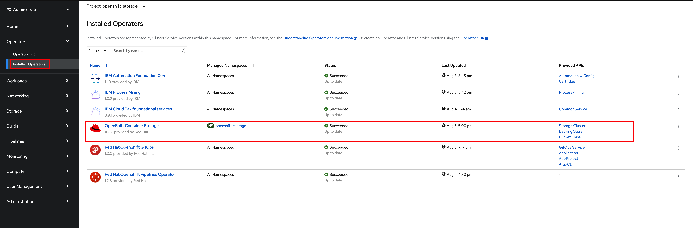
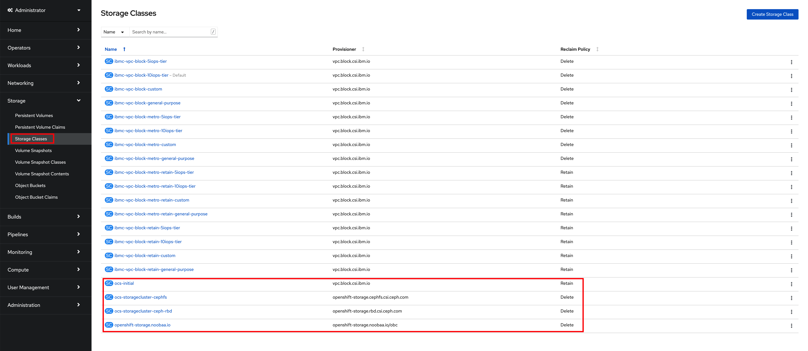
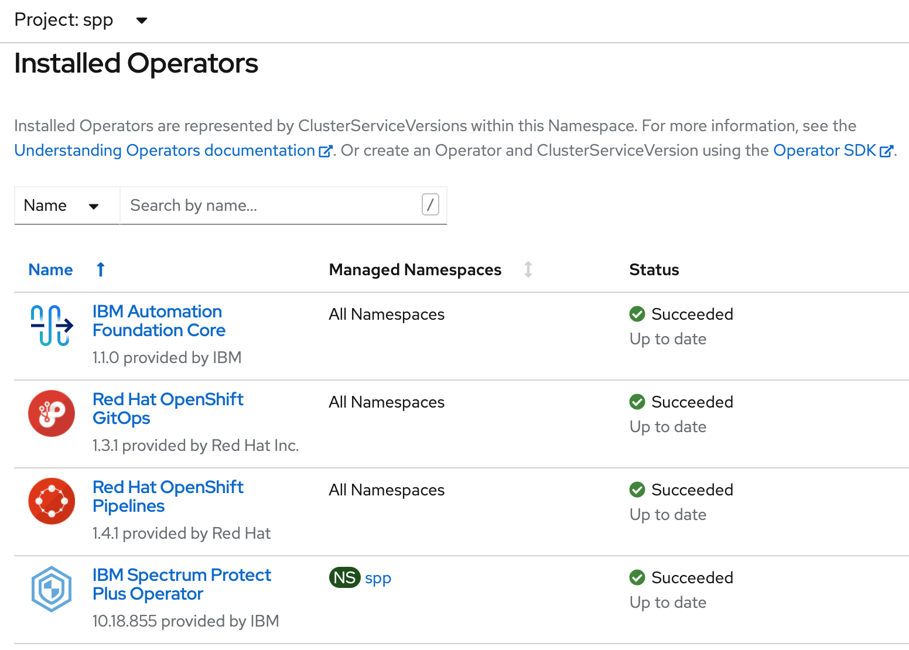
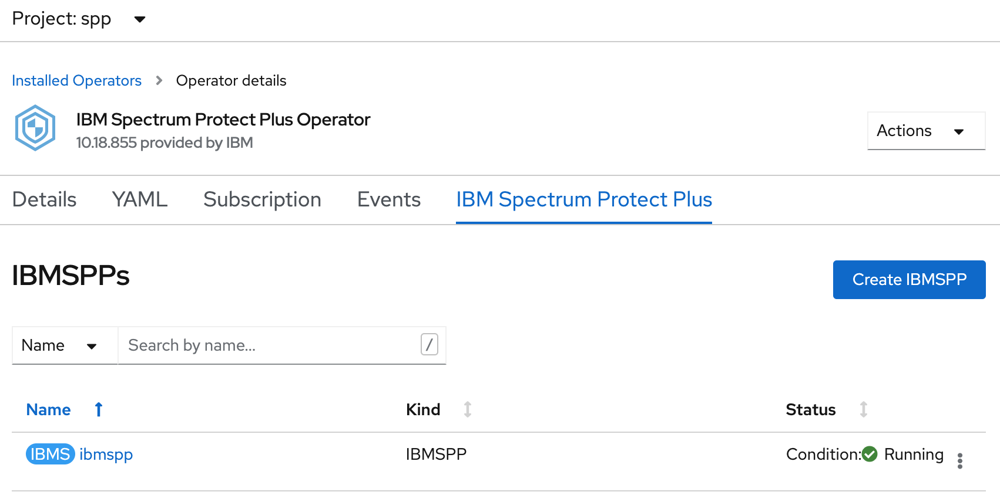
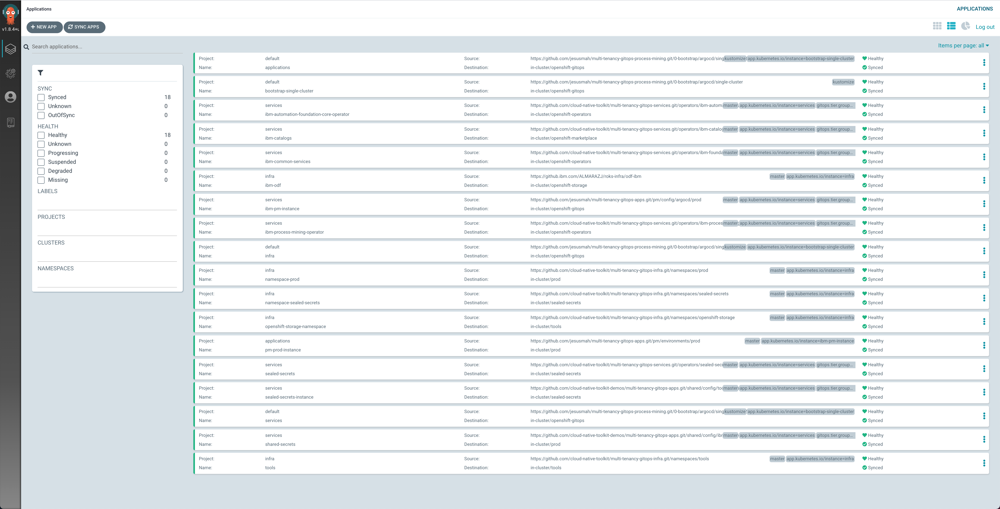
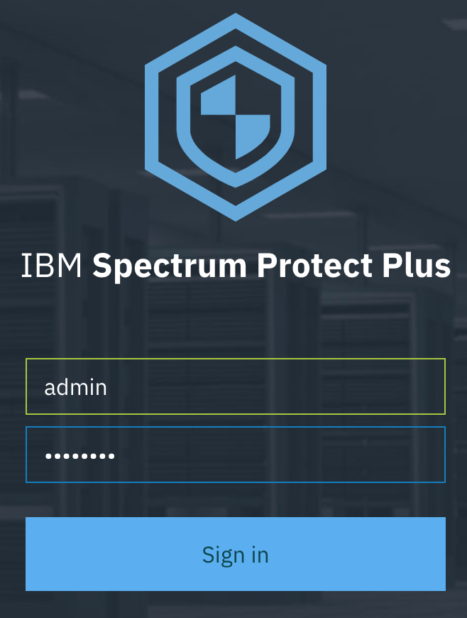
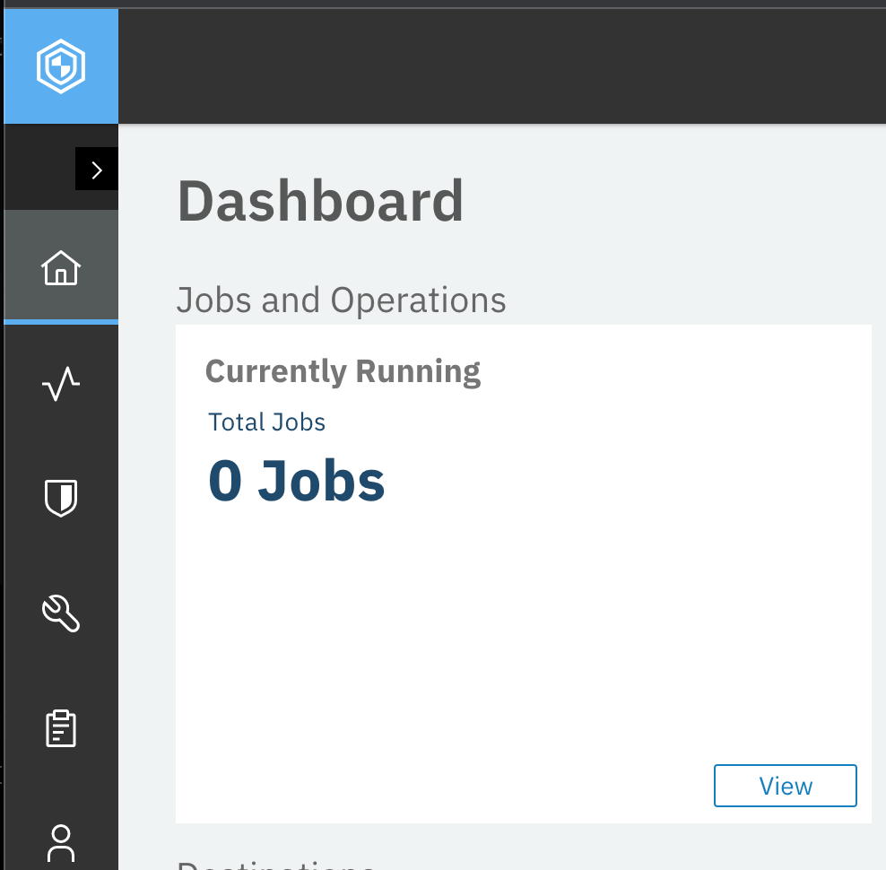

# Deployment on-premises

<!--- cSpell:ignore OADP Velero minio SPP Ceph sppadmin passw0rd singl ibmc unmanaged practioners Pak Paks Quickstart qube cntk autoplay allowfullscreen -->

## Overview
Deployment of IBM Spectrum Protect Plus (SPP) in an on-premises environment is detailed here. The graphic below shows SPP deployment across two geographical locations with data copy to cloud storage.


## Installing vSnap server

Every installation of IBM Spectrum® Protect Plus v10.1.8 and earlier requires at least one vSnap server, which is the primary backup destination. The vSnap server can be a physical server, a virtual server in a VMware environment or a virtual server in a Hyper-V environment. The vSnap server is installed, registered in SPP and initialized.

The vSnap server requirement will be lifted in v10.1.9.

1. A [physical vSnap server is installed](https://www.ibm.com/docs/en/spp/10.1.8?topic=server-installing-physical-vsnap)

1. Any vSnap server that is deployed virtually or installed physically must be [registered in IBM Spectrum Protect Plus](https://www.ibm.com/docs/en/spp/10.1.8?topic=servers-registering-vsnap-server)  so that it can be recognized as a backup storage provider.

1. The [initialization process](https://www.ibm.com/docs/en/spp/10.1.8?topic=servers-initializing-vsnap-server) prepares a new vSnap server for use by loading and configuring software components and initializing the internal configuration. This is a one-time process.

## Installing container backup support

To protect persistent volumes of containers and cluster-scoped and namespace-scoped resources, you must install and configure IBM Spectrum® Protect Plus Container Backup Support in a Kubernetes or Red Hat® OpenShift® Container Platform environment.

Ensure that IBM Spectrum Protect Plus vSnap server is registered with an IP address or fully qualified domain name (FQDN). FQDN is recommended.

1. The installation process for Container Backup Support uses a [Helm 3 chart](https://www.ibm.com/docs/en/spp/10.1.8?topic=prerequisites-installing-helm-3-renaming-binary-file). The installation script that is provided with the installation package requires that the Helm 3 binary file is renamed to *helm3*.

1. To protect OpenShift cluster-scoped resources and namespace-scoped resources, you must use the [OpenShift APIs for Data Protection (OADP) operator](https://www.ibm.com/docs/en/spp/10.1.8?topic=ivpr-openshift-installing-configuring-velero-by-using-oadp-operator) to install and configure the Velero tool in a dedicated namespace. The suggested name for the IBM Spectrum Protect Plus Velero namespace is *spp-velero*.

    1. The MinIO Object Store serves as an S3 object store for snapshot backups. The MinIO Pod is integrated in the Container Backup Support (BaaS) installation package and is deployed to the BaaS namespace. This Pod claims a persistent volume with a size of 10 GB, and uses the default Storage Class (minioStorageClass) based on the cluster configuration.

1. [Configuration parameters](https://www.ibm.com/docs/en/spp/10.1.8?topic=support-configuration-parameters) of the Container Backup Support Helm chart is specified in 2 files: *baas-options.sh* and *baas-values.yaml*


<!---
As we can see in the topology above, the RedHat OpenShift cluster has been deployed on a MultiZone Region (MZR) data center with three availability zones where Virtual Private Cloud Gen 2 is available. IBM Process Mining [requires ReadWriteMany (RWX) storage](https://www.ibm.com/docs/en/cloud-paks/1.0?topic=platform-pre-installation-requirements). In order to offer Read Write Many storage for the applications running on our RedHat OpenShift cluster, we need to make OpenShift Data Foundation [available in our RedHat OpenShift cluster](https://cloud.ibm.com/docs/openshift?topic=openshift-deploy-odf-vpc). 


OpenShift Data Foundation deploys [Ceph](https://ceph.com/en/), an open-source, distributed storage system, throughout [Rook](https://rook.io/) which turns distributed storage systems into self-managing, self-scaling, self-healing storage services. The actual persistent storage used by OpenShift Data Foundation to deploy a distributed storage system using Rook and Ceph is the block storage provided by IBM Cloud Object Storage from your Virtual Private Cloud. 


Finally, we can see that the [Process Mining components](https://www.ibm.com/docs/en/cloud-paks/1.0?topic=platform-application-components) (Process Miner, Task Miner and User Interface), get deployed on the other three worker nodes of you RedHat OpenShift cluster.

--->

## Deploy

The official IBM Spectrum Protect Plus deployment instructions can be found [here](https://www.ibm.com/docs/en/spp/10.1.8?topic=installation-overview). There are 3 parts - SPP Server setup, Backup as a Service (Baas) operator and setting up the vSnap server, which is a manual process. We **strongly** recommend using a GitOps approach for installing the SPP server and Baas.

<!---

--->
To deploy IBM Spectrum Protect Plus on an OpenShift cluster, we use the [IBM Cloud Native Toolkit GitOps Framework](https://cloudnativetoolkit.dev/adopting/use-cases/gitops/gitops-toolkit/). There are only five steps you need to take:

1. [Prereqs](#1-prereqs) - Make sure you have a Red Hat OpenShift cluster and are able to use the Red Hat OpenShift CLI against it.
1. [Sealed Secrets](#2-sealed-secrets) - Provide the private key used to seal the secrets provided with the API Connect GitOps repository.
1. [Red Hat OpenShift GitOps Operator](#3-redhat-openshift-gitops-operator) - Install the Red Hat OpenShift GitOps operator which provides the GitOps tools needed for installing and managing SPP instances through the GitOps approach already explained.
1. [IBM Spectrum Protect Plus](#4-ibm-spectrum-protect-plus) - Deploy an instance of Spectrum Protect Plus on your cluster.
1. [IBM Spectrum Protect Plus UI](#5-ibm-spectrum-protect-plus-ui) - Validate the installation of your Spectrum Protect Plus instance by making sure you are able to log into the dashboard.

### 1 - Prereqs

1. Get a clean RedHat OpenShift cluster. This RedHat OpenShift cluster must be composed of six worker nodes where three of these will be entirely dedicated to OpenShift Data Foundation. The storage nodes must be 16 CPUs and 64 GB RAM at least.

<!---
    

1. Once your RedHat OpenShift cluster is available in your IBM Cloud dashboard, you must install the OpenShift Data Foundation add-on:
    1. From the OpenShift clusters console, select the cluster where you want to install the add-on.
    1. On the cluster Overview page, click Add-ons.
    1. On the OpenShift Data Foundation card, click Install.
    

1. On the cluster Nodes page, select one node per availability zone and write down it's IP address.

    

1. Log into your Red Hat OpenShift web console using the button on the top right corner of your cluster dashboard on IBM Cloud.

1. Go to the Compute -> Nodes section on the navigation index on the left hand side and for each of the nodes you picked in the previous step:

    

    1. Click on the node and in its Node Details dashboard, click on the Actions drop down menu that appears on the top right corner and select Edit Labels.
    
    1. Type `node-role.kubernetes.io/storage=true` and hit enter to add that label to the node. Click Save.
    

1. Once you have completed the process above for the three nodes you selected to be entirely dedicated to storage, you should see such role in the Compute -> Nodes section of your Red Hat OpenShift cluster.

    

1. Log into your Red Hat OpenShift cluster through the RedHat OpenShift CLI in order to execute commands to interact with it through your terminal.

--->

### 2 - Sealed Secrets

1. Create the `sealed-secrets` project. This project will host the Sealed Secrets operator that will allow us to decrypt sealed secrets stored in GitHub.

    ```
    oc new-project sealed-secrets
    ```

1. Download the private key [sealed-secrets-ibm-demo-key.yaml](https://bit.ly/demo-sealed-master) used to seal any secret contained in this demonstration and apply it to the cluster. In our case, we have included a demo IBM Entitlement Key within the API Connect GitOps GitHub repository so that we are able to pull down IBM Software.

    ```
    oc apply -f sealed-secrets-ibm-demo-key.yaml
    ```

1. **IMPORTANT: DO NOT CHECK THE FILE INTO GIT**. The private key **MUST NOT** be checked into GitHub under any circumstances. Please, remove the private key from your workstation to avoid any issues.

    ```
    rm sealed-secrets-ibm-demo-key.yaml
    ```

### 3 - Red Hat OpenShift GitOps Operator

1. Clone the following GitHub repository that contains the GitOps structure that the Cloud Native Toolkit GitOps Framework understands.

    ```
    git clone https://github.com/cloud-native-toolkit-demos/multi-tenancy-gitops-process-mining.git
    ```

1. Change directory into `multi-tenancy-gitops-process-mining`.

    ```
    cd multi-tenancy-gitops-process-mining
    ```

1. Install the Red Hat OpenShift GitOps operator on your RedHat OpenShift cluster and wait for it to be available:

    * If your Red Hat OpenShift cluster version is 4.6
    ```
    oc apply -f setup/ocp46/
    while ! kubectl wait --for=condition=Established crd applications.argoproj.io; do sleep 30; done
    ```
    * If your Red Hat OpenShift cluster version is 4.7
    ```
    oc apply -f setup/ocp47/
    while ! kubectl wait --for=condition=Established crd applications.argoproj.io; do sleep 30; done
    ```

    Once the above command returns, you can open your Red Hat OpenShift Web Console and check out that the RedHat OpenShift GitOps operator has been successfully installed in the `openshift-gitops` project.

    

    As you can see in the image, the Red Hat OpenShift GitOps operator also installs the Red Hat OpenShift Pipelines operator and ArgoCD (which will be that GitOps tool that synchronizes the Infrastructure/Configuration as Code we have stored in GitHub with the state of the Red Hat OpenShift cluster). 
  
    **Important:** The Red Hat OpenShift Pipelines operator gets installed by the RedHat OpenShift GitOps Subscription **only for RedHat OpenShift version 4.6**. If your RedHat OpenShift cluster is version 4.7, you will need to install the Red Hat OpenShift Pipelines operator as part of the GitOps process explained in this section. For getting such Red Hat OpenShift Pipelines operator installed, you would need to specify that in the `kustomize.yaml` file for the services layer [here](https://github.com/cloud-native-toolkit-demos/multi-tenancy-gitops-apic/blob/kustomize/0-bootstrap/argocd/single-cluster/2-services/kustomization.yaml#L66-L67).

1. Open the ArgoCD web console by clicking on the ArgoCD console link you can see at the top of your Red Hat OpenShift web console and log in.

    

    You can find your ArgoCD login password by executing:
    * If your RedHat OpenShift cluster version is 4.6
    ```
    oc extract secrets/argocd-cluster-cluster --keys=admin.password -n openshift-gitops --to=-
    ```
    * If your RedHat OpenShift cluster version is 4.7
    ```
    oc extract secrets/openshift-gitops-cluster --keys=admin.password -n openshift-gitops --to=-
    ```

    Once you login, you should see that your ArgoCD web console is empty as we have not deployed any Argo Application yet.

    

### 4 - IBM Spectrum Protect Plus

<!---
1. Before being able to deploy an instance of IBM Spectrum Protect Plus in our Red Hat OpenShift cluster, we need to provide the storage node's IP addresses to the configuration of the OpenShift Data Foundation operator. You can provide custom configuration to the OpenShift Data Foundation operator in the `ibm-odf.yaml` file you can find in this IBM Process Mining GitOps GitHub repository you cloned at the beginning under `multi-tenancy-gitops-process-mining/0-bootstrap/argocd/single-cluster/1-infra/argocd`. Edit that file and provide your storage node's IP addresses to the `worker_ip_X` configuration parameters for the OpenShift Data Foundation operator.

    

--->

1. Install the ArgoCD Bootstrap Application

    ```
    oc apply -n openshift-gitops -f 0-bootstrap/argocd/bootstrap.yaml
    ```

    This ArgoCD Bootstrap Application will bootstrap the deployment of IBM Spectrum Protect Plus based on the configuration you have defined in the GitOps GitHub repository we cloned earlier. You can see that we integrate [Kustomize](https://kustomize.io/) for configuration management in the GitOps approach.

    As soon as you create this ArgoCD Bootstrap Application, the rest of the ArgoCD Applications and the respective Red Hat Openshift managed resources start to get created as a result of the synchronization process the GitOps approach is based on. You can see these ArgoCD Applications being created in the ArgoCD web console.

    

1. If you go to the Operators -> Installed Operators section of your Red Hat OpenShift cluster web console and select the `openshift-storage` project in the Project drop down list at the top, you will see that the OpenShift Container Storage operator (which has been recently renamed to OpenShift Data Foundation) is being installed.

1. If you go to the Workloads -> Pods section of your Red Hat OpenShift cluster web console you should see pods being created as a result of the OpenShift Container Storage operator being told to create an OpenShift Container Storage Cluster.

1. After some time, you should see the OpenShift Container Storage operator successfully installed

    

    and the following new Storage Classes available on the Storage -> Storage Classes section of your Red Hat OpenShift cluster web console

    

    that will be used by the IBM Spectrum Protect Plus operator to create an IBM Spectrum Protect Plus instance.

1. If you go again to the Operators -> Installed Operators section of your Red Hat OpenShift cluster web console and select the `openshift-operators` project in the Project drop down list at the top, you should see that the IBM Spectrum Protect Plus operator has been successfully installed as well as the IBM Automation Foundation Core and IBM Cloud Pak foundational services operators it depends on.

    

1. the IBM Spectrum Protect Plus instance should now be Running. Go to the *Operators -> Installed Operators* section of your Red Hat OpenShift cluster web console. Select the `spp` project in the Project drop down list at the top because in our IBM Spectrum Process Plus GitOps process we configured the IBM Spectrum Protect Plus instance to be deployed in the `spp` project. Click on the IBM Spectrum Protect Plus operator and then on the SPP tab, you should see the running instance.

    

1. If you go back to the ArgoCD web console, you should see all of the Argo Application in green.

    

### 5 - IBM Spectrum Protect Plus UI

Now, let's make sure that our IBM Spectrum Protect Plus instance is up and running. 
<!---
We do that by going into the IBM Automation platform user interface and logging in.

1. Go to the Networking -> Routes section of your Red Hat OpenShift cluster web console and select the `spp` project in the Project drop down list at the top. You should see a Route called `spp`. Now, click on the `Location` value for that Route.

    

1. You will be presented with the IBM Automation platform user interface login option. Select `IBM provided credentials (admin only)`.

    

1. Get your IBM Automation platform admin credentials by executing

    ```
    oc -n ibm-common-services get secret platform-auth-idp-credentials -o jsonpath='{.data.admin_password}' | base64 -d && echo
    ```
--->
1. Log into the Spectrum Protect Plus UI using the initial credentials of admin/password. You will be asked to change the user ID and password. In this scenario they were changed to sppadmin/passw0rd

    

1. Finally the default IBM Spectrum Protect Plus dashboard is displayed and you can start working with it.

    


## Links

- [IBM Spectrum Protect Plus](https://www.ibm.com/products/ibm-spectrum-protect-plus)
- [IBM Spectrum Protect Plus Knowledge Center](https://www.ibm.com/docs/en/spp/10.1.8?topic=product-overview)
- [IBM Spectrum Protect Plus Blueprints](https://www.ibm.com/support/pages/node/1119489)