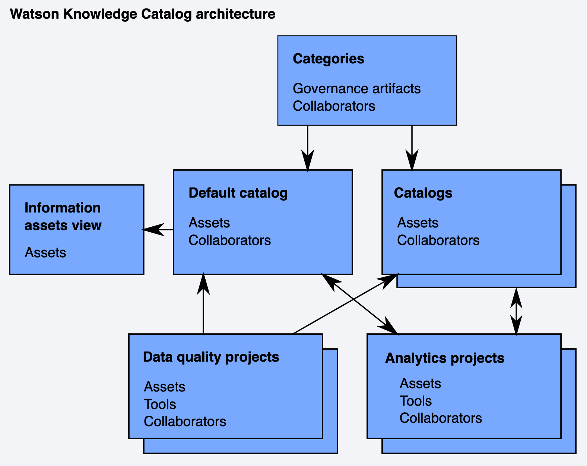

# Watson Knowledge Catalog

<!--- cSpell:ignore storagecluster cephfs ceph Portworx portworx ibmc metastoredb Invenio automations hyperautomation unmanaged practioners Pak Paks Quickstart qube cntk autoplay allowfullscreen -->

## Powers self-service discovery of data

Watson Knowledge Catalog (WKC) provides a secure enterprise catalog management platform that is supported by a data governance framework. The data governance framework ensures that data access and data quality are compliant with your business rules and standards. 

## Information about WKC

Watson Knowledge Catalog is included with IBM® Cloud Pak for Data. A project administrator can install WKC on the cloud pak. The requirements are:

* WKC requires a custom security context constraint (SCC).
* WKC must be installed in the same project as Cloud Pak for Data.
* WKC requires the Cloud Pak for Data common core services. 
* WKC uses one of these following storage classes:
    * OpenShift Container Storage: 
        * *ocs-storagecluster-cephfs*
        * *ocs-storagecluster-ceph-rbd*
    * NFS: *managed-nfs-storage*
    * Portworx: 
        * *portworx-shared-gp3*
        * *portworx-cassandra-sc*
        * *portworx-couchdb-sc*
        * *portworx-db2-rwo-sc*
        * *portworx-elastic-sc*
        * *portworx-metastoredb-sc*
        * *portworx-gp3-sc*
        * *portworx-kafka-sc*
        * *portworx-solr-sc*
    * IBM Cloud File Storage: *ibmc-file-gold-gid* or *ibm-file-custom-gold-gid*

  
## Links

- [IBM Cloud Pak for Data](https://www.ibm.com/products/cloud-pak-for-data)
- [IBM Cloud Pak for Data Knowledge Center](https://www.ibm.com/docs/en/cloud-paks/cp-data/4.0)
- [IBM Cloud Pak for Data System](https://www.ibm.com/products/cloud-pak-for-data/system)
