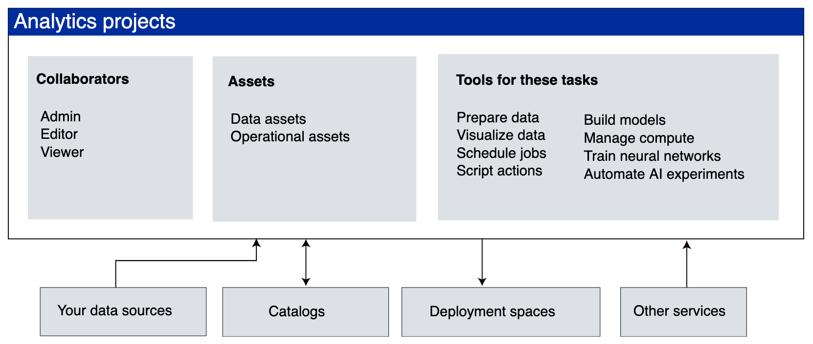

# Watson Studio

<!--- cSpell:ignore collaborately storagecluster cephfs Portworx portworx ibmc Invenio automations hyperautomation unmanaged practioners Pak Paks Quickstart qube cntk autoplay allowfullscreen -->

## Empowering data scientists, developers and analysts to build, run and manage AI models

Watson Studio provides the environment and tools for data scientists and business analysts to collaborately work on data. Using analytics projects to organize, cleanse, analyze and visualize data. Watson Studio can also be used to create and train machine learning (ML) models.

## Information about Watson Studio

Starting with v4, Watson Studio is included with IBM® Cloud Pak for Data. A project administrator can install Watson Studio on the cloud pak. The requirements are:

* Watson Studio needs only the restricted security context constraint (SCC).
* Watson Studio must be installed in the same project as Cloud Pak for Data.
* Watson Studio requires the Cloud Pak for Data common core services. 
* Watson Studio uses one of these following storage classes:
    * OpenShift Container Storage: *ocs-storagecluster-cephfs*
    * NFS: *managed-nfs-storage*
    * Portworx: *portworx-shared-gp3*
    * IBM Cloud File Storage: *ibmc-file-gold-gid* or *ibm-file-custom-gold-gid*

  
## Links

- [IBM Cloud Pak for Data](https://www.ibm.com/products/cloud-pak-for-data)
- [IBM Cloud Pak for Data Knowledge Center](https://www.ibm.com/docs/en/cloud-paks/cp-data/4.0?topic=overview)
- [IBM Cloud Pak for Data System](https://www.ibm.com/products/cloud-pak-for-data/system)
