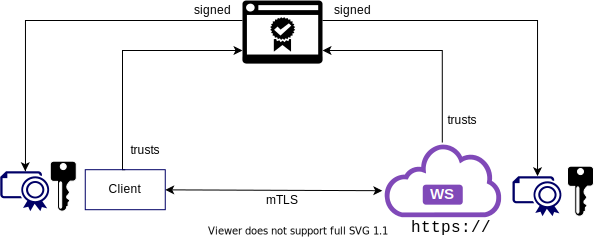

## Example Supporting Application

 <!-- cSpell:ignore passw0rd -->
 
Our sample ACE application is to integrate with an existing SOAP web service. We assume that this web service is deployed independently. But for the sake of completeness of this guide, we will go over a step-by-step guide on how to deploy the SOAP service on to your OpenShift cluster.

!!!note
    We have chosen to use a GitOps approach to deploy the SOAP web service, and in turn making use of OpenShift Build (see more: [OpenShift Build](https://docs.openshift.com/container-platform/4.7/cicd/builds/understanding-image-builds.html) mechanism). You are free to chose another approach to deploy this service (for example, building image locally on your workstation, deploying to a registry and creating the necessary kubernetes manifests).

The SOAP service is secured over mTLS. It serves traffic over HTTPS, and therefore requires identity certificate and key for the server.  It also requires client certificate to be sent during requests. The service need to trust this certificate for communication to proceed.

To simplify our set up, we will make use Certificate Authority (CA): 



The certificates used by both the SOAP service and the client will be signed by a CA. Both the SOAP service and the client will trust the CA certificate, and in turn will trust any certificate signed by the CA. This way the client and the SOAP service will trust each other.

<InlineNotification>

In this subsection we are using the general term, "client", to refer to the entity that is making the request to the SOAP service. Our ACE application is one such client.

</InlineNotification>

The service is implemented with Spring Boot Web Service. It needs a JKS based keystore that contains the server's certificate and key. It also needs a JKS based truststore to store the CA certificate.

### SealedSecret

The JKS and passwords needed by the SOAP service pod will be mounted from a kubernetes `Secret` object at deploy time. As `Secret` store encoded contents and **not encrypted** contents, storing `Secret`s in a git repository is not safe. Instead we will make use of `SealedSecret` objects - which store encrypted content of JKS and passwords.

To create the `SealedSecret` objects, we will first need to create plain `Secret` manifests that contains our data (keystores and passwords). Thereafter, we will use `kubeseal` to encrypt the `Secret`s to `SealedSecret`s


When a `SealedSecret` object are created on the cluster, the SealedSecret operator will decrypt it back to plain `Secret` and create the `Secret` object on the cluster:


The plain `Secret` will then be mounted on the on the SOAP service pod, in the usual way.

## Pre-requisite

1. Sealed Secret operator is installed on your cluster.

2. `kubeseal` CLI is installed on your local workstation. See [kubeseal](https://github.com/bitnami-labs/sealed-secrets#homebrew) for installation instruction.

3. `yq` (v4.x) CLI is installed on your local workstation. See [yq](https://mikefarah.gitbook.io/yq/) for installation instruction.

4. SoapUI [SoapUI](https://www.soapui.org/tools/soapui/) is installed. (Alternatively, you can use Postman or even `curl`)

## Steps

At start, the folder, `soapServer`, within gitOps repository looks like this:

```sh
.
├── buildConfig
│   └── buildConfig.yaml
├── deploymentConfig
│   └── deploymentConfig.yaml
├── imageStream
│   └── imageStream.yaml
├── kustomization.yaml
├── route
│   └── route.yaml
├── sealedSecret
└── service
    └── service.yaml

6 directories, 10 files

```

It contains the 

* **buildConfig** that builds the container image for the SOAP service

* **deploymentConfig** that defines the deployment

* **imageStream** that names the container image

* **service** that define the service endpoints

* **route** that exposes the service

Currently, the above `sealedSecret` folder is empty. This folder will contain the needed `SealedSecret` manifests. The `kustomization.yaml` does refer to these (non-existing) manifest files:

```yaml src="TODO-link-to-gitops"
apiVersion: kustomize.config.k8s.io/v1beta1
kind: Kustomization
resources:
  - "sealedSecret/ibm-soap-server-jks-enc.yaml"           <- need to be created
  - "sealedSecret/ibm-ca-jks-enc.yaml"                    <- need to be created
  - "sealedSecret/ibm-soap-server-jks-enc-password.yaml"  <- need to be created
  - "sealedSecret/ibm-ca-jks-enc-password.yaml"           <- need to be created
  - "service/service.yaml"
  - "route/route.yaml"
  - "deploymentConfig/deploymentConfig.yaml"
  - "imageStream/imageStream.yaml"
  - "buildConfig/buildConfig.yaml"
```

<InlineNotification>

We did not pre-create the certs and keys for the SOAP server (or any of the services we will deploy part of this guide). This is primarily because the hostname of the deployment host need to be part of the certificate's Common Name and Subject Alternative Names. The hostname depends on your OpenShift cluster.

</InlineNotification>

As part of the deployment, we will create the needed manifests. We will therefore follow the following steps:

<AnchorLinks small>
  <AnchorLink>Step 1: Generate the required CA, keys and certificates</AnchorLink>
  <AnchorLink>Step 2: Create Sealed Secret manifests</AnchorLink>
  <AnchorLink>Step 3: Activate ArgoCD application</AnchorLink>
  <AnchorLink>Step 4: Test the deployment with SoapUI</AnchorLink>
</AnchorLinks>


### Step 1: Generate the required CA, keys and certificates

Follow the instructions for [cert-generation](https://github.com/saadlu/ace-rest-ws/tree/master/cert-generation). The script will generate all the certs, keys and stores that are required for this guide. For the SOAP service deployment, we only need the following files:

```sh
...
└── certs <--- directory where certs/keys are generated
   ├── ibm-ca.jks <---------- contains the CA certificate
   ├── ibm-client.jks <------ contains cert/key for a client application
   └── ibm-soap-server.jks <- contains cert/key for the SOAP service
...
```

### Step 2: Create Sealed Secret manifests

We will create manifests for four secrets containing the JKS files, `ibm-soap-server.jks`, `ibm-ca.jks` and their passwords:

```yaml
kind: Secret
apiVersion: v1
metadata:
   name: ibm-soap-server.jks
data:
   ibm-soap-server.jks: <BASE64 encoded content of ibm-soap-server.jks>
```

```yaml
kind: Secret
apiVersion: v1
metadata:
   name: ibm-ca-jks
data:
   ibm-ca-jks: <BASE64 encoded content of ibm-ca.jks>
```

```yaml
kind: Secret
apiVersion: v1
metadata:
   name: ibm-soap-server-jks-password
data:
   SERVER_SSL_KEY_STORE_PASSWORD: <BASE64 encoded password of ibm-soap-server.jks>
```

```yaml
kind: Secret
apiVersion: v1
metadata:
   name: ibm-ca-jks-password
data:
   SERVER_SSL_TRUST_STORE_PASSWORD: <BASE64 encoded password of ibm-ca.jks>
```

You can manually create the above four secrets. Alternatively, you can make use of `yq` CLI as following

**(Optional) Use `yq` to create secrets**


1. Start by creating a directory, for example:

   ```sh
   mkdir -p ~/workspace/ace-ref-deployment/soap-secret
   cd ~/workspace/ace-ref-deployment/soap-secret
   ```

2. We use [`secret.yaml`](https://github.com/saadlu/ace-rest-ws/blob/master/appendix/secret.yaml) as a starting point for our manifest file

   It only contains the `kind` and `apiVersion` of the manifests:

   ```yaml
   kind: Secret
   apiVersion: v1
   ```

   Use the following command to generate the secret manifests for the JKS files:

   ```sh
   yq e '.metadata.name=<name-of-the-secret>' \
     <path-to-secret.yaml> \
     > <name-of-secret-manifest>.yaml

   VALUE="$(base64 -w 0 <path-to-jks>)" \
     yq e '.data."<name-of-key>"=strenv(VALUE)' \
     -i <name-of-secret-manifest>.yaml
   ```

   replacing `<name-of-the-secret>`, `<path-to-secret.yaml>`, `<name-of-secret-manifest>`, `<path-to-jks>` and `<name-of-key>` appropriately.

   for instance, to create a secret containing `ibm-soap-server.jks`:

   ```sh
   yq e '.metadata.name="ibm-soap-server.jks"' \
     ../ace-rest-ws/appendix/secret.yaml \
     > ibm-soap-server-jks.yaml

   VALUE="$(base64 -w 0 ../ace-rest-ws/certs/ibm-soap-server.jks)" \
     yq e '.data."ibm-soap-server.jks"=strenv(VALUE)' \
     -i ibm-soap-server-jks.yaml
   ```

   Similar commands can be used to create the secret containing `ibm-ca.jks`

   To create the Secret for password, you can use the following:

   ```sh
   yq e '.metadata.name=<name-of-the-secret>' \
     <path-to-secret.yaml> \
     > <name-of-secret-manifest>.yaml

   yq e '.stringData."<name-of-key>"=<password>' \
     -i <name-of-secret-manifest>.yaml
   ```

   For instance:

   ```sh
   yq e '.metadata.name="ibm-soap-server-jks-password"' \
     ../ace-rest-ws/appendix/secret.yaml \
     > ibm-soap-server-jks-password.yaml
   ```

   ```sh
   yq e '.stringData.SERVER_SSL_KEY_STORE_PASSWORD="passw0rd"' \
     -i ibm-soap-server-jks-password.yaml
   ```

   The above will create a Secret manifest that contains the password for `ibm-soap-server.jks`. Similar command can be used to create the Secret manifest that contains the password for `ibm-ca.jks`.

   At the end of this process, you should have four Secret manifests:

   * ibm-soap-server-jks.yaml
   * ibm-soap-server-jks-password.yaml
   * ibm-ca.yaml
   * ibm-ca-jks-password.yaml

   <!--  -->


Now that we have the four Secrets, we can encrypt them to SealedSecrets.

To do so, we use `kubeseal` CLI. Make sure you are logged into the cluster:

```sh
kubeseal --controller-name=sealedsecretcontroller-sealed-secrets \
   --controller-namespace=sealed-secrets \
   < <name-of-secret-manifest>.yaml \
   > <name-of-sealed-secret-manifest>.yaml
```

for instance, to create a sealed secret containing `ibm-soap-server.jks`:

```sh
kubeseal --controller-name=sealedsecretcontroller-sealed-secrets \
   --controller-namespace=sealed-secrets \
   < ibm-soap-server-jks.yaml \
   > ibm-soap-server-jks-enc.yaml
```

Similar command can be used to create all four SealedSecrets:

* ibm-soap-server-jks-enc.yaml
* ibm-soap-server-jks-password-enc.yaml
* ibm-ca-enc.yaml
* ibm-ca-jks-password-enc.yaml

<!--  -->

Finally move the sealed secrets manifests to `sealedSecret` folder in the GitOps repos

For instance:

```sh
mv ibm-soap-server-jks-enc.yaml <git-ops-application-repo>/soapserver/base
mv ibm-soap-server-jks-password-enc.yaml <git-ops-application-repo>/soapserver/base
mv ibm-ca-enc.yaml <git-ops-application-repo>/soapserver/base
mv ibm-ca-jks-password-enc.yaml <git-ops-application-repo>/soapserver/base
```

You should now have all the required manifest in your gitOps repository:

```yaml"
repo
├── buildConfig
│   └── buildConfig.yaml
├── deploymentConfig
│   └── deploymentConfig.yaml
├── imageStream
│   └── imageStream.yaml
├── kustomization.yaml
├── route
│   └── route.yaml
├── sealedSecret
│   ├── ibm-ca-jks-enc-password.yaml
│   ├── ibm-ca-jks-enc.yaml
│   ├── ibm-soap-server-jks-enc-password.yaml
│   └── ibm-soap-server-jks-enc.yaml
└── service
    └── service.yaml
```


### Step 3: Activate ArgoCD application

Activate ArgoCD application to watch over SOAP service GitOps folder.

The BuildConfig should start a build to create and push a container image for the SOAP service. At the same time, SealedSecret operator will create four Secrets based on the four SealedSecrets.

Once the build is done, DeploymentConfig will deploy a pod, mounting the keystore files and plugging the password of them as environment variables. Service will create the endpoints and the service will be exposed via the Route.

### Step 4: Test the deployment with SoapUI

We can use SoapUI application to test out our SOAP service. The application can take a WSDL file and generate a sample of the payload.

Once the SOAP service is deployed, we can download the WSDL from it. The SOAP service was made with Spring-WS which uses a Contract-First approach. The XSD file, [customer_details.xsd](https://github.com/saadlu/ace-rest-ws/blob/master/soapserver/src/main/resources/customer_details.xsd), defines the contract. The WSDL is generated by the service based on the contract XSD.

Note that the SOAP service is protected over mTLS we would need client key, client certificate and CA certificate for any request, be in downloading the WSDL or making a service call.

** Download the WSDL via `wget` **

We can use `wget` CLI to download the WSDL file. Following steps covers it:

1. Make a new folder to for the WSDL file

   ```sh
   mkdir wsdl
   cd wsdl
   ```

2. Run the `wget` command:
   
   ```sh
   wget \
      --ca-certificate=<ca-cert-path> \
      --certificate=<client-cert-path> \
      --private-key=<client-key-path> \
      https://<hostname-of-SOAP-service>/ws/customerDetails.wsdl
   ```

   replacing `<ca-cert-path>`, `<client-cert-path>`, `<client-key-path>` and `<hostname-of-SOAP-service>` appropriately. `<hostname-of-SOAP-service>` can be found from the Route. 

   For example:

   <!--  -->


** Make SOAP request via SoapUI **

Open SoapUI.

1. Create a new project importing the WSDL.

2. Open the project. Based on the WSDL, the SoapUI will create sample payload. Make change appropriately. Note that phone needs to have the pattern, `[0-9]{3}-[0-9]{7}`, for example, `555-5555555`.

   The URL will also be populated for you. Notice that it should be of the pattern `https://<hostname>/ws`

3. As the service is protected over mTLS, you'd need use client keystore.

   1. Open Preference

   2. On the `SSL Settings` dialog, choose the client keystore. For instance, you can choose `ibm-client.jks` (created earlier above)

   3. Set the password. (if you using the certificates earlier, password is `passw0rd`)

4. Make the request. 


You can also test out the error handing:

* Remove service header from the payload. Service should return an error

* Use different phone number pattern, other than `[0-9]{3}-[0-9]{7}`

<!--  -->


