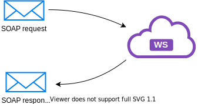
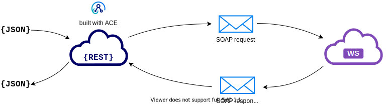
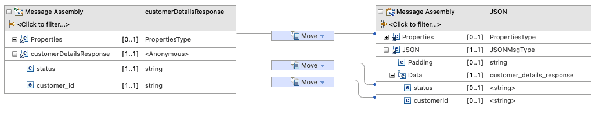
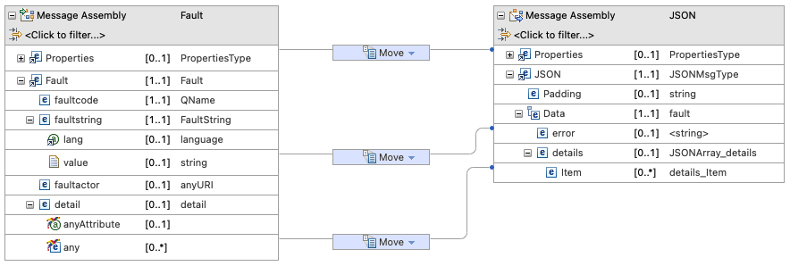

# Sample App Connect Enterprise Application

<!--- cSpell:ignore qube cntk autoplay allowfullscreen subflow truststore mtls kubeseal passw webkitallowfullscreen msallowfullscreen backendurl policyxml -->

## Overview

The sample ACE application that we will build in this tutorial will integrate with an existing backend SOAP service and expose it as a RESTful Web Service. 

In this section, we're going to:

* Review the backend SOAP service
* Review the sample ACE application that integrates with the backend SOAP service 

**Audience**: Architects, Application developers, Administrators


## The SOAP Backend Service

The SOAP backend takes payload to create Customer Details. It response with

* `status` indicating whether the request was successful
* `customer_id` identification number assigned to the customer record

<figure markdown> 
   
   <figcaption>Backend SOAP Service</figcaption>
</figure>

!!! note

    This sample service does not persist customer details data. It simply returns the status and a customer id.

The XSD for all the data models can be found here: [customer_details.xsd](https://github.ibm.com/Mohammed-Mia/ace-rest-ws/blob/master/soapserver/src/main/resources/customer_details.xsd). The (generated) WSDL can be found here: [customerDetails.wsdl](https://github.ibm.com/Mohammed-Mia/ace-rest-ws/blob/master/appendix/customerDetails.wsdl). As specified in the data model, there are two validations active

1. Payload must contains a `service_header`
2. Customer phone number must comply with regex, `[0-9]{3}-[0-9]{7}`

An example payload can look like:

``` { .xml .no-copy }
<SOAP-ENV:Envelope xmlns:SOAP-ENV='http://schemas.xmlsoap.org/soap/envelope/'>
  <SOAP-ENV:Body>
    <cus:customerDetailsRequest xmlns:cus='http://ibm.com/CustomerDetails/'>
      <cus:customer_details>
        <cus:service_header>
          <cus:brand>IBM</cus:brand>
        </cus:service_header>
        <cus:personal_details>
          <cus:name_details>
            <cus:first_name>John</cus:first_name>
            <cus:last_name>Doe</cus:last_name>
          </cus:name_details>
          <cus:contact_details>
            <cus:phone>555-5555555</cus:phone>
            <cus:address>123 Main Street</cus:address>
          </cus:contact_details>
        </cus:personal_details>
      </cus:customer_details>
    </cus:customerDetailsRequest>
  </SOAP-ENV:Body>
</SOAP-ENV:Envelope>
```

And the SOAP server will respond with, for example:

``` { .xml .no-copy }
<SOAP-ENV:Envelope xmlns:SOAP-ENV="http://schemas.xmlsoap.org/soap/envelope/">
   <SOAP-ENV:Header/>
   <SOAP-ENV:Body>
      <ns2:customerDetailsResponse xmlns:ns2="http://ibm.com/CustomerDetails/">
         <ns2:status>success</ns2:status>
         <ns2:customer_id>55ed3857-0f19-4250-a36f-de42f2db96b2</ns2:customer_id>
      </ns2:customerDetailsResponse>
   </SOAP-ENV:Body>
</SOAP-ENV:Envelope>
```

As for validation, without `service_header`, response would be:

``` { .xml .no-copy }
<SOAP-ENV:Envelope xmlns:SOAP-ENV="http://schemas.xmlsoap.org/soap/envelope/">
   <SOAP-ENV:Header/>
   <SOAP-ENV:Body>
      <SOAP-ENV:Fault>
         <faultcode>SOAP-ENV:Client</faultcode>
         <faultstring xml:lang="en">Validation error</faultstring>
         <detail>
            <spring-ws:ValidationError xmlns:spring-ws="http://springframework.org/spring-ws">cvc-complex-type.2.4.a: Invalid content was found starting with element 'cus:personal_details'. One of '{"http://ibm.com/CustomerDetails/":service_header}' is expected.</spring-ws:ValidationError>
         </detail>
      </SOAP-ENV:Fault>
   </SOAP-ENV:Body>
</SOAP-ENV:Envelope>
```

and without properly formatted phone number, the response would be:

``` { .xml .no-copy }
<SOAP-ENV:Envelope xmlns:SOAP-ENV="http://schemas.xmlsoap.org/soap/envelope/">
   <SOAP-ENV:Header/>
   <SOAP-ENV:Body>
      <SOAP-ENV:Fault>
         <faultcode>SOAP-ENV:Client</faultcode>
         <faultstring xml:lang="en">Validation error</faultstring>
         <detail>
            <spring-ws:ValidationError xmlns:spring-ws="http://springframework.org/spring-ws">cvc-pattern-valid: Value '555-555' is not facet-valid with respect to pattern '[0-9]{3}-[0-9]{7}' for type '#AnonType_phonecontact_detailspersonal_detailscustomer_details'.</spring-ws:ValidationError>
            <spring-ws:ValidationError xmlns:spring-ws="http://springframework.org/spring-ws">cvc-type.3.1.3: The value '555-555' of element 'cus:phone' is not valid.</spring-ws:ValidationError>
         </detail>
      </SOAP-ENV:Fault>
   </SOAP-ENV:Body>
</SOAP-ENV:Envelope>
```

Following is a video walk through of the SOAP service in action:

<figure markdown> 
   <iframe 
      src="https://ibm.ent.box.com/embed/s/59ff7aqgkt1i56biv0l7l9912lhehxtj?sortColumn=date&view=list" 
      width="800" height="550" frameborder="0" allowfullscreen webkitallowfullscreen msallowfullscreen>
   </iframe>
</figure>

<!-- https://ibm.box.com/s/59ff7aqgkt1i56biv0l7l9912lhehxtj -->

## ACE application

With App Connect Enterprise, we create a REST message flow that integrates with the backend SOAP service. The flow takes a JSON payload, converts the payload to SOAP envelop, invokes the backend SOAP service, converts the SOAP response to JSON and returns to the client.

<figure markdown> 
   
   <figcaption>ACE REST Service</figcaption>
</figure>

Source code of the message flow can be found here: [createCustomer_REST_V1](https://github.ibm.com/cpat-int-samples/createCustomer_REST_V1)

Data models for the RESTful API can be found here: [swagger.json](https://github.ibm.com/cpat-int-samples/createCustomer_REST_V1/blob/master/createcustomerrestcallingws/swagger.json)

Following is the subflow that defines our transformation and integrates with the SOAP service:

<figure markdown> 
   
   <figcaption>ACE subflow</figcaption>
</figure>


**JSONtoSOAP** is a mapping node that maps the JSON payload to to a SOAP Envelop. The left hand side takes `customer_details` as defined in the data model (see [customer_details](https://github.ibm.com/cpat-int-samples/createCustomer_REST_V1/blob/master/createcustomerrestcallingws/swagger.json#L54) in swagger) and the right hand side takes `customerDetailsRequest` (see [customerDetailsRequest](https://github.ibm.com/Mohammed-Mia/ace-rest-ws/blob/master/appendix/customerDetails.wsdl#L70) ) as defined by the WSDL of the SOAP service.

<figure markdown>
   
   <figcaption>JSON to SOAP mapping</figcaption>
</figure>

**Set up destination** is a custom Java Node that reads the URL of the backend SOAP service from a user-defined policy. This way, the URL of the SOAP service is not hard-coded in the flow. Instead, the URL is fed into the flow from a configuration at deployment time. URL is then fed into the **SOAP Request** node. An example of this policy can be found here: [backendurl.policyxml](https://github.ibm.com/cpat-int-samples/eaglebank-ace-config/blob/master/ibm-rest-policy/backendurl.policyxml).

**SOAP Request** makes the call to the SOAP backend service, using the Payload from the **JSONtoSOAP** node and URL from **Set up destination**. From henceforth, there is two paths, a "happy" path where request is successful and a "unhappy" path where the request was not successful.

**SOAP Extract**, **SOAP Extract Fault** extract out the SOAP envelop from the response of the **SOAP Request** node.

**HTTP Header**, **HTTP Header Fault** set the header for the responses. When request is successful it sets the response to `200`, `400` otherwise.

**ToJSON**, **fault_mapping** is a mapping node that maps the SOAP messages to JSON. For the successful path, the left hand side takes takes `customerDetailsResponse` (see [customerDetailsResponse](https://github.ibm.com/Mohammed-Mia/ace-rest-ws/blob/master/appendix/customerDetails.wsdl#L78)) as defined by the WSDL of the SOAP service and the right hand side takes `customer_details_response` as defined in the data model (see [customer_details_response](https://github.ibm.com/cpat-int-samples/createCustomer_REST_V1/blob/master/createcustomerrestcallingws/swagger.json#L43) in swagger) and the right hand side 

<figure markdown>
   
   <figcaption>Mapping for successful call</figcaption>
</figure>

For the un-successful path, the left hand side takes takes SOAP `Fault` (see [SOAP fault](https://www.ibm.com/docs/en/cics-ts/6.1_beta?topic=message-soap-fault)) and the right hand side takes `fault` as defined in the data model (see [fault](https://github.ibm.com/cpat-int-samples/createCustomer_REST_V1/blob/master/createcustomerrestcallingws/swagger.json#L94) in swagger).

<figure markdown>
   
   <figcaption>Mapping for faulty call</figcaption>
</figure>

Following is a video walk through of the ACE application:

<figure markdown>
   <iframe src="https://ibm.ent.box.com/embed/s/1wabmvhnhrsn69tf8xllyk1v7o3vaqar?sortColumn=date&view=list" 
      width="800" height="550" frameborder="0" allowfullscreen webkitallowfullscreen msallowfullscreen>
   </iframe>
</figure>
