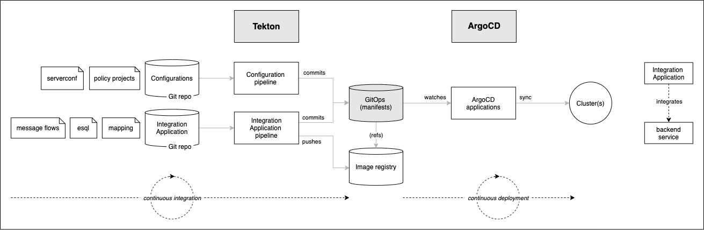

# Cloud Native AppConnect Enterprise GitOps

<!--- cSpell:ignore CICD qube cntk autoplay allowfullscreen clusterrole clusterrolebinding walkthrough Walkthrough webkitallowfullscreen msallowfullscreen -->

## Overview

Continuous integration and continuous deployment (CICD) are at the core of a
[typical ACE deployment](../overview/architecture.md#target-architecture). They ensure
that any changes to source applications and configurations are automatically
built and tested *before* they are deployed, helping to ensure their correctness
and the integrity of the cluster.

ACE applications and queue managers are defined, configured and changed using a
[GitOps](https://www.openshift.com/blog/introduction-to-gitops-with-openshift)
model. GitOps puts git repositories and git commands such as **git push** (to
request a change) and **git merge** (to approve a change) at the heart of
configuration management. A GitOps approach helps an organization implement
best practices in version control and release governance based on a widely used
open standard -- **git**.

The following diagram outlines the major components in a GitOps ACE CICD process:

Notice the clear separation of concerns:

* **Tekton (OpenShift Pipelines)**  pipelines use Integration Application (message flows, esql, mapping, etc.) and configurations (serverconf, policy projects) source repositories to build and store successfully tested Kubernetes artifacts in a Git config repository or image registry. While Kubernetes resources (e.g.
pods, routes...) can be created as part of the pipeline run to test the source change, these resources only last for the duration of the pipeline run. It is the resultant Git and container image registry resources that are used to affect changes to the cluster in a subsequent, asynchronous processing step controlled by ArgoCD.

* **ArgoCD (OpenShift GitOps)**  applications watch a Git config repository for changes built as a
result of successful pipeline runs. This repository identifies the latest
version of the application using information stored in Git and an
image repository. OpenShift GitOps applies the Kubernetes resources thus
identified to the cluster, resulting in new or updated Kubernetes resources that
represent the changed ACE workflow applications and Integration Servers and its ecosystem, such as pods, routes etc. In contrast to pipeline runs, OpenShift GitOps changes are durable; they remain as defined unless and until they are explicitly changed or deleted in the GitOps
repository. Moreover, if the cluster resources drift from their Git config values,
ArgoCD will restore them to their desired values; only changes that are applied to
the Git config repository affect the long term state of the cluster.

OpenShift Pipelines and OpenShift GitOps are used to separate *Continuous Integration* from *Continuous
Deployment*. Often, the Tekton pipeline will perform its changes under a
pull-request (PR) to provide an explicit approval mechanism for cluster changes.
This is especially important in higher environments such as production which
require a formal sign-off. Lower environments such as development often apply
successful pipeline runs directly to the Git config repository that are
immediately seen by ArgoCD and applied to the cluster.

In this section of the tutorial, we're going to set up the GitOps repository,
and install ArgoCD.  Tekton will be installed in the next topic. 

Later in the guide, we'll customize our GitOps config repository, and use it to
install the many other components in our [reference
architecture](../overview/architecture.md#target-architecture). Most importantly, it
will include the ACE Integration Server, which will run the workflow application and  configuration repositories and their pipelines that populate the cluster.

In this topic, we're going to:

* Create a Github Organization
* Download a sample GitOps repository and briefly review it
* Install ArgoCD
* Customize ArgoCD
* Login in to the ArgoCD UI

By the end of this topic we'll have a all the basic components in place to
perform GitOps in our cluster.

---

## Pre-requisites

Before attempting this section, you must have completed the following tasks:

- You have created an OCP cluster instance.
- You have installed on your local machine the `oc` command that matches the version of your cluster. Use these [instructions](https://docs.openshift.com/container-platform/4.7/cli_reference/openshift_cli/getting-started-cli.html) to get the latest version of `oc`. Use `oc version` to confirm that you have
    - `Client Version: 4.6` or higher
    - `Server Version: 4.7` or higher
- You have also installed `npm`, `git`, `tree` and `jq` commands.

Please see the previous sections of this guide for information on how to do
these tasks.

---

## Video Walkthrough

This video demonstrates how to create a Github Organization and set up all the necessary repositories for this tutorial. It also goes through how to install ArgoCD.

<iframe src="https://ibm.ent.box.com/embed/s/u5dapz99ju6vihfjf6zrjkx33qwxd4hy?sortColumn=date&view=list" width="500" height="400" frameborder="0" allowfullscreen webkitallowfullscreen msallowfullscreen></iframe></iframe>

This is a video walkthrough and it takes you step by step through the below sections.

---

--8<-- "gitops-sample-repo-creation.md"

---

--8<-- "gitops-install-argocd.md"

---

Congratulations! You've created the GitOps repository for your cluster and examined its high level structure. You also
installed ArgoCD. You created a specific **clusterrole** and
**clusterrolebinding** for the ArgoCD service account to ensure that it manages
the cluster in a well governed manner. Finally, you launched the UI for ArgoCD;
you'll make extensive use of it during this tutorial.

In the next topic of this chapter, we're going to customize the GitOps
repository for your cluster and use Tekton and ArgoCD to create and manage the
Kubernetes resources for our MQ applications and queue managers.
