# Deploy Backend Service

<!--- cSpell:ignore resyncs soapserver nonsecure -->


## Overview

In the section [Cloud Native Example](../cloud-native-example/example.md) we explained that our sample ACE integration application will integrate with a SOAP-based backend service.  

In this section, we will deploy this backend service.

!!! note
    Scope of this tutorial does not include the SOAP service, but rather the ACE integration application. But for the sake of completeness of this tutorial, we will deploy this SOAP backend service within our cluster so that we can demonstrate our sample ACE integration application.

    In this section, we will deploy pre-built image of the SOAP service. In a later section, we will show how to use OpenShift Build to deploy from the source.


## Deploy Backend SOAP Service

1. *Ensure you're logged in to the cluster*

      Start a terminal window and log into your OCP cluster, substituting the
      `--token` and `--server` parameters with your values:

      ```bash
         oc login --token=<token> --server=<server>
      ```

      If you are unsure of these values, click your user ID in the OpenShift web
      console and select "Copy Login Command".

2. *Locate your GitOps repository*

      If necessary, change to the root of your GitOps repository, which is typically
      `$HOME/git`.

      Issue the following command to change to your GitOps repository:

      ```bash
      cd $HOME/git
      cd multi-tenancy-gitops
      ```

3. *Deploy the applications layer in the GitOps repo*

      Access the `0-bootstrap/single-cluster/kustomization.yaml`:

      ```bash
      cat 0-bootstrap/single-cluster/kustomization.yaml
      ```

      Let us deploy `apps` resources to the cluster. Open `0-bootstrap/single-cluster/kustomization.yaml` and uncomment `3-apps/3-apps.yaml` as follows:

      ```{.bash .no-copy}
      resources:
      - 1-infra/1-infra.yaml
      - 2-services/2-services.yaml
      - 3-apps/3-apps.yaml
      ... # omitted for brevity
      ```

      if you take a diff:

      ```bash
      git diff --unified=0
      ```

      ```{.diff .no-copy}
      diff --git a/0-bootstrap/single-cluster/kustomization.yaml b/0-bootstrap/single-cluster/kustomization.yaml
      index 3d7f7d8..4bac6d7 100644
      --- a/0-bootstrap/single-cluster/kustomization.yaml
      +++ b/0-bootstrap/single-cluster/kustomization.yaml
      @@ -4 +4 @@ resources:
      -# - 3-apps/3-apps.yaml
      +- 3-apps/3-apps.yaml
      ```

      Once we push this change to GitHub, it will be seen by the
      `bootstrap-single-cluster` application in ArgoCD, and the changes will be
      applied to the cluster.:

      ```bash
      git add .
      git commit -s -m "Intial boostrap setup for applications"
      git push origin $GIT_BRANCH
      ```
    
4. *The `bootstrap-single-cluster` application detects the change and resyncs*

      Once these changes to our GitOps repository are seen by ArgoCD, it will resync the cluster to the desired new state.

      Switch to the ArgoCD UI Applications view to see the changes:    
    
      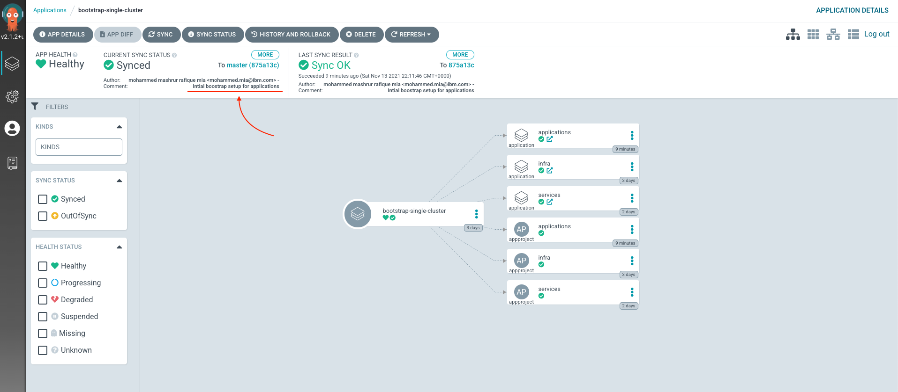

      Note the the commit message in sync status. It should be of commit from the last step.

5. *The `bootstrap-single-cluster` application deployed the "applications" ArgoCD Application and AppProject*

      Note the "applications" ArgoCD application icon which should appears new:

      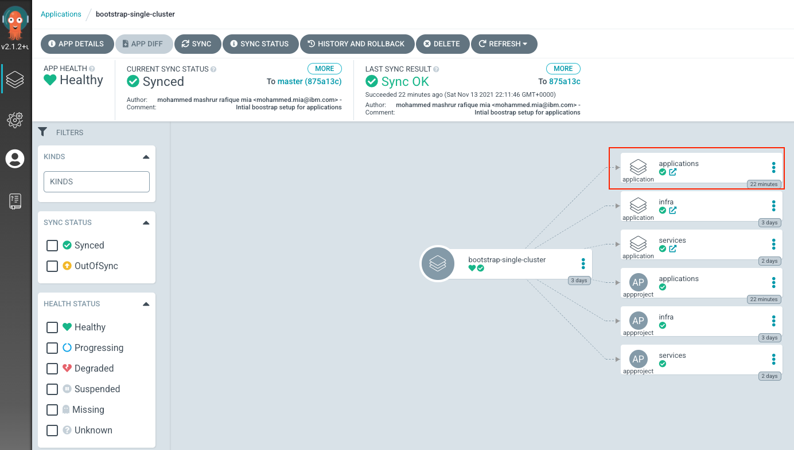

      We can examine the this "applications" ArgoCD application, either from `Applications > applications` top menu, or simply clicking the link sub-icon within the applications icon:

      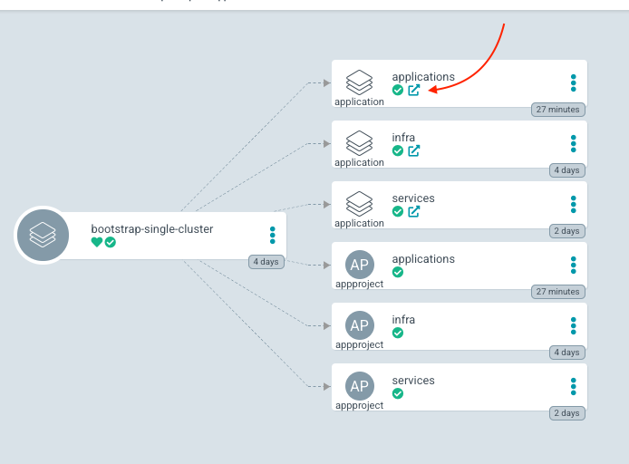  


6. *Select resources to deploy*

      At this time, the `applications` ArgoCD application has not yet deploy any other applications in turn. 

      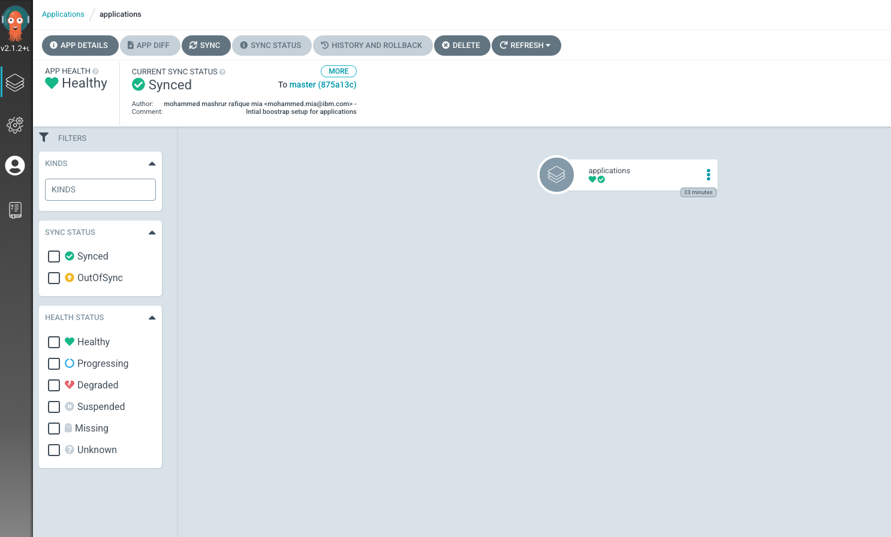  

      The reason is that it is kustomize based application definition, where all resources are commented out at this time.

      Access the `0-bootstrap/single-cluster/3-apps/kustomization.yaml`:

      ```bash
      cat 0-bootstrap/single-cluster/3-apps/kustomization.yaml
      ```

      and you should notice all resources are commented out.

      Open `0-bootstrap/single-cluster/3-apps/kustomization.yaml` and uncomment the following:

      ``` {.yaml .copy-copy}
      - argocd/soapserver/soapserver.yaml
      ```

      if you take a diff now:

      ```bash
      git diff --unified=0
      ```

      you should see the following:

      ```{ .diff .no-copy}
      diff --git a/0-bootstrap/single-cluster/3-apps/kustomization.yaml b/0-bootstrap/single-cluster/3-apps/kustomization.yaml
      index 7a3bce4..c695ae5 100644
      --- a/0-bootstrap/single-cluster/3-apps/kustomization.yaml
      +++ b/0-bootstrap/single-cluster/3-apps/kustomization.yaml
      @@ -22 +22 @@ resources:
      -#- argocd/soapserver/soapserver.yaml
      +- argocd/soapserver/soapserver.yaml
      ```

1. *Push GitOps changes to GitHub*

      Let’s make these GitOps changes visible to the ArgoCD
      `bootstrap-single-cluster` application via GitHub.

      Add all changes in the current folder to a git index, commit
      them, and push them to GitHub:

      ```bash
      git add .
      git commit -s -m "Deploying apps"
      git push origin $GIT_BRANCH
      ```


1. *The `bootstrap-single-cluster` application detects the change and resyncs*

      Once these changes to our GitOps repository are seen by ArgoCD, it will resync the cluster to the desired new state.

      Switch to the ArgoCD UI Applications view to see the changes:    
    
      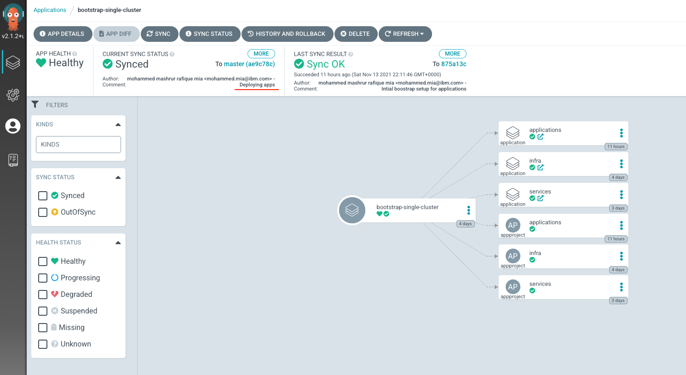  

      Note the the commit message in sync status. It should be of commit from the last step.

1. *The `applications` application*

      Switch to "applications" ArgoCD application on the ArgoCD UI (either by clicking on the link sub-icon from the "applications" resource icon, or from the top menu `Applications -> applications`)

      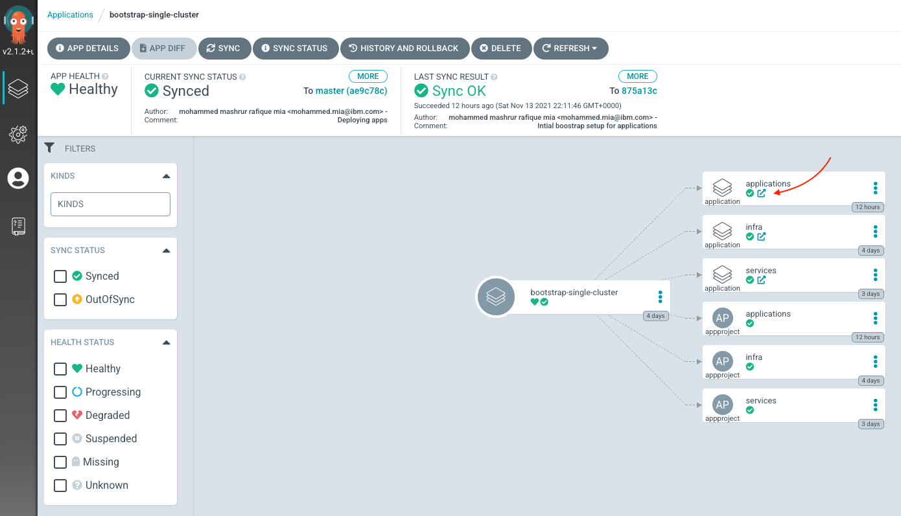  

      The "applications" ArgoCD application will be updated to have `apps-soapserver-tools` application: 
    
      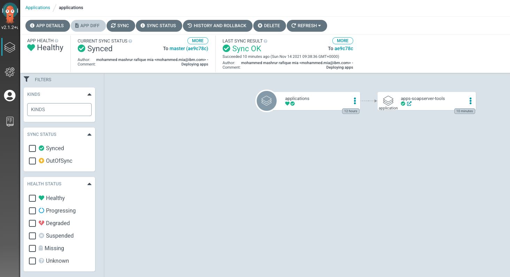  

1. *apps-soapserver-tools* application*

    Open the `apps-soapserver-tools` application (either by clicking on the link sub-icon from the "apps-soapserver-tools" resource icon, or from the top menu `Applications > apps-soapserver-tools`)

    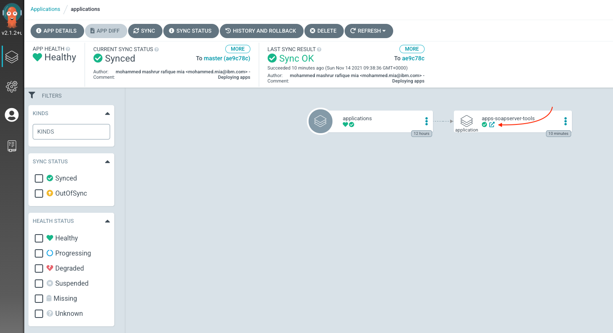  

    The `apps-soapserver-tools` application, in turn deploys `prod-app-soapserver` application:

    

    Open the application (either by clicking on the link sub-icon from the "applications" resource icon, or from the top menu `Applications > prod-app-soapserver`)

    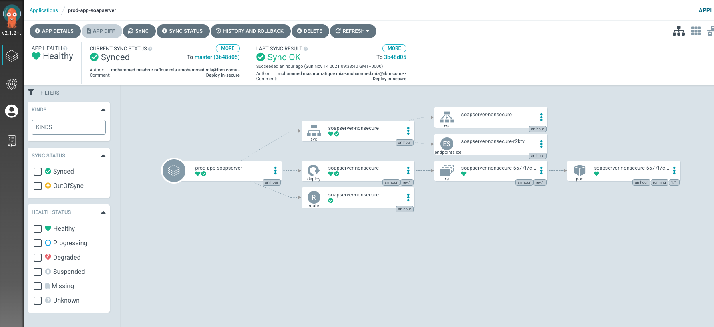

    Notice the resources deployed by the application:

    * Deployment, `soapserver-nonsecure`
    * Service, `soapserver-nonsecure`
    * Route, `soapserver-nonsecure`

    Click on the resource icons to see details of their deployments.

    For instance, the Deployment, `soapserver-nonsecure`, provides a summary page showing the status and health:
    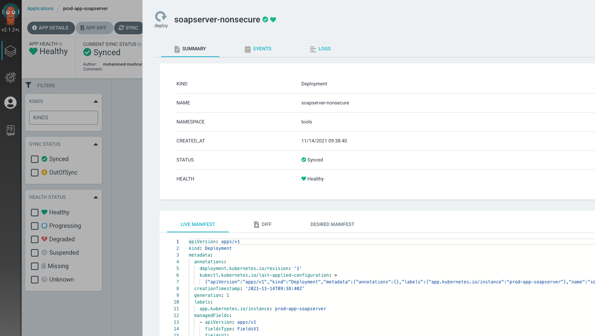  

    events:

    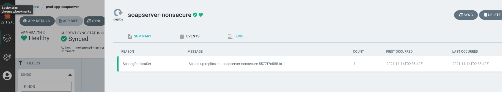

    and logs:

    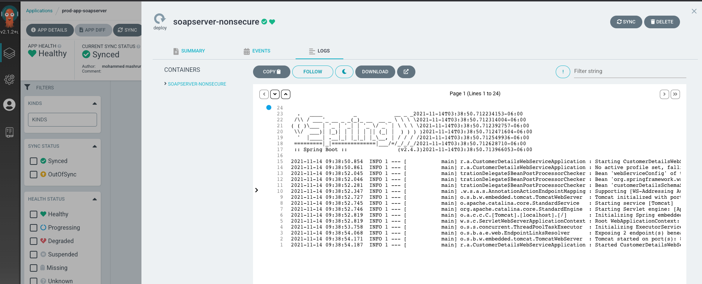  

## Verify deployment of backend SOAP service

Now that the service has been deployed, you can see the resource instances in your OCP cluster. From the Route object under `tools` namespace, you can see the exposed route, `soapserver-nonsecure`, and you can find the host name of the SOAP service. The host name can be used externally outside the cluster to send SOAP request. Following video shows how you can use OCP and SOAP UI to verify the service deployment:

<figure markdown>
  <iframe src="https://ibm.ent.box.com/embed/s/2e3mbbounkih2sr2434v6o7yi9ik5xhd?sortColumn=date&view=list" 
    width="800" height="550" frameborder="0" allowfullscreen webkitallowfullscreen msallowfullscreen>
  </iframe>
</figure>

