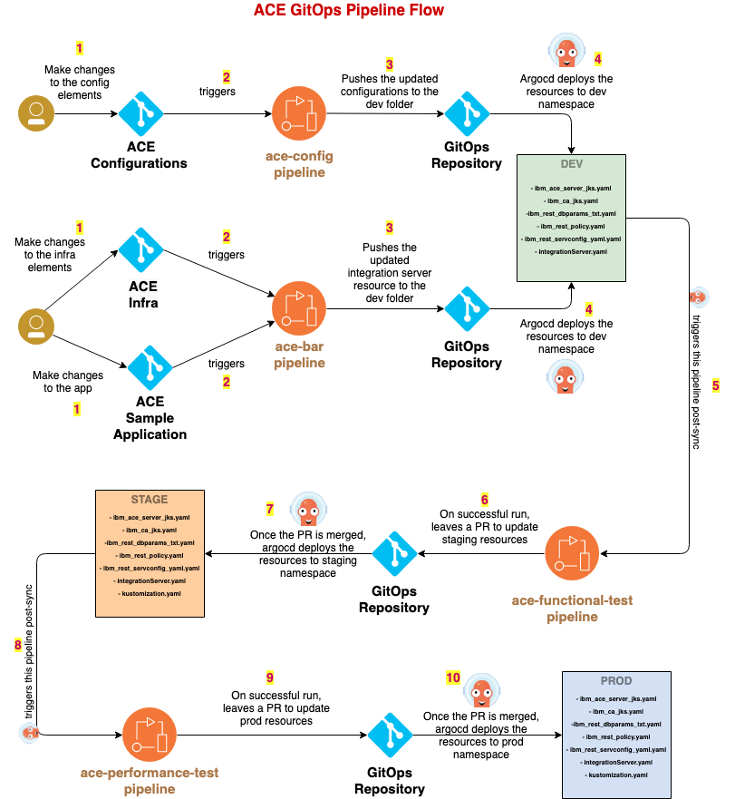
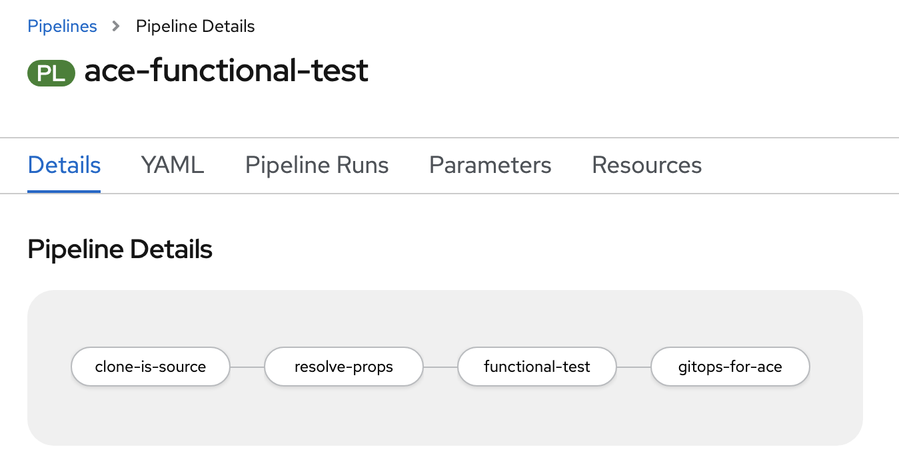
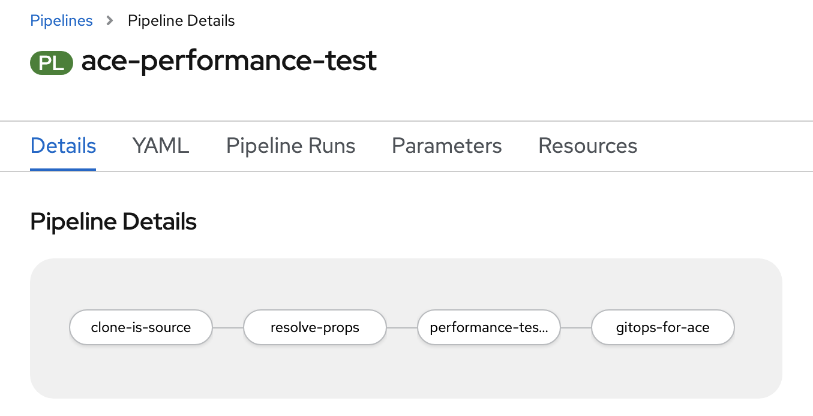
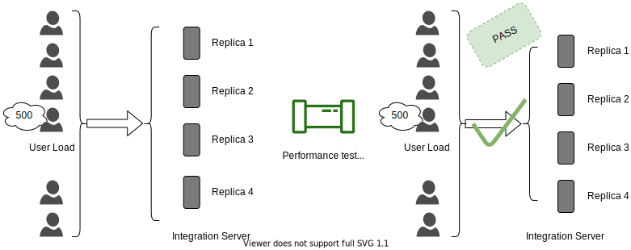
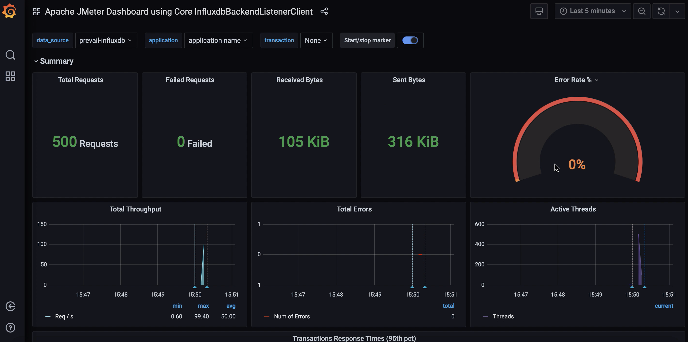
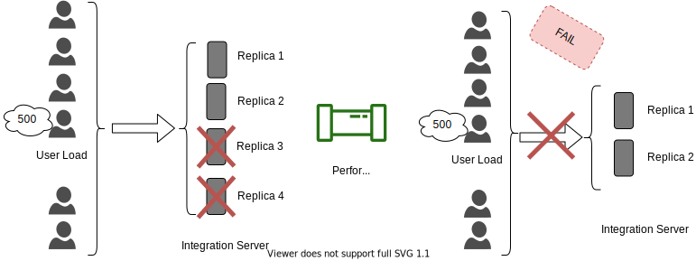
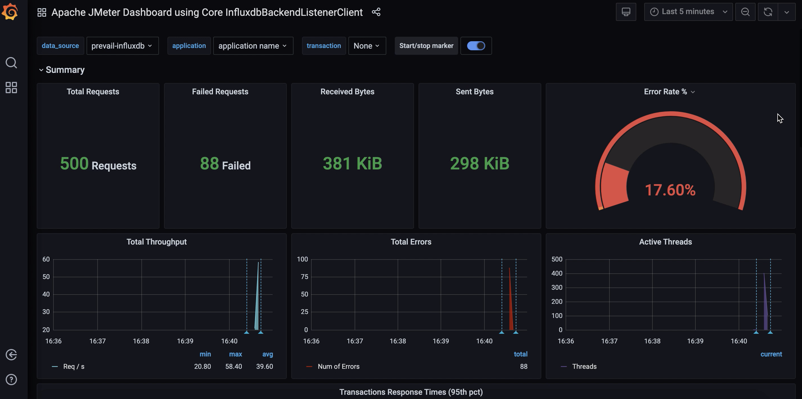

# Promoting between Environments

<!--- cSpell:ignore qube cntk autoplay allowfullscreen sandboxing usecase thoroughly usecases argoproj jmeter  -->

## Basic Promotion Process
**Audience**: Architects, Application developers

The sample pipeline flow that we built will demonstrate the set of practices we designed to effectively deliver the sample ACE code across environments.

In this topic, we're going to discuss:

* Deployment environments
* Promoting deliverables across environments

### Deployment environments

For the basic promotion process, in our CI/CD process, typical environments include development, staging and production. Also, we are using a dedicated environment to run our CI/CD pipelines. These environments are defined as distinct projects within a cluster.


#### Dev, Stage and Prod environments

**Dev** environment is the primary environment and it is used for sandboxing. During the development process, developers use this environment to test their code. This will allow them to thoroughly test the sample ACE application code, its configuration code as well as the infrastructure code.

**Stage** environment is sort of pre prod environment. All the sample ACE application deliverables that are ready to be pushed to the prod environment should be thoroughly tested here.

**Prod** environment will host all live services that belong to the ACE workloads. These deliverables will be consumed by the end user.

#### CI environment

**CI** environment is used run all the ace pipelines. This includes all the tasks (custom / reusable task from [cloud native toolkit](https://cloudnativetoolkit.dev/)), pipelines, necessary triggers etc.

### Promoting deliverables across environments

For our sample usecase, end to end basic promotion process is as follows.



1. For this sample usecase, we are maintaining three source code repositories for maintaining ACE configuration, infrastructure and a sample application that helps us to demonstrate the work flow. Webhooks are configured for all these three repositories hooking them up with corresponding pipelines. If there are any updates to the source code, you can push changes to the respective repositories.

2. When the changes are pushed, underlying webhooks will trigger corresponding pipelines. When we make changes to the [ace-config](https://github.ibm.com/cpat-int-samples/eaglebank-ace-config) repository, it will trigger `ace-config-pipeline`. Similarly, when we make changes to [ace-infra](https://github.ibm.com/cpat-int-samples/eaglebank-ace-infra) repository or [ace-sample-application](https://github.ibm.com/cpat-int-samples/createCustomer_REST_V1), it will trigger `ace-bar-pipeline`.

3. Once these pipelines are run successfully, the updated resources are pushed to the [dev](https://github.com/vgadepal/multi-tenancy-gitops/tree/master/1-apps/instances/namespace-dev/ace-app/config/dev/base) destination in the [gitops](https://github.com/vgadepal/multi-tenancy-gitops) repository.

4. Subsequently, a dedicated ArgoCD application watches for the updates, which it deploys to the cluster in the `DEV` environment.

5. Once the deployment is successful, the ArgoCD post-sync trigger will fire the `ace-functional-test-pipeline`.

6. If `ace-functional-test-pipeline` runs successfully, it will make changes to the [stage](https://github.com/vgadepal/multi-tenancy-gitops/tree/master/1-apps/instances/namespace-staging/ace-app/config/staging/base) resources and leave a Pull Request in the [gitops](https://github.com/vgadepal/multi-tenancy-gitops) repository.

7. Then the Pull Request will be reviewed manually and the changes to the stage resources are merged into the [gitops](https://github.com/vgadepal/multi-tenancy-gitops) repository.

8. Subsequently, a dedicated ArgoCD application watches for the updates, which it deploys to the cluster in the `STAGE` environment.

9. Once the deployment is successful, the ArgoCD post-sync trigger will fire the `ace-performance-test-pipeline`.

10. If `ace-performance-test-pipeline` runs successfully, it will make changes to the [prod](https://github.com/vgadepal/multi-tenancy-gitops/tree/master/1-apps/instances/namespace-prod/ace-app/config/prod/base) resources and leave a Pull Request in the [gitops](https://github.com/vgadepal/multi-tenancy-gitops) repository.

7. Then the Pull Request will be reviewed manually and the changes to the prod resources are merged into the [gitops](https://github.com/vgadepal/multi-tenancy-gitops) repository.

8. Subsequently, a dedicated ArgoCD application watches for the updates, which it deploys to the cluster in the `PROD` environment.


## Development Environment
**Audience**: Architects, Application developers

In this topic, we're going to discuss:

* Development environment
* Triggers in dev environment
* Functional test Pipeline

### Development environment


When the changes are made to the source repositories, respective pipelines will run and build the necessary deliverables. These deliverables will be deployed to the development environment and will be subjected to first phase of testing allowing to validate the deployment.

- This deployment in development environment is done by ArgoCD. ArgoCD’s role is to perform continuous deployment, ensuring that the cluster is always kept up-to-date with the latest built application.
- This is the first environment where the deliverable is deployed. If this deployment is a success, then this will be the first step that ensures that this deliverable can be promoted to production at some point of time.
- Once the deliverable is successfully deployed, we can validate different properties of the system which may functional or non-functional. Not only, we can also validate the configurations of the deliverable. In our sample promotion process, we showed an example of functional tests that are part of functional test pipeline. Depending on the usecases this pipeline can be further extended or modified.
- If everything works fine, we can promote the deliverable to next environment and deploy it there.

### Triggers in dev environment

- In our sample dev environment, like mentioned earlier, we set up argo resource hooks.
- Resource hooks will help us to run a job before, during and after a ArgoCD sync operation is done. In our workflow, we used a `PostSync` hook.
- This `PostSync` hook is responsible for running the `functional test pipeline` when a new deliverable is deployed in the `dev` environment.

This `PostSync` hook is a simple Kubernetes job annotated with `argocd.argoproj.io/hook`. Our `PostSync` hook definition is as follows.

```
apiVersion: batch/v1
kind: Job
metadata:
  name: trigger-functional-test
  annotations:
    argocd.argoproj.io/hook: PostSync
spec:
  template:
    spec:
      serviceAccountName: pipeline
      containers:
      - name: functional-test
        image: quay.io/rhcanada/tkn-cli
        command:
          - tkn
        args:
          - -n
          - ci
          - pipeline
          - start
          - ace-functional-test
          - --param
          - is-source-repo-url=git@github.ibm.com:cpat-int-samples/createCustomer_REST_V1.git
          - --param
          - is-source-repo-private-key=id_create-customer-rest-v1
          - --param
          - source-env=dev
          - --param
          - destination-env=staging
          - --workspace
          - name=shared-workspace,claimName=ace-test-pvc
          - --serviceaccount
          - pipeline
      restartPolicy: Never
  backoffLimit: 0
```

### Functional Test Pipeline



#### clone-is-source
- Clones the source repositories.

#### resolve-props
- Initially, it will grab all the source properties values.
- Then, it also resolves the necessary ocp properties.

#### functional-test
- Waits for the deliverables to be successfully deployed and get active in the development environment.
- Grabs the route of the deliverable.
- Performs [functional testing](../promoting-environments/#functional-tests) using newman test scripts.

#### gitops-for-ace
- Clones the gitops repository.
- Copies the deliverables from dev to staging.
- Update the kustomization.yaml with latest resources.
- Pushes the changes to gitops repository.

## Functional Tests
**Audience**: Architects, Application developers

In this topic, we're going to discuss:

- Postman
- Test scripts
- Newman
- Advantages

### Postman

- Postman is a tool that is used for API automation.
- This tools helps us to automate many tests like unit tests, integration tests, end to end tests etc.
- Based on the test scripts we define, this validates the respective APIs by making sure that the responses received are valid.
- It also allows us to save a bunch of API requests as a collection. Grouping the requests together will allow easier access.
- These collections can be exported as JSON files and stored.

### Test scripts

For our sample, the Postman collection is exported as a `test.json` and you can have a look at it [here](https://github.ibm.com/cpat-int-samples/createCustomer_REST_V1/blob/master/test/newman/test.json).

In this test script, we defined couple of automated APIs as follows.

- [Create customer](https://github.ibm.com/cpat-int-samples/createCustomer_REST_V1/blob/master/test/newman/test.json#L9)
- [No Service Record](https://github.ibm.com/cpat-int-samples/createCustomer_REST_V1/blob/master/test/newman/test.json#L79)
- [Bad Phone Number](https://github.ibm.com/cpat-int-samples/createCustomer_REST_V1/blob/master/test/newman/test.json#L140)

### Newman

Newman is the command-line collection runner. It allows us to run the test scripts from the command line.

- This one can be easily used in the continuous integration and build systems.
- Like mentioned earlier, the collection that is exported as json files from Postman can be used to run the tests using Newman.

We are using the below command as part of our functional testing task.

```
newman run \
  --ssl-extra-ca-certs /client-certs/$(params.ca-cert) \
  --ssl-client-key /client-certs/$(params.client-key) \
  --ssl-client-cert /client-certs/$(params.client-cert) \
  --env-var username=$BASIC_AUTH_USERNAME \
  --env-var password=$BASIC_AUTH_PASSWORD \
  --env-var host=$route \
  $test_file
```

We are passing the necessary client certificates, authentication information, host information along with the test json file.

### Advantages

Some advantages are:

- Ensures all the APIs are working properly.
- Detects if any bugs exists.
- Helps us to improve the application and make it better.


## Test Environment
**Audience**: Architects, Application developers

In this topic, we're going to discuss:

* Staging environment
* Triggers in staging environment
* Performance test pipeline


### Staging environment


When the Pull Request with the changes in staging resources get merged into the GitOps repository, the deliverables for staging environment will be updated. These deliverables will be deployed to the stage environment and will be subjected to second phase of testing allowing to validate the deployment.

- This deployment in staging environment is done by ArgoCD. ArgoCD’s role is to perform continuous deployment, ensuring that the cluster is always kept up-to-date with the latest built application.
- This is the next environment after dev where the deliverable is deployed and is exact replica of production environment. If this deployment is a success, then this will ensure that this deliverable can be promoted to production environment.
- Once the deliverable is successfully deployed, we can perform different tests like User Acceptance Tests (UAT), load/stress testing, chaos engineering tests etc. In our sample promotion process, we showed an example of load tests that are part of performance test pipeline. Depending on the usecases this pipeline can be further extended or modified.
- If everything works fine, we can promote the deliverable to next environment and deploy it there.

### Triggers in staging environment

- In our sample stage environment, like mentioned earlier, we set up argo resource hooks.
- Resource hooks will help us to run a job before, during and after a ArgoCD sync operation is done. In our workflow, we used a `PostSync` hook.
- This `PostSync` hook is responsible for running the `performance test pipeline` when a new deliverable is deployed in the `stage` environment.

This `PostSync` hook is a simple Kubernetes job annotated with `argocd.argoproj.io/hook`. Our `PostSync` hook definition is as follows.

```
apiVersion: batch/v1
kind: Job
metadata:
  name: trigger-performance-test
  namespace: ci
  annotations:
    argocd.argoproj.io/hook: PostSync
spec:
  template:
    spec:
      serviceAccountName: pipeline
      containers:
      - name: performance-test
        image: quay.io/rhcanada/tkn-cli
        command:
          - tkn
        args:
          - -n
          - ci
          - pipeline
          - start
          - ace-performance-test
          - --param
          - is-source-repo-url=git@github.ibm.com:cpat-int-samples/createCustomer_REST_V1.git
          - --param
          - is-source-repo-private-key=id_create-customer-rest-v1
          - --param
          - source-env=staging
          - --param
          - destination-env=prod
          - --param
          - jmeter-users=500
          - --workspace
          - name=shared-workspace,claimName=ace-test-pvc
          - --serviceaccount
          - pipeline
      restartPolicy: Never
  backoffLimit: 0
```

### Performance Test Pipeline



#### clone-is-source
- Clones the source repositories.

#### resolve-props
- Initially, it will grab all the source properties values.
- Then, it also resolves the necessary ocp properties.

#### performance-test
- Performs [load testing](../promoting-environments/#performance-tests) using jmeter test scripts.

#### gitops-for-ace
- Clones the gitops repository.
- Copies the deliverables from staging to prod.
- Update the kustomization.yaml with latest resources.
- Pushes the changes to gitops repository.

## Performance Tests
**Audience**: Architects, Application developers

In this topic, we're going to discuss:

- Introduction
- Apache Jmeter
- Datastore
- Grafana
- Validating our sample application
- Advantages

!!!note
    The contents in this guide are only examples. We demonstrated some of the practices using some sample usecases. For real world scenarios, it should be used in conjunction with existing performance practices and this content is not a replacement. For assistance, CSMs should reach out to performance SMEs.

### Introduction


In our sample performance test task, we are using Jmeter as our performance load testing tool. The live data from Jmeter will be fed into a datastore. Based on this data, the metrics can be visualized using Grafana dashboard.

### Apache Jmeter

Jmeter is an open source java based tool. It helps us to measure the performance of the application. We can basically analyze the load functional behavior of the application.

- Jmeter simulates the load, for instance it simulates a group of users and keep sending requests to the target server.
- We can define a test plan script. All the necessary configurations will be provided here.
- Once we run the Jmeter tests, results will be available.

#### Sample test plan

Our sample app test plan can be accessed [here](https://github.ibm.com/cpat-int-samples/createCustomer_REST_V1/blob/master/jmeter_test_plan/createCustomer_ace_testplan.jmx).

If you have a look at the test plan, you will see different configuration elements.

For example, you can see `__P(jmeter_users,3)` in one of the `ThreadGroup` elements. The default number of users we are providing here is 3, but number of users is parameterized. We will be passing this information as part of pipeline. In our sample load tests, we are creating a user load of about 500 and testing things out.

#### Running jmeter tests

Below is the `jmeter` command we used as part of our tests.

```
jmeter.sh \
  -Djavax.net.ssl.keyStoreType=jks \
  -Djavax.net.ssl.keyStore=/client-certs/ibm-client.jks \
  -Djavax.net.ssl.keyStorePassword=${KEYSTORE_PASSWORD} \
  -n -t $test-plan \
  -Jjmeter_users=$jmeter_users \
  -l /tmp/report.jtl
```

Here we are providing the keystore information and test plan script along with the user load information to the Jmeter. Once the command is executed successfully, it loads the results into `/tmp/report.jtl` file.

### Datastore

Jmeter writes the real time test results into a datastore which will be further used for analysis, metric generation etc.

In order to integrate Jmeter with datastore, we use a [Backend Listener](https://jmeter.apache.org/usermanual/component_reference.html#Backend_Listener).

Currently, in our sample work flow, we are using InfluxDB as our datastore. InfluxDB is a time series database. It handles time-stamped data. The backend listener configuration for the same is as follows.

```
<BackendListener guiclass="BackendListenerGui" testclass="BackendListener" testname="Backend Listener" enabled="true">
        <elementProp name="arguments" elementType="Arguments" guiclass="ArgumentsPanel" testclass="Arguments" enabled="true">
          <collectionProp name="Arguments.arguments">
            <elementProp name="influxdbMetricsSender" elementType="Argument">
              <stringProp name="Argument.name">influxdbMetricsSender</stringProp>
              <stringProp name="Argument.value">org.apache.jmeter.visualizers.backend.influxdb.HttpMetricsSender</stringProp>
              <stringProp name="Argument.metadata">=</stringProp>
            </elementProp>
            <elementProp name="influxdbUrl" elementType="Argument">
              <stringProp name="Argument.name">influxdbUrl</stringProp>
              <stringProp name="Argument.value">http://influxdb-service.tools.svc.cluster.local:8086/write?db=gatling</stringProp>
              <stringProp name="Argument.metadata">=</stringProp>
            </elementProp>
            <elementProp name="application" elementType="Argument">
              <stringProp name="Argument.name">application</stringProp>
              <stringProp name="Argument.value">application name</stringProp>
              <stringProp name="Argument.metadata">=</stringProp>
            </elementProp>
            <elementProp name="measurement" elementType="Argument">
              <stringProp name="Argument.name">measurement</stringProp>
              <stringProp name="Argument.value">jmeter</stringProp>
              <stringProp name="Argument.metadata">=</stringProp>
            </elementProp>
            <elementProp name="summaryOnly" elementType="Argument">
              <stringProp name="Argument.name">summaryOnly</stringProp>
              <stringProp name="Argument.value">true</stringProp>
              <stringProp name="Argument.metadata">=</stringProp>
            </elementProp>
            <elementProp name="samplersRegex" elementType="Argument">
              <stringProp name="Argument.name">samplersRegex</stringProp>
              <stringProp name="Argument.value">.*</stringProp>
              <stringProp name="Argument.metadata">=</stringProp>
            </elementProp>
            <elementProp name="percentiles" elementType="Argument">
              <stringProp name="Argument.name">percentiles</stringProp>
              <stringProp name="Argument.value">90;95;99</stringProp>
              <stringProp name="Argument.metadata">=</stringProp>
            </elementProp>
            <elementProp name="testTitle" elementType="Argument">
              <stringProp name="Argument.name">testTitle</stringProp>
              <stringProp name="Argument.value">Test name</stringProp>
              <stringProp name="Argument.metadata">=</stringProp>
            </elementProp>
            <elementProp name="eventTags" elementType="Argument">
              <stringProp name="Argument.name">eventTags</stringProp>
              <stringProp name="Argument.value"></stringProp>
              <stringProp name="Argument.metadata">=</stringProp>
            </elementProp>
          </collectionProp>
        </elementProp>
        <stringProp name="classname">org.apache.jmeter.visualizers.backend.influxdb.InfluxdbBackendListenerClient</stringProp>
      </BackendListener>
```

Note: We are working on replacing the InfluxDB with Prometheus. Once we have the implementation, we will document the steps here.

### Grafana

We are using Grafana for visualization and metric analysis. Grafana will read the information from the datastore and display it on the dashboard.

### Validating our sample application

If we run the performance test pipeline, what basically happens is Jmeter writes the real time test results into the datastore using a backend listener and Grafana will read the data from it and then in turn display it on the dashboard.

In our sample workflow, we are using a user load of about `500` with a replica of `4` integration servers as follows. When the performance test pipeline is run, Jmeter tests will run. It validates the user load and passes successfully as shown if the servers can efficiently handle the load generated.



Once the jmeter tests complete, the data will be loaded into the datastore and eventually displayed in Grafana as follows.



Similarly, now we are using a user load of about `500` and reducing the integration server replica to `2`. When the performance test pipeline is run, Jmeter tests will run. It validates the user load and fails as follows if the servers can't efficiently handle the load generated.



Once the jmeter tests complete, the data will be loaded into the datastore and eventually displayed in Grafana as follows.



### Advantages

Some of the advantages are:

- Allows us to identify performance bottlenecks.
- Identify bugs.
- System downtime can be reduced.


## Production Environment
**Audience**: Architects, Application developers

In this topic, we're going to discuss:

* Production environment

### Production environment


When the Pull Request with the changes in prod resources get merged into the GitOps repository, the deliverables for prod environment will be updated. These deliverables will be deployed to the prod environment.

- This deployment in production environment is done by ArgoCD. ArgoCD’s role is to perform continuous deployment, ensuring that the cluster is always kept up-to-date with the latest built application.
- This is the next environment after stage where the deliverable is finally deployed.
- Once the deliverable is successfully deployed, it will be made available to the end user.


