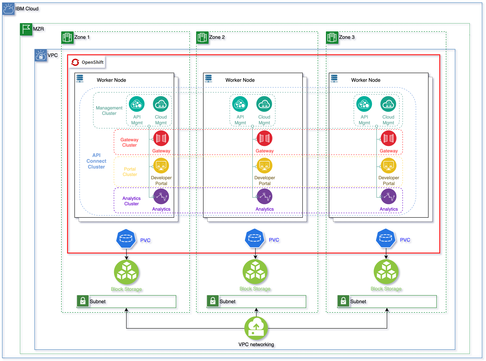

# IBM API Connect Architecture on IBM Cloud

<!--- cSpell:ignore ibmc APIC Availability unmanaged practioners Pak Paks Quickstart qube cntk autoplay allowfullscreen -->

!!! abstract
    This document describes what a highly available production ready deployment of [IBM API Connect](https://www.ibm.com/docs/en/api-connect/10.0.x?topic=api-connect-overview) looks like on the [RedHat OpenShift Kubernetes Service on IBM Cloud](https://www.ibm.com/cloud/openshift), known as ROKS, on [Virtual Private Cloud (VPC) Gen 2](https://www.ibm.com/cloud/vpc) infrastructure.

[{: style="max-height:1000px"}](https://app.diagrams.net/#Hcloud-native-toolkit%2Fmulti-tenancy-gitops%2Fmaster%2Fdoc%2Fdiagrams%2FAPIC-IBM-ROKS-VPC-Arch.drawio)

!!! tip
    <a href="https://raw.githubusercontent.com/cloud-native-toolkit/multi-tenancy-gitops/master/doc/diagrams/APIC-IBM-ROKS-VPC-Arch.drawio" download>Right-click here and select "Save Link As" to download the DrawIO file</a> used to generate these diagrams or [open the diagram using diagrams.net](https://app.diagrams.net/#Hcloud-native-toolkit%2Fmulti-tenancy-gitops%2Fmaster%2Fdoc%2Fdiagrams%2FAPIC-IBM-ROKS-VPC-Arch.drawio)

As we can see in the topology above, the OpenShift cluster has been deployed on a MultiZone Region (MZR) data center where Virtual Private Cloud Gen 2 is available. For having IBM API Connect deployed in high availability, we need at least three worker nodes, each of these deployed on a different availability zone (an extra worker node is recommended when worker nodes need to be upgraded so that the extra node gets the load drained from the initial worker node being upgraded). We also need a minimum of 14 vCPUs and 48 Gigabytes of memory to install the `n3xc14.m48` IBM API Connect profile, which is the recommended profile for larger systems and for **production environments** in the latest [IBM API Connect v10.0.3.0](https://www.ibm.com/docs/en/api-connect/10.0.x?topic=configuration-basic-settings#apic_cluster_crd_basic__deployment_profile_section). You can search for more detailed IBM API Connect system requirements [here](https://www.ibm.com/software/reports/compatibility/clarity/softwareReqsForProduct.html)

Once the above requirements are met, we can tell the IBM API Connect Operator to deploy an IBM API Connect Cluster instance using its high availability profile (`n3xc14.m48`). This profile, as you can see in the topology above, will deploy each of the IBM API Connect components (the Management System, made up of the Cloud Manager and the API Manager, the Gateway Service, the Developer Portal Service and the Analytics Service) in high availability. That is, each of the IBM API Connect components will be deployed with a replica factor of 3, using the Kubernetes affinity property to place each of these replicas in different nodes. Those set of replicas will, in turn, form a cluster object that the API Connect Operator understands, monitors and takes care of. As a result, our highly available IBM API Connect deployment is made up of a Management Cluster, Gateway Cluster, Portal Cluster and Analytics Cluster.

Of course, some of the IBM API Components aforementioned need to store state and/or data. The technologies used for that like Postgresql or Etcd will be deployed in the same highly available fashion having three replicas one in each availability zone. 

As to the storage technology IBM API Connect requires, it is block storage that is claimed through the corresponding Persistent Volume Claims. The storage is provided by IBM Cloud Object Storage from your Virtual Private Cloud.

!!! danger "Important"
    The `storageClass` required by IBM API Connect **must be of type** [**`metro`**](https://cloud.ibm.com/docs/openshift?topic=openshift-vpc-block#vpc-block-reference). 

!!! info
    What `metro` means is that the `volumeBindingMode` of that `storageClass` will be set to `WaitForFirstConsumer` as opposed to the default `Immediate`. And what that means is that the Persistent Volume creation and allocation by the IBM Cloud Object Storage, as a result of its Persistent Volume Claim, will not happen until the pod linked to that Persistent Volume Claim is scheduled. This allows IBM Cloud Object Storage to know what Availability Zone of your MultiZone Region cluster the pod requesting block storage ended up on and, as a result, to be able to provision such storage in the appropriate place. Otherwise, if we used a `storageClass` whose `volumeBindingMode` was the default `Immediate`, IBM Cloud Object Storage would create and allocate the Persistent Volume in one of the Availability Zones which might not be the same Availability Zone the pod requiring such storage ends up on as a result of the OpenShift pod scheduler which would make the storage inaccessible to the pod. See Kubernetes official documentation [here](https://kubernetes.io/docs/concepts/storage/storage-classes/#volume-binding-mode) for further detail.

!!! danger "Important"
    The `storageClass` required by IBM API Connect **must not have Retain Reclaim policy**. 

!!! info
    If you retain the Persistent Volume, it might end up assigned to a pod in a different Availability Zone later, making that storage inaccessible to the pod allocated to. 

!!! success "Summary"
    The `storageClassName` you would need to provide when creating your IBM API Connect cluster, in the [deployment section](../../apic/deployment/ibm-cloud.md), will need to be of either **`ibmc-vpc-block-metro-10iops-tier`**, **`ibmc-vpc-block-metro-5iops-tier`** or **`ibmc-vpc-block-metro-custom`** types.
