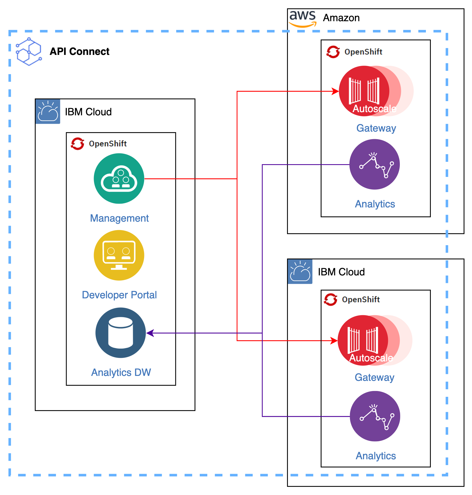

# IBM API Connect Multi-cloud Architecture

<!--- cSpell:ignore ibmc APIC Availability unmanaged practioners Pak Paks Quickstart qube cntk autoplay allowfullscreen multicloud -->

!!! abstract
    This document describes a multi-cloud deployment of [IBM API Connect](https://www.ibm.com/docs/en/api-connect/10.0.x?topic=api-connect-overview) across different cloud providers, all using RedHat OpenSift Container Platform as the underlying unified platform.

[{: style="max-height:700px"}](https://app.diagrams.net/#Hcloud-native-toolkit%2Fmulti-tenancy-gitops%2Fmaster%2Fdoc%2Fdiagrams%2FAPIC-Multi-cluster-Arch.drawio)

!!! tip
    <a href="https://raw.githubusercontent.com/cloud-native-toolkit/multi-tenancy-gitops/master/doc/diagrams/APIC-Multi-cluster-Arch.drawio" download>Right-click here and select "Save Link As" to download the DrawIO file</a> used to generate these diagrams or [open the diagram using diagrams.net](https://app.diagrams.net/#Hcloud-native-toolkit%2Fmulti-tenancy-gitops%2Fmaster%2Fdoc%2Fdiagrams%2FAPIC-Multi-cluster-Arch.drawio)

As we can see in the topology above for this use case, we have the brain of IBM API Connect, the Cloud Manager component, and the Developer Portal component on a RedHat OpenShift cluster hosted on IBM Cloud while the Gateway and Analytics components will be deployed on different RedHat OpenShift clusters hosted both in IBM Cloud as well as in Amazon AWS. This hybrid multi-cloud topologies are possible thanks to IBM API Connect components being completely independently deployable\*. Also, thanks to RedHat OpenShift Container Platform being the underlying unified platform to run IBM Software in containers, we should be able to deploy any of the IBM API Connect components to any cloud provider or on premise infrastructure where the RedHat OpenShift Container Platform can be deployed to.

!!! info
    We are deploying IBM API Connect and it's subsystems in standalone mode. That is, these are not being installed as part of the IBM Cloud Pak for Integration and, as a result, none of the Cloud Pak for Integration components, such as the Platform Navigator, Zen UI, etc is begin deployed alongside.

The aim of this topology is to support hybrid multi-cloud client use cases where applications will live in a mix of clouds as well as on premises. For these scenarios, we want to use IBM API Connect not only to develop, manage and socialize APIs in an agile manner but also to secure these APIs using IBM API Connect Gateways, which get realized as IBM DataPower instances.

For each of the IBM API Connect components, we can choose different deployment profiles in case we require that component to be highly available or not. Moreover, the IBM API Connect Gateway component (IBM DataPower) in IBM API Connect v10 comes with a Pod Autoscaling feature to ensure high availability of DataPower pods. As to the storage technology the different IBM API Connect components require, it is block storage that is claimed through the corresponding Persistent Volume Claims at deployment time.

!!! danger "Important"
    Block storage is provided differently depending on the cloud provider or on premises infrastructure your RedHat OpenShift clusters are hosted. Make sure you understand and review the different storage options you have available for each those RedHat OpenShift clusters you plan to deploy IBM API Connect components to. Also, some cloud providers have special storage classes for those RedHat OpenShift clusters that are hosted in Virtual Private Clouds (VPC). You can review in this guide the different storage options for the different cloud providers.

(\*) There are some restrictions as to how you deploy each of the IBM API Connect components. For instance, you must deploy the analytics component close to the Gateway component it is going to monitor.