# Deployment on IBM Cloud

<!--- cSpell:ignore singl apiconnectcluster ibmc APIC Availability unmanaged practioners Pak Paks Quickstart qube cntk autoplay allowfullscreen -->

!!! abstract
    This document describes a highly available production ready deployment of IBM API Connect on a RedHat OpenShift Kubernetes Service (ROKS) cluster on a Virtual Private Cloud (VPC) infrastructure on IBM Cloud using a GitOps approach

## Overview
The official IBM API Connect deployment instructions can be found [here](https://www.ibm.com/docs/en/api-connect/10.0.x?topic=openshift-installing-in-online-environment). However, we **strongly recommend to use a GitOps approach for managing your production environments**. That is, any interaction with your production environment will be done through committing changes to that Infrastructure, Configuration, etc as Code that is stored in a SCM repository such as GitHub that describes the desired state of your cluster.

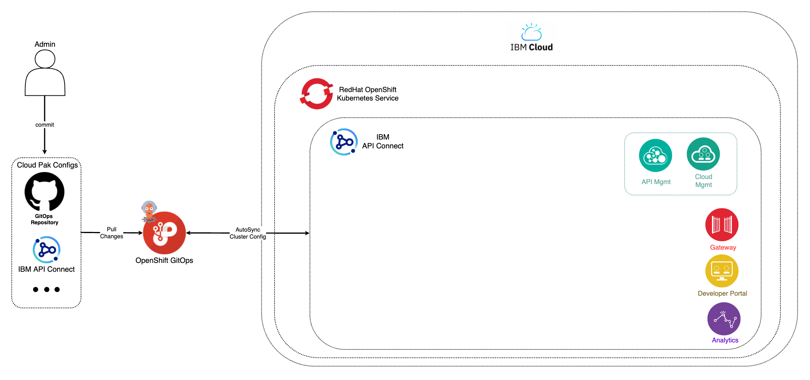{: style="max-height:700px"}

We will then leave the task to apply any needed change to our production environment to the GitOps tools, such as the RedHat OpenShift GitOps operator that uses ArgoCD for the mentioned task.


To deploy the API Connect production reference architecture on an OpenShift cluster, we are going to use the [IBM Cloud Native Toolkit GitOps Framework](../../../../gitops/structure.md). There are only five steps you need to take:

1. [Prereqs](#1-prereqs) - Make sure you have a RedHat OpenShift cluster and you are able to use the RedHat OpenShift CLI against it.

2. [Sealed Secrets](#2-sealed-secrets) - Provide the private key used to seal the secrets provided with the API Connect GitOps repository.

3. [RedHat OpenShift GitOps Operator](#3-redhat-openshift-gitops-operator) - Install the RedHat OpenShift GitOps operator which provides the GitOps tools needed for installing and managing IBM API Connect instances through the GitOps approach already explained.

4. [IBM API Connect](#4-ibm-api-connect) - Deploy an instance of IBM API Connect on your cluster.

5. [IBM API Connect Cloud Manager](#5-ibm-api-connect-cloud-manager) - Validate the installation of your IBM API Connect instance by making sure you are able to log into the IBM API Connect Cloud Manager.

### 1 - Prereqs

1. Get a clean RedHat OpenShift cluster deployed through the RedHat OpenShift Kubernetes Service on IBM Cloud where nothing else has been installed on top afterwards.

1. Log into your RedHat OpenShift cluster through the RedHat OpenShift CLI in order to execute commands to interact with it through your terminal.

### 2 - Sealed Secrets

1. Create the `sealed-secrets` project. This project will host the Sealed Secrets operator that will allow us to decrypt sealed secrets stored in GitHub.

    ```
    oc new-project sealed-secrets
    ```

1. Download the private key [sealed-secrets-ibm-demo-key.yaml](https://bit.ly/demo-sealed-master) used to seal any secret contained in this demonstration and apply it to the cluster. In our case, we have included a demo IBM Entitlement Key within the API Connect GitOps GitHub repository so that we are able to pull down IBM Software.

    ```
    oc apply -f sealed-secrets-ibm-demo-key.yaml
    ```

1. Remove the private key from your workstation.

    ```
    rm sealed-secrets-ibm-demo-key.yaml
    ```
    !!! danger "Important"
        **Do not check the file into git**. The private key **MUST NOT** be checked into GitHub under any circumstances. Please, remove the private key from your workstation to avoid any issues.

### 3 - RedHat OpenShift GitOps Operator

1. Clone the following GitHub repository that contains the GitOps structure that the Cloud Native Toolkit GitOps Framework understands.

    ```
    git clone https://github.com/cloud-native-toolkit-demos/multi-tenancy-gitops-apic.git
    ```

1. Change directory into `multi-tenancy-gitops-apic`.

    ```
    cd multi-tenancy-gitops-apic
    ```

    !!! warning
        Checkout the appropriate GitHub branch based on your RedHat OpenShift cluster version, either **4.6** or **4.7**. and the infrastructure it has been deployed onto, either **`classic`** or **`vpc`**. Choose from:

        * **`ocp4.6-vpc`**
        * **`ocp4.6-classic`**
        * **`ocp4.7-vpc`**
        * **`ocp4.7-classic`**
    
    Then checkout the appropriate branch by executing
    ```
    git checkout ocp4.6-classic
    ```

    * The difference between RedHat OpenShift version`4.6` and `4.7` is that the `4.6` version of RedHat OpenShift installs the RedHat OpenShift Pipelines operator when you install the RedHat OpenShift GitOps operator whereas for the `4.7` version of RedHat OpenShift we must declare explicitly the installation of that RedHat OpenShift pipelines. See [here](https://github.com/cloud-native-toolkit-demos/multi-tenancy-gitops-apic/blob/ocp4.7-vpc/0-bootstrap/argocd/single-cluster/2-services/kustomization.yaml#L66-L67).
    * The difference between `vpc` and `classic` infrastructures, where your RedHat OpenShift cluster goes on top of, is that we need to use different storage for our IBM API Connect Cluster. See [here](https://github.com/cloud-native-toolkit-demos/multi-tenancy-gitops-apps/blob/master/apic/environments/prod/apic-instance/ibm-apic-single-cluster-prod.yaml#L18) and [here](https://github.com/cloud-native-toolkit-demos/multi-tenancy-gitops-apps/blob/master/apic/environments/classic/apic-instance/ibm-apic-single-cluster-prod.yaml#L18) for a difference of these `storageClassName` between `vpc` and `classic` respectively. For `vpc` infrastructures we not only need to use block storage but a specific block storage type that allows IBM API Connect to be deployed highly available across multiple availability zones as explained in the beginning of this section.

1. Install the RedHat OpenShift GitOps operator on your RedHat OpenShift cluster and wait for it to be available:

    * If your RedHat OpenShift cluster version is 4.6
    ```
    oc apply -f setup/ocp46/
    while ! kubectl wait --for=condition=Established crd applications.argoproj.io; do sleep 30; done
    ```
    * If your RedHat OpenShift cluster version is 4.7
    ```
    oc apply -f setup/ocp47/
    while ! kubectl wait --for=condition=Established crd applications.argoproj.io; do sleep 30; done
    ```

    Once the above command returns, you can open your RedHat OpenShift Web Console and check out that the RedHat OpenShift GitOps operator has been successfully installed in the `openshift-gitops` project.

    {: style="max-height:1000px"}

    As you can see in the image, the RedHat OpenShift GitOps operator also installs the RedHat OpenShift Pipelines operator and ArgoCD (which will be that GitOps tool that synchronizes the Infrastructure/Configuration as Code we have stored in GitHub with the state of the RedHat OpenShift cluster). 
  
    !!!note 
        The RedHat OpenShift Pipelines operator gets installed by the RedHat OpenShift GitOps Subscription **only for RedHat OpenShift version 4.6**.
        
        If your RedHat OpenShift cluster is version 4.7, you will need to install the RedHat OpenShift Pipelines operator as part of the GitOps process explained in this section.
        
        For getting such RedHat OpenShift Pipelines operator installed, you would need to specify that in the `kustomize.yaml` file for the services layer you can find in `multi-tenancy-gitops-apic/0-bootstrap/argocd/single-cluster/2-services/kustomization.yaml`.

1. Open the ArgoCD web console by clicking on the ArgoCD console link you can see at the top of your RedHat OpenShift web console and log in.

    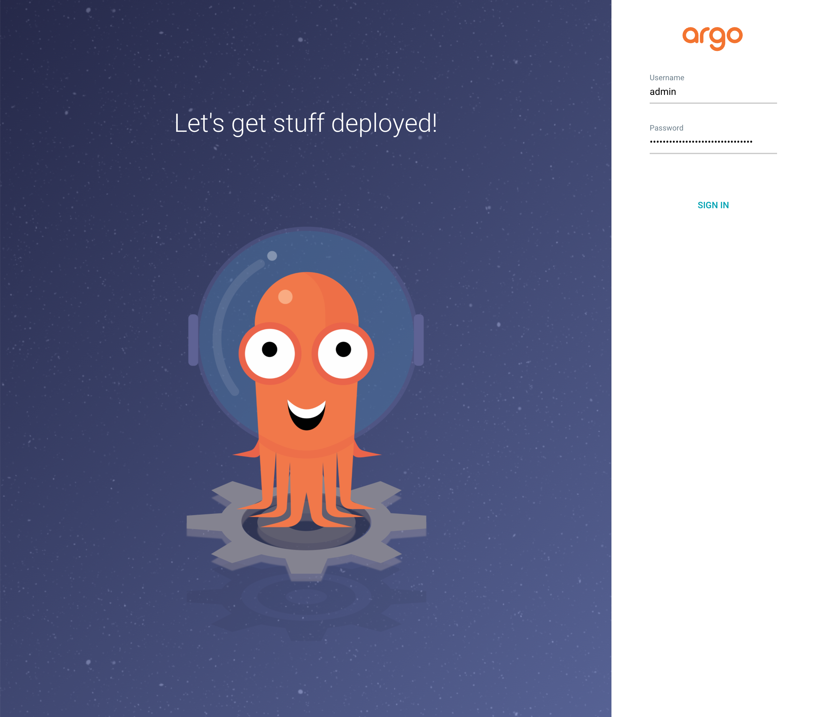{: style="max-height:1000px"}

    You can find your ArgoCD login password by executing:

    * If your RedHat OpenShift cluster version is 4.6
    ```
    oc extract secrets/argocd-cluster-cluster --keys=admin.password -n openshift-gitops --to=-
    ```
    * If your RedHat OpenShift cluster version is 4.7
    ```
    oc extract secrets/openshift-gitops-cluster --keys=admin.password -n openshift-gitops --to=-
    ```

    Once you login, you should see that your ArgoCD web console is empty as we have not deployed any Argo Application yet.

    {: style="max-height:1000px"}

### 4 - IBM API Connect

1. Install the ArgoCD Bootstrap Application

    ```
    oc apply -n openshift-gitops -f 0-bootstrap/argocd/bootstrap.yaml
    ```

    This ArgoCD Bootstrap Application will bootstrap the deployment of you IBM API Connect cluster based on the configuration you have defined in the GitOps GitHub repository we cloned earlier. You can see that in the GitOps approach used we integrate [Kustomize](https://kustomize.io/) for configuration management.

    As soon as you create this ArgoCD Bootstrap Application, the rest of the ArgoCD Applications and the respective RedHat Openshift resources these manage start to get created as a result of the synchronization process the GitOps approach is based on. You can see these ArgoCD Applications being created in the ArgoCD web console.

    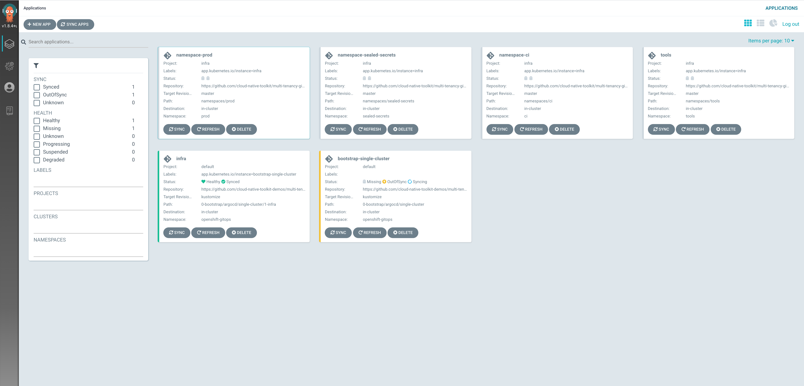{: style="max-height:1000px"}

1. After 5-10 minutes, you should see the IBM API Connect operator installed in the `openshift-operators` project in your RedHat OpenShift web console. You will also see the IBM Cloud Pak foundational services and IBM DataPower Gateway operators that the IBM API Connect operator depends on.

    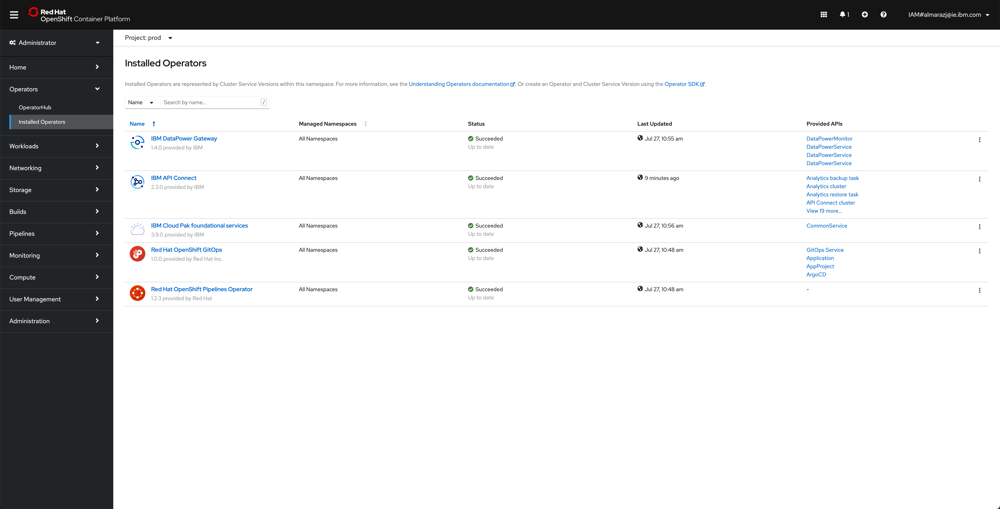{: style="max-height:1000px"}

    If you go back to your ArgoCD web console, you will see that all the ArgoCD Applications are green except from the ArgoCD Applications that are in charge of the actual IBM API Connect cluster instance and its pipelines (will explain later) that are `OutOfSync` in yellow.

    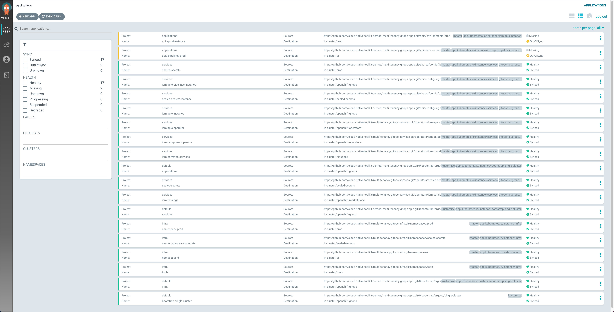{: style="max-height:1000px"}

    This is expected since the resources these ArgoCD Applications manage depend on the IBM API Connect operator that had not been successfully installed at the time when these two ArgoCD Application were created.

1. Synchronize the ArgoCD Applications that are still `OutOfSync` by clicking on the `SYNC APPS` button on the top right corner of the ArgoCD web console. Then, select those applications that are `OutOfSync` and click on `Sync` at the top.

    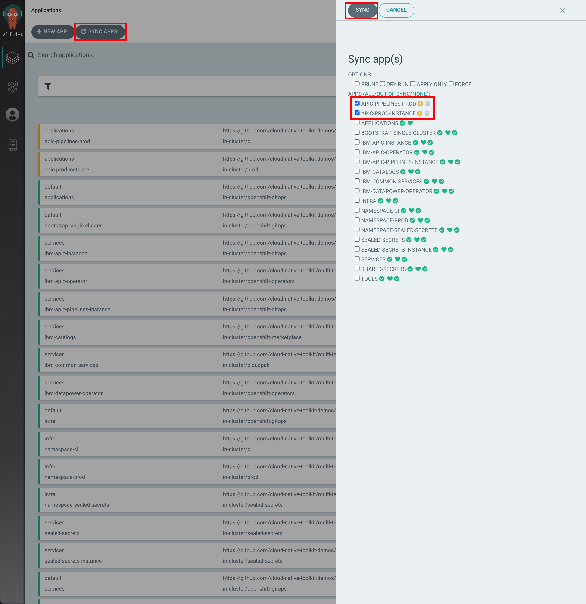{: style="max-height:1000px"}

    After few seconds you should now see all of the ArgoCD Applications in green.

    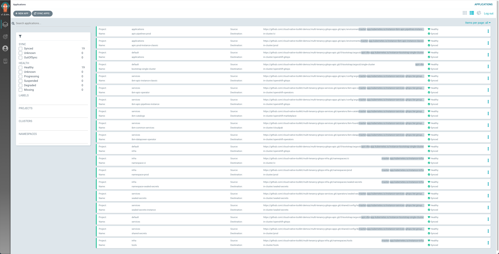{: style="max-height:1000px"}

1. If you go into the ArgoCD Application called `apic-prod-instance` (or `apic-prod-instance-classic` if you are installing on a RedHat OpenShift cluster on IBM Cloud classic infrastructure) within the `applications` ArgoCD Project, you can monitor the IBM API Connect cluster instance installation. You will see how RedHat OpenShift resources are being created as a result of having the `apic-prod-instance` ArgoCD Application created the initial `APIConnectCluster` resource, which was then picked up by the IBM API Connect operator that.

    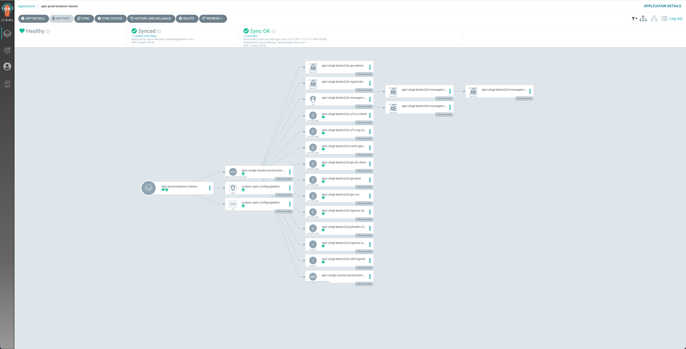{: style="max-height:1000px"}

1. If you go to `Installed Operators` --> `IBM API Connect` --> `All Instances` under the `prod` RedHat OpenShift Project, you should see the `apic-single-cluster-production` (or `apic-single-cluster-production` if you are installing on a RedHat OpenShift cluster on IBM Cloud classic infrastructure) `APIConnectCluster` object. As explained in the previous step, this object gets created by the IBM API Connect operator as a result of having the corresponding ArgoCD Application created a `APIConnectCluster` RedHat OpenShift Resource.

    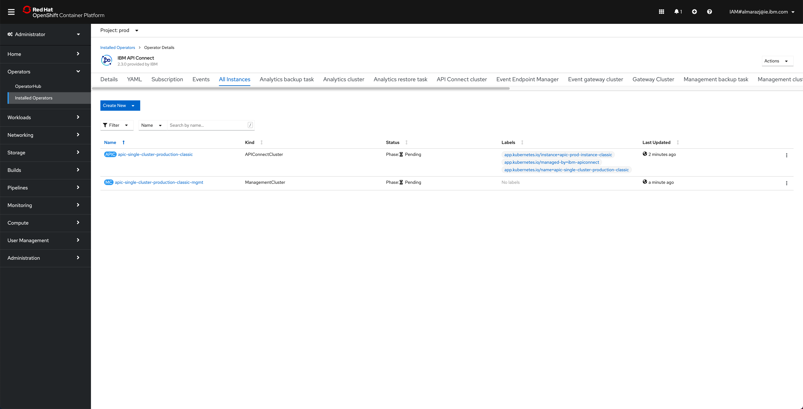{: style="max-height:1000px"}

    If you click on that `APIConnectCluster` object, you will be presented with the details about this object. In this page, you can see the name of the object, the namespace where it was created, the different attributes of the object but more importantly, you can follow along the installation/deployment of your IBM API Connect Cluster that this object represents by looking at its `Phase` and `State` attributes.

    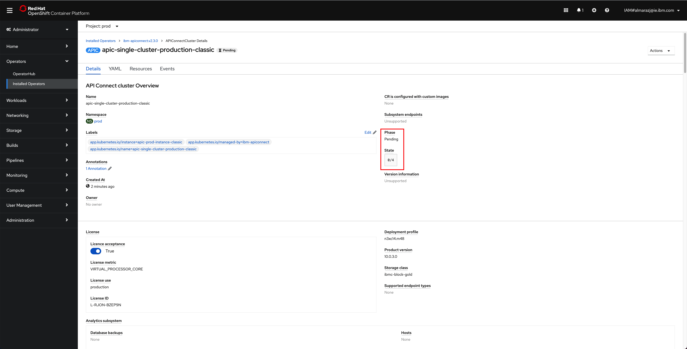{: style="max-height:1000px"}

    You can also open a terminal and execute the following command to follow the installation/deployment of your IBM API Connect Cluster along as far as the pods that get created

    ```
    watch -n 10 oc get pods -n prod
    ```

    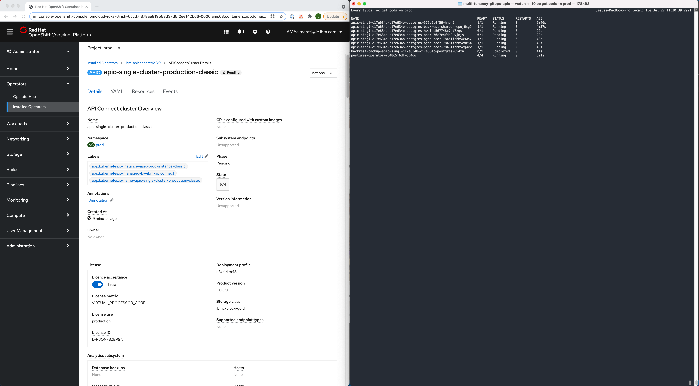{: style="max-height:1000px"}

1. After 30-40 minutes, the installation/deployment of your IBM API Connect Cluster should be done.

    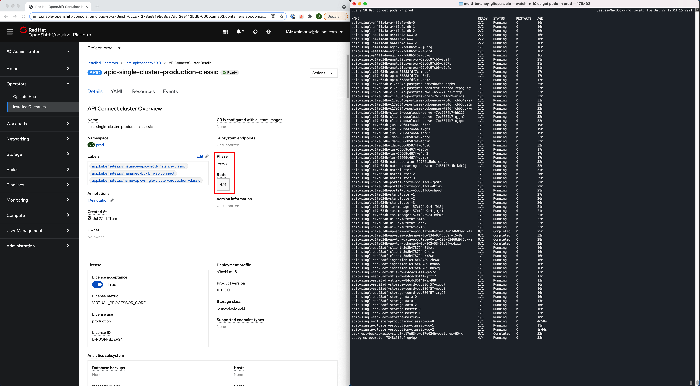{: style="max-height:1000px"}

1. If you go back to `Installed Operators` --> `IBM API Connect` --> `All Instances` under the `prod` RedHat OpenShift Project, you should now be able to match the Custom Resource objects that the IBM API Connect operator has created, as a result of the installation/deployment of your IBM API Connect Cluster, with those IBM API Connect Cluster objects we presented at the top of this section as far as the different components of the IBM API Connect Production Reference Architecture. These objects are the `APIConnectCluster`, `AnalyticsCluster`, `GatewayCluster`, `ManagementCluster` and `PortalCluster` (amongst others).

    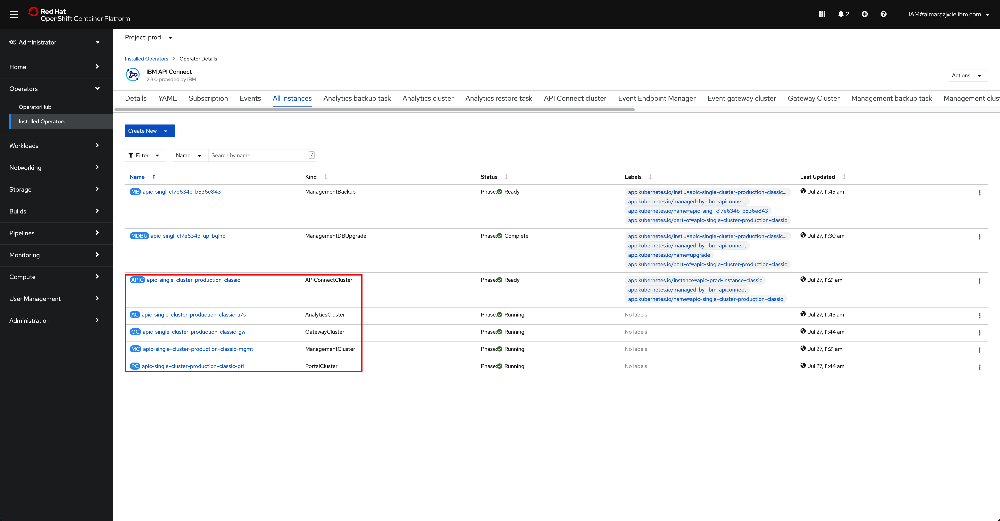{: style="max-height:1000px"}

### 5 - IBM API Connect Cloud Manager

Now, let's make sure that our API Connect Cluster is up and running. For doing that we are going to make sure that we can open and access the IBM API Connect Cloud Manager web console.

1. Go to `Routes` under the `prod` RedHat OpenShift Project and click on the `Location` value for the  `apic-singl-xxxx-admin` route.

    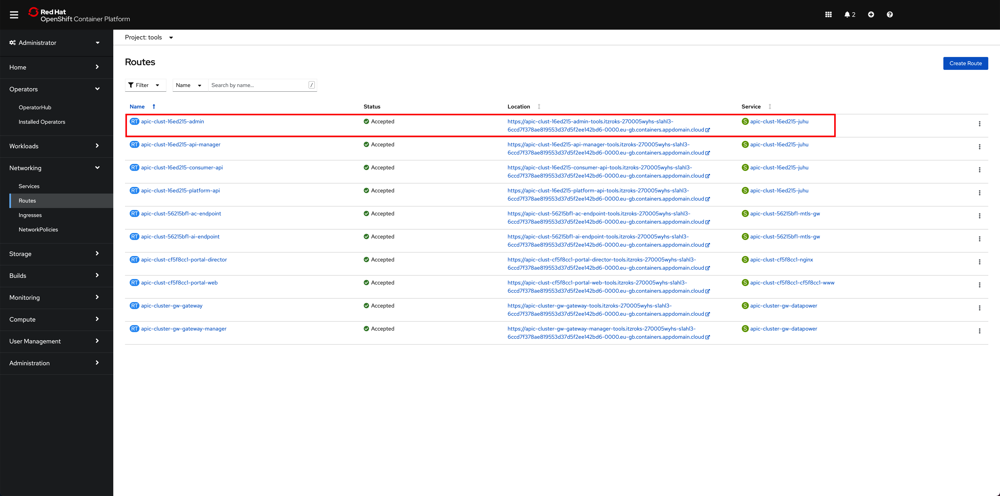{: style="max-height:1000px"}

    That should bring you to the IBM API Connect Cloud Manager web console login page.

    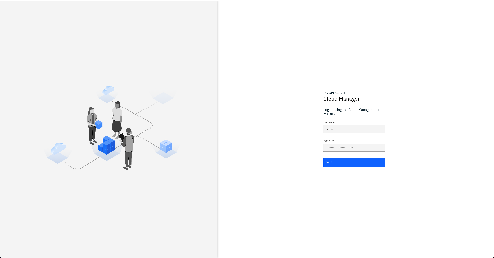{: style="max-height:1000px"}

1. Log into the IBM API Connect Cloud Manager web console by using `admin` as the username and getting it's password with the following command

    ```
    oc get secret `oc get secrets -n prod | grep mgmt-admin-pass | awk '{print $1}'` -n prod -o jsonpath='{.data.password}' | base64 -D
    ```

    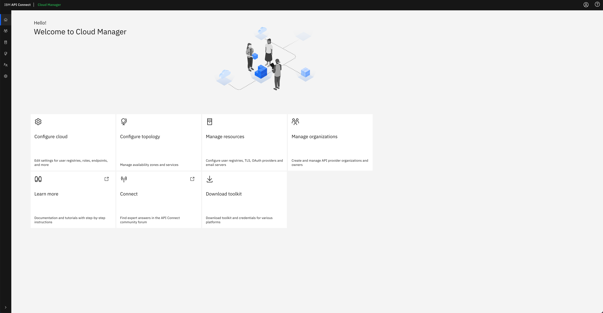{: style="max-height:1000px"}

1. Finally, click on the `Configure Topology` option presented in the IBM API Connect Cloud Manager web console. You should see that there is no topology configured at all.

    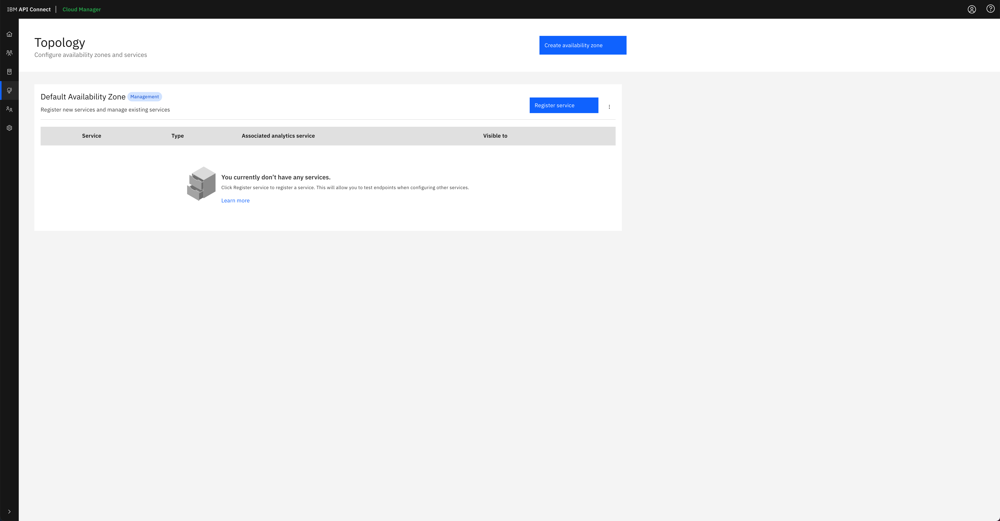{: style="max-height:1000px"}

### Summary

In this section, we have reviewed the IBM API Connect Production Reference Architecture on IBM Cloud and how we can use the IBM Cloud Native Toolkit GitOps Framework to install/deploy and manage our IBM API Connect Cluster instances using a GitOps approach whereby we define/declare the desired status of our infrastructure/clusters/components as code in a SCM tool such as GitHub and then offload the burden of making sure our infrastructure/clusters/components are as specified to GitOps tools such as the RedHat OpenShift GitOps operator which makes use of ArgoCD behind the scenes for that synchronization process.

Finally, we have seen how we can verify that our IBM API Connect Cluster instance is up and running and we have seen that such IBM API Connect Cluster instance comes without any configuration at all, not even for the IBM API Connect Cluster components that have been deployed as part of the creation of an `APIConnectCluster` Custom Resource (i.e. the `AnalyticsCluster`, `GatewayCluster`, `ManagementCluster` and `PortalCluster`). 

!!! success
    You have successfully deployed IBM API Connect on the RedHat OpenShift Kubernetes Service (ROKS) on a Virtual Private Cloud (VPC) infrastructure on IBM Cloud using a GitOps approach