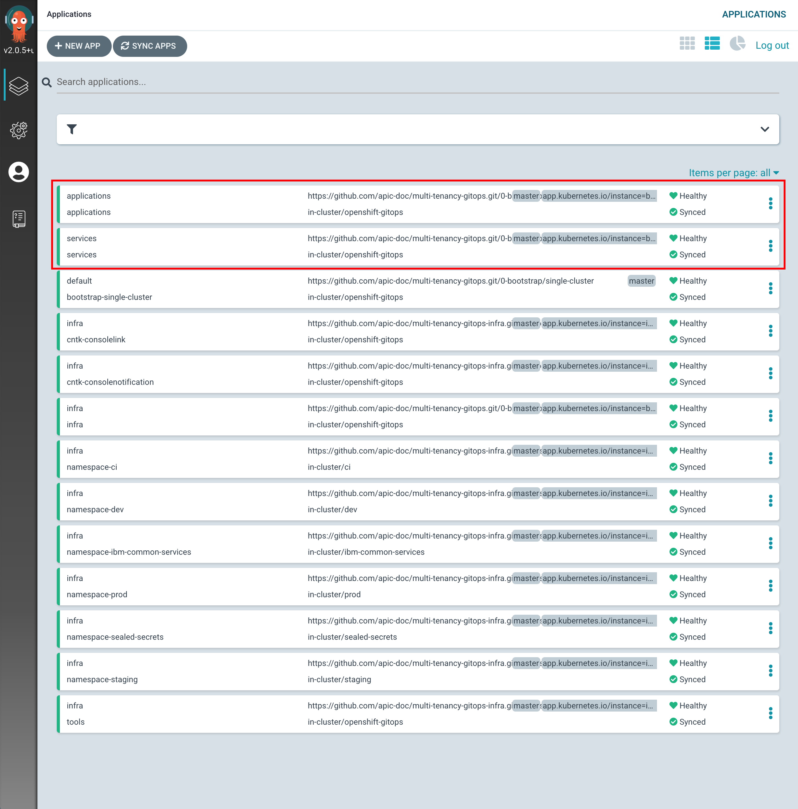
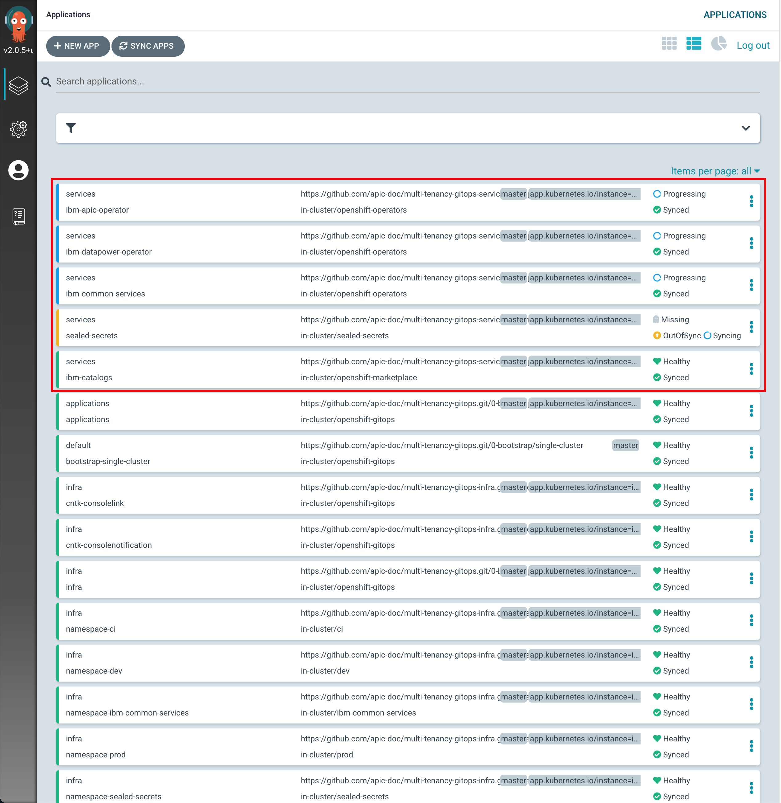
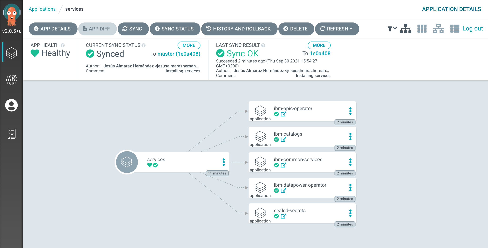
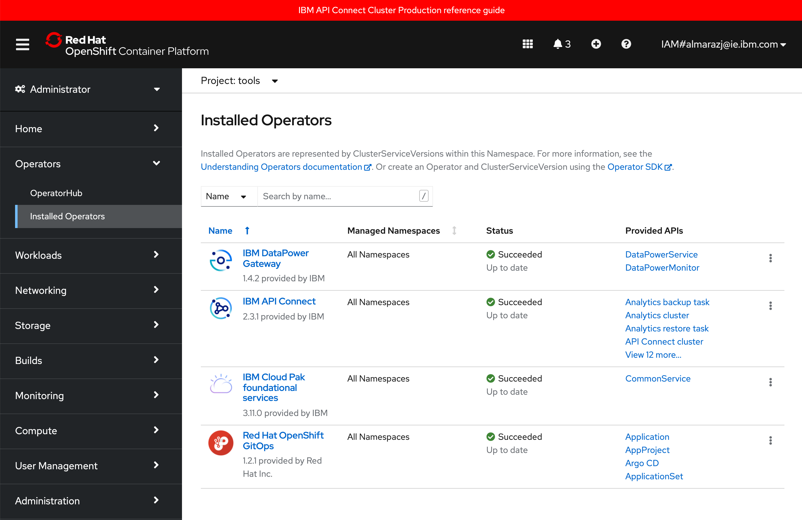
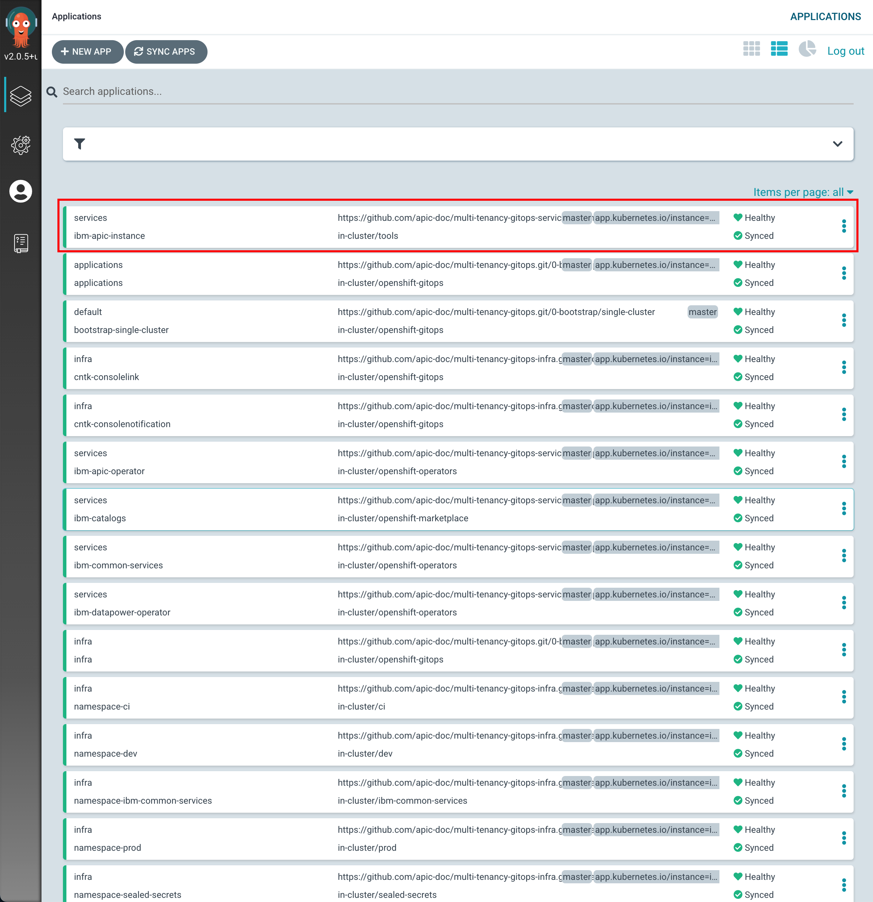

# Deployment on IBM Cloud

<!--- cSpell:ignore singl apiconnectcluster ibmc APIC Availability unmanaged practioners Pak Paks Quickstart qube cntk autoplay allowfullscreen clusterrole clusterrolebinding clust -->

In the previous chapter of this tutorial, we have worked with ArgoCD and the GitOps repository to understand what these are and how these work together and interact. We have seen how to create ArgoCD applications that watch their respective GitOps repository folders for details of the resources they should apply to the cluster. We have seen how we can dynamically change deployed resources by updating the resource definition in the GitOps repository. Finally, you've experience how ArgoCD keeps the cluster synchronized with the GitOps repository as a source of truth; any unexpected configuration drift will be corrected without intervention.

Now, in this section, we are going to look at what changes we need to do to that GitOps repository so that we get IBM API Connect and all the components it needs/depends on deployed in our cluster for having a highly available production ready deployment of IBM API Connect.

## Services

We have seen in the previous chapter of this tutorial that in the `0-bootstrap/single-cluster/kustomization.yaml` file we have defined what layers out of `infra`, `services` and `apps` we want the main `bootstrap-single-cluster` ArgoCD application to watch. Before, we had it set up to watch only the `infra` layer. However, we now need it to watch the `services` and `apps` layers too in order to deploy IBM API Connect and all the components it needs/depends on.

1. Ensure you are logged in to the cluster

    Start a terminal window and log into your OCP cluster, substituting the `--token` and `--server` parameters with your values:

    ```bash
      oc login --token=<token> --server=<server>
    ```

    If you are unsure of these values, click your user ID in the OpenShift web console and select "Copy Login Command".

1. Locate your GitOps repository

    If necessary, change to the root of your GitOps repository, which is typically
    `$HOME/git`.

    Issue the following command to change to your GitOps repository:

    ```bash
    cd $HOME/git
    cd multi-tenancy-gitops
    ```

1. Make sure the `infra`, `services` and `apps` layers are un-commented, and therefore active, for the main `bootstrap-single-cluster` ArgoCD application to watch them in the file `0-bootstrap/single-cluster/kustomization.yaml`

    ```yaml
    resources:
    - 1-infra/1-infra.yaml
    - 2-services/2-services.yaml
    - 3-apps/3-apps.yaml
    ```

1. Add all changes in the current folder to a git index, commit them, and push them to GitHub:

    ```bash
    git add .
    git commit -s -m "Adding services and applications layers"
    git push origin $GIT_BRANCH
    ```

1. If you go to your ArgoCD UI, you will see two new ArgoCD applications, one that will watch for resources on the `services` layer and another that will watch for resources on the `apps` layer.

    {: style="max-height:900px"}

    !!! tip
        You might want to manually sync your ArgoCD applications, instead of waiting for changes to get automatically picked up. For manually synchronize ArgoCD applications, you can click on the `SYNC APPS` button at the top. Then, select all the ArgoCD applications you want to get synched (or all for easiness) and click `SYNC`

We are now all set to start deploying IBM API Connect and all the components it needs/depends on. However, we will do it in two steps. In the first one, we will deploy all of the components that IBM API Connect needs/depends on. These are things like an instance of [Sealed Secrets](https://github.com/bitnami-labs/sealed-secrets) to be able to unseal certain secrets needed like the IBM Entitlement Key to pull IBM software down from IBM's software registry, the IBM Operators catalog to be able to install IBM Operators and, finally, the IBM Foundations, IBM DataPower and IBM API Connect operators where the first two are a dependency of the IBM API Connect operator.

To get all of this installed, all we need to do, in the same fashion we did for the components we wanted to get installed on the infra layer, is to un-comment these from the `0-bootstrap/single-cluster/2-services/kustomization.yaml` file.

1. Open the `0-bootstrap/single-cluster/2-services/kustomization.yaml` file and un-comment the following resources:

    ```yaml
    - argocd/operators/ibm-apic-operator.yaml
    - argocd/operators/ibm-datapower-operator.yaml
    - argocd/operators/ibm-foundations.yaml
    - argocd/operators/ibm-catalogs.yaml
    - argocd/instances/sealed-secrets.yaml
    ```
    Your `0-bootstrap/single-cluster/2-services/kustomization.yaml` should look like

    ```yaml
    resources:
    # IBM Software
    #- argocd/operators/ibm-ace-operator.yaml
    - argocd/operators/ibm-apic-operator.yaml
    #- argocd/instances/ibm-apic-instance.yaml
    #- argocd/operators/ibm-aspera-operator.yaml
    #- argocd/operators/ibm-assetrepository-operator.yaml
    #- argocd/operators/ibm-cp4i-operators.yaml
    - argocd/operators/ibm-datapower-operator.yaml
    #- argocd/operators/ibm-eventstreams-operator.yaml
    #- argocd/operators/ibm-mq-operator.yaml
    #- argocd/operators/ibm-opsdashboard-operator.yaml
    #- argocd/operators/ibm-process-mining-operator.yaml
    #- argocd/instances/ibm-process-mining-instance.yaml
    #- argocd/operators/ibm-platform-navigator.yaml
    #- argocd/instances/ibm-platform-navigator-instance.yaml
    #- argocd/operators/ibm-cp4a-operator.yaml

    # IBM Foundations / Common Services
    - argocd/operators/ibm-foundations.yaml
    #- argocd/instances/ibm-foundational-services-instance.yaml
    #- argocd/operators/ibm-automation-foundation-core-operator.yaml
    #- argocd/operators/ibm-automation-foundation-operator.yaml

    # IBM Catalogs
    - argocd/operators/ibm-catalogs.yaml

    # Required for IBM MQ
    #- argocd/instances/openldap.yaml
    # Required for IBM ACE, IBM MQ
    #- argocd/operators/cert-manager.yaml
    #- argocd/instances/cert-manager-instance.yaml

    # Sealed Secrets
    - argocd/instances/sealed-secrets.yaml

    # CICD
    #- argocd/operators/grafana-operator.yaml
    #- argocd/instances/grafana-instance.yaml
    #- argocd/instances/artifactory.yaml
    #- argocd/instances/chartmuseum.yaml
    #- argocd/instances/developer-dashboard.yaml
    #- argocd/instances/swaggereditor.yaml
    #- argocd/instances/sonarqube.yaml
    #- argocd/instances/pact-broker.yaml
    # In OCP 4.7+ we need to install openshift-pipelines and possibly privileged scc to the pipeline serviceaccount
    #- argocd/operators/openshift-pipelines.yaml


    # Service Mesh
    #- argocd/operators/elasticsearch.yaml
    #- argocd/operators/jaeger.yaml
    #- argocd/operators/kiali.yaml
    #- argocd/operators/openshift-service-mesh.yaml
    #- argocd/instances/openshift-service-mesh-instance.yaml

    patches:
    - target:
        group: argoproj.io
        kind: Application
        labelSelector: "gitops.tier.layer=services"
    patch: |-
        - op: add
        path: /spec/source/repoURL
        value: https://github.com/prod-ref-guide/multi-tenancy-gitops-services.git
        - op: add
        path: /spec/source/targetRevision
        value: master
    - target:
        group: argoproj.io
        kind: Application
        labelSelector: "gitops.tier.layer=services,gitops.tier.source=helm"
    patch: |-
        - op: add
        path: /spec/source/repoURL
        value: https://charts.cloudnativetoolkit.dev
    - target:
        name: ibm-automation-foundation-operator
    patch: |-
        - op: add
        path: /spec/source/helm/parameters/-
        value:
            name: spec.channel
            value: v1.1
    ```

1. Add all changes in the current folder to a git index, commit them, and push them to GitHub:

    ```bash
    git add .
    git commit -s -m "Installing services"
    git push origin $GIT_BRANCH
    ```

1. If you go to your ArgoCD UI, you will now see new ArgoCD applications.
   
    {: style="max-height:900px"}

1. If you click on the `services` main ArgoCD application, you will see that it has created five new ArgoCD applications that correspond to each of the components we have un-commented and therefore bring to active state in the `0-bootstrap/single-cluster/2-services/kustomization.yaml` file.

    {: style="max-height:600px"}

1. After 5-10 mins, if you go to your Red Hat OpenShift web console and click on `Operators --> Installed Operators` on the right hand side menu and select the the `tools` project on the pull down menu at the top bar, you will see that the IBM Foundations, IBM DataPower and IBM API Connect operators are being installed or have successfully installed already (apart from the OpenShift GitOps operator that was installed previously).

    {: style="max-height:700px"}

## IBM API Connect

Last step, is to get an IBM API Connect cluster created through the IBM API Connect operator. However, before being able to deploy any IBM capability we must have an IBM Entitlement Key to be able to pull IBM software down from IBM's software registry available in the Red Hat OpenShift project where we are deploying such IBM capability.

1. Log in to [MyIBM Container Software Library](https://myibm.ibm.com/products-services/containerlibrary) with an IBMid and password associated with the entitled software.  
1. Select the **View library** option to verify your entitlement(s). 
1. Select the **Get entitlement key** to retrieve the key.
1. Create a secret containing your IBM Entitlement Key in the `tools` namespace (which is where the IBM API Connect operator has been installed/deployed into and there the IBM API Connect instance it will create afterwards will end up into as a result). 

    ```bash
    oc create secret docker-registry ibm-entitlement-key -n tools \
    --docker-username=cp \
    --docker-password="<entitlement_key>" \
    --docker-server=cp.icr.io
    ```

1. Link that `docker-registry` secret containing your IBM Entitlement Key with the default secret for pulling Docker images within your Red Hat OpenShift project

    ```bash
    oc secrets link default ibm-entitlement-key --for=pull
    ```

Finally, to get an IBM API Connect cluster instance created, all we need to do is to make sure that the definition of the IBM API Connect instance we want to deploy is correct on our GitOps repository and then, once again, tell the ArgoCD application that is watching over the `services` layer to activate such resource. This resource will, in turn, create another ArgoCD application that will watch over the resources specified in our definition of the IBM API Connect instance.

!!! info
    The IBM API Connect Cluster name might have changed from what the screenshots below show. Therefore, expect that `apic-single-cluster-production-classic` might not be the name for the IBM API Connect Cluster being deployed in your cluster. Instead, it might be something like `apic-cluster`.

1. Open the `0-bootstrap/single-cluster/2-services/kustomization.yaml` file and un-comment the following resource:

    ```yaml
    - argocd/instances/ibm-apic-instance.yaml
    ```

2. Make sure the **storage** settings for the IBM API Connect instance we are about to deploy are correct based on the IBM Cloud infrastructure your Red Hat OpenShift cluster is deployed on (review the [Create the cluster section](../cluster-create/ibm-cloud.md) if needed). You can adjust storage settings in in `0-bootstrap/single-cluster/2-services/argocd/instances/ibm-apic-instance.yaml`

    !!! warning "Storage"
        Make sure the **storageClassName** value, which **defaults to ibmc-block-gold**, corresponds to an available block storage class in your cluster. Make sure you understand block storage for Red Hat OpenShift clusters on IBM Cloud by reading IBM Cloud documentation [here](https://cloud.ibm.com/docs/openshift?topic=openshift-storage_planning) specially for clusters hosted on Virtual Private Clouds (VPC). Also, make sure you understand IBM API Connect production reference architecture on IBM Cloud [here](../architecture/ibm-cloud.md).

3. Make sure the **high availability** settings for the IBM API Connect instance we are about to deploy are correct based on your requirements (and cluster sizing. Review the [Create the cluster section](../cluster-create/ibm-cloud.md) if needed). You can adjust storage settings in in `0-bootstrap/single-cluster/2-services/argocd/instances/ibm-apic-instance.yaml`

    !!! warning "High availability"
        Make sure the **profile** value, which **defaults to n3xc14.m48**, corresponds to the desired profile: development vs production.
        
           * n1xc10.m48 - Deploys 1 replica of each pod, so this profile is most suitable for a small, non-HA system. Recommended use of this profile is for development and testing.

           * n3xc14.m48 - Deploys 3 or more replicas of each pod, so this profile is most suitable for larger systems and for production environments. This profile is supported for installation on a cluster with three or more nodes. It is not supported on a cluster with fewer than three nodes.

        Important: Make sure the Red Hat OpenShift cluster you are deploying this IBM API Connect recipe to has been sized appropriately based on the profiles above where:

           * n stands for the number of worker nodes.
           * c stands for the amount of CPU per worker node.
           * m stands for the amount of RAM per worker node.

4. Add all changes in the current folder to a git index, commit them, and push them to GitHub:

    ```bash
    git add .
    git commit -s -m "Installing an IBM API Connect instance"
    git push origin $GIT_BRANCH
    ```

5. If you go to your ArgoCD UI, you will now see the new `ibm-apic-instance` ArgoCD application.

    {: style="max-height:900px"}

6. If you go into that ArgoCD application, you can monitor the IBM API Connect cluster instance installation. You will see how RedHat OpenShift resources are being created as a result of having the `ibm-apic-instance` ArgoCD application created the initial `APIConnectCluster` resource, which was then picked up by the IBM API Connect operator.

    {: style="max-height:1000px"}

7. If you go to `Operators --> Installed Operators` under the `tools` project, click on the `IBM API Connect` operator and then on the `All Instances` tab, you should see the `apic-cluster` `APIConnectCluster` object.

    {: style="max-height:1000px"}

    If you click on that `APIConnectCluster` object, you will be presented with the details about this object. In this page, you can see the name of the object, the namespace where it was created, the different attributes of the object but more importantly, you can follow along the installation/deployment of your IBM API Connect Cluster that this object represents by looking at its `Phase` and `State` attributes.

    {: style="max-height:1000px"}

    You can also open a terminal and execute the following command to follow the installation/deployment of your IBM API Connect Cluster along as far as the pods that get created

    ```
    watch -n 10 oc get pods -n tools
    ```

    {: style="max-height:1000px"}

8. After 30-40 minutes, the installation/deployment of your IBM API Connect Cluster should be done.

    {: style="max-height:1000px"}

9. If you go back to `Operators --> Installed Operators` under the `tools` project, click on the `IBM API Connect` operator and then on the `All Instances` tab, you should now be able to match the Custom Resource objects that the IBM API Connect operator has created, as a result of the installation/deployment of your IBM API Connect Cluster, with those IBM API Connect Cluster components presented at the [IBM API Connect Production Reference Architecture](../architecture/ibm-cloud.md). These objects are the `APIConnectCluster`, `AnalyticsCluster`, `GatewayCluster`, `ManagementCluster` and `PortalCluster` (amongst others).

    {: style="max-height:1000px"}

## IBM API Connect Cloud Manager

Now, let's make sure that our API Connect Cluster is up and running. For doing that, we are going to make sure that we can open and access the IBM API Connect Cloud Manager web console.

1. In your Red Hat OpenShift we console, go to `Networking` --> `Routes` under the `tools` project and click on the `Location` value for the  `apic-clust-xxxx-admin` route.

    {: style="max-height:1000px"}

    That should bring you to the IBM API Connect Cloud Manager web console login page.

    {: style="max-height:1000px"}

1. Log into the IBM API Connect Cloud Manager web console by using `admin` as the username and getting it's password with the following command

    ```
    oc get secret `oc get secrets -n tools | grep mgmt-admin-pass | awk '{print $1}'` -n tools -o jsonpath='{.data.password}' | base64 -D
    ```

    {: style="max-height:1000px"}

1. Finally, click on the `Configure Topology` option presented in the IBM API Connect Cloud Manager web console. You should see that there is no topology configured at all.

    {: style="max-height:1000px"}

You can follow the [IBM API Connect Cloud Manager configuration checklist](https://www.ibm.com/docs/en/api-connect/10.0.x?topic=environment-cloud-manager-configuration-checklist) documentation to manually proceed with the tasks you need to accomplish to get your IBM API Connect cluster ready to be used or you can go to the next section in this chapter where you will create an OpenShift Pipeline that gets your recently deployed IBM API Connect instance configured so that you can start working with it right away.

!!! success "Congratulations!"
    You have successfully deployed a highly available production ready IBM API Connect cluster on your RedHat OpenShift cluster on IBM Cloud using a GitOps methodology