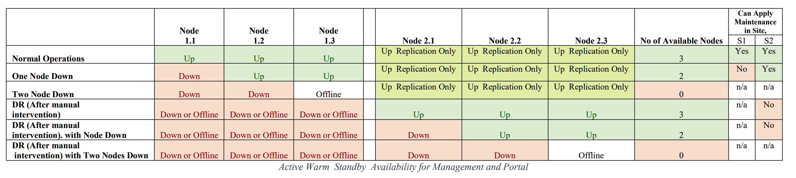
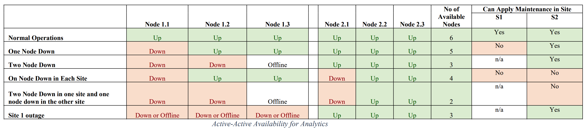

# IBM API Connect Disaster Recovery on OpenShift

<!--- cSpell:ignore qube cntk autoplay allowfullscreen -->

!!! abstract
    Disaster Recovery is one of the major concerns when implementing a Production instance of any software solution and API Connect on OpenShift is no different. It is important that you correctly prepare for any disaster in order to ensure that you are able to recover configuration and data if disaster does strike.

## High availability versus disaster recovery
High availability is concerned with configuring a system so that it continues to operate, and the users and any using systems don't experience any loss of service, in the event of hardware or software failures. Whereas, disaster recovery (DR) is concerned with the configurations and procedures that allow a system to be recovered following a catastrophic hardware, software, or operator failure that's led to a loss of service. The following two important metrics should be considered for DR solutions:

- **Recovery Time Objective (RTO)** - The RTO is the time that it is acceptable for a system to be unavailable for during a disaster.

- **Recovery Point Objective (RPO)** - As DR solutions are usually based on some sort of data copy or backup, it is possible that a system might be recovered to a state prior to the disaster occurring, rather than the state it was in at the actual instant of the disaster. The RPO measures how far back in time the recovery point will be, and therefore how much data might be lost. An RPO of zero would assert that no data will be lost, but such a solution is often a compromise against the cost and performance of the system.

To achieve high availability in your API Connect deployment, a minimum of three data centers are required (see the IBM API Connect High Availability section [**here**](../high-availability/overview.md)). This configuration creates a quorum of data centers, allowing automated failover in any direction, and enabling all three data centers to be active. The quorum majority voting algorithm, allows for a single data center to be offline, and yet still maintain data consistency and availability across the remaining two data centers as they continue to represent a majority in the deployment (avoiding split-brain syndrome).

However, when having three data centers is not possible, a two data center deployment provides a disaster recovery solution that has both a low Recovery Time Objective (RTO), and a low Recovery Point Objective (RPO):

{: style="max-height:600px"}

The tables below describe the worst-case scenario for availability of each of the IBM API Connect components:

{: style="max-height:300px"}

{: style="max-height:300px"}

You can follow the IBM API Connect documentation on the two data center disaster recovery deployment strategy on OpenShift [**here**](https://www.ibm.com/docs/en/api-connect/10.0.x?topic=deployment-two-data-center-strategy-kubernetes-openshift)

!!! warning
    Make sure you read and understand the the requirements for deploying a two data center disaster recovery (DR) solution. For instance, for this scenario to work, **the latency between the two data center must be less than 80ms**.

From the above website you can find links to the instructions for,

* [How to install a two data center deployment](https://www.ibm.com/docs/en/api-connect/10.0.x?topic=configuration-installing-two-data-center-deployment).
* [Maintain a two data center deployment](https://www.ibm.com/docs/en/api-connect/10.0.x?topic=connect-maintaining-two-data-center-deployment) which includes information about normal **operation data flows for the warm components** of the passive cluster.

There are other IBM API Connect HA/DR topologies that can be achieved when the requirements for the two data center disaster recovery (DR) solution explained here can not be met. These are explained in further detail in the [IBM API Connect v10.x Deployment WhitePaper](https://community.ibm.com/community/user/integration/viewdocument/api-connect-deplyoment-whitepaper-v) written by Chris Phillips.

For some of those IBM API Connect HA/DR solutions as well as for non-kubernetes deployments, manual backup and synchronization processes might be involved. You can read more detailed information about those manual processes for how to prepare for a disaster and how to recover from a disaster in the IBM API Connect official documentation [here](https://www.ibm.com/docs/en/api-connect/10.0.x?topic=connect-disaster-recovery). Remember that if your IBM API Connect deployment is hosted on a cloud provider, you might be able to make use of some of the data replication mechanisms for storage.