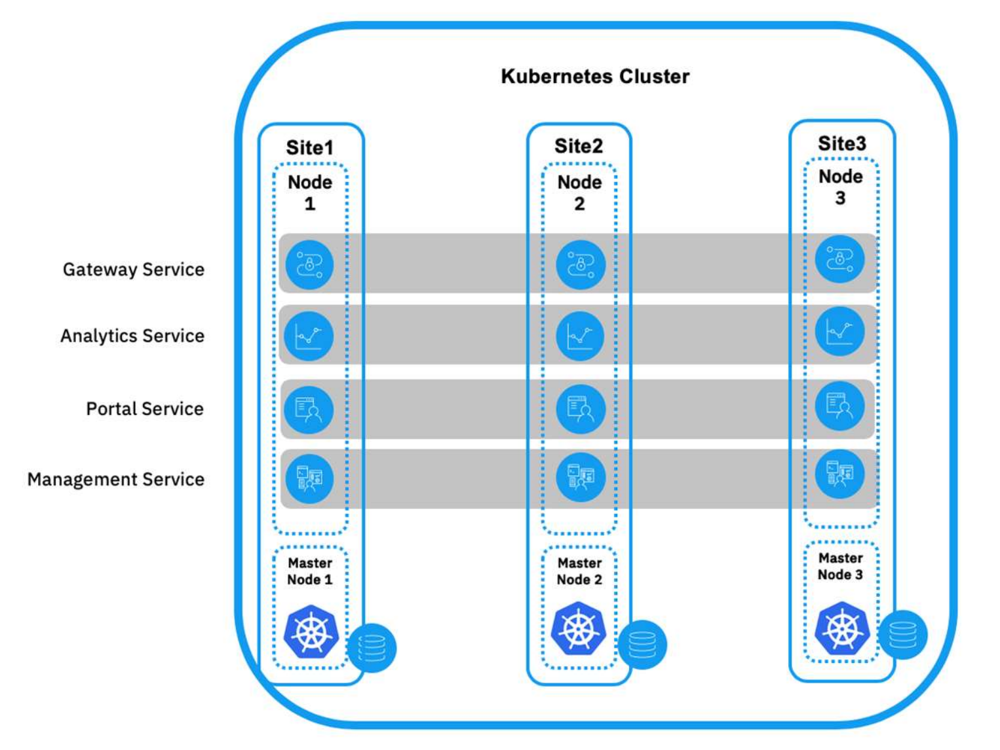
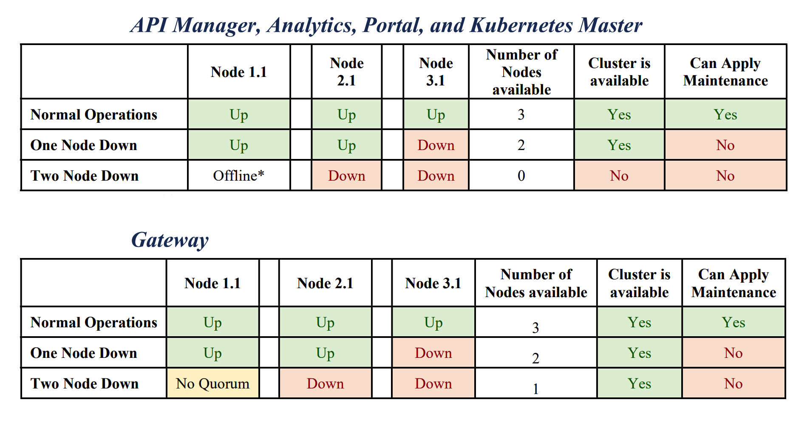

# IBM API Connect High Availability on OpenShift

<!--- cSpell:ignore qube cntk autoplay allowfullscreen -->

!!! abstract
    This document describes the best practices for achieving highly available deployments of IBM API Connect on OpenShift, a requirement to be met for any production environment.

High availability is concerned with configuring a system so that it continues to operate, and the users and any using systems don't experience any loss of service, in the event of hardware or software failures. To achieve high availability in your API Connect deployment, a minimum of three data centers are required. This configuration creates a quorum of data centers, allowing automated failover in any direction, and enabling all three data centers to be active. The quorum majority voting algorithm, allows for a single data center to be offline, and yet still maintain data consistency and availability across the remaining two data centers as they continue to represent a majority in the deployment (avoiding split-brain syndrome).

The recommended topology for deploying IBM API Connect on OpenShift is an **Active-Active-Active** topology achieved in a **single OpenShift cluster** that spreads across three data centers, or availability zones (AZs) in the case of public cloud providers. 

!!! warning "Important"
    There must be a very low latency network available between data centers or availability zones. **The latency between sites must be less than 6ms**.

{: style="max-height:600px"}

The tables below describe the worst-case scenario for availability of each of the IBM API Connect components:

{: style="max-height:500px"}

!!! info
    For more information about this and other IBM API Connect high availability topologies, please refer to the [IBM API Connect v10.x Deployment WhitePaper](https://community.ibm.com/community/user/integration/viewdocument/api-connect-deplyoment-whitepaper-v) written by Chris Phillips.