# IBM API Connect Multi-Cluster - Configure APIC

<!--- cSpell:ignore apic auditability multicloud -->

## Overview

In the previous chapters of this tutorial, you went through what needs to be done within your GitOps repositories in order to get a highly available and production ready IBM API Connect cluster deployed across multiple Red Hat OpenShift clusters to suit your multi-cluster use case. However, that deployment process only deploys the different IBM API Connect subsystems (Management, Portal, Gateway and Analytics) on their correspondent Red Hat OpenShift cluster. It does not configure these components in the IBM API Connect Cloud Manager, which can be seen as the brain or control plane of IBM API Connect, to work together. Instead, you would need to complete the following [IBM API Connect Cloud Manager configuration checklist](https://www.ibm.com/docs/en/api-connect/10.0.x?topic=environment-cloud-manager-configuration-checklist) that will drive you through things like _Register a Gateway service, Register an Analytics service, Create a provider organization, etc_.

## Automation

Similarly to deploying any piece of software in production, you would like to be able to configure those pieces of software through a GitOps methodology as well. However, the configuration of some of those pieces of software might not yet be enabled be done following a GitOps methodology. Still, you would like to be able to configure any of those pieces of software or components through certain degree of automation. Automation will provide you with two major benefits: auditability and repetition (both of which are inherent to GitOps).

Since the configuration of theses pieces of software is done through automation and automation is nothing but code describing actions to be done/taken, that pieces of code that is automating the configuration of a piece of software is auditable and repeatable. These two properties allow you to see how exactly a piece of software has been configured in case you need to adjust anything and also give you that repeatability that provides you with a kind of disaster recovery mechanism that will allow you to configure another instance of that piece of software in the exact same manner as its sibling. Of course, these capabilities are a must in production environments.

The automation we are describing and looking for to automate the [IBM API Connect Cloud Manager configuration checklist](https://www.ibm.com/docs/en/api-connect/10.0.x?topic=environment-cloud-manager-configuration-checklist) can be achieved thanks to Tekton (OpenShift Pipelines) and, in the particular case of IBM API Connect, the rich set of [IBM API Connect administration APIs](https://apic-api.apiconnect.ibmcloud.com/v10/?_ga=2.233587928.752341463.1623867527-1939642083.1623276281#/documentation/introduction). With these two, we have managed to create an OpenShift pipeline that will automate the following actions for use to configure a new deployment of an IBM API Connect instance:

1. Configure an email server for notifications.
2. For each IBM API Connect Gateway and Analytics cluster:
    1. Create an Availability Zone.
    1. Register the Gateway service.
    1. Register the Analytics service.
    1. Associate the Analytics service with the Gateway service.
3. Register the Portal service.
4. Create a Provider Organization.
5. Associate the Gateway services with the default Sandbox catalog.

    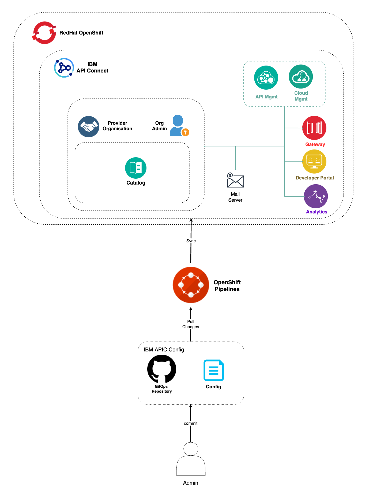{: style="max-height:1000px"}

!!! warning "Important"
    The IBM API Connect configuration automation provided in this Cloud Pak Production Guides should be use as reference and never as a production ready asset that will suit every client needs. Each client will have a particular set of requirements and architecture and, as a result, the automation presented here can be use as a template or starting point but it is not meant to provide a production ready solution by any means.

## OpenShift pipeline

The OpenShift Pipeline just introduced above has been created in your IBM API Connect Management and Portal Red Hat OpenShift custer. If you go to `Pipelines --> Pipelines` on the left hand side menu of your Red Hat OpenShift web console under the `ci` Project, you will see two OpenShift pipelines have been created as a result of what you had specified in your GitOps repositories:

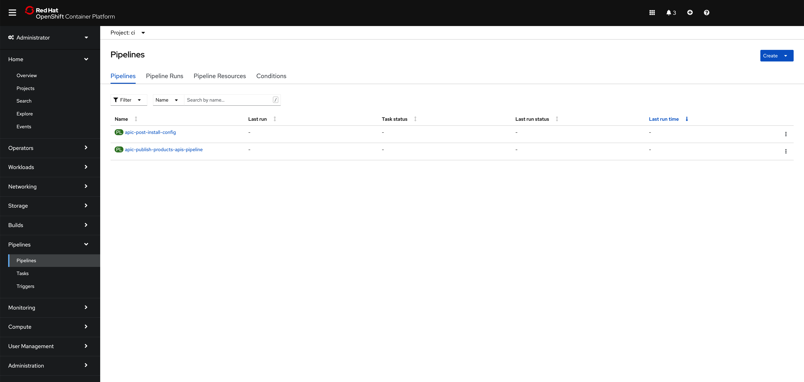{: style="max-height:800px"}

!!! info
    The pipeline you are interested in for getting your instance of IBM API Connect configured is called **apic-post-install-config**

If you go check the `kustomization.yaml` under `0-bootstrap/others/apic-multi-cluster/management-portal-cluster/3-apps` in your `multi-tenancy-gitops` repository, you will see that for your IBM API Connect Management and Portal cluster you have specified you want to get installed the following resource:

```yaml
- argocd/apic/multi-cluster-ops.yaml
```

by having such resource un-commented. If you go to check that file you will see the following:

```yaml hl_lines="15-17"
apiVersion: argoproj.io/v1alpha1
kind: Application
metadata:
  name: apps-apic-multi-cluster-ops
  annotations:
    argocd.argoproj.io/sync-wave: "300"
  labels:
    gitops.tier.layer: applications
  finalizers:
    - resources-finalizer.argocd.argoproj.io
spec:
  destination:
    namespace: openshift-gitops
    server: https://kubernetes.default.svc
  project: applications
  source:
    path: apic/config/argocd/multi-cluster/ops
  syncPolicy:
    automated:
      prune: true
      selfHeal: true
```

That is, an ArgoCD Application that points to the path `apic/config/argocd/multi-cluster/ops` in your `multi-tenancy-gitops-apps`. If you keep following the paths of the chained ArgoCD Applications, you will end up realising that what the original ArgoCD Application above would get deployed in your IBM API Connect Management and Portal cluster is located in `apic/environments/multi-cluster/ops` of your `multi-tenancy-gitops-apps` repository.

If you execute `tree multi-tenancy-gitops-apps/apic/environments/multi-cluster/ops -L 2` you should see the following:

```text
multi-tenancy-gitops-apps/apic/environments/multi-cluster/ops
├── kustomization.yaml
├── pipelines
│   ├── apic-config-pipeline.yaml
│   └── apic-publish-pipeline.yaml
├── roles
│   ├── role.yaml
│   └── rolebinding.yaml
└── tasks
    ├── apic-config-task.yaml
    └── apic-publish-task.yaml
```

where you can find the two pipelines that are getting created in your IBM API Connect Management and Portal cluster. `apic-config-pipeline.yaml` will create the OpenShift Pipeline that will automate the configuration of you IBM API Connect multi-cluster architecture you have just deployed whereas the `apic-publish-pipeline.yaml` will create an OpenShift Pipeline that will automate the publishing of IBM API Connect products and their respective APIs into your IBM API Connect instance.

Before being able to execute the OpenShift pipeline that will configure your instance of IBM API Connect, you need to:

1. Fork the OpenShift Pipeline repositories to your GitHub organization where you already forked the other GitOps repositories you have used to deploy your IBM API Connect multi-cluster instance.
2. Create a GitHub Personal Access Token so that the IBM API Connect configuration OpenShift pipeline has permissions to access your IBM GitHub account (to the private repos you will fork the OpenShift Pipeline repositories to).
3. Provide your email server configuration for notifications.
4. Provide your IBM API Connect provider organization configuration

### 1. OpenShift Pipeline repositories

You need to fork the OpenShift Pipeline repositories to your GitHub organization where you already forked the other GitOps repositories you have used to deploy your IBM API Connect multi-cluster instance. You can review the creation of that GitHub organization in the [Configure the clusters - GitOps repos & ArgoCD](configure-clusters-gitops.md) section. The OpenShift Pipeline repositories can be found at <https://github.com/cloud-native-toolkit>. Use the search bar to find the following three repositories:

* [apic-publish-pipeline](https://github.com/cloud-native-toolkit/apic-publish-pipeline)
* [apic-config-pipeline](https://github.com/cloud-native-toolkit/apic-config-pipeline)
* [apic-products-apis-yaml](https://github.com/cloud-native-toolkit/apic-products-apis-yaml)

!!! warning "Important"
    Fork **ALL three repositories** even though you will only use the `apic-config-pipeline` repository in this section. However, you will use the other two in the following section to publish an API of the dummy application that has been deployed into the IBM API Connect Gateway and Analytics clusters into an IBM API Connect product so that it is exposed and available through the gateways deployed in such clusters.

You can review how to fork a repository in he [Configure the clusters - GitOps repos & ArgoCD](configure-clusters-gitops.md) section. However, make sure your forked repositories are **private** and that you also **Include all branches**:

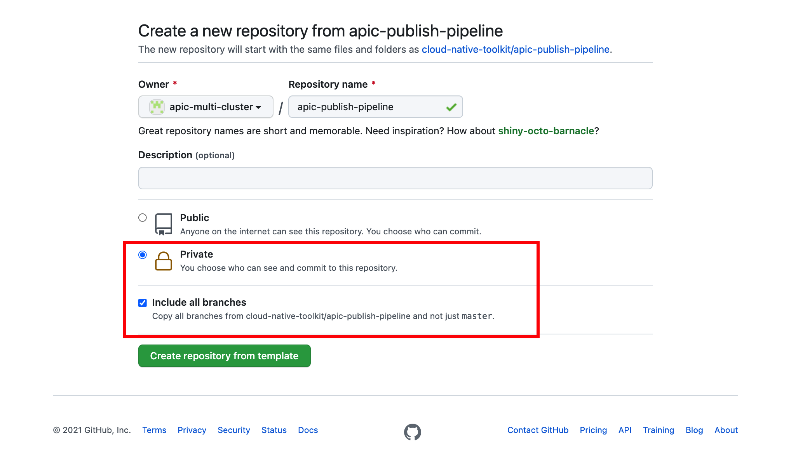{: style="max-height:600px"}

!!! info
    The reason to make these repositories private is to simulate more closely a real scenario where your assets would be behind a firewall. As a result, the OpenShift Pipelines and the script these execute were developed to expect authentication and authorization mechanisms. The reason to include all branches is because you will be using the **apic-multicloud** branch.

By now you should have the following GitHub repositories in your GitHub organization:

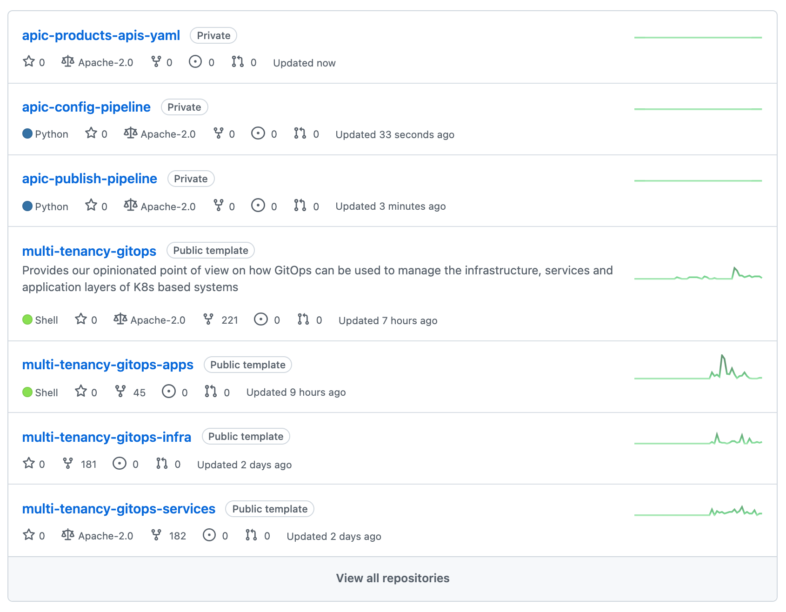{: style="max-height:600px"}

### 2. GitHub Personal Access Token

Create a GitHub Personal Access Token so that the IBM API Connect configuration OpenShift pipeline has permissions to access your IBM GitHub Enterprise account. Provide just `repo` and `admin:repo_hook` permissions. You can find the instructions for creating that GitHub Personal Access Token [here](https://docs.github.com/en/authentication/keeping-your-account-and-data-secure/creating-a-personal-access-token)

Once you have created your GitHub Personal Access Token, 

1. Ensure you are logged in to the cluster

    Start a terminal window and log into your OCP cluster, substituting the `--token` and `--server` parameters with your values:

    ```bash
    oc login --token=<token> --server=<server>
    ```

    If you are unsure of these values, click your user ID in the OpenShift web console and select "Copy Login Command".

    !!! warning
        Make sure you are logging into the IBM API Connect Management and Portal cluster

2. Create the following secret containing your GitHub `Username` and `Personal Access Token`

    ```shell
    oc create secret generic apic-pipeline-git -n ci \
    --from-literal=GIT_USERNAME=<your_github_username> \
    --from-literal=GIT_PRIV_TOKEN=<your_github_personal_access_token>
    ```

### 3. Email Server

You need to provide the configuration of your email servicer for notifications. You can read more about configuring an email server for notifications in the IBM API Connect documentation [here](https://www.ibm.com/docs/en/api-connect/10.0.x?topic=settings-configuring-email-server-notifications). You can create your own dummy email server at <https://mailtrap.io/>.

Once you have your email server created and its configuration at hand, create the following secret that will hold your Email Server configuration for notifications:

```shell
oc create secret generic apic-config-email-server -n ci \
--from-literal=EMAIL_HOST=<your_email_server_host> \
--from-literal=EMAIL_PORT=<your_email_server_port> \
--from-literal=EMAIL_USERNAME=<your_email_server_username> \
--from-literal=EMAIL_PASSWORD=<your_email_server_password>
```

### 4. Provider Organization

You must provide the configuration for what your IBM API Connect Provider Organization will be. You can read more about creating a Provider Organization in the IBM API Connect documentation [here](https://www.ibm.com/docs/en/api-connect/10.0.x?topic=organizations-creating-provider-organization).

Once you have clear the above, create the following secret that will hold your Provider Organization configuration:

```shell
oc create secret generic apic-pipeline-provider-org -n ci \
--from-literal=PROV_ORG_OWNER_USERNAME=<provider_organization_owner_username> \
--from-literal=PROV_ORG_OWNER_PASSWORD=<provider_organization_owner_password> \
--from-literal=PROV_ORG_OWNER_EMAIL=<provider_organization_owner_email> \
--from-literal=PROV_ORG_OWNER_FIRST_NAME=<provider_organization_owner_first_name> \
--from-literal=PROV_ORG_OWNER_LAST_NAME=<provider_organization_owner_last_name> \
--from-literal=PROV_ORG_NAME=<provider_organization_name> \
--from-literal=PROV_ORG_TITLE=<provider_organization_title> \
--from-literal=PROV_ORG_CATALOG_NAME=sandbox \
--from-literal=PROV_ORG_REALM=provider/default-idp-2
```

An example of a dummy provider organization could be:

```
PROV_ORG_CATALOG_NAME = sandbox
PROV_ORG_NAME = test-org
PROV_ORG_OWNER_EMAIL = test@test.com
PROV_ORG_OWNER_FIRST_NAME = A_Name
PROV_ORG_OWNER_LAST_NAME = A_Last_Name
PROV_ORG_OWNER_PASSWORD = passw0rd
PROV_ORG_OWNER_USERNAME = testorgadmin
PROV_ORG_REALM = provider/default-idp-2
PROV_ORG_TITLE = Test Org
```

!!! warning "Important"
    The **PROV_ORG_OWNER_USERNAME** and **PROV_ORG_OWNER_PASSWORD** will be the credentials you will use later on to log into the IBM API Connect API Manager.

## Run the IBM API Connect Configuration Pipeline

You are now ready to execute the OpenShift pipeline that will configure your IBM API Connect instance.

Go again to `Pipelines --> Pipelines` on the left hand side menu of your OpenShift web console and click on the **`apic-post-install-config`** pipeline. Then, click on `Start` on the `Actions` drop down menu at the top right corner.

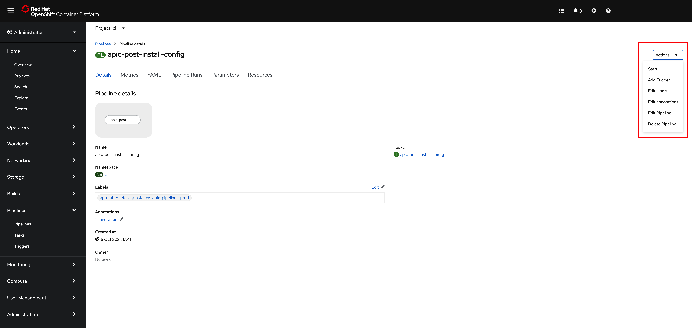{: style="max-height:800px"}

On the `Start Pipeline` OpenShift Pipeline configuration menu that pops up, make sure you provide the appropriate values for the following pipeline parameters:

* `git-apic-pipeline-git-url` which is the GitHub url where the pipeline scripts are stored. These are the scripts the pipeline will execute. This is the GitHub repository your forked into your GitHub organization earlier in this section.
* `gtw-a7s-azs` which is a comma-separated list of IBM API Connect availability zones names. This parameter expects an availability zone per IBM API Connect Gateway and Analytics cluster you set up your `apic-multi-cluster` profile in your `multi-tenancy-gitops` repository. That is, each set of IBM API Connect Gateway and Analytics will get configured in their own availability zone The length of this list must match the `gtw-a7s-domains` list below.
* `gtw-a7s-domains` which is a comma-separated list of the OpenShift domains where the IBM API Connect Gateway and Analytics components have been installed to. Once again, the Red Hat OpenShift cluster domains of each of the IBM API Connect Gateway and Analytics clusters you set up your `apic-multi-cluster` profile in your `multi-tenancy-gitops` repository. The length of this list must match the `gtw-a7s-azs` list above.

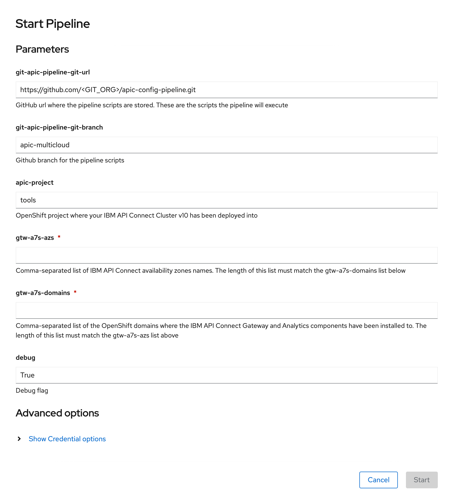{: style="max-height:800px"}    

Click `Start`. This will create a `Pipeline Run` object that represents this specific execution of the pipeline. You can follow along the execution of this OpenShift Pipeline Run by clicking the `Logs` tab at the top bar. If this execution of the IBM API Connect Configuration Pipeline finishes successfully you should see an `END` message at the bottom of the logs as well as a green check mark on the task the Pipeline Run has executed on the left hand side.

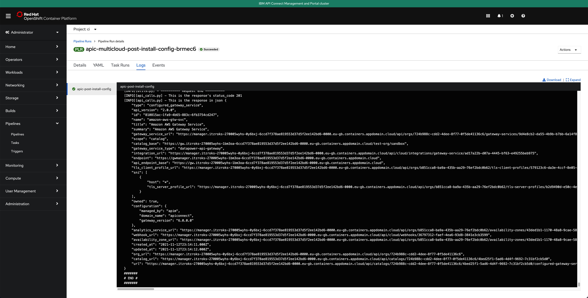{: style="max-height:800px"}

If you switch back to the `Details` tab of the `Pipeline Run`, you should also see green check marks both at the Pipeline Run name at the top and below it in the task that has been executed by this Pipeline Run that is displayed on the `Pipeline Run Details` section.

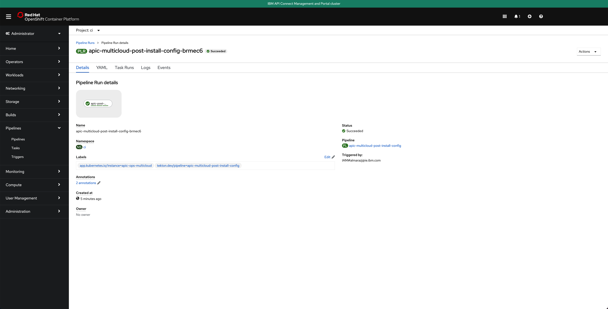{: style="max-height:800px"}

And in the main `Pipelines` section of your OpenShift web console you should also see the last `Pipeline Run` for the IBM API Connect config Pipeline in green

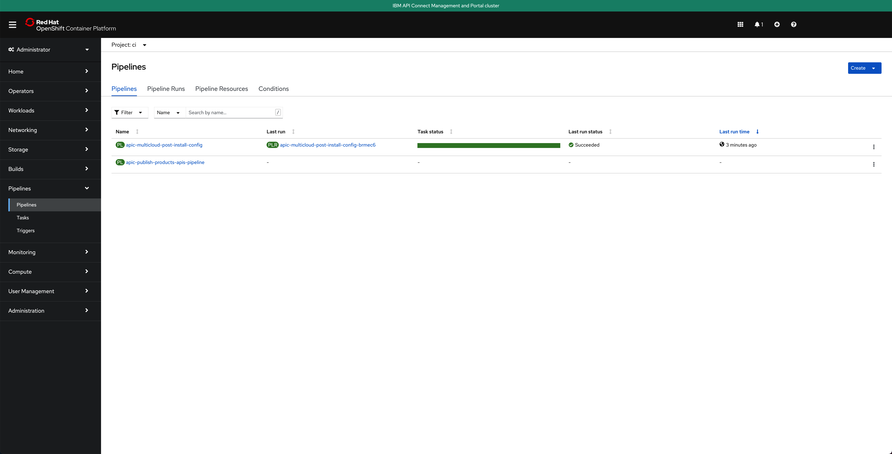{: style="max-height:800px"}

Finally, if you open your IBM API Connect Cloud Manager again, you will see that the IBM API Connect Configuration Pipeline has configured your IBM API Connect `Topology` for you with the IBM API Connect multi-cluster architecture you defined in your `apic-multi-cluster` profile in the `multi-tenancy-gitops` repository.

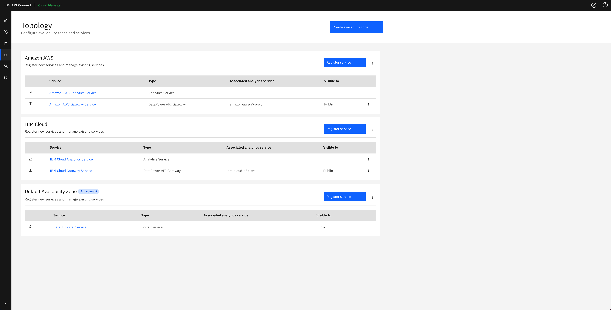{: style="max-height:800px"}

And in the IBM API Connect API Manager, you can see that the Gateway services that have been configured in the IBM API Connect Cloud Manager Topology for each of the availability zones have been registered with the default `Sandbox` catalog, that gets created out of the box for the `Provider Organization` you specified in the IBM API Connect Configuration Pipeline, so that you can securely publish, expose and access your application APIs.

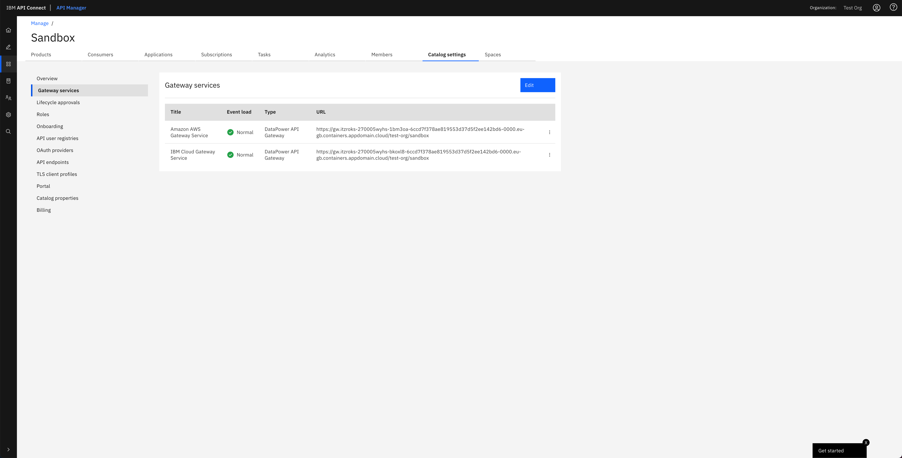{: style="max-height:800px"}

!!! tip
    You can open your IBM API Connect API Manager through your Red Hat OpenShift web console. Go to `Networking` --> `Routes` under the `tools` project and click on the `Location` value for the `management-api-manager` route. Then, use the credentials you specified in your provider organization configuration to log in.

!!! warning "Important"
    Do not execute the IBM API Connect Configuration Pipeline twice, even if the first attempt failed, as what the first run created **must** be manually removed for the second attempt to succeed. We do understand this is a limitation of the IBM API Connect Configuration Pipeline and something that could be fixed by implementing a previous cleanup task within the IBM API Connect Configuration Pipeline. However, this is out of the scope of this tutorial and, once again, the assets provided within this tutorial are meant to be a jump-start or a template to start from that should not be treated as production-ready assets. These assets can then be leveraged for a particular client, leaving the specific tailoring of these for the client to the team making use of the assets.

!!! success "Congratulations!"
    You have successfully created and executed the IBM API Connect Configuration Pipeline that configures your IBM API Connect multi-cluster instance. Your IBM API Connect multi-cluster instance is now ready to start working with. Go to the next section to execute another OpenShift Pipeline that will publish the dummy application's API, that is running on your IBM API Connect Gateway and Analytics clusters, into a product in IBM API Connect so that you can securely access the application through that API exposed on the IBM API Connect Gateway.