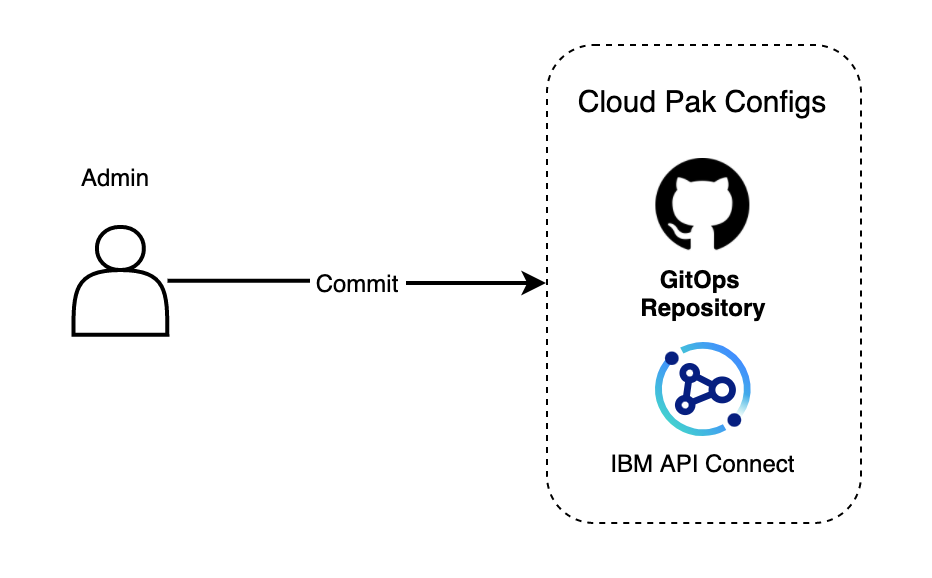

# IBM API Connect Multi-Cluster - Configure the clusters - Configure GitOps repos

<!--- cSpell:ignore apic datapower kustomization jsonpath storageclass -->

## Overview

In the previous chapter of this guide, we installed the Red Hat GitOps Operator, which relies on ArgoCD behind the scenes, as the fundamental component for deploying and managing any component on our clusters. We also went through creating a GitHub organization where the different GitOps repositories that will drive the GitOps processes for our clusters will be forked into. These GitOps repositories that will store the definitions and configurations of all the components we want to have in our clusters, that ArgoCD will use as the source of truth to what needs to be in our clusters or not, are:

* The [multi-tenancy-gitops](https://github.com/cloud-native-toolkit/multi-tenancy-gitops) repository
* The [multi-tenancy-gitops-infra](https://github.com/cloud-native-toolkit/multi-tenancy-gitops-infra) repository
* The [multi-tenancy-gitops-services](https://github.com/cloud-native-toolkit/multi-tenancy-gitops-services) repository
* The [multi-tenancy-gitops-apps](https://github.com/cloud-native-toolkit-demos/multi-tenancy-gitops-apps) repository

{: style="max-height:400px"}

By now, you should have a copy/fork of each of these repositories in the GitHub organization you must have created in the previous section too as well as a clone of those GitOps repositories on your local workstation. In fact, in the previous section we already used the local clone of the `multi-tenancy-gitops` repository to install ArgoCD in each of your Red Hat OpenShift clusters where we are going to install IBM API Connect components.

!!! success "Goal"
    In this section, we are going to see how to create the appropriate structure in the **`multi-tenancy-gitops`** and **`multi-tenancy-gitops-apps`** repositories that will allow us to install the right specific components of IBM API Connect to successfully deploy IBM API Connect in a multi-cluster landscape.

## Pre-requisites

For a better understanding of the following sections, we strongly recommend to review and understand the [Getting started with GitOps](../cluster-config/gitops-config.md) section for the IBM API Connect single cluster scenario tutorial where a more in-depth explanation of the `multi-tenancy-gitops` GitOps repo structure can be found.

## Customizing the GitOps repositories

The cloned GitOps repositories (specifically, `multi-tenancy-gitops` and `multi-tenancy-gitops-apps` repositories) need to be customized for a correct deployment of IBM API Connect in a multi-cluster landscape.
We will see in the following sections how to do the appropriate customizations to the aforementioned GitOps repositories.

### Update multi-tenancy-gitops repository

The `multi-tenancy-gitops` repository contains different profiles for different potential infrastructure landscapes. If you execute `tree multi-tenancy-gitops/0-bootstrap -L 2`,


```text
multi-tenancy-gitops/0-bootstrap
├── bootstrap.yaml
├── others
│   ├── 1-shared-cluster
│   ├── 2-isolated-cluster
│   └── 3-multi-cluster
└── single-cluster
    ├── 1-infra
    ├── 2-services
    ├── 3-apps
    ├── bootstrap.yaml
    └── kustomization.yaml
```

you should see the `single-cluster` and `others` folder whose aim is to represent those different potential infrastructure landscapes. The `single-cluster` profile represents the layered GitOps structure (`1-infra`, `2-services`, `3-apps`) for a single cluster. On the other hand, `others` folder contains other more complex profiles for multi-cluster infrastructure landscapes. If you execute `tree multi-tenancy-gitops/0-bootstrap/others -L 3`

```
multi-tenancy-gitops/0-bootstrap/others
├── 1-shared-cluster
│   ├── bootstrap-cluster-1-cicd-dev-stage-prod.yaml
│   ├── bootstrap-cluster-n-prod.yaml
│   ├── cluster-1-cicd-dev-stage-prod
│   │   ├── 1-infra
│   │   ├── 2-services
│   │   ├── 3-apps
│   │   └── kustomization.yaml
│   └── cluster-n-prod
│       ├── 1-infra
│       ├── 2-services
│       ├── 3-apps
│       └── kustomization.yaml
├── 2-isolated-cluster
│   ├── bootstrap-cluster-1-cicd-dev-stage.yaml
│   ├── bootstrap-cluster-n-prod.yaml
│   ├── cluster-1-cicd-dev-stage
│   │   ├── 1-infra
│   │   ├── 2-services
│   │   ├── 3-apps
│   │   └── kustomization.yaml
│   └── cluster-n-prod
│       ├── 1-infra
│       ├── 2-services
│       ├── 3-apps
│       └── kustomization.yaml
└── 3-multi-cluster
    ├── bootstrap-cluster-1-cicd.yaml
    ├── bootstrap-cluster-1-dev.yaml
    ├── bootstrap-cluster-1-stage.yaml
    ├── bootstrap-cluster-n-prod.yaml
    ├── cluster-1-cicd
    │   ├── 1-infra
    │   ├── 2-services
    │   ├── 3-apps
    │   └── kustomization.yaml
    ├── cluster-2-dev
    │   ├── 1-infra
    │   ├── 2-services
    │   ├── 3-apps
    │   └── kustomization.yaml
    ├── cluster-3-stage
    │   ├── 1-infra
    │   ├── 2-services
    │   ├── 3-apps
    │   └── kustomization.yaml
    └── cluster-n-prod
        ├── 1-infra
        ├── 2-services
        ├── 3-apps
        └── kustomization.yaml
```

you will see that each of those more complex multi-cluster infrastructure landscape profiles are the same as the `single-cluster` profile as far as the layered GitOps structure that represents a clusters but with the difference that in these multi-cluster profiles we will be driving the GitOps processes for several clusters.

!!! tip
    Once again, we strongly recommend to review and understand the [Getting started with GitOps](../cluster-config/gitops-config.md) section for the IBM API Connect single cluster scenario tutorial, where a more in-depth explanation of the `multi-tenancy-gitops` GitOps approach and repo structure can be found.

It is clear then that the profile for our IBM API Connect multi-cluster use case will need to live under `others`. However, since this is a very specific use case for an IBM capability such as IBM API Connect, we have not included such profile on the GitOps repo by default out of the box.

Instead, we have placed the structure for what will be your IBM API Connect Management and Portal cluster and IBM API Connect Gateway and Analytics cluster profiles under `docs/scenarios/apic-multi-cluster`. If you execute `tree multi-tenancy-gitops/doc/scenarios/apic-multi-cluster -L 2`,

```
multi-tenancy-gitops/doc/scenarios/apic-multi-cluster
├── bootstrap-gateway-analytics-cluster.yaml
├── bootstrap-management-portal-cluster.yaml
├── gateway-analytics-cluster
│   ├── 1-infra
│   ├── 2-services
│   ├── 3-apps
│   └── kustomization.yaml
├── management-portal-cluster
│   ├── 1-infra
│   ├── 2-services
│   ├── 3-apps
│   └── kustomization.yaml
└── scripts
    ├── create-apic-multi-cluster-profile.sh
    └── create-gateway-analytics-cluster.sh
```

you should see, as in with any of the other profiles, that your IBM API Connect Management and Portal cluster and IBM API Connect Gateway and Analytics cluster profiles look exactly the same as far as the layered GitOps structure is concerned.

The content under `multi-tenancy-gitops/doc/scenarios/apic-multi-cluster` should be treated as the templates which you will build your `apic-multi-cluster` profile under `multi-tenancy-gitops/0-bootstrap/others` from. For doing that, we provide two scripts under the `scripts` folder you can see above. The `create-apic-multi-cluster-profile.sh` script will be responsible for creating that `apic-multi-cluster` profile under `multi-tenancy-gitops/0-bootstrap/others`. The `create-gateway-analytics-cluster.sh` script will be responsible for creating extra IBM API Connect Gateway and Analytics clusters under the `apic-multi-cluster` profile you have just created with the other script. This will allow you to create those IBM API Connect multi-cluster implementations where you have multiple clusters hosting applications that you would want to front with the IBM API Connect Gateway and Analytics components for securely exposing their APIs to outside world as well as using IBM API Connect capabilities for publishing and socializing such APIs as it is explained in the [Overview](overview.md) section.

Let's have a look at what you need to do in this `multi-tenancy-gitops` GitOps repository to create the `apic-multi-cluster` profile that will drive your GitOps process to implement the IBM API Connect multi-cluster use case introduced in the [Overview](overview.md) section which will be made up of one IBM API Connect Management and Portal cluster and two IBM API Connect Gateway and Analytics clusters. The instructions below will simulate, with the names used for the IBM API Connect Gateway and Analytics clusters, that one of those clusters will be in IBM Cloud and the other in AWS. However, all the clusters used in this set of instructions are hosted in IBM Cloud and have been requested through IBM Technology Zone as explained in the [Create clusters](create-clusters.md) section.

1. Go to `multi-tenancy-gitops/doc/scenarios/apic-multi-cluster/scripts`

    ```bash
    cd $HOME/git
    cd multi-tenancy-gitops/doc/scenarios/apic-multi-cluster/scripts
    ```

1. Execute the `create-apic-multi-cluster-profile.sh` script:

    ```bash
    NAME=IBM ./create-apic-multi-cluster-profile.sh
    ```

1. You should see the following output:

    ```text
    Creating an IBM API Connect multi-cluster profile under 0-bootstrap/others
    The IBM Gateway and Analytics cluster will be called IBM
    Done
    You can find the new apic-multi-cluster profile under 0-bootsrap/others/apic-multi-cluster
    ```

1. Execute the `create-gateway-analytics-cluster.sh` script to create the IBM API Connect Gateway and Analytics cluster that will be hosted in AWS under your `apic-multi-cluster` profile created in the previous step:

    ```bash
    NAME=AWS ./create-gateway-analytics-cluster.sh
    ```

1. You should see the following output:

    ```text
    Creating a new IBM Gateway and Analytics cluster called AWS
    Your new cluster can be found in the AWS-gateway-analytics-cluster folder
    The bootstrap ArgoCD application for you new cluster is bootstrap-AWS-gateway-analytics-cluster.yaml
    ```

1. Change directory and go back to `multi-tenancy-gitops`:

    ```bash
    cd $HOME/git
    cd multi-tenancy-gitops
    ```

1. Execute `tree 0-bootstrap/others/apic-multi-cluster -L 2`, you should see the following output:

    ```text
    0-bootstrap/others/apic-multi-cluster
    ├── AWS-gateway-analytics-cluster
    │   ├── 1-infra
    │   ├── 2-services
    │   ├── 3-apps
    │   └── kustomization.yaml
    ├── IBM-gateway-analytics-cluster
    │   ├── 1-infra
    │   ├── 2-services
    │   ├── 3-apps
    │   └── kustomization.yaml
    ├── bootstrap-AWS-gateway-analytics-cluster.yaml
    ├── bootstrap-IBM-gateway-analytics-cluster.yaml
    ├── bootstrap-management-portal-cluster.yaml
    └── management-portal-cluster
        ├── 1-infra
        ├── 2-services
        ├── 3-apps
        └── kustomization.yaml
    ```

    which should correspond to your desired IBM API Connect multi-cluster GitOps profile which we will use to drive the implementation of the IBM API Connect multi-cluster use case.

Last step would be to configure all of the ArgoCD applications and ArgoCD projects that will drive the GitOps processes to point to the appropriate GitHub organization and repositories where you are delivering these changes to. That is the GitHub organization and repositories your created and forked respectively in the [Configure Clusters - GitOps](configure-clusters-gitops.md) section. As you will see in the following section of this tutorial, you will be kicking off those GitOps processes that will get your RedHat OpenShift clusters with the components and configuration that you want and that you specified through these GitOps repositories just now through the `bootstrap` files above.

If you inspect the content of one of those bootstrap files above:

```bash
cat 0-bootstrap/others/apic-multi-cluster/bootstrap-management-portal-cluster.yaml 
```

you should see the following:

```yaml hl_lines="12 13 14"
apiVersion: argoproj.io/v1alpha1
kind: Application
metadata:
  name: bootstrap-management-portal
  namespace: openshift-gitops
spec:
  destination:
    namespace: openshift-gitops
    server: https://kubernetes.default.svc
  project: default
  source:
    path: 0-bootstrap/others/apic-multi-cluster/management-portal-cluster
    repoURL: ${GIT_BASEURL}/${GIT_ORG}/${GIT_GITOPS}
    targetRevision: ${GIT_GITOPS_BRANCH}
  syncPolicy:
    automated:
      prune: true
      selfHeal: true
```

where you can see highlighted that the `source` for this ArgoCD Application resides in a GitHub repository at `repoURL`, on the branch `targetRevision` and on the path `path` and that the `repoURL` and `targetRevision` are parametrized. The reason for this is to allow the `multi-tenancy-gitops` repo to be a template you can fork and work with without stepping into anyone else's work.

As a result, we will need to configure all of these ArgoCD yaml files to point to your GitHub organization and repositories you are working with for the IBM API Connect multi-cluster use case. For this, we have provided a util script that is under `multi-tenancy-gitops/scripts`.

1. Execute the `set-git-source.sh` script:

    ```bash
    GIT_ORG=<your_git_org> ./scripts/set-git-source.sh
    ```

    where `<your_git_org>` is your GitHub organization you created in the [Configure Clusters - GitOps](configure-clusters-gitops.md) section and forked the GitOps repositories you are using to drive the GitOps processes for the IBM API Connect multi-cluster use case into.

    !!! info
        The `set-git-source.sh` allows for fine-grained customization of each of the GitOps repositories and their respective branches for greater flexibility. However, we assume you are working off the `master` branch and your GitOps repositories are called as the original GitOps repositories your forked from.
 
    !!! warning
        This script might take a minute or so to execute.

1. You should see the following output:

    ```text
    Setting kustomization patches to https://github.com/apic-multi-cluster/multi-tenancy-gitops.git on branch master
    Setting kustomization patches to https://github.com/apic-multi-cluster/multi-tenancy-gitops-infra.git on branch master
    Setting kustomization patches to https://github.com/apic-multi-cluster/multi-tenancy-gitops-services.git on branch master
    Setting kustomization patches to https://github.com/apic-multi-cluster/multi-tenancy-gitops-apps.git on branch master
    done replacing variables in kustomization.yaml files
    git commit and push changes now
    ```
    (*) where we have used `apic-multi-cluster` as our GitHub organization.

If you inspect the `bootstrap` file again, you should see it will now point to the GitHub organization and repository you are storing your GitOps configuration into.

```yaml hl_lines="12 13 14"
apiVersion: argoproj.io/v1alpha1
kind: Application
metadata:
  name: bootstrap-management-portal
  namespace: openshift-gitops
spec:
  destination:
    namespace: openshift-gitops
    server: https://kubernetes.default.svc
  project: default
  source:
    path: 0-bootstrap/others/apic-multi-cluster/management-portal-cluster
    repoURL: https://github.com/apic-multi-cluster/multi-tenancy-gitops.git
    targetRevision: master
  syncPolicy:
    automated:
      prune: true
      selfHeal: true
```

Finally, you can commit and deliver the changes to your `multi-tenancy-gitops` repository:

```bash
git add .
git commit -s -m "Created APIC multi-cluster profile"
git push origin $GIT_BRANCH
```

#### What is getting installed?

You have seen in the previous section how to create the `apic-multi-cluster` profile that will represent your IBM API Connect multi-cluster scenario as well as how to configure all the ArgoCD applications and projects that the OpenShift GitOps operator installed on your Red Hat OpenShift clusters will use to drive the GitOps process on them. However, you have not looked at what is actually being installed/deployed on each of these Red Hat OpenShift clusters by your GitOps repositories. To do that, you need to look at the `kustomization.yaml` files in each of the layers (`1-infra`, `2-services`, `3-apps`) for each of the Red Hat OpenShift clusters you have represented within your `apic-multi-cluster` profile. These `kustomization.yaml` files are nothing but an index of the resources, that in turn are represented as ArgoCD Applications, that you want to get created, and as a result installed/deployed, which are those that are not commented out.

You can use `cat` or any visual text editor to inspect any of those `kustomization.yaml` files that you should be able to locate under your `apic-multi-cluster` profile. For example, if you have a quick look at the `0-bootstrap/others/apic-multi-cluster/management-portal-cluster/2-services/kustomization.yaml`:

```bash
cat 0-bootstrap/others/apic-multi-cluster/management-portal-cluster/2-services/kustomization.yaml | grep '^- argo'
```

You should see a similar output as:

```yaml
- argocd/operators/ibm-apic-operator.yaml
- argocd/instances/ibm-apic-management-portal-instance.yaml
- argocd/operators/ibm-datapower-operator.yaml
- argocd/operators/ibm-foundations.yaml
- argocd/operators/ibm-catalogs.yaml
- argocd/operators/openshift-pipelines.yaml
```

where you can figure out what will get installed/deployed on your IBM API Connect Management and Portal cluster:

* `argocd/operators/ibm-catalogs.yaml` - will install the IBM Operator Catalogs so that you can install the different IBM Operators we need for your use case.
* `argocd/operators/ibm-foundations.yaml` and `argocd/operators/ibm-datapower-operator.yaml` - will install the IBM Foundations and IBM DataPower operators that are a dependency for the IBM API Connect operator.
* `argocd/operators/ibm-apic-operator.yaml` - will install the IBM API Connect operator.
* `argocd/instances/ibm-apic-management-portal-instance.yaml` - will install an instance of the IBM API Connect Management and Portal components.
* `argocd/operators/openshift-pipelines.yaml` - will install the Red Hat OpenShift Pipelines operator that will allow you to execute Red Hat OpenShift Pipelines in the following sections to configure your IBM API Connect instance as well as to publish your IBM API Connect products and APIs.

### Update multi-tenancy-gitops-apps repository

The `multi-tenancy-gitops-apps` repository contains the actual IBM API Connect artifacts that will get installed on your Red Hat OpenShift clusters. For example, if you have a closer look at the `0-bootstrap/others/apic-multi-cluster/management-portal-cluster/2-services/argocd/instances/ibm-apic-management-portal-instance.yaml` from your `multi-tenancy-gitops` repo you will see the following: 


```yaml linenums="1" hl_lines="11 17 18"
apiVersion: argoproj.io/v1alpha1
kind: Application
metadata:
  name: ibm-apic-management-portal-instance
  annotations:
    argocd.argoproj.io/sync-wave: "240"
  finalizers:
    - resources-finalizer.argocd.argoproj.io
  labels:
    gitops.tier.group: cloudpak
    gitops.tier.layer: applications
spec:
  destination:
    namespace: openshift-gitops
    server: https://kubernetes.default.svc
  project: services
  source: # repoURL  and targetRevision populated by kustomize patches in 2-services/kustomization.yaml
    path: apic/config/argocd/multi-cluster/instances/management-portal-instance
  syncPolicy:
    automated:
      prune: true
      selfHeal: true
```

1. The `ibm-apic-management-portal-instance.yaml` file is nothing but an ArgoCD Application that will point to another place for the resources to be deployed/installed as a result.
1. In line number 11, this ArgoCD Application is labelled with `gitops.tier.layer: applications` so that, as you can read in line number 17, it will take the appropriate value for `repoURL` and `targetRevision`.
1. In line number 17, this ArgoCD Application will get its `repoURL` and `targetRevision` attributes of the `source` property patched so that these point to the appropriate repository, where the source for the resources to be created is.
1. In line number 18, you can see the `path` where the aforementioned resources are within the `repoURL` repository.

To see what that `repoURL` is you need to inspect, once again, the `0-bootstrap/others/apic-multi-cluster/management-portal-cluster/2-services/kustomization.yaml` file. In here you should find the Kustomize patches at the very end:

```yaml hl_lines="13-23"
patches:
- target:
    group: argoproj.io
    kind: Application
    labelSelector: "gitops.tier.layer=services"
  patch: |-
    - op: add
      path: /spec/source/repoURL
      value: https://github.com/apic-multi-cluster/multi-tenancy-gitops-services.git
    - op: add
      path: /spec/source/targetRevision
      value: master
- target:
    group: argoproj.io
    kind: Application
    labelSelector: "gitops.tier.layer=applications"
  patch: |-
    - op: add
      path: /spec/source/repoURL
      value: https://github.com/apic-multi-cluster/multi-tenancy-gitops-apps.git
    - op: add
      path: /spec/source/targetRevision
      value: master
- target:
    group: argoproj.io
    kind: Application
    labelSelector: "gitops.tier.layer=services,gitops.tier.source=helm"
  patch: |-
    - op: add
      path: /spec/source/repoURL
      value: https://charts.cloudnativetoolkit.dev
- target:
    name: ibm-automation-foundation-operator
  patch: |-
    - op: add
      path: /spec/source/helm/parameters/-
      value:
        name: spec.channel
        value: v1.1
```

and you should be able to identify the patches that will get applied to `repoURL` and `targetRevision` for each of the ArgoCD Applications that are defined to be installed/deployed within that very same `kustomization.yaml` file.

In summary, you have seen that certain resources we have configured in the `multi-tenancy-gitops` repository to be installed/deployed actually point to the `multi-tenancy-gitops-apps` repository. As a result of that, you need to also update the `multi-tenancy-gitops-apps` repository to your desired configuration for the IBM API Connect multi-cluster use case.

If you inspect the IBM API Connect subdirectory (`apic`) within the `multi-tenancy-gitops-apps` repository with `tree multi-tenancy-gitops-apps/apic -L 3` you should see the following output:

```text
multi-tenancy-gitops-apps/apic
├── config
│   └── argocd
│       ├── multi-cluster
│       └── single-cluster
├── environments
│   ├── multi-cluster
│   │   ├── app
│   │   ├── instances
│   │   └── ops
│   └── single-cluster
│       ├── instances
│       ├── kustomization.yaml
│       ├── pipelines
│       ├── roles
│       └── tasks
├── scripts
│   ├── create-apic-multi-cluster-instances.sh
│   └── create-gateway-analytics-instance.sh
└── templates
    └── apic-multi-cluster
        ├── gateway-analytics-instance
        ├── gateway-analytics-instance.yaml
        ├── management-portal-instance
        └── management-portal-instance.yaml
```

where

* `config` stores the ArgoCD Applications that the `multi-tenancy-gitops` repository you worked with in this section points their ArgoCD Applications to.
* `environments` stores all the Kubernetes resources that will get installed/deployed on your Red Hat OpenShift clusters.
* `scripts` stores a couple of utility scripts that will help you creating your `instances` within your environments matching the same `apic-multi-cluster` profile structure you created earlier in `multi-tenancy-gitops/0-bootstrap/others`.
* `templates` stores those `apic-multi-cluster` instances templates.

It seems you somehow need to replicate the structure for your IBM API Connect multi-cluster profile you created within the `multi-tenancy-gitops` repository in the previous subsection but now within your `multi-tenancy-gitops-apps` repository. And this makes sense since you saw earlier that the `apic-multi-cluster` profile will vary based on your specific requirements and naming and therefore you can only re-create that structure in the `multi-tenancy-gitops-apps` repository once you have created the `apic-multi-cluster` profile structure within the `multi-tenancy-gitops` repository. Moreover, you know that the IBM API Connect Management and Portal cluster plus the IBM API Connect Gateway and Analytics clusters created within the `apic-multi-cluster` profile in the `multi-tenancy-gitops` repository will, in turn, enable in their respective `2-services/kustomization.yaml` files either the `ibm-apic-management-portal-instance.yaml` or `ibm-apic-gateway-analytics-instance.yaml` and that those instances are nothing but ArgoCD Applications pointing to this `multi-tenancy-gitops-apps` repository.

So let's have a look at what you need to recreate the structure of your `apic-multi-cluster` profile.

1. Go to `multi-tenancy-gitops-apps/apic/scripts`:

    ```bash
    cd $HOME/git
    cd multi-tenancy-gitops-apps/apic/scripts
    ```

1. Execute the `create-apic-multi-cluster-instances.sh` script:

    ```bash
    NAME=IBM ./create-apic-multi-cluster-instances.sh
    ```

    where `NAME` should be set to the same name you used in the `multi-tenancy-gitops` repository for the IBM API Connect Gateway and Analytics cluster you created.

1. You should see similar output as:

    ```text
    Creating the IBM API Connect component instances under multi-tenancy-gitops-apps/apic/environments/multi-cluster/instances
    Creating the IBM API Connect component instances bootstrap applications under --> multi-tenancy-gitops-apps/apic/config/argocd/multi-cluster/instances
    The IBM Gateway and Analytics instance name is IBM
    Done
    ```

2. Execute the `create-gateway-analytics-instance.sh` script for any extra IBM API Connect Gateway and Analytics cluster you might have created in the `apic-multi-cluster` profile in the `multi-tenancy-gitops` repository.

    ```bash
    NAME=AWS ./create-gateway-analytics-instance.sh
    ```

    where `NAME` should be set to the same name you used in the `multi-tenancy-gitops` repository for your extra IBM API Connect Gateway and Analytics cluster you created.

1. You should see similar output as:

    ```text
    Creating a new IBM Gateway and Analytics instance called AWS
    The IBM API Gateway and Analytics instance will be under --> multi-tenancy-gitops-apps/apic/environments/multi-cluster/instances
    The IBM API Gateway and Analytics instance bootstrap application will be under --> multi-tenancy-gitops-apps/apic/config/argocd/multi-cluster/instances
    Done
    ```

Let's look at the new structure for your `multi-tenancy-gitops-apps` repository. Let's first look at the `multi-tenancy-gitops-apps/apic/config/argocd/multi-cluster` folder which is where the ArgoCD applications from `multi-tenancy-gitops` repository point to. Execute `tree multi-tenancy-gitops-apps/apic/config/argocd/multi-cluster -L 3`:

```text
multi-tenancy-gitops-apps/apic/config/argocd/multi-cluster
├── app
│   └── apic-app-multi-cluster.yaml
├── instances
│   ├── AWS-gateway-analytics-instance
│   │   └── AWS-gateway-analytics-instance.yaml
│   ├── IBM-gateway-analytics-instance
│   │   └── IBM-gateway-analytics-instance.yaml
│   └── management-portal-instance
│       └── management-portal-instance.yaml
└── ops
    └── apic-pipelines-multi-cluster.yaml
```

You can see now that under `instances` you have the same structure in terms of IBM API Connect Management and Portal and IBM API Connect Gateway and Analytics clusters as you have in your `multi-tenancy-gitops` repository. There is also an `app` and `ops` folders which will be responsible for deploying a dummy application that returns a message about the cloud where it is running (for later testing of the scenario) and the OpenShift pipelines that will configure your IBM API Connect multi-cluster instance and publish your IBM API Connect product and APIs respectively. These folders, which in turn contain ArgoCD applications, will get deployed in the IBM API Connect Gateway and Analytics and IBM API Connect Management and Portal clusters respectively. You can figure this out by checking the `3-services/kustomization.yaml` files for your clusters within the `apic-multi-cluster` profile in the `multi-tenancy-gitops` repository. You will work with the application and the OpenShift Pipelines in the following sections.

Now, let's have a look at the `multi-tenancy-gitops-apps/apic/environments/multi-cluster` folder which is where the above ArgoCD Applications will be watching Kubernetes resources for. Execute `tree multi-tenancy-gitops-apps/apic/environments/multi-cluster/instances -L 3` (the `app` and `ops` folders will get examined in the following sections):

```text
multi-tenancy-gitops-apps/apic/environments/multi-cluster/instances
├── AWS-gateway-analytics-instance
│   ├── certificates
│   │   ├── gateway-peering.yaml
│   │   ├── gateway-service.yaml
│   │   └── ingress-ca.yaml
│   ├── instances
│   │   ├── ibm-apic-analytics-instance.yaml
│   │   └── ibm-apic-gateway-instance.yaml
│   ├── issuers
│   │   ├── ingress-issuer.yaml
│   │   └── selfsigning-issuer.yaml
│   ├── kustomization.yaml
│   ├── scripts
│   │   └── set-storage-ocp-domain.sh
│   └── secrets
│       ├── datapower-admin-credentials.yaml
│       └── ingress-ca.yaml
├── IBM-gateway-analytics-instance
│   ├── certificates
│   │   ├── gateway-peering.yaml
│   │   ├── gateway-service.yaml
│   │   └── ingress-ca.yaml
│   ├── instances
│   │   ├── ibm-apic-analytics-instance.yaml
│   │   └── ibm-apic-gateway-instance.yaml
│   ├── issuers
│   │   ├── ingress-issuer.yaml
│   │   └── selfsigning-issuer.yaml
│   ├── kustomization.yaml
│   ├── scripts
│   │   └── set-storage-ocp-domain.sh
│   └── secrets
│       ├── datapower-admin-credentials.yaml
│       └── ingress-ca.yaml
└── management-portal-instance
    ├── certificates
    │   ├── analytics-client-client.yaml
    │   ├── analytics-ingestion-client.yaml
    │   ├── gateway-client-client.yaml
    │   ├── ingress-ca.yaml
    │   └── portal-admin-client.yaml
    ├── instances
    │   ├── ibm-apic-management-instance.yaml
    │   └── ibm-apic-portal-instance.yaml
    ├── issuers
    │   ├── ingress-issuer.yaml
    │   └── selfsigning-issuer.yaml
    ├── kustomization.yaml
    ├── scripts
    │   └── set-storage-ocp-domain.sh
    └── secrets
        ├── ingress-ca.yaml
        └── management-admin-credentials.yaml
```

where you can see

* A folder per IBM API Connect Management and Portal cluster and IBM API Connect Gateway and Analytics clusters that should resemble, as already said, the structure you defined for the `apic-multi-cluster` profile in the `multi-tenancy-gitops` repository.
* A `certificates`, `issuers` and `secrets` folders that will store the certificates, issuers and secrets that need to get created/deployed in order for the specific IBM API Connect components to work fine.
* An `instances` folder that will store the specific IBM API Connect component instances that will get deployed/created in that cluster.
* A `scripts` folder that will store a utility script to help you set the specific Red Hat OpenShift domain and block storage class for that Red Hat OpenShift cluster.
* A `kustomization.yaml` file that, once again, will contain the index of resources the ArgoCD Application taking care of this location within your `multi-tenancy-gitops-apps` repository will create/deploy.

!!! info "Certificates and Issuers"
    IBM API Connect requires certificates to stablish secure mutual TLS (mTLS) communication between its Management component and the rest of the components. The certificates can be provided or you can let the IBM API Connect operator, with the help of the IBM Cert Manager operator installed as part of the IBM Foundations operator, create them. It will use the Issuers to create these which in turn require of a Certificate Authority to sign these with. Since this is a reference asset, certificates will get created by the IBM API Connect operator. However, a Certificate Authority called `ingress-ca.yaml` has been provided within the `secrets` folder so that it reflects a more real world scenario. For more information about certificates, issuers and certificate authorities, please contact and IBM API Connect SME as this is out of the scope of this asset.

There are just another two steps you need to take in order to have the `multi-tenancy-gitops-apps` repository totally configured for you specific IBM API Connect multi-cluster use case. 

First, you need to configure each of the management, portal, gateway and analytics instances within your Management and Portal and Gateway and Analytics instances above in `multi-tenancy-gitops-apps/apic/environments/multi-cluster/instances` with the specific Red Hat OpenShift domain and block storage class name for the Red Hat OpenShift cluster these will be installed/deployed into. For example, if you inspect the `multi-tenancy-gitops-apps/apic/environments/multi-cluster/instances/management-portal-instance/instances/ibm-apic-management-instance.yaml` instance:

```yaml hl_lines="46 52 58 64 67"
apiVersion: argoproj.io/v1alpha1
kind: Application
metadata:
  name: ibm-apic-management-instance
  annotations:
    argocd.argoproj.io/sync-wave: "250"
  finalizers:
    - resources-finalizer.argocd.argoproj.io
  labels:
    gitops.tier.group: cloudpak
    gitops.tier.layer: services
spec:
  syncPolicy:
    automated:
      prune: true
      selfHeal: true
  destination:
    namespace: tools
    server: https://kubernetes.default.svc
  project: services
  source:
    path: instances/ibm-apic-mgmt-instance
    helm:
      values: |
        ibm-apic-mgmt-instance:
          ibmapicmgmtinstance:
            name: management
            spec:
              version: 10.0.3.0-ifix1
              profile: n3xc4.m16
              portal:
                admin:
                  secretName: portal-admin-client
              analytics:
                client:
                  secretName: analytics-client-client
                ingestion:
                  secretName: analytics-ingestion-client
              gateway:
                client:
                  secretName: gateway-client-client
              cloudManagerEndpoint:
                annotations:
                  certmanager.k8s.io/issuer: ingress-issuer
                hosts:
                  - name: admin.<your-openshift-domain>
                    secretName: management-cm-endpoint-secret
              apiManagerEndpoint:
                annotations:
                  certmanager.k8s.io/issuer: ingress-issuer
                hosts:
                  - name: manager.<your-openshift-domain>
                    secretName: management-apim-endpoint-secret
              platformAPIEndpoint:
                annotations:
                  certmanager.k8s.io/issuer: ingress-issuer
                hosts:
                  - name: api.<your-openshift-domain>
                    secretName: management-api-endpoint-secret
              consumerAPIEndpoint:
                annotations:
                  certmanager.k8s.io/issuer: ingress-issuer
                hosts:
                  - name: consumer.<your-openshift-domain>
                    secretName: management-consumer-endpoint-secret
              databaseVolumeClaimTemplate:
                storageClassName: <your-block-storage-class>
              microServiceSecurity: certManager
              certManagerIssuer:
                name: selfsigning-issuer
                kind: Issuer
              adminUser:
                secretName: management-admin-credentials
              license:
                accept: true
                license: L-RJON-BZEP9N
                use: production
```

you will see in lines `46`, `52`, `58` and `64` that there is a placeholder for your Red Hat OpenShift cluster domain and in line `67` there is a placeholder for you Red Hat OpenShift cluster block storage class name.

For replacing these placeholders at once for a particular IBM API Connect Management and Portal or IBM API Connect Gateway and Analytics instance, you have the `set-storage-ocp-domain.sh` script under the `scripts` folder of that specific instance. All you need to do is execute it:

1. Change directory to the specific instance within `multi-tenancy-gitops-apps/apic/environments/multi-cluster/instances` and into the `scripts` folder.

1. Execute the `set-storage-ocp-domain.sh` script:

    ```bash
    OCP_DOMAIN=<your_ocp_domain> STORAGE=<your_block_storage_class_name> ./set-storage-ocp-domain.sh
    ```

    where

    * `<your_ocp_domain>` is the domain for your Red Hat OpenShift cluster.
        
        !!! tip
            You can find your Red Hat OpenShift cluster domain by executing `oc get route console -n openshift-console -o jsonpath='{.spec.host}'`. Your Red Hat OpenShift cluster domain will be what is after `console-openshift-console.`. That is, what the command would return you is `console-openshift-console.<your_ocp_domain>`. Another way to find out your Red Hat OpenShift cluster domain would be with the following command `oc get route console -n openshift-console -o jsonpath='{.status.ingress[].routerCanonicalHostname}'`

    * `<your_block_storage_class_name>` is the name of a block storage class in your Red Hat OpenShift cluster.
    
        !!! tip
            You can find your Storage Classes with `oc get storageclass`

1. After executing the `set-storage-ocp-domain.sh` script, you should see similar output as:

    ```text
    Setting the storage class name for the IBM API Connect Management and Portal components to ibmc-block-gold
    Setting the OpenShift domain for the IBM API Connect Management and Portal components to itzroks-270005wyhs-0y6bxj-6ccd7f378ae819553d37d5f2ee142bd6-0000.eu-gb.containers.appdomain.cloud
    Done
    ```

1. If you now inspect again the `ibm-apic-management-instance.yaml` or `ibm-apic-portal-instance.yaml` under `multi-tenancy-gitops-apps/apic/environments/multi-cluster/instances/management-portal-instance/instances/` you should now see that the placeholders have been properly replaced. Again, we have chosen the IBM API Connect Management and Portal instance as the example.

!!! warning "Important"
    Remember you need to set the Red Hat OpenShift cluster domain and block storage class name for the IBM API Connect Management and Portal instance and all the IBM API Connect Gateway and Analytics instances you have configured your IBM API Connect multi-cluster use case with. That is, all the instances you will find within `multi-tenancy-gitops-apps/apic/environments/multi-cluster/instances`

Second, you also need to set the git sources for all of the ArgoCD Applications and `kustomization.yaml` files within the `multi-tenancy-gitops-apps` repository, in the same fashion you did earlier in the `multi-tenancy-gitops` repository, so that the `repoURL` and `targetRevision` get patched with the appropriate GitHub repository URLs. As we do in the `multi-tenancy-gitops` repository, we also provide a utility script called `set-git-source.sh` under the `multi-tenancy-gitops-apps/scripts` folder to help you with replacing those git source placeholders.

1. Change directory to `multi-tenancy-gitops-apps/scripts`.

1. Execute the `set-git-source.sh` script:

    ```bash
    GIT_ORG=<your_git_org> ./scripts/set-git-source.sh
    ```

    where `<your_git_org>` is your GitHub organization you created in the [Configure Clusters - GitOps](configure-clusters-gitops.md) section and forked the GitOps repositories you are using to drive the GitOps processes for the IBM API Connect multi-cluster use case into.

    !!! info
        The `set-git-source.sh` allows for fine-grained customization of each of the GitOps repositories and their respective branches for greater flexibility. However, we assume you are working off the `master` branch and your GitOps repositories are called as the original GitOps repositories your forked from.
 
    !!! warning
        This script might take a minute or so to execute.

1. You should see similar output as:

    ```text
    Setting kustomization patches to https://github.com/apic-multi-cluster/multi-tenancy-gitops.git on branch master
    Setting kustomization patches to https://github.com/apic-multi-cluster/multi-tenancy-gitops-infra.git on branch master
    Setting kustomization patches to https://github.com/apic-multi-cluster/multi-tenancy-gitops-services.git on branch master
    Setting kustomization patches to https://github.com/apic-multi-cluster/multi-tenancy-gitops-apps.git on branch master
    done replacing variables in ArgoCD Application files
    git commit and push changes now
    ```

Finally, you can commit and deliver the changes to your `multi-tenancy-gitops-apps` repository:

```bash
git add .
git commit -s -m "Created APIC multi-cluster instances"
git push origin $GIT_BRANCH
```

!!! success "Congratulations!"
    You have created an IBM API Connect multi-cluster profile in your `multi-tenancy-gitops` repository that should suit your IBM API Connect multi-cluster use case needs. You have then replicated that profile structure in your `multi-tenancy-gitops-apps` repository where the actual resources to be installed/deployed by the different ArgoCD applications reside after tailoring these to your Red Hat OpenShift cluster specifics. As a result, you have successfully configured both your `multi-tenancy-gitops` and `multi-tenancy-gitops-apps` repositories that will be driving the GitOps process for deploying your IBM API Connect multi-cluster scenario. Go to the next section to start deploying it!
