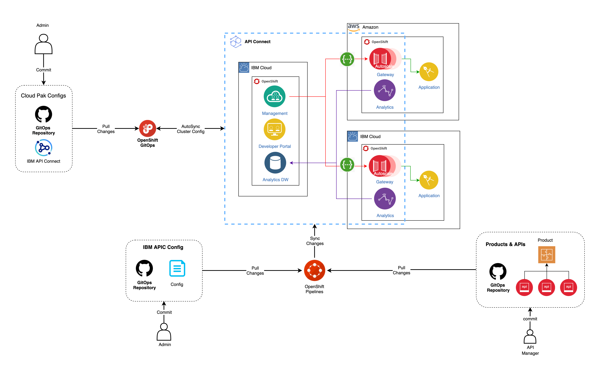

# IBM API Connect Multi-Cluster - Configure the clusters - GitOps repos & ArgoCD

<!--- cSpell:ignore clusterrole clusterrolebinding -->

## Overview

A [GitOps](https://www.openshift.com/blog/introduction-to-gitops-with-openshift) model must be at the core of the methodology or approach used to deploy and manage any IBM capability in production. It ensures that the installation, configuration and changes of these IBM capabilities, as well as their configuration and citizens (applications, integration flows, APIs, etc), is only done through code.

GitOps puts git repositories and git commands such as **git push** (to request a change) and **git merge** (to approve a change) at the heart of configuration management. A GitOps approach helps an organization implement best practices in version control and release governance based on a widely used open standard -- **git**.

The following diagram outlines the major components in an IBM API Connect GitOps model:

[{: style="max-height:1000px"}](https://app.diagrams.net/#Hcloud-native-toolkit%2Fmulti-tenancy-gitops%2Fmaster%2Fdoc%2Fdiagrams%2FAPIC-Multi-Cluster-GitOps.drawio)

!!! tip
    <a href="https://raw.githubusercontent.com/cloud-native-toolkit/multi-tenancy-gitops/master/doc/diagrams/APIC-Multi-Cluster-GitOps.drawio" download>Right-click here and select "Save Link As" to download the DrawIO file</a> used to generate these diagrams or [open the diagram using diagrams.net](https://app.diagrams.net/#Hcloud-native-toolkit%2Fmulti-tenancy-gitops%2Fmaster%2Fdoc%2Fdiagrams%2FAPIC-Multi-Cluster-GitOps.drawio)

Notice the clear separation of concerns:

* **Tekton (OpenShift Pipelines)**  pipelines use IBM API Connect configuration as well as applications API definitions and products source repositories to apply those definitions to an existing IBM API Connect cluster. For the IBM API Connect configuration, this ensures that the exact same configuration of an IBM API Connect cluster can be applied to another IBM API Connect cluster, easing the activities in case of a disaster recovery situation for instance. For your IBM API Connect products and application API definitions for those products and catalogs, this OpenShift Pipelines ensure that any change on those artifacts gets immediately reflected on your IBM API Connect cluster. We need to use OpenShift pipelines for the IBM API Connect configuration and applications API definitions, products and catalogs since these are not yet Kubernetes resources that a GitOps tool such as ArgoCD can automatically watch for changes.

* **ArgoCD (OpenShift GitOps)**  applications watch a Git config repository for changes. OpenShift GitOps applies the Kubernetes resources thus identified to the cluster, resulting in new or updated Kubernetes resources that represent the changed IBM API Connect cluster and its ecosystem, such as pods, routes etc. In contrast to pipeline runs, OpenShift GitOps changes are durable; they remain as defined unless and until they are explicitly changed or deleted in the GitOps repository. Moreover, if the cluster resources drift from their Git config values, ArgoCD will restore them to their desired values; only changes that are applied to
the Git config repository affect the long term state of the cluster.

In general, in application development, OpenShift Pipelines and OpenShift GitOps are used to separate *Continuous Integration* from *Continuous Deployment*. Often, the Tekton pipeline will perform its changes under a pull-request (PR) to provide an explicit approval mechanism for cluster changes. This is especially important in higher environments such as production which require a formal sign-off. Lower environments such as development often apply successful pipeline runs directly to the Git config repository that are immediately seen by ArgoCD and applied to the cluster.

For IBM API connect, the *Continuous Integration* and *Continuous Deployment* concepts aren't as clear as in common application development scenarios since you are not building or deploying applications although the API definitions of these, and the product and catalogs they will belong to, could be. We strongly suggest to read over the MQ tutorial in this Cloud Pak Production Deployment Guides for a more traditional application development scenario.

In this section of the tutorial, we're going to set up the GitOps repository, and install ArgoCD. More precisely, we are going to

* Create a Github Organization
* Download a sample GitOps repository and briefly review it
* Install ArgoCD
* Customize ArgoCD
* Login in to the ArgoCD UI

By the end of this topic we'll have a all the basic components in place to perform GitOps in our cluster.

## Pre-requisites

Before attempting this section, you must have completed the previous *Create the Clusters* section.

--8<-- "gitops-sample-repo-creation.md"

!!! warning "Important"
    You **must repeat** the following **Installing ArgoCD for GitOps** section for each of your clusters where you plan to install any component of IBM API Connect.

--8<-- "gitops-install-argocd.md"

!!! warning "Important"
    You **must repeat** this **Installing ArgoCD for GitOps** section for each of your clusters where you plan to install any component of IBM API Connect.

!!! success "Congratulations!"
    You have created the GitOps organization based on the sample GitOps repositories that will be used to manage the IBM capabilities and applications that you will install on your cluster. We have also briefly examined the structure of the main GitOps repository driving what will get installed. You have also installed ArgoCD. You have created a specific **clusterrole** and **clusterrolebinding** for the ArgoCD service account to ensure that it is able to manage the cluster in a well governed manner. Finally, you have launched the ArgoCD UI; you will make extensive use of it during this tutorial.