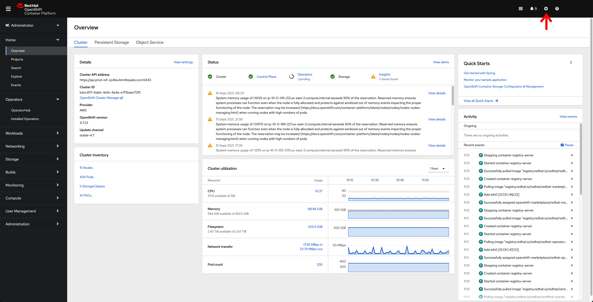
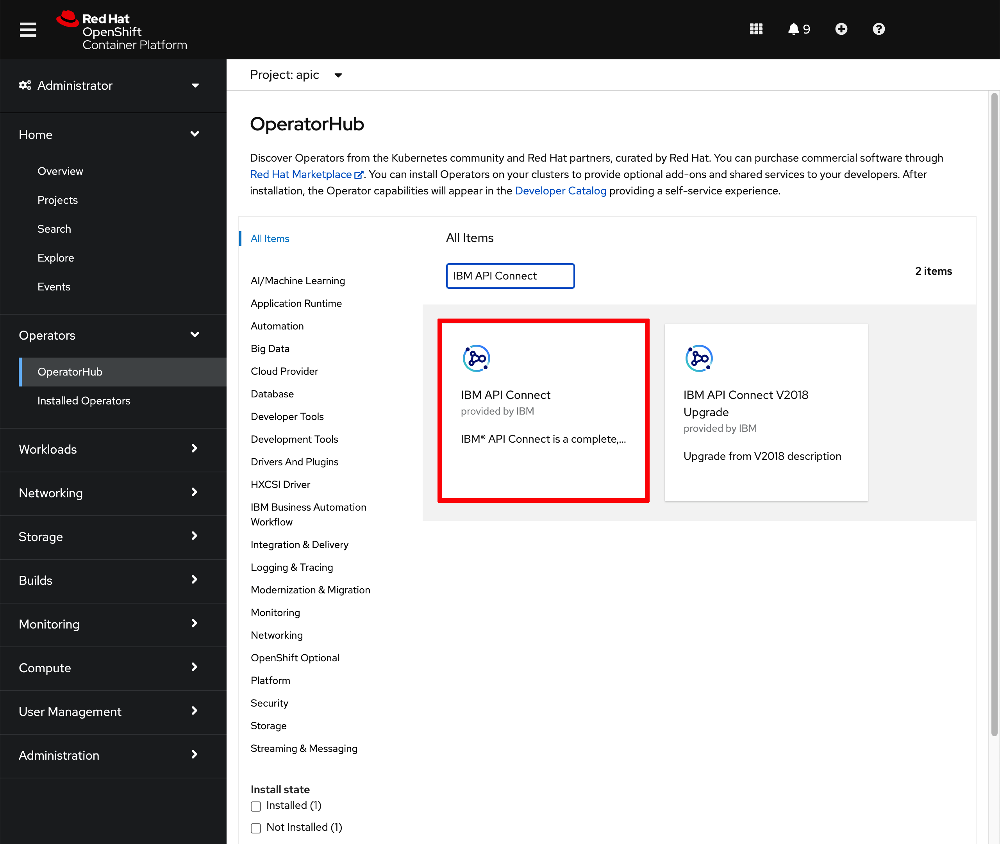
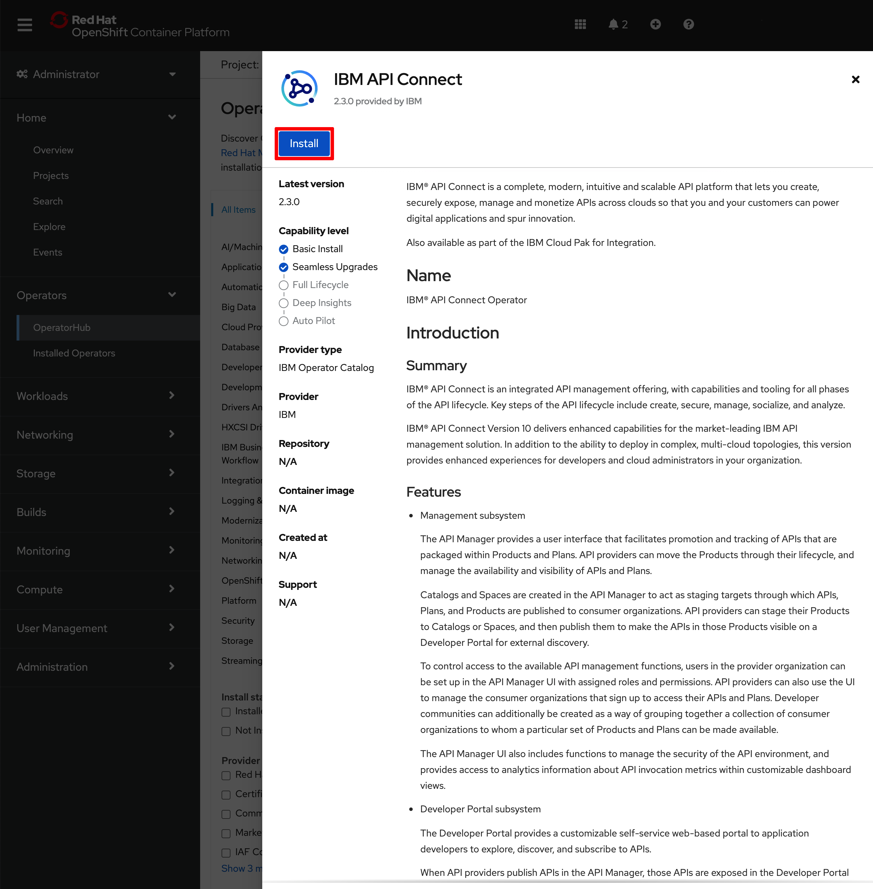
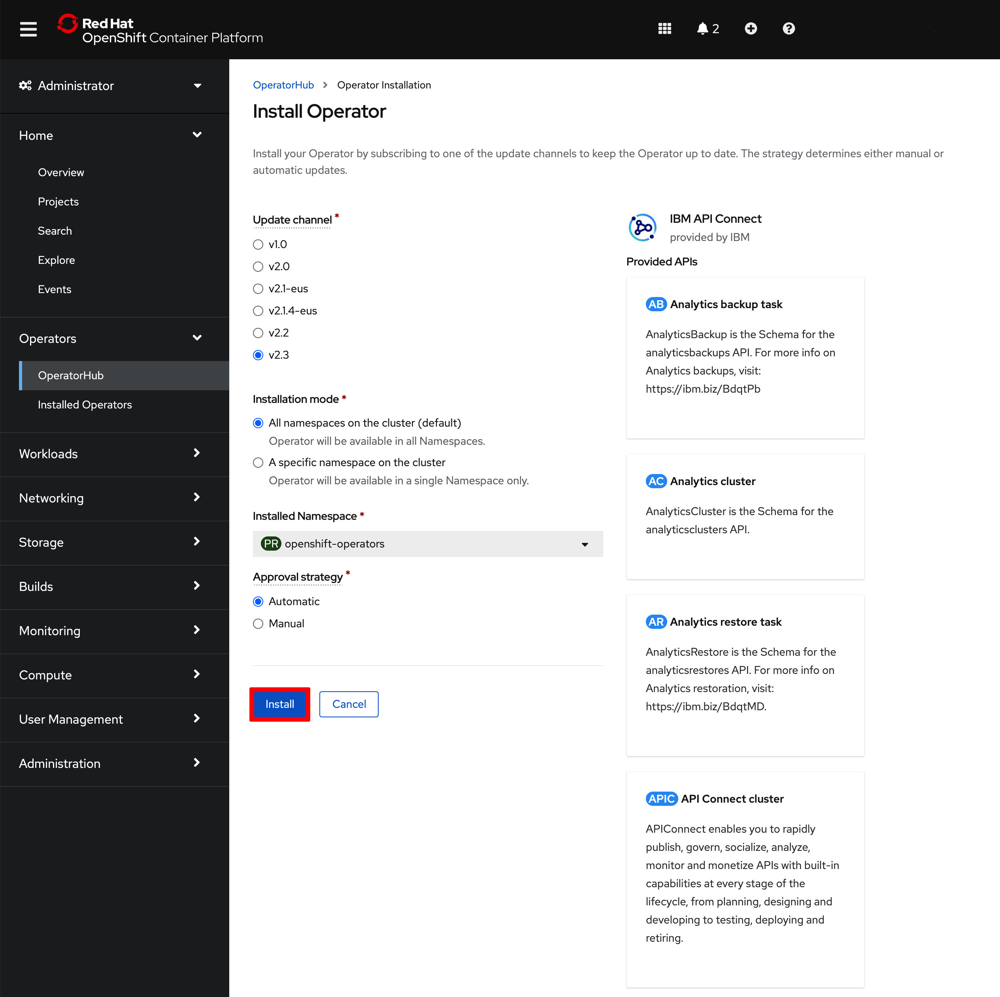
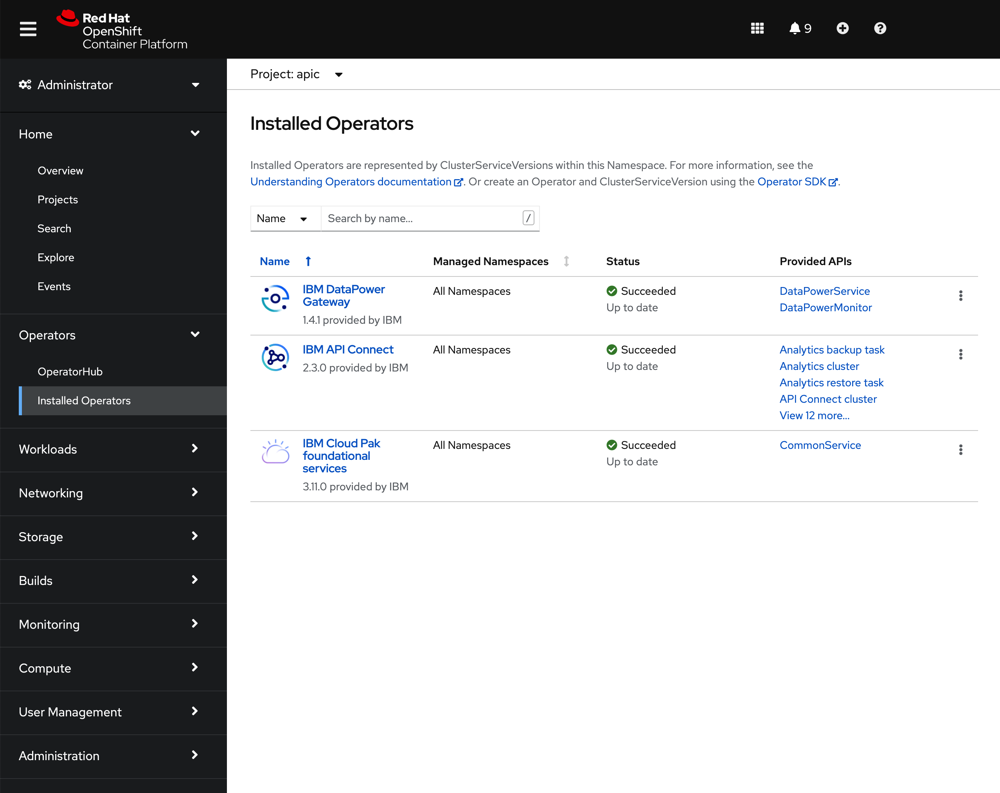

# IBM API Connect Multi-cloud Deployment

<!--- cSpell:ignore singl apiconnectcluster ibmc APIC Availability unmanaged practioners Pak Paks Quickstart qube cntk autoplay allowfullscreen Cavazos multicloud -->

!!! abstract
    This document describes the steps to carry out a multi-cloud deployment of [IBM API Connect](https://www.ibm.com/docs/en/api-connect/10.0.x?topic=api-connect-overview) across different cloud providers, IBM Cloud and Amazon AWS, all using RedHat OpenSift Container Platform as the underlying unified platform.
    
{: style="max-height:900px"}


## Overview

In this document you will find the steps followed in order to deploy the a multi-cloud topology for IBM API Connect. The Management and Developer components have been installed on a RedHat OpenShift Kubernetes Service cluster in IBM Cloud. The Gateway and Analytics components have been installed on two different RedHat OpenShift clusters, one being a RedHat OpenShift Kubernetes Service cluster on IBM Cloud and the other a RedHat OpenShift cluster on Amazon AWS. The aim is to simulate the use case where you might have applications running on RedHat OpenShift clusters that are hosted on different clouds but you want to unify the way you develop, manage, socialize and secure the APIs of your applications using IBM API Connect.

!!! warning "Note"
    How to create RedHat OpenShift Kubernetes Service clusters on IBM Cloud is not the goal of this document. You can find the official documentation [here](https://cloud.ibm.com/docs/openshift?topic=openshift-getting-started). How to deploy a RedHat OpenShift cluster on Amazon AWS isn't the goal of this document either. You can find the official documentation [here](https://docs.openshift.com/container-platform/4.7/installing/installing_aws/installing-aws-default.html).

Once you have these RedHat OpenShift clusters (we will use three different RedHat OpenShift clusters in this use case), the deployment process for the different IBM API Connect components should be similar regardless of the cloud provider (or on-premises infrastructure) where those RedHat OpenShift clusters have been deployed onto. The only caveat you will need to pay attention to would be the `host` parameter for the different endpoints the IBM API Connect components require and the `storageClass` the different IBM API Connect components will make use of to claim storage.

The use case described in this document is based on:

* The IBM API Connect official documentation [here](https://www.ibm.com/docs/en/api-connect/10.0.x?topic=procedures-deploying-kubernetes) - _This documentation refers to plain kubernetes IBM API Connect installations but provide good information of the required process for this use case_
* The work carried out by Cesar Cavazos on IBM API Connect highly available installations on 2 data centers [here](https://github.ibm.com/cesar-cavazos/apic-2dcha/).

!!! info "Tip"
    Make sure you are comfortable with both the RedHat OpenShift web console and CLI to be able to execute all the steps in this document.

### IBM API Connect Operator

In order to install any IBM API Connect component in any RedHat OpenShift cluster, the first thing we need to do is to install the IBM API Connect Operator. We have used the official IBM API Connect documentation [here](https://www.ibm.com/docs/en/api-connect/10.0.x?topic=openshift-installing-in-online-environment) as the guideline to install the IBM API Connect Operator in the three RedHat OpenShift clusters. Here are the exact steps we have followed:

1. Create a namespace called `apic` where the IBM API Connect components will be created into:

    ```bash
    oc new-project apic
    ```

1. Create the IBM Entitlement Key secret so that you are allowed to pull down IBM Software.

    ```bash
    oc create secret docker-registry ibm-entitlement-key --docker-server=cp.icr.io --docker-username=cp --docker-password=<YOUR_IBM_ENTITLEMENT_KEY> --docker-email=<YOUR_EMAIL>
    ```
    
    where

    * `YOUR_IBM_ENTITLEMENT_KEY` is your IBM Entitlement Key that you can retrieve from the [IBM Container Software Library](https://myibm.ibm.com/products-services/containerlibrary).
    * `YOUR_EMAIL` is you email address.

1. Link your IBM Entitlement Key secret to the default Service Account for pulling images.
	
	```bash
    oc secrets link default ibm-entitlement-key --for=pull
    ```

1. From the RedHat OpenShift web console, click `+` and create the following `CatalogSource` resources:

    {: style="max-height:900px"}

    1. The IBM Operator Catalog source. Add the following `CatalogSource` definition and click save.
    
        ```yaml
        apiVersion: operators.coreos.com/v1alpha1
        kind: CatalogSource
        metadata:
        name: ibm-operator-catalog
        namespace: openshift-marketplace
        spec:
        displayName: "IBM Operator Catalog" 
        publisher: IBM
        sourceType: grpc
        image: docker.io/ibmcom/ibm-operator-catalog
        updateStrategy:
            registryPoll:
            interval: 45m
        ```
    
    1. The IBM Cloud Pak foundational services operator catalog. Add the following `CatalogSource` definition and click save.

        ```yaml
        apiVersion: operators.coreos.com/v1alpha1
        kind: CatalogSource
        metadata:
        name: opencloud-operators
        namespace: openshift-marketplace
        spec:
        displayName: IBMCS Operators
        image: docker.io/ibmcom/ibm-common-service-catalog:latest
        publisher: IBM
        sourceType: grpc
        updateStrategy:
            registryPoll:
            interval: 45m
        ```

1. Install the IBM API Connect Operator.
    1. Go to `Operators --> OperatorHub` on the left hand side menu of your RedHat OpenShift web console. Search for `API Connect` and click on the tile.
    
        {: style="max-height:900px"}
    
    1. Click on `Install` on the IBM API Connect menu that hovers from the right hand side.

        {: style="max-height:900px"}

    1. Click on `Install` on the `Install Operator` page leaving the defaults.

        {: style="max-height:900px"}

1. After few minutes, you should see the following IBM Operators installed on your `apic` namespace if you go to `Operators --> Installed Operators` on the left hand side menu of your RedHat OpenShift web console.

    {: style="max-height:900px"}

!!! success "Congratulations"
    You should now have the IBM API Connect Operator installed on your RedHat OpenShift cluster.

!!! warning
    Remember to execute this section in all RedHat OpenShift clusters where you want to deploy any IBM API Connect component.

### Management and Developer Portal

In this section, we are going to deploy the IBM API Connect Management and Developer Portal components on the same RedHat OpenShift cluster. This cluster will be a separate cluster from the other two RedHat OpenShift clusters that will host the IBM API Connect Gateway component to securely expose our application APIs as well as the IBM API Connect Analytics component to gather the IBM API Connect Gateway analytics.

However, before installing any IBM API Connect component in our RedHat OpenShift clusters, we need to create some certificates that will be used to ensure secure connections between these different IBM API Connect components. Refer to the official IBM API Connect documentation for more detail about the different [IBM API Connect component endpoints](https://www.ibm.com/docs/en/api-connect/10.0.x?topic=deployment-overview-endpoints-certificates) as well as [certificates](https://www.ibm.com/docs/en/api-connect/10.0.x?topic=deployment-certificates-in-kubernetes-environment).

!!! info
    You can find how to obtain the IBM API Connect official product files that will be used throughout the rest of this document [here](https://www.ibm.com/docs/en/api-connect/10.0.x?topic=kubernetes-obtaining-product-files).

1. Create the `ingress-issuer-v1-alpha1.yaml` file that contains the `Issuer` and `Certificate` object definitions with the content below:

    ```yaml
    #
    # Licensed under the Apache License, Version 2.0 (the "License");
    # you may not use this file except in compliance with the License.
    # You may obtain a copy of the License at
    # 
    #     http://www.apache.org/licenses/LICENSE-2.0
    # 
    # Unless required by applicable law or agreed to in writing, software
    # distributed under the License is distributed on an "AS IS" BASIS,
    # WITHOUT WARRANTIES OR CONDITIONS OF ANY KIND, either express or implied.
    # See the License for the specific language governing permissions and
    # limitations under the License.
    #

    ---

    apiVersion: certmanager.k8s.io/v1alpha1
    kind: Issuer
    metadata:
    name: selfsigning-issuer
    labels: {
        app.kubernetes.io/instance: "management",
        app.kubernetes.io/managed-by: "ibm-apiconnect",
        app.kubernetes.io/name: "selfsigning-issuer"
    }
    spec:
    selfSigned: {}
    ---
    apiVersion: certmanager.k8s.io/v1alpha1
    kind: Certificate
    metadata:
    name: ingress-ca
    labels: {
        app.kubernetes.io/instance: "management",
        app.kubernetes.io/managed-by: "ibm-apiconnect",
        app.kubernetes.io/name: "ingress-ca"
    }
    spec:
    duration: 87600h # 10 years
    renewBefore: 720h # 30 days
    secretName: ingress-ca
    commonName: "ingress-ca"
    usages:
    - digital signature
    - key encipherment
    - cert sign
    isCA: true
    issuerRef:
        name: selfsigning-issuer
        kind: Issuer
    ---
    apiVersion: certmanager.k8s.io/v1alpha1
    kind: Issuer
    metadata:
    name: ingress-issuer
    labels: {
        app.kubernetes.io/instance: "management",
        app.kubernetes.io/managed-by: "ibm-apiconnect",
        app.kubernetes.io/name: "ingress-issuer"
    }
    spec:
    ca:
        secretName: ingress-ca
    ---
    apiVersion: certmanager.k8s.io/v1alpha1
    kind: Certificate
    metadata:
    name: portal-admin-client
    labels: {
        app.kubernetes.io/instance: "management",
        app.kubernetes.io/managed-by: "ibm-apiconnect",
        app.kubernetes.io/name: "portal-admin-client"
    }
    spec:
    commonName: portal-admin-client
    secretName: portal-admin-client
    issuerRef:
        name: ingress-issuer
    usages:
    - "client auth"
    - "signing"
    - "key encipherment"
    duration: 17520h # 2 years
    renewBefore: 720h # 30 days
    ---
    apiVersion: certmanager.k8s.io/v1alpha1
    kind: Certificate
    metadata:
    name: gateway-client-client
    labels: {
        app.kubernetes.io/instance: "management",
        app.kubernetes.io/managed-by: "ibm-apiconnect",
        app.kubernetes.io/name: "gateway-client-client"
    }
    spec:
    commonName: gateway-client-client
    secretName: gateway-client-client
    issuerRef:
        name: ingress-issuer
    usages:
    - "client auth"
    - "signing"
    - "key encipherment"
    duration: 17520h # 2 years
    renewBefore: 720h # 30 days
    ---
    apiVersion: certmanager.k8s.io/v1alpha1
    kind: Certificate
    metadata:
    name: analytics-client-client
    labels: {
        app.kubernetes.io/instance: "management",
        app.kubernetes.io/managed-by: "ibm-apiconnect",
        app.kubernetes.io/name: "analytics-client-client"
    }
    spec:
    commonName: analytics-client-client
    secretName: analytics-client-client
    issuerRef:
        name: ingress-issuer
    usages:
    - "client auth"
    - "signing"
    - "key encipherment"
    duration: 17520h # 2 years
    renewBefore: 720h # 30 days
    ---
    apiVersion: certmanager.k8s.io/v1alpha1
    kind: Certificate
    metadata:
    name: analytics-ingestion-client
    labels: {
        app.kubernetes.io/instance: "management",
        app.kubernetes.io/managed-by: "ibm-apiconnect",
        app.kubernetes.io/name: "analytics-ingestion-client"
    }
    spec:
    commonName: analytics-ingestion-client
    secretName: analytics-ingestion-client
    issuerRef:
        name: ingress-issuer
    usages:
    - "client auth"
    - "signing"
    - "key encipherment"
    duration: 17520h # 2 years
    renewBefore: 720h # 30 days
    ```

1. Apply that `ingress-issuer-v1-alpha1.yaml` file to get the `Issuer` and `Certificate` objects created in the `apic` namespace of your RedHat OpenShift cluster.

    ```bash
    oc apply -f ingress-issuer-v1-alpha1.yaml -n apic
    ```

1. You should see the following output.

    ```bash
    issuer.certmanager.k8s.io/selfsigning-issuer created
    certificate.certmanager.k8s.io/ingress-ca created
    issuer.certmanager.k8s.io/ingress-issuer created
    certificate.certmanager.k8s.io/portal-admin-client created
    certificate.certmanager.k8s.io/gateway-client-client created
    certificate.certmanager.k8s.io/analytics-client-client created
    certificate.certmanager.k8s.io/analytics-ingestion-client created
    ```

1. If you list the certificates on your system, you should see the following:

    ```text
    oc get certificates -n apic

    NAME                         READY   SECRET                       AGE   EXPIRATION
    analytics-client-client      True    analytics-client-client      48s   2023-09-07T11:22:03Z
    analytics-ingestion-client   True    analytics-ingestion-client   47s   2023-09-07T11:22:00Z
    gateway-client-client        True    gateway-client-client        48s   2023-09-07T11:22:15Z
    ingress-ca                   True    ingress-ca                   49s   2031-09-05T11:21:44Z
    portal-admin-client          True    portal-admin-client          49s   2023-09-07T11:22:00Z
    ```

    !!! warning "Important" 
        You must extract the `ingress-ca` certificates and key that have been used to create the certificate authority to sign all the certificates you just created above. These certificates and key must be provided to create the same certificate authority in the other RedHat OpenShift clusters where you want to deploy any other IBM API Connect component to be part of the same IBM API Connect cluster.

1. Extract the `ingress-ca` certificates and key that have been used to create the certificate authority to sign all the certificates you created in the previous step.

    ```bash
    oc extract secret/ingress-ca --to=. --confirm 
    ```

1. You should now have the following certificates and key.

    ```text
    ls -all

    total 24
    drwxr-xr-x  5 user  staff   160B  7 Sep 13:25 ./
    drwxr-xr-x  9 user  staff   288B  7 Sep 13:24 ../
    -rw-------  1 user  staff   1.1K  7 Sep 13:25 ca.crt
    -rw-------  1 user  staff   1.1K  7 Sep 13:25 tls.crt
    -rw-------  1 user  staff   1.6K  7 Sep 13:25 tls.key
    ```

#### Management

In this section we are going to install the IBM API Connect Management component. Refer to the official documentation [here](https://www.ibm.com/docs/en/api-connect/10.0.x?topic=subsystems-installing-management-subsystem-cluster) for more detail.

1. Create the IBM API Connect Management component administrator credentials

    ```bash
    oc create secret generic management-admin-credentials --from-literal=email=<MGMT_USER_EMAIL> --from-literal=password=<MGMT_USER_PASSWORD> -n apic
    ```
    
    where

    * `MGMT_USER_EMAIL` is the email of the IBM API Connect Management component administrator.
    * `MGMT_USER_PASSWORD` is the password for the IBM API Connect Management component administrator credentials.

1. Create the `management_cr.yaml` file that contains the `ManagementCluster` object definition with the content below:

    ```yaml linenums="1" hl_lines="14 30 36 42 48 51 60 61"
    apiVersion: management.apiconnect.ibm.com/v1beta1
    kind: ManagementCluster
    metadata:
    name: management
    labels:
        app.kubernetes.io/instance: management
        app.kubernetes.io/managed-by: ibm-apiconnect
        app.kubernetes.io/name: management
    namespace: apic
    spec:
    version: 10.0.3.0
    imagePullSecrets:
    - ibm-entitlement-key
    profile: $PROFILE
    portal:
        admin:
        secretName: portal-admin-client
    analytics:
        client:
        secretName: analytics-client-client
        ingestion:
        secretName: analytics-ingestion-client
    gateway:
        client:
        secretName: gateway-client-client
    cloudManagerEndpoint:
        annotations:
        certmanager.k8s.io/issuer: ingress-issuer
        hosts:
        - name: admin.$STACK_HOST
            secretName: management-cm-endpoint-secret
    apiManagerEndpoint:
        annotations:
        certmanager.k8s.io/issuer: ingress-issuer
        hosts:
        - name: manager.$STACK_HOST
            secretName: management-apim-endpoint-secret
    platformAPIEndpoint:
        annotations:
        certmanager.k8s.io/issuer: ingress-issuer
        hosts:
        - name: api.$STACK_HOST
            secretName: management-api-endpoint-secret
    consumerAPIEndpoint:
        annotations:
        certmanager.k8s.io/issuer: ingress-issuer
        hosts:
        - name: consumer.$STACK_HOST
            secretName: management-consumer-endpoint-secret
    databaseVolumeClaimTemplate:
        storageClassName: $STORAGE_CLASS
    microServiceSecurity: certManager
    certManagerIssuer:
        name: selfsigning-issuer
        kind: Issuer
    adminUser:
        secretName: management-admin-credentials
    license:
        accept: true
        license: $LICENSE
        use: $USE
    ```

    where

    * `$PROFILE` is either set to `n1xc4.m16` for development environments or to `n3xc4.m16` for production environments. If you need high availability use the production profile.
    * `$STACK_HOST` is the desired ingress subdomain for the API Connect stack. You can find the ingress subdomain of you RedHat OpenShift cluster by executing `oc get routes`. Your subdomain usually is `apps.xxx.yyy.zzz`.
    * `$STORAGE_CLASS` is the Kubernetes storage class to be used for Persistent Volume Claims. Remember this must be RWO block storage.
    * `$LICENSE` is the License ID for the version of API Connect that you purchased. See [API Connect licenses](https://www.ibm.com/docs/en/api-connect/10.0.x?topic=requirements-api-connect-licenses).
    * `$USE` is either `production` or `nonproduction`, to match the license you purchased.

1. Apply that `management_cr.yaml` file to get the `ManagementCluster` object created in the `apic` namespace of your RedHat OpenShift cluster.

    ```bash
    oc apply -f management_cr.yaml -n apic
    ```

1. Verify that the IBM API Connect Management component is fully installed.

    ```bash
    oc get ManagementCluster -n apic
    ```

1. You should see a similar output as the following.

    ```text
    NAME         READY   STATUS    VERSION    RECONCILED VERSION   AGE
    management   16/16   Running   10.0.3.0   10.0.3.0-1320        8d
    ```

    The installation has completed when the `READY` attribute reports that all services are online (e.g. 16/16) `STATUS` attribute reports `Running`.

#### Developer Portal

In this section we are going to install the IBM API Connect Developer Portal component. Refer to the official documentation [here](https://www.ibm.com/docs/en/api-connect/10.0.x?topic=subsystems-installing-developer-portal-subsystem) for more detail.

1. Create the `portal_cr.yaml` file that contains the `PortalCluster` object definition with the content below:

    ```yaml linenums="1" hl_lines="12 19 25 28 31 34 37 40 50 51"
    apiVersion: portal.apiconnect.ibm.com/v1beta1
    kind: PortalCluster
    metadata:
    namespace: apic
    name: portal
    labels:
        app.kubernetes.io/instance: portal
        app.kubernetes.io/managed-by: ibm-apiconnect
        app.kubernetes.io/name: portal
    spec:
    version: 10.0.3.0
    profile: $PROFILE
    imagePullSecrets:
    - ibm-entitlement-key
    portalAdminEndpoint:
        annotations:
        certmanager.k8s.io/issuer: ingress-issuer
        hosts:
        - name: padmin.$STACK_HOST
            secretName: portal-admin-endpoint-secret
    portalUIEndpoint:
        annotations:
        certmanager.k8s.io/issuer: ingress-issuer
        hosts:
        - name: portal.$STACK_HOST
            secretName: portal-web-endpoint-secret
    databaseLogsVolumeClaimTemplate:
        storageClassName: $STORAGE_CLASS
        volumeSize: 12Gi
    databaseVolumeClaimTemplate:
        storageClassName: $STORAGE_CLASS
        volumeSize: 300Gi
    backupVolumeClaimTemplate:
        storageClassName: $STORAGE_CLASS
        volumeSize: 300Gi
    webVolumeClaimTemplate:
        storageClassName: $STORAGE_CLASS
        volumeSize: 200Gi
    adminVolumeClaimTemplate:
        storageClassName: $STORAGE_CLASS
        volumeSize: 20Gi
    adminClientSubjectDN: 'CN=portal-admin-client'
    # adminClientSubjectDN: 'CN=portal-admin-client,O=cert-manager'
    microServiceSecurity: certManager
    certManagerIssuer:
        name: selfsigning-issuer
        kind: Issuer  
    license:
        accept: true
        license: $LICENSE
        use: $USE
    ```

    where

    * `$PROFILE` is either set to `n1xc2.m8` for development environments or to `n3xc4.m8` for production environments. If you need high availability use the production profile.
    * `$STACK_HOST` is the desired ingress subdomain for the API Connect stack. You can find the ingress subdomain of you RedHat OpenShift cluster by executing `oc get routes`. Your subdomain usually is `apps.xxx.yyy.zzz`.
    * `$STORAGE_CLASS` is the Kubernetes storage class to be used for Persistent Volume Claims. Remember this must be RWO block storage.
    * `$LICENSE` is the License ID for the version of API Connect that you purchased. See [API Connect licenses](https://www.ibm.com/docs/en/api-connect/10.0.x?topic=requirements-api-connect-licenses).
    * `$USE` is either `production` or `nonproduction`, to match the license you purchased.

1. Apply that `portal_cr.yaml` file to get the `PortalCluster` object created in the `apic` namespace of your RedHat OpenShift cluster.

    ```bash
    oc apply -f portal_cr.yaml -n apic
    ```

1. Verify that the IBM API Connect Portal component is fully installed.

    ```bash
    oc get PortalCluster -n apic
    ```

1. You should see a similar output as the following.

    ```text
    NAME     READY   STATUS    VERSION    RECONCILED VERSION   AGE
    portal   3/3     Running   10.0.3.0   10.0.3.0-1320        8d
    ```

    The installation has completed when the `READY` attribute reports that all services are online (e.g. 3/3) `STATUS` attribute reports `Running`.

!!! success "Congratulations"
    You have deployed the IBM API Connect Management and Portal components as well as created all the certificates and issuers needed to get all IBM API Connect components to communicate with each other in a secure manner.

### Gateway and Analytics

In this section, we are going to deploy show how to deploy the IBM API Connect Gateway component to securely expose our application APIs as well as the IBM API Connect Analytics component to gather the IBM API Connect Gateway analytics on any RedHat OpenShift cluster where we might want to host our applications.

However, before installing the IBM API Connect Gateway or Analytics components in our RedHat OpenShift clusters, we need to create some certificates that will be used to ensure secure connections not only between these IBM API Connect components but also between these IBM API Connect components and the IBM API Connect Management and Developer Portal components that should have been already deployed on a separate RedHat OpenShift cluster. Refer to the official IBM API Connect documentation for more detail about the different [IBM API Connect component endpoints](https://www.ibm.com/docs/en/api-connect/10.0.x?topic=deployment-overview-endpoints-certificates) as well as [certificates](https://www.ibm.com/docs/en/api-connect/10.0.x?topic=deployment-certificates-in-kubernetes-environment).

!!! info
    You can find how to obtain the IBM API Connect official product files that will be used throughout the rest of this document [here](https://www.ibm.com/docs/en/api-connect/10.0.x?topic=kubernetes-obtaining-product-files).

The main difference between creating the appropriate certificates for secure communication between all IBM API Connect components that we want to belong to the same IBM API Connect Cluster in these RedHat OpenShift clusters hosting the IBM API Connect Gateway and Analytics components is that we must use the same certificate authority that has been used earlier to sign all the certificates created in the RedHat OpenShift cluster that hosts the IBM API Connect Management and Developer Portal components. 

!!! warning
    You must have extracted the `ingress-ca` certificates and key that have been used to create the certificate authority to sign all the certificates in the RedHat OpenShift cluster that hosts the IBM API Connect Management and Developer Portal components.

1. Make sure you have the `ingress-ca` certificates and key that have been used to create the certificate authority to sign all the certificates in the RedHat OpenShift cluster that hosts the IBM API Connect Management and Developer Portal components.

    ```text
    ls -all

    total 24
    drwxr-xr-x  5 user  staff   160B  7 Sep 13:25 ./
    drwxr-xr-x  9 user  staff   288B  7 Sep 13:24 ../
    -rw-------  1 user  staff   1.1K  7 Sep 13:25 ca.crt
    -rw-------  1 user  staff   1.1K  7 Sep 13:25 tls.crt
    -rw-------  1 user  staff   1.6K  7 Sep 13:25 tls.key
    ```

1. Create the `ingress-ca` secret that holds the certificates and key to be used to create the certificate authority to sign all the certificates needed to secure communications of all IBM API Connect components belonging to the same IBM API Connect Cluster.

    ```bash
    oc create secret generic ingress-ca --from-file=tls.crt=./tls.crt --from-file=tls.key=./tls.key --from-file=ca.crt=./ca.crt -n apic       
    ```

1. Create the `ingress-issuer-v1-alpha1-dc2.yaml` file that contains the `Issuer` and `Certificate` object definitions with the content below:

    ```yaml
    #
    # Licensed under the Apache License, Version 2.0 (the "License");
    # you may not use this file except in compliance with the License.
    # You may obtain a copy of the License at
    # 
    #     http://www.apache.org/licenses/LICENSE-2.0
    # 
    # Unless required by applicable law or agreed to in writing, software
    # distributed under the License is distributed on an "AS IS" BASIS,
    # WITHOUT WARRANTIES OR CONDITIONS OF ANY KIND, either express or implied.
    # See the License for the specific language governing permissions and
    # limitations under the License.
    #

    ---

    apiVersion: certmanager.k8s.io/v1alpha1
    kind: Issuer
    metadata:
    name: selfsigning-issuer
    labels: {
        app.kubernetes.io/instance: "management",
        app.kubernetes.io/managed-by: "ibm-apiconnect",
        app.kubernetes.io/name: "selfsigning-issuer"
    }
    spec:
    selfSigned: {}
    ---
    apiVersion: certmanager.k8s.io/v1alpha1
    kind: Issuer
    metadata:
    name: ingress-issuer
    labels: {
        app.kubernetes.io/instance: "management",
        app.kubernetes.io/managed-by: "ibm-apiconnect",
        app.kubernetes.io/name: "ingress-issuer"
    }
    spec:
    ca:
        secretName: ingress-ca
    ---
    apiVersion: certmanager.k8s.io/v1alpha1
    kind: Certificate
    metadata:
    name: gateway-service
    labels: {
        app.kubernetes.io/instance: "gatewaycluster",
        app.kubernetes.io/managed-by: "ibm-apiconnect",
        app.kubernetes.io/name: "gateway-service"
    }
    spec:
    commonName: gateway-service
    secretName: gateway-service
    issuerRef:
        name: ingress-issuer
    usages:
    - "client auth"
    - "signing"
    - "key encipherment"
    duration: 17520h # 2 years
    renewBefore: 720h # 30 days
    ---
    apiVersion: certmanager.k8s.io/v1alpha1
    kind: Certificate
    metadata:
    name: gateway-peering
    labels: {
        app.kubernetes.io/instance: "gatewaycluster",
        app.kubernetes.io/managed-by: "ibm-apiconnect",
        app.kubernetes.io/name: "gateway-peering"
    }
    spec:
    commonName: gateway-peering
    secretName: gateway-peering
    issuerRef:
        name: ingress-issuer
    usages:
    - "server auth"
    - "client auth"
    - "signing"
    - "key encipherment"
    duration: 17520h # 2 years
    renewBefore: 720h # 30 days
    ```

    !!!info "Tip"
        You can check that this `ingress-issuer-v1-alpha1-dc2.yaml` file does not contain the `ingress-ca` certificate definition that will be used to sign all the certificates needed for secure communications between the IBM API Connect Gateway and Analytics component and between these and the IBM API Connect Management and Developer Portal components, all belonging to the same IBM API Connect cluster eventually, as it has been manually created before.

1. Apply that `ingress-issuer-v1-alpha1-dc2.yaml` file to get the `Issuer` and `Certificate` objects created in the `apic` namespace of your RedHat OpenShift cluster.

    ```bash
    oc apply -f ingress-issuer-v1-alpha1-dc2.yaml -n apic
    ```

1. You should see the following output.

    ```bash
    issuer.certmanager.k8s.io/selfsigning-issuer created
    issuer.certmanager.k8s.io/ingress-issuer created
    certificate.certmanager.k8s.io/gateway-service created
    certificate.certmanager.k8s.io/gateway-peering created
    ```

#### Analytics

In this section we are going to install the IBM API Connect Analytics component. Refer to the official documentation [here](https://www.ibm.com/docs/en/api-connect/10.0.x?topic=subsystems-installing-analytics-subsystem) for more detail.

1. Create the `analytics_cr.yaml` file that contains the `AnalyticsCluster` object definition with the content below:

    ```yaml linenums="1" hl_lines="14 15 16 32 44 50 55"
    apiVersion: analytics.apiconnect.ibm.com/v1beta1
    kind: AnalyticsCluster
    metadata:
    name: analytics
    labels:
        app.kubernetes.io/instance: analytics
        app.kubernetes.io/managed-by: ibm-apiconnect
        app.kubernetes.io/name: analytics
    namespace: apic
    spec:
    version: 10.0.3.0
    license:
        accept: true
        license: $LICENSE
        use: $USE
    profile: $PROFILE
    imagePullSecrets:
    - ibm-entitlement-key
    microServiceSecurity: certManager
    certManagerIssuer:
        name: selfsigning-issuer
        kind: Issuer
    client:
        clientAuthEnabled: true
        clientSubjectDN: 'CN=analytics-client-client'
        # clientSubjectDN: 'CN=analytics-client-client,O=cert-manager'
        enabled: true
        endpoint:
        annotations:
            certmanager.k8s.io/issuer: ingress-issuer
        hosts:
            - name: ac.$STACK_HOST
            secretName: analytics-endpoint-secret
    ingestion:
        enabled: true
        clientSubjectDN: 'CN=analytics-ingestion-client'
        # clientSubjectDN: 'CN=analytics-ingestion-client,O=cert-manager'
        clientAuthEnabled: true
        configReloadAutomatic: true
        endpoint:
        annotations:
            certmanager.k8s.io/issuer: ingress-issuer
        hosts:
            - name: ai.$STACK_HOST
            secretName: analytics-ai-endpoint-secret
    storage:
        clientAuthEnabled: true
        data:
        volumeClaimTemplate:
            storageClassName: $STORAGE_CLASS
            volumeSize: 200Gi
        enabled: true
        master:
        volumeClaimTemplate:
            storageClassName: $STORAGE_CLASS
            volumeSize: 10Gi
        type: unique
    cronjobs:
        enabled: true
    ```

    where

    * `$PROFILE` is either set to `n1xc2.m16` for development environments or to `n3xc4.m16` for production environments. If you need high availability use the production profile.
    * `$STACK_HOST` is the desired ingress subdomain for the API Connect stack. You can find the ingress subdomain of you RedHat OpenShift cluster by executing `oc get routes`. Your subdomain usually is `apps.xxx.yyy.zzz`.
    * `$STORAGE_CLASS` is the Kubernetes storage class to be used for Persistent Volume Claims. Remember this must be RWO block storage.
    * `$LICENSE` is the License ID for the version of API Connect that you purchased. See [API Connect licenses](https://www.ibm.com/docs/en/api-connect/10.0.x?topic=requirements-api-connect-licenses).
    * `$USE` is either `production` or `nonproduction`, to match the license you purchased.

1. Apply that `analytics_cr.yaml` file to get the `AnalyticsCluster` object created in the `apic` namespace of your RedHat OpenShift cluster.

    ```bash
    oc apply -f analytics_cr.yaml -n apic
    ```

1. Verify that the IBM API Connect Analytics component is fully installed.

    ```bash
    oc get AnalyticsCluster -n apic
    ```

1. You should see a similar output as the following.

    ```text
    NAME        READY   STATUS    VERSION    RECONCILED VERSION   AGE
    analytics   8/8     Running   10.0.3.0   10.0.3.0-1320        8d
    ```

    The installation has completed when the `READY` attribute reports that all services are online (e.g. 8/8) `STATUS` attribute reports `Running`.

#### Gateway

In this section we are going to install the IBM API Connect Gateway component. Refer to the official documentation [here](https://www.ibm.com/docs/en/api-connect/10.0.x?topic=subsystems-installing-datapower-gateway-subsystem) for more detail.

1. Create the IBM API Connect Gateway component administrator credentials

    ```bash
    oc create secret generic datapower-admin-credentials --from-literal=password=<PASSWORD> -n apic
    ```
    
    where

    * `PASSWORD` is the password for the IBM API Connect Gateway component administrator credentials.

1. Create the `apigateway_cr.yaml` file that contains the `GatewayCluster` object definition with the content below:

    ```yaml linenums="1" hl_lines="12 20 26 35 36 40"
    apiVersion: gateway.apiconnect.ibm.com/v1beta1
    kind: GatewayCluster
    metadata:
    name: gateway
    labels:
        app.kubernetes.io/instance: gateway
        app.kubernetes.io/managed-by: ibm-apiconnect
        app.kubernetes.io/name: gateway
    namespace: apic
    spec:
    version: 10.0.3.0
    profile: $PROFILE
    imagePullSecrets:
    - ibm-entitlement-key
    apicGatewayServiceV5CompatibilityMode: false
    gatewayEndpoint:
        annotations:
        certmanager.k8s.io/issuer: ingress-issuer
        hosts:
        - name: gw.$STACK_HOST
            secretName: gateway-endpoint-secret
    gatewayManagerEndpoint:
        annotations:
        certmanager.k8s.io/issuer: ingress-issuer
        hosts:
        - name: gwmanager.$STACK_HOST
            secretName: gateway-manager-endpoint-secret
    apicGatewayServiceTLS:
        secretName: gateway-service
    apicGatewayPeeringTLS:
        secretName: gateway-peering
    datapowerLogLevel: 3
    license:
        accept: true
        license: $LICENSE
        use: $USE
    tokenManagementService:
        enabled: true
        storage:
        storageClassName: $STORAGE_CLASS
        volumeSize: 30Gi
    adminUser:
        secretName: datapower-admin-credentials
    ```

    where

    * `$PROFILE` is either set to `n1xc4.m8` for development environments or to `n3xc4.m8` for production environments. If you need high availability use the production profile.
    * `$STACK_HOST` is the desired ingress subdomain for the API Connect stack. You can find the ingress subdomain of you RedHat OpenShift cluster by executing `oc get routes`. Your subdomain usually is `apps.xxx.yyy.zzz`.
    * `$STORAGE_CLASS` is the Kubernetes storage class to be used for Persistent Volume Claims. Remember this must be RWO block storage.
    * `$LICENSE` is the License ID for the version of API Connect that you purchased. See [API Connect licenses](https://www.ibm.com/docs/en/api-connect/10.0.x?topic=requirements-api-connect-licenses).
    * `$USE` is either `production` or `nonproduction`, to match the license you purchased.

1. Apply that `apigateway_cr.yaml` file to get the `GatewayCluster` object created in the `apic` namespace of your RedHat OpenShift cluster.

    ```bash
    oc apply -f apigateway_cr.yaml -n apic
    ```

1. Verify that the IBM API Connect Gateway component is fully installed.

    ```bash
    oc get GatewayCluster -n apic
    ```

1. You should see a similar output as the following.

    ```text
    NAME      READY   STATUS    VERSION    RECONCILED VERSION   AGE
    gateway   2/2     Running   10.0.3.0   10.0.3.0-1320        8d
    ```

    The installation has completed when the `READY` attribute reports that all services are online (e.g. 2/2) `STATUS` attribute reports `Running`.

!!! success "Congratulations"
    You have deployed the IBM API Connect Gateway and Analytics components as well as created all the certificates and issuers needed to get all IBM API Connect components to communicate with each other in a secure manner.

!!! info
    Remember to execute this section in all RedHat OpenShift clusters where you want to host your applications as well as the IBM API Connect Gateway component to securely expose these and the IBM API Connect Analytics component to gather analytics from the IBM API Gateway component.

### Post Install Configuration

Now that we have all IBM API Connect components deployed in the different RedHat OpenShift clusters to suit our IBM API Connect hybrid multi-cloud topology we must configure that topology in the IBM API Connect Cloud Manager, the brain of your IBM API Connect Cluster. Refer to the official IBM API Connect documentation for the [Cloud Manager configuration checklist](https://www.ibm.com/docs/en/api-connect/10.0.x?topic=environment-cloud-manager-configuration-checklist), a summary, with links, of the key initial configuration tasks that you must complete in the Cloud Manager user interface after installing and deploying IBM® API Connect, and further supplementary tasks.