# IBM API Connect Multi-Cluster - Deploy APIC

<!--- cSpell:ignore APIC multicloud argoproj finalizers finalizer jsonpath  -->

!!! abstract
    This document describes the steps to carry out a multi-cluster deployment of [IBM API Connect](https://www.ibm.com/docs/en/api-connect/10.0.x?topic=api-connect-overview) across, potentially, different cloud providers (such as IBM Cloud and Amazon AWS), all using RedHat OpenSift Container Platform as the underlying unified platform.
    
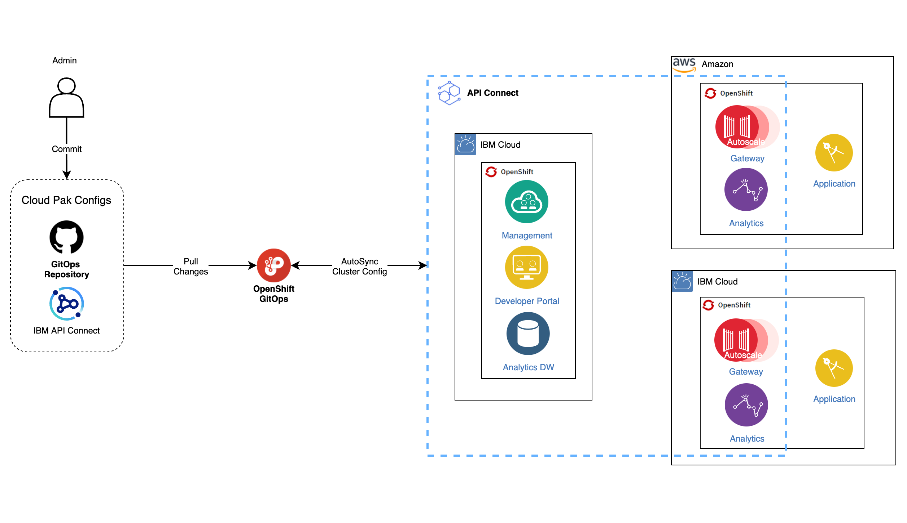{: style="max-height:900px"}


## Overview

In previous sections of this IBM API Connect Multi-Cluster tutorial you have seen how to create the Red Hat OpenShift clusters that will support your IBM API Connect multi-cluster use case, forked and cloned the GitHub GitOps repositories that will drive the GitOps processes to realize the implementation of your IBM API Connect multi-cluster use case and finally, in the last section, you have configured these GitOps repositories to reflect the specific architecture of your IBM API multi-cluster use case. Next step is to get the installation of your IBM API Connect multi-cluster use case done and for that you would just need to kickoff the GitOps processes you have already prepared by creating those bootstrap ArgoCD Applications you should be able to find in your `multi-tenancy-gitops` repository and `apic-multi-cluster` profile under `0-bootstrap/others`.

## Deploy the IBM API Connect Management and Portal components

You are ready to create the bootstrap ArgoCD Application that will kick off the GitOps process that will end up having the IBM API Connect Management and Portal components installed/deployed in your IBM API Connect Management and Portal cluster. However, you still need to complete a small task before being able to deploy any IBM Software in your Red Hat OpenShift cluster. And that is providing your IBM Entitlement Key to be able to pull IBM Software down from the IBM's Software registry.

The GitOps processes you have set up in the `multi-tenancy-gitops` repository would install/deploy any IBM Software in the **`tools`** Red Hat OpenShift project. Therefore, you must provide your IBM Entitlement Key in that Red Hat OpenShift project.

1. Ensure you are logged in to the cluster

    Start a terminal window and log into your OCP cluster, substituting the `--token` and `--server` parameters with your values:

    ```bash
    oc login --token=<token> --server=<server>
    ```

    If you are unsure of these values, click your user ID in the OpenShift web console and select "Copy Login Command".

    !!! warning
        Make sure you are logging into the IBM API Connect Management and Portal cluster

1. Create the `tools` Red Hat OpenShift project:

    ```bash
    oc new-project tools
    ```

1. Log in to [MyIBM Container Software Library](https://myibm.ibm.com/products-services/containerlibrary) with an IBMid and password associated with the entitled software.  
1. Select the **View library** option to verify your entitlement(s). 
1. Select the **Get entitlement key** to retrieve the key.
1. Create a secret containing your IBM Entitlement Key in the `tools` namespace. 

    ```bash
    oc create secret docker-registry ibm-entitlement-key -n tools \
    --docker-username=cp \
    --docker-password="<entitlement_key>" \
    --docker-server=cp.icr.io
    ```

1. Link that `docker-registry` secret containing your IBM Entitlement Key with the default secret for pulling Docker images within your Red Hat OpenShift project

    ```bash
    oc secrets link default ibm-entitlement-key --for=pull
    ```

Finally, you are all set to bootstrap the IBM API Connect Management and Portal cluster with the initial ArgoCD Application that will connect the ArgoCD instance that is running in the cluster that you deployed in the [Configure the clusters - GitOps repos & ArgoCD](configure-clusters-gitops.md) section and your `multi-tenancy-gitops` GitOps repository where you have defined, as code, what you want to get deployed in your Red Hat OpenShift cluster. This is what will bootstrap your GitOps processes.

1. Locate your GitOps repository

    If necessary, change to the root of your GitOps repository, which is typically
    `$HOME/git`.

    Issue the following command to change to your GitOps repository:

    ```bash
    cd $HOME/git
    cd multi-tenancy-gitops
    ```

1. Change directory to `0-bootstrap/others/apic-multi-cluster`
1. Apply the `bootstrap-management-portal-cluster.yaml` file:

    ```bash
    oc apply -f bootstrap-management-portal-cluster.yaml
    ```

If you go to your ArgoCD web console, you would now see ArgoCD Applications being created. These applications will be the responsible for watching over the different code in the GitOps repositories (mainly the `multi-tenancy-gitops` and `multi-tenancy-gitops-apps` repositories) and make sure that what is specified there gets created in your Red Hat OpenShift cluster.

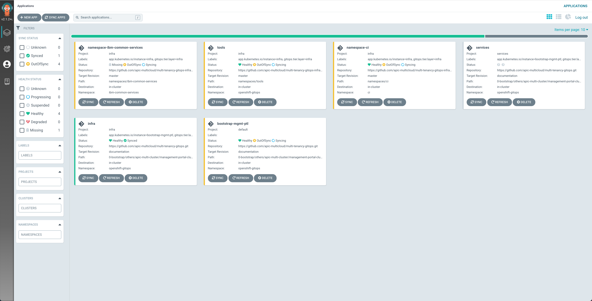{: style="max-height:1000px"}

If you go to your OpenShift web console under the `Operators --> Installed Operators` section on the left hand side of the menu, you should be able to see how the different operators that we have specified in the `multi-tenancy-gitops` GitOps repository to be deployed are starting to get deployed.

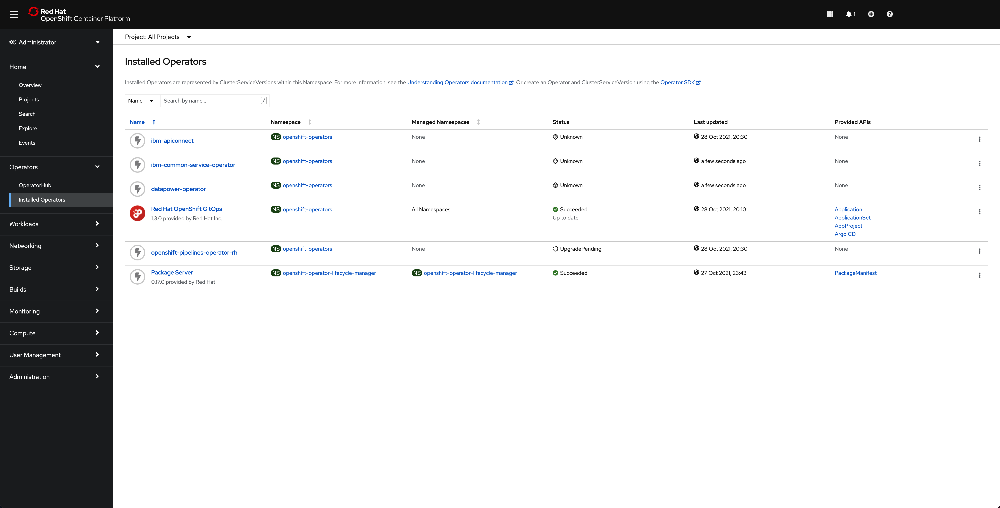{: style="max-height:1000px"}

!!! tip
    While the IBM API Connect Management and Portal components are getting deployed in this cluster, you can jump to the next section to start deploying the IBM API Connect Gateway and Portal components in their respective cluster(s)

After around 45 minutes, you can check that the ArgoCD web console now displays all the ArgoCD Applications in green

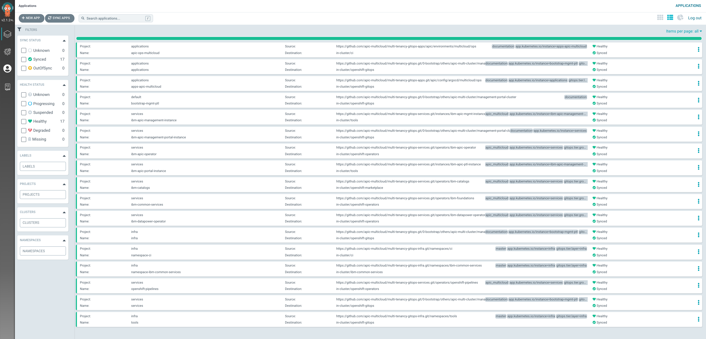{: style="max-height:1000px"}

the OpenShift web console shows that all of the operators have been successfully installed

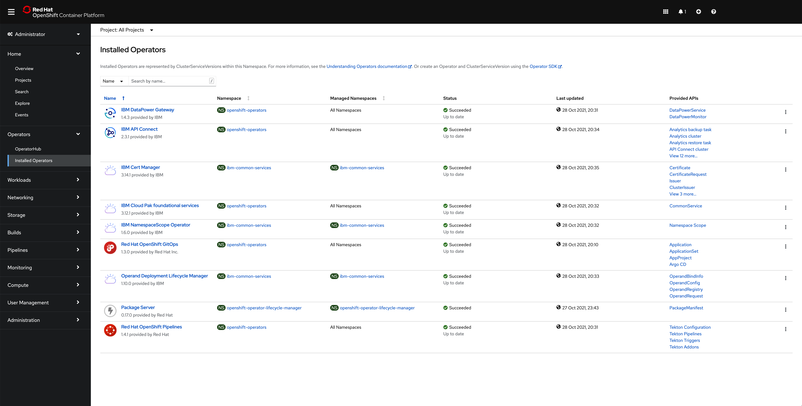{: style="max-height:1000px"}

and, finally, if you go under the `tools` namespace for the `Operators --> Installed Operators`, click on the `IBM API Connect` operator and click on the `All instances` tab, you should see that your `management` and `portal` are `Running`

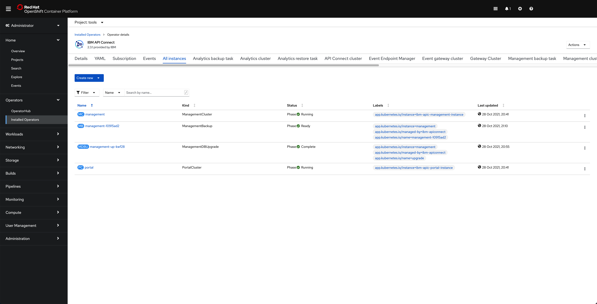{: style="max-height:1000px"}

## Deploy the IBM API Connect Gateway and Analytics components

Again, you are ready to create the bootstrap ArgoCD Application that will kick off the GitOps process that will end up having the IBM API Connect Gateway and Analytics components installed/deployed in your IBM API Connect Management and Portal cluster(s). However, again, you still need to complete a small task before being able to deploy any IBM Software in your Red Hat OpenShift cluster. And that is providing your IBM Entitlement Key to be able to pull IBM Software down from the IBM's Software registry.

The GitOps processes you have set up in the `multi-tenancy-gitops` repository would install/deploy any IBM Software in the **`tools`** Red Hat OpenShift project. Therefore, you must provide your IBM Entitlement Key in that Red Hat OpenShift project.

1. Ensure you are logged in to the cluster

    Start a terminal window and log into your OCP cluster, substituting the `--token` and `--server` parameters with your values:

    ```bash
    oc login --token=<token> --server=<server>
    ```

    If you are unsure of these values, click your user ID in the OpenShift web console and select "Copy Login Command".

    !!! warning
        Make sure you are logging into the IBM API Connect Gateway and Analytics cluster

2. Create the `tools` Red Hat OpenShift project:

    ```bash
    oc new-project tools
    ```

3. Log in to [MyIBM Container Software Library](https://myibm.ibm.com/products-services/containerlibrary) with an IBMid and password associated with the entitled software.  
4. Select the **View library** option to verify your entitlement(s). 
5. Select the **Get entitlement key** to retrieve the key.
6. Create a secret containing your IBM Entitlement Key in the `tools` namespace. 

    ```bash
    oc create secret docker-registry ibm-entitlement-key -n tools \
    --docker-username=cp \
    --docker-password="<entitlement_key>" \
    --docker-server=cp.icr.io
    ```

7. Link that `docker-registry` secret containing your IBM Entitlement Key with the default secret for pulling Docker images within your Red Hat OpenShift project

    ```bash
    oc secrets link default ibm-entitlement-key --for=pull


Finally, you are all set to bootstrap the IBM API Connect Gateway and Analytics cluster with the initial ArgoCD Application that will connect the ArgoCD instance that is running in the cluster that you deployed in the [Configure the clusters - GitOps repos & ArgoCD](configure-clusters-gitops.md) section and your `multi-tenancy-gitops` GitOps repository where you have defined, as code, what you want to get deployed in your Red Hat OpenShift cluster. This is what will bootstrap your GitOps processes.

1. Locate your GitOps repository

    If necessary, change to the root of your GitOps repository, which is typically
    `$HOME/git`.

    Issue the following command to change to your GitOps repository:

    ```bash
    cd $HOME/git
    cd multi-tenancy-gitops
    ```

1. Change directory to `0-bootstrap/others/apic-multi-cluster`
1. Apply the `bootstrap-<NAME>-gateway-analytics-cluster.yaml` file:

    ```bash
    oc apply -f bootstrap-<NAME>-gateway-analytics-cluster.yaml
    ```

    where `<NAME>` is the unique name for your IBM API Connect Gateway and Analytics cluster you created in the previous [Configure the clusters - Configure GitOps repos](configure-clusters-gitops-config.md) section.

If you go to your ArgoCD web console, you would now see ArgoCD Applications being created. These applications will be the responsible for watching over the different code in the GitOps repositories (mainly the `multi-tenancy-gitops` and `multi-tenancy-gitops-apps` repositories) and make sure that what is specified there gets created in your Red Hat OpenShift cluster.

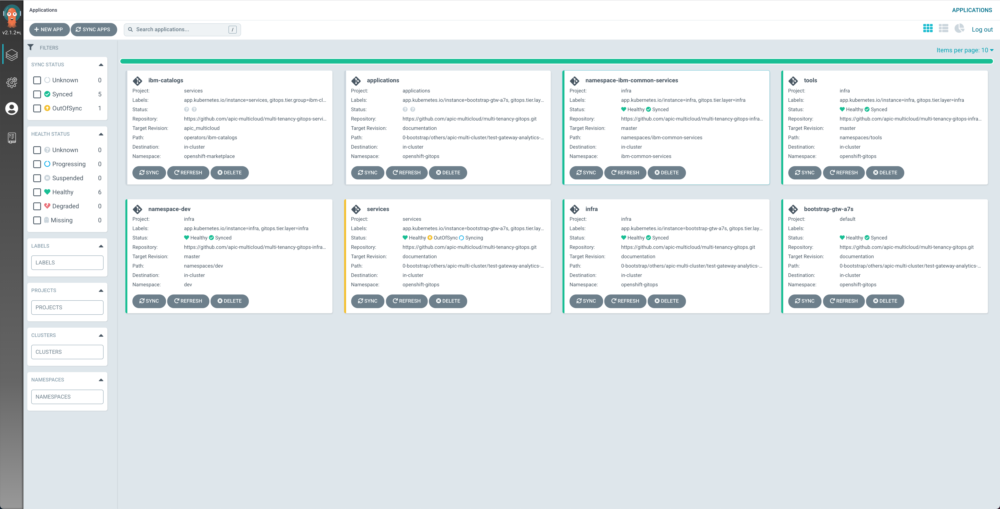{: style="max-height:1000px"}

If you go to your OpenShift web console under the `Operators --> Installed Operators` section on the left hand side of the menu, you should be able to see how the different operators that we have specified in the GitOps repository to be deployed are starting to get deployed.

{: style="max-height:1000px"}

After around 45 minutes, you can check that the ArgoCD web console now displays all the ArgoCD Applications in green (except one, the `apic-app-multicloud`. See below at the end of this subsection why)

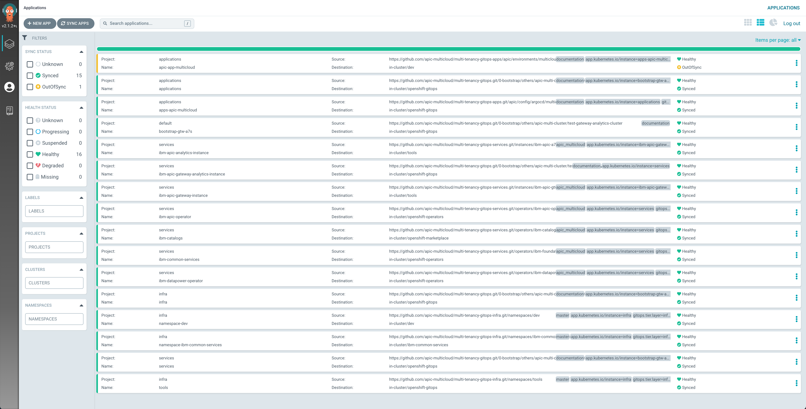{: style="max-height:1000px"}

the OpenShift web console shows that all of the operators have been successfully installed

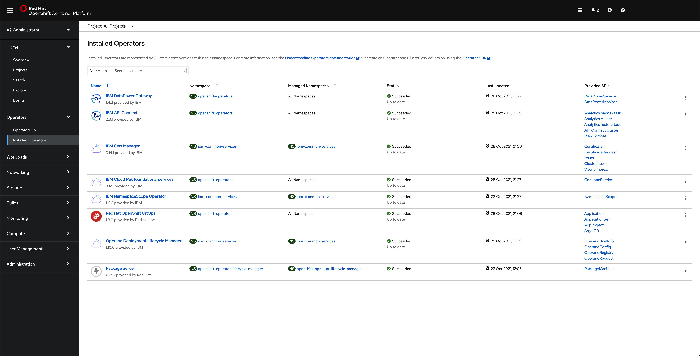{: style="max-height:1000px"}

and, finally, if you go under the `tools` namespace for the `Operators --> Installed Operators`, click on the `IBM API Connect` operator and click on the `All instances` tab, you should see that your `gateway` and `analytics` are `Running`

{: style="max-height:1000px"}

!!! warning
    You **must repeat** this `Deploy the IBM API Connect Gateway and Analytics components` for each of the IBM API Connect Gateway and Analytics clusters you created in your `apic-multi-cluster` profile in your `multi-tenancy-gitops` repository.

### Why an ArgoCD Application is out of sync

The reason why the `apic-app-multicloud` ArgoCD Application is in `OutOfSync` state at first is because this is intended. If you check that ArgoCD Application definition which is in the `multi-tenancy-gitops-apps` repository under `apic/config/argocd/multi-cluster/app` you will see the following:

```yaml hl_lines="18"
apiVersion: argoproj.io/v1alpha1
kind: Application
metadata:
  name: apic-app-multicloud
  annotations:
    argocd.argoproj.io/sync-wave: "300"
  finalizers:
    - resources-finalizer.argocd.argoproj.io
spec:
  destination:
    namespace: dev
    server: https://kubernetes.default.svc
  project: applications
  source:
    path: apic/environments/multi-cluster/app
    repoURL: ${GIT_BASEURL}/${GIT_ORG}/${GIT_GITOPS_APPLICATIONS}
    targetRevision: ${GIT_GITOPS_APPLICATIONS_BRANCH}
  syncPolicy: {}
  ignoreDifferences:
  - group: apps
    kind: DeploymentConfig
    jsonPointers:
    - /spec/containers/image
    - /spec/containers/terminationMessagePath
    - /spec/containers/terminationMessagePolicy
```

You can see in line number 18 that this ArgoCD Application has not been configured to automatically get synchronised. So if you go into that ArgoCD Application from the ArgoCD web console, you will see all the resources this ArgoCD is meant to watch are also in `OutOfSync` state.

{: style="max-height:1000px"}

And the reason for this is that we are using `BuildConfig` and `DeploymentConfig` resources which will collide with ArgoCD in the sense that these resource would auto-generate certain tags and values for the resulting yaml files which ArgoCD does not expect. This is not a bug. It is just that these two type of resources are not made to be watched and managed by GitOps application such as ArgoCD since these will generate attributes, properties and even other resources that ArgoCD will not expect.

As a result, the auto-sync has been disabled for this ArgoCD Application as you could see in its definition above. However, you want to have whatever resources this ArgoCD Application is meant to watch and managed deployed in your cluster. The resources that this ArgoCD Application is meant to deploy is the dummy application you will use at the end of the tutorial to verify that the requests to a certain IBM API Connect cluster do, in fact, reach the dummy application running on that same Red Hat OpenShift cluster.

In your ArgoCD web console, **for each of the IBM API Connect Gateway and Analytics clusters**, go into the `apic-app-multicloud` ArgoCD Application and click on the `SYNC` button at the top:

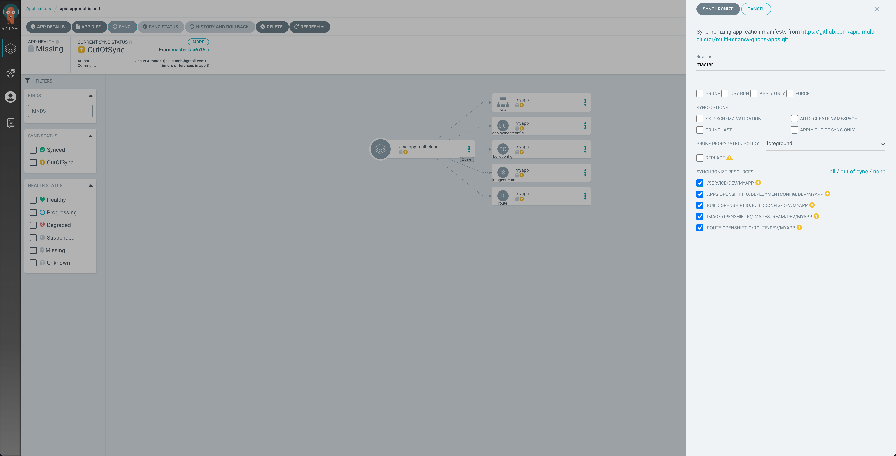{: style="max-height:1000px"}

You should see, as already said, all the resources this ArgoCD Application is meant to watch and manage and deploy in the first place as a result in `OutOfSync` state. On the sync menu that will hover from the right, make sure all the resources are checked and then click on `SYNCHRONIZE` at the top.

After some time, you should see all the resources created and in green except from the `DeploymentConfig` because of what has already been explained above:

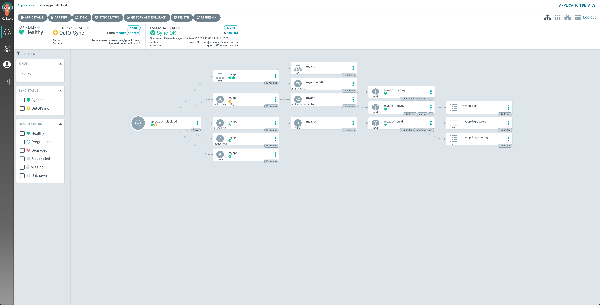{: style="max-height:1000px"}

You can click on that resource and then on the `DIFF` option for the manifest to see what is not matching.

{: style="max-height:1000px"}

## IBM API Connect Cloud Manager

Now, let's make sure that our API Connect Cluster is up and running. For doing that, we are going to make sure that we can open and access the IBM API Connect Cloud Manager web console.

1. In your Red Hat OpenShift we console, go to `Networking` --> `Routes` under the `tools` project and click on the `Location` value for the  `management-admin` route.

    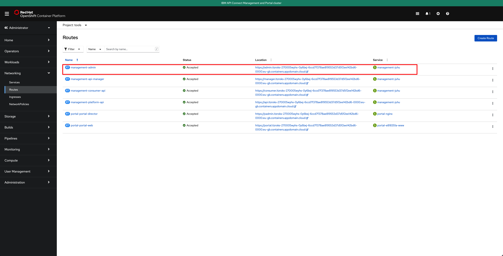{: style="max-height:1000px"}

    That should bring you to the IBM API Connect Cloud Manager web console login page.

    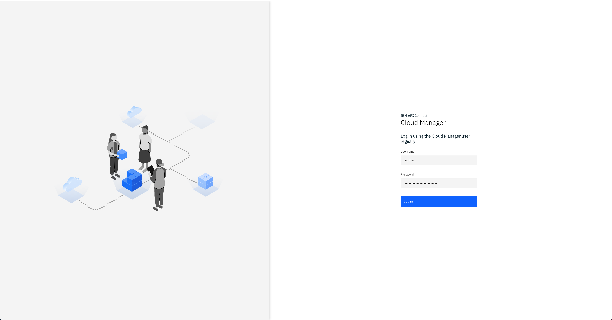{: style="max-height:1000px"}

1. Log into the IBM API Connect Cloud Manager web console by using `admin` as the username and getting it's password with the following command

    ```
    oc get secret `oc get secrets -n prod | grep management-admin-credentials | awk '{print $1}'` -n prod -o jsonpath='{.data.password}' | base64 -D
    ```

    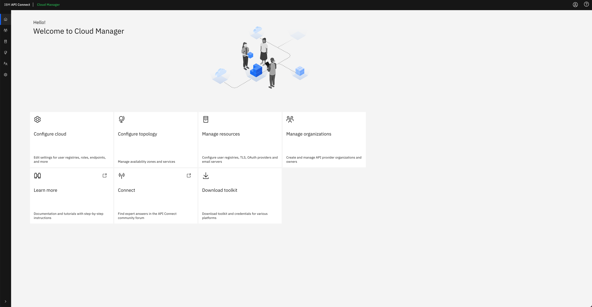{: style="max-height:1000px"}

1. Finally, click on the `Configure Topology` option presented in the IBM API Connect Cloud Manager web console. You should see that there is no topology configured at all.

    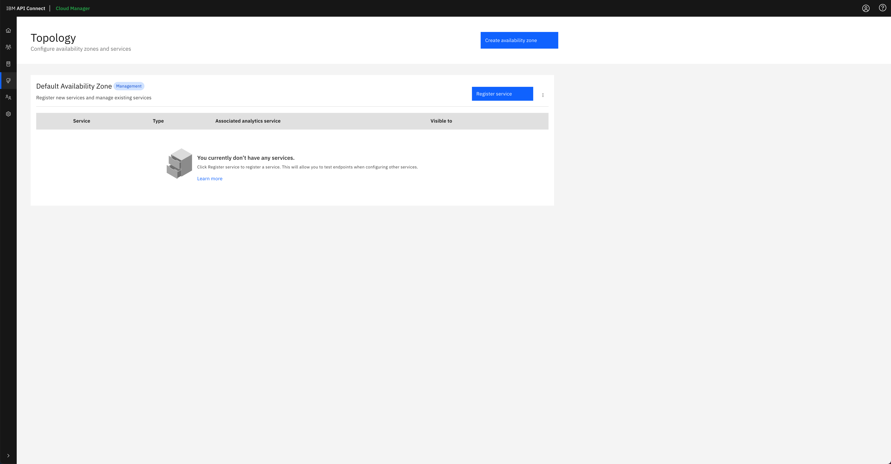{: style="max-height:1000px"}

You can follow the [IBM API Connect Cloud Manager configuration checklist](https://www.ibm.com/docs/en/api-connect/10.0.x?topic=environment-cloud-manager-configuration-checklist) documentation to manually proceed with the tasks you need to accomplish to get your IBM API Connect cluster ready to be used or you can go to the next section in this chapter where you will create an OpenShift Pipeline that gets your recently deployed IBM API Connect instance configured so that you can start working with it right away.

!!! success "Congratulations!"
    You have successfully installed the IBM API Connect Management and Portal components and the IBM API Connect Gateway and Analytics components in their respective clusters achieving an IBM API Connect Multi-cluster scenario.
