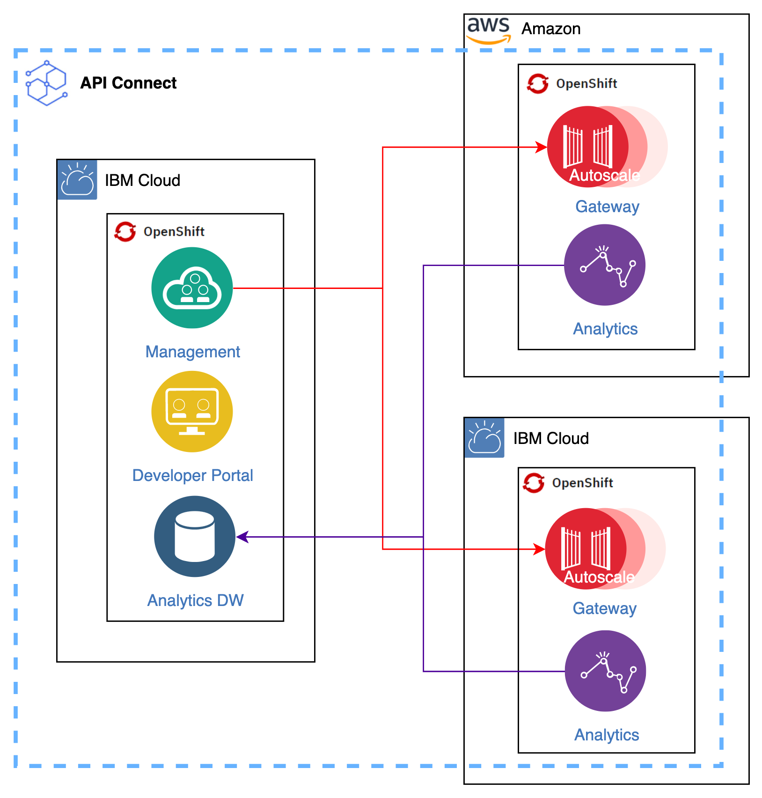

# IBM API Connect Multi-Cluster - Overview

<!--- cSpell:ignore APIC multicluster -->

!!! abstract
    This document introduces the IBM API Connect Multi-Cluster use case.

[{: style="max-height:700px"}](https://app.diagrams.net/#Hcloud-native-toolkit%2Fmulti-tenancy-gitops%2Fmaster%2Fdoc%2Fdiagrams%2FAPIC-Multi-cluster-Arch.drawio)

!!! tip
    <a href="https://raw.githubusercontent.com/cloud-native-toolkit/multi-tenancy-gitops/master/doc/diagrams/APIC-Multi-cluster-Arch.drawio" download>Right-click here and select "Save Link As" to download the DrawIO file</a> used to generate these diagrams or [open the diagram using diagrams.net](https://app.diagrams.net/#Hcloud-native-toolkit%2Fmulti-tenancy-gitops%2Fmaster%2Fdoc%2Fdiagrams%2FAPIC-Multi-cluster-Arch.drawio)

## Video Description and Demonstration

The implementation details in this video may have changed from when it was created in early November 2021. The architectural description and design remain the same. Please follow the instructions in the Tutorial section when implementing this solution.

<iframe width="560" height="315" src="https://www.youtube.com/embed/rZxqkteAmFk" title="YouTube video player" frameborder="0" allow="accelerometer; autoplay; clipboard-write; encrypted-media; gyroscope; picture-in-picture" allowfullscreen></iframe>

## Overview

The IBM API Connect Multi-Cluster scenario tries to provide a more real world client scenario where the client's IT landscape looks more like a hybrid multi-cloud landscape rather than a single cloud single cluster landscape. As a result of this, we would like to test the ability of API Connect to provide a central API management and security solution to the disperse scenario where client's applications are spread across multiple clusters on that hybrid multi-cloud scenario. We assume that Red Hat OpenShift Container Platform is the standard platform across that hybrid multi-cloud scenario.

As you can see in the picture, the IBM API Connect Multi-Cluster architecture that we propose is that where the different IBM API Connect subsystems will be deployed in several and separate clusters according to the needs of these clusters. That is, we will have the IBM API Connect Management and Portal subsystems running together on a cluster, which will be considered the control plane cluster since the Management and Portal components of IBM API Connect could be considered as the brain of IBM API Connect. Then, the IBM API Connect Gateway and Analytics components will be deployed to all of those other clusters where applications run, so that their APIs are exposed and secured through the IBM API Connect Gateway component while the IBM API Connect Analytics component, which is deployed alongside, gathers all the analytics related to that IBM API Connect Gateway component for monitoring and further analysis. Both the IBM API Connect Gateway and Analytics components will be managed from the control plane cluster. That is, from the IBM API Connect Management and Portal components. From there, we will be able to publish new APIs to the appropriate gateways as well as receive and consolidate the analytics data sent back from the associated IBM API Connect Analytics component (the data that the IBM API Connect Analytics component gathers from the IBM API Connect Gateway component it is associated with can be forwarded/sent to a third party system. You can read more [here](https://www.ibm.com/docs/en/api-connect/10.0.x?topic=topology-planning-offload-data-third-party-system) but it is out of the scope of this document).

!!! warning "Recommendation"
    We strongly recommend to first go through the single cluster IBM API Connect deployment tutorial before doing the multi-cluster use case. For that, go to the single cluster IBM API Connect deployment [Overview section](../overview/overview.md).