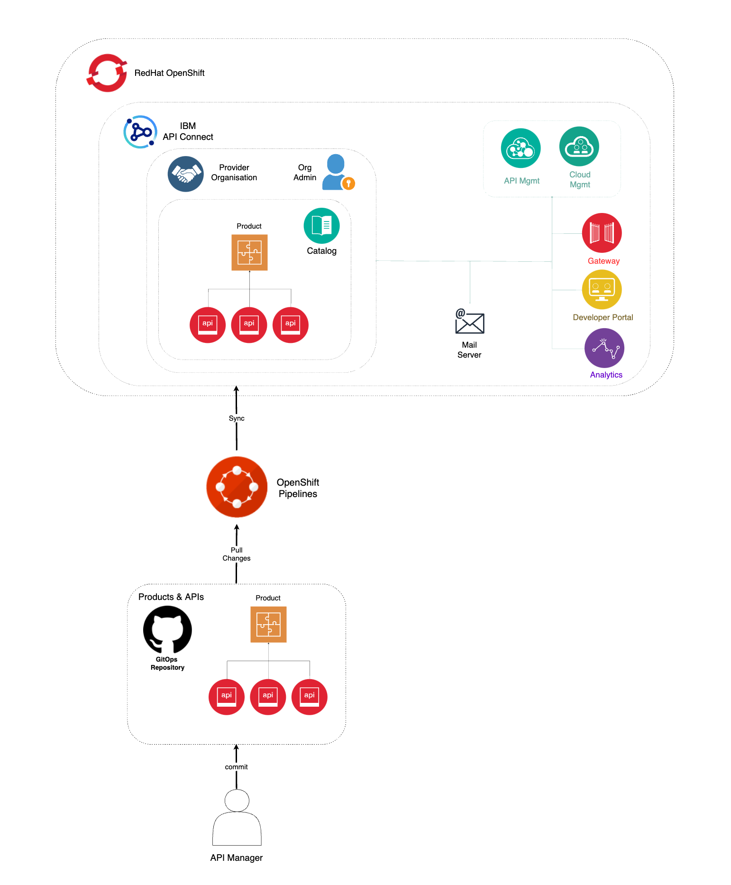
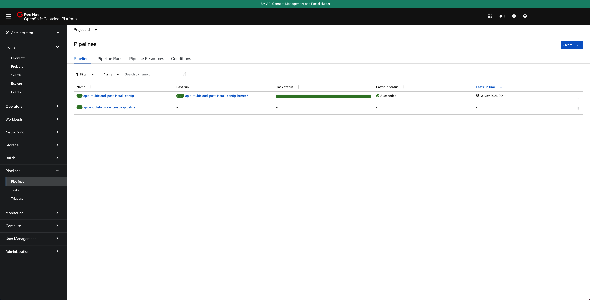
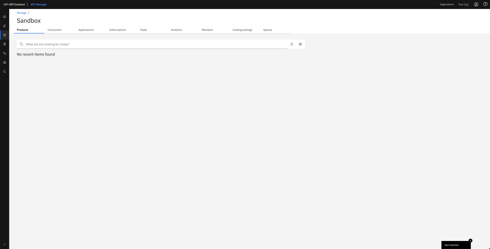
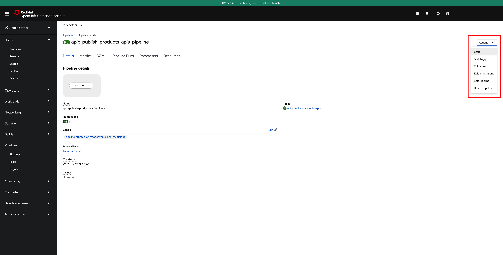
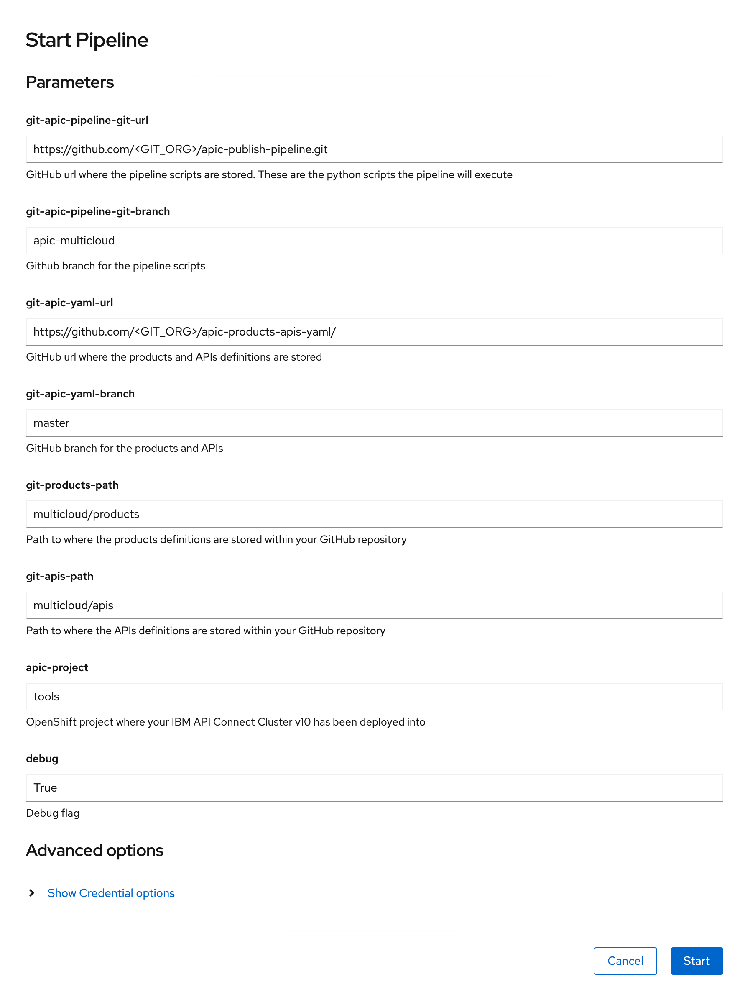
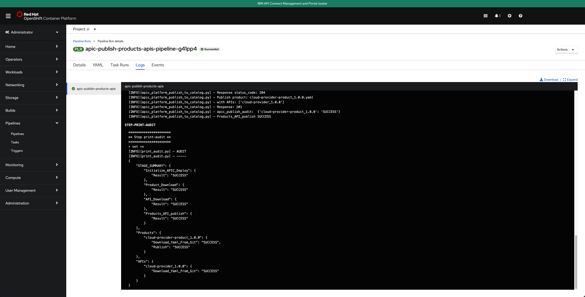
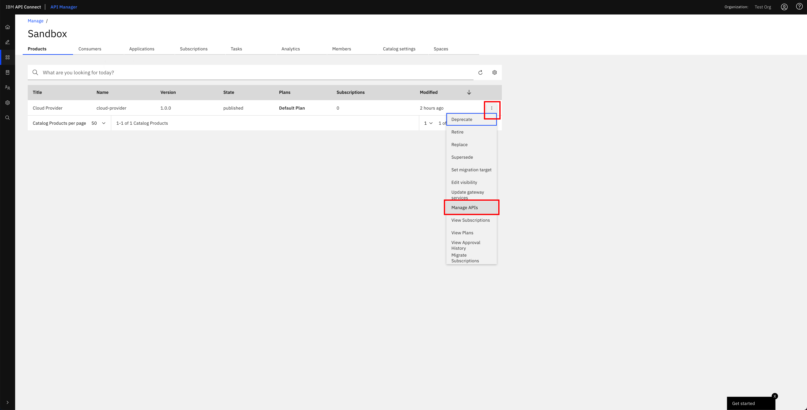
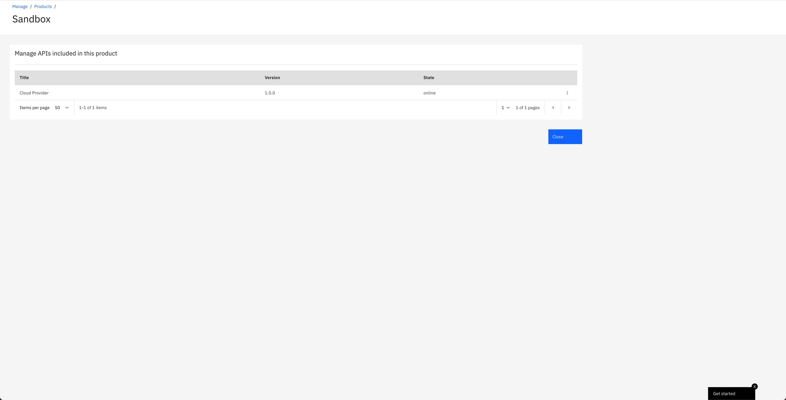
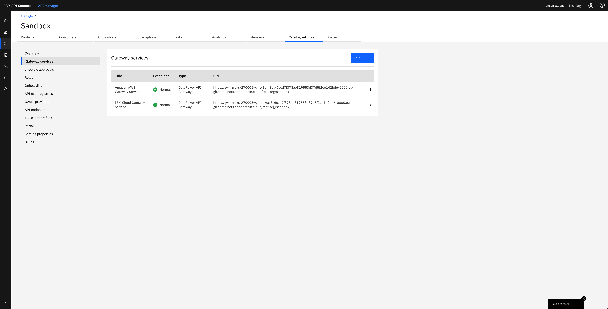
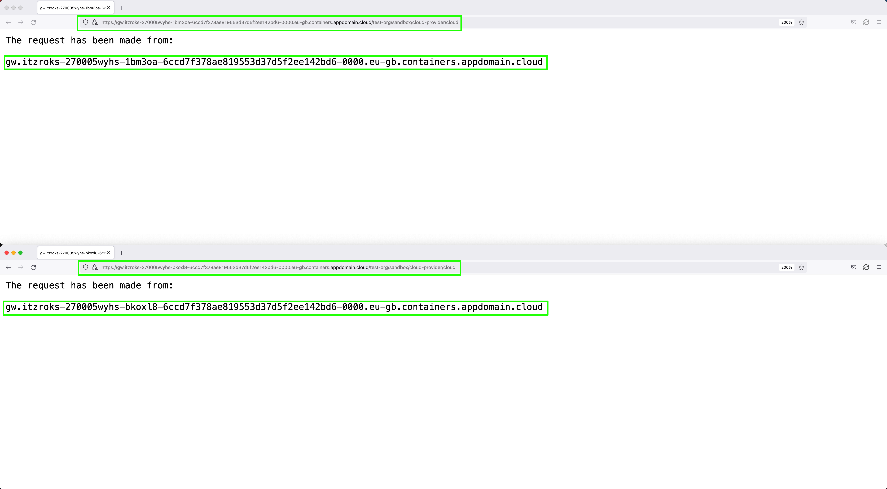

# IBM API Connect Multi-Cluster - Publish APIs

<!--- cSpell:ignore APIC multicloud -->

## Overview

You have reached the last section of this IBM API Connect Multi-Cluster in-depth tutorial. By now, you should have a working IBM API Connect multi-cluster instance that spans across multiple cluster, each of which could be either on premise or in a cloud provider or multiple cloud providers as long as it sits on Red Hat OpenShift, which is the main piece that allow you to really be hybrid multi-cloud. Hence, by going through this tutorial you should have learnt how to deploy IBM API Connect in a hybrid multi-cloud landscape using GitOps!.

However, there is one last step to be taken. If you remember in the first place, the goal of deploying IBM API Connect was to be able to securely expose your application APIs through the IBM API Connect Gateway component, be able to gather analytics on those API requests through the IBM API Connect Analytics component and have all your application APIs published, socialized and managed from a central solution that is IBM API Connect in itself. And, of course, you would want to have this process as much automated as possible which is what the recommendation for a production environment is. And remember that this tutorial, and the Cloud Pak Production Deployment Guides in fact, is all about best practices and recommendations as far as how to deploy and manage IBM Software in production on Red Hat OpenShift.

The IBM API Connect citizens you would want to work with in this section are products and APIs. Products are a logical grouping of APIs and Plans. The Catalog is where API Publishing and Consumption is handled and a Catalog has a one to one relationship with a Portal Site. An API Product is staged to a Catalog, published to the Portal site and then API consumers can begin subscribing and making API calls. Catalogs provide isolated API run-time environments within a Provider Organization. If you remember from the previous [Configure APIC](config-pipeline.md) section where you ran IBM API Connect Configuration OpenShift Pipeline to get your recently deployed IBM API Connect multi-cluster instance configured, you got a Provider Organization created and a default `Sandbox` catalog created in it. As a result, you should be ready to publish APIs into products and publish those products into your catalog, which would make those application APIs accessible through your IBM API Connect Gateway components. For more information about IBM API Connect terminology and logical architecture, we strongly recommend you read the [IBM API Connect v10.x Deployment WhitePaper](https://community.ibm.com/community/user/integration/viewdocument/api-connect-deplyoment-whitepaper-v) written by Chris Phillips.


{: style="max-height:1000px"}

In this section then, you will be looking at the second of the OpenShift Pipelines your `multi-tenancy-gitops` repository created for you. This IBM API Connect Publish Products and APIs OpenShift Pipeline automates the process for getting products and APIs, which are stored as code in GitHub, and publish those to your IBM API Connect multi-cluster instance. Hence, if any change is delivered to those product and APIs definitions in GitHub, the IBM API Connect Publish Products and APIs OpenShift Pipeline will make sure those changes are applied to your IBM API Connect multi-cluster instance providing a sort of GitOps approach to managing your products and APIs. More specifically, your IBM API Connect Publish Products and APIs OpenShift Pipeline will:

1. Download and process product definitions.
2. Download corresponding API definitions for the products.
3. Publish products and APIs to catalog.

## OpenShift pipeline

The OpenShift Pipeline just introduced above has been created in your IBM API Connect Management and Portal Red Hat OpenShift custer. If you go to `Pipelines --> Pipelines` on the left hand side menu of your Red Hat OpenShift web console under the `ci` Project, you will see two OpenShift pipelines have been created as a result of what you had specified in your GitOps repositories:

{: style="max-height:800px"}

!!! info
    The pipeline you are interested in for getting your instance of IBM API Connect configured is called **apic-publish-products-apis-pipeline**

!!! warning "Important"
    Make sure you have read that previous [Configure APIC](config-pipeline.md) section to better understand where this pipeline comes from within your GitOps repositories, how it is created and the GitHub repositories behind it. More importantly, make sure you have forked the pipelines repositories into your own GitHub organization and created your GitHub Personal Access Token as explained in the `OpenShift pipeline` subsection of that previous section.

## Products and APIs definitions

The GitHub repository that will store those products and APIs you want your IBM API Connect Publish Products and APIs OpenShift Pipeline to work with is <https://github.com/cloud-native-toolkit/apic-products-apis-yaml>, which you should have already forked into your GitHub organization. If you inspect that repository under the `multicloud` folder, you will see the following API that exposes your dummy application running on your IBM API Connect Gateway and Analytics clusters and the product it will be part of, both of which will get published through your IBM API Connect Publish Products and APIs OpenShift Pipeline:

```text
apic-products-apis-yaml/multicloud
├── apis
│   └── cloud-provider_1.0.0.yaml
└── products
    └── cloud-provider-product_1.0.0.yaml
```

You can inspect both files for better understanding if you would like to.

## Run the IBM API Connect Configuration pipeline

Before you execute your IBM API Connect Publish Products and APIs OpenShift Pipeline, let's first have a look at the `Sandbox` default catalog that was created when the IBM API Connect Configuration OpenShift Pipeline from the previous section created your Provider Organization is actually empty. You can check your catalog from your IBM API Connect API Manager:

{: style="max-height:800px"}

!!! tip
    You can open your IBM API Connect API Manager through your Red Hat OpenShift web console. Go to `Networking --> Routes` under the tools project and click on the `Location` value for the `management-api-manager` route. Then, use the credentials you specified in your provider organization configuration to log in.

Click on the `apic-publish-products-apis-pipeline`. Then, click on `Start` on the `Actions` drop down menu at the top right corner.

{: style="max-height:800px"}

On the `Start Pipeline` OpenShift Pipeline configuration menu that pops up, make sure you provide the appropriate values for the following pipeline parameters:

* `git-apic-pipeline-git-url` which is the GitHub url where the pipeline scripts are stored. These are the scripts the pipeline will execute. This is the GitHub repository your forked into your GitHub organization in the previous [Configure APIC](config-pipeline.md) section.
* `git-apic-yaml-url` which is the GitHub url where the products and APIs definitions you want the pipeline to work with are stored. Once again, you should have forked this repository into your GitHub organization in the previous [Configure APIC](config-pipeline.md) section.

{: style="max-height:1000px"}

Click `Start`. This will create a `Pipeline Run` object that represents this specific execution of the pipeline. You can follow along the execution of this OpenShift Pipeline Run by clicking the `Logs` tab at the top bar. If this execution of the IBM API Connect configuration pipeline finishes successfully you should see `SUCCESSFUL` messages at the bottom of the logs as well as a green check mark on the task the Pipeline Run has executed on the left hand side:

{: style="max-height:800px"}

If you switch back to the `Details` tab of the `Pipeline Run`, you should also see green check marks both at the Pipeline Run name at the top and below it in the task that has been executed by this Pipeline Run that is displayed on the `Pipeline Run Details` section:

{: style="max-height:800px"}

And in the main `Pipelines` section of your OpenShift web console you should also see the last `Pipeline Run` for the IBM API Connect config Pipeline in green:

{: style="max-height:800px"}

If you go to your IBM API Connect API Manager and check your default `Sandbox` catalog, you should now see your just published `Cloud Provider` product.

{: style="max-height:1000px"}

If you click on the menu icon at the right hand side of your `Cloud Provider` product, a drop down menu should display. On that menu, click on `Manage APIs`:

{: style="max-height:1000px"}

You should see the `Cloud Provider` API that the dummy application running on your IBM API Connect Gateway and Analytics clusters exposes:

{: style="max-height:1000px"}

## Check your API

You have finally set up all the pieces you needed to:

1. Deploy IBM API Connect in a multi-cluster scenario where you will use the IBM API Connect Gateway components to securely expose your applications APIs, as well as some other automation tools (such as the Red Hat OpenShift Pipeline operator) and an application for testing the whole scenario.
2. You have done so following GitOps methodology as you would want to have for production environments.
4. You have leveraged IBM API Connect Cloud Manager Administration APIs and Red Hat OpenShift Pipelines to build automation around configuring your IBM API Connect multi-cluster instance with all the components you have created such profile with.
5. You have leveraged IBM API Connect API Manager APIs and Red Hat OpenShift Pipelines to build automation to manage your applications APIs and the products these will belong to from their definitions stored in GitHub.

As a result, you are now all set to take that last step which is to test if you can access your application's API through the IBM API Connect Gateway. To do so, go to your IBM API Connect API Manager, click on `Manage catalogs`, then click on the default `Sandbox` catalog and click on the `Catalog settings` tab. Then, click on the `Gateway services` section on the left hand side to find out your IBM API Connect Gateway services and their URLs:

{: style="max-height:800px"}

Use the `URL` of your Gateway services to point your browser to `http://<your_gateway_url>/cloud-provider/cloud` and see if you can access the dummy application running on those IBM API Connect Gateway and Analytics clusters whose API should give you back which IBM API Connect Gateway your request has been made from:

{: style="max-height:800px"}

You have tested that your dummy application's API can be accessed through the IBM API Connect Gateway service that fronts it thanks to having successfully published and exposed such API on your successfully deployed and configured IBM API Connect multi-cluster instance.

!!! success "Congratulations!"
    You have successfully completed the in-depth tutorial for IBM API Connect Multi-Cluster use case. We strongly recommend you check out the other in-depth tutorials from the left hand side menu of this Cloud Pak Production Deployment Guides. Thank you.