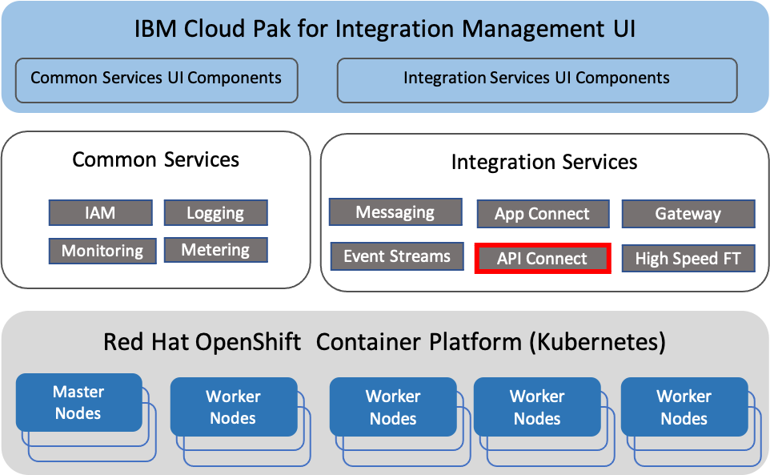
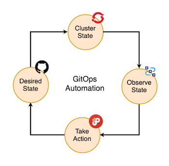

# API Connect

<!--- cSpell:ignore APIC unmanaged practioners Pak Paks Quickstart qube cntk autoplay allowfullscreen -->

## Overview
IBM Cloud Pak for Integration (CP4I) deploys and manages instances of Integration Services running on OpenShift Kubernetes infrastructure.
CP4I high level architecture is shown below

{: style="max-height:500px"}

Individual CP4I capabilities such as API Connect are deployed individually as needed to satisfy each integration use-case.
All components of CP4I can be combined in any way as required and are deployed 100% as containers.
Each capability is deployed and managed by a corresponding operator.

CP4I also provides an optional Platform Navigator, an over-arching Management UI layer that provides a common UI experience for various installed integration capabilities.
Platform Navigator is not required to deploy individual CP4I capabilities, as each integration capability can be deployed independently leveraging its cloud native deployment operators.

In addition, CP4I includes a set of foundational services, previously known as Common Services. Foundational services scope has been rapidly evolving. 
For example, it used to be a vehicle to provide out-of-the-box monitoring and logging capabilities for Cloud Pak components. However, as  
as OpenShift itself has started to provide facilities for workload monitoring, these functions of Foundational services have been deprecated.
Currently, foundational services mostly are focused on identity and access management for Platform Navigator UI, single sign-on experience for UI, license metering

CP4I integration capabilities are shown as side by side as there is little direct dependency of CP4I integration capabilities on foundational services, but 
in typical CP4I installation foundational services are automatically installed if CP4I license is used, to fully support Cloud Pak experience.

In this guide, we will provide IBM point of view, best practices and recommendations for how a production ready IBM API Connect deployment should be, focusing on the use of GitOps as the core methodology for deploying and managing IBM capabilities such as IBM API Connect in production. 

{: style="max-height:500px"}

The guide is structured as a tutorial, and it is recommended that you follow the topics in order by following the table of contents from top to bottom. Whether you're a beginner or expert in IBM API Connect and Kubernetes, you are recommended to complete the guide in order. There is an intuitive Table of Contents, and Next and Previous links at the bottom of each page to help you navigate.

For other more theoretical and complex IBM API Connect production readiness topics such as high availability, disaster recovery, security, etc you can head over to the [Production Reference section](../../../../overview/overview.md) of this Cloud Pak Production Deployment Guides.

At the end of this tutorial, there is a section on how to carry out an IBM API Connect multi-cluster deployment. However, we do encourage to first complete the in-depth IBM API Connect single-cluster deployment.