# IBM API Connect publish APIs pipeline on IBM Cloud

<!--- cSpell:ignore APIC multicloud clust -->

## Overview

You have reached the last section of this IBM API Connect Cluster in-depth tutorial. By now, you should have a working IBM API Connect Cluster instance on IBM Cloud that sits on the Red Hat OpenShift Kubernetes Service. However, there is one last step to be taken. If you remember in the first place, the goal of deploying IBM API Connect was to be able to securely expose your application APIs through the IBM API Connect Gateway component, be able to gather analytics on those API requests through the IBM API Connect Analytics component and have all your application APIs published, socialized and managed from a central solution that is IBM API Connect in itself. And, of course, you would want to have this process as much automated as possible which is what the recommendation for a production environment is. And remember that this tutorial, and the Cloud Pak Production Deployment Guides in fact, is all about best practices and recommendations as far as how to deploy and manage IBM Software in production on Red Hat OpenShift.

The IBM API Connect citizens you would want to work with in this section are products and APIs. Products are a logical grouping of APIs and Plans. The Catalog is where API Publishing and Consumption is handled and a Catalog has a one to one relationship with a Portal Site. An API Product is staged to a Catalog, published to the Portal site and then API consumers can begin subscribing and making API calls. Catalogs provide isolated API run-time environments within a Provider Organization. If you remember from the previous [Configure APIC](../configuration/ibm-cloud.md) section where you ran the IBM API Connect Configuration OpenShift Pipeline to get your recently deployed IBM API Connect Cluster instance configured, you got a Provider Organization created and a default `Sandbox` catalog created in it. As a result, you should be ready to publish APIs into products and publish those products into your catalog, which would make those application APIs accessible through your IBM API Connect Gateway component. For more information about IBM API Connect terminology and logical architecture, we strongly recommend you read the [IBM API Connect v10.x Deployment WhitePaper](https://community.ibm.com/community/user/integration/viewdocument/api-connect-deplyoment-whitepaper-v) written by Chris Phillips.


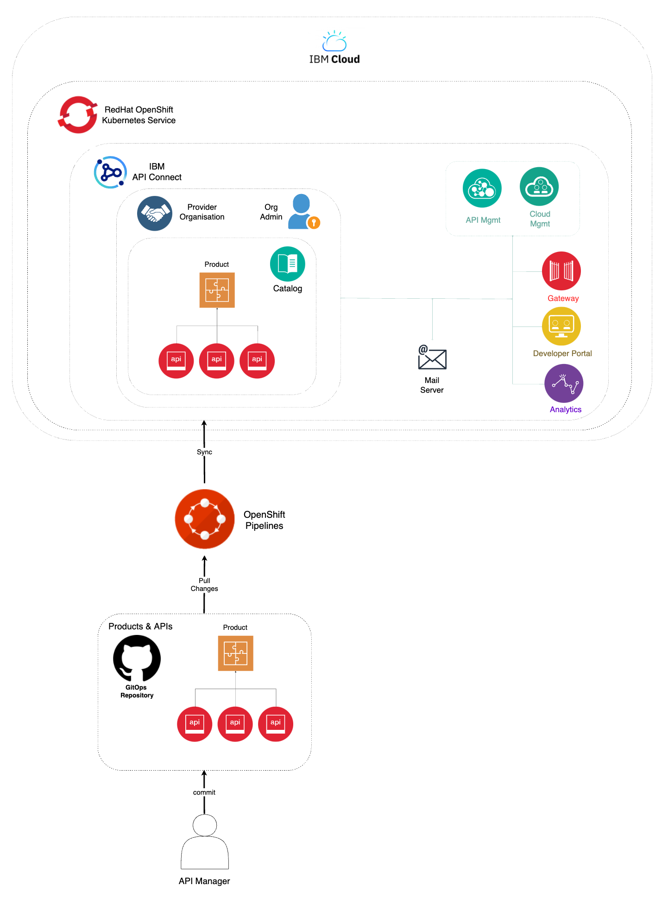{: style="max-height:1200px"}

In this section then, you will be looking at the second of the OpenShift Pipelines your `multi-tenancy-gitops` repository created for you. This IBM API Connect Publish Products and APIs OpenShift Pipeline automates the process for getting products and APIs, which are stored as code in GitHub, and publish those to your IBM API Connect Cluster instance. Hence, if any change is delivered to those product and APIs definitions in GitHub, the IBM API Connect Publish Products and APIs OpenShift Pipeline will make sure those changes are applied to your IBM API Connect Cluster instance providing a sort of GitOps approach to managing your products and APIs. More specifically, your IBM API Connect Publish Products and APIs OpenShift Pipeline will:

1. Download and process product definitions.
2. Download corresponding API definitions for the products.
3. Publish products and APIs to catalog.

## OpenShift pipeline

The OpenShift Pipeline just introduced above has been created in your Red Hat OpenShift custer. If you go to `Pipelines --> Pipelines` on the left hand side menu of your Red Hat OpenShift web console under the `ci` Project, you will see two OpenShift pipelines have been created as a result of what you had specified in your GitOps repositories:

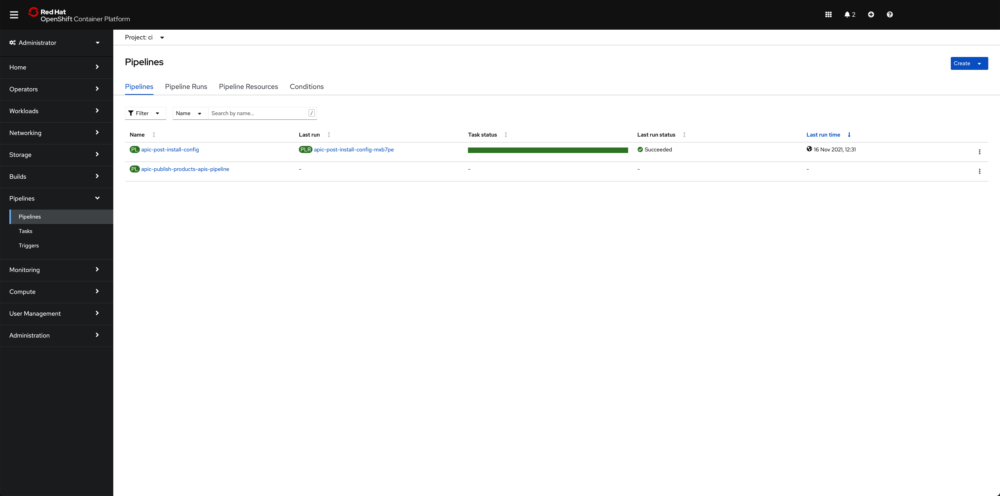{: style="max-height:1000px"}

!!! info
    The pipeline you are interested in for getting your instance of IBM API Connect configured is called **apic-publish-products-apis-pipeline**

!!! warning "Important"
    Make sure you have read that previous [Configure APIC](../configuration/ibm-cloud.md) section to better understand where this pipeline comes from within your GitOps repositories, how it is created and the GitHub repositories behind it. More importantly, make sure you have forked the pipelines repositories into your own GitHub organization and created your GitHub Personal Access Token as explained in the `OpenShift pipeline` subsection of that previous section.

## Products and APIs definitions

The GitHub repository that will store those products and APIs you want your IBM API Connect Publish Products and APIs OpenShift Pipeline to work with is <https://github.com/cloud-native-toolkit/apic-products-apis-yaml>, which you should have already forked into your GitHub organization. If you inspect that repository under the `Demo` folder, you will see the following APIs and products you would want to get published through your IBM API Connect Publish Products and APIs OpenShift Pipeline:

```text
apic-products-apis-yaml/Demo
├── APIs
│   ├── account-consent-open-banking-standard_1.0.0.yaml
│   ├── corporate-multi-payment-online_1.0.0.yaml
│   ├── retail-single-payment-open-banking_1.0.0.yaml
│   ├── retrieve-account-details-open-banking-standard_1.0.0.yaml
│   ├── retrieve-balance-details-open-banking-standard_1.0.0.yaml
│   └── retrieve-transaction-details-open-banking-standard_1.0.0.yaml
└── Products
    ├── accounts-open-banking-standard_1.0.0.yaml
    ├── corp-multi-payment-online-open-banking-standard_1.0.0.yaml
    └── retail-single-payment-open-banking-standard_1.0.0.yaml
```

You can inspect those files for better understanding if you would like to.

## Run the IBM API Connect Configuration pipeline

Before you execute your IBM API Connect Publish Products and APIs OpenShift Pipeline, let's first have a look at the `Sandbox` default catalog that was created when the IBM API Connect Configuration OpenShift Pipeline from the previous section created your Provider Organization is actually empty. You can check your catalog from your IBM API Connect API Manager:

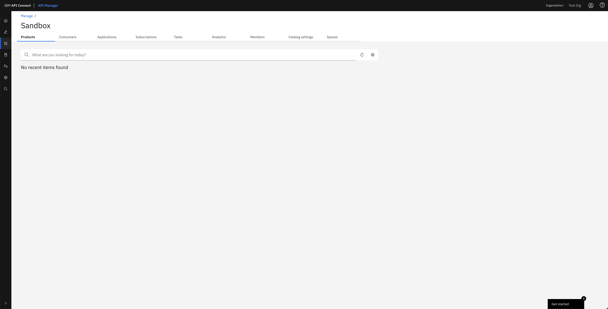{: style="max-height:800px"}

!!! tip
    You can open your IBM API Connect API Manager through your Red Hat OpenShift web console. Go to `Networking --> Routes` under the tools project and click on the `Location` value for the `apic-clust-xxxxx-api-manager` route. Then, use the credentials you specified in your provider organization configuration to log in.

Click on the `apic-publish-products-apis-pipeline`. Then, click on `Start` on the `Actions` drop down menu at the top right corner.

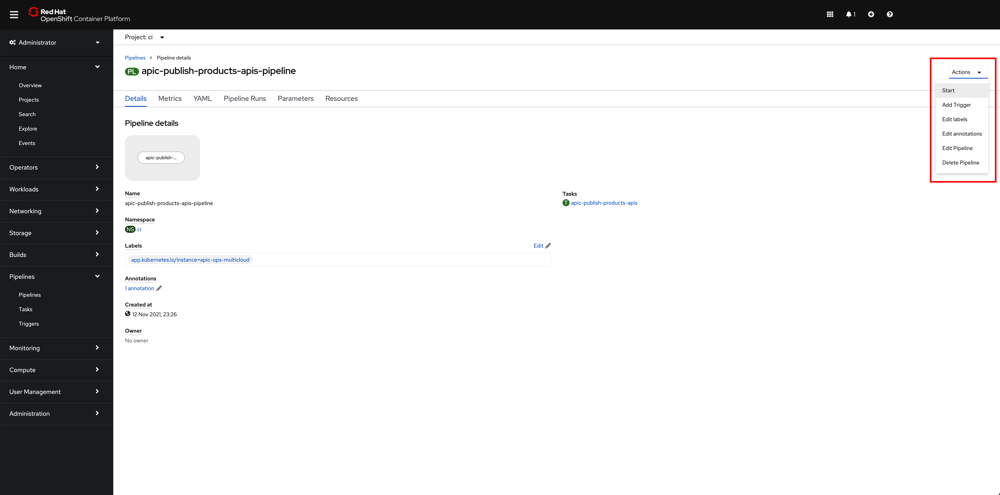{: style="max-height:800px"}

On the `Start Pipeline` OpenShift Pipeline configuration menu that pops up, make sure you provide the appropriate values for the following pipeline parameters:

* `git-apic-pipeline-git-url` which is the GitHub url where the pipeline scripts are stored. These are the scripts the pipeline will execute. This is the GitHub repository your forked into your GitHub organization in the previous [Configure APIC](../configuration/ibm-cloud.md) section.
* `git-apic-yaml-url` which is the GitHub url where the products and APIs definitions you want the pipeline to work with are stored. Once again, you should have forked this repository into your GitHub organization in the previous [Configure APIC](../configuration/ibm-cloud.md) section.

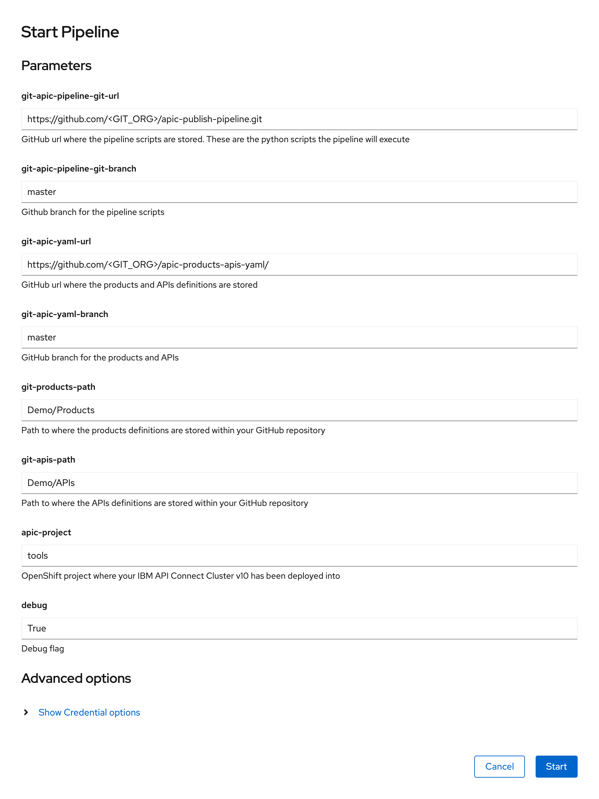{: style="max-height:1000px"}

Click `Start`. This will create a `Pipeline Run` object that represents this specific execution of the pipeline. You can follow along the execution of this OpenShift Pipeline Run by clicking the `Logs` tab at the top bar. If this execution of the IBM API Connect configuration pipeline finishes successfully you should see `SUCCESS` messages at the bottom of the logs as well as a green check mark on the task the Pipeline Run has executed on the left hand side:

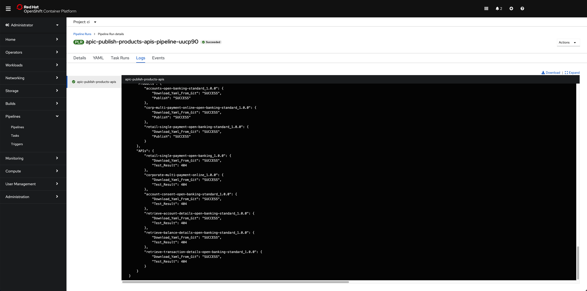{: style="max-height:800px"}

!!! info
    Do not worry about seeing `"Test result": 404` messages since this is expected. We are publishing APIs that do not point to any running application.

If you switch back to the `Details` tab of the `Pipeline Run`, you should also see green check marks both at the Pipeline Run name at the top and below it in the task that has been executed by this Pipeline Run that is displayed on the `Pipeline Run Details` section:

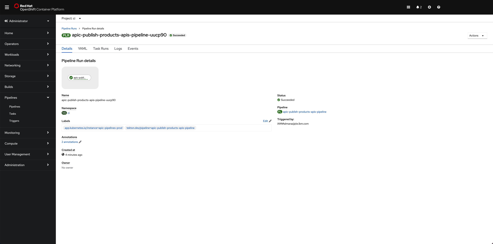{: style="max-height:800px"}

And in the main `Pipelines` section of your OpenShift web console you should also see the last `Pipeline Run` for the IBM API Connect config Pipeline in green:

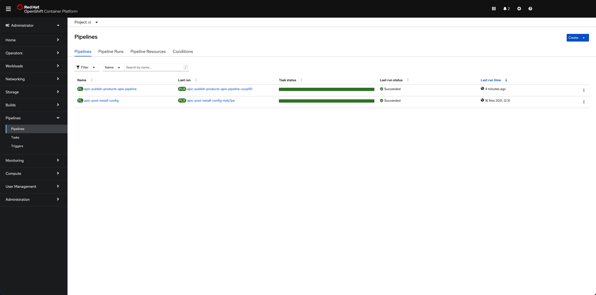{: style="max-height:800px"}

If you go to your IBM API Connect API Manager and check your default `Sandbox` catalog, you should now see your just published `Cloud Provider` product.

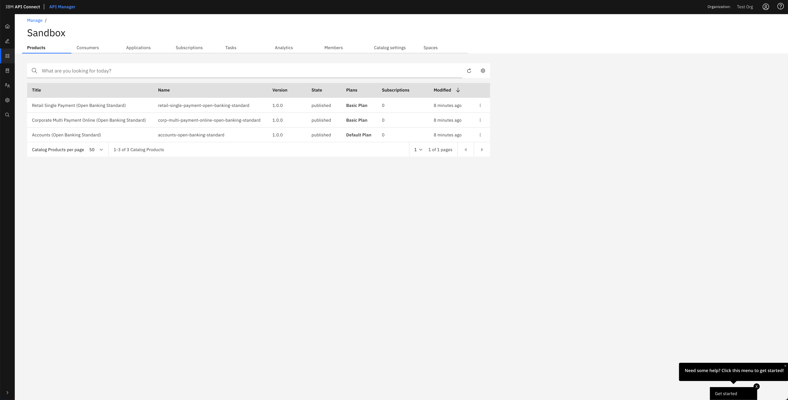{: style="max-height:1000px"}

If you click on the menu icon at the right hand side of any of your products, a drop down menu should display. On that menu, click on `Manage APIs`:

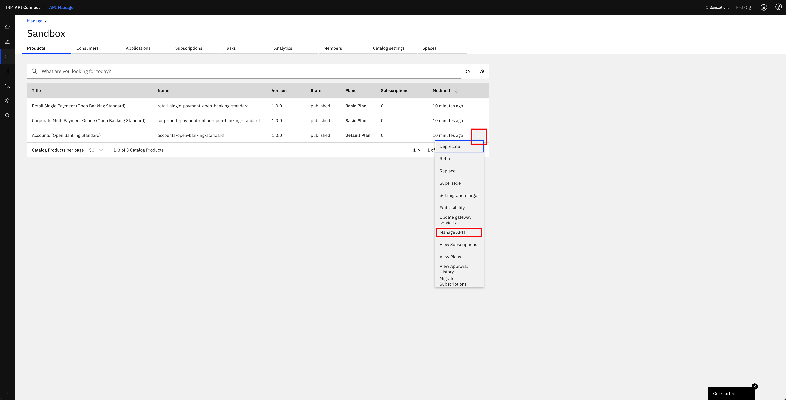{: style="max-height:1000px"}

You should see the different APIs that have been configured to be part of that product that your IBM API Connect Gateway component will expose:

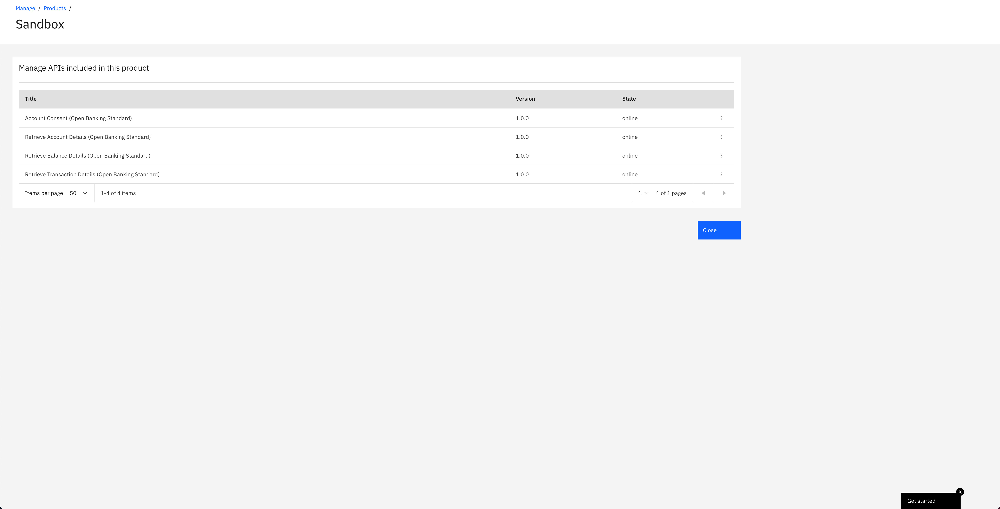{: style="max-height:1000px"}

!!! success "Congratulations!"
    You have successfully completed the in-depth tutorial for IBM API Connect Cluster use case. We strongly recommend you check out the other in-depth tutorials from the left hand side menu of this Cloud Pak Production Deployment Guides, specially the IBM API Connect Multi-Cluster use case. Thank you.