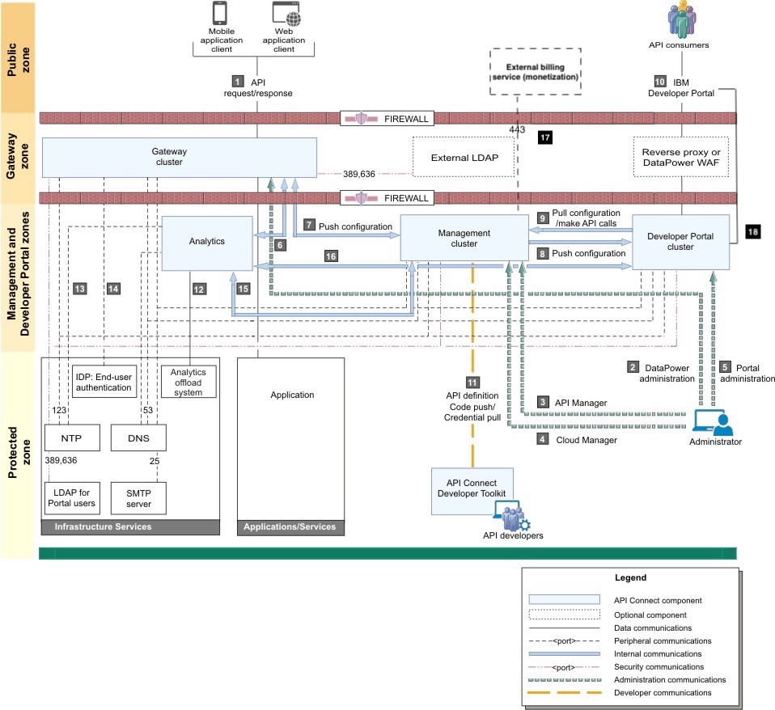

# IBM API Connect Security on OpenShift

<!--- cSpell:ignore qube cntk autoplay allowfullscreen -->

!!! abstract
    This document describes the security aspects and components in making your IBM API Connect deployment and the APIs it manages and exposes secure.

## Overview

The following network diagram example helps to explain the different communication channels that exist within your IBM API Connect channels taking into account the most common topology where each of those components might be deployed to (as far as the various zones, both public and private, in a network).

{: style="max-height:1000px"} 
	
|  | Usage description |
|-:|-------------------|
| 1 | API request/response – Users invoking the provided APIs |
| 2 |	DataPower® administration – Internal operators who are managing the Gateway servers |
| 3 |	API Manager – Internal business users who are defining and monitoring APIs |
| 4 |	Cloud Manager – Internal operators who are administering the Cloud |
| 5 |	Developer Portal administration – Internal operators who are managing the Portal servers |
| 6 |	Gateway servers post traffic to Analytics service |
| 7 |	Push configuration – Management servers communicate bi-directionally with Gateway servers |
| 8 |	Push configuration/webhooks – Management servers push configuration and webhooks to the Developer Portal |
| 9 |	Pull configuration/make API calls – Developer Portal servers pull configuration and call REST APIs |
| 10 | Developer Portal – External developers who are accessing the Developer Portal |
| 11 | Push API definition to Management server. Pick up credential for microservice code push |
| 12 | Analytics offload |
| 13 | Analytics accesses NTP |
| 14 | Analytics access DNS |
| 15 | Management service queries Analytics service |
| 16 | The Portal service invokes an API (GET) on the Analytics service to retrieve data |
| 17 | External billing service – Management cluster connecting to external billing service (when configured for billing) |
| 18 | Developer Portal cluster must be able to access its own site endpoints |

You can read more about the IBM API Connect endpoints [here](https://www.ibm.com/docs/en/api-connect/10.0.x?topic=deployment-overview-endpoints-certificates) as well as the firewall requirements [here](https://www.ibm.com/docs/en/api-connect/10.0.x?topic=deployment-firewall-requirements-kubernetes).

## Certificates

IBM API Connect allows you to provide existing custom certificates that you already own, for example DigiCert certificates, or generate new custom certificates using a package such as the [Kubernetes Cert Manager](https://cert-manager.io/v1.1-docs/), which gets installed as a component of the IBM Cloud Pak Foundational Services, off a Certificate Authority that you provide.

Here is a [**list of the certificates**](https://www.ibm.com/docs/en/api-connect/10.0.x?topic=kubernetes-custom-certificates-reference) required for each of the IBM API Connect subsystems (as well as the internal certificates used within those subsystems) to interact with each other on a secure manner using mutual TLS (mTLS).

!!! info "Important"
    It is important that you understand, for each of the IBM API Connect subsystems, what endpoints and their respective certificates must be signed by the same Certificate Authority as their counterpart endpoint certificate for the IBM API Connect subsystems they want to establish secure mTLS communication with. Basically, if you want to establish secure mTLS communication between two IBM API Connect subsystems (or systems in general), these subsystems endpoints' certificates need to be signed by the same Certificate Authority (or a public Certificate Authority) so that the signature for the counterpart endpoints' certificates can be verified at both sides of the communication channel. More detail on mTLS [here](https://www.cloudflare.com/es-es/learning/access-management/what-is-mutual-tls/).

Here is the official [IBM API Connect Certificates in a Kubernetes environment documentation](https://www.ibm.com/docs/en/api-connect/10.0.x?topic=deployment-certificates-in-kubernetes-environment) which explains how to configure the IBM API Connect subsystems to either use existing custom certificates that the client already own or generate new custom certificates, either using the Kubernetes Cert Manager (whether you provide an existing custom Certificate Authority that the client already own or creating a new self-signed Certificate Authority) or letting the IBM API Connect Operator create those certificates. 

!!! tip
    For deploying IBM API Connect on OpenShift in production it is highly recommended that either the client provides their own existing custom certificates or they provide their own existing Certificate Authority and let the Kubernetes Cert Manager to manage the required certificates by the different IBM API Connect subsystems.

## Managing authentication and security

Secure Cloud Manager and API Manager as well as your Catalogs with a user registry. Secure your APIs with OAuth. Create TLS profiles to ensure that information you share among web servers will not be stolen or tampered with.

As Cloud Administrator or Topology Administrator (or with a custom role that contains the `Settings:Manage` permission), you can configure the following authentication and security mechanisms:

* User registries to authenticate users of Cloud Manager and API Manager and of your Catalogs and APIs.
* OAuth providers to provide protection for APIs.
* TLS profiles to secure transmission of data through the Gateway to external web sites and among web servers.

Find the official IBM API Connect documentation for managing authentication and security [**here**](https://www.ibm.com/docs/en/api-connect/10.0.x?topic=environment-managing-authentication-security).

!!! warning "Important"
    API Connect includes several default TLS profiles to help you get started working with the application. The default profiles should not be used in a production environment. It is important to create your own profiles to ensure a secure network.

Also, find more information about the different IBM API Connect user roles for the Cloud Manager, API Manager and Developer Portal [here](https://www.ibm.com/docs/en/api-connect/10.0.x?topic=overview-api-connect-user-roles) and how to administer members and roles [here](https://www.ibm.com/docs/en/api-connect/10.0.x?topic=environment-administering-members-roles).

<!-- 

## Endpoints and certificates

https://www.ibm.com/docs/en/api-connect/10.0.x?topic=deployment-overview-endpoints-certificates

## Firewall requirements

https://www.ibm.com/docs/en/api-connect/10.0.x?topic=deployment-firewall-requirements-kubernetes

## Certificates in kubernetes

https://www.ibm.com/docs/en/api-connect/10.0.x?topic=deployment-certificates-in-kubernetes-environment

  ### Custom certificates on Kubernetes

  https://www.ibm.com/docs/en/api-connect/10.0.x?topic=environment-custom-certificates-kubernetes

  ### Custom certificates reference
  
  https://www.ibm.com/docs/en/api-connect/10.0.x?topic=kubernetes-custom-certificates-reference

## Managing authentication and security

Secure Cloud Manager and API Manager as well as your Catalogs with a user registry. Secure your APIs with OAuth. Create TLS profiles to ensure that information you share among web servers will not be stolen or tampered with.

As Cloud Administrator or Topology Administrator (or with a custom role that contains the Settings:Manage permission), you can configure the following authentication and security mechanisms:
* User registries to authenticate users of Cloud Manager and API Manager and of your Catalogs and APIs. (add this link for -> https://www.ibm.com/docs/en/api-connect/10.0.x?topic=settings-configuring-timeouts-access-tokens-refresh-tokens)
* OAuth providers to provide protection for APIs.
* TLS profiles to secure transmission of data through the Gateway to external web sites and among web servers.

You 
https://www.ibm.com/docs/en/api-connect/10.0.x?topic=environment-managing-authentication-security

## Users and roles for Cloud Manager, API Manager, Developer Portal

who does what?
https://www.ibm.com/docs/en/api-connect/10.0.x?topic=concepts-who-does-what-in-api-connect

Also, use Chris Philips whitepaper personas section

Applying roles and permissions in UI

https://www.ibm.com/docs/en/api-connect/10.0.x?topic=overview-api-connect-user-roles

Roles for the cloud manager

https://www.ibm.com/docs/en/api-connect/10.0.x?topic=environment-administering-members-roles

## Securing APIs

https://www.ibm.com/docs/en/api-connect/10.0.x?topic=SSMNED_v10cd/com.ibm.apic.toolkit.doc/tapim_sec_api_config_scheme_create_basic.html

https://www.ibm.com/docs/en/api-connect/10.0.x?topic=security-oauth-provider-overview -->