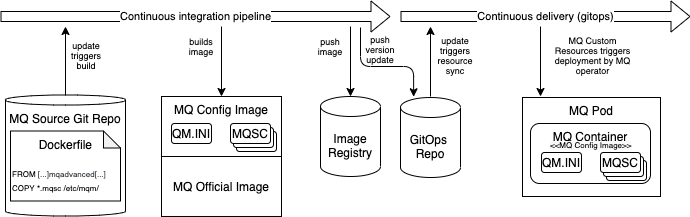
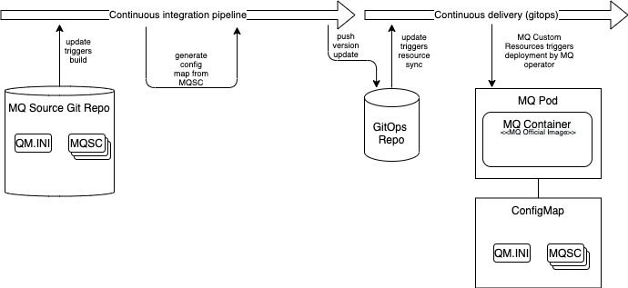

# AD01 - Baking vs Frying

<!--- cSpell:ignore  pipelinerun mqsc msqc runmqsc dockerconfigjson queuemanager QMID podman ibmgaragecloud cntk cnkt eventid gitrevision gitrepositoryurl odowdaibm MQSC replicaset eventlistener triggerbinding triggertemplate mqcicd qmgr Artifactory configmaps OIDC CHLAUTH templating sealedsecret jmeter -->

[< Back to architecture decision registry](index.md)

## MQ - Baking vs Frying

***
|  **Subject Area:**      |
|-------------------------|
|    Build                |

***
### Issue or Problem Statement

Baking and Frying are terms used to describe the process of deploying a software component and it's configuration in a controlled fashion.

In the context of MQ Containers, we define the terms as:

* Baking: Extension of the official MQ image for the purpose of embedding configuration or adding third party binaries.  Baking happens at build time.
* Frying: Addition of configuration at deployment time using a `ConfigMap`.

It is important to denote the fact that an MQ server is a stateful component.  Once the initial instance of a queue manager is deployed the `MQSC` configuration is processed and stored in the underlying persistent volume.  For subsequent deployment, the Queue Manager will already exists and so any modification to the `MQSC` instruction should take it into considerations.  Tests should cover this scenario and ensure that the configuration achieves the desired outcome.  

The remainder of this architecture decision focusses primarily on the MQ configuration and ignore the scenario where binaries need to be added (see **Givens & Assumptions**).

Should organization create custom images with MQ config or should that configuration be injected at deployment time?

***
### Givens & Assumptions

* **Given** - Where required third-party binaries are always baked into a custom image.
* **Given** - MQ tests must verify that the queue manager can upgraded from the previous version.
* **Assumption** - Deployment is automated and controlled using a gitops approach.

***
### Motivation

Either option explored in this architecture decision are equally technically viable.  However, the choice made here has a direct impact on:
* the design of the CI/CD pipeline,
* the testing strategy,
* local development testing.

As such, it is critical that organization make a conscious choice and understand it's implication.

***

### Alternatives

#### 1. Bake the MQ configuration
In this option, all MQ configuration is added to  a custom image during the build phase.
In order to enable the pipeline to properly test the upgrade from the previous version, a proper [SemVer](https://semver.org/) standard must be adopted.  The pipeline can then deploy the current version and then upgrade to the new one, validating that the configuration remains valid.

  
  
**Considerations**:  
\+ Queue Manager can be tested with a basic docker engine.  
\+ No need to pull additional GitHub branch/releases.  
\+ Simple to deploy the Queue Manager on a local dev environment.  
\+ Image version makes it easier to assess if multiple instance share the same configuration.  
\- Slower CI process due to the image creation.  
\- Image registry contains multiple image versions.  
\- MQ Upgrades require a rebuilding of every custom images.  
\- Risk of version specified by MQ CR being out of sync with custom image.  

#### 2. Fry the complete MQ configuration
In this option, there is no need to build custom images.  The build phase, takes the `MQSC` configuration and adds it to a `ConfigMap` which gets pushed to the GitOps repository.  During the continuous integration, the system needs to have access to the current and new Queue Manager configuration.  The CI pipeline can access this information either through GitHub branch/release pull or through an existing environment.  It then pulls the current ConfigMap, deploys a Queue Manager instance and then apply the new ConfigMap, validating that the configuration remains valid.
  
  
  
**Considerations**:  
\+ Faster CI process since no need to push images every time.  
\+ MQ Upgrades can be fully controlled by the Operators.  
\- Cannot be tested locally using Docker without some manipulation.  
\- Added complexity due to the need to pull the current version in addition to the new configuration.  
\- Local dev testing requires access to an OpenShift cluster or a local deployment of CRC.  

#### 3. Bake the common MQ configuration, fry the rest  
This is an hybrid approach combining the two previous options. In this scenario, the common configuration shared across all queue manager is baked into an Enterprise image. From that point, every Queue Manager deployed is based off the Enterprise image and all configuration unique to a queue manager is fried.

**Considerations**:  
\+ Ensure consistency of common config across all queue managers  
\+ Provides a control point to manage MQ versions the Enterprise supports  
Includes all the pro's and con's from the Option 2.  

***

### Justification
N/A

### Implications
N/A

| Derived requirements |
|----------------------|
| N/A                  |

| Related decisions    |
|----------------------|
|  N/A                 |