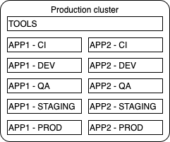
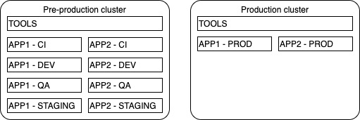
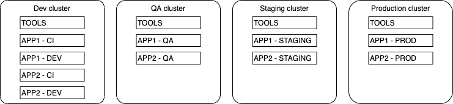
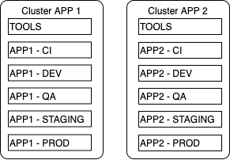
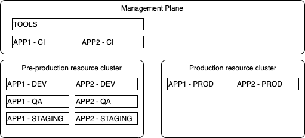

# AD02 - Clusters design

<!--- cSpell:ignore  pipelinerun mqsc msqc runmqsc dockerconfigjson queuemanager QMID podman ibmgaragecloud cntk cnkt eventid gitrevision gitrepositoryurl odowdaibm MQSC replicaset eventlistener triggerbinding triggertemplate mqcicd qmgr Artifactory configmaps OIDC CHLAUTH templating sealedsecret jmeter -->

[< Back to architecture decision registry](index.md)

## Clusters design

***
|  **Subject Area:**      |
|-------------------------|
|    Infra                |

***
### Issue or Problem Statement  
  
This architecture decision focuses on the boundaries of production and non-production environments.  In traditional data centers, resources such as compute, storage, and network are partitioned into different hardware or zone to minimize the chance that workloads impact each other. This approach has also been useful to enforce segregation of duties between various stakeholders.
  
In the context of OpenShift, partitioning can happen at the level of clusters or projects and namespace.  A project can be assigned a quota on resources allocated and furthermore, the RBAC model can ensure that only a specific set of users can access resources contained within the project.  
  
For an on-premise data center, an OpenShift cluster offers a great opportunity to increase workload density. Workload density means running more workloads on a same set of compute. This is achieved thanks to the workload scheduler which will allocate workloads where capacity exists and where it meets the requirement stated by the deployment descriptor of your application.  

By avoiding the proliferation of master nodes (via discrete clusters), more nodes can be dedicated to run business workloads, helping reduce operational costs and improve the density.

However, from a cloud provider perspective, this argument is not always true.  Since some cloud provider do not charge for their master nodes, the cost and density arguments goes away. 

Finally, in planning the cluster and project strategy, there is the considerations of cluster level operations like OpenShift upgrades.  Consolidating workloads on a single cluster, implicitly means that cluster upgrades become a riskier operation.   

In that context, what is the better option when it comes to managing and partitioning Dev, QA, Staging, Production environment?  
  
***
### Givens & Assumptions
  
  * **Given** The decision focusses only on the cloud-native application.   
  * **Given** Organization may decide to specialize clusters for a specific function (ie. Power System with GPU for AI). The considerations for this approach falls outside the scope of this decision.  
  * **Given** Segregation of duty is achieved in a similar fashion no matter which option is selected: User are assigned roles that allows them to access a subset of namespaces within the cluster.  
  * **Assumption** Additional sandbox clusters can be temporarily provision to assess new OpenShift versions.  

***
### Motivation

This architecture decision is critical as it can have a significant impact on costs, risks, operational complexity.  It also has direct implication on the deployment process.  

***

### Alternatives  
  
**NOTE 1:** The alternatives listed below could be combined together. For example, it is possible to combine option 3 (pre-prod/prod) with option 4 (cluster per app) to achieve a model with a pre-prod and a production cluster per application. Similar considerations would apply to the presented alternatives, so they are not included here.  
** NOTE 2:** In the diagrams across the various alternatives, the "TOOLS" refer to the Cloud Native Toolkit tools.  
  
#### 1. Single cluster for all environments
  
Because all environments and applications are hosted on the same cluster, we rely on namespace naming convention to include a prefix or suffix that indicates the type of environment they host.  Each application and services may have more then one namespace, but they should all have the prefix/suffix attached to the namespace. The implication of this standardization is that any reference from a component in one namespace to a different namespace will need to be configurable.  
This option leads to higher workload density since all applications and environment are hosted on the same cluster, however you should be mindful of the tested [capacity limit](https://docs.openshift.com/container-platform/4.7/scalability_and_performance/planning-your-environment-according-to-object-maximums.html).  
From a cluster upgrade perspective, it does require temporary sandbox to test new versions and organization adopting this approach need to take a "fix-forward" approach to their cluster management, since once the patch is applied, it can be impossible to return to previous state.  
  
  
  
**NOTE:** While this option is included here from a completeness perspective. We do not advocate such a strategy given the inherent risks.   
  
**Considerations**:  
\+ Great for workload density.  
\+ Simplify the cluster management day-to-day tasks.  
\- Significant operational risks during cluster maintenance.  
\- Cluster outages takes out all environment and applications.  
\- Production workload segregation needs to be carefully planned.  
\- Cluster sizing must take into account tested limits.  

#### 2. Single cluster for non-production environments, a separate one for production  
  
In this option, production workloads are deployed in a cluster dedicated to this environment.  Pre-production workloads share a single cluster and environments are segregated by projects/namespaces. This option is in effect an extension of the first one but with the added production workload being segregated. As such, the namespace standardization still applies.  
From a cluster upgrade perspective, the infrastructure team may initially test a subset of workloads in a sandbox like environment and once ready have a single environment (the non-production cluster) to perform the final testing, assess the stability of the new version before proceeding with the production cluster.  
  
  
  
**Considerations**:  
\+ Good for workload density.  
\+ Provide ability to completely segregate production resources from other environments.  
\+ Keeps the cluster life-cycle management overhead to a minimum.  
\+ Minimizes the amount of resources allocated to control planes.  
\- Requires that lookup between namespace be configurable.  
\- Only a single environment to assess the impact of a new OpenShift version on existing workloads.   

#### 3. One cluster per environment  
  
As the name says, each environment are supported by a separate cluster.  Within each environment, application teams deploy their application and services within the namespaces dictated by their solution design.  
Important to emphasize that the cluster represents the environment and that it can contain multiple independent applications and services.  
For a cluster upgrade perspective, each environment needs to be upgraded separately. As upgrade progress, the staging environment provides the replica of production, ensuring that until production is ready to be upgraded, at least a single non-production environment remains available for testing.  
The implication of that option is the associated additional resources that are dedicated to the control plane of each clusters and the associated operational costs of maintaining multiple clusters across the landscape.  
  
   
  
**Considerations**:  
\+ Highest degree of segregation between environments.  
\+ Provides most flexibility when it comes to cluster upgrades.  
\- Increases costs associated with additional control plane resources.  
\- Increases operations complexity.  
\- Reduces workload density, since environments are not sharing the same resource pool.
  
#### 4. Cluster per application    
  
By separating each cluster by application (or application domain), it enables organization to manage each cluster as an independent unit and cost and operational resources can be measured at the cluster level.  Namespace standardization is again required to ensure that the application environments can be properly segregated.  
From a cluster upgrade perspective, the application faces similar challenges as the first option, meaning that sandbox cluster must be created to assess new version impacts.  
  
   
  
**Considerations**:   
\+ Highest degree of segregation between applications.  
\+ Simplest model to allocate costs to an application.  
\+ In situation of outages, blast radius tends to be simpler to identify.  
\- Leads to proliferation of clusters.  
\- Does not favour resource sharing; Many clusters running with low resource usage.  
\- Risk of application clusters falling behind the upgrade life-cycle.  
\- Higher risks of divergence across clusters, leading to operational and security risks. 
  
#### 5. Management and Resources plane clusters  
  
This approach separates concerns between a management and a resource plane.  We define the two as being:  
* **Management plane:** run key processes responsible for the applications life-cycle. These includes the CI and CD components.  It can also run components like [Red Hat Advanced Cluster Management](https://access.redhat.com/documentation/en-us/red_hat_advanced_cluster_management_for_kubernetes/2.2/) to ensure consistency of configuration and operations.  
* **Resource plane:**  This is the set of clusters that are running the application and services components.  
  
This enables organization to track and automate the cluster upgrades via the management plane.  
  
   
  
**Considerations**:  
\+ Provides opportunity to federate all clusters under one view.  
\+ Management plane can drive automation of key activities.  
\+ Enforces consistency across clusters by leveraging a single source for all environments.  
\- Requires additional resources to run the management plane.  
   
***

### Justification
N/A

### Implications
N/A

| Derived requirements |
|----------------------|
| N/A                  |

| Related decisions    |
|----------------------|
|  N/A                 |