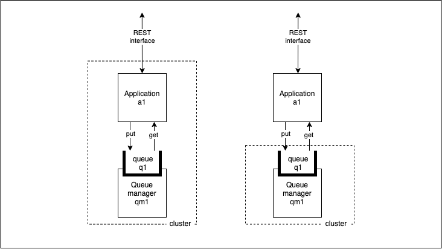

# Application overview

<!--- cSpell:ignore  pipelinerun mqsc msqc runmqsc dockerconfigjson queuemanager QMID podman ibmgaragecloud cntk cnkt eventid gitrevision gitrepositoryurl odowdaibm MQSC replicaset eventlistener triggerbinding triggertemplate mqcicd qmgr Artifactory configmaps OIDC CHLAUTH templating sealedsecret jmeter -->

## Overview

**Audience**: Architects, Application developers, Administrators

In this topic, we're going to:

* Review how an MQ application connects to a queue manager
* Configure a sample application using a GitHub repository
* Examine the structure of the sample application

An MQ application is a client that consumes messaging services provided by an MQ
queue manager server. For example, an application connects to a queue manager to
put and get a messages from a queue; or alternatively publish and subscribe to a
topic. A client application can be written in a variety of programming
languages.

The following diagram shows two examples of an application consuming simple
messaging services provided by a queue manager. In the first example, the
application is local to the queue manager; it is in the same cluster. In the
second example the application is remote to the queue manager; it might be in a
different cluster, or not in a Kubernetes environment.



Our sample application exposes the following REST interface, making it easy to
consume by other applications and services both inside and outside the cluster:

  * `/api/send-hello-world` to put a default `Hello world` message to a queue
  * `/api/recv` to get a message from the queue
  * `/api/send-json` to put a JSON message to a queue
  * `/health` to check the application is running

  The `/health` function allows Kubernetes to check the application is
  running and healthy and to automatically heal it if any problems occur.

We will test each of these REST interfaces in a later topic.

The application uses the Spring framework and the [IBM MQ Spring Boot
Starter](https://developer.ibm.com/components/ibm-mq/tutorials/mq-jms-application-development-with-spring-boot/)
to simplify application development and configuration. We use the Spring
framework for the development of our REST and MQ interfaces because it
simplifies the development of microservice and web based applications often
found in a containerized environment such as Kubernetes.

---

## Pre-requisites

Before attempting this section, make sure you have followed the section in [configuring the cluster](../cluster-config/gitops-config.md). Specifically, you must have completed the following tasks:

* You have installed the `git` and `tree` command line tools.
* You have created a GitHub access token for your application repository's account.
* You have completed the [previous chapter](../qmgr-pipeline/topic1.md) to deploy a Queue Manager instance.

---

## Creating the application repository

It’s wise to use a **new terminal window** for this chapter. It will help us switch between the client application repository and GitOps repository as we examine the different steps in the CICD process.

Follow these instructions to download the application source code.

1. *Navigate to the following sample configuration repository and create a fork:*

    `https://github.com/cloud-native-toolkit/mq-spring-app`

2. *Set up a GitHub environment variable*

    If you've not done it already, set up environment variable `$GIT_ORG`, with
    your GitHub organization. We'll use this variable in subsequent commands.

    **Open a new terminal window.**

    Replace `<git-org>` in the following command:

    ```bash
    export GIT_ORG=<git-org>
    ```

2. *Clone the fork to your local machine*

    ```bash
    git clone https://github.com/$GIT_ORG/mq-spring-app.git
    ```

3. *Change to the local clone's folder*

    ```bash
    cd mq-spring-app
    ```

4. *Set up environment variable for Git branch*

    The sample repository has a single `master` branch. We're going to create a
    new branch that is initially populated with this branch and work in it.

    Create a new branch `$GIT_BRANCH_SPRING` for you using the `$GIT_ORG`
    environment variable we just set up:

    ```bash
    export GIT_BRANCH_SPRING=mq-spring-$GIT_ORG
    git checkout -b $GIT_BRANCH_SPRING
    ```

    you'll see something like:

    ``` { .bash .no-copy }
    Switched to a new branch 'mq-spring-prod-ref-guide'
    ```

    Push the changes:

    ```bash
    git push -u origin $GIT_BRANCH_SPRING
    ```

    ``` { .text .no-copy }
    Total 0 (delta 0), reused 0 (delta 0)
    remote:
    remote: Create a pull request for 'mq-spring-prod-ref-guide' on GitHub by visiting:
    remote:      https://github.com/prod-ref-guide/mq-spring-app/pull/new/mq-spring-prod-ref-guide
    remote:
    To https://github.com/prod-ref-guide/mq-spring-app.git
     * [new branch]      mq-spring-prod-ref-guide -> mq-spring-prod-ref-guide
    Branch 'mq-spring-prod-ref-guide' set up to track remote branch 'mq-spring-prod-ref-guide' from 'origin'.
    ```

    Notice how we've created a new branch `$GIT_BRANCH_SPRING` **based** on the
    `master` branch. All changes will be made in `$GIT_BRANCH_SPRING`; whereas
    `master` will remain unchanged.

    Also note that we use `$GIT_BRANCH_SPRING` to name the `mq-spring-app` client application
    branch in contrast to `$GIT_BRANCH` for the `multi-tenancy-gitops-apps` GitOps
    branch. This helps to prevent us from accidentally promoting a change if we use the wrong
    terminal window in the tutorial.

4. *Review the application source directories*

    ```bash
    tree -d
    ```

    The following diagram shows the directory structure for the MQ application:

    ``` { .text .no-copy }
    .
    ├── architecture
    ├── chart
    │   └── base
    │       └── templates
    ├── jmeter
    ├── local
    │   ├── certs
    │   ├── jaeger
    │   ├── ldap
    │   └── mq
    ├── postman
    └── src
        ├── main
        │   ├── java
        │   │   └── com
        │   │       └── ibm
        │   │           ├── cloud_garage
        │   │           │   └── swagger
        │   │           ├── health
        │   │           └── mqclient
        │   │               ├── app
        │   │               ├── config
        │   │               ├── controller
        │   │               ├── exceptions
        │   │               ├── model
        │   │               └── service
        │   └── resources
        │       └── public
        └── test
            └── java
                └── com
                    └── ibm
                        ├── cloud_garage
                        │   └── swagger
                        ├── health
                        └── mqclient
                            └── controller
    ```

    Notice the top-level folder structure:

    * `architecture` contains the application architecture reference diagram.
    * `chart` contains the helm templates required to deploy the application.
    * `jmeter` contains sample application testing artifacts to demonstrate application and service availability.
    * `local` contains the configuration required to run the application locally.
    * `postman` contains files used by postman to test the application.
    * `src/main` contains the application source files written using the Spring Boot
      framework.
    * `src/test` contains the test code used by the pipeline to test the
      application.

    Spend a few minutes browsing these folders; we'll explore them in more detail
    throughout this chapter.

!!! success "Congratulations!"
    You have successfully cloned and reviewed the application source code. In the next topic, we will build the application using a Tekton pipeline, deploy it using an ArgoCD application, and test it using the `curl` command.
