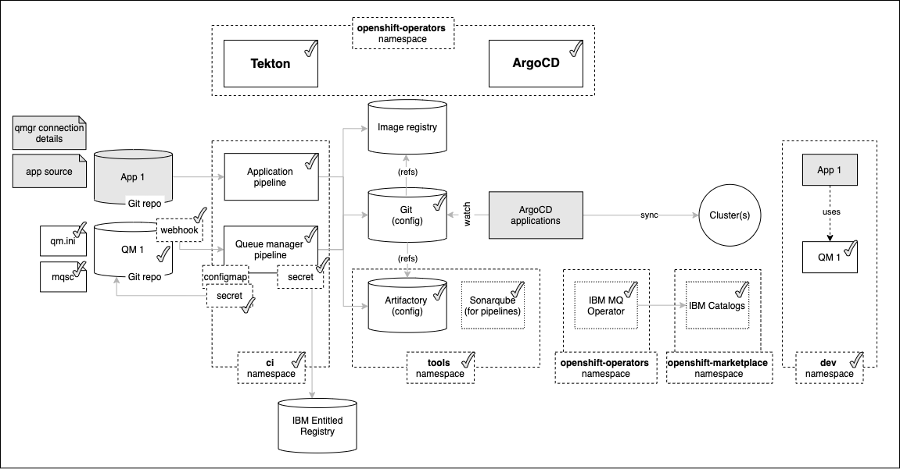
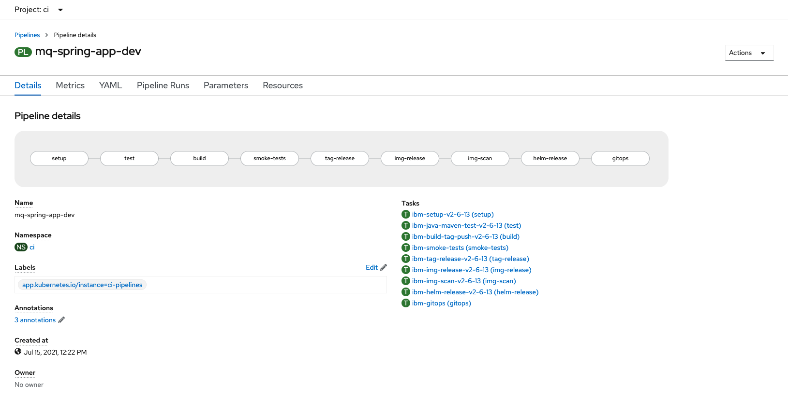
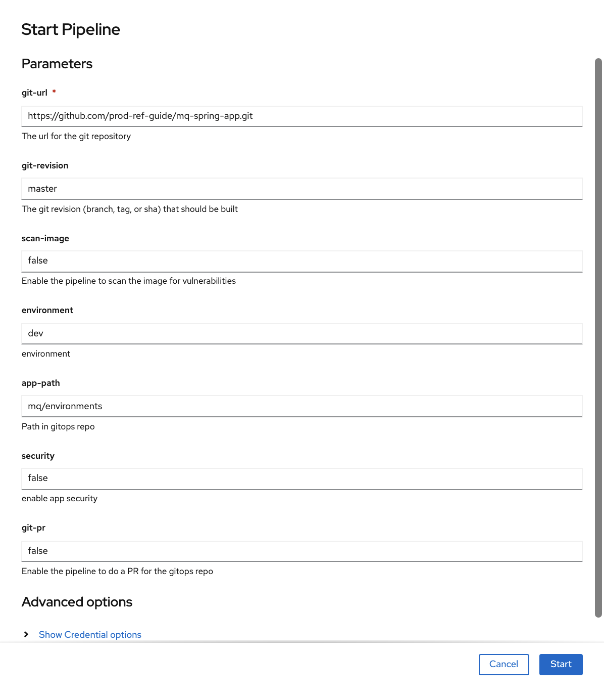
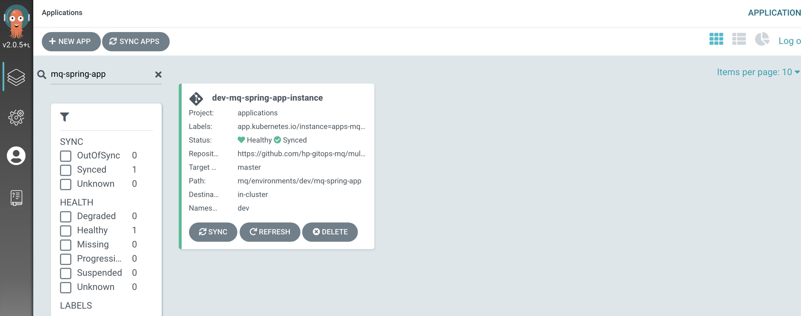
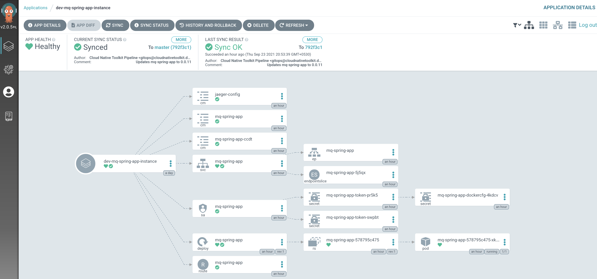
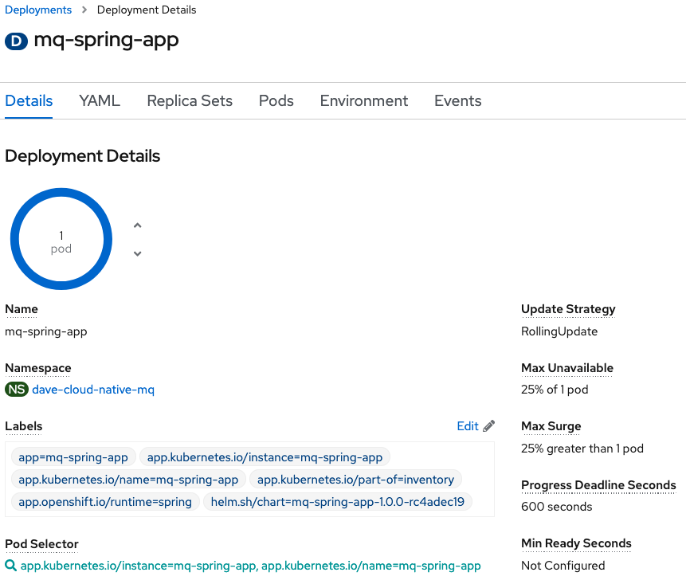
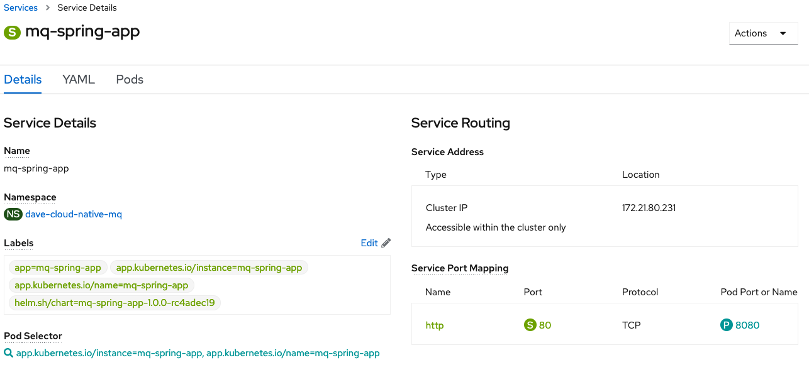
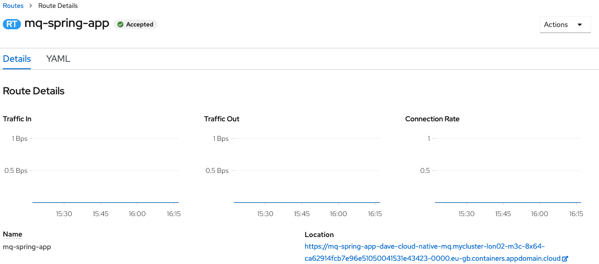
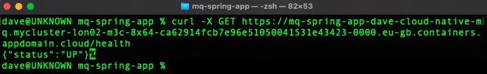

# Application pipeline

<!--- cSpell:ignore  pipelinerun mqsc msqc runmqsc dockerconfigjson queuemanager QMID podman ibmgaragecloud cntk cnkt eventid gitrevision gitrepositoryurl odowdaibm MQSC replicaset eventlistener triggerbinding triggertemplate mqcicd qmgr Artifactory configmaps OIDC CHLAUTH templating sealedsecret jmeter -->

## Overview

**Audience**: Application developers, Administrators

In this topic, we're going to:

* Create an MQ application pipeline
* Examine the pipeline tasks
* Run the pipeline
* Review the resultant GitOps application folders
* Explore how ArgoCD automatically deploys the application
* Test the application using `curl`

The following diagram illustrates how CICD is achieved using Tekton pipelines
and ArgoCD applications. In this topic, we are going to focus on the highlighted
application CICD.



The application pipeline executes a set of tasks designed to ensure that the
application builds successfully, including passing a set of functional and
security tests. If every step is successful, the pipeline creates a new
application image and GitOps configuration. Subsequently, a dedicated ArgoCD
application watches for new MQ application images and configurations, which it
deploys to the cluster.

Notice the separation of concerns between Tekton and ArgoCD. Tekton's role is to
perform continuous integration, ensuring that the best current version of the
application is available for deployment.  ArgoCD's role is to perform continuous
deployment, ensuring that the cluster is always kept up-to-date with the latest
built application that has passed all required tests.

---
## Pre-requisites

In order to deploy the pipelines for the application we require the following
prerequisites to be configured and installed:

* Create the cluster on the cloud platform of your choice.
* [Configure the cluster](../cluster-config/gitops-tekton-argocd.md) for GitOps, and install the
  cluster infrastructure and cloud native services.
* Complete the steps in the [previous topic](../app-pipeline/topic1.md) to clone the application
  source.
* Ensure you are logged into your cluster from the command line.

---
## Build and test the application

Let's now review the application pipeline to build, smoke test and configure the
application.

The production reference guide includes a number of pre-configured application
pipelines for different programming languages and frameworks. These pipelines
illustrate best practices for continuous integration. They are not meant to be
exhaustive; you can modify them for your own projects.

For this section, we return to the **terminal window** we used in previous chapters for interacting with the GitOps repository rather than the one we’ve just used to clone the `mq-spring-app` client application source repository. Open a new terminal window for the `multi-tenancy-gitops-apps` repository if necessary.

1. *Review the pre-configured pipeline*

    Open the OpenShift console and navigate to `Pipelines > Pipelines`.

    You will want to select the `ci` Project from the drop-down at the top of the page.

    Click the `mq-spring-app-dev` Pipeline to view the client application build and deployment pipeline.

    

    You can see the different stages of the pipeline, from building the Java application, unit testing, through to updating the image registry and GitOps repo.

    You can also view the pipeline from the command line:
    ```bash
    oc describe Pipeline mq-spring-app-dev -n ci
    ```

3. *Kickoff a pipeline run*

    From the **Actions** dropdown menu in the upper-right corner, select **Start**.

    {: style="max-height:900px"}

    Configure the run as follows:

    * Set `git-url` to your fork of the `mq-spring-app` repository
    * Set `git-revision` to `master`. (Later in the tutorial, we will use a new branch.)
    * Set `scan-image: false` (temporary fix while issues with UBI are resolved)

    Click **Start** and wait! It may take a little while for the pipeline to run. Keep checking until all steps have completed.

4. *Re-merging local clone to view Helm chart in GitOps repository*

    The `mq-spring-app-dev` pipeline run updated the GitOps repository with the
    Helm chart. This means that our local clone of the GitOps repository is one
    commit behind GitHub. Before we can push any more changes to the GitOps
    repository, we must re-merge our local clone with GitHub.

    **Return to the terminal window** you're using for the `multi-tenancy-gitops-apps`
    GitOps apps repository. (Rather than the terminal window you're using for
    the `mq-spring-app-dev` source repository.)

    ```bash
    git fetch origin
    git merge origin/$GIT_BRANCH
    ```

    which shows that

    ``` { .bash .no-copy }
    Updating b8ed336..792f3c1
    Fast-forward
     mq/environments/dev/mq-infra/requirements.yaml      | 2 +-
     mq/environments/dev/mq-spring-app/Chart.yaml        | 4 ++++
     mq/environments/dev/mq-spring-app/requirements.yaml | 4 ++++
     mq/environments/dev/mq-spring-app/values.yaml       | 3 +++
     4 files changed, 12 insertions(+), 1 deletion(-)
     create mode 100644 mq/environments/dev/mq-spring-app/Chart.yaml
     create mode 100644 mq/environments/dev/mq-spring-app/requirements.yaml
     create mode 100644 mq/environments/dev/mq-spring-app/values.yaml
    ```

    We're now in a consistent state with the GitOps apps repository, so let's construct
    our next set of changes to push.

5. *The ArgoCD application for `MQ sample application`*

    `MQ sample application` has its deployment to the cluster managed by a dedicated ArgoCD application called `dev-mq-spring-app-instance`. This follows the **separation of concerns** pattern where one ArgoCD application manages a set of related Kubernetes resources deployed to a cluster; in this case, all those resources associated with `MQ sample application` in the `dev` namespace.

    Issue the following command to show the ArgoCD application details:

    ```bash
    cat mq/config/argocd/dev/dev-mq-spring-app-instance.yaml
    ```

    which shows a YAML file typical of those we've seen before:

    ``` { .yaml .no-copy }
    apiVersion: argoproj.io/v1alpha1
    kind: Application
    metadata:
      name: dev-mq-spring-app-instance
      annotations:
        argocd.argoproj.io/sync-wave: "300"
      finalizers:
        - resources-finalizer.argocd.argoproj.io
    spec:
      destination:
        namespace: dev
        server: https://kubernetes.default.svc
      project: applications
      source:
        path: mq/environments/dev/mq-spring-app
        repoURL: https://github.com/prod-ref-guide/multi-tenancy-gitops-apps
        targetRevision: master
        helm:
          valueFiles:
          - values.yaml
      syncPolicy:
        automated:
          prune: true
          selfHeal: true
    ```

    See how the Helm chart is referenced by `path: mq/environments/dev/mq-spring-app`:

    ``` { .text .no-copy }
    mq/environments/dev/mq-spring-app/
    ├── Chart.yaml
    ├── requirements.yaml
    └── values.yaml
    ```

    The ArgoCD application applies this Helm chart to the cluster to instantiate
    `MQ sample application` as a set of cluster resources.

6. *Look at active `MQ sample application` ArgoCD application*

    Let's examine `MQ sample application` and its Kubernetes resources using the ArgoCD UI.

    In the ArgoCD UI search the **Applications** view with the keyword `mq-spring-app`:

    (*You may need to launch the ArgoCD UI again. Refer to [these
    instructions](../cluster-config/gitops-tekton-argocd.md).*)

    {: style="max-height:600px"}

    We can now see the below ArgoCD Application:

    * A new `dev-mq-spring-app-instance` ArgoCD application that is managing `QM1`
      resources deployed to the cluster.

7. *View the new* `MQ sample application` *Kubernetes resources*

    We can look at the deployed instance of `mq-spring-app` and its dependent kubernetes
    resources.

    Click on the `dev-mq-infra-instance` ArgoCD application:

    {: style="max-height:900px"}

## Verify application deployment

1. *Review the deployed application*

    The application is deployed within the cluster using a `deployment` manifest. The deployment creates a `replica set` to manage the application's pod.

    A `service` is also created to manage the port, and a `route` allows external connectivity to the application via the service.

    This is the `deployment` for the application, where we can see 1 pod has been created for development and testing purposes:

    

    You can also view the `deployment` from the command line:

    ```bash
    oc project dev
    oc describe deployment mq-spring-app
    ```

    The application writes logs to stdout. These can be viewed from the command line. First of all find the name of the running `mq-spring-app` pod:

    ```bash
    oc get pods -l app.kubernetes.io/name=mq-spring-app
    ```

    Using the name of the running `mq-spring-app` pod, the following commands displays its log for the last 60 seconds and will stream any further messages:

    ```bash
    oc logs mq-spring-app-d9474564c-85mf6 -f --since=60s
    ```

2. *Review the application's service*

    This shows the corresponding `service`, where we can see the application's port 80 inside the application pod is being mapped to `port 8080` at the cluster level:

    

    You can also view the `service` from the command line:
    ```bash
    oc describe service mq-spring-app
    ```

3. *Review the application's route*

    Finally the `route` shows the external url (location) we use to interact with the application:

    

    You can also view the `route` from the command line:
    ```bash
    oc describe route mq-spring-app
    ```

4. *Check the application is running*

    Using the `location` value from the `route` we can call the application to check its health by appending `/health`, for example:

    ````bash
    export APP_URL=$(oc get route -n dev mq-spring-app -o jsonpath="{.spec.host}")
    curl -X GET https://$APP_URL/actuator/health
    ````

    

    The function should return something similar to the JSON-formatted response below:

    ``` { .json .no-copy }
    {
        "status": "UP",
        "components": {
        "HeathEndPointMain": {
            "status": "UP"
        },
        "diskSpace": {
            "status": "UP",
            "details": {
            ...
            }
        },
        "jms": {
            "status": "UP",
            "details": {
            "provider": "IBM MQ JMS Provider"
            }
        },
        "livenessState": {
            "status": "UP"
        },
        "ping": {
            "status": "UP"
        },
        "readinessState": {
            "status": "UP"
        }
        },
        "groups": [
        "liveness",
        "readiness"
        ]
    }
    ```

5. *Call the application to put a message to a queue*

    Using the same `location` value we can call the application to to put a message to a queue on the queue manager, for example:

    ````bash
    curl -X GET https://$APP_URL/api/send-hello-world
    ````

6. *Call the application to get a message from a queue*

    Using the same `location` value we can call the application to to get a message from a queue on the queue manager, for example:

    ````bash
    curl -X GET https://$APP_URL/api/recv
    ````

7. *Call the application to put a JSON message to a queue*

    Using the same `location` value we can call the application to to put a message with a JSON payload to a queue on the queue manager, for example:

    ````bash
    curl -X POST -H "Content-Type: application/json" https://$APP_URL/api/send-json --data "{\"data\":\"Hola Munda\"}"
    ````

    Note the use of the `POST` verb in the above command. This can be followed with a call to get the message from the queue.

!!! success "Congratulations!"
    You've now created and run the pipeline for the application.  In the [next section](topic3.md) we're going to make a change to the application that will trigger the pipeline to build a new version of the application image.
