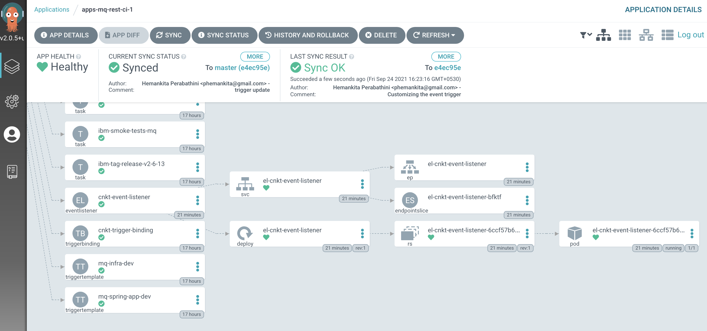
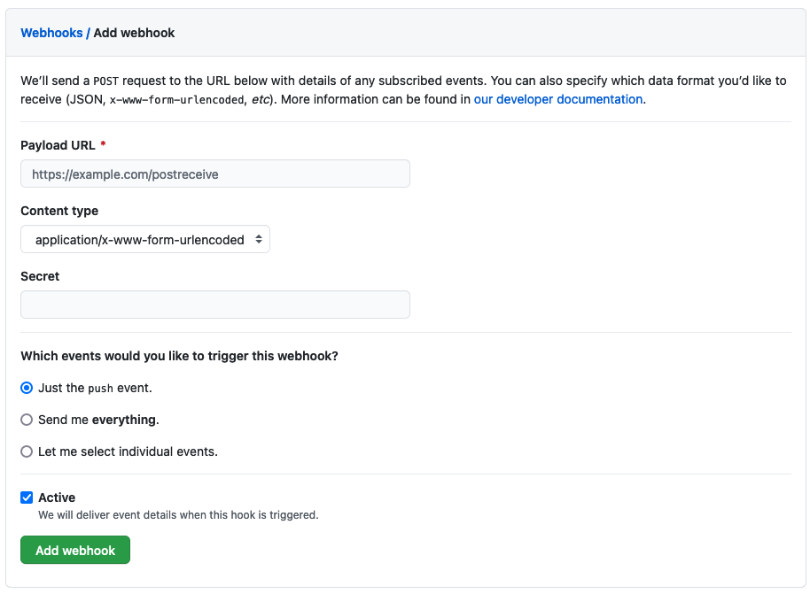
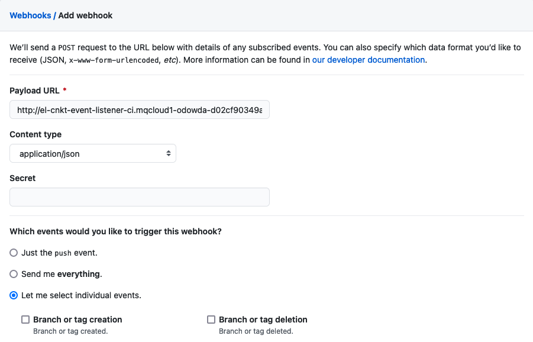
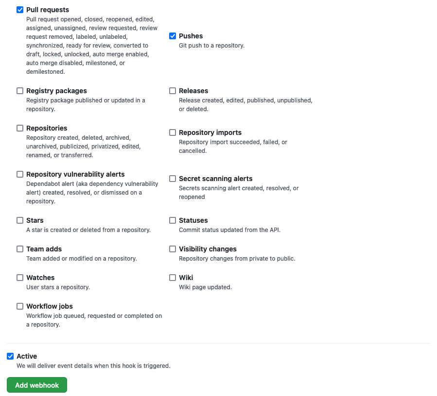
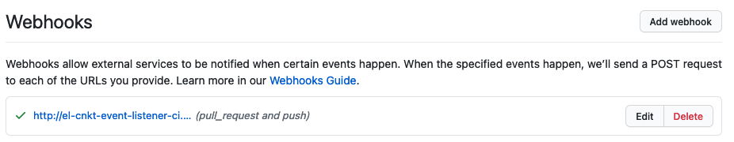

# Changing the application

<!--- cSpell:ignore  eventlisteners pipelinerun mqsc msqc runmqsc dockerconfigjson queuemanager QMID podman ibmgaragecloud cntk cnkt eventid gitrevision gitrepositoryurl odowdaibm MQSC replicaset eventlistener triggerbinding triggertemplate triggertemplates mqclient mqcicd qmgr Artifactory configmaps OIDC CHLAUTH templating sealedsecret jmeter -->

## Overview

**Audience**: Application developers, Administrators

In this topic we add a new function to the application, and push this change to our application repository on GitHub which triggers the pipeline to rebuild the application.

The new function puts the `hello message` to a specified queue rather than the default. The new queue name is stored in memory by the application, and so subsequent gets of the message will be from the specified queue. Later in this tutorial we will use this new capability to demonstrate changing the queue manager configuration by adding an extra queue.

---

## Pre-requisites

* Follow these [instructions](topic2.md) to create and run the application pipelines.

---

## Set up the webhook and its processing

Your GitOps apps repository contains a sample event listener. Let's customize
this sample with the relevant values for our cluster. We'll then deploy the
event listener resources and trigger resources to the cluster using GitOps.

1. *Select the GitOps terminal window*

      **Return to the terminal window** you're using for the `multi-tenancy-gitops-apps`
      GitOps repository.

      We're going to make use of a script in the sample GitOps apps repository that makes
      use of the `$GIT_ORG` and `$GIT_BRANCH_SPRING` environment variables you've seen
      earlier. Previously we used them in the `mq-spring-app` terminal window; now we're
      going to use this in the `multi-tenancy-gitops-apps` terminal window.

      Again, **make sure** in you're in the  `multi-tenancy-gitops-apps` terminal window.

      Issue the following command to ensure you're in the correct starting folder:

      ```bash
      cd $HOME/git/multi-tenancy-gitops-apps
      ```

 2. *Set up the* `$GIT_ORG` and `$GIT_BRANCH_SPRING` *environment variables*

      Let's set up the environment variables that are used by the customization
      script.

      Replace `<git-org>` in the following command with your GitHub user name:

      ```bash
      export GIT_ORG=<git-org>
      ```

      Then create the `$GIT_BRANCH_SPRING` environment variable:

      ```bash
      export GIT_BRANCH_SPRING=mq-spring-$GIT_ORG
      ```

      Verify that your `$GIT_USER` and `$GIT_BRANCH environment` variables are set:

      ```bash
      echo $GIT_ORG
      echo $GIT_BRANCH_SPRING
      ```

      For example:

      ``` { .bash .no-copy }
      (base) anthonyodowd/git/multi-tenancy-gitops echo GIT_ORG
      prod-ref-guide
      (base) anthonyodowd/git/multi-tenancy-gitops echo GIT_BRANCH_QM1
      mq-spring-prod-ref-guide
      ```

3. *The sample event listener*

      The GitOps repository contains a template for the event listener.

      Issue the following command to view the template of the event listener YAML:

      ```bash
      cat mq/environments/ci/eventlisteners/cntk-event-listener.yaml_template
      ```

      ``` { .yaml .no-copy }
      apiVersion: triggers.tekton.dev/v1alpha1
      kind: EventListener
      metadata:
        labels:
          app: cnkt-event-listener
        name: cnkt-event-listener
      spec:
        serviceAccountName: pipeline
        triggers:
        - name: mq-infra-dev
          interceptors:
            - ref:
                name: "cel"
              params:
              - name: "filter"
                value: "header.match('X-GitHub-Event', 'push') && body.ref == 'refs/heads/${GIT_BRANCH_QM1}' && body.repository.full_name == '${GIT_ORG}/mq-infra'"
          bindings:
            - ref: cnkt-trigger-binding
          template:
            ref: mq-infra-dev
        # - name: mq-spring-app-dev
        #   interceptors:
        #     - ref:
        #         name: "cel"
        #       params:
        #       - name: "filter"
        #         value: "header.match('X-GitHub-Event', 'push') && body.ref == 'refs/heads/${GIT_BRANCH_SPRING}' && body.repository.full_name == '${GIT_ORG}/mq-spring-app'"
        #   bindings:
        #     - ref: cnkt-trigger-binding
        #   template:
        #     ref: mq-spring-app-dev
      ```

      Open `mq/environments/ci/eventlisteners/cntk-event-listener.yaml_template`
      in the editor and uncomment the below lines.

      ``` { .yaml .no-copy }
      - name: mq-spring-app-dev
        interceptors:
          - ref:
              name: "cel"
            params:
            - name: "filter"
              value: "header.match('X-GitHub-Event', 'push') && body.ref == 'refs/heads/${GIT_BRANCH_SPRING}' && body.repository.full_name == '${GIT_ORG}/mq-spring-app'"
        bindings:
          - ref: cnkt-trigger-binding
        template:
          ref: mq-spring-app-dev
      ```

      Once edited, it looks like below:

      ``` { .yaml .no-copy }
      apiVersion: triggers.tekton.dev/v1alpha1
      kind: EventListener
      metadata:
        labels:
          app: cnkt-event-listener
        name: cnkt-event-listener
      spec:
        serviceAccountName: pipeline
        triggers:
        - name: mq-infra-dev
          interceptors:
            - ref:
                name: "cel"
              params:
              - name: "filter"
                value: "header.match('X-GitHub-Event', 'push') && body.ref == 'refs/heads/${GIT_BRANCH_QM1}' && body.repository.full_name == '${GIT_ORG}/mq-infra'"
          bindings:
            - ref: cnkt-trigger-binding
          template:
            ref: mq-infra-dev
        - name: mq-spring-app-dev
          interceptors:
            - ref:
                name: "cel"
              params:
              - name: "filter"
                value: "header.match('X-GitHub-Event', 'push') && body.ref == 'refs/heads/${GIT_BRANCH_SPRING}' && body.repository.full_name == '${GIT_ORG}/mq-spring-app'"
          bindings:
            - ref: cnkt-trigger-binding
          template:
            ref: mq-spring-app-dev
      ```

      If you are using OpenShift 4.7, replace the above template with the following:

      ```yaml
      apiVersion: triggers.tekton.dev/v1alpha1
      kind: EventListener
      metadata:
        labels:
          app: cnkt-event-listener
        name: cnkt-event-listener
      spec:
        serviceAccountName: pipeline
        triggers:
        - bindings:
          - kind: TriggerBinding
            ref: cnkt-trigger-binding
          interceptors:
          - cel:
              filter: header.match('X-GitHub-Event', 'push') && body.ref == 'refs/heads/${GIT_BRANCH_QM1}' && body.repository.full_name == '${GIT_ORG}/mq-infra'
          name: mq-infra-dev
          template:
            ref: mq-infra-dev
        - bindings:
          - kind: TriggerBinding
            ref: cnkt-trigger-binding
          interceptors:
          - cel:
              filter: header.match('X-GitHub-Event', 'push') && body.ref == 'refs/heads/${GIT_BRANCH_SPRING}' && body.repository.full_name == '${GIT_ORG}/mq-spring-app'
          name: mq-spring-app-dev
          template:
            ref: mq-spring-app-dev
      ```

4. *Customize the event listeners*

      Create the YAML for the event listener as follows.

      Issue the following command:

      ```bash
      cd mq/environments/ci/eventlisteners/
      sh ./cntk-event-listener.sh
      cd ../../../../
      ```

      Once, this script is run successfully, you should see a new file named `cntk-event-listener.yaml`.

4. *Exploring the event listener customization*

      Let's examine a customized event listener in your local clone. We'll see how
      it maps to our diagram above, and has been customized for our source
      repository.

      Issue the following command:

      ```bash
      cat mq/environments/ci/eventlisteners/cntk-event-listener.yaml
      ```

      to show the customized event listener:

      ``` { .yaml .no-copy }
      apiVersion: triggers.tekton.dev/v1alpha1
      kind: EventListener
      metadata:
        labels:
          app: cnkt-event-listener
        name: cnkt-event-listener
      spec:
        serviceAccountName: pipeline
        triggers:
        - name: mq-infra-dev
          interceptors:
            - ref:
                name: "cel"
              params:
              - name: "filter"
                value: "header.match('X-GitHub-Event', 'push') && body.ref == 'refs/heads/qm1-prod-ref-guide-test' && body.repository.full_name == 'prod-ref-guide-test/mq-infra'"
          bindings:
            - ref: cnkt-trigger-binding
          template:
            ref: mq-infra-dev
        - name: mq-spring-app-dev
          interceptors:
            - ref:
                name: "cel"
              params:
              - name: "filter"
                value: "header.match('X-GitHub-Event', 'push') && body.ref == 'refs/heads/mq-spring-prod-ref-guide-test' && body.repository.full_name == 'prod-ref-guide-test/mq-spring-app'"
          bindings:
            - ref: cnkt-trigger-binding
          template:
            ref: mq-spring-app-dev
      ```

      If using OpenShift 4.7, it will be as follows:

      ```{ .yaml .no-copy}
      apiVersion: triggers.tekton.dev/v1alpha1
      kind: EventListener
      metadata:
        labels:
          app: cnkt-event-listener
        name: cnkt-event-listener
      spec:
        serviceAccountName: pipeline
        triggers:
        - bindings:
          - kind: TriggerBinding
            ref: cnkt-trigger-binding
          interceptors:
          - cel:
              filter: header.match('X-GitHub-Event', 'push') && body.ref == 'refs/heads/qm1-prod-ref-guide-test' && body.repository.full_name == 'prod-ref-guide-test/mq-infra'
          name: mq-infra-dev
          template:
            ref: mq-infra-dev
        # - bindings:
        #   - kind: TriggerBinding
        #     ref: cnkt-trigger-binding
        #   interceptors:
        #   - cel:
        #       filter: header.match('X-GitHub-Event', 'push') && body.ref == 'refs/heads/qm1-prod-ref-guide-test' && body.repository.full_name == 'prod-ref-guide-test/mq-spring-app'
        #   name: mq-spring-app-dev
        #   template:
        #     ref: mq-spring-app-dev
      ```

      An event listener can produce one or more triggers as specified by the list
      `spec.triggers:`. Now, our event listener additionally produces a trigger called
      `mq-spring-app-dev` along with `mq-infra-dev`. This trigger comprises the
      template `mq-spring-app-dev` and template binding `cntk-trigger-binding`.

5. *Push GitOps changes to GitHub*

      Let’s make these GitOps changes and push them.

      Add all changes in the current folder to a git index, commit them, and push them to GitHub:

      ```bash
      git add .
      git commit -s -m "Customizing the event trigger"
      git push origin $GIT_BRANCH
      ```

      The changes have now been pushed to your GitOps repository:

      ``` { .text .no-copy }
      Enumerating objects: 15, done.
      Counting objects: 100% (15/15), done.
      Delta compression using up to 8 threads
      Compressing objects: 100% (8/8), done.
      Writing objects: 100% (8/8), 699 bytes | 699.00 KiB/s, done.
      Total 8 (delta 7), reused 0 (delta 0)
      remote: Resolving deltas: 100% (7/7), completed with 7 local objects.
      To https://github.com/hp-gitops-mq/multi-tenancy-gitops-apps.git
         792f3c1..5d937d7  master -> master
      ```

6. *Activate the webhook components*

      Now that we've customized the event listener for our source repository, let's
      activate all the components necessary to process our webhook: the route, event
      listener, trigger template and trigger binding.

      Open the `kustomization.yaml` that is under `mq/environments/ci/`. This
      contains all the resources that belong to the `ci` namespace.

      ```bash
      cat mq/environments/ci/kustomization.yaml
      ```

      ``` { .yaml .no-copy }
      resources:
      #- certificates/ci-mq-client-certificate.yaml
      #- certificates/ci-mq-server-certificate.yaml
      - configmaps/gitops-repo-configmap.yaml
      - eventlisteners/cntk-event-listener.yaml
      - triggerbindings/cntk-binding.yaml
      - triggertemplates/mq-infra-dev.yaml
      #- triggertemplates/mq-spring-app-dev.yaml
      - pipelines/ibm-test-pipeline-for-dev.yaml
      - pipelines/ibm-test-pipeline-for-stage.yaml
      #- pipelines/java-maven-dev-pipeline.yaml
      - pipelines/mq-pipeline-dev.yaml
      - pipelines/mq-spring-app-dev-pipeline.yaml
      - roles/custom-pipeline-sa-clusterrole.yaml
      - roles/custom-pipeline-sa-role.yaml
      - roles/custom-ci-pipeline-sa-rolebinding.yaml
      - roles/custom-dev-pipeline-sa-rolebinding.yaml
      - roles/custom-staging-pipeline-sa-rolebinding.yaml
      - roles/custom-prod-pipeline-sa-rolebinding.yaml
      - routes/cntk-route.yaml
      - secrets/artifactory-access-secret.yaml
      - secrets/git-credentials-secret.yaml
      - secrets/ibm-entitled-registry-credentials-secret.yaml
      #- secrets/mq-client-jks-password-secret.yaml
      - tasks/10-gitops.yaml
      - tasks/12-functional-tests.yaml
      - tasks/13-jmeter-performance-test.yaml
      - tasks/4-smoke-tests-mq.yaml
      - tasks/4-smoke-tests.yaml
      - tasks/ibm-build-tag-push-v2-6-13.yaml
      - tasks/ibm-helm-release-v2-6-13.yaml
      - tasks/ibm-img-release-v2-6-13.yaml
      - tasks/ibm-img-scan-v2-6-13.yaml
      - tasks/ibm-java-maven-test-v2-6-13.yaml
      - tasks/ibm-setup-v2-6-13.yaml
      - tasks/ibm-tag-release-v2-6-13.yaml
      ```

      Open this file in your editor and uncomment the below resources.

      ``` { .yaml .no-copy }
      - triggertemplates/mq-spring-app-dev.yaml
      ```

      You will have the following resources un-commented:

      ``` { .yaml .no-copy }
      resources:
      #- certificates/ci-mq-client-certificate.yaml
      #- certificates/ci-mq-server-certificate.yaml
      - configmaps/gitops-repo-configmap.yaml
      - eventlisteners/cntk-event-listener.yaml
      - triggerbindings/cntk-binding.yaml
      - triggertemplates/mq-infra-dev.yaml
      - triggertemplates/mq-spring-app-dev.yaml
      - pipelines/ibm-test-pipeline-for-dev.yaml
      - pipelines/ibm-test-pipeline-for-stage.yaml
      #- pipelines/java-maven-dev-pipeline.yaml
      - pipelines/mq-pipeline-dev.yaml
      - pipelines/mq-spring-app-dev-pipeline.yaml
      - roles/custom-pipeline-sa-clusterrole.yaml
      - roles/custom-pipeline-sa-role.yaml
      - roles/custom-ci-pipeline-sa-rolebinding.yaml
      - roles/custom-dev-pipeline-sa-rolebinding.yaml
      - roles/custom-staging-pipeline-sa-rolebinding.yaml
      - roles/custom-prod-pipeline-sa-rolebinding.yaml
      - routes/cntk-route.yaml
      - secrets/artifactory-access-secret.yaml
      - secrets/git-credentials-secret.yaml
      - secrets/ibm-entitled-registry-credentials-secret.yaml
      #- secrets/mq-client-jks-password-secret.yaml
      - tasks/10-gitops.yaml
      - tasks/12-functional-tests.yaml
      - tasks/13-jmeter-performance-test.yaml
      - tasks/4-smoke-tests-mq.yaml
      - tasks/4-smoke-tests.yaml
      - tasks/ibm-build-tag-push-v2-6-13.yaml
      - tasks/ibm-helm-release-v2-6-13.yaml
      - tasks/ibm-img-release-v2-6-13.yaml
      - tasks/ibm-img-scan-v2-6-13.yaml
      - tasks/ibm-java-maven-test-v2-6-13.yaml
      - tasks/ibm-setup-v2-6-13.yaml
      - tasks/ibm-tag-release-v2-6-13.yaml
      ```

7. *Update the GitOps repository*

      Let’s commit these changes to make the event listener and trigger resources
      active in the cluster.

      Issue the following command:

      ```bash
      git add mq/environments/ci/kustomization.yaml
      git commit -s -m "Add app pipeline webhook"
      git push origin $GIT_BRANCH
      ```

      which shows that the changes are pushed to GitHub:

      ``` { .text .no-copy }
      Enumerating objects: 11, done.
      Counting objects: 100% (11/11), done.
      Delta compression using up to 8 threads
      Compressing objects: 100% (6/6), done.
      Writing objects: 100% (6/6), 508 bytes | 508.00 KiB/s, done.
      Total 6 (delta 5), reused 0 (delta 0)
      remote: Resolving deltas: 100% (5/5), completed with 5 local objects.
      To https://github.com/hp-gitops-mq/multi-tenancy-gitops-apps.git
         5d937d7..7ed3cd1  master -> master
      ```

      This change to the GitOps repository can now be used by ArgoCD.

8. *The `apps-mq-rest-ci-1` argocd application*

      Let's examine the ArgoCD application that manage the **applications in
      ci namespace**.

      In the ArgoCD UI **Applications** view, click on the icon for the
      `apps-mq-rest-ci-1` application:

      {: style="max-height:600px"}

      You will see all the necessary configurations. Now, you will see
      trigger template, trigger binding and event listener we just created
      under this application.

9. *The GitHub webhook UI*

      Let's now use the GitHub UI, to configure a webhook that creates an event and sends it to the route
      whenever the queue manager source repository changes.

      We'll configure the webhook using the GitHub UI.

      Issue the following command to determine the URL for the UI:

      ```bash
      echo https://github.com/${GIT_ORG}/mq-spring-app/settings/hooks/new
      ```

      for example:

      ``` { .text .no-copy }
      https://github.com/prod-ref-guide/mq-spring-app/settings/hooks/new
      ```

      Copy the URL into your browser to launch the GitHub webpage to configure a new
      webhook for your `mq-spring-app` repository:

      

      We need to complete these details to configure our webhook.

11. *Configure the webhook*

      To configure a webhook, we need to identify the URL it will call when it
      generates an event, the format of the event, and for which GitHub events we'll
      generate an event.

      Issue the following command to determine the URL of the event listener route:

      ```bash
      echo http://$(oc get route el-cnkt-event-listener -n ci -o jsonpath='{.spec.host}')
      ```

      for example:

      ``` { .text .no-copy }
      http://el-cnkt-event-listener-ci.xxxxx.containers.appdomain.cloud
      ```

      Here's a sample webhook configuration:

      

      Configure the following arguments:

      * Set the **Payload URL** using the event listener route address.
      * Set **Content type** to `application/json`.
      * Select **Let me select individual event**
        * Select **Pull requests** and **Pushes** from the list of available
          events.

      

      Click on `Add webhook` to create the webhook.

12. *A new webhook has been added*

      In the GitHub UI, you can see that a new webhook has been added:

      

      Notice the webhook's name and that it's generating an event whenever a
      `pull-request` or `push` is issued against this repository.

      Let's now make a change to the `MQ sample application` source repository
      and watch the webhook at work.

---

## Change the application

1. *Confirm the new function doesn't exist*

    **Return to the terminal window** you’re using for the `mq-spring-app` source repository. _(Rather than the terminal window you’re using for the `multi-tenancy-gitops-apps` GitOps repository.)_

    First of all we check the new function doesn't already exist.

    Using the application's route URL from the previous topic enter the following command:

    ````bash
    export APP_URL=$(oc get route -n dev mq-spring-app -o jsonpath="{.spec.host}")
    curl -G -X GET https://$APP_URL/api/send-to-queue -d queueName=test
    ````
    Note the addition of the `-G` parameter as we are adding a parameter to the GET.

    You should get a `Not Found` response:

    ``` { .json .no-copy }
    {"timestamp":"2021-05-04T13:16:51.365+0000","status":404,"error":"Not Found","message":"No message available","path":"/api/send-to-queue"}
    ```

2. *Add the new function*

    We're going to add the function `/api/send-to-queue` to the `MQClientController` class which includes the existing functions to put and get MQ messages.

    2.1. *Change source directory*

    From the main directory of the cloned application source, change to the `src/main/java/com/ibm/mqclient/controller` directory

    ```bash
    cd src/main/java/com/ibm/mqclient/controller
    ```

    2.2. *Update source file*

    Edit `MQClientController.java` using your editor of choice:

    ```bash
    code MQClientController.java
    ```

    2.3. *Add required imports*

    Add the following code to the end of the `import` section at the top of the `MQClientController.java` file:

    ```java
    import org.springframework.web.bind.annotation.RequestParam;
    ```

    2.4. *Add new function*

    Add the following code to the end of the `MQClientController` class:

    ```java
    @GetMapping(value = "/api/send-to-queue")
  	@ApiOperation(value = "Put a 'Hello World!' message on the MQ queue specified as parameter.", notes = "This api puts a hello world text message on the MQ queue specified as parameter.")
  	@ApiResponses(value = {@ApiResponse(code = 200, message = "Successfully put message on the specified queue."), @ApiResponse(code = 500, message = "Error putting message on the specified queue.")})
  	ResponseData sendHelloToQueueName(@RequestParam String queueName) {
  	mqService.setQueueName(queueName);
  	   String dataSentToQueue = mqService.sendHelloWorld();
  	   final String text = "Successfully sent message to queue " + mqService.getQueueName();
  	   ResponseData responseData = new ResponseData("OK", text, dataSentToQueue);
  	   return responseData;
  	}
    ```

    Ensure the new function is within the braces {} of the main class, for example:

    ``` { .java .no-copy }
    public class MQClientController {
        ...
        @GetMapping(value = "/api/send-to-queue")
        ResponseData sendHelloToQueueName(@RequestParam String queueName) {
            mqService.setQueueName(queueName);
            String dataSentToQueue = mqService.sendHelloWorld();
            final String text = "Successfully sent message to queue " + mqService.getQueueName();
            ResponseData responseData = new ResponseData("OK", text, dataSentToQueue);
            return responseData;
        }
    }
    ```

    2.5 *Save the changes to the file*

3. *Add get and set methods to the MQService class*

    We also need change the MQService class to allow the `queueName` variable to be changed.

    3.1. *Change directory*

    From current directory change to '../service':

    ```bash
    cd ../service
    ```
    3.2. *Update source file*

    Edit `MQService.java` using your editor of choice:

    ```bash
    code MQService.java
    ```
    3.3. *Change code*

    Change 'line 34' to include the queue name:

    ```java
    LOG.debug("Successfully Sent message: {} to the queue " + queueName, helloWorld);
    ```

    Change 'line 37' to include the queue name

    ```java
    throw new AppException("MQAPP001", "Error sending message to the queue " + queueName, ex);
    ```

    3.5 *Add the new get and set functions*

    After the `sendHelloWorld()` function add:

    ```java
    public void setQueueName(String newQueueName) {
        this.queueName = newQueueName;
        return;
    }

    public String getQueueName() {
        return this.queueName;
    }
    ```

4. *Commit and push the new changes*

    4.1. *Commit the change to your local git repository*

    ```bash
    git commit -a -m "Add /api/send-to-queue function"
    ```

    4.2. *Push the changes from your local repository*

    ```bash
    git push origin ${GIT_BRANCH_SPRING}
    ```

    4.3. *Observe the pipeline building, testing, and deploying the application*

    Monitor the active PipelineRun while it is active.

    Once completed, you can return to ArgoCD to monitor the `mq-spring-app-dev` ArgoCD Application and it's rollout status.

5. *Test the new function*

    We call the same function as we did in step 1.

    ```bash
    curl -G -X GET https://$APP_URL/api/send-to-queue -d queueName=IBM.DEMO.Q
    ```

    This time we should get the following response showing the application now includes our new function:

    ``` { .json .no-copy }
    {"status":"OK","statusMessage":"Successfully sent message to queue IBM.DEMO.Q","data":"Hello World!"}
    ```

!!! success "Congratulations!"
    You've successfully modified the application by adding a new function. You then pushed this change to your Git repository which triggered the pipelines to build, test and deploy the change. Finally you called the new function using the curl command.
