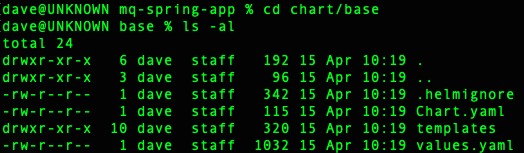
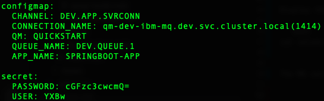

# Application configuration

<!--- cSpell:ignore  pipelinerun mqsc msqc runmqsc dockerconfigjson queuemanager QMID podman ibmgaragecloud cntk cnkt eventid gitrevision gitrepositoryurl odowdaibm MQSC replicaset eventlistener triggerbinding triggertemplate mqcicd qmgr Artifactory configmaps OIDC CHLAUTH templating sealedsecret jmeter -->

<InlineNotification kind="warning"><strong>This pattern needs to be revisited as these edits should be made in the gitops repository and not the upstream application source repository.</strong></InlineNotification>

## Overview

**Audience**: Application developers, Administrators

In this topic we review where the MQ configuration is stored, and how this can be changed.

An MQ application requires the following configuration information to connect to a queue manager:

* `queue manager name`
* `channel`
* `connection`
* `user`
* `password`
* `application name`

Note, `User` and `Password` are dependent on the security configuration for the queue manager.

---

## Pre-requisites

In order to view and change the MQ configuration for the application we require the following prerequisites to be configured and installed:
* Create the cluster on your infrastructure of choice.
* [Configure the cluster](../cluster-config/gitops-tekton-argocd.md). This includes installing the Cloud Native Toolkit.
* Complete the steps [here](topic1.md) to clone the application source.
* Complete the steps [here](topic2.md) to review and run the pipeline.
* Ensure you are logged into your cluster from the command line.

---
## Review MQ configuration

1. *Review the current MQ configuration*

  From the main directory of the cloned application source, change to the `chart/base` directory:

  

  Display the content of `values.yml` by running:

  ```bash
  cat values.yml
  ```

  The MQ configuration can be seen near the end of this file:

  

  Here we can see the MQ configuration that will be added to a `ConfigMap` and `Secret` (both called `mq-spring-app`) in the cluster by the ArgoCD pipeline. The application deployment manifest is configured to include these.

2. *Review the ConfigMap*

  Display the resultant ConfigMap called `mq-spring-app`:

  ```bash
  oc get ConfigMap mq-spring-app -o yaml
  ```

3. *Review the Secret*

  Display the resultant Secret called `mq-spring-app`:

  ```bash
  oc get Secret mq-spring-app -o yaml
  ```

  Note: The values for `USER` and `PASSWORD` are shown in `Base64`. You can run the following command to decode them:

  ```bash
  echo "cGFzc3cwcmQ=" | base64 -d
  ```

4. *Change MQ configuration*

  To change the MQ configuration, we follow the same process as for an [application change](../app-pipeline/topic3.md).

  4.1. *Change the content of values.yml*

  4.2. *Commit the change to your local git repository*

  ```bash
  git commit -a -m "Change MQ configuration"
  ```

  4.3. *Push the changes from your local repository*

  ```bash
  git push
  ```

  4.4. *Create a pull-request if required*

  4.5. *Observe the pipeline being triggered to build, test and deploy the application*

---

Congratulations! You have successfully reviewed and modified the MQ configuration for the application.