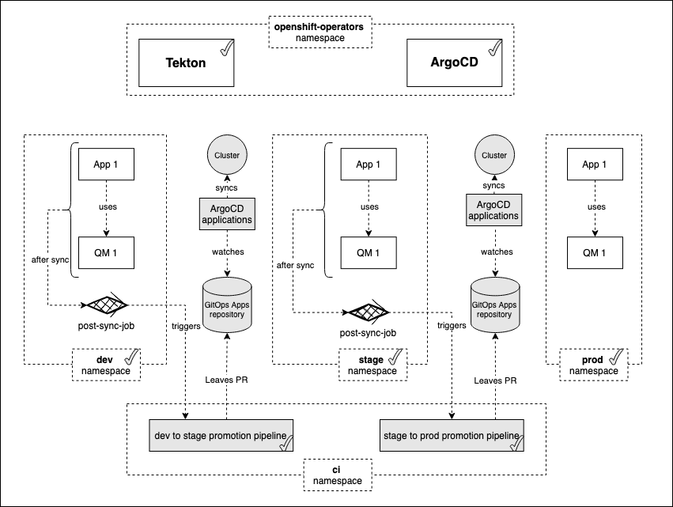
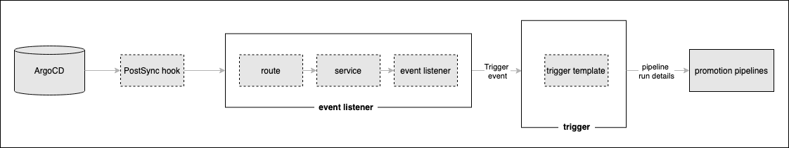

# Automate Promotion Pipeline Workflow

<!--- cSpell:ignore  pipelinerun mqsc msqc runmqsc dockerconfigjson queuemanager QMID podman ibmgaragecloud cntk cnkt eventid gitrevision gitrepositoryurl odowdaibm MQSC replicaset eventlistener triggerbinding triggertemplate triggertemplates mqcicd qmgr Artifactory configmaps OIDC CHLAUTH templating sealedsecret PostSync post-sync favourite eventlisteners -->

## Overview

In the previous topics, we promoted the queue manager and sample application
from [dev to staging](../cloud-native/promoting-environments-dev-stage.md)
environment and then from [staging to prod ](../cloud-native/promoting-environments-stage-prod.md)
environment. We then deployed them using ArgoCD.

In this topic, we're going to make this promotion processes fully automatic.
As we perviously saw, a change to the queue manager source repository or sample
application source repository will automatically result in a pipeline run for it. If the pipeline is successful, a new Helm chart will be built and automatically deployed by ArgoCD into the `dev`
namespace. Once the Queuemanager or the sample application is successfully deployed in dev namespace, the argocd post sync trigger in dev namespace will automatically generate a pipelinerun. If the pipeline is successful, a new Helm chart will be built and automatically deployed by ArgoCD into the `stage` namespace. Following the same approach again, once the Queuemanager or the sample application is successfully deployed in stage namespace, the argocd post sync trigger in stage namespace will automatically generate a pipelinerun. If the pipeline is successful, a new Helm chart will be built and automatically deployed by ArgoCD into the `prod` namespace. To recap, the whole process will be automatic from end-to-end.

Look at the following diagram:

{: style="max-height:500px"}

We've already seen most of the highlighted components. Notice that we've added
a `post sync trigger`. This trigger will be responsible to fire promotion pipelines every
time the `QM1` or `Sample application` is successfully deployed in the respective namespaces.

In this topic, we're going to:

* Set up post sync triggers.
* Test the end to end promotion process.

By the end of this topic we'll have a fully automated promotion process set up in place to
deploy the latest changes made to QueueManager or Sample application to the cluster across all environments in an automated fashion.

---

## Pre-requisites

Before attempting this topic, you should have successfully completed the
[previous topic](../cloud-native/promoting-environments-stage-prod.md).

---

## Set up the ArgoCD Post-sync hook

An ArgoCD PostSync hook is useful to run certain checks after the deployment. For instance, if we want to validate the health or perform some integration tests, we can use PostSync hook to do these things for us. Basically, this hook executes after all the the Sync hooks of the application are successful and completed.

If you want to know more about this, check [Resource Hooks](https://argo-cd.readthedocs.io/en/stable/user-guide/resource_hooks/) out.

In this topic section we're going to set up the components we need for our PostSync hook:



A PostSync hook will be triggered by ArgoCD once the deployment is successful
and is sent to an **event listener**. In Kubernetes, this event listener
comprises a normal `route` and `service` front-ending a Tekton
`eventlistener` custom resource. The event listener is driven by the ArgoCD
PostSync hook, and runs the pipeline using a Tekton **trigger**.

### Set up trigger templates

1. *Select the GitOps terminal window*

      **Return to the terminal window** you're using for the `multi-tenancy-gitops-apps`
      GitOps repository.

      We're going to make use of a script in the sample GitOps apps repository that makes
      use of the `$GIT_ORG` and `$GIT_BRANCH_QM1` environment variables you've seen
      earlier. Previously we used them in the `mq-infra` terminal window; now we're
      going to use this in the `multi-tenancy-gitops-apps` terminal window.

      Again, **make sure** in you're in the  `multi-tenancy-gitops-apps` terminal window.

      Issue the following command to ensure you're in the correct starting folder:

      ```bash
      cd $HOME/git/multi-tenancy-gitops-apps
      ```

2. *Set up the* `$GIT_ORG` and `$GIT_BRANCH` *environment variables*

      Let's set up the environment variables.

      Replace `<git-org>` in the following command with your GitHub user name:

      ```bash
      export GIT_ORG=<git-org>
      ```

      Then create the `$GIT_BRANCH` environment variable:

      ```bash
      export GIT_BRANCH=master
      ```

      Verify that your `$GIT_USER` and `$GIT_BRANCH` environment variables are set:

      ```bash
      echo $GIT_ORG
      echo $GIT_BRANCH
      ```

      For example:

      ``` { .text .no-copy }
      (base) user/git/multi-tenancy-gitops echo GIT_ORG
      prod-ref-guide
      (base) user/git/multi-tenancy-gitops echo GIT_BRANCH
      master
      ```

3. *The trigger templates for Queuemanager PostSync hook in `dev` environment*

      Issue the following commands to generate a trigger template for Queuemanager PostSync hook in `dev` environment:

      ```bash
      vi mq/environments/ci/triggertemplates/mq-infra-dev-triggertemplate.yaml
      ```

      Alternatively, you can also open your favourite editor and create `mq-infra-dev-triggertemplate.yaml` under the path `multi-tenancy-gitops-apps/mq/environments/ci/triggertemplates`.

      Copy the below contents and save them to `mq-infra-dev-triggertemplate.yaml`. Before doing this, make sure you replace `${GIT_ORG}` with the name of your organization. To know your org, just issue `echo ${GIT_ORG}`.

      ```yaml
      apiVersion: triggers.tekton.dev/v1alpha1
      kind: TriggerTemplate
      metadata:
        labels:
          app: mq-infra-post-dev
        name: mq-infra-post-dev
      spec:
        resourcetemplates:
          - apiVersion: tekton.dev/v1beta1
            kind: PipelineRun
            metadata:
              annotations:
                argocd.argoproj.io/compare-options: IgnoreExtraneous
                argocd.argoproj.io/sync-options: Prune=false
              labels:
                tekton.dev/pipeline: ibm-mq-promote-dev-stage
              generateName: ibm-mq-promote-dev-stage-
            spec:
              params:
              - name: git-url
                value: https://github.com/${GIT_ORG}/mq-infra.git
              pipelineRef:
                name: ibm-mq-promote-dev-stage
      ```

      Issue the following command to verify:

      ```bash
      cat mq/environments/ci/triggertemplates/mq-infra-dev-triggertemplate.yaml
      ```

      to show the trigger template we created earlier:

      ``` { .yaml .no-copy }
      apiVersion: triggers.tekton.dev/v1alpha1
      kind: TriggerTemplate
      metadata:
        labels:
          app: mq-infra-post-dev
        name: mq-infra-post-dev
      spec:
        resourcetemplates:
          - apiVersion: tekton.dev/v1beta1
            kind: PipelineRun
            metadata:
              annotations:
                argocd.argoproj.io/compare-options: IgnoreExtraneous
                argocd.argoproj.io/sync-options: Prune=false
              labels:
                tekton.dev/pipeline: ibm-mq-promote-dev-stage
              generateName: ibm-mq-promote-dev-stage-
            spec:
              params:
              - name: git-url
                value: https://github.com/prod-ref-guide/mq-infra.git
              pipelineRef:
                name: ibm-mq-promote-dev-stage
      ```

4. *The trigger templates for MQ sample application PostSync hook in `dev` environment*

      Issue the following commands to generate a trigger template for MQ Sample application PostSync hook in `dev` environment:

      ```bash
      vi mq/environments/ci/triggertemplates/mq-spring-app-dev-triggertemplate.yaml
      ```

      Alternatively, you can also open your favourite editor and create `mq-spring-app-dev-triggertemplate.yaml` under the path `multi-tenancy-gitops-apps/mq/environments/ci/triggertemplates`.

      Copy the below contents and save them to `mq-spring-app-dev-triggertemplate.yaml`. Before doing this, make sure you replace `${GIT_ORG}` with the name of your organization. To know your org, just issue `echo ${GIT_ORG}`.

      ```yaml
      apiVersion: triggers.tekton.dev/v1alpha1
      kind: TriggerTemplate
      metadata:
        labels:
          app: mq-spring-app-post-dev
        name: mq-spring-app-post-dev
      spec:
        resourcetemplates:
          - apiVersion: tekton.dev/v1beta1
            kind: PipelineRun
            metadata:
              annotations:
                argocd.argoproj.io/compare-options: IgnoreExtraneous
                argocd.argoproj.io/sync-options: Prune=false
              labels:
                tekton.dev/pipeline: ibm-mq-promote-dev-stage
              generateName: ibm-mq-promote-dev-stage-
            spec:
              params:
              - name: git-url
                value: https://github.com/${GIT_ORG}/mq-spring-app.git
              pipelineRef:
                name: ibm-mq-promote-dev-stage
      ```

      Issue the following command to verify:

      ```bash
      cat mq/environments/ci/triggertemplates/mq-spring-app-dev-triggertemplate.yaml
      ```

      to show the trigger template we created earlier:

      ``` { .yaml .no-copy }
      apiVersion: triggers.tekton.dev/v1alpha1
      kind: TriggerTemplate
      metadata:
        labels:
          app: mq-spring-app-post-dev
        name: mq-spring-app-post-dev
      spec:
        resourcetemplates:
          - apiVersion: tekton.dev/v1beta1
            kind: PipelineRun
            metadata:
              annotations:
                argocd.argoproj.io/compare-options: IgnoreExtraneous
                argocd.argoproj.io/sync-options: Prune=false
              labels:
                tekton.dev/pipeline: ibm-mq-promote-dev-stage
              generateName: ibm-mq-promote-dev-stage-
            spec:
              params:
              - name: git-url
                value: https://github.com/prod-ref-guide/mq-spring-app.git
              pipelineRef:
                name: ibm-mq-promote-dev-stage
      ```

5. *The trigger templates for Queuemanager PostSync hook in `stage` environment*

      Issue the following commands to generate a trigger template for Queuemanager PostSync hook in `stage` environment:

      ```bash
      vi mq/environments/ci/triggertemplates/mq-infra-stage-triggertemplate.yaml
      ```

      Alternatively, you can also open your favourite editor and create `mq-infra-stage-triggertemplate.yaml` under the path `multi-tenancy-gitops-apps/mq/environments/ci/triggertemplates`.

      Copy the below contents and save them to `mq-infra-stage-triggertemplate.yaml`. Before doing this, make sure you replace `${GIT_ORG}` with the name of your organization. To know your org, just issue `echo ${GIT_ORG}`.

      ```yaml
      apiVersion: triggers.tekton.dev/v1alpha1
      kind: TriggerTemplate
      metadata:
        labels:
          app: mq-infra-post-stage
        name: mq-infra-post-stage
      spec:
        resourcetemplates:
          - apiVersion: tekton.dev/v1beta1
            kind: PipelineRun
            metadata:
              annotations:
                argocd.argoproj.io/compare-options: IgnoreExtraneous
                argocd.argoproj.io/sync-options: Prune=false
              labels:
                tekton.dev/pipeline: ibm-mq-promote-stage-prod
              generateName: ibm-mq-promote-stage-prod-
            spec:
              params:
              - name: git-url
                value: https://github.com/${GIT_ORG}/mq-infra.git
              pipelineRef:
                name: ibm-mq-promote-stage-prod
      ```

      Issue the following command to verify:

      ```bash
      cat mq/environments/ci/triggertemplates/mq-infra-stage-triggertemplate.yaml
      ```

      to show the trigger template we created earlier:

      ``` { .yaml .no-copy }
      apiVersion: triggers.tekton.dev/v1alpha1
      kind: TriggerTemplate
      metadata:
        labels:
          app: mq-infra-post-stage
        name: mq-infra-post-stage
      spec:
        resourcetemplates:
          - apiVersion: tekton.dev/v1beta1
            kind: PipelineRun
            metadata:
              annotations:
                argocd.argoproj.io/compare-options: IgnoreExtraneous
                argocd.argoproj.io/sync-options: Prune=false
              labels:
                tekton.dev/pipeline: ibm-mq-promote-stage-prod
              generateName: ibm-mq-promote-stage-prod-
            spec:
              params:
              - name: git-url
                value: https://github.com/prod-ref-guide/mq-infra.git
              pipelineRef:
                name: ibm-mq-promote-stage-prod
      ```

6. *The trigger templates for MQ sample application PostSync hook in `stage` environment*

      Issue the following commands to generate a trigger template for MQ Sample application PostSync hook in `stage` environment:

      ```bash
      vi mq/environments/ci/triggertemplates/mq-spring-app-stage-triggertemplate.yaml
      ```

      Alternatively, you can also open your favourite editor and create `mq-spring-app-stage-triggertemplate.yaml` under the path `multi-tenancy-gitops-apps/mq/environments/ci/triggertemplates`.

      Copy the below contents and save them to `mq-spring-app-stage-triggertemplate.yaml`. Before doing this, make sure you replace `${GIT_ORG}` with the name of your organization. To know your org, just issue `echo ${GIT_ORG}`.

      ```yaml
      apiVersion: triggers.tekton.dev/v1alpha1
      kind: TriggerTemplate
      metadata:
        labels:
          app: mq-spring-app-post-stage
        name: mq-spring-app-post-stage
      spec:
        resourcetemplates:
          - apiVersion: tekton.dev/v1beta1
            kind: PipelineRun
            metadata:
              annotations:
                argocd.argoproj.io/compare-options: IgnoreExtraneous
                argocd.argoproj.io/sync-options: Prune=false
              labels:
                tekton.dev/pipeline: ibm-mq-promote-stage-prod
              generateName: ibm-mq-promote-stage-prod-
            spec:
              params:
              - name: git-url
                value: https://github.com/${GIT_ORG}/mq-spring-app.git
              pipelineRef:
                name: ibm-mq-promote-stage-prod
      ```

      Issue the following command to verify:

      ```bash
      cat mq/environments/ci/triggertemplates/mq-spring-app-stage-triggertemplate.yaml
      ```

      to show the trigger template we created earlier:

      ``` { .yaml .no-copy }
      apiVersion: triggers.tekton.dev/v1alpha1
      kind: TriggerTemplate
      metadata:
        labels:
          app: mq-spring-app-post-stage
        name: mq-spring-app-post-stage
      spec:
        resourcetemplates:
          - apiVersion: tekton.dev/v1beta1
            kind: PipelineRun
            metadata:
              annotations:
                argocd.argoproj.io/compare-options: IgnoreExtraneous
                argocd.argoproj.io/sync-options: Prune=false
              labels:
                tekton.dev/pipeline: ibm-mq-promote-stage-prod
              generateName: ibm-mq-promote-stage-prod-
            spec:
              params:
              - name: git-url
                value: https://github.com/prod-ref-guide/mq-spring-app.git
              pipelineRef:
                name: ibm-mq-promote-stage-prod
      ```

7. *Push GitOps changes to GitHub*

      Let’s make these GitOps changes and push them.

      Add all changes in the current folder to a git index, commit them, and push them to GitHub:

      ```bash
      git add mq/environments/ci/triggertemplates
      git commit -s -m "Defining trigger templates for promotion automation"
      git push origin $GIT_BRANCH
      ```

### Set up eventlisteners

1. *The eventlistener for QueueManager in `dev` environment*

      Issue the following commands to generate an eventlistener in `dev` environment for the QueueManager:

      ```bash
      vi mq/environments/ci/eventlisteners/mq-infra-dev-eventlistener.yaml
      ```

      Alternatively, you can also open your favourite editor and create `mq-infra-dev-eventlistener.yaml` under the path `multi-tenancy-gitops-apps/mq/environments/ci/eventlisteners`.

      Copy the below contents and save them to `mq-infra-dev-eventlistener.yaml`.

      ```yaml
      apiVersion: triggers.tekton.dev/v1alpha1
      kind: EventListener
      metadata:
        name: mq-infra-post-dev
      spec:
        serviceAccountName: pipeline
        triggers:
          - name: mq-infra-post-dev
            template:
              ref: mq-infra-post-dev
      ```

      Issue the following command to verify:

      ```bash
      cat mq/environments/ci/eventlisteners/mq-infra-dev-eventlistener.yaml
      ```

      to show the eventlistener we created earlier:

      ``` { .yaml .no-copy }
      apiVersion: triggers.tekton.dev/v1alpha1
      kind: EventListener
      metadata:
        name: mq-infra-post-dev
      spec:
        serviceAccountName: pipeline
        triggers:
          - name: mq-infra-post-dev
            template:
              ref: mq-infra-post-dev
      ```

2. *The eventlistener for MQ sample application in `dev` environment*

      Issue the following commands to generate an eventlistener in `dev` environment for the MQ sample application:

      ```bash
      vi mq/environments/ci/eventlisteners/mq-spring-app-dev-eventlistener.yaml
      ```

      Alternatively, you can also open your favourite editor and create `mq-spring-app-dev-eventlistener.yaml` under the path `multi-tenancy-gitops-apps/mq/environments/ci/eventlisteners`.

      Copy the below contents and save them to `mq-spring-app-dev-eventlistener.yaml`.

      ```yaml
      apiVersion: triggers.tekton.dev/v1alpha1
      kind: EventListener
      metadata:
        name: mq-spring-app-post-dev
      spec:
        serviceAccountName: pipeline
        triggers:
          - name: mq-spring-app-post-dev
            template:
              ref: mq-spring-app-post-dev
      ```

      Issue the following command to verify:

      ```bash
      cat mq/environments/ci/eventlisteners/mq-spring-app-dev-eventlistener.yaml
      ```

      to show the eventlistener we created earlier:

      ``` { .yaml .no-copy }
      apiVersion: triggers.tekton.dev/v1alpha1
      kind: EventListener
      metadata:
        name: mq-spring-app-post-dev
      spec:
        serviceAccountName: pipeline
        triggers:
          - name: mq-spring-app-post-dev
            template:
              ref: mq-spring-app-post-dev
      ```

3. *The eventlistener for QueueManager in `stage` environment*

      Issue the following commands to generate an eventlistener in `stage` environment for the QueueManager:

      ```bash
      vi mq/environments/ci/eventlisteners/mq-infra-stage-eventlistener.yaml
      ```

      Alternatively, you can also open your favourite editor and create `mq-infra-stage-eventlistener.yaml` under the path `multi-tenancy-gitops-apps/mq/environments/ci/eventlisteners`.

      Copy the below contents and save them to `mq-infra-stage-eventlistener.yaml`.

      ```yaml
      apiVersion: triggers.tekton.dev/v1alpha1
      kind: EventListener
      metadata:
        name: mq-infra-post-stage
      spec:
        serviceAccountName: pipeline
        triggers:
          - name: mq-infra-post-stage
            template:
              ref: mq-infra-post-stage
      ```

      Issue the following command to verify:

      ```bash
      cat mq/environments/ci/eventlisteners/mq-infra-stage-eventlistener.yaml
      ```

      to show the eventlistener we created earlier:

      ``` { .yaml .no-copy }
      apiVersion: triggers.tekton.dev/v1alpha1
      kind: EventListener
      metadata:
        name: mq-infra-post-stage
      spec:
        serviceAccountName: pipeline
        triggers:
          - name: mq-infra-post-stage
            template:
              ref: mq-infra-post-stage
      ```

4. *The eventlistener for MQ sample application in `stage` environment*

      Issue the following commands to generate an eventlistener in `stage` environment for the MQ sample application:

      ```bash
      vi mq/environments/ci/eventlisteners/mq-spring-app-stage-eventlistener.yaml
      ```

      Alternatively, you can also open your favourite editor and create `mq-spring-app-stage-eventlistener.yaml` under the path `multi-tenancy-gitops-apps/mq/environments/ci/eventlisteners`.

      Copy the below contents and save them to `mq-spring-app-stage-eventlistener.yaml`.

      ```yaml
      apiVersion: triggers.tekton.dev/v1alpha1
      kind: EventListener
      metadata:
        name: mq-spring-app-post-stage
      spec:
        serviceAccountName: pipeline
        triggers:
          - name: mq-spring-app-post-stage
            template:
              ref: mq-spring-app-post-stage
      ```

      Issue the following command to verify:

      ```bash
      cat mq/environments/ci/eventlisteners/mq-spring-app-stage-eventlistener.yaml
      ```

      to show the eventlistener we created earlier:

      ``` { .yaml .no-copy }
      apiVersion: triggers.tekton.dev/v1alpha1
      kind: EventListener
      metadata:
        name: mq-spring-app-post-stage
      spec:
        serviceAccountName: pipeline
        triggers:
          - name: mq-spring-app-post-stage
            template:
              ref: mq-spring-app-post-stage
      ```

5. *Push GitOps changes to GitHub*

      Let’s make these GitOps changes and push them.

      Add all changes in the current folder to a git index, commit them, and push them to GitHub:

      ```bash
      git add mq/environments/ci/eventlisteners/
      git commit -s -m "Defining eventlisteners for promotion automation"
      git push origin $GIT_BRANCH
      ```

### Set up routes for the eventlisteners

1. *The route for QueueManager eventlistener in `dev` environment*

      Issue the following commands to generate an eventlistener route in `dev` environment for the QueueManager:

      ```bash
      vi mq/environments/ci/routes/mq-infra-dev-route.yaml
      ```

      Alternatively, you can also open your favourite editor and create `mq-infra-dev-route.yaml` under the path `multi-tenancy-gitops-apps/mq/environments/ci/routes`.

      Copy the below contents and save them to `mq-infra-dev-route.yaml`.

      ```yaml
      apiVersion: route.openshift.io/v1
      kind: Route
      metadata:
        name: mq-infra-post-dev
        labels:
          app.kubernetes.io/managed-by: EventListener
          app.kubernetes.io/part-of: Triggers
          eventlistener: mq-infra-post-dev
        annotations:
          openshift.io/host.generated: 'true'
      spec:
        to:
          kind: "Service"
          name: el-mq-infra-post-dev
          weight: 100
        port:
          targetPort: http-listener
        wildcardPolicy: None
      ```

      Issue the following command to verify:

      ```bash
      cat mq/environments/ci/routes/mq-infra-dev-route.yaml
      ```

      to show the route we created earlier:

      ``` { .yaml .no-copy }
      apiVersion: route.openshift.io/v1
      kind: Route
      metadata:
        name: mq-infra-post-dev
        labels:
          app.kubernetes.io/managed-by: EventListener
          app.kubernetes.io/part-of: Triggers
          eventlistener: mq-infra-post-dev
        annotations:
          openshift.io/host.generated: 'true'
      spec:
        to:
          kind: "Service"
          name: el-mq-infra-post-dev
          weight: 100
        port:
          targetPort: http-listener
        wildcardPolicy: None
      ```

2. *The route for MQ sample application eventlistener in `dev` environment*

      Issue the following commands to generate an eventlistener route in `dev` environment for the MQ sample application:

      ```bash
      vi mq/environments/ci/routes/mq-spring-app-dev-route.yaml
      ```

      Alternatively, you can also open your favourite editor and create `mq-spring-app-dev-route.yaml` under the path `multi-tenancy-gitops-apps/mq/environments/ci/routes`.

      Copy the below contents and save them to `mq-spring-app-dev-route.yaml`.

      ```yaml
      apiVersion: route.openshift.io/v1
      kind: Route
      metadata:
        name: mq-spring-app-post-dev
        labels:
          app.kubernetes.io/managed-by: EventListener
          app.kubernetes.io/part-of: Triggers
          eventlistener: mq-spring-app-post-dev
        annotations:
          openshift.io/host.generated: 'true'
      spec:
        to:
          kind: "Service"
          name: el-mq-spring-app-post-dev
          weight: 100
        port:
          targetPort: http-listener
        wildcardPolicy: None
      ```

      Issue the following command to verify:

      ```bash
      cat mq/environments/ci/routes/mq-spring-app-dev-route.yaml
      ```

      to show the eventlistener we created earlier:

      ``` { .yaml .no-copy }
      apiVersion: route.openshift.io/v1
      kind: Route
      metadata:
        name: mq-spring-app-post-dev
        labels:
          app.kubernetes.io/managed-by: EventListener
          app.kubernetes.io/part-of: Triggers
          eventlistener: mq-spring-app-post-dev
        annotations:
          openshift.io/host.generated: 'true'
      spec:
        to:
          kind: "Service"
          name: el-mq-spring-app-post-dev
          weight: 100
        port:
          targetPort: http-listener
        wildcardPolicy: None
      ```

3. *The route for QueueManager eventlistener in `stage` environment*

      Issue the following commands to generate an eventlistener route in `stage` environment for the QueueManager:

      ```bash
      vi mq/environments/ci/routes/mq-infra-stage-route.yaml
      ```

      Alternatively, you can also open your favourite editor and create `mq-infra-stage-route.yaml` under the path `multi-tenancy-gitops-apps/mq/environments/ci/routes`.

      Copy the below contents and save them to `mq-infra-stage-route.yaml`.

      ```yaml
      apiVersion: route.openshift.io/v1
      kind: Route
      metadata:
        name: mq-infra-post-stage
        labels:
          app.kubernetes.io/managed-by: EventListener
          app.kubernetes.io/part-of: Triggers
          eventlistener: mq-infra-post-stage
        annotations:
          openshift.io/host.generated: 'true'
      spec:
        to:
          kind: "Service"
          name: el-mq-infra-post-stage
          weight: 100
        port:
          targetPort: http-listener
        wildcardPolicy: None
      ```

      Issue the following command to verify:

      ```bash
      cat mq/environments/ci/routes/mq-infra-stage-route.yaml
      ```

      to show the route we created earlier:

      ``` { .yaml .no-copy }
      apiVersion: route.openshift.io/v1
      kind: Route
      metadata:
        name: mq-infra-post-stage
        labels:
          app.kubernetes.io/managed-by: EventListener
          app.kubernetes.io/part-of: Triggers
          eventlistener: mq-infra-post-stage
        annotations:
          openshift.io/host.generated: 'true'
      spec:
        to:
          kind: "Service"
          name: el-mq-infra-post-stage
          weight: 100
        port:
          targetPort: http-listener
        wildcardPolicy: None
      ```

4. *The route for MQ sample application eventlistener in `stage` environment*

      Issue the following commands to generate an eventlistener route in `stage` environment for the MQ sample application:

      ```bash
      vi mq/environments/ci/routes/mq-spring-app-stage-route.yaml
      ```

      Alternatively, you can also open your favourite editor and create `mq-spring-app-stage-route.yaml` under the path `multi-tenancy-gitops-apps/mq/environments/ci/routes`.

      Copy the below contents and save them to `mq-spring-app-stage-route.yaml`.

      ```yaml
      apiVersion: route.openshift.io/v1
      kind: Route
      metadata:
        name: mq-spring-app-post-stage
        labels:
          app.kubernetes.io/managed-by: EventListener
          app.kubernetes.io/part-of: Triggers
          eventlistener: mq-spring-app-post-stage
        annotations:
          openshift.io/host.generated: 'true'
      spec:
        to:
          kind: "Service"
          name: el-mq-spring-app-post-stage
          weight: 100
        port:
          targetPort: http-listener
        wildcardPolicy: None
      ```

      Issue the following command to verify:

      ```bash
      cat mq/environments/ci/routes/mq-spring-app-stage-route.yaml
      ```

      to show the eventlistener we created earlier:

      ``` { .yaml .no-copy }
      apiVersion: route.openshift.io/v1
      kind: Route
      metadata:
        name: mq-spring-app-post-stage
        labels:
          app.kubernetes.io/managed-by: EventListener
          app.kubernetes.io/part-of: Triggers
          eventlistener: mq-spring-app-post-stage
        annotations:
          openshift.io/host.generated: 'true'
      spec:
        to:
          kind: "Service"
          name: el-mq-spring-app-post-stage
          weight: 100
        port:
          targetPort: http-listener
        wildcardPolicy: None
      ```

5. *Push GitOps changes to GitHub*

      Let’s make these GitOps changes and push them.

      Add all changes in the current folder to a git index, commit them, and push them to GitHub:

      ```bash
      git add mq/environments/ci/routes/
      git commit -s -m "Defining routes for promotion automation"
      git push origin $GIT_BRANCH
      ```

### Activate the Triggers

1. *Activate the PostSync hook components*

      Now that we've created the event listener and triggers, let's activate all
      the components necessary to process our PostSync hook: the route, event
      listener and trigger template.

      Open the `kustomization.yaml` that is under `mq/environments/ci/`. This
      contains all the resources that belong to the `ci` namespace.

      ```bash
      cat mq/environments/ci/kustomization.yaml
      ```

      ```{ .yaml .no-copy }
      resources:
      #- certificates/ci-mq-client-certificate.yaml
      #- certificates/ci-mq-server-certificate.yaml
      - configmaps/gitops-repo-configmap.yaml
      - eventlisteners/cntk-event-listener.yaml
      - triggerbindings/cntk-binding.yaml
      - triggertemplates/mq-infra-dev.yaml
      - triggertemplates/mq-spring-app-dev.yaml
      - pipelines/ibm-test-pipeline-for-dev.yaml
      - pipelines/ibm-test-pipeline-for-stage.yaml
      #- pipelines/java-maven-dev-pipeline.yaml
      - pipelines/mq-pipeline-dev.yaml
      - pipelines/mq-spring-app-dev-pipeline.yaml
      - roles/custom-pipeline-sa-clusterrole.yaml
      - roles/custom-pipeline-sa-role.yaml
      - roles/custom-ci-pipeline-sa-rolebinding.yaml
      - roles/custom-dev-pipeline-sa-rolebinding.yaml
      - roles/custom-staging-pipeline-sa-rolebinding.yaml
      - roles/custom-prod-pipeline-sa-rolebinding.yaml
      - routes/cntk-route.yaml
      - secrets/artifactory-access-secret.yaml
      - secrets/git-credentials-secret.yaml
      - secrets/ibm-entitled-registry-credentials-secret.yaml
      #- secrets/mq-client-jks-password-secret.yaml
      - tasks/10-gitops.yaml
      - tasks/12-functional-tests.yaml
      - tasks/13-jmeter-performance-test.yaml
      - tasks/4-smoke-tests-mq.yaml
      - tasks/4-smoke-tests.yaml
      - tasks/ibm-build-tag-push-v2-6-13.yaml
      - tasks/ibm-helm-release-v2-6-13.yaml
      - tasks/ibm-img-release-v2-6-13.yaml
      - tasks/ibm-img-scan-v2-6-13.yaml
      - tasks/ibm-java-maven-test-v2-6-13.yaml
      - tasks/ibm-setup-v2-6-13.yaml
      - tasks/ibm-tag-release-v2-6-13.yaml
      ```

      Open this file in your editor and add the below resources.

      ```text
      - triggertemplates/mq-infra-dev-triggertemplate.yaml
      - eventlisteners/mq-infra-dev-eventlistener.yaml
      - routes/mq-infra-dev-route.yaml

      - triggertemplates/mq-spring-app-dev-triggertemplate.yaml
      - eventlisteners/mq-spring-app-dev-eventlistener.yaml
      - routes/mq-spring-app-dev-route.yaml

      - triggertemplates/mq-infra-stage-triggertemplate.yaml
      - eventlisteners/mq-infra-stage-eventlistener.yaml
      - routes/mq-infra-stage-route.yaml

      - triggertemplates/mq-spring-app-stage-triggertemplate.yaml
      - eventlisteners/mq-spring-app-stage-eventlistener.yaml
      - routes/mq-spring-app-stage-route.yaml
      ```

      You will have the following resources now:

      ```{ .yaml .no-copy }
      resources:
      #- certificates/ci-mq-client-certificate.yaml
      #- certificates/ci-mq-server-certificate.yaml
      - configmaps/gitops-repo-configmap.yaml
      - eventlisteners/cntk-event-listener.yaml
      - triggerbindings/cntk-binding.yaml
      - triggertemplates/mq-infra-dev.yaml
      - triggertemplates/mq-spring-app-dev.yaml
      - pipelines/ibm-test-pipeline-for-dev.yaml
      - pipelines/ibm-test-pipeline-for-stage.yaml
      #- pipelines/java-maven-dev-pipeline.yaml
      - pipelines/mq-pipeline-dev.yaml
      - pipelines/mq-spring-app-dev-pipeline.yaml
      - roles/custom-pipeline-sa-clusterrole.yaml
      - roles/custom-pipeline-sa-role.yaml
      - roles/custom-ci-pipeline-sa-rolebinding.yaml
      - roles/custom-dev-pipeline-sa-rolebinding.yaml
      - roles/custom-staging-pipeline-sa-rolebinding.yaml
      - roles/custom-prod-pipeline-sa-rolebinding.yaml
      - routes/cntk-route.yaml
      - secrets/artifactory-access-secret.yaml
      - secrets/git-credentials-secret.yaml
      - secrets/ibm-entitled-registry-credentials-secret.yaml
      #- secrets/mq-client-jks-password-secret.yaml
      - tasks/10-gitops.yaml
      - tasks/12-functional-tests.yaml
      - tasks/13-jmeter-performance-test.yaml
      - tasks/4-smoke-tests-mq.yaml
      - tasks/4-smoke-tests.yaml
      - tasks/ibm-build-tag-push-v2-6-13.yaml
      - tasks/ibm-helm-release-v2-6-13.yaml
      - tasks/ibm-img-release-v2-6-13.yaml
      - tasks/ibm-img-scan-v2-6-13.yaml
      - tasks/ibm-java-maven-test-v2-6-13.yaml
      - tasks/ibm-setup-v2-6-13.yaml
      - tasks/ibm-tag-release-v2-6-13.yaml

      - triggertemplates/mq-infra-dev-triggertemplate.yaml
      - eventlisteners/mq-infra-dev-eventlistener.yaml
      - routes/mq-infra-dev-route.yaml

      - triggertemplates/mq-spring-app-dev-triggertemplate.yaml
      - eventlisteners/mq-spring-app-dev-eventlistener.yaml
      - routes/mq-spring-app-dev-route.yaml

      - triggertemplates/mq-infra-stage-triggertemplate.yaml
      - eventlisteners/mq-infra-stage-eventlistener.yaml
      - routes/mq-infra-stage-route.yaml

      - triggertemplates/mq-spring-app-stage-triggertemplate.yaml
      - eventlisteners/mq-spring-app-stage-eventlistener.yaml
      - routes/mq-spring-app-stage-route.yaml
      ```

2. *Update the GitOps repository*

      Let’s commit these changes to make the event listener and trigger resources
      active in the cluster.

      Issue the following command:

      ```bash
      git add mq/environments/ci/kustomization.yaml
      git commit -s -m "Add PostSync hook components"
      git push origin $GIT_BRANCH
      ```

      This change to the GitOps repository can now be used by ArgoCD.

### Modify the charts in dev

1. *Add PostSync hook to `mq-infra` chart*

      Issue the following commands to modify the `mq-infra` chart `requirements.yaml`:

      ```bash
      vi mq/environments/dev/mq-infra/requirements.yaml
      ```

      Alternatively, you can also open your favourite editor and open `requirements.yaml` navigating to the path `multi-tenancy-gitops-apps/mq/environments/dev/mq-infra/`.

      Add the below content under `dependencies` in `mq/environments/dev/mq-infra/requirements.yaml`:

      ```yaml
      - name : post-sync-job
        version: 0.1.0
        repository: https://cloud-native-toolkit.github.io/prod-ref-guide-charts/
      ```

      Issue the following command to verify:

      ```bash
      cat mq/environments/dev/mq-infra/requirements.yaml
      ```

      to show the `requirements.yaml` we created earlier:

      ```{ .yaml .no-copy }
      dependencies:
        - name: mq-infra
          version: 0.0.1
          repository: http://artifactory-artifactory.tools:8082/artifactory/generic-local/ci
        - name : post-sync-job
          version: 0.1.0
          repository: https://cloud-native-toolkit.github.io/prod-ref-guide-charts/
      ```

2. *Configure the PostSync hook in `mq-infra` chart*

      Issue the following commands to configure the PostSync hook in `mq-infra` chart `values.yaml`:

      ```bash
      vi mq/environments/dev/mq-infra/values.yaml
      ```

      Alternatively, you can also open your favourite editor and open `values.yaml` navigating to the path `multi-tenancy-gitops-apps/mq/environments/dev/mq-infra/`.

      We need to grab the QueueManager eventlistener route in `dev` namespace. This will be used below.

      ```bash
      echo http://$(oc get route mq-infra-post-dev -n ci -o jsonpath='{.spec.host}')
      ```

      You will see something like below:

      ```{ .text .no-copy }
      http://mq-infra-post-dev-ci.itzroks-5500068atp-tgcncr-4b4a324f027aea19c5cbc0c3275c4656-0000.hkg02.containers.appdomain.cloud
      ```

      Use this in place of `<replace with the mq-infra dev eventlistener route>`.

      Add the below content in `mq/environments/dev/mq-infra/values.yaml`:

      ```yaml
      post-sync-job:
        name: mq-infra-dev-to-stage-postsync-trigger
        argocdhook: PostSync
        serviceaccount: pipeline
        container:
          image: "registry.access.redhat.com/ubi8"
          imagePullPolicy: "Always"
          command: "curl"
          args:
            - "-X"
            - "POST"
            - "-H"
            - "Content-Type: application/json"
            - "--data"
            - "{}"
            - "<replace with the mq-infra dev eventlistener route>"
      ```

      Issue the following command to verify:

      ```bash
      cat mq/environments/dev/mq-infra/values.yaml
      ```

      to show the `values.yaml` we modified earlier:

      ``` { .yaml .no-copy }
      global: {}
      mq-infra:
        replicaCount: 1
      post-sync-job:
        name: mq-infra-dev-to-stage-postsync-trigger
        argocdhook: PostSync
        serviceaccount: pipeline
        container:
          image: "registry.access.redhat.com/ubi8"
          imagePullPolicy: "Always"
          command: "curl"
          args:
            - "-X"
            - "POST"
            - "-H"
            - "Content-Type: application/json"
            - "--data"
            - "{}"
            - "http://mq-infra-post-dev-ci.itzroks-5500068atp-tgcncr-4b4a324f027aea19c5cbc0c3275c4656-0000.hkg02.containers.appdomain.cloud"
      ```

3. *Add PostSync hook to `mq-spring-app` chart*

      Issue the following commands to modify the `mq-spring-app` chart `requirements.yaml`:

      ```bash
      vi mq/environments/dev/mq-spring-app/requirements.yaml
      ```

      Alternatively, you can also open your favourite editor and open `requirements.yaml` navigating to the path `multi-tenancy-gitops-apps/mq/environments/dev/mq-spring-app/`.

      Add the below content under `dependencies` in `mq/environments/dev/mq-spring-app/requirements.yaml`:

      ```yaml
      - name : post-sync-job
        version: 0.1.0
        repository: https://cloud-native-toolkit.github.io/prod-ref-guide-charts/
      ```

      Issue the following command to verify:

      ```bash
      cat mq/environments/dev/mq-spring-app/requirements.yaml
      ```

      to show the `requirements.yaml` we created earlier:

      ```yaml
      dependencies:
        - name: mq-spring-app
          version: 0.0.11
          repository: http://artifactory-artifactory.tools:8082/artifactory/generic-local/ci
        - name : post-sync-job
          version: 0.1.0
          repository: https://cloud-native-toolkit.github.io/prod-ref-guide-charts/
      ```

4. *Configure the PostSync hook in `mq-spring-app` chart*

      Issue the following commands to configure the PostSync hook in `mq-spring-app` chart `values.yaml`:

      ```bash
      vi mq/environments/dev/mq-spring-app/values.yaml
      ```

      Alternatively, you can also open your favourite editor and open `values.yaml` navigating to the path `multi-tenancy-gitops-apps/mq/environments/dev/mq-spring-app/`.

      We need to grab the MQ Sample application eventlistener route in `dev` namespace. This will be used below.

      ```bash
      echo http://$(oc get route mq-spring-app-post-dev -n ci -o jsonpath='{.spec.host}')
      ```

      You will see something like below:

      ``` { .text .no-copy }
      http://mq-spring-app-post-dev-ci.itzroks-5500068atp-tgcncr-4b4a324f027aea19c5cbc0c3275c4656-0000.hkg02.containers.appdomain.cloud
      ```

      Use this in place of `<replace with the mq-spring-app dev eventlistener route>`.

      Add the below content in `mq/environments/dev/mq-spring-app/values.yaml`:

      ```yaml
      post-sync-job:
        name: mq-spring-app-dev-to-stage-postsync-trigger
        argocdhook: PostSync
        serviceaccount: pipeline
        container:
          image: "registry.access.redhat.com/ubi8"
          imagePullPolicy: "Always"
          command: "curl"
          args:
            - "-X"
            - "POST"
            - "-H"
            - "Content-Type: application/json"
            - "--data"
            - "{}"
            - "<replace with the mq-spring-app dev eventlistener route>"
      ```

      Issue the following command to verify:

      ```bash
      cat mq/environments/dev/mq-spring-app/values.yaml
      ```

      to show the `values.yaml` we modified earlier:

      ```yaml
      global: {}
      mq-spring-app:
        replicaCount: 1
      post-sync-job:
        name: mq-spring-app-dev-to-stage-postsync-trigger
        argocdhook: PostSync
        serviceaccount: pipeline
        container:
          image: "registry.access.redhat.com/ubi8"
          imagePullPolicy: "Always"
          command: "curl"
          args:
            - "-X"
            - "POST"
            - "-H"
            - "Content-Type: application/json"
            - "--data"
            - "{}"
            - "http://mq-spring-app-post-dev-ci.itzroks-5500068atp-tgcncr-4b4a324f027aea19c5cbc0c3275c4656-0000.hkg02.containers.appdomain.cloud"
      ```

### Modify the charts in stage

1. *Add PostSync hook to `mq-infra` chart*

      Issue the following commands to modify the `mq-infra` chart `requirements.yaml`:

      ```bash
      vi mq/environments/staging/mq-infra/requirements.yaml
      ```

      Alternatively, you can also open your favourite editor and open `requirements.yaml` navigating to the path `multi-tenancy-gitops-apps/mq/environments/staging/mq-infra/`.

      Add the below content under `dependencies` in `mq/environments/staging/mq-infra/requirements.yaml`:

      ```yaml
      - name : post-sync-job
        version: 0.1.0
        repository: https://cloud-native-toolkit.github.io/prod-ref-guide-charts/
      ```

      Issue the following command to verify:

      ```bash
      cat mq/environments/staging/mq-infra/requirements.yaml
      ```

      to show the `requirements.yaml` we created earlier:

      ``` { .yaml .no-copy }
      dependencies:
        - name: mq-infra
          version: 0.0.1
          repository: http://artifactory-artifactory.tools:8082/artifactory/generic-local/ci
        - name : post-sync-job
          version: 0.1.0
          repository: https://cloud-native-toolkit.github.io/prod-ref-guide-charts/
      ```

2. *Configure the PostSync hook in `mq-infra` chart*

      Issue the following commands to configure the PostSync hook in `mq-infra` chart `values.yaml`:

      ```bash
      vi mq/environments/staging/mq-infra/values.yaml
      ```

      Alternatively, you can also open your favourite editor and open `values.yaml` navigating to the path `multi-tenancy-gitops-apps/mq/environments/staging/mq-infra/`.

      We need to grab the QueueManager eventlistener route in `staging` namespace. This will be used below.

      ```bash
      echo http://$(oc get route mq-infra-post-stage -n ci -o jsonpath='{.spec.host}')
      ```

      You will see something like below:

      ``` { .text .no-copy }
      http://mq-infra-post-stage-ci.itzroks-5500068atp-tgcncr-4b4a324f027aea19c5cbc0c3275c4656-0000.hkg02.containers.appdomain.cloud
      ```

      Use this in place of `<replace with the mq-infra stage eventlistener route>`.

      Add the below content in `mq/environments/staging/mq-infra/values.yaml`:

      ```yaml
      post-sync-job:
        name: mq-infra-stage-to-prod-postsync-trigger
        argocdhook: PostSync
        serviceaccount: pipeline
        container:
          image: registry.access.redhat.com/ubi8
          imagePullPolicy: Always
          command: "curl"
          args:
            - "-X"
            - "POST"
            - "-H"
            - "Content-Type: application/json"
            - "--data"
            - "{}"
            - "<replace with the mq-infra stage eventlistener route>"
      ```

      Issue the following command to verify:

      ```bash
      cat mq/environments/staging/mq-infra/values.yaml
      ```

      to show the `values.yaml` we modified earlier:

      ``` { .yaml .no-copy }
      global: {}
      mq-infra:
        replicaCount: 1
      post-sync-job:
        name: mq-infra-stage-to-prod-postsync-trigger
        argocdhook: PostSync
        serviceaccount: pipeline
        container:
          image: registry.access.redhat.com/ubi8
          imagePullPolicy: Always
          command: "curl"
          args:
            - "-X"
            - "POST"
            - "-H"
            - "Content-Type: application/json"
            - "--data"
            - "{}"
            - "http://mq-infra-post-stage-ci.itzroks-5500068atp-tgcncr-4b4a324f027aea19c5cbc0c3275c4656-0000.hkg02.containers.appdomain.cloud"
      ```

3. *Add PostSync hook to `mq-spring-app` chart*

      Issue the following commands to modify the `mq-spring-app` chart `requirements.yaml`:

      ```bash
      vi mq/environments/staging/mq-spring-app/requirements.yaml
      ```

      Alternatively, you can also open your favourite editor and open `requirements.yaml` navigating to the path `multi-tenancy-gitops-apps/mq/environments/staging/mq-spring-app/`.

      Add the below content under `dependencies` in `mq/environments/staging/mq-spring-app/requirements.yaml`:

      ```yaml
      - name : post-sync-job
        version: 0.1.0
        repository: https://cloud-native-toolkit.github.io/prod-ref-guide-charts/
      ```

      Issue the following command to verify:

      ```bash
      cat mq/environments/staging/mq-spring-app/requirements.yaml
      ```

      to show the `requirements.yaml` we created earlier:

      ``` { .yaml .no-copy }
      dependencies:
        - name: mq-spring-app
          version: 0.0.11
          repository: http://artifactory-artifactory.tools:8082/artifactory/generic-local/ci
        - name : post-sync-job
          version: 0.1.0
          repository: https://cloud-native-toolkit.github.io/prod-ref-guide-charts/
      ```

4. *Configure the PostSync hook in `mq-spring-app` chart*

      Issue the following commands to configure the PostSync hook in `mq-spring-app` chart `values.yaml`:

      ```bash
      vi mq/environments/staging/mq-spring-app/values.yaml
      ```

      Alternatively, you can also open your favourite editor and open `values.yaml` navigating to the path `multi-tenancy-gitops-apps/mq/environments/staging/mq-spring-app/`.

      We need to grab the MQ Sample application eventlistener route in `staging` namespace. This will be used below.

      ```bash
      echo http://$(oc get route mq-spring-app-post-stage -n ci -o jsonpath='{.spec.host}')
      ```

      You will see something like below:

      ``` { .text .no-copy }
      http://mq-spring-app-post-stage-ci.itzroks-5500068atp-tgcncr-4b4a324f027aea19c5cbc0c3275c4656-0000.hkg02.containers.appdomain.cloud
      ```

      Use this in place of `<replace with the mq-spring-app stage eventlistener route>`.

      Add the below content in `mq/environments/staging/mq-spring-app/values.yaml`:

      ```yaml
      post-sync-job:
        name: mq-spring-app-stage-to-prod-postsync-trigger
        argocdhook: PostSync
        serviceaccount: pipeline
        container:
          image: "registry.access.redhat.com/ubi8"
          imagePullPolicy: "Always"
          command: "curl"
          args:
            - "-X"
            - "POST"
            - "-H"
            - "Content-Type: application/json"
            - "--data"
            - "{}"
            - "<replace with the mq-spring-app stage eventlistener route>"
      ```

      Issue the following command to verify:

      ```bash
      cat mq/environments/staging/mq-spring-app/values.yaml
      ```

      to show the `values.yaml` we modified earlier:

      ``` { .yaml .no-copy }
      global: {}
      mq-spring-app:
        replicaCount: 1
      post-sync-job:
        name: mq-spring-app-stage-to-prod-postsync-trigger
        argocdhook: PostSync
        serviceaccount: pipeline
        container:
          image: "registry.access.redhat.com/ubi8"
          imagePullPolicy: "Always"
          command: "curl"
          args:
            - "-X"
            - "POST"
            - "-H"
            - "Content-Type: application/json"
            - "--data"
            - "{}"
            - "http://mq-spring-app-post-stage-ci.itzroks-5500068atp-tgcncr-4b4a324f027aea19c5cbc0c3275c4656-0000.hkg02.containers.appdomain.cloud"
      ```

5. *Push the changes to GitOps repository*

    Let’s commit these changes.

    Issue the following command:

    ```bash
    git add mq/environments/
    git commit -s -m "Add PostSync hook components"
    git push origin $GIT_BRANCH
    ```

---

Congratulations! You've now got a fully automated promotion process for your queue
manager and MQ sample application.

You started the chapter by configuring all the necessary components for a ArgoCD
PostSync resource hook. As part of it, you created event listeners and triggers in your cluster to process these events and start the promotion pipeline run using the data in the event. After updating the `QM1` source
repository or MQ Sample Application source repository, respective pipeline runs was
triggered automatically.

Initially when the changes are made, `mq-infra-dev` or `mq-spring-app-dev` pipeline will run. Once those are deployed in the `dev` namespace, ArgoCD PostSync hook in `dev` will trigger the `ibm-mq-promote-dev-stage` pipeline automatically which leaves a PR in the GitOps apps repository for `stage` resources. Once this PR is merged and the deployments are done in `stage` namespace, ArgoCD PostSync hook in `stage` will trigger the `ibm-mq-promote-stage-prod` pipeline automatically which leaves a PR in the GitOps apps repository for `prod` resources. Once this PR is merged, deployments will be done in `prod` namespace.
