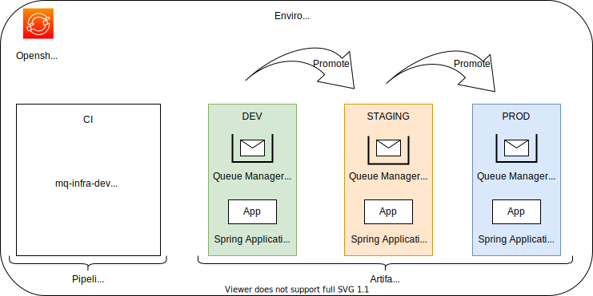
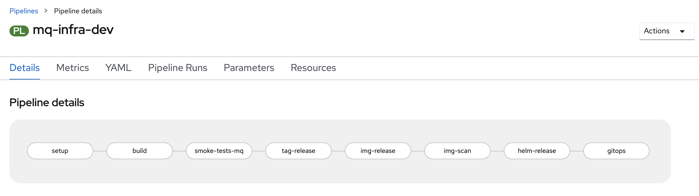
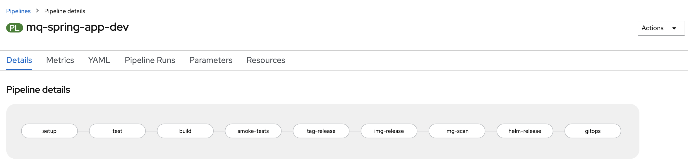
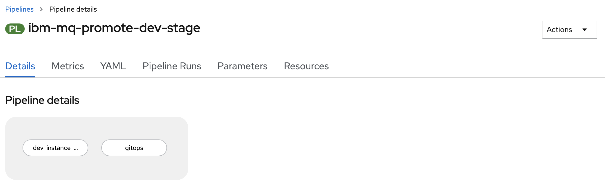
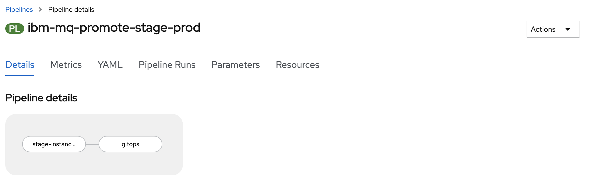
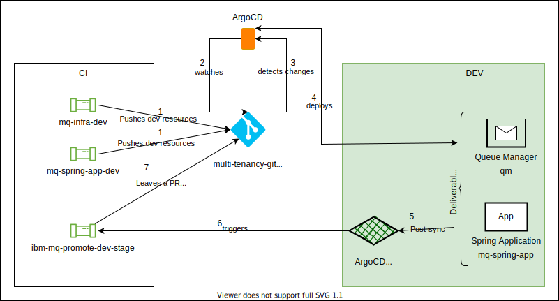
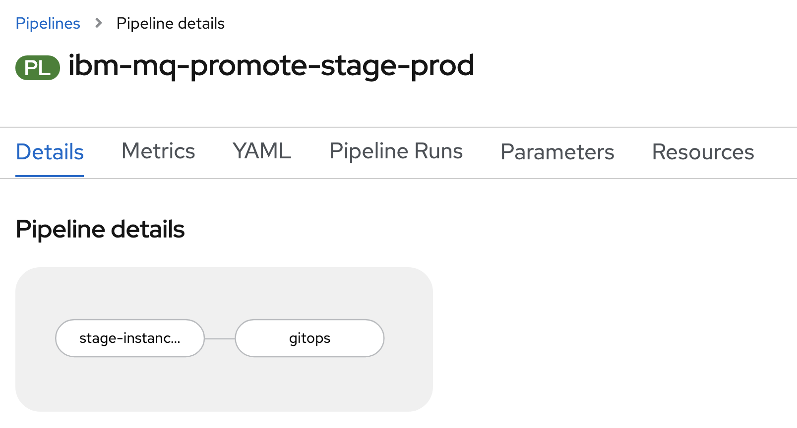
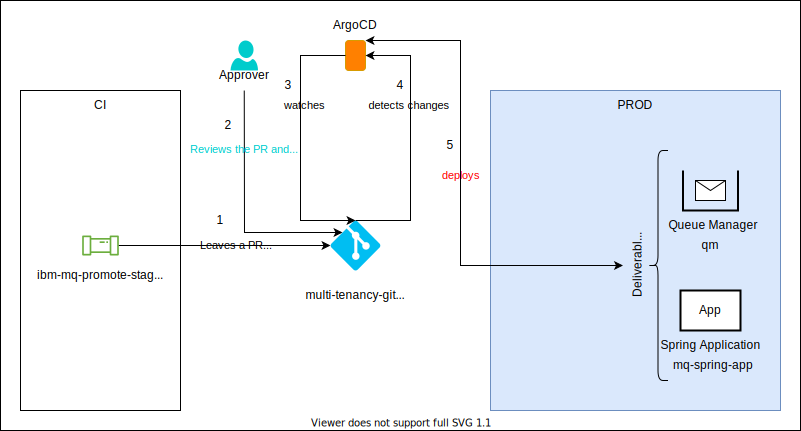

# Promoting across environments

<!--- cSpell:ignore  pipelinerun queuemanager sandboxing thouroughly usecase usecases appdomain automations jmeter Jmeter -->

## Overview

**Audience**: Architects, Application developers

Promoting across different environments means typically we move the services or applications from one level to the other. For instance, we start with development environment. This will eventually be promoted to staging for testing once the developers make sure things are working fine in development environment. After thorough testing, this will be promoted to production environment which will be the final environment that will be used by the intended users.

In this topic, we're going to:

* Deployment environments
* Promoting deliverables across environments
* CI Environment
* Development Environment
* Functional Testing
* Staging Environment
* Performance Testing
* Production Environment

---

## Deployment environments

For the basic promotion process, in our CI/CD process, typical environments include development, staging and production. Also, we are using a dedicated environment to run our CI/CD pipelines. These environments are defined as distinct projects within a cluster.

{: .center}

### Dev, Stage and Prod environments

**Dev** environment is the primary environment and it is used for sandboxing. During the development process, developers use this environment to test their code. This will allow them to thoroughly test the sample MQ application code, as well as the infrastructure code which contains the Queue Manager configurations.

**Staging** environment is sort of pre prod environment. All the sample MQ application deliverables that are ready to be pushed to the prod environment should be thouroughly tested here.

**Prod** environment will host all live services that belong to the MQ workloads. These deliverables will be consumed by the end user.

### CI environment

CI environment is used run all the MQ related pipelines. This includes all the tasks (custom / reusable task from [cloud native toolkit](https://cloudnativetoolkit.dev/)), pipelines, necessary triggers etc.

---

## Promoting deliverables across environments

For our sample use case, end to end basic promotion process is as follows.

{: .center}

1. For this sample usecase, we are maintaining two source code repositories for maintaining Queue Manager and a sample application that helps us to demonstrate the work flow. Webhooks are configured for all these repositories hooking them up with corresponding pipelines. If there are any updates to the source code, you can push changes to the respective repositories.
2. When the changes are pushed, underlying webhooks will trigger corresponding pipelines. When we make changes to the [mq-infra](https://github.com/cloud-native-toolkit/mq-infra) repository, it will trigger `mq-infra-dev` pipeline. Similarly, when we changes to the [mq-spring-app](https://github.com/cloud-native-toolkit/mq-spring-app) repository, it will trigger `mq-spring-app-dev` pipeline.
3. Once these pipelines are run successfully, the updated resources are pushed to the [dev](https://github.com/cloud-native-toolkit-demos/multi-tenancy-gitops-apps/tree/master/mq/environments/dev/) destination in the [Gitops Apps](https://github.com/cloud-native-toolkit-demos/multi-tenancy-gitops-apps) repository.
4. Subsequently, a dedicated ArgoCD application watches for the updates, which it deploys to the cluster in the `DEV` environment.
5. Once the deployment is successful, the `ibm-mq-promote-dev-stage` pipeline will be triggered.
6. If `ibm-mq-promote-dev-stage` pipeline runs successfully, it will make changes to the [staging](https://github.com/cloud-native-toolkit-demos/multi-tenancy-gitops-apps/tree/master/mq/environments/staging) resources and leave a Pull Request in the [Gitops Apps](https://github.com/cloud-native-toolkit-demos/multi-tenancy-gitops-apps) repository.
7. Then the Pull Request will be reviewed manually and the changes to the staging resources are merged into the [Gitops Apps](https://github.com/cloud-native-toolkit-demos/multi-tenancy-gitops-apps) repository.
8. Subsequently, a dedicated ArgoCD application watches for the updates, which it deploys to the cluster in the `STAGING` environment.
9. Once the deployment is successful, the `ibm-mq-promote-stage-prod` pipeline will be triggered.
10. If `ibm-mq-promote-stage-prod` pipeline runs successfully, it will make changes to the [prod](https://github.com/cloud-native-toolkit-demos/multi-tenancy-gitops-apps/tree/master/mq/environments/prod) resources and leave a Pull Request in the [Gitops Apps](https://github.com/cloud-native-toolkit-demos/multi-tenancy-gitops-apps) repository.
11. Then the Pull Request will be reviewed manually and the changes to the prod resources are merged into the [Gitops Apps](https://github.com/cloud-native-toolkit-demos/multi-tenancy-gitops-apps) repository.
12. Subsequently, a dedicated ArgoCD application watches for the updates, which it deploys to the cluster in the `PROD` environment.

---

## CI Environment

CI environment is our sample Continuous Integration space where we hosted all the necessary resources. This environment holds things like all the pipelines, tasks, triggers, etc.

### Available pipelines

Below are the four pipelines that are being used by the promotion process for the sample MQ workflow.

#### mq-infra-dev pipeline

{: .center}

When we add in new changes to the [MQ Infra](https://github.com/cloud-native-toolkit/mq-infra) repository, this pipeline will be triggered. This pipeline executes a set of tasks designed to ensure that the Queue Manager builds successfully. If every step is successful, the pipeline creates a new image and GitOps configuration.

#### mq-spring-app-dev pipeline

{: .center}

When we add in new changes to the [MQ Sample Application](https://github.com/cloud-native-toolkit/mq-spring-app) repository, this pipeline will be triggered. This pipeline executes a set of tasks designed to ensure that the Sample application builds successfully. If every step is successful, the pipeline creates a new image and GitOps configuration.

#### ibm-mq-promote-dev-stage pipeline

{: .center}

The pipeline executes a set of tasks designed to ensure that the Queue Manager or the MQ Sample application is passing a set of functional tests. If every step is successful, the pipeline updates Staging related GitOps configuration and leaves a Pull Request.

#### ibm-mq-promote-stage-prod pipeline

{: .center}

The pipeline executes a set of tasks designed to ensure that the Queue Manager or the MQ Sample application is passing a set of performance tests. If every step is successful, the pipeline updates Production related GitOps configuration and leaves a Pull Request.

---

## Development Environment

{: .center}

When the changes are made to the source repositories, respective pipelines will run and build the necessary deliverables. These deliverables will be deployed to the development environment and will be subjected to first phase of testing allowing to validate the deployment.

- This deployment in development environment is done by ArgoCD. ArgoCD’s role is to perform continuous deployment, ensuring that the cluster is always kept up-to-date with the latest built application.
- This is the first environment where the deliverable is deployed. If this deployment is a success, then this will be the first step that ensures that this deliverable can be promoted to production at some point of time.
- Once the deliverable is successfully deployed, we can validate different properties of the system which may functional or non-functional. Not only, we can also validate the configurations of the deliverable. In our sample promotion process, we showed an example of functional tests that are part of functional test pipeline. Depending on the usecases this pipeline can be further extended or modified.
- If everything works fine, we can promote the deliverable to next environment and deploy it there.

---

## Functional Testing

### Functional test Pipeline

{: .center}

**dev-instance-test**

- Clones the source repositories.
- Grabs the route of the deliverable.
- Performs [functional testing](#functional-test-task) using newman test scripts.
- Finally, returns the name of the deliverable.

**gitops**

- Clones the gitops apps repository.
- Copies the deliverables from dev to staging.
- Updates the helm chart with latest resources.
- Generate a Pull Request with the changes to gitops apps repository.

### Functional Test Task

In our sample functional test task, we are using Newman as our functional testing tool.

???+ note
     The contents in this guide are only examples. We demonstrated some of the practices using some sample usecases. For real world scenarios, it should be used in conjunction with existing QA practices and this content is not a replacement. For assistance, CSMs should reach out to QA SMEs.

#### Postman

- Postman is a tool that is used for API automation.
- This tools helps us to automate many tests like unit tests, integration tests, end to end tests etc.
- Based on the test scripts we define, this validates the respective APIs by making sure that the responses received are valid.
- It also allows us to save a bunch of API requests as a collection. Grouping the requests together will allow easier access.
- These collections can be exported as JSON files and stored.

#### Test scripts

For our sample, the Postman collection is exported as `mq-spring-app.postman_collection.json` and you can have a look at it [here](https://github.com/cloud-native-toolkit/mq-spring-app/blob/master/postman/mq-spring-app.postman_collection.json).

In this test script, we defined couple of API automations as follows.

- [Send message](https://github.com/cloud-native-toolkit/mq-spring-app/blob/master/postman/mq-spring-app.postman_collection.json#L9)
- [Receive message](https://github.com/cloud-native-toolkit/mq-spring-app/blob/master/postman/mq-spring-app.postman_collection.json#L27)
- [Send message POST](https://github.com/cloud-native-toolkit/mq-spring-app/blob/master/postman/mq-spring-app.postman_collection.json#L45)
- [health](https://github.com/cloud-native-toolkit/mq-spring-app/blob/master/postman/mq-spring-app.postman_collection.json#L72)
- [readiness](https://github.com/cloud-native-toolkit/mq-spring-app/blob/master/postman/mq-spring-app.postman_collection.json#L90)
- [liveness](https://github.com/cloud-native-toolkit/mq-spring-app/blob/master/postman/mq-spring-app.postman_collection.json#L109)

#### Newman

Newman is the command-line collection runner. It allows us to run the test scripts from the command line.

- This one can be easily used in the continuous integration and build systems.
- Like mentioned earlier, the collection that is exported as json files from Postman can be used to run the tests using Newman.

We are using the below command as part of our functional testing task.

```bash
newman run \
  --env-var base-url=$route \
  $test_file
```

We are passing the necessary route information along with the test json file.

#### Advantages

Some advantages are:

- Ensures all the APIs are working properly.
- Detects if any bugs exists.
- Helps us to improve the application and make it better.

---

## Staging Environment

{: .center}

When the Pull Request with the changes in staging resources get merged into the GitOps apps repository, the deliverables for staging environment will be updated. These deliverables will be deployed to the stage environment and will be subjected to second phase of testing allowing to validate the deployment.

- This deployment in staging environment is done by ArgoCD. ArgoCD’s role is to perform continuous deployment, ensuring that the cluster is always kept up-to-date with the latest built application.
- This is the next environment after dev where the deliverable is deployed and is exact replica of production environment. If this deployment is a success, then this will ensure that this deliverable can be promoted to production environment.
- Once the deliverable is successfully deployed, we can perform different tests like User Acceptance Tests (UAT), load/stress testing, chaos engineering tests etc. In our sample promotion process, we showed an example of load tests that are part of performance test pipeline. Depending on the usecases this pipeline can be further extended or modified.
- If everything works fine, we can promote the deliverable to next environment and deploy it there.

---

## Performance Testing

### Performance test Pipeline

{: .center}

**stage-instance-test**

- Clones the source repositories.
- Grabs the route of the deliverable.
- Performs [load testing](#performance-test-task) using jmeter test scripts.
- Finally, returns the name of the deliverable.

**gitops**

- Clones the gitops apps repository.
- Copies the deliverables from staging to prod.
- Updates the helm chart with latest resources.
- Generate a Pull Request with the changes to gitops apps repository.

### Performance Test Task

In our sample performance test task, we are using Jmeter as our performance load testing tool. The live data from Jmeter will be fed into a datastore. Based on this data, the metrics can be visualized using Grafana dashboard.

???+ note
     The contents in this guide are only examples. We demonstrated some of the practices using some sample usecases. For real world scenarios, it should be used in conjunction with existing performance practices and this content is not a replacement. For assistance, CSMs should reach out to performance SMEs.

#### Apache Jmeter

Jmeter is an open source java based tool. It helps us to measure the performance of the application. We can basically analyze the load functional behavior of the application.

- Jmeter simulates the load, for instance it simulates a group of users and keep sending requests to the target server.
- We can define a test plan script. All the necessary configurations will be provided here.
- Once we run the Jmeter tests, results will be available.

##### Sample test plan

Our sample app test plan can be accessed [here](https://github.com/cloud-native-toolkit/mq-spring-app/blob/master/jmeter/mq-spring-app.jmx).

If you have a look at the test plan, you will see different configuration elements.

For example, you can see `__P(route,mq-spring-app-dev.gitops-mq-ha-6ccd7f378ae819553d37d5f2ee142bd6-0000.tor01.containers.appdomain.cloud)` in one of the `ThreadGroup` elements. The default route here is `mq-spring-app-dev.gitops-mq-ha-6ccd7f378ae819553d37d5f2ee142bd6-0000.tor01.containers.appdomain.cloud`, but the route url is parameterized. We will be passing this information as part of pipeline.

##### Running jmeter tests

Below is the jmeter command we used as part of our tests.

```bash
${JMETER_BIN}/jmeter.sh \
    -n -t $(params.test-plan) \
    -Jroute=$route \
    -l /source/report.jtl
```

Here we are providing the test plan script along with the route to the Jmeter. Once the command is executed successfully, it loads the results into `/source/report.jtl` file.

#### Advantages

Some of the advantages are:

- Allows us to identify performance bottlenecks.
- Identify bugs.
- System downtime can be reduced.

---

## Production Environment

{: .center}

When the Pull Request with the changes in prod resources get merged into the GitOps apps repository, the deliverables for prod environment will be updated. These deliverables will be deployed to the prod environment.

- This deployment in production environment is done by ArgoCD. ArgoCD’s role is to perform continuous deployment, ensuring that the cluster is always kept up-to-date with the latest built application.
- This is the next environment after stage where the deliverable is finally deployed.
- Once the deliverable is successfully deployed, it will be made available to the end user.
