# Promoting from Staging to Prod environment

<!--- cSpell:ignore  pipelinerun mqsc msqc runmqsc dockerconfigjson queuemanager QMID podman ibmgaragecloud cntk cnkt eventid gitrevision gitrepositoryurl odowdaibm MQSC replicaset eventlistener triggerbinding triggertemplate mqcicd qmgr Artifactory configmaps OIDC CHLAUTH templating sealedsecret jmeter spl3ow gw8mgi -->

## Overview

**Audience**: Application developers, Administrators

In the [previous topic](promoting-environments-dev-stage.md) of this chapter, we ran the promotion pipeline for dev to staging. The pipeline successfully promoted the Queue Manager instance and MQ Sample application instance from `dev` to `staging`.

In this topic, you will set up a promotion pipeline that promotes the Queue Manager and MQ sample application from `staging` environment to `prod` environment. We'll activate the ArgoCD application that will watch the GitOps folder containing the Helm charts and use it and its dependent resources to deploy a running queue manager and sample application to the `prod` namespace in the cluster.

Look at the following diagram:

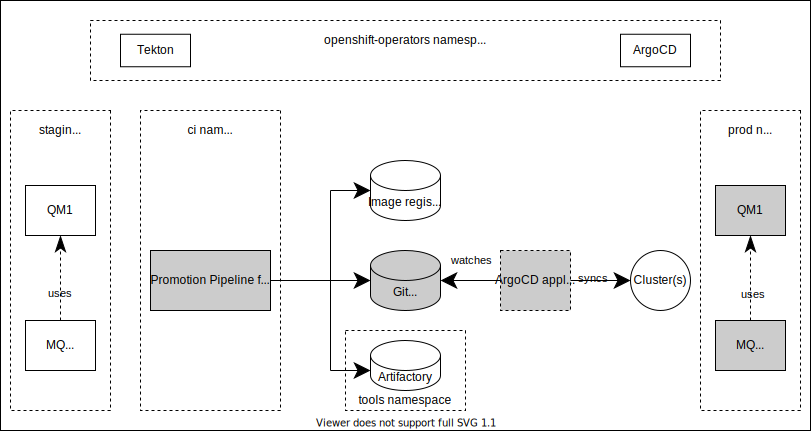

We've highlighted the components we're going to explore in this topic:

- The `promotion pipeline from staging to prod` will perform a set of tasks for performance testing. If successful, the pipeline leaves a PR in the GitOps apps repository.
- The `GitOps apps repository` will have a PR for the latest good build and test represented as a Helm chart for `prod` environment. This chart will be subsequently used by ArgoCD to deploy to the cluster.
- An `ArgoCD application` will monitor the GitOps folder where its Helm chart is held. Whenever this folder is updated, this ArgoCD application will apply these updates to the cluster, resulting in a new deployment.
- The instance of `Queue Manager` running in the cluster is active prod queue manager ready for use by MQ applications under prod.
- The instance of `MQ Sample Application` running in the cluster is active prod sample application under prod.

In this topic, we're going to:

* Access the promotion pipeline
* Run the promotion pipeline for `Queue Manager`
* Run the promotion pipeline for `MQ Sample Application`
* Explore the promotion pipeline.
* Activate ArgoCD application for `Queue Manager` and `MQ Sample Application` for prod namespace.
* Review the resultant GitOps application folders for `Queue Manager` and `MQ Sample Application`.
* Examine the activated ArgoCD application that deploys the `Queue Manager` and `MQ Sample Application` to the cluster.
* Validate `Queue Manager` and `MQ Sample Application`.

By the end of this topic we'll have a fully functioning staging to prod promotion pipeline that we can use to promote queue manager and sample application from staging environment to prod environment.

---

## Pre-requisites

Before attempting this topic, you should have successfully completed the
[previous chapter](promoting-environments-dev-stage.md).

---

## Access the promotion pipeline

As we can see in the diagram above, the promotion pipeline is responsible for promoting the `Queue Manager` and `MQ Sample application` from `staging` to `prod`. If successful, it leaves a PR with the updated resources for prod in the GitOps apps repository, which are used by ArgoCD to deploy the updated `Queue Manager` and `application` to the cluster.

It's usually the case a pipeline runs automatically when the Queue Manager or the Sample application is successfully deployed in staging environment. However, our first pipeline run is manual so that you can be in control, making it easier to understand what's happening.

  1. *Locate the `ci` pipelines in the web console*

    Let's find the promotion pipeline using the OpenShift web console.

    Navigate to `Pipelines->Pipelines` in the left hand pane, and select `Project: ci`, to show all pipelines in the `ci` namespace:

    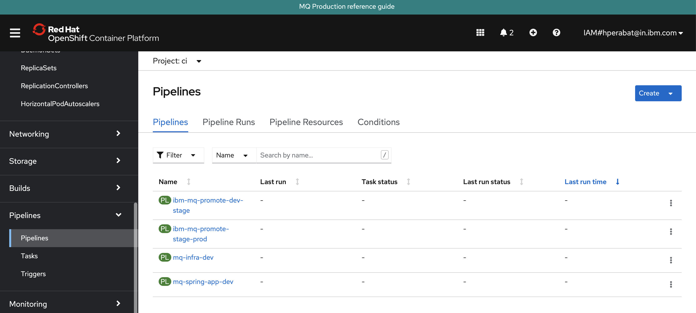

    You can see all the pipelines that we installed into the `ci` namespace in the
    previous chapter.  We'll use different pipelines for different activities
    throughout the tutorial.

    For this topic, we're going to use the `ibm-mq-promote-stage-prod` pipeline.
    When the `Queue Manager` or `Sample application` are successfully deployed
    to the `staging` namespace, this pipeline will perform performance testing and
    on a successful run, it will promote the existing resources in `staging` to
    the `prod` namespace.

  2. *The* `ibm-mq-promote-stage-prod` *promotion pipeline*

    Select the `ibm-mq-promote-stage-prod` pipeline from the list of all pipelines:

    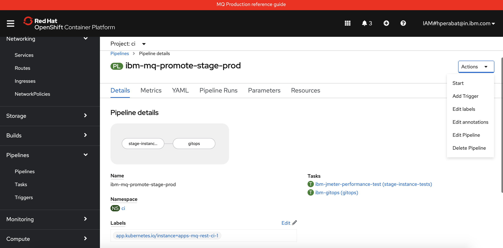

    Like all pipelines, `ibm-mq-promote-stage-prod` is composed from a set of **tasks**:

    * `stage-instance-tests`
    * `gitops`

    The task name often provides a strong hint of each task's specific function.
    We'll examine these tasks in detail as the pipeline runs.

  3. *The* `oc` *command as an alternative to the Web console*

    As well as using the OpenShift web console, you can also interact with
    pipeline using the `oc` or `tekton` commands.

    Ensure you're logged in to cluster, and issue the following command to list
    the `ibm-mq-promote-stage-prod` pipeline details:

    ```bash
    oc get pipeline ibm-mq-promote-stage-prod -n ci
    ```

    which shows a brief summary of the pipeline:

    ```bash
    NAME                        AGE
    ibm-mq-promote-stage-prod   5d18h
    ```

    You can get more detail by adding the `-o yaml` option; we'll do that later.

---

## Run the promotion pipeline  

### Queue Manager

  1. *Configure your first pipeline run*

    In `pipeline details` view above, you'll see an `Actions` button.  Select
    `Start` to configure a pipeline run.

    You'll be presented with the following dialog:

    

    The supplied arguments allow the user of the pipeline to configure its
    behavior. For example, a user can use this pipeline with different queue
    manager source repositories.

    Configure the run as follows:

    * Set `git-url` to your fork of the `mq-infra` repository
    * Set `git-revision` to `master`.
    * Set `src-environment` to `staging`.
    * Set `dest-environment` to `prod`.
    * Set the `app-path` pointing to your `GitOps apps repository` which in our case is `mq/environments`.
    * Set `git-pr` to `true`.
    * Set `test-file` pointing to your `jmeter jmx file`. If your source repository don't have any jmx file defined, just leave the defaults.

    ???+ Note
         At the moment, Queue Manager `mq-infra` repository do not have any performance tests defined using Jmeter. This pipeline is designed in a way to skip this tests if the definitions are not present. However, MQ Sample application `mq-spring-app` repository have these tests defined and we will be coming across it in the later section of this tutorial.

    Hit `Start` to start the pipeline run.

    You can also use the command line to run a pipeline; we'll explore that option
    later.

  2. *Watch a pipeline run executing*

    The pipeline run has now started.

    Notice how the view changes to `Pipeline Run details`:

    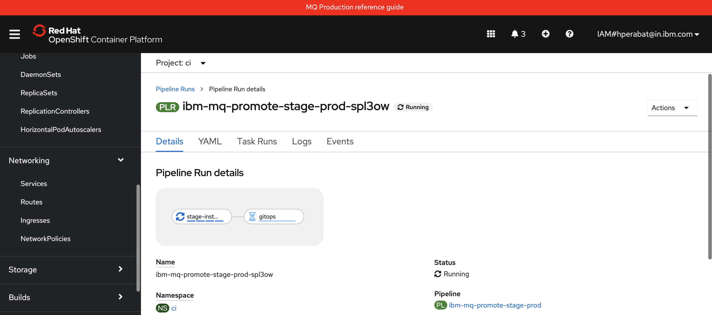

    We're now looking at the live output from a pipeline run, rather than the
    pipeline used to create the run.

    Notice that the pipeline run name `ibm-mq-promote-stage-prod-spl3ow` is based on the pipeline name -- with a unique suffix. Every new pipeline run will have a
    unique name.

    See also how the first `stage-instance-tests` task is running, while the remaining tasks are waiting to start.

    Hover over `stage-instance-tests` task and you will see the **steps** that
    comprise it.

  3. *Watch pipeline steps complete*

    As the pipeline run proceeds, notice all the steps got completed:

    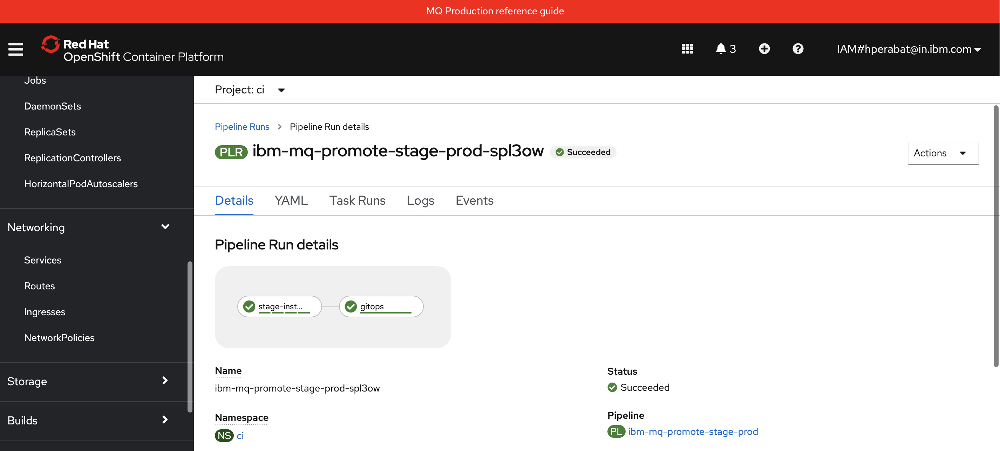

    This pipeline will take about a minute or two to complete.

### MQ Sample Application

  1. *Configure your first pipeline run*

    In `pipeline details` view above, you'll see an `Actions` button.  Select
    `Start` to configure a pipeline run.

    You'll be presented with the following dialog:

    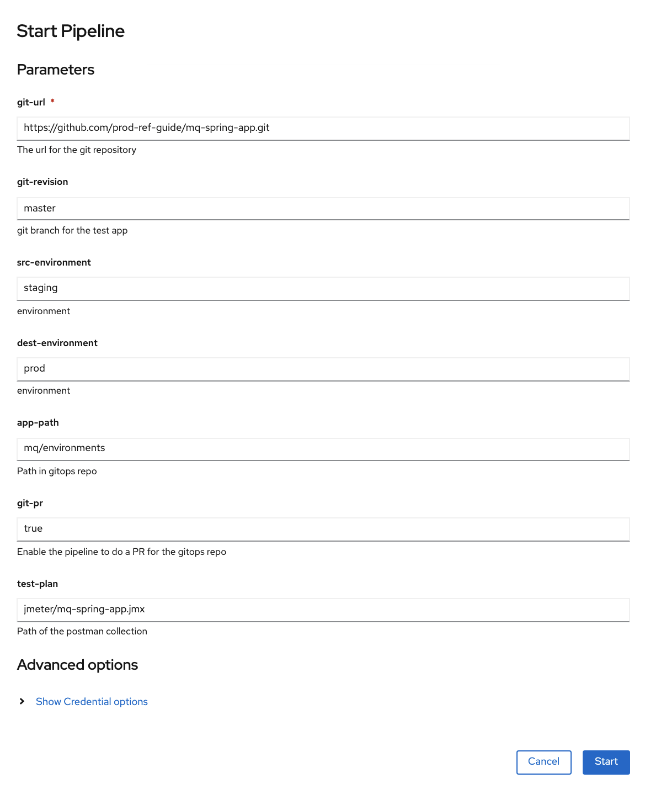

    The supplied arguments allow the user of the pipeline to configure its
    behavior. For example, a user can use this pipeline with different sample
    application source repositories.

    Configure the run as follows:

    * Set `git-url` to your fork of the `mq-spring-app` repository
    * Set `git-revision` to `master`.
    * Set `src-environment` to `staging`.
    * Set `dest-environment` to `prod`.
    * Set the `app-path` pointing to your `GitOps apps repository` which in our case is `mq/environments`.
    * Set `git-pr` to `true`.
    * Set `test-plan` pointing to your `jmeter jmx file`. If your source repository don't have any jmx file, just leave the defaults. `mq-spring-app` repository have the jmx file defined at `jmeter/mq-spring-app.jmx` using Jmeter.

    Hit `Start` to start the pipeline run.

    You can also use the command line to run a pipeline; we'll explore that option
    later.

  2. *Watch a pipeline run executing*

    The pipeline run has now started.

    Notice how the view changes to `Pipeline Run details`:

    

    We're now looking at the live output from a pipeline run, rather than the
    pipeline used to create the run.

    Notice that the pipeline run name `ibm-mq-promote-stage-prod-gw8mgi` is based on the pipeline name -- with a unique suffix. Every new pipeline run will have a
    unique name.

    See also how the first `stage-instance-tests` task is running, while the remaining tasks are waiting to start.

    Hover over `stage-instance-tests` task and you will see the **steps** that
    comprise it.

  3. *Watch pipeline steps complete*

    As the pipeline run proceeds, notice all the steps got completed:

    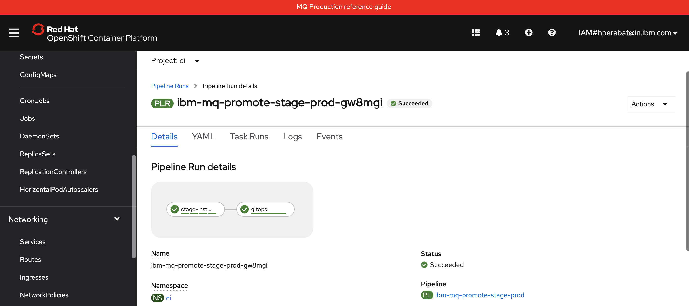

    This pipeline will take about a minute or two to complete.

---

## Explore the promotion pipeline

Let's look more closely at how the `ibm-mq-promote-stage-prod` pipeline is
structured. Let's also examine the tasks and steps that make up the
pipeline, and how they progressively validate the deployments in `staging` namespace, resulting
in the production of a Helm chart ready for deployment in `prod` namespace.

  1. *Pipeline, Task, Step*

    Let's start with the pipeline, its tasks and steps.

    Hover over the `stage-instance-tests` task:

    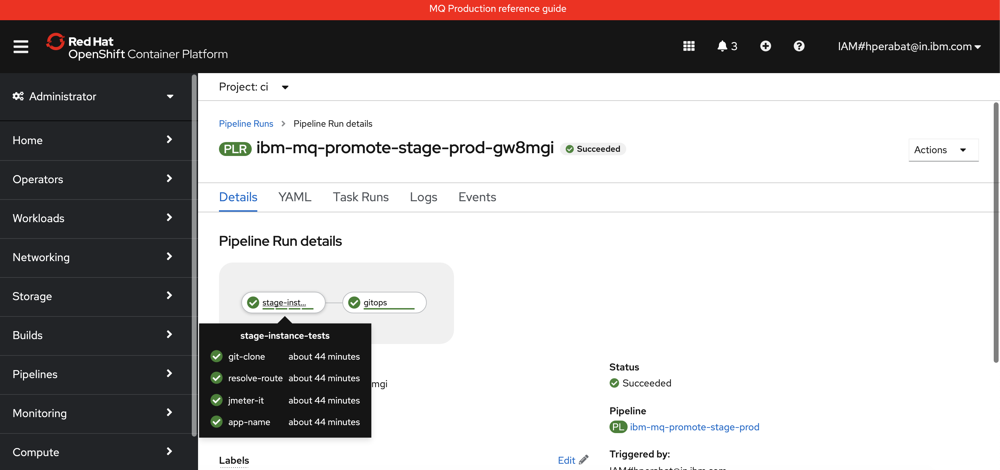

    See how our pipeline is made up of tasks such as `stage-instance-tests` and
    `gitops`. These run in the order defined by the pipeline. Our pipeline is
    linear, though Tekton supports more sophisticated pipeline graphs if
    necessary.

    See how each task comprises a set of steps such as `git-clone` or `setup`.
    These run in the order defined by the task.

  2. *The pipeline run logs*

    When a pipeline runs, all its output is captured in a set of logs, one for
    each task.

    Click on the `stage-instance-tests` task to show its logs:

    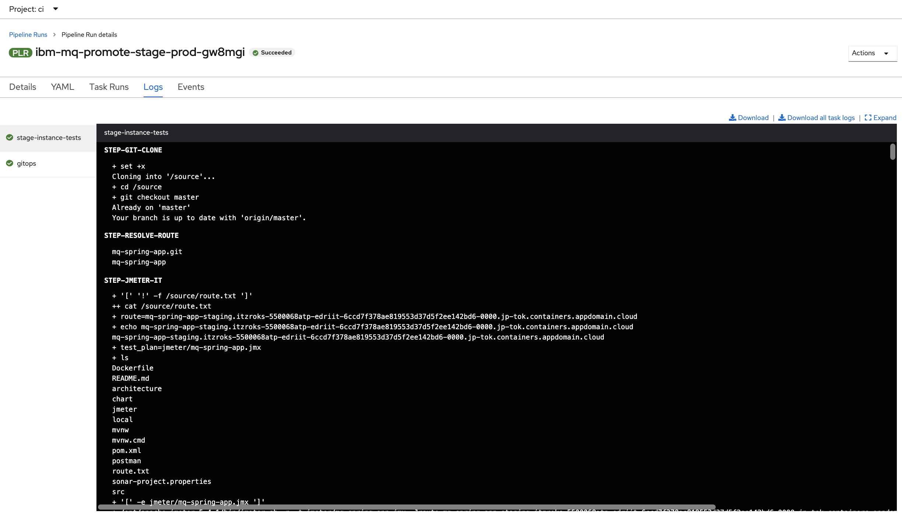

    (*Alternatively, you can select the `Logs` tab from the UI, and then select
    the tasks on the left pane within the pipeline run view.*)

    See how the `stage-instance-tests` task has its output in a dedicated log. You can select any
    log for any task that has completed or is executing. When a pipeline run
    completes, all its logs remain available, which can help diagnosing problems
    for example.

  3. *Exploring an example task output:* `stage-instance-tests`

    It's easy to examine a task log; you simply select the relevant task and
    scroll the log up or down. For active tasks the log will be dynamically
    updated.

    Click on the `stage-instance-tests` task:

    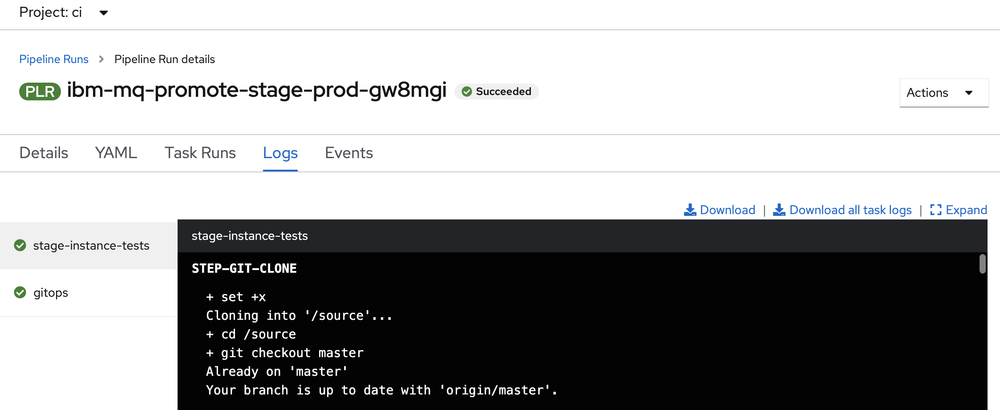

    This console window shows the output generated by `stage-instance-tests` task.  As the task
    script proceeds, its output is captured; that's what we can see in this
    window.

    Notice that the `stage-instance-tests` task output is from the **first step** in the `stage-instance-tests` task. This step is called `STEP-GIT-CLONE`. Note how the step names are
    capitalized in the web console output.

    Let's look at another task and its steps more closely.

  4. *Exploring a task step in detail*: `STEP-JMETER-IT`

    A task is built of multiple steps. Let's explore the `stage-instance-tests` task and its
    `step-jmeter-it` step.

    Select the `stage-instance-tests` task and scroll through its logs to see its **third
    step**, `STEP-JMETER-IT`:

    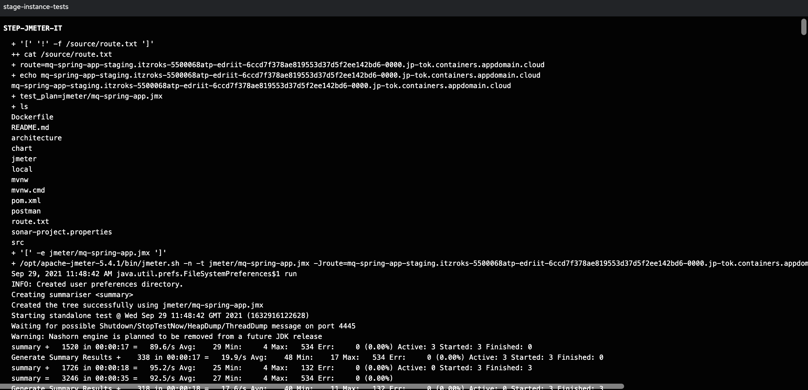

    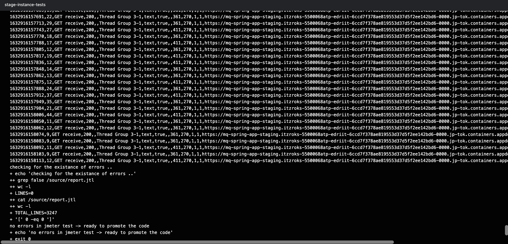

    See how the `step-jmeter-it` output is captured in the same log as the previous
    step `git-clone`.

  5. *The pipeline definition*

    Up to this point, we've examined the pipeline run and the logs it
    generates. Let's now look at how a pipeline is defined.

    Issue the following command to show the `ibm-mq-promote-stage-prod` pipeline:

    ```bash
    oc describe pipeline ibm-mq-promote-stage-prod -n ci
    ```

    which shows the pipeline YAML in considerable detail:

    ```yaml
    Name:         ibm-mq-promote-stage-prod
    Namespace:    ci
    Labels:       app.kubernetes.io/instance=apps-mq-rest-ci-1
    Annotations:  app.openshift.io/runtime: test
    API Version:  tekton.dev/v1beta1
    Kind:         Pipeline
    Metadata:
      Creation Timestamp:  2021-09-23T17:29:24Z
      Generation:          1
      Managed Fields:
        API Version:  tekton.dev/v1beta1
        Fields Type:  FieldsV1
        fieldsV1:
          f:metadata:
            f:annotations:
              .:
              f:app.openshift.io/runtime:
              f:kubectl.kubernetes.io/last-applied-configuration:
            f:labels:
              .:
              f:app.kubernetes.io/instance:
          f:spec:
            .:
            f:params:
            f:tasks:
        Manager:         argocd-application-controller
        Operation:       Update
        Time:            2021-09-23T17:29:24Z
      Resource Version:  2478082
      Self Link:         /apis/tekton.dev/v1beta1/namespaces/ci/pipelines/ibm-mq-promote-stage-prod
      UID:               d7ed2886-97f4-4c89-beb7-dd9c343dabf1
    Spec:
      Params:
        Description:  The url for the git repository
        Name:         git-url
        Type:         string
        Default:      master
        Description:  git branch for the test app
        Name:         git-revision
        Type:         string
        Default:      staging
        Description:  environment
        Name:         src-environment
        Type:         string
        Default:      prod
        Description:  environment
        Name:         dest-environment
        Type:         string
        Default:      mq/environments
        Description:  Path in gitops repo
        Name:         app-path
        Type:         string
        Default:      true
        Description:  Enable the pipeline to do a PR for the gitops repo
        Name:         git-pr
        Type:         string
        Default:      jmeter/test.jmx
        Description:  Path of the postman collection (jmeter/mq-spring-app.jmx)
        Name:         test-plan
        Type:         string
      Tasks:
        Name:  stage-instance-tests
        Params:
          Name:   git-url
          Value:  $(params.git-url)
          Name:   src-environment
          Value:  $(params.src-environment)
          Name:   test-plan
          Value:  $(params.test-plan)
        Task Ref:
          Kind:  Task
          Name:  ibm-jmeter-performance-test
        Name:    gitops
        Params:
          Name:   app-name
          Value:  $(tasks.stage-instance-tests.results.app-name)
          Name:   src-environment
          Value:  $(params.src-environment)
          Name:   dest-environment
          Value:  $(params.dest-environment)
          Name:   app-path
          Value:  $(params.app-path)
          Name:   git-pr
          Value:  $(params.git-pr)
        Run After:
          stage-instance-tests
        Task Ref:
          Kind:  Task
          Name:  ibm-gitops
    Events:      <none>
    ```

    Don't be intimidated by this output -- it's actually just a more detailed
    source view of the information shown for the `ibm-mq-promote-stage-prod`
    pipeline in the web console.

    Locate the following key structures in the `Pipeline` YAML:

    * `API Version: tekton.dev/v1beta1` and `Kind: Pipeline` identify this as
      a Tekton pipeline.
    * `Spec: Params` identifies the **pipeline input parameters**
    * `Tasks:` is a list of the tasks in this pipeline, each of which has
      * A `Name:` naming the task
      * A set of `Params:` identifying the **task input parameters**
      * An optional `Run After:` value indicating when the task is run
      * A `Task Ref:` identifying the actual task code to be run using the
        task's input

    Notice that there's **no code** in the pipeline definition; instead, the
    definition specifies the required inputs to the pipeline, as well as the set
    of required tasks and their order of execution. The code executed by each task
    is identified by `Task Ref:`, rather than in the pipeline; the pipeline
    definition merely defines the order of task execution and how parameters are
    marshaled between tasks.

    Let's now examine the pipeline definition in a little more detail.

  6. *The pipeline input* `Spec: Params`

    When we configure a pipeline run, the arguments map precisely to `Spec:
    Params` in the pipeline YAML file.

    Below, we've just shown the `Spec: Params:` for the `ibm-mq-promote-stage-prod` pipeline:

    ```yaml
    Spec:
      Params:
        Description:  The url for the git repository
        Name:         git-url
        Type:         string
        Default:      master
        Description:  git branch for the test app
        Name:         git-revision
        Type:         string
        Default:      staging
        Description:  environment
        Name:         src-environment
        Type:         string
        Default:      prod
        Description:  environment
        Name:         dest-environment
        Type:         string
        Default:      mq/environments
        Description:  Path in gitops repo
        Name:         app-path
        Type:         string
        Default:      true
        Description:  Enable the pipeline to do a PR for the gitops repo
        Name:         git-pr
        Type:         string
        Default:      jmeter/test.jmx
        Description:  Path of the postman collection (jmeter/mq-spring-app.jmx)
        Name:         test-plan
        Type:         string
    ```

    Spend a few moments mapping each of these parameters maps to those on the
    `Start Pipeline` input dialog where you specified the pipeline run arguments.
    For example, map `Name:`, `Description:`  and `Default:` to the different
    fields in the dialog.

  7. *Parameters for the first* `setup` *task*

    We can see that the first task in the pipeline is called `stage-instance-tests`. Let's
    examine its YAML to see how it gets its input parameters:

    ```yaml
    Tasks:
      Name:  stage-instance-tests
      Params:
        Name:   git-url
        Value:  $(params.git-url)
        Name:   src-environment
        Value:  $(params.src-environment)
        Name:   test-plan
        Value:  $(params.test-plan)
      Task Ref:
        Kind:  Task
        Name:  ibm-jmeter-performance-test
    ```

    See how the `dev-instance-tests` task derives its `git-url` parameter using the
    **pipeline** input parameter value `$(params.git-url)`. See how `src-environment`
    and `test-plan` work in a similar way. The first task in a pipeline typically
    works like this -- its parameters are mapped from the pipeline's input
    parameters.

    Notice also that some pipeline input parameters are not referred to by the
    `stage-instance-tests` task; they will be used by subsequent tasks using the appropriate
    `$(params.)` value.

  8. *Passing arguments between tasks*

    As each task completes, the pipeline proceeds. When a new task starts it often
    requires one or more results generated by a previous task.

    We can see a good example of this in the `gitops` task:

    ```yaml
    Name:    gitops
    Params:
      Name:   app-name
      Value:  $(tasks.stage-instance-tests.results.app-name)
      Name:   src-environment
      Value:  $(params.src-environment)
      Name:   dest-environment
      Value:  $(params.dest-environment)
      Name:   app-path
      Value:  $(params.app-path)
      Name:   git-pr
      Value:  $(params.git-pr)
    Run After:
      stage-instance-tests
    Task Ref:
      Kind:  Task
      Name:  ibm-gitops
    ```

    See how the `gitops` task specifies that the `app-name` parameter should use
    value generated by the `stage-instance-tests` task using the syntax:
    `$(tasks.stage-instance-tests.results.app-name)`.

    Also notice how the `gitops` tasks uses `Run After:` to specify that it should
    execute **after** the `stage-instance-tests` task. This follows the Kubernetes idiom of
    resources being declarative -- the order of execution is defined by
    `RunAfter:` rather than the order in which tasks appear in the YAML.

    Again, notice that the `gitops` task **doesn't** contain the code that the task
    executes. This is contained in `Task Ref:` which identifies
    `ibm-gitops` as the task to execute using the specified
    parameters.  It's the code in `ibm-gitops` which generates the
    log output for the task; we'll examine it later.

    The way pipelines tasks are designed makes them highly reusable. As we'll see
    later, tasks are written with defined inputs and outputs such that they can be
    re-used by different pipelines. Pipelines focus on organizing the order of
    task execution and how parameters are marshaled into and between tasks; it's
    the tasks that do the actual work.

  9. *Locating the pipeline and tasks source YAMLs*

    Finally, let's locate the source for the `ibm-mq-promote-stage-prod` pipeline and the tasks
    within it.

    It is located in the following folder:

    ```bash
    cd $HOME/git
    cd multi-tenancy-gitops-apps
    tree mq/environments/ci/pipelines/
    ```

    We can see the other pipelines for the `ci` namespace in this folder:

    ```bash
    mq/environments/ci/pipelines/
    ├── ibm-test-pipeline-for-dev.yaml
    ├── ibm-test-pipeline-for-stage.yaml
    ├── java-maven-dev-pipeline.yaml
    ├── mq-pipeline-dev.yaml
    └── mq-spring-app-dev-pipeline.yaml
    ```

    These map to the MQ-related pipelines we saw in the `Pipelines->Pipelines`
    view in the web console.

  10. *Exploring the* `ibm-mq-promote-stage-prod` *source YAML*

    View the source for the `ibm-test-pipeline-for-stage.yaml` pipeline with the command:

    ```bash
    cat mq/environments/ci/pipelines/ibm-test-pipeline-for-stage.yaml
    ```

    which shows the source YAML for the `ibm-mq-promote-dev-stage` pipeline:

    ```yaml
    apiVersion: tekton.dev/v1beta1
    kind: Pipeline
    metadata:
      name: ibm-mq-promote-stage-prod
      annotations:
        app.openshift.io/runtime: test
    spec:
      params:
        - name: git-url
          description: The url for the git repository
        - name: git-revision
          description: git branch for the test app
          default: master
        - name: src-environment
          description: environment
          default: staging
        - name: dest-environment
          description: environment
          default: prod
        - name: app-path
          description: Path in gitops repo
          default: mq/environments
        - name: git-pr
          description: Enable the pipeline to do a PR for the gitops repo
          default: "true"
        - name: test-plan
          description: Path of the postman collection (jmeter/mq-spring-app.jmx)
          default: "jmeter/test.jmx"
      tasks:
        - name: stage-instance-tests
          taskRef:
            name: ibm-jmeter-performance-test
          params:
            - name: git-url
              value: "$(params.git-url)"
            - name: src-environment
              value: "$(params.src-environment)"
            - name: test-plan
              value: "$(params.test-plan)"
        - name: gitops
          taskRef:
            name: ibm-gitops
          runAfter:
            - stage-instance-tests
          params:
            - name: app-name
              value: "$(tasks.stage-instance-tests.results.app-name)"
            - name: src-environment
              value: "$(params.src-environment)"
            - name: dest-environment
              value: "$(params.dest-environment)"
            - name: app-path
              value: "$(params.app-path)"
            - name: git-pr
              value: "$(params.git-pr)"
    ```

    This YAML is *slightly* different to the output of the `oc get pipeline`
    command, because extra information is added during deployment such as
    `Creation Timestamp:`.

  11. *Finding the ArgoCD application that manages pipelines*

    You can see how the `ibm-mq-promote-stage-prod` and other pipeline YAMLs were deployed by
    examining the ArgoCD application that watches the folder containing the `ci`
    namespace pipelines.

    Issue the following command:

    ```bash
    cat mq/config/argocd/ci/ci-app-rest.yaml
    ```

    which shows the `apps-mq-rest-ci-1` ArgoCD application that watches for updates:

    ```yaml
    apiVersion: argoproj.io/v1alpha1
    kind: Application
    metadata:
      name: apps-mq-rest-ci-1
      annotations:
        argocd.argoproj.io/sync-wave: "300"
      finalizers:
        - resources-finalizer.argocd.argoproj.io
    spec:
      destination:
        namespace: ci
        server: https://kubernetes.default.svc
      project: applications
      source:
        path: mq/environments/ci
        repoURL: https://github.com/hp-gitops-test/multi-tenancy-gitops-apps
        targetRevision: master
      syncPolicy:
        automated:
          prune: true
          selfHeal: true
    ```

    See how this `apps-mq-rest-ci-1` watches: `path: mq/environments/ci`. As
    we know, this folder contains the YAML for the `ibm-mq-promote-stage-prod` and other
    pipelines under `pipelines` folder. When this ArgoCD application was made
    active in the cluster, it installed all the pipelines along with other
    resources in this folder.

---

## Activate ArgoCD Applications

We're now going to activate the ArgoCD applications to manage the deployment of `Queue Manager` and `MQ Sample application` to the `prod` namespace.

  1. *Ensure you're logged in to the cluster*

    Start a terminal window and log into your OCP cluster, substituting the
    `--token` and `--server` parameters with your values:

    ```bash
       oc login --token=<token> --server=<server>
    ```

    If you are unsure of these values, click your user ID in the OpenShift web
    console and select "Copy Login Command".

  2. *Locate your GitOps repository*

    If necessary, change to the root of your GitOps repository, which is typically
    `$HOME/git`.

    Issue the following command to change to your GitOps repository:

    ```bash
    cd $HOME/git
    cd multi-tenancy-gitops
    ```

  3. *Select resources to deploy*

    Access the `0-bootstrap/single-cluster/3-apps/kustomization.yaml`:

    ```bash
    cat 0-bootstrap/single-cluster/3-apps/kustomization.yaml
    ```

    Open `0-bootstrap/single-cluster/3-apps/kustomization.yaml` and uncomment the below:

    ```bash
    - argocd/mq/prod.yaml
    ```

    Once modified, it should be something like below:

    ```bash
    resources:
    #- argocd/ace/cicd.yaml
    #- argocd/ace/dev.yaml
    #- argocd/ace/stage.yaml
    #- argocd/ace/prod.yaml

    - argocd/mq/cicd.yaml
    - argocd/mq/dev.yaml
    - argocd/mq/stage.yaml
    - argocd/mq/prod.yaml

    #- argocd/apic/cicd.yaml
    #- argocd/apic/dev.yaml
    #- argocd/apic/stage.yaml
    #- argocd/apic/prod.yaml

    #- argocd/bookinfo/cicd.yaml
    #- argocd/bookinfo/dev.yaml
    #- argocd/bookinfo/stage.yaml
    #- argocd/bookinfo/prod.yaml

    #- argocd/soapserver/soapserver.yaml

    patches:
    - target:
        group: argoproj.io
        kind: Application
        labelSelector: "gitops.tier.layer=applications"
      patch: |-
        - op: add
          path: /spec/source/repoURL
          value: https://github.com/prod-ref-guide/multi-tenancy-gitops-apps.git
        - op: add
          path: /spec/source/targetRevision
          value: master
    ```

  4. *Push GitOps changes to GitHub*

    Let’s make these GitOps changes visible to the ArgoCD
    `applications` application via GitHub.

    Add all changes in the current folder to a git index, commit
    them, and push them to GitHub:

    ```bash
    git add .
    git commit -s -m "Activating prod instance for queue manager and sample app"
    git push origin $GIT_BRANCH
    ```

    The changes have now been pushed to your GitOps repository:

    ```bash
    Enumerating objects: 11, done.
    Counting objects: 100% (11/11), done.
    Delta compression using up to 8 threads
    Compressing objects: 100% (6/6), done.
    Writing objects: 100% (6/6), 515 bytes | 257.00 KiB/s, done.
    Total 6 (delta 5), reused 0 (delta 0)
    remote: Resolving deltas: 100% (5/5), completed with 5 local objects.
    To https://github.com/hp-gitops-mq/multi-tenancy-gitops.git
       3225847..25f7459  master -> master
    ```

    This change to the GitOps repository can now be used by ArgoCD.

  5. *The `applications` argocd application*

    Let's examine the ArgoCD application that manage the **applications** in
    our reference architecture.

    In the ArgoCD UI **Applications** view, click on the icon for the
    `applications` application:

    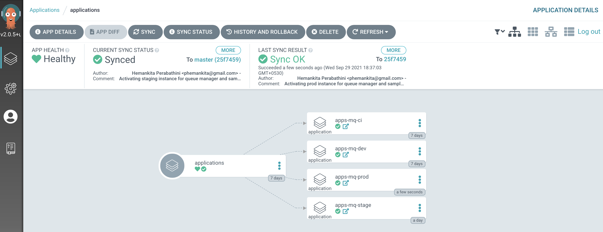

---

## Review the resultant GitOps application folders

The result of our previously successful `ibm-mq-promote-stage-prod` pipeline runs was to
leave a PR in a GitOps folder for `Queue Manager` and `MQ Sample application`. This PR create a Helm chart if one is not present in the `prod` folder. If the Helm chart is already there, it updates the `version` in the `requirements.yaml` to match the latest deployment currently residing in the `staging` namespace.

  1. *Ensure you've set up the $GIT_ORG environment variable*

    This chapter also uses environment variables to save typing and reduce errors.

    Let's set up an environment variable, `$GIT_ORG`, that contains your GitHub organization name. We'll use this variable in many subsequent commands.

    **Open a new terminal window**.

    Replace `<git-org>` in the following command with your GitHub user name:

    ```bash
    export GIT_ORG=<git-org>
    ```

    You can verify your `$GIT_ORG` as follows:

    ```bash
    echo $GIT_ORG
    ```

    which will show your GitHub Organization, for example:

    ```bash
    prod-ref-guide
    ```

  2. *Grab the `multi-tenancy-gitops-apps` repository url*

    Issue the below command to get the GitOps apps repository url.

    ```bash
    echo https://github.com/$GIT_ORG/multi-tenancy-gitops-apps/pulls
    ```

    which will give you an url, for instance:

    ```bash
    https://github.com/prod-ref-guide/multi-tenancy-gitops-apps/pulls
    ```

  3. *Review the Pull Requests created by `ibm-mq-promote-dev-stage` pipeline*

    Open the above url in your browser and you will see Pull Requests generated by the `ibm-mq-promote-dev-stage` pipeline.

    

    Merge these Pull Requests.

    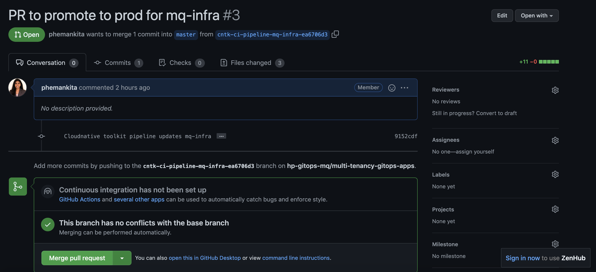

    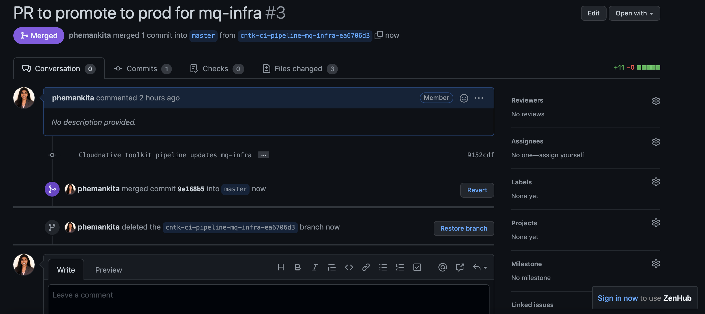

    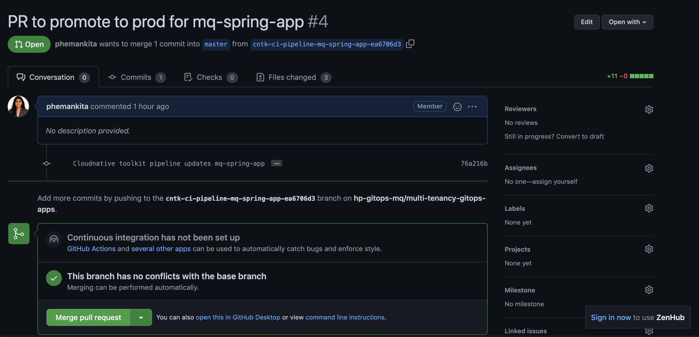

    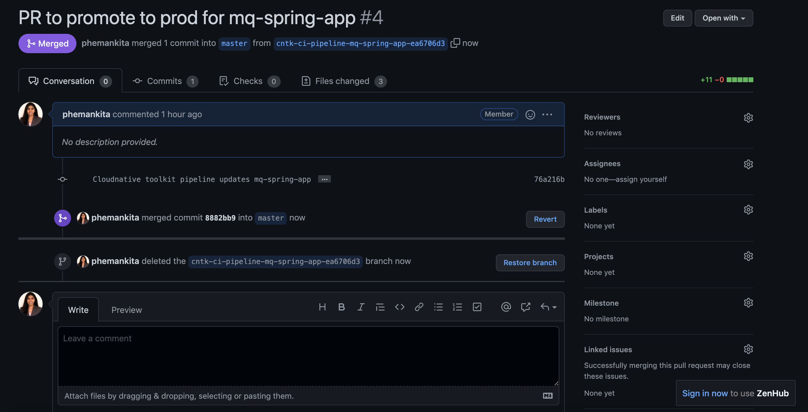

  4. *Re-merging local clone to view prod resources in GitOps apps repository*

    The `ibm-mq-promote-stage-prod` pipeline left a Pull request and we merged the changes in the previous step. This means that our local clone of the GitOps repository is one commit behind GitHub. To allow us to view the changes locally, we must re-merge our local branch with GitHub.

    **Return to the terminal window** you're using for the `multi-tenancy-gitops-apps` GitOps apps repository.

    Issue the following command to change to your GitOps apps repository:

    ```bash
    cd $HOME/git
    cd multi-tenancy-gitops-apps
    ```

    Issue the following commands to merge the local branch:

    ```bash
    git fetch origin
    git merge origin/$GIT_BRANCH
    ```

    which shows our local branch being updated:

    ```bash
    Updating ea6706d..8882bb9
    Fast-forward
     mq/environments/prod/mq-infra/Chart.yaml             | 4 ++++
     mq/environments/prod/mq-infra/requirements.yaml      | 4 ++++
     mq/environments/prod/mq-infra/values.yaml            | 3 +++
     mq/environments/prod/mq-spring-app/Chart.yaml        | 4 ++++
     mq/environments/prod/mq-spring-app/requirements.yaml | 4 ++++
     mq/environments/prod/mq-spring-app/values.yaml       | 3 +++
     6 files changed, 22 insertions(+)
     create mode 100644 mq/environments/prod/mq-infra/Chart.yaml
     create mode 100644 mq/environments/prod/mq-infra/requirements.yaml
     create mode 100644 mq/environments/prod/mq-infra/values.yaml
     create mode 100644 mq/environments/prod/mq-spring-app/Chart.yaml
     create mode 100644 mq/environments/prod/mq-spring-app/requirements.yaml
     create mode 100644 mq/environments/prod/mq-spring-app/values.yaml
    ```

    Notice how these files correspond to the new Helm chart created in the GitOps apps repository by the `ibm-mq-promote-stage-prod` pipeline run.

  5. *Explore the Helm chart in the GitOps Apps repository*

    Let's examine the newly produced Helm charts in the GitOps apps repository; it was created by the previous pipeline runs.

    Issue the following command:

    ```bash
    tree mq/environments/prod/mq-infra/
    ```

    which shows the newly produced Helm chart:

    ```bash
    mq/environments/prod/mq-infra/
    ├── Chart.yaml
    ├── requirements.yaml
    └── values.yaml
    ```

    Notice that:

    - The chart for `Queue Manager` was created in the `mq/environments/` folder to reflect the fact this queue manager is part of the **applications** layer.
    - The chart was created in the `prod` subfolder to reflect the fact that it's going to be deployed to the `prod` namespace.
    - The chart was created in a new folder `/mq-infra`. This folder is dedicated to `Queue Manager`.

    Issue the following command:

    ```bash
    tree mq/environments/prod/mq-spring-app/
    ```

    which shows the newly produced Helm chart:

    ```bash
    mq/environments/prod/mq-spring-app/
    ├── Chart.yaml
    ├── requirements.yaml
    └── values.yaml
    ```

    Notice that:

    - The chart for `MQ Sample application` was created in the `mq/environments/` folder to reflect the fact this application is part of the **applications** layer.
    - The chart was created in the `prod` subfolder to reflect the fact that it's going to be deployed to the `prod` namespace.
    - The chart was created in a new folder `/mq-spring-app`. This folder is dedicated to `MQ Sample application`.

---

## Examine the activated ArgoCD applications

We're now going to examine the activated ArgoCD applications that uses the above Helm charts
to manage the deployment of `Queue Manager` and `MQ Sample application` to the `prod` namespace.

### Queue Manager

  1. *The ArgoCD application for Queue Manager*

    `QM1` has its deployment to the cluster managed by a dedicated ArgoCD
    application called `prod-mq-infra-instance`.

    Issue the following command to show the ArgoCD application details:

    ```bash
    cat mq/config/argocd/prod/prod-mq-infra-instance.yaml
    ```

    which shows a YAML file typical of those we've seen before:

    ```bash
    apiVersion: argoproj.io/v1alpha1
    kind: Application
    metadata:
      name: prod-mq-infra-instance
      annotations:
        argocd.argoproj.io/sync-wave: "300"
      finalizers:
        - resources-finalizer.argocd.argoproj.io
    spec:
      destination:
        namespace: prod
        server: https://kubernetes.default.svc
      project: applications
      source:
        path: mq/environments/prod/mq-infra
        repoURL: https://github.com/hp-gitops-mq/multi-tenancy-gitops-apps
        targetRevision: master
        helm:
          valueFiles:
          - values.yaml
      syncPolicy:
        automated:
          prune: true
          selfHeal: true
    ```

    See how the Helm chart we explored in the previous section of this topic is referenced by `path: mq/environments/prod/mq-infra`:

    ```bash
    mq/environments/prod/mq-infra
    ├── Chart.yaml
    ├── requirements.yaml
    └── values.yaml
    ```

    The ArgoCD application applies this Helm chart to
    the cluster to instantiate `QM1` as a set of cluster resources.

  2. *Look at active* `Queue Manager` *ArgoCD application*

    Let's examine `QM1` and its Kubernetes resources using the ArgoCD UI.

    In the ArgoCD UI search the **Applications** view with the keyword `prod-mq-infra`:

    (*You may need to launch the ArgoCD UI again. Refer to [these
    instructions](../cluster-config/gitops-tekton-argocd.md).*)

    

  3. *View the new* `Queue Manager` *Kubernetes resources*

    We can look at the deployed instance of `QM1` and its dependent kubernetes
    resources.

    Click on the `prod-mq-infra-instance` ArgoCD application:

    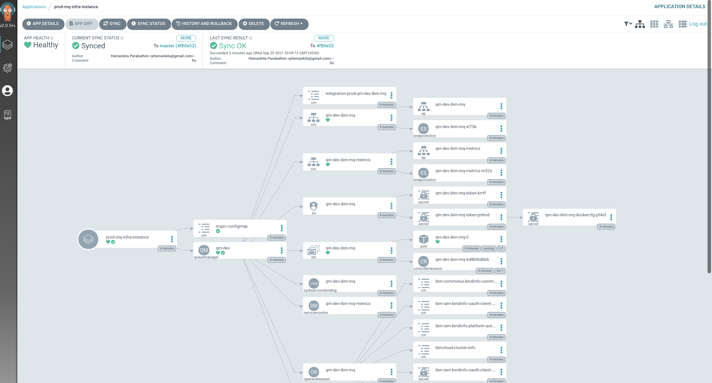

### MQ Sample Application

  1. *The ArgoCD application for MQ Sample Application*

    `MQ Sample Application` has its deployment to the cluster managed by a dedicated ArgoCD
    application called `prod-mq-spring-app-instance`.

    Issue the following command to show the ArgoCD application details:

    ```bash
    cat mq/config/argocd/prod/prod-mq-spring-app-instance.yaml
    ```

    which shows a YAML file typical of those we've seen before:

    ```bash
    apiVersion: argoproj.io/v1alpha1
    kind: Application
    metadata:
      name: prod-mq-spring-app-instance
      annotations:
        argocd.argoproj.io/sync-wave: "300"
      finalizers:
        - resources-finalizer.argocd.argoproj.io    
    spec:
      destination:
        namespace: prod
        server: https://kubernetes.default.svc
      project: applications
      source:
        path: mq/environments/prod/mq-spring-app
        repoURL: https://github.com/hp-gitops-mq/multi-tenancy-gitops-apps
        targetRevision: master
        helm:
          valueFiles:
          - values.yaml
      syncPolicy:
        automated:
          prune: true
          selfHeal: true
    ```

    See how the Helm chart we explored in the previous section of this topic is referenced by `path: mq/environments/prod/mq-spring-app`:

    ```bash
    mq/environments/prod/mq-spring-app
    ├── Chart.yaml
    ├── requirements.yaml
    └── values.yaml
    ```

    The ArgoCD application applies this Helm chart to
    the cluster to instantiate `MQ Sample Application` as a set of cluster resources.

  2. *Look at active* `MQ Sample Application` *ArgoCD application*

    Let's examine `MQ Sample Application` and its Kubernetes resources using the ArgoCD UI.

    In the ArgoCD UI search the **Applications** view with the keyword `prod-mq-spring`:

    (*You may need to launch the ArgoCD UI again. Refer to [these
    instructions](../cluster-config/gitops-tekton-argocd.md).*)

    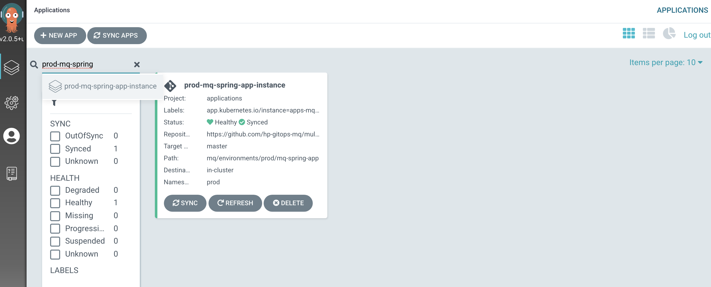

  3. *View the new* `MQ Sample Application` *Kubernetes resources*

    We can look at the deployed instance of `MQ Sample Application` and its dependent kubernetes
    resources.

    Click on the `prod-mq-spring-app-instance` ArgoCD application:

    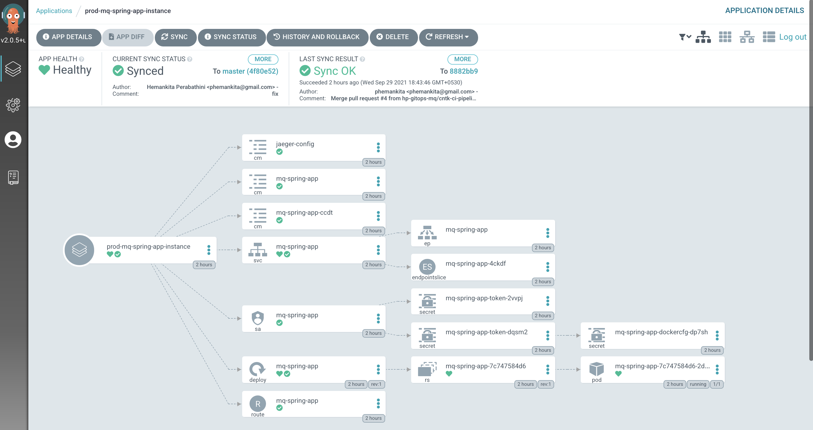

---

## Validate the Queue Manager

  1. *Connect to the queue manager pod*

    Let's connect to this container, so that we can explore the queue manager.

    Issue the following command:

    ```bash
    oc exec -n prod qm-dev-ibm-mq-0 -it -- /bin/bash
    ```

    to connect you to the pod default container, where you'll see the `bash`
    prompt:

    ```bash
    bash-4.4$
    ```

    Your terminal is now connected to the container running the queue manager.

  2. *Use MQ command line*

    The container we've connected to has a fully running instance of the
    queue manager configured according to the YAML generated by the Helm chart. We
    can use regular MQ commands to verify that this is a regular queue manager.

    Issue the following command:

    ```bash
    dspmq -o all
    ```

    to see a full list of the queue managers running in the container:

    ```bash
    QMNAME(QM1)  STATUS(Running) DEFAULT(yes) STANDBY(Permitted) INSTNAME(Installation1) INSTPATH(/opt/mqm) INSTVER(9.2.3.0) ROLE(Not configured) INSTANCE() INSYNC() QUORUM()
    ```

    We can see that `QM1` is running, it's the default queue manager, where it's
    installed in the container file system, and it's version.

  3. *Display queue manager properties*

    We can also run an MQSC command to display the queue manager properties.  These properties were defined in the MQSC file.

    Issue the following command:

    ```bash
    runmqsc QM1 <<< "dis qmgr"
    ```

    to see the full set of queue manager properties for `QM1`:

    ```bash
    5724-H72 (C) Copyright IBM Corp. 1994, 2021.
    Starting MQSC for queue manager QM1.


         1 : dis qmgr
    AMQ8408I: Display Queue Manager details.
       QMNAME(QM1)                             ACCTCONO(DISABLED)
       ACCTINT(1800)                           ACCTMQI(OFF)
       ACCTQ(OFF)                              ACTIVREC(MSG)
       ACTVCONO(DISABLED)                      ACTVTRC(OFF)
       ADVCAP(ENABLED)                         ALTDATE(2021-09-29)
       ALTTIME(14.38.48)                       AMQPCAP(NO)
       AUTHOREV(DISABLED)                      CCSID(819)
       CERTLABL( )                             CERTVPOL(ANY)
       CHAD(DISABLED)                          CHADEV(DISABLED)
       CHADEXIT( )                             CHLEV(DISABLED)
       CHLAUTH(DISABLED)                       CLWLDATA( )
       CLWLEXIT( )                             CLWLLEN(100)
       CLWLMRUC(999999999)                     CLWLUSEQ(LOCAL)
       CMDEV(DISABLED)                         CMDLEVEL(923)
       COMMANDQ(SYSTEM.ADMIN.COMMAND.QUEUE)    CONFIGEV(DISABLED)
       CONNAUTH(SYSTEM.DEFAULT.AUTHINFO.IDPWOS)
       CRDATE(2021-09-29)                      CRTIME(14.38.45)
       CUSTOM( )                               DEADQ(DEV.DEAD.LETTER.QUEUE)
       DEFCLXQ(SCTQ)                           DEFXMITQ( )
       DESCR( )                                DISTL(YES)
       IMGINTVL(60)                            IMGLOGLN(OFF)
       IMGRCOVO(YES)                           IMGRCOVQ(YES)
       IMGSCHED(MANUAL)                        INHIBTEV(DISABLED)
       IPADDRV(IPV4)                           LOCALEV(DISABLED)
       LOGGEREV(DISABLED)                      MARKINT(5000)
       MAXHANDS(256)                           MAXMSGL(4194304)
       MAXPROPL(NOLIMIT)                       MAXPRTY(9)
       MAXUMSGS(10000)                         MONACLS(QMGR)
       MONCHL(OFF)                             MONQ(OFF)
       PARENT( )                               PERFMEV(DISABLED)
       PLATFORM(UNIX)                          PSMODE(ENABLED)
       PSCLUS(ENABLED)                         PSNPMSG(DISCARD)
       PSNPRES(NORMAL)                         PSRTYCNT(5)
       PSSYNCPT(IFPER)                         QMID(QM1_2021-09-29_14.38.45)
       REMOTEEV(DISABLED)                      REPOS( )
       REPOSNL( )                              REVDNS(ENABLED)
       ROUTEREC(MSG)                           SCHINIT(QMGR)
       SCMDSERV(QMGR)                          SPLCAP(ENABLED)
       SSLCRLNL( )                             SSLCRYP( )
       SSLEV(DISABLED)                         SSLFIPS(NO)
       SSLKEYR(/run/runmqserver/tls/key)       SSLRKEYC(0)
       STATACLS(QMGR)                          STATCHL(OFF)
       STATINT(1800)                           STATMQI(OFF)
       STATQ(OFF)                              STRSTPEV(ENABLED)
       SUITEB(NONE)                            SYNCPT
       TREELIFE(1800)                          TRIGINT(999999999)
       VERSION(09020300)                       XRCAP(NO)
    One MQSC command read.
    No commands have a syntax error.
    All valid MQSC commands were processed.
    ```

    Note how `CHLAUTH(DISABLED)` has been set. This was set in the MQSC file
    configuration for `QM1` in via the `mqsc-configmap` configmap.

    Feel free to run other `runmqsc` commands to explore the queue manager
    properties.

  4. *Exit from queue manager container*

    When we're finished exploring the queue manager container, we can exit it.

    Issue the following command:

    ```bash
    exit
    ```

    to return to your local machine's command prompt:

    ```bash
    exit
    .../git/multi-tenancy-gitops-apps
    ```

---

## Validate the Application

  1. *Check the application is running*

    Using the `location` value from the `route` we can call the application to check its health by appending `/health`, for example:

    ```bash
    export PROD_APP_URL=$(oc get route -n staging mq-spring-app -o jsonpath="{.spec.host}")
    curl -X GET https://$PROD_APP_URL/actuator/health
    ```

    ```bash
    {"status":"UP","components":{"HeathEndPointMain":{"status":"UP"},"diskSpace":{"status":"UP","details":{"total":105552732160,"free":74679922688,"threshold":10485760,"exists":true}},"jms":{"status":"UP","details":{"provider":"IBM MQ JMS Provider"}},"livenessState":{"status":"UP"},"ping":{"status":"UP"},"readinessState":{"status":"UP"}},"groups":["liveness","readiness"]}
    ```

  2. *Call the application to put a message to a queue*

    Using the same `location` value we can call the application to to put a message to a queue on the queue manager, for example:

    ```bash
    curl -X GET https://$PROD_APP_URL/api/send-hello-world
    ```

  3. *Call the application to get a message from a queue*

    Using the same `location` value we can call the application to to get a message from a queue on the queue manager, for example:

    ```bash
    curl -X GET https://$PROD_APP_URL/api/recv
    ```

  4. *Call the application to put a JSON message to a queue*

    Using the same `location` value we can call the application to to put a message with a JSON payload to a queue on the queue manager, for example:

    ```bash
    curl -X POST -H "Content-Type: application/json" https://$PROD_APP_URL/api/send-json --data "{\"data\":\"Hola Munda\"}"
    ```

    Note the use of the `POST` verb in the above command. This can be followed with a call to get the message from the queue.

---

Congratulations! You've completed your first run of the promotion pipeline from dev to staging.

Feel free to run the `ibm-mq-promote-stage-prod` pipeline more than once to get a feeling for how it works.

You've used it to promote an instance of `QM1` and `MQ sample application` from `staging` environment to `prod` environment in the cluster. You've explored how the promotion pipeline for staging to prod is structured as tasks and steps. You've examined it's pipeline run log to understand how this pipeline works and how tasks are implemented. Finally, you've examined how the GitOps apps repository is updated with the `prod` resources from a successful run of the pipeline.

You've completed set up continuous deployment for the `Queue Manager` as well as the `MQ sample application` and deployed their instances to the `prod` namespace in the cluster. You've interacted with this queue manager using the command line as well as verified the application.

In the next topic of this chapter we're going to see how we can automatically promote the changes across environments.
