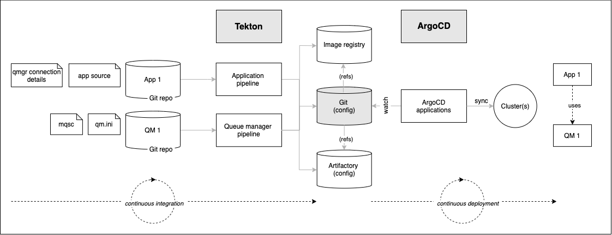

# Configuring the cluster for GitOps

<!--- cSpell:ignore CICD qube cntk autoplay allowfullscreen clusterrole clusterrolebinding walkthrough Walkthrough webkitallowfullscreen msallowfullscreen -->

**Audience**: Architects, Application developers, Administrators

## Overview

In this topic, we're going to:

* Create a new GitHub organization for our tutorial
* Copy the sample repositories for this tutorial to our new organization
* Briefly review these repositories
* Install ArgoCD to help us set up the cluster
* Customize ArgoCD
* Login in to the ArgoCD UI

By the end of this topic we'll have a all the basic components in place to
perform GitOps in our cluster.

## Introduction

Continuous integration and continuous deployment (CICD) are at the core of our
[MQ deployment](../overview/architecture.md#target-architecture). CICD ensures
that any changes to source applications and queue managers are automatically
built and tested *before* they are deployed, helping to ensure their correctness
and the integrity of the cluster.

MQ applications and queue managers are defined, configured and changed using a
[GitOps](https://www.openshift.com/blog/introduction-to-gitops-with-openshift)
model. GitOps puts git repositories and git commands such as **git push** (to
request a change) and **git merge** (to approve a change) at the heart of
configuration management. A GitOps approach helps an organization implement
best practices in version control and release governance based on a widely used
open standard -- **git**.

The following diagram outlines the major components in a GitOps MQ CICD process:

Notice the clear separation of concerns:

* **Tekton** pipelines (OpenShift Pipelines) use MQ application and queue
  manager source repositories to build and store successfully tested Kubernetes
  artifacts in a Git config repository, image registry and Artifactory. While
  Kubernetes resources (e.g. pods, routes...) can be created as part of the
  pipeline run to test the source change, these resources only last for the
  duration of the pipeline run. It is the resultant Git, container image
  registry and Artifactory resources that are used to affect changes to the
  cluster in a subsequent, asynchronous processing step controlled by ArgoCD.

* **ArgoCD** applications (OpenShift GitOps) watch a Git config repository for
  changes built as a result of successful pipeline runs. This repository
  identifies the latest version of the application or queue manager using YAMLs
  stored in Git which reference the image repository and Artifactory. ArgoCD
  applies recently updated Kubernetes resources to the cluster, resulting in new
  or updated Kubernetes resources that represent the changed MQ applications and
  queue managers, such as pods, routes etc. In contrast to pipeline runs, ArgoCD
  changes are durable; they remain as defined unless and until they are
  explicitly changed or deleted in the GitOps repository. Moreover, if the
  cluster resources drift from their repository-defined values, ArgoCD will
  restore them to these values; only changes that are applied to the Git
  config repository affect the long term state of the cluster.

* The **Git configuration repository**, often referred to as the **GitOps
  repository**, is used to store the MQ application and queue manager YAML
  artifacts built by Tekton and watched by ArgoCD. We think of this repository
  as a transfer point between Continuous Integration and Continuous Deployment;
  the successful built and tested YAMLs are stored in the Git configuration
  repository by a Tekton pipeline, which is continuously being watched by an
  ArgoCD application which deploys the latest YAML which references information
  in Artifactory and the image registry.

Often, a Tekton pipeline will perform its changes to a GitOps repository under a
pull-request (PR) to provide an explicit approval mechanism for cluster changes.
ArgoCD will only see the changes once a PR is merged, providing the formal
sign-off which is often so important in higher environments such as production.
In contrast, lower environments such as development, are often committed into
directly and therefore immediately seen by ArgoCD and applied to the cluster.

It's worth noting that although we show a single GitOps repository, there are in
fact multiple repositories -- each corresponding to a different architectural
layer in our cluster such as **infrastructure**, **services** and
**applications**. As we'll see, we don't just use the GitOps repository to
deploy MQ applications and queue managers, but every component in the cluster.
When we look at our [target
architecture](../../overview/architecture/#architecture-overview-diagram), every
single component (Cert manager, SonarQube, JMeter...) will be deployed to the
cluster using ArgoCD and a set of YAMLs from the appropriate specific GitOps
repository.

In this section of the tutorial, we're going to set up the GitOps repository,
and install ArgoCD. Later, we'll customize our GitOps config repositories, and
them in conjunction with ArgoCD it to install the rest of the components in the
cluster, including MQ applications and queue managers.

---

## Pre-requisites

Before attempting this section, you must have completed the following tasks:

- You have [created](../../cluster-create/ibm-setup/) an OCP cluster instance.
- You have installed the `oc` command on your local machine. Its version must be
  compatible with the version of your cluster. Use these
  [instructions](https://docs.openshift.com/container-platform/4.7/cli_reference/openshift_cli/getting-started-cli.html)
  to get the latest version of `oc`. Use `oc version` to confirm that you have
    - `Client Version: 4.6` or higher
    - `Server Version: 4.7` or higher
- You have also installed `npm`, `git`, `tree` and `jq` commands.

See these [instructions](/references/prerequisites/instructions) about how install these
prerequisites.

---

## Video Walkthrough

This video demonstrates how to create a Github Organization and set up all the
necessary repositories for this tutorial. It also goes through how to install
ArgoCD.

<iframe src="https://ibm.ent.box.com/embed/s/u5dapz99ju6vihfjf6zrjkx33qwxd4hy?sortColumn=date&view=list" width="500" height="400" frameborder="0" allowfullscreen webkitallowfullscreen msallowfullscreen></iframe></iframe>

This is a video walkthrough and it takes you step by step through the below
sections.

---

--8<-- "gitops-sample-repo-creation.md"

---

--8<-- "gitops-install-argocd.md"

!!! success "Congratulations!" 
    You've created the GitOps repository for your cluster based on the sample MQ repository and examined its high level structure. You also installed ArgoCD. You created a specific **clusterrole** and **clusterrolebinding** for the ArgoCD service account to ensure that it manages the cluster in a well governed manner. Finally, you launched the UI for ArgoCD; you'll make extensive use of it during this tutorial.
    
    In the next topic of this chapter, we're going to customize the GitOps repository for your cluster and use Tekton and ArgoCD to create and manage the Kubernetes resources for our MQ applications and queue managers.
