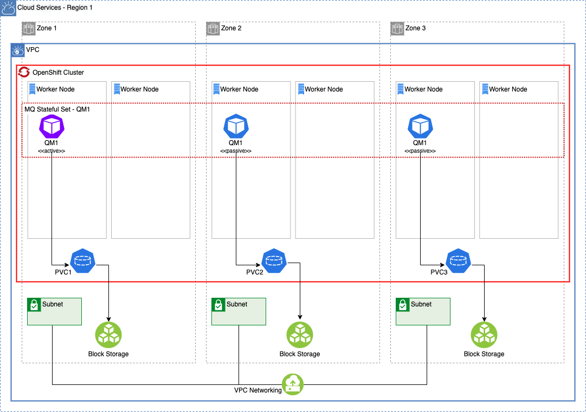
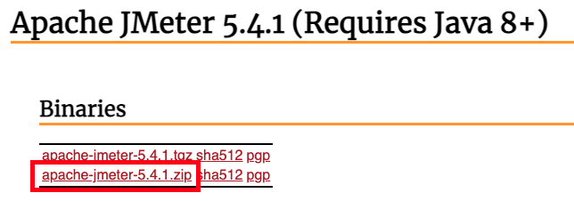
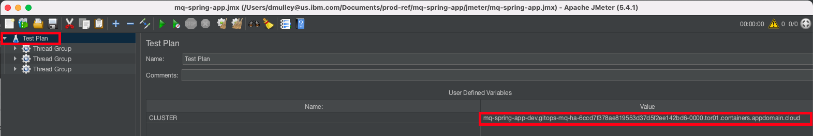
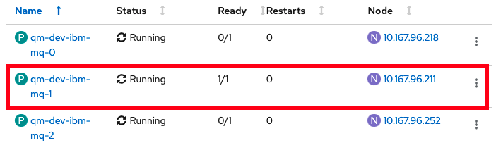
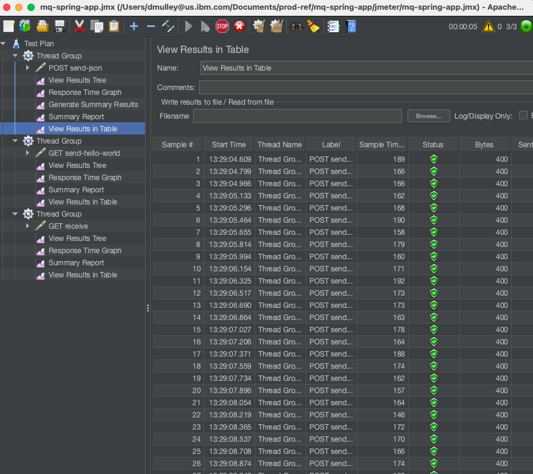
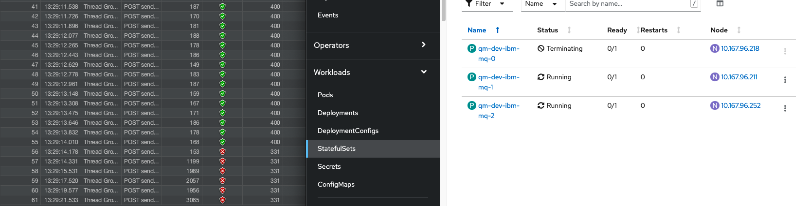
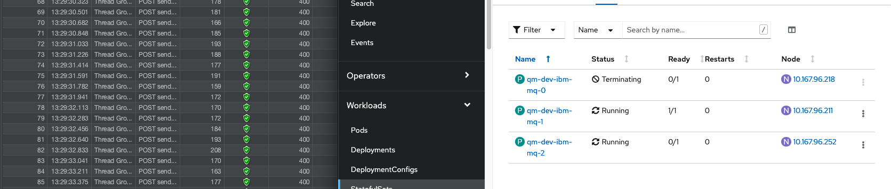

# MQ High Availability Architectures: In-Region Active Passive

<!--- cSpell:ignore clusterrole Jmeter kubeseal namespace queuemanager clusterrolebinding SPOFs MTTR MTBF CCDT mqsc qube cntk autoplay allowfullscreen qmgr -->

## Overview

**Audience:** Architects, Application developers, Administrators

In this topic, we're going to:

- learn the essential elements of what provides NativeHA high-availability to the latest versions of IBM MQ
- understand the impact at the infrastructure, services, and application tiers which a high-availability requirement brings
- deploy this topology to your OpenShift cluster

### Architecture Overview



The following components comprise the high-availability topology at a high level. As your desired topology evolves to reduce single points of failure, this list will become more robust in nature.

1. **Virtual Private Cloud:**
      - Distribute workloads across a minimum of three (3) sets of infrastructure service resources in 3 distinct availability zones (AZ).

2. **Red Hat OpenShift Container Platform:**
      - Minimum two (2) OpenShift Compute Nodes per AZ to achieve standard OpenShift SLOs (99.99% possible).

3. **IBM MQ - Native HA Queue Manager:**
      - Minimum one (1) OpenShift Node in each AZ for normal mode operations.
      - Minimum two (2) OpenShift Nodes in each AZ during OpenShift Node maintenance.

4. **MQ Client Application:**
      - Stateless container-based client application
      - Leverage anti-affinity deployment practices where possible

### Single Points of Failure

These services and infrastructure components have been identified as potential single points of failure in this topology:

1. Red Hat OpenShift Container Platform
2. Queue Manager instance
3. Regional Cloud Networking
4. Regional Cloud Storage
5. Regional Cloud Ingress/Egress

### Infrastructure Requirements

This topology, as it is the simplest topology which still provides high-availability, it also requires the least amount of bespoke support from the underlying infrastructure.

- Block Storage with [ReadWriteOnce support](https://kubernetes.io/docs/concepts/storage/persistent-volumes/#access-modes)
- Multiple availability zones inside of a single region

### MQ Assets

All of the high-availability topologies in this deployment guide leverage the NativeHA feature of IBM MQ for resiliency. As the topologies grow more complex, additional configurations and deployments are added to this least-common architectural denominator.

The recently released [NativeHA capability](https://www.ibm.com/docs/en/ibm-mq/9.2?topic=openshift-native-ha-early-release) allows for multiple QueueManager pods to be running, with only one of them truly being "active" and receiving traffic from the OpenShift Route or Service. The running pods, managed by a StatefulSet on the underlying Kubernetes-based platform,  actively share log and message data between the active and passive QueueManager instances. Once the active QueueManager instance becomes unavailable for any reason, the remaining passive pods take advantage of the RAFT algorithm to elect a new leader and within seconds failover to a different QueueManager instance, while minimizing service and message unavailability.

For more details on the early release of NativeHA for IBM MQ 9.2, you can check out the official [IBM MQ Docs](https://www.ibm.com/docs/en/ibm-mq/9.2?topic=openshift-native-ha-early-release).

Our example here sets the following properties in the QueueManager YAML file and pushes the changes to your GitOps repo:

```yaml
availability:
  type: NativeHA
  tls:
      secretName: <inter-queuemanager-tls-cert-secret>
      cipherSpec: ANY_TLS12_OR_HIGHER
storage:
  defaultClass: ibmc-vpc-block-metro-10iops-tier
  queueManager:
    enabled: true
    size: 2Gi
    type: persistent-claim
```

- The `availability.type` setting is required to be `NativeHA` to take advantage of this capability.
- The `availability.tls` setting allows for TLS-encrypted communication between QueueManager instances in the StatefulSet.
- The `storage.defaultClass` setting should point to a multi-AZ supported storage class the provides ReadWriteOnce storage capability for Block Storage.
- The `storage.queueManager` setting is required to be enabled and set to type `persistent-claim` for NativeHA fail-over capability to function.

### Client Application Recommendations

Our sample client application is available under the [Building MQ applications](../app-pipeline/topic1.md) section. There are minimal additional configuration requirements to deploy the client application connected to this topology.

To be addressed:

- [Automatic client reconnection](https://www.ibm.com/docs/en/ibm-mq/9.2?topic=restart-automatic-client-reconnection)
- Connects to a single Route URL provided by the MQ QueueManager instance
- As only a single region is deployed, there is no consideration given for message sequencing needs beyond traditional single QueueManager requirements.

---

## Deploy the HA Topology

!!! warning
      Needs to be updated (2021/09/08)

**Audience:** Architects, Application developers, Administrators

In this topic, we're going to:

- deploy an in-region, active-passive MQ topology to your OpenShift cluster
- consisting of a multi-AZ NativeHA-enabled Queue Manager
- and stateless, multi-AZ client application


---

### Pre-requisites

In order to deploy a highly-available QueueManager and MQ client application, we require the following prerequisites to be configured and installed:

- Create the cluster on the infrastructure of choice, ensuring inclusion of multiple availability zones (AZ).

- [Configure the cluster](../cluster-config/gitops-tekton-argocd.md). This includes:
  - ensuring an availability-zone-aware, block storage StorageClass is available on the cluster.

- Ensure you are logged into your cluster from the command line.

Based upon these prerequisites, the sections below will not be covering each step as in-depth as previous sections have. If you require more explanation or understanding of certain topics or commands, please reference the relevant [Configuring the cluster](../cluster-config/gitops-tekton-argocd.md), [Building queue managers](../qmgr-pipeline/topic1.md), and [Building MQ applications](../app-pipeline/topic1.md) sections appropriately.

---

### Apply high-availability GitOps baseline

This section will cover bootstrapping your cluster with everything that is required to deploy a highly-available MQ queue manager and relevant components. The artifacts used in this section are an extension of what was previously used in the [Configuring the cluster](../cluster-config/gitops-tekton-argocd.md), [Building queue managers](../qmgr-pipeline/topic1.md), and [Building MQ applications](../app-pipeline/topic1.md) sections, albeit in a more streamlined manner.

1. *Fork the sample GitOps repository*

      We're going to use the same sample GitOps repository as the previous sections, however we will be utilizing a different branch. 

      Fork the sample configuration repository at
      `https://github.com/cloud-native-toolkit/multi-tenancy-gitops` to your GitHub
      account, if not done previously.

1. *Set up environment variable for GitHub name*

      This tutorial uses environment variables to save typing and reduce errors. Similar to the previous sections, you must define the following environment variables with values specific to your environment. Replace the placeholder values in the following commands with values specific to your environment.

      ```bash
      export GIT_USER=<git-user>
      export GIT_BRANCH=demo-mq-v2-ha
      export CLUSTER_DOMAIN=<xyz.clusterdomain.com>
      ```

      You can verify the environment variables are set correctly as follows:

      ```bash
      echo $GIT_USER
      echo $GIT_BRANCH
      echo $CLUSTER_DOMAIN
      ```

1. *Clone forked GitOps repository*

      Similar to previous sections, we are going to work on a local clone of our GitOps repository. We'll push
      changes to our local copy back to GitHub at appropriate times so that they can be accessed by ArgoCD.

      Clone the forked Git config repository to your local machine:

      ```bash
      git clone https://github.com/$GIT_USER/multi-tenancy-gitops.git
      ```

1. *Checkout `demo-mq-v2-ha` branch*

      The sample repository contains multiple branches, each of which contains a
      different repository for different IBM Cloud Pak products. We're going to use
      a branch containing a sample GitOps configuration for highly-available Cloud Pak and MQ components.

      ```bash
      cd multi-tenancy-gitops
      git checkout $GIT_BRANCH
      ```

1. *Run the customization script*

      Let's customize our cloned GitOps repository with the relevant values for our
      cluster.

      The sample GitOps repository provides a `set-git-source.sh `script to make
      this task easy. It uses the `$GIT_USER`, `GIT_BRANCH`, and `CLUSTER_DOMAIN` variables you defined
      in the previous steps to customize the repository with your GitHub organization:

      Run the script:

      ```bash
      ./scripts/set-git-source.sh
      ```

1. *Commit & push updates to forked gitops repository*

      We've now customized our local clone of the GitOps config repository. Let's
      commit these changes and make the customized repository available to the
      cluster via GitHub.

      Add, commit, and push all changes in the current folder to your GitHub repository:

      ```bash
      git add bootstrap.yaml 1-infra 2-services 3-apps
      git commit -s -m "GitOps customizations for organization and cluster"
      git push origin $GIT_BRANCH
      ```

      The customized repository is now ready to be used by ArgoCD.

1. *Ensure you're logged in to the cluster*

      Start a terminal window and log into your OCP cluster, substituting the
      `--token` and `--server` parameters with your values:

      ```bash
         oc login --token=<token> --server=<server>
      ```

      If you are unsure of these values, click your user ID in the OpenShift web
      console and select "Copy Login Command".

1. *Install Tekton into the cluster*

      We use the Red Hat Pipelines operator to install Tekton into the cluster.

      The following command creates the subscription:

      ```bash
      oc apply -f 2-services/operators/openshift-pipelines/operator.yaml -n openshift-operators
      ```

      The response confirms that the subscription has been created:

      ```bash
      subscription.operators.coreos.com/openshift-pipelines-operator created
      ```

      It will take a little time for the operator to install; this is just the
      subscription. Refer to [Installing Tekton and ArgoCD for GitOps](../cluster-config/gitops-tekton-argocd.md#installing-tekton-and-argocd-for-gitops)] for additional instructions on validating successful operator installation, if needed. 

1. *Install ArgoCD into the cluster*

      We use the Red Hat GitOps operator to install ArgoCD into the cluster.

      The following command creates the subscription:

      ```bash
      oc apply -f 2-services/operators/openshift-gitops/operator.yaml -n openshift-operators
      ```

      The response confirms that the subscription has been created:

      ```bash
      subscription.operators.coreos.com/openshift-gitops-operator created
      ```

      It will take a little time for the operator to install; this is just the
      subscription. Refer to [Installing Tekton and ArgoCD for GitOps](../cluster-config/gitops-tekton-argocd.md) for additional instructions on validating successful operator installation, if needed. 

1. *Configure an ArgoCD `clusterrole` and `clusterrolebinding`*

      ArgoCD runs under a dedicated service account. For good governance, we use a
      custom **clusterrole** and **clusterrolebinding** to control the specific
      operations this service account can perform on different resources in the
      cluster.

      The cluster role and the cluster role binding YAMLs are in the
      `1-infra/clusterrole` folder. We can apply them both to the cluster with the
      following command:

      ```bash
      oc apply -f 1-infra/clusterrole
      ```

1. *Apply ArgoCD* `bootstrap.yaml`

      Recall that you pushed the customized local copy of the GitOps repository to
      your GitHub account. By applying the `bootstrap.yaml`, we're creating an ArgoCD
      application that is watching this repository and using its contents to manage the
      cluster.

      Apply the bootstrap YAML to the cluster:

      ```bash
      oc apply -f bootstrap.yaml -n openshift-gitops
      ```

      The `bootstrap` ArgoCD application will watch the `0-bootstrap/argocd/active`
      folder in our GitOps repository on GitHub.

      This is the only manual operation we need to perform; from now on, all cluster
      operations will be performed via Git operations to this repository.

1. *Launch ArgoCD*

      ArgoCD can be accessed via an OpenShift route. Using a browser, navigate to
      the URL returned by following command:

      ```bash
      oc get route -n openshift-gitops argocd-cluster-server -o jsonpath="{.spec.host}"
      ```

      This will list the route to the ArgoCD we've just installed, for example:

      ```bash
      argocd-cluster-server-openshift-gitops.aod-cloud-native-1-d02cf90349a0fe46c9804e3ab1fe2643-0000.eu-gb.containers.appdomain.cloud
      ```

      Copy the URL into your browser to launch the ArgoCD web console UI.

      (*You can safely ignore any browser certificate warnings.*)

1. *Login to ArgoCD*

      Sign in with user **admin**.

      The **password** is stored in a Kubernetes secret in the cluster. Use the following command to retrieve and format it:

      ```bash
      oc get secret/argocd-cluster-cluster -n openshift-gitops -o json | jq -r '.data."admin.password"' | base64 -D
      ```

1. *Verify ArgoCD Applications are synced, progressing, and healthy*

      ArgoCD Applications with names and artifacts matching **`services-X-secrets`** will be in a `Degraded` state due to missing MQ secrets. This is expected and will be resolved by the steps performed in subsequent sections.

      Otherwise, all ArgoCD Applications and artifacts should display a `Synced` and `Healthy` state after a period of time, due to iterative waves of reconciliation. 

---

### Review queue manager configuration

**Follow latest from https://pages.github.ibm.com/cloudpakbringup/mq-deployment-guide/qmgr-pipeline/topic1**

1. Install kubeseal locally

1. Create IBM Entitled Registry secret in `ci` namespace via SealedSecret pattern

1. Ensure GitHub access token is created on your GitHub account

1. Create GitHub access token secret in `ci` namespace via SealedSecret pattern

1. Commit and push all changes to the forked gitops repository

     - Ensure to omit the YAMLs that are created in the root repository directory

1. Fork and clone https://github.com/cloud-native-toolkit/mq-infra

1. Run the `mq-infra-dev` pipeline in the `ci` namespace, pointing to your forked `mq-infra` repository.

1. Update `values.yaml` for NativeHA support as below...

1. Pipeline should run automatically???

1. To be continued...???


1. *Update the queue manager configuration*

      From the main directory of the cloned GitOps repository source, change to the `2-services/instances/namespace-dev/mq-infra` directory:

      Display the content of the `values.yml` by running:

      ```bash
      cat values.yml
      ```

      The configuration options to specifically enable this capability are the `queuemanager.availability` and `queuemanager.storage` options in the `values.yaml` file. Replace the contents of `values.yaml` with the following updates, ensuring to select an appropriate StorageClass for your infrastructure provider.

      ```
      global: {}
      queuemanager:
         availability:
            type: NativeHA
            tls:
            secretName: mq-server-cert
            cipherSpec: ANY_TLS12_OR_HIGHER
         storage:
            defaultClass: ocs-storagecluster-ceph-rbd
            queueManager:
            size: 2Gi
            type: persistent-claim
      ```

1. *Activate the QueueManager development instance*
      - `mv 2-services/argocd/inactive/instances/ibm-mq-dev-instance.yaml 2-services/argocd/active/instances/`
      - `git commit -a -m "Activating MQ HA dev instance"`
      - `git push`
      - Validate QueueManager pods start successfully (a total of 3).
         - One will be `Ready 1/1`
         - Two will be `Ready 0/1`

---

### Review client application configuration

**Follow latest from https://pages.github.ibm.com/cloudpakbringup/mq-deployment-guide/dev/app**

1. Fork and clone `https://github.com/cloud-native-toolkit/mq-spring-app`

2. Set `replicaCount: 3` in `values.yaml`.

3. Commit & push changes to your forked `mq-spring-app` repo

4. Create pipeline via `oc pipeline --tekton`.

5. Activate app-level resources your forked gitops repo:
      - `mv 3-apps/argocd/inactive/dev-mq-spring-app.yaml 3-apps/argocd/active/`

      - `git commit -a -m "Activating MQ Spring application"`

      - `git push`

6. Validate pipeline run & updated pod counts, spread across zones in the cluster

---

### Validate NativeHA high-availability using JMeter

[Jmeter](http://jmeter.apache.org) scripts have been provided to facilitate the demonstration of MQ NativeHA high-availability. 

In this section, you will use Jmeter to send JSON requests to the Sample App which will then PUT messages on an MQ Queue, GET them back and respond back to JMeter. All messages will be processed by the active MQ pod while the other two pods remain in a passive mode. 

During the JMeter test, you will demo kill the active MQ pod which will result in a passive MQ pod becoming active and starting to accept messages. 

In a real production scenario, the application would likely retry sending the message to MQ a number of times before sending a failure to the caller, however, for demonstration purposes the application doesn't retry and sends a failure back to Jmeter immediately upon being unable to PUT the message to MQ. It is expected that it will take up to 5 seconds for an inactive passive pod to become the active pod and begin to accept messages.

It is assumed that you have already:

   - Configured MQ for NativeHA high-availability in active-passive mode (a StatefulSet of 3 pods with one active/running and two passive/waiting)

   - Configured the Sample `mq-spring-app` Spring application 

Now we will run the Jmeter test

1. *Locate the JMeter script in the mq-spring-app repo*

      Navigate to the root of the `mq-spring-app` cloned repository on your filesystem and issue the following command to verify the existence of the `mq-spring-app.jmx` file which you will use later.

      ```
      ls -la jmeter/mq-spring-app.jmx 
      ```

2. *Download Jmeter to your machine*

      Download and extract the JMeter zip from [http://jmeter.apache.org/download_jmeter.cgi](http://jmeter.apache.org/download_jmeter.cgi)

      

3. Launch JMeter from a terminal window
   
      ```
      <JMeter install folder>/bin/jmeter.sh
      ```

4. *Load the sample script*

      From the JMeter UI, click **File -> Open** and then navigate to the <jmeter folder in the `mq-spring-app` git repository> and select `mq-spring-app.jmx` file.

5. *Get the route URL for the sample application*

      Use the following command to get the route URL for the sample application from the `dev` namespace

      ```
      oc get route mq-spring-app -n dev
      ```

      The response will be similar to the one shown below. The `HOST/PORT` value is the `ROUTE URL` value that you will need in the next step
      ```
      NAME            HOST/PORT                                                                                               PATH   SERVICES        PORT    TERMINATION   WILDCARD
   mq-spring-app   mq-spring-app-dev.gitops-mq-ha-6ccd7f378ae819553d37d5f2ee142bd6-0000.tor01.containers.appdomain.cloud          mq-spring-app   <all>   edge          None
      ```

6. *Update the cluster URL*

      The Test Plan has been configured with a *user-defined variable* to make it easy to use in any environment. It is necessary to update the variable with the URL of the `route` of the sample application in your environment so that JMeter knows where to send the requests. 

      In Jmeter, click on "Test Plan" and then update the user defined variable “CLUSTER” to the `ROUTE URL` that you collected in the previous step and save your change.

      

7. *Prepare your screen to execute the test* 

      In order to view the JMeter test while simulating an MQ pod failure, it is necessary to have both JMeter and the OpenShift administration console on your screen at the same time. 

      In **JMeter UI**, select `View Results in Table` from the first `Thread Group` and select the `Scroll Automatically` option at the bottom of the screen.

      In **OpenShift UI**, select the **Pods** view of the `qm-dev-ibm-mq` `StatefulSet`.  

      Now configure your screen as shown below:

      

8. *Locate the active MQ pod*

      Locate the pod that is currently active by finding the one that is `1/1` in the **Ready** column in the OpenShift UI. In this example it is `qm-dev-ibm-mq-1`

      

9. *Prepare to execute the test* 

      You are now ready to execute the test. In the upcoming steps you will:
      
      - Start the JMeter Test Plan which will send messages to the sample Spring application and on to MQ. 
      - You will see *green* successful completions in the JMeter UI. 
      - Once you see some successful completions you will **kill/delete** the **active** MQ pod using the OpenShift UI. 
      - You will then see *red* failures in the JMeter UI until one of the other MQ pods becomes **active** and messages start to be processed successfully. 
      - The JMeter test will only run for 30 seconds, so you have to be relatively quick. 
      
      Now let's run the test

10. *Start the JMeter Test* 

      In the JMeter UI, click the **Green Start Arrow** on the toolbar or click **Run --> Start** 

11. *Simulate an outage* 

      Verify that you are seeing some successful responses in the JMeter UI and then **delete** the active MQ pod using the OpenShift UI 
      
      

12. *Verify failures* 

      You should now see some failures in the JMeter UI until one of the inactive pods becomes active. In the screen shot below you can see some failures in the JMeter UI as there isn't an active MQ pod to process the messages. It can take up to 5 seconds for MQ to detect that the active pod is gone and to elect a new pod to process the messages,

      

13. *Verify success*

      Once another MQ pod becomes active the failures in JMeter will stop and messages will return to success as shown below.

      

As mentioned previously, in Production we would expect the application to handle retrying messages when a failure occurs and to only pass the failure back to the caller if a number of retries are unsuccessful. For this demonstration, it is easier to illustrate the failures in JMeter than it would be inside the application, so we've chosen to immediately reply to the caller with a failure if MQ is unavailable to process the messages. 
