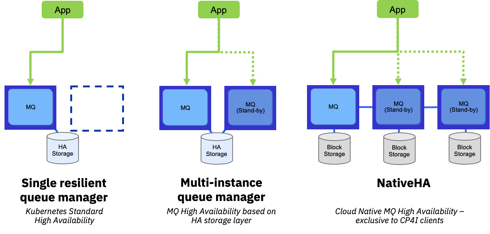
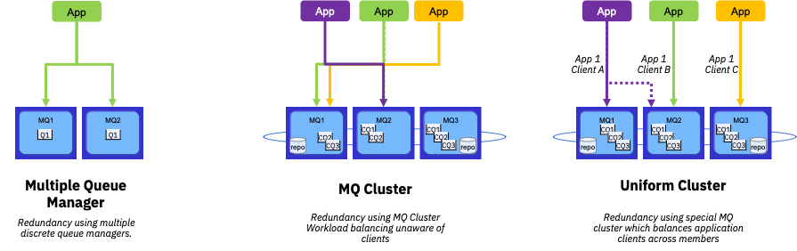
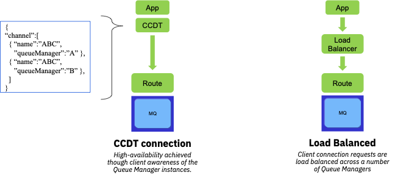
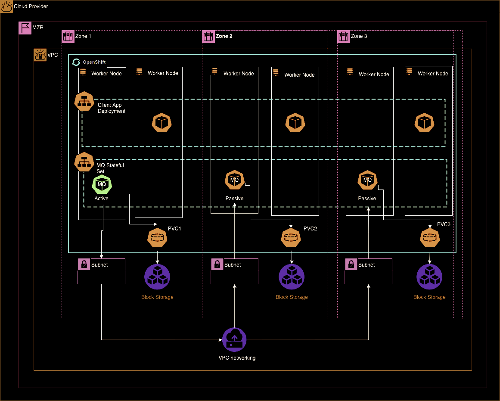
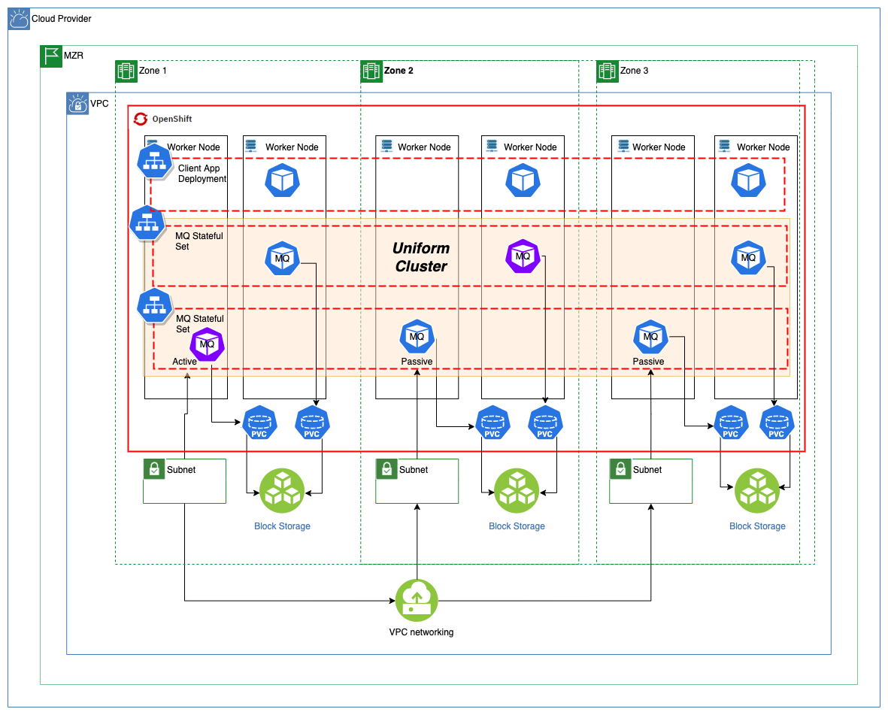
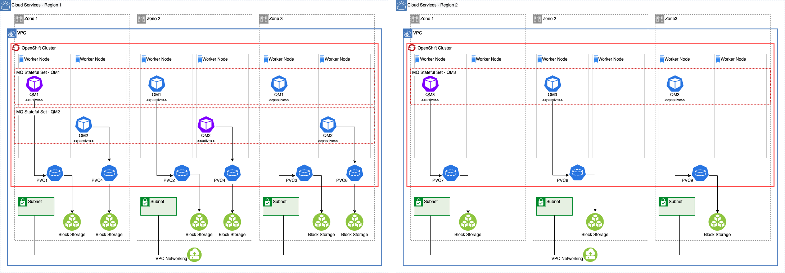
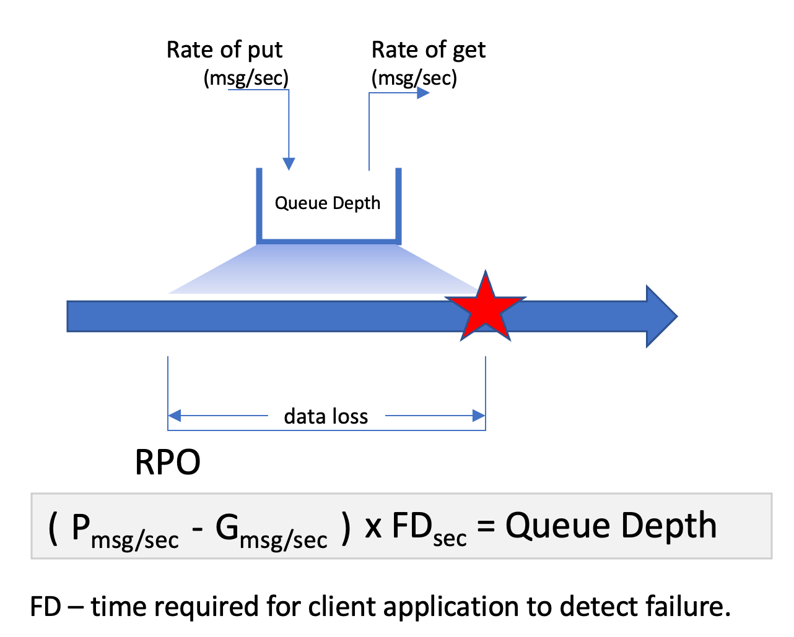

# MQ High Availability Architectures
<!--- cSpell:ignore CCDT SPOF SPOFs MTTR MTBF qube cntk autoplay allowfullscreen -->

## Overview

Per the [IBM Cloud Architecture Center](https://www.ibm.com/cloud/architecture/architecture/practices/hadr-on-premises-app-architecture), the terms high availability and disaster recovery are often used interchangeably. However, they are two distinct concepts:

- [_High availability (HA)_](#key-concepts) describes the ability of an application to withstand all planned and unplanned outages (a planned outage could be performing a system upgrade) and to provide continuous processing for business-critical applications.

- [_Disaster recovery (DR)_](../disaster-recovery/overview.md) involves a set of policies, tools, and procedures for returning a system, an application, or an entire data center to full operation after a catastrophic interruption. It includes procedures for copying and storing an installed system's essential data in a secure location, and for recovering that data to restore normalcy of operation.

High availability is about avoiding single points of failure and ensuring that the application will continue to process requests. Disaster recovery is about policies and procedures for restoring a system or application to its normal operating condition after the system or application suffered a catastrophic failure or loss of availability of the entire data center.

For MQ, the high-availability concept can be broken down into:  
  
- **Service availability:**  
    Ensure that from the application point of view, it is always able to access the service and put or get a message from a queue. Note that the logical queue can be supported by a single logical queue manager or by a cluster of queue managers.
- **Message availability:**  
    While the MQ service might be available, it is possible that messages be *marooned* on a Queue Manager that is offline. So while the MQ service might still be available, it is possible for a subset of messages to be unaccessible while the Queue Managers are recovering.
  
These perspective are useful to understand the impact of an outage and plan the topology accordingly.

## Key Concepts  

IBM MQ, being a stateful service, requires careful planning to ensure that the selected topologies actually provide the correct service and message availability. Here we will discuss the technical specifications and single points of failure for each architecture, how they are addressed, and how each architecture solves the HA service level objectives for a broad set of use cases.

Generally, high-availability for MQ is achieved through:
  
- [_Service resiliency_](#service-resiliency)  
- [_Service redundancy_](#service-redundancy)  
- [_Client connectivity resiliency_](#client-connectivity-resiliency)  

### Service Resiliency  
  
**Key points:**
  
- Single “logical” Queue Manager  
- OpenShift Route direct traffic to active Queue Manager  
- Availability of MQ service ensured by platform
  - Service recovered on different worker node or zone but same region
  - All messages unavailable during recovery
  
{ width=80% }

### Service Redundancy
  
**Key points:**  
  
- Two or more “logical” Queue Manager  
- Sharing similar configuration  
- OpenShift Route per Queue Manager  
- Availability of MQ service ensured by MQ cluster and platform  
  - Service remains available during recovery  
  - Some messages unavailable during recovery  
  

### Client connectivity resiliency

**Key points:**  
  
- Decouple application from MQ topology knowledge  
- CCDT can be pulled remotely through URL  
- Load balancing only viable when Queue Managers are “identical”

## Architecture Overview

### [In-Region Active-Passive](../ha1-ir-ap/)

### [Cross-Region Active-Passive](../ha2-cr-ap/)

### [In-Region Active-Active](../ha3-ir-aa/)

### Cross-Region Active-Active
  

## Architecture Comparison  

### Table of comparison

> IMPORTANT TO NOTE: Values are relative to each other, not scalar values.  
  
|       |  [HA1: In-Region Active-Passive](../ha1-ir-ap/)  |  [HA2: Cross-Region Active-Passive](../ha2-cr-ap/)  |  [HA3: In-Region Active-Active](../ha3-ir-aa/)  |  HA4: Cross-Region Active-Active  |
|-------|:-------------------------------:|:----------------------------------:|:------------------------------:|:---------------------------------:|
| COST  |                $                |                 $$$$               |               $$               |                $$$$               |
| RPO   |               Medium            |               Medium/Low(*)        |               Low              |             Low                   |
| RTO Localized issue   |               Low              |               Medium               |             Near-Zero             |             Near-Zero             |
| RTO Regional issue   |               High              |               Medium(**)               |            High             |             Near-Zero             |
| SPOFs |  Client connectivity Queue Manager OCP Cluster Regional Cloud | Client connectivity Queue Manager |  Client connectivity OCP Cluster Regional Cloud |  Client connectivity |
| MTTR (lower is better) Localized issue  |  Low  | Medium(**) | Near-Zero | Near-Zero |
| MTTR (lower is better) Regional issue  |  High  | Medium(**) | High | Near-Zero |
| MTBF (higher is better)(***) |  Low   | Medium  |  Medium  |  High  |
  
_(\*) Largely dependent on the continuous data replication and the lag that can exists between the two sites_  
_(\*\*) As the data replication is happening at the infrastructure level, there is a requirement for an additional mechanism to cause the service to be activated on the passive region._  
_(\*\*\*) This is defined as the complete system "failure" for MTBF - since we are adding more components to the system, expecting them to fail, but leveraging redundancy, etc._  

### Definitions

#### Recovery Point Objective (RPO)

Recovery Point Objective (RPO) is the data loss tolerance measured in time (hours, minutes, seconds). In the context of MQ, this represents the average queue depth. In systems where rate of get is *always* superior to rate of put, this is not an issue.  
This needs to take into account peak times and for periods where puts are higher than the get - the delta between the two rates can be used to calculate the number of "marooned" messages.  
{ width=40%}  
**Note:** Transmit queues need to be considered in this calculation.  
Maintaining low RPO is largely dependent on:  
  
- Time required for client to detect failed a failure  
- Balancing workload across multiple instances to reduce average queue depth per instance  

#### Recovery Time Objective (RTO)

Recovery Time Objective (RTO) is the amount of time a system will need to recover from a component failure.  
In the context of MQ, recovery time will be influenced by:  
  
- Service redundancy - having more than one logical queue manager active
- MQ instance recovery time - Time required for a passive instance of a Queue Manager to take over
- Time required for client to detect failure and reconnect, either to the same logical queue manager a different queue manager

#### Single point of failure (SPOF)

Single points of failure (SPOF) are components that are subject to take a system down should they stop working

#### Mean-time-to-recovery (MTTR)

Mean-time-to-recovery (MTTR) is the average time required for the system or a component to recover from a failure.  
In the context of a Queue Manager, this means having a passive Queue Manager detect a failure of the active one, initiate the takeover and become active.
From a client point of view, it means the time required to re-establish connectivity to "a" queue manager (could be the same logical queue manager or a different one).  

#### Mean-time-between-failure (MTBF)

Mean-time-between-failure (MTBF) is the average time between failures. This is calculated from a system's perspective and it is understood that resiliency and redundancy within a system can contribute to increased time between failures.
So from an MQ perspective, it is useful to consider MTBF from a client point of view.
A client that loses connection but is able to immediately reconnect may not perceive the failure of a component _(ie the Queue Manager)_.
