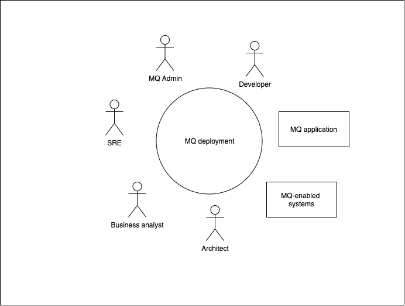
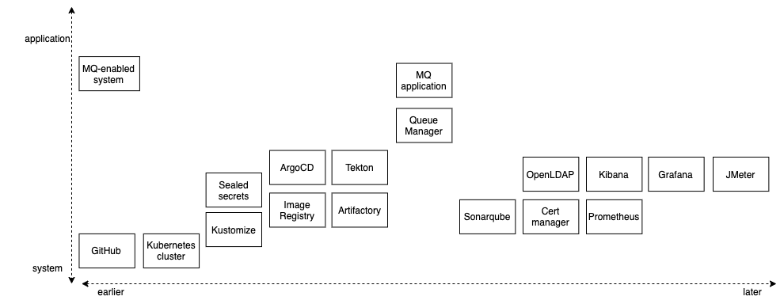
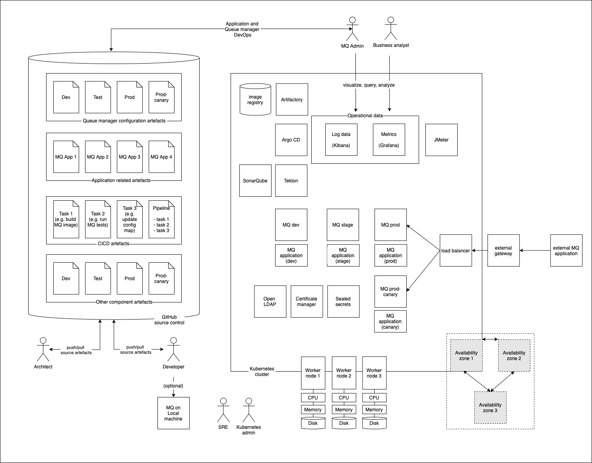

# Target architecture

**Audience**: Architects, Application developers, Administrators

<!--- cSpell:ignore CNCF qube cntk autoplay allowfullscreen -->

## Overview

In this topic we're going to:

* Examine a system context diagram for an MQ deployment
* Identify the components used to build a cloud native deployment
* Describe the role of each component
* Explore a typical architecture overview diagram that includes these components
* Describe the GitOps model for MQ applications and queue managers

By the end of this topic you'll understand the architectural design of a typical
cloud native MQ system, its primary components and their function.

---

## System context

A [system context](https://en.wikipedia.org/wiki/System_context_diagram) diagram
helps us understand how our system interacts with its different users and
other systems.

{: .center}

We can see the different entities that interact with a typical MQ deployment.
These include users as well as MQ applications and MQ-enabled systems.

We'll be developing the MQ deployment at the centre of the diagram. We can see
that it connects MQ applications and MQ enabled systems. Its users are
developers, MQ admins, SREs, Kubernetes administrators, architects and business
analysts. We'll learn more about these users later in the tutorial.

---

## Component diagram

The following diagram shows the technical components used in a typical MQ production
deployment.

You'll notice that there are many different components. Don't worry -- the
tutorial will introduce them gradually as they are required.

The diagram organizes the components according to *when* they are introduced in
system development (earlier or later) and whether they are a relatively high
level application-oriented component, or a relatively low level system- oriented
component. For example, GitHub is a system component that is fundamental to how
we structure a cloud native MQ deployment. In contrast, an MQ application is a
high level component, and requires other components to be deployed prior to it.

We'll start the tutorial with with the basic components required to get a
working queue manager and application and running. We'll then introduce
components that support more advanced use cases. Your knowledge of these
components will grow over time as you complete the tutorials.

Let's briefly introduce these components below to get a flavor of what they do.

---

## MQ application

These applications are the focus of most developer activity. They use MQ APIs
such as the MQI, JMS or REST to communicate with other applications connected to
an MQ network. These applications provide APIs to the mobile and web
applications that deliver user interfaces to business users.

---

## MQ-enabled system

A system such as Salesforce, SAP or CICS that can interact with an MQ network is
often described as **MQ-enabled**. **Systems of Record** like these either
support MQ natively or have MQ adapters, allowing them to interact with
applications that wish to consume their services using an MQ API.

In a typical MQ network, MQ applications communicate with each other and MQ
enabled systems by exchanging messages. These messages represent a request for
work to be done, or a reply confirming that work has completed.

---

## Queue manager

A queue manager provides queueing services via one of the many MQ APIs. A queue
manager hosts the queues that store the messages produced and consumed by
connected applications and systems. Queue managers can be connected together via
network channels to allow messages to flow between disparate systems and
applications on different platforms including on-premise and cloud systems.

---

## ArgoCD

ArgoCD is used for the continuous deployment of software components to the
Kubernetes cluster. ArgoCD watches a Git repository for new or changed
Kubernetes resource definitions, and applies them to a cluster. In this
way, ArgoCD ensures that the component configuration stored in GitHub always
reflects the state of the cluster.

For example, we will use ArgoCD to deploy and maintain queue managers, MQ
applications and the other cloud native components in our architecture.

ArgoCD also has the added benefit of being able to monitor resources that it has
deployed to ensure that if they drift from their desired values, they will be
automatically restored to those values by ArgoCD.

---

## Tekton

Tekton is used to automate manual tasks using the concept of a pipeline. A
pipeline comprises a set of tasks that are executed in a specified order in
order to accomplish a specific objective.

We use pipelines as part of the continuous integration process to build, test
and deliver queue managers and MQ applications ready for deployment by ArgoCD.
We also use pipelines to run performance tests, and to promote queue managers
and applications from dev to stage and production environments.

---

## Open LDAP

Most existing MQ on-premise deployments use LDAP for access control. Our
architecture provides an OpenLDAP to help migration of existing MQ estates.

While LDAP is an excellent technology, most cloud native systems have started to
use certificates for authentication, identification and authorization. Indeed,
MQ has added the ability to use the identify from certificate for access
control. This removes the need for LDAP, and removes a single point of failure.
Many customers will want to exploit the [Cert manager](#cert-manager) components
to help move to certificate based authorization.

---

## Kibana

Kibana is a tool that helps users visualize and search component trace logs (not
to be confused with MQ transaction logs). As we know, IBM MQ generates a rich
set of trace log information, and Kibana can be used to visualize and analyze
these data.  It does this by working with FluentD as the log collector and
Elastic search as the log store, in the
[**EFK**](https://access.redhat.com/documentation/en-us/openshift_container_platform/4.1/html/logging/efk-logging)
stack provided as a built in part of OpenShift.

---

## Grafana

Grafana is a metrics visualization tool. Whereas Kibana views the MQ logs,
Grafana is used to view the many different kinds of metrics that MQ collects
such as queue depth or how long a messages stays on a queue. It works in
conjunction with Prometheus that collects the different metrics from the
queue manager, which are then visualized using Grafana views.

---

## JMeter

JMeter is a performance load testing measurement tool. It is typically used with
Web applications, but also has support for JMS, alongside an extensive range of
plugins. It can be used to performance test both MQ applications and queue
managers.

---

## Sealed secrets

Very often a component has a Kubernetes secret associated with it. Inside the
secret might be a private key to access the IBM entitled container registry for
example.  For obvious reasons, we don't want to store the secret in GitHub with
the rest of our queue manager configuration.

A **sealed secret** solves this problem by introducing a new kind of Kubernetes
resource. A sealed secret is created from a regular secret, and can be safely
stored in a Git repository. A deployment time, the sealed secret controller will
recreate the secret in its original form so that it can be access by components
with the appropriate RBAC authority.

---

## Image Registry

OpenShift contains a registry for storing container images. These images will be
used to create the MQ queue manager containers within the cluster. These images
are based on the MQ images shipped by IBM. They are built and stored by Tekton
pipelines as part of the CICD process. Tekton pipelines and ArgoCD also retrieve
the latest best images from the image registry to ensure that what's being
tested or deployed in higher environments is the same as what's tested in
development environments.

We often refer to uploading images as *pushing* and downloading images as
*pulling*.

---

## Cert manager

Managing certificates is a difficult process; certificate creation requires a
Certificate Authority (CA), certificates expire after a period of time, and
private keys can sometimes be compromised -- requiring a certificate to be
revoked and a new one issued.

Cert manager makes all these processes relatively straightforward by introducing
new Kubernetes resources for certificate issuers and certificates. These
resource types radically simplify the management of certificates: their
creation, expiry and revocation.

Moreover, Cert manager makes it feasible to adopt mutual TLS (mTLS) as an
authorization strategy in MQ removing the need for LDAP, and aligning MQ with
modern trends in decentralized access control which don't have a single point of
failure.

---

## Artifactory

The successful completion of the build and test phases of a CICD pipeline result
in the creation of a newly versioned set of artifacts used to deploy MQ
applications, queue managers and related components to a Kubernetes cluster.
These might include Helm charts for example that contain a queue manager's
configuration together with related config maps. Artifactory provides a
repository for these build outputs, where they can be versioned, saved and
accessed when required.

Note that although a container image is also built by a Tekton pipeline, it is
typically held the image registry rather than Artifactory.

---

## SonarQube

SonarQube is a code quality tool used to perform static analysis of code to
detect bugs, code smells, and security vulnerabilities in MQ and other
applications. SonarQube is used within the CICD process to generate reports on
code quality including duplicate code, coding standards, unit tests, code
coverage, code complexity, comments, bugs, and security vulnerabilities.

---

## Prometheus

Prometheus is used in conjunction with Grafana.  It stores MQ metrics retrieved
from the queue manager as a set of tuples in a time-series , which allows it to
be subsequently used to create Grafana views to assist with monitoring MQ queue
managers.

---

## Kustomize

Kubernetes resources such as queue managers and applications, have their
operational properties defined using YAMLs. As these resources move through
environments such as dev stage and prod, Kustomize provides a natural way to
adapt (*customize*!) these YAMLs to these environments.  For example, we might
want to change the CPU or memory available to a queue manager in a production
environment compared to a development environment.

Because [Kustomize](https://kustomize.io/) is built into the `kubectl` and `oc`
commands via the `-k` option, it makes configuration management both easy and
natural.

---

## GitHub

This popular version control system is based on git and stores the MQ
application and queue manager source configuration as well as the other
Kubernetes resources. By keeping our MQ application and queue manager source
configuration in Git, and using that to build, test and deploy our MQ
applications and queue managers to the Kubernetes cluster, we have a **single
source of truth** -- what's in Git is running in the cluster.

Moreover, by using Git operations such as *pull*, *push* and *merge* to make
changes, we can exploit the extensive governance and change control provided by
Git when managing our MQ estate.

---

## Kubernetes Cluster

This is the "operating system" used to orchestrate our MQ application, queue
manager and related component containers. Kubernetes is portable across
on-premise and cloud systems and allows us to easily scale our workloads across
these environments as required.

You'll be learning a lot more about Kubernetes in this tutorial; it's the
foundation upon which everything else is built.

---

## Architecture Overview Diagram

Let's look at an example of how these components come together in an example
**Architecture Overview Diagram (AOD)**.

This shows a typical MQ deployment where many of the components we've mentioned
come together in a typical MQ topology. We'll be building out this deployment
throughout the tutorial.

It's a really good idea to draw an AOD when you're designing a new MQ deployment
on OpenShift. It helps you understand and communicate what the system is going
to look like to its users. There are lots of other UML diagrams that complement
an AOD; indeed, and AOD is often a composite of UML component, interaction, use
case and deployment diagrams, emphasizing particularly relevant aspects of the
design.

---

## GitOps model

In our AOD, we've emphasized the two main components that are essential to a
production-ready MQ cloud native deployment:

* A Kubernetes cluster containing:
    * MQ applications
    * MQ queue managers
    * Cloud native components such as Tekton, ArgoCD, Kibana and Grafana.

* GitHub as a source of truth for the cluster runtime containing:
    * MQ application source
    * MQ application configuration
    * Queue manager configuration
    * Configuration information for the cloud native components running in the
      cluster

Notice the set of users who interact with these components:

* Developer
* Administrator
* Architect
* Business analyst
* MQ application user
* Site reliability engineer
* Kubernetes admin

In this tutorial, we'll see how these users work within this environment. All users
will follow the  [GitOps
model](https://www.openshift.com/blog/introduction-to-gitops-with-openshift). In
this model, Git holds the entire specification for the system -- hardware,
cluster, build, test and deploy components, queue managers and applications.
Whenever the system needs to be changed, whether by a developer, administrator,
SRE or architect, they use Git and git operations such as **Pull requests** to
make a change. A change must pass a full set of tests (stored in git) to ensure
the change is correct. If successful, it is merged into the current system either
automatically or after approval, if required.

In the GitOps model, Git is at the heart of every operational change performed
to every component of the system; you'll learn more about this model throughout
the tutorial by using it.

---

Congratulations! Now that we know what we're trying to build, we can start
building it. In the next topic, we're going to create our cluster.
