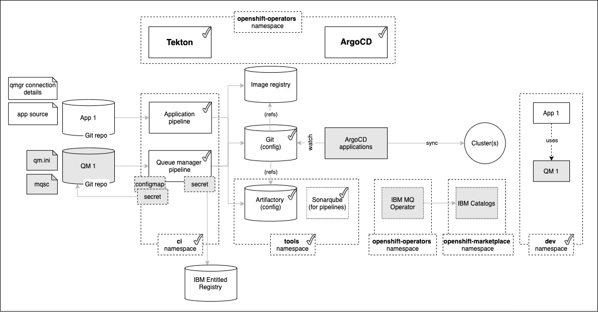
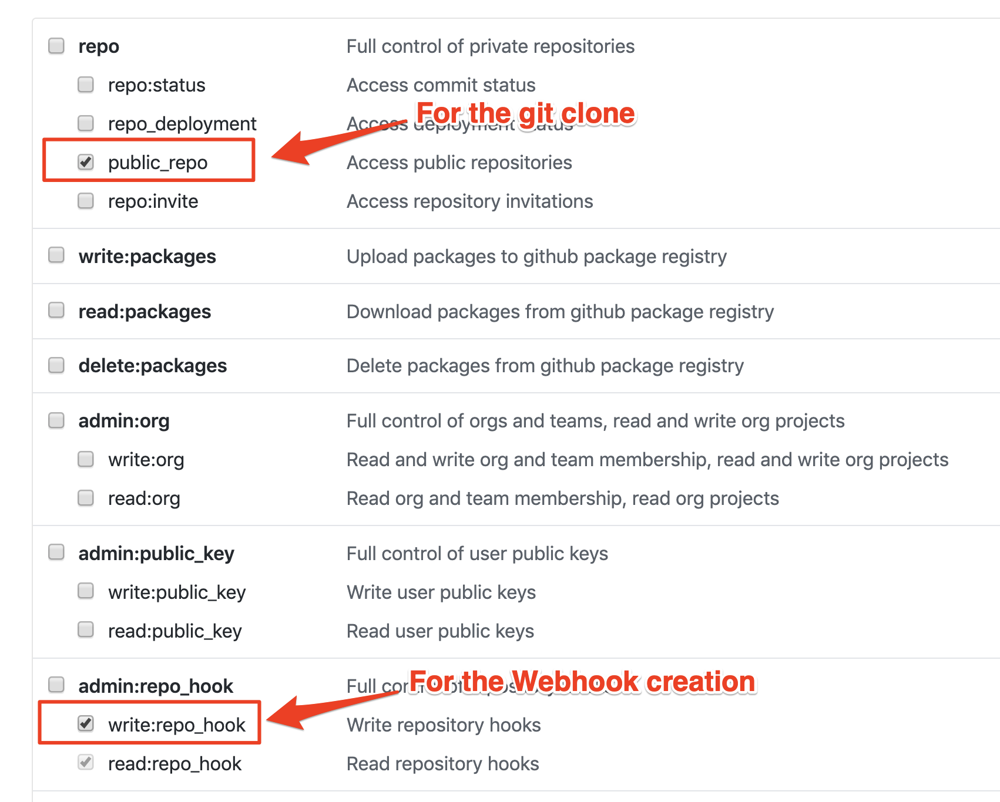
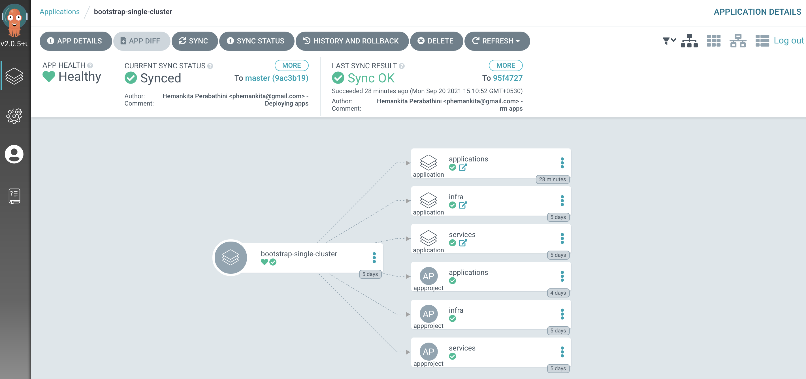
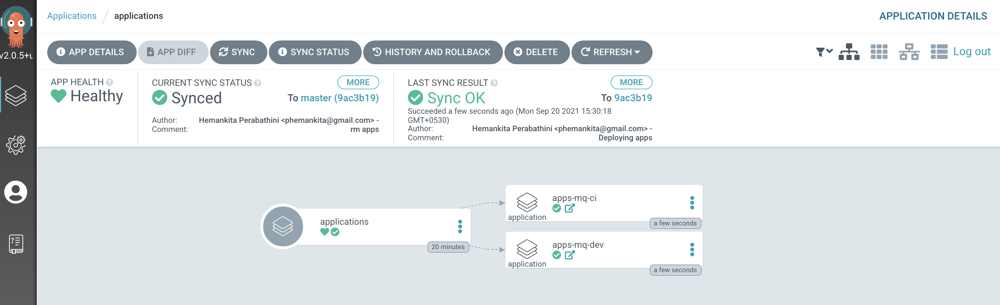
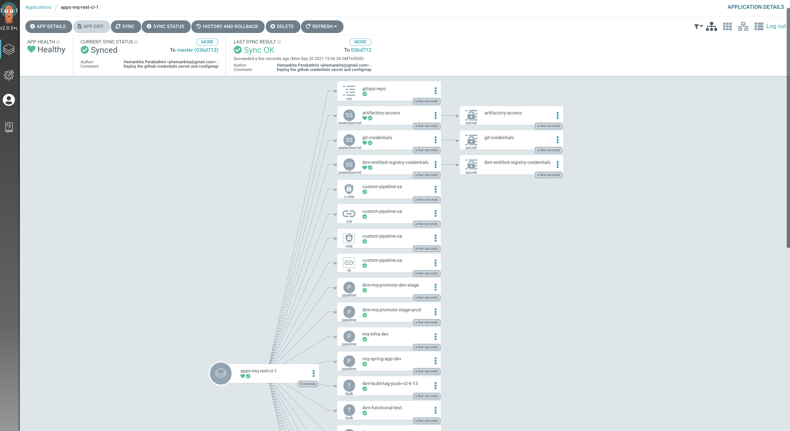
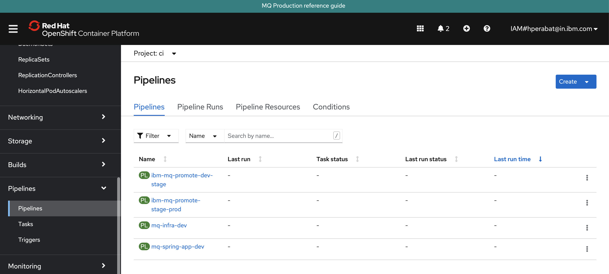
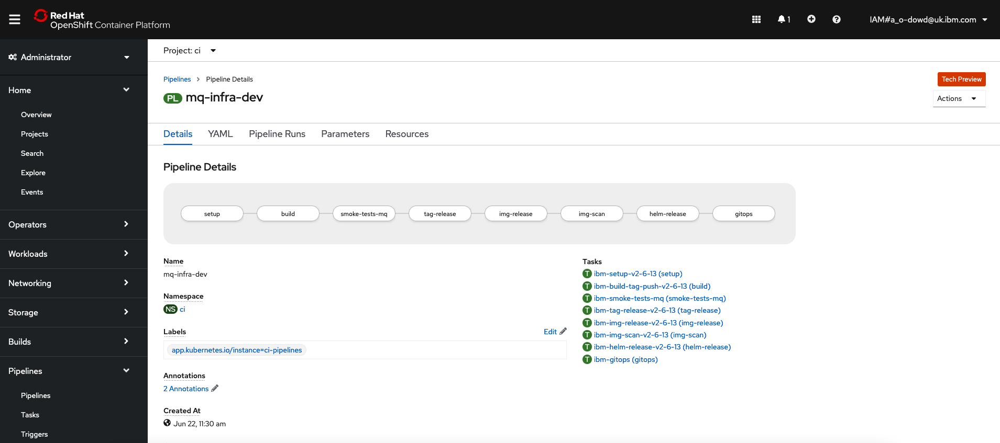

# Building MQ Queue Managers

<!--- cSpell:ignore  pipelinerun resyncs mqsc msqc runmqsc dockerconfigjson queuemanager QMID podman ibmgaragecloud cntk cnkt eventid gitrevision gitrepositoryurl odowdaibm MQSC replicaset eventlistener triggerbinding triggertemplate mqcicd qmgr Artifactory configmaps OIDC CHLAUTH templating sealedsecret -->

## Overview

In the [previous chapter](../cluster-config/gitops-tekton-argocd.md) of this guide, we  set up
and configured GitOps for our cluster. We then used GitOps to install and manage
Kubernetes infrastructure and services resources.

In this chapter, we're going to use these resources to build, deploy and run an
MQ queue manager. This will require us to install some more components into our
cluster.

Look at the following diagram:



We'll examine these highlighted components in more detail throughout this
section of the tutorial; here's an overview of their function, from left to
right:

* The queue manager pipeline requires a `secret` to access the IBM Entitled
  Registry. This registry hosts the container images used by IBM Operators. The
  secret contains your IBM entitlement key, allowing you to easily access the
  IBM container software you have licensed.
* The `QM1 Git repo` contains the source definition for queue manager QM1,
  including its `MQSC` resources (e.g. queue and channel definitions) and
  `qm.ini` file that contains other configuration information (e.g. log file
  sizes).
* The queue manager pipeline requires a `configmap` and `secret` to connect to
  GitHub. They contain the repository URL and security token used by the
  pipeline to access the `QM1` Git repository.
* `IBM Catalogs` is a `CatalogSource` that adds the IBM custom provider to the
   Operator Hub. Once added, IBM Operators, such as the MQ operator, or CloudPak
   for Integration, or CloudPak for Data can be installed into the cluster.
* The `IBM MQ operator` is installed from the IBM Catalogs source. It adds a
  new `queuemanager` custom resource definition to the cluster. This allows
  Tekton pipelines and ArgoCD applications to manage queue managers using a
  simple YAML interface.

In this topic, we're going to:

* Fork, clone and explore a sample queue manager repository, `QM1`
* Configure the cluster connection to the IBM Entitled Registry
* Install the IBM Catalogs and IBM MQ operator using GitOps
* Configure the pipeline connection to the `QM1` repository
* Review the MQ queue manager pipeline for queue manager `QM1`

By the end of this topic we'll have a fully functioning MQ GitOps CICD pipeline
that we can use to build and change queue managers.

---

## Pre-requisites

Before attempting this topic, you should have successfully completed the
[previous chapter](../cluster-config/gitops-tekton-argocd.md).

---

## The sample queue manager repository

In the [diagram above](#overview), we can see that the result of the CICD
process is to build, test and deploy the queue manager `QM1` that runs in the
`dev` namespace. The CICD process uses the `QM1` Git repository as its primary
input source; every committed change to this repository will result in a
pipeline run which, if successful, will update the deployed version
of `QM1` in the cluster. This is GitOps in practice, the upstream source of
truth for `QM1` is the Git repository.

In this section, we're going to create our copy of the `QM1` repository. We'll
examine its contents to see how queue manager `QM1` and its properties are
defined. In a subsequent section, we'll use the Tekton queue manager pipeline
and a dedicated ArgoCD queue manager application to build, test and deploy `QM1`
to our cluster.

It's wise to use a **new terminal window** for this chapter. It will help us
switch between the queue manager repository and GitOps repository as we examine
the different steps in the CICD process.

1. *Fork the sample queue manager repository*

      The sample queue manager repository gets us going quickly. Once you've seen how it works, you can use it as a starting point for your projects.

      Fork the sample repository `https://github.com/cloud-native-toolkit/mq-infra` to your custom GitHub Organization.

2. *Ensure you've set up the* `$GIT_ORG` *environment variable*

      This chapter also uses environment variables to save typing and reduce errors.

      Let's set up an environment variable, `$GIT_ORG`, that contains your GitHub
      organization name. We'll use
      this variable in many subsequent commands.

      **Open a new terminal window**.

      Replace `<git-org>` in the following command with your GitHub user name:

      ```bash
      export GIT_ORG=<git-org>
      ```

      You can verify your `$GIT_ORG` as follows:

      ```bash
      echo $GIT_ORG
      ```

      which will show your GitHub Organization, for example:

      ``` { .text .no-copy }
      prod-ref-guide
      ```

      We'll use this environment variable extensively in scripts and `bash`
      commands, so it's important to ensure it's correct.

3. *Change to your working git folder*

      As in the previous chapter, we're going to clone a local copy of our sample
      repository.  Most users keep all of their locally cloned git repositories
      under a common folder, usually a child folder of their home folder, i.e.
      `$HOME/git`.

      Change to your working `git` folder:

      ```bash
      cd $HOME/git
      ```

4. *Clone the MQ infra repository*

      We're going to work on a local clone of our GitOps repository. We'll push
      changes to our local copy back to GitHub at appropriate times so that they can
      be accessed by the queue manager pipeline to build and test the most recently
      committed version of `QM1`.

      Clone the forked Git config repository to your local machine:

      ```bash
      git clone https://github.com/$GIT_ORG/mq-infra
      ```

      A local copy will be made on your machine as follows:

      ```{ .text .no-copy }
      cloning into `mq-infra`
      warning: redirecting to https://github.com/prod-ref-guide/mq-infra/
      remote: Enumerating objects: 99, done.
      remote: Counting objects: 100% (24/24), done.
      remote: Compressing objects: 100% (9/9), done.
      remote: Total 99 (delta 19), reused 15 (delta 15), pack-reused 75
      Receiving objects: 100% (99/99), 12.93 KiB | 150.00 KiB/s, done.
      Resolving deltas: 100% (42/42), done.
      ```

      !!! note
          Throughout this tutorial we use the HTTPS URL to clone repositories, however you can also use the SSH option.

5. *Work on the local copy of the GitOps repository*

      Change to the `mq-infra` folder containing your local clone of the queue
      manager repository:

      ```bash
      cd mq-infra
      ```

6. *Review the GitOps folder structure*

      The folder structure of this repository defines all the properties for queue
      manager `QM1`. The queue manager pipeline reads the repository contents to
      build and test a queue manager with exactly these properties, ready for
      deployment by ArgoCD.

      Let's examine the structure in a little more detail.

      Show the folder structure with the following command:

      ```bash
      tree .
      ```

      Notice that this is quite a simple folder structure. You may recognize some of
      the files immediately:

      ``` { .text .no-copy }
      .
      ├── Dockerfile
      ├── README.md
      └── chart
            └── base
               ├── Chart.yaml
               ├── config
               │   └── config.mqsc
               ├── security
               │   └── config.mqsc
               ├── templates
               │   ├── NOTES.txt
               │   ├── _helpers.tpl
               │   ├── configmap.yaml
               │   └── qm-template.yaml
               └── values.yaml
      ```

      The key folders and files are as follows:

      * The `Dockerfile` file contains the base Dockerfile that will be used to
         build the container for `QM1`.
      * The contents of the `chart` folder are used to create a Helm application
         for `QM1`. This Helm application is used to manage the deployment of a set
         of Kubernetes resources such as an MQ custom resource and config map.
      * The `templates` folder contains the Kubernetes resource definitions that
         will be created for this chart. We can see a queue manager custom resource
         and a config map for example.
      * The `values.yaml` contains a set of default values used by these
         templates to customize the Kubernetes resources.  For example, the
         `qm-template` gets the CPU limit for `QM1` from `values.yaml`.
      * The `config` folder is ignored by Helm; but will be used by the pipeline. It
         contains the introductory queue manager MQSC definitions that will be
         placed in the config map used by `QM1`.
      * The `security` folder is also ignored by Helm; but will be used by the
         pipeline. It contains the more advanced queue manager MQSC definitions that
         will be placed in the config map used by `QM1`, when security is required.

      The `values.yaml` file held in the source repository ensures that `QM1` always
      has a set **good defaults** for deployment. We'll see how the `mq-infra-dev`
      pipeline uses these defaults to populate the Helm chart that is used by ArgoCD
      to deploy `QM1`. However, we'll also see how these values can be overridden --
      using GitOps -- when required.

      Feel free to explore the Helm chart; we'll examine it in much more detail
      throughout this chapter. Alternatively, feel free to learn more about [Helm
      charts](https://v2.helm.sh/docs/developing_charts/) before you proceed.

---

## Install the kubeseal operator into the cluster

1. *Change to the Application GitOps directory*

      Let's ensure we're in the correct folder.  Again, we've used typical
      defaults:

      ```bash
      cd $HOME/git
      cd multi-tenancy-gitops-apps
      ```

      Verify that your `$GIT_ORG` and `$GIT_BRANCH` environment variables are set:

      ```bash
      echo $GIT_ORG
      echo $GIT_BRANCH
      ```

      For example:

      ``` { .bash .no-copy }
      (base) anthonyodowd/git/multi-tenancy-gitops-apps echo $GIT_ORG
      prod-ref-guide
      (base) anthonyodowd/git/multi-tenancy-gitops-apps echo $GIT_BRANCH
      master
      ```

      If either is not set, set them as follows.

      ```bash
      export GIT_ORG=<replace_with_gitops_apps_repo_organization>
      export GIT_BRANCH=<replace_with_gitops_apps_repo_branch>
      ```

2. *Login to the cluster*

      In the terminal window, log into your OCP cluster, substituting the
      `--token` and `--server` parameters with your values:

      ```bash
      oc login --token=<token> --server=<server>
      ```

      If you are unsure of these values, click your user ID in the OpenShift web
      console and select "Copy Login Command".

3. *Install* the `kubeseal` *CLI*

      Now that we've installed the sealed secret operator and instance, we can
      create a sealed secret. We install the Kubeseal CLI on our local machine to do
      this.

      ```bash
      brew install kubeseal
      ```

      This make take a minute or so to install:

      ```{ .text .no-copy }
      ==> Downloading https://homebrew.bintray.com/bottles/kubeseal-0.14.1.big_sur.bottle.tar.gz
      ...
      ==> Installing kubeseal
      ==> Pouring kubeseal-0.14.1.big_sur.bottle.tar.gz
      /usr/local/Cellar/kubeseal/0.14.1: 5 files, 31.9MB
      ```

      *The above installation is for MacOS. Use your favorite package manager to
      install the CLI on Linux distributions.*

---

## Configure access to IBM Entitled Registry and Artifactory

We need access credentials to interact with IBM Entitled Registry, Artifactory
and MQ Git repositories. We store these credentials in Kubernetes secrets.
However, because of the sensitive nature of its contents, we don't want to store
these secret in our Git repository.

Instead, we are using **sealed secrets**. To create a sealed secret, we use the
YAML for a regular secret to create a **sealed secret** which is a strongly
encrypted form of the secret. We store this in our GitOps repository. When
ArgoCD deploys the sealed secret, the sealed secret operator will create a
regular, un-encrypted, secret in the `ci` namespace where it can be accessed
when required.

The key point is that the deployed un-encrypted secret is never stored in the
GitOps repository; only the sealed secret which is encrypted is stored in Git.
Once created, the secret can only be accessed by users who have access to the
`ci` namespace, such as the Tekton queue manager pipeline.

### Configure connection to the IBM Entitled Registry

To install and use the relevant IBM MQ containers in your cluster, an
entitlement key is required to retrieve them from the IBM Entitled Registry. In
this section, we retrieve your key, and store it in a secret in the cluster
where it can be used to install containers at the appropriate time.

For this section, we return to the **terminal window** we used in previous
chapter, [Configuring the cluster](../cluster-config/gitops-tekton-argocd.md),
rather than the one we've just used to clone the `QM1` source repository. Open
a new terminal window for the `multi-tenancy-gitops` repository if necessary.

1. *Discover your IBM Entitlement Key*

      Your IBM entitlement key is used to access IBM software. By accessing the IBM
      Entitled Registry using this key, you can easily access the IBM container
      software you have licensed.

      Access your [IBM entitlement
      key](https://myibm.ibm.com/products-services/containerlibrary).

      Copy the key and store it in the `$IBM_ENTITLEMENT_KEY` environment variable where it
      will be used by subsequent commands in this tutorial:

      ```bash
      export IBM_ENTITLEMENT_KEY=<ibm-reg-key>
      ```

      You should keep this key private from other users.

2. *Create the YAML for the IBM entitlement key and seal the IBM entitlement key secret*

      Let us first run the below script and look into the details later.

      ```bash
      ./mq/environments/ci/secrets/ibm-entitled-registry-credentials-secret.sh
      ```

      This script performs the below actions.

      - It initially creates the YAML for a regular secret using the `oc create secret` command with
        the `--dry-run` option; it creates the YAML, but doesn't apply it to the
        cluster.
      - Then, it seals the IBM entitlement key secret.

        We can examine the sealed secret YAML using the following command:

        ```bash
        cat ibm-entitled-registry-credentials-secret.yaml
        ```
        See how a sealed secret is very similar to a regular secret in structure:

        ``` { .yaml .no-copy }
        apiVersion: bitnami.com/v1alpha1
        kind: SealedSecret
        metadata:
           creationTimestamp: null
           name: ibm-entitled-registry-credentials
           namespace: ci
        spec:
           encryptedData:
              IBM_ENTITLED_REGISTRY_PASSWORD: AgALF7SxZrv+cWxZzplncnNImnWBl0vSjQy3whhwl3pch2eVgwVBoN94AH2XUNRlY+pVXKUAAFwDexUgLwpkdvfFo5ZTZR33sIEiCl3JdV0IXTJmpLqMeSUXMgcJ2RUL81frGwPMGy9/Tmv41k/Eaapyj9FTj0n8IlKiNkHqwHzkOsEF1ueSkoLETlrR0rOV8DHy7VPzPQ0RylX66Q7vvB43xI/Aq3AfpNu+jthH+qRv8D7Mx1mVmqXVxaOz/TBhQyk5Z2P3/JPu1oQK3Xrrr3i5tb8vUHQLh/1lCa0hY30HrCDXwTphcvDnXkKGsyw4pmf6Mkzr6SbPahEOG6Mmz8InYYbJQOLXPwRmrluGv+IRe+1nqh5JAaSrJHC38mKXUFsRaLEODf/DCtNz9NNJkSlLM2OSBzGsFL2v1NrhA6envrScljjv8MqcSFkzR9bPNuXu/8ANHM3C4mcvHAY1/+uRkOxLmEaEgBab1zu3ellSnNH3zNi9YjhXVw1R4505kjM2r5O6Oe7UdxtI50axFdxcU6JpfFT++kEsiVJZyqqBzVKjFDVww8ReH9U9BK0ibDfmhO+7IFNNODVCcXHicf/pRjh+Y0Z/OY/IVbpdenS9YL/vZIVdVXKwf/oZzMiIAvoZ93KgIY0pzqZitXo7jNuAIYlMX6X0vHrx0TK6nJh4OOOhUwGDnsSg4GaYRs8GZPw=
              IBM_ENTITLED_REGISTRY_USER: AgCVxkhumBCyp3nGLuOhFKo4o03NwB7audQ2DJruzO7uscFTBcktzeDrMKmdwOfZkqyhb8zNpnxyZwZzdqP4TgTTLVr71c1YqYo+tMd+UEYO1+QdCKGi7+IzJYusMKSgLcNshuAZfhKqLybGyOOK6qv+EmIjJ5GuPKgZgKsMEvlSHswp4pWYEfC+sokwWV8t3APRb1RR3B0Lx40dLduJ8+QL4i4Qcu267vCqa6HK5423b/ryjF+FBAlpUELiK9BX2OQ7BtT/en/zbDW1tj0hdsOu8BD1JvTmY/ueRTF+CQ+dU5dPQCvGIZCDQEAqhr0jjMp9eL+JQMiBEjFlR6AYf1IFNk1SkaD68f8mSLy+eLn3qfc365shIBQtuGF9x/bpLgMbuHofEgO3/qvXy4WxNxqwsGVlNl3bYd6JrLf+SnOR+NmC69k/cRJVs/6wjod/lJrDHsWofc07paADcSRVJ1aDv5E77ibuJSRlw8Zuyu4S445/8/m0x3Fgc9WW69G7pBAYRyN7w83jaGMf/2pJVcqUPu06jFeCwvGOXwRbK/A0f76gG/CWzM3zMSzr5CqyNaiAJN7GFdv3xuFkCpKpSsRu7jYP6PSS+0G0YJ03IAXj9smxmLKe0ZCEYxBetzmhiMychAZTbUSLtXDscbdYZlkcZct/E9lqOM3hl8FuPNDchS1VRDVbcsQUohx5oqtwJSukgQ==
           template:
              metadata:
              creationTimestamp: null
              name: ibm-entitled-registry-credentials
              namespace: ci
              type: Opaque
        ```

        However, notice the following differences:

        * `apiVersion:` and `kind:` identify this as a sealed secret.
        * `.dockerconfigjson` has been encrypted using the public key of the sealed
          secret controller, meaning that it can only be decrypted by this
          controller.

      This sealed secret is safe to store in our GitOps repository, because it can
      only be decrypted by the sealed secret controller that was used to encrypt
      it.

      We haven't applied this sealed secret to the cluster yet -- we create the YAML
      file so that we can use the GitOps process to deploy it.

3. *Install the entitlement key into the cluster*

      We deploy this sealed secret into the `ci` namespace in the cluster. To do this,
      we need to place the sealed secret in the GitOps Application repository, within
      the folder `mq/environments/ci/secrets`.

      ```bash
      mv ibm-entitled-registry-credentials-secret.yaml mq/environments/ci/secrets/
      ```

      Pushing these changes to our GitOps repository will apply them to the cluster:

      ```bash
      git add mq/environments/ci/secrets
      git commit -s -m "Deploy the IBM entitled registry sealed secret"
      git push origin $GIT_BRANCH
      ```

### Configure connection to access Artifactory

The pipelines we install later in this tutorial runs in the `ci` namespace
store their build output in Artifactory. To do this they need a secret that it
initially created in the `tools` namespace when Artifactory is installed.

1. *Create the YAML for the artifactory access secret and seal the artifactory access secret*

      Issue the following command:

      ```bash
      ./mq/environments/ci/secrets/artifactory-access-secret.sh
      ```

      This script performs the below actions.

      - It initially creates the YAML for a regular secret by using the
        `artifactory-access` secret from the `tools` namespace; it creates the
        YAML, but doesn't apply it to the cluster.
      - Then, it seals the `artifactory-access` secret.

        We can examine the sealed secret YAML using the following command:

        ```bash
        cat artifactory-access-secret.yaml
        ```
        See how a sealed secret is very similar to a regular secret in structure:

        ```{ .yaml .no-copy }
        apiVersion: bitnami.com/v1alpha1
        kind: SealedSecret
        metadata:
          creationTimestamp: null
          name: artifactory-access
          namespace: ci
        spec:
          encryptedData:
            ARTIFACTORY_ENCRYPT: AgCklDmp+y4VmnErpKOLGEijzgc0SiZjpJQg46BGfb78MnkY3ZEyH752YDnNp9/JBvsSPL20agoQabXYczVJP/JogWPbhPbZoDMubTjPq7Lf63CSkF1WFsMyYrVpPApWrsLL3YTeh4cXYqwCowZUfLWrTIAKduCkI2L2Fo25HSNY3ovBnxbzofHK6u2CAc7BBzAJ7O3T4mK1tKY67CCwFYkTXqfG5ECIF67HKjLhnj7rJGQ+bbjYgQ1RYR04adYGBBYgIQvWzXBQgz/8XuWs+Utk0rtWuAyUfEFehJfOXc/4iOSoctnyaZtodlFqnyEgajSUE/HHzy6QJwdVwls/necjbBzvYNO3OpQg/Vb3h+owTikAzzleNTMtAV6628AFV7f+20UnAn7xtoLMEjZ6pHu12DVfmjQ8mG9zNqo5/M2czWFQPLpmmf3KAaEbGjAQHV8tBvDRaaR389BS5w95QOrigJG5w+reKA5bosGdCQintPol+cVafIYxsqJDDI40qPPIlVOX/wlqHKvzD6UacXIFywcjjYGNIATo9Zg3PQfnTjnCzTs46oNswF7N7rUnXrg4KOcUDv18QuTR3brzIs+ccWdDLS+ScnRqxoOQp0x+D+vT/8EsdF0+MrfBPc95eLCJu1OjUULhVOVv/pCOaZCULrhdSqYlCf4BjhNSEtTrvU9lUg4bBVm4X/Q7nyjZ5GLqs5QSSfLKkaRE49M4BAamPRGXxNQcur9TFl44mIEev/Tkap0YAg==
            ARTIFACTORY_PASSWORD: AgBBkfKFEYXPYxHCY5ggrpSynRT+10boLkD5+udB4YXFU7MPqFoXe8z+NPnDDKEhsVBWNhUyqp2M7RjyC0BUFMDgGevMOCNOdg4pM+0vuf/pGjPVHSqUK48qoRX3gs8QBdTXRBnfTfqd59GTFRhdMQ7tp5ztZ8TawlAnzWbdfWSdxya+fKSQxVG1WDamnpcRMI5zHJkAyxz4689yXE5eS/ughkNA35MB2BZdrAaM1qVJ/9ZaV5nnwYeZTTGp6i5s8bZoqz0a/rlYbdbtHYvRoCPxnbAelwCu6bkvkXc424fA9m4h5JPWxSfF4TMCLG7eKngJ7DJZ3RRRc1aFIQb8BMfFmA+z/AHsup/KcLSrjWcTWaekNdf6At+iHDr5tXhQjyYedtlulwhgH+dUa5bh6jisdqcf0lnjJLSaLswZvFtWuXj3MbB4aQ1jlHpp39I/EVpHKTYbUcVZWZJAf9AlhJ+ml16FLYHzjBDXCdv34Km3RcKQW4xo8aolgbI2X8Ph6EFA3Pwv6qGAD/r65YkTsgssdgLCgxw/4dKnZbbfdoCqPq0paeERPWk/Ss6y8g86vMNPiVlMDbVaHYY6Fi4tmCSmxTFzNT2idox4t7PaHAuDtFwwyMQbMNlNPKxvjFyaEqjdZ4l2UEmpjyZHcNv3Tg4c+OL5OLmPJ29kB2/AzbS0khtgZggflTZfvlCECVio15iOVL7dIOCk+CMWPN878RfpWZCCow==
            ARTIFACTORY_URL: AgB7K7Ul7JJwH4D/UlWxEtVQ6R9FAtZzhiYPxgSHIAITt9QIdQ3rYvrQG4H4mLzMkQY+2jd6CBYDRhHy5H3gGLi1wr4W71BQ5c0mwA5R9XL/IKbbJhnqXCKF07LAbiHqFucd0Uk2k68u9SxLmxNr4f6o+GuBfaDSJ2QeM4xqT1h/vmdR/NtErMg0xaewiB37w8FwjTpHRH9EpfODWXToiBNCKVF10WA7D4WyLYK7P227b06rUnckJ6jnTbz+JASlTnHngNkhflOsNZrjFFrSbSmH+i6PITM8QGBaPlMoqIFeI3rIlHOuQ2wQ/7fSZWu3pZZ/EWMkh0WpmlrEAXwpoL1mzc6ZMrqWWNZJeJ5WoywiJ2skTx/sC7GbWGN4u/kEwt5TY4g761Yz+9ctUcpdVpFyjTxSjWk21rr9G6NP3i58J3oj7zKakyWXcV11zhidhrtOHCHdgg0COy1Wrx3QoQgD6EdLXJ6KbHcXjcSQd9vbxp39g4Zw3MyPKB4S5ceZXNGcrzpxP2PNE8e4SqHCEpqMjI137X1W7XA1U2jddYjAHYnH9f8azG99b8hRheCUJsx8Gvc+EViaCc1pXXQ/ttrRVixgWUy3VU/5FpM5zEdYKFvTjp5sZ0VGYtJZl72eU4Y43GQ0UwQRFAT0511zleViqT6dzT2POeaSybR8BNyZuI4I3OHQEX/BAgvTXpzSSIjoS9oB+bOjqdOPh0YPB5BDch+Us1oDZPrOO9awO5qFdZnF24DO3Ra9+w==
            ARTIFACTORY_USER: AgCXJcAoBaSttkNHeVt3h1sXk8DRlYqXKM8Ah5uLIp7cGA2y5gVSJw6wh5aLaI5zdjeC6LpZG7pV9gjEEN130DFP2E3eAMZ99gB3CI/eLHEK7SfIfoCJjhpTcxJqrrfBttreCjTcXLoNjlOZPJJzM7Qsb12VBu2vwMJP3RyqOr0SPPZ7iVSDj0ZdPOzjslj/71Es0ooYze8u5AOHSa4gwYiPyuRy0jXTsPUBmSdxvL66qPzstiyaMqDkleE1j71t2KM7a9JmDGisJWw+bmlsZTAz9Zu1HDfl8uj3KdtZUhthmjIhssVK5obeLArMFx4UQgnhI1ZM1W8E2N+TuKmPWDvkLivIxpxCxy2vokbe3iZDLsi+NSkhDsfqdUq46bvb1OcTw6qoPkjWDALOFc1Jh8d5x6WQK/sPNicOptVt47OU2R5QhAS3+GsvFaeQqvry/MPus2Vna+E+okbiTAlcJbXo5Z8US0yTb+NmtdeuY5bVzDD0ptbRAgqDV1Lt/cMP9gNRJmKHf6lFa2H5MU0nBpWi5SMiwKtVSAoUvhJGU+WwijF32XrrOaySIHfL4OfFULnChEzFjgrEthgryVIirJ9lSDeoL7ziV2pJBMiVx98UiFEBGYiRupxV9InDxR7t/kyXYhJWrVXmakl06LSbRl+9Ist8jj7LIzK6AwZCJt1DyUvMun+ekGJWVhKETl1ulJKRMXUDgg==
          template:
            data: null
            metadata:
              creationTimestamp: null
              managedFields:
              - apiVersion: v1
                fieldsType: FieldsV1
                fieldsV1:
                  f:data:
                    .: {}
                    f:ARTIFACTORY_ENCRYPT: {}
                    f:ARTIFACTORY_PASSWORD: {}
                    f:ARTIFACTORY_URL: {}
                    f:ARTIFACTORY_USER: {}
                  f:metadata:
                    f:annotations:
                      .: {}
                      f:kubectl.kubernetes.io/last-applied-configuration: {}
                  f:type: {}
                manager: kubectl-client-side-apply
                operation: Update
                time: "2021-09-15T12:40:59Z"
              name: artifactory-access
              namespace: ci
            type: Opaque
        ```

      This sealed secret is safe to store in our GitOps repository, because it can
      only be decrypted by the sealed secret controller that was used to encrypt
      it.

      We haven't applied this sealed secret to the cluster yet -- we create the YAML
      file so that we can use the GitOps process to deploy it.

2. *Install the artifactory access secret into the cluster*

      We deploy this sealed secret into the `ci` namespace in the cluster. To do this,
      we need to place the sealed secret in the GitOps Application repository, within
      the folder `mq/environments/ci/secrets`.

      ```bash
      mv artifactory-access-secret.yaml mq/environments/ci/secrets/
      ```

      Pushing these changes to our GitOps repository will apply them to the cluster:

      ```bash
      git add mq/environments/ci/secrets
      git commit -s -m "Deploy the artifactory access sealed secret"
      git push origin $GIT_BRANCH
      ```

---

## Configure the pipeline for `QM1` source repository

Now that we have the ability to create queue managers in our cluster, let's
configure the queue manager Tekton pipeline we are going deploy later in this
tutorial to use the source repository for `QM1` we created earlier as well as
the GitOps repository where its built configuration will be stored before
deployment by ArgoCD.

To run the pipeline, we need to create a configmap and secret that contain the
Github repository location, and GitHub access token. Once we've deployed these
to the cluster, we can run the pipeline.

1. *Change to the Application GitOps directory*

      Let's ensure we're in the correct folder.  Again, we've used typical
      defaults:

      ```bash
      cd $HOME/git
      cd multi-tenancy-gitops-apps
      ```

      Verify that your `$GIT_ORG` and `$GIT_BRANCH` environment variables are set:

      ```bash
      echo $GIT_ORG
      echo $GIT_BRANCH
      ```

      For example:

      ``` { .bash .no-copy }
      (base) anthonyodowd/git/multi-tenancy-gitops-apps echo $GIT_ORG
      prod-ref-guide
      (base) anthonyodowd/git/multi-tenancy-gitops-apps echo $GIT_BRANCH
      master
      ```

      If either is not set, use the instructions below.

      ```bash
      export GIT_ORG=<replace_with_gitops_apps_repo_organization>
      export GIT_BRANCH=<replace_with_gitops_apps_repo_branch>
      ```

2. *The sample configmap*

      The GitOps repository contains a template for the configmap used by the
      pipeline to access GitHub.

      Issue the following command to view the template of the configmap YAML:

      ```bash
      cat mq/environments/ci/configmaps/gitops-repo-configmap.yaml_template
      ```

      ``` { .yaml .no-copy }
      apiVersion: v1
      kind: ConfigMap
      metadata:
        labels:
          app: multi-tenancy-gitops
          group: pipeline
          type: git
        name: gitops-repo
      data:
        branch: ${GIT_BRANCH}
        host: github.com
        org: ${GIT_ORG}
        owner: ${GIT_ORG}
        parentdir: .
        protocol: https
        repo: multi-tenancy-gitops-apps
        url: https://github.com/${GIT_ORG}/multi-tenancy-gitops-apps.git
      ```

      Many of these YAML nodes will be customized by the script we run now.

      ```bash
      cd mq/environments/ci/configmaps/
      ./gitops-repo-configmap.sh
      cd ../../../../
      ```

      Once, this script is run successfully, you should see a new file named
      `gitops-repo-configmap.yaml`.

      Issue the following command to view the configmap YAML we just created:

      ```bash
      cat mq/environments/ci/configmaps/gitops-repo-configmap.yaml
      ```

      ```{ .yaml .no-copy }
      apiVersion: v1
      kind: ConfigMap
      metadata:
        labels:
          app: multi-tenancy-gitops
          group: pipeline
          type: git
        name: gitops-repo
      data:
        branch: master
        host: github.com
        org: hp-gitops-test
        owner: hp-gitops-test
        parentdir: .
        protocol: https
        repo: multi-tenancy-gitops-apps
        url: https://github.com/hp-gitops-test/multi-tenancy-gitops-apps.git
      ```

      For example, `branch:`, `host:`, `org:` and `owner:`, these
      values will be used by the queue manager pipeline to update the GitOps
      repository after a successful pipeline run.

2. *Create GitHub access token*

      As well as the location of the GitHub repositories it uses, the pipeline will
      also need a GitHub personal access token to identify it as a valid user to
      GitHub. A **Personal Access Token** is used in place of a user password to
      authenticate with GitHub.

      This token provides specific access to all repositories owned by a particular
      GitHub user or organization. When GitHub is accessed using this token, the only
      permitted operations are those defined by the specific token.

      Navigate to your [GitHub Developer
      Settings](https://github.com/settings/tokens) to generate a new token.

      Click on `Generate new token` and make the following selections:

      * Name the token `CI pipeline`
      * Select `public_repo` to enable git clone
      * Select `write:repo_hook` so the pipeline can create a web hook

      {: style="max-height:600px"}

      After you click `Generate token` to create the access token
      with these permissions, the GitHub UI will let you see the generated token
      once, but never again.

      **Therefore, save the token somewhere safe -- so that you can use it later if
      required.**

      In the meantime, let's store the token in the `$GIT_TOKEN` environment
      variable.

      ```bash
      export GIT_TOKEN=<personal access token>
      ```

      Also, store the git user information in the `$GIT_USER` environment
      variable.

      ```bash
      export GIT_USER=<git user name>
      ```

3. *Create a regular secret to hold the GitHub access credentials and seal the credentials*

      As before, we're going to create a **sealed secret** to store the personal
      access token previously created. To do this, we first create the regular
      secret YAML, and then seal it with `kubeseal`.

      The secret will contain two literals, `username` and `password`, which contain
      our GitHub username and personal access token. We will store this secret in
      the `ci` namespace.

      Make sure you set the `GIT_USER` and `GIT_TOKEN` environment as shown above.

      Create the regular secret YAML with the following command:

      ```bash
      ./mq/environments/ci/secrets/git-credentials-secret.sh
      ```

      This script performs the below actions:

      - It initially creates the YAML for a regular secret by using the
        git username and access token provided; it creates the
        YAML, but doesn't apply it to the cluster.
      - Then, it seals the `github credentials` secret.

      We can examine the sealed secret YAML using the following command:

      ```bash
      cat git-credentials-secret.yaml
      ```

      Notice the `kind: SealedSecret` in the YAML:

      ``` { .yaml .no-copy }
      apiVersion: bitnami.com/v1alpha1
      kind: SealedSecret
      metadata:
        creationTimestamp: null
        name: git-credentials
        namespace: ci
      spec:
        encryptedData:
          password: AgCufC++OG16tYVA5cs7v8uE9ed/ihpkdYYXSlrtmdlQfwjHzttj97X32tq4NaXzF64GIVCzr2vnweDCYIC+sd0SSs9b//KpdNgiZ2AHmJBdhhnmGs0PHHEgh16QmDlxV3on+Ewe6uM5MmbV/bpmRHu9L3spF+kcRdTfdpsQegpz7+QlR9Owvgt0LbZYiNwGzkwnczRtRhG8DZC6FodH95t7KoXN+fjupGJFS2GQo55e0QbhgdgPDLHYrZo8pQyvQVG+PsK3bn6OiJbB9nLsY4xV+r38Qg6BrVGW+kY2oqAHT0BR+4KljIWdSVMXoG9zU7HNU1H6R1nFB+8wblHF9ySaKxObIPhjxMEjD3ieOg7WjuySWDtIL2PF5OGuY8B2m/totM1CKWCJZ+RT0X8y98NjqR03QPD7AKz4JgL8Cerkq4JojroANNyIDl9iiwjEd7on7d2CmzLSWX2STXw0LuqfjMoId3K2l/THpwpbhpnX2ZDJHiSUtJ+mepjFYyJrj4hCm4dXGKABVE7rilQvLaS5paZPx3uUC7eZqqdo+pz3dd/+o4R+PCQTCTKEzEnrGZCKISff6pMMgDHx7RsotGDbyAEqrpK2MuwxzIV/lxeQEA6qZeSS65sndOHTZlgMCGeRazkybDxc4PMcuEqbXM2e9cDwzf7cqyCL+czCjYPF0PRA5kaYBgTZiLUUfnUlVtttCStBdUOKiQ54wMj8mjFCkfnbMnhgFCrylLhmGiq5Oq4nUPQ4GQh/
          username: AgCc4ywhZ7MDcrKNbGNKeItPvg343PwycBGMiTESVtNgWGdcDOhMUzx2T1Het+JLFbfCQDV4Ewh1Jv/CC+4yjF87YBUu6vu+dTFM05M59mEj9PgG89d/Xpf/H2St1z8ZoqQyYKIF90W3ji4HvMzQv/RHC3dECTFQI5Jh2YmA7U0XyQjWb+YxSQtRFDM/E2CTXoYZD5ZK+J8emWzCk0F5/1bdUt+Q/IHoJg5LsPgjZEVnv7Wd+8Gn0UKQE/BYqfInU6rrS1Sc5ogQvWnd73LeN2gViqriwiTgjA2LlNK4JWkimYifDgt0ZEOdaJ7XjyFznq42vYL+KbY1oeL1dKMuh1bFv0m9796CHsYjYahLknXbN1FztGfh1gswhP97mPrp0Fq5x0qF8ZbTFz/GeH8TzN4VlsaKzvApxQDBV/FHCZQ0n5xLlSLpuDHKDXgEbD+Hc8Nfz18aUgBC/Tgm4qcObjg1Px7ASbEG5m4uxZb30Qp2R4tW7NFIzAd1EbQSaN+cPrsmlcRNoE6lU2bpWrW9e1HnUQiZzZp1/W8iqBkpb7Dl9bR8XtfxB3CK03rj72dBSOJseQruNXn7tfhMf5vgxwEppC3rSR1eTPuXFdiI2tbLvMawNtSASiQB23MVrqXdjV0gXCM9cf3XJA8mIzppc8iE3T7z1WmkLhlAR66gkByrOyemKgw4q9T+aSSpE2HQtemwp8SbbUWpCPcF
        template:
          data: null
          metadata:
            annotations:
              tekton.dev/git-0: https://github.com
            creationTimestamp: null
            name: git-credentials
            namespace: ci
          type: kubernetes.io/basic-auth
      ```

      Also notice how the `username` and `password` are not just obfuscated, they
      are fully encrypted.  (If you'd like, you can use the `base64 -D` command from
      above -- it will not reveal the original username.)

4. *Install the sealed secret into the cluster*

      Again, we deploy this sealed secret into the `ci` namespace in the cluster.

      To do this, we need to place the sealed secret in the GitOps Application
      repository, within the folder `mq/environments/ci/secrets`.

      ```bash
      mv git-credentials-secret.yaml mq/environments/ci/secrets/
      ```

      Pushing these changes to our GitOps repository will apply them to the cluster:

      ```bash
      git add mq/environments/ci/secrets mq/environments/ci/configmaps/
      git commit -s -m "Deploy the github credentials secret and configmap"
      git push origin $GIT_BRANCH
      ```

---

## Deploy applications to the cluster

1. *Ensure you're logged in to the cluster*

      Start a terminal window and log into your OCP cluster, substituting the
      `--token` and `--server` parameters with your values:

      ```bash
         oc login --token=<token> --server=<server>
      ```

      If you are unsure of these values, click your user ID in the OpenShift web
      console and select "Copy Login Command".

2. *Locate your GitOps repository*

      If necessary, change to the root of your GitOps repository, which is typically
      `$HOME/git`.

      Issue the following command to change to your GitOps repository:

      ```bash
      cd $HOME/git
      cd multi-tenancy-gitops
      ```

3. *Deploy the applications layer in the GitOps repo*

      Access the `0-bootstrap/single-cluster/kustomization.yaml`:

      ```bash
      cat 0-bootstrap/single-cluster/kustomization.yaml
      ```

      Let us deploy `apps` resources to the cluster. Open `0-bootstrap/single-cluster/kustomization.yaml` and uncomment `3-apps/3-apps.yaml` as follows:

      ``` {.yaml .no-copy }
      resources:
      - 1-infra/1-infra.yaml
      - 2-services/2-services.yaml
      - 3-apps/3-apps.yaml
      patches:
      - target:
            group: argoproj.io
            kind: Application
            labelSelector: "gitops.tier.layer=gitops"
         patch: |-
            - op: add
            path: /spec/source/repoURL
            value: https://github.com/prod-ref-guide/multi-tenancy-gitops.git
            - op: add
            path: /spec/source/targetRevision
            value: master
      - target:
            group: argoproj.io
            kind: AppProject
            labelSelector: "gitops.tier.layer=infra"
         patch: |-
            - op: add
            path: /spec/sourceRepos/-
            value: https://github.com/prod-ref-guide/multi-tenancy-gitops.git
            - op: add
            path: /spec/sourceRepos/-
            value: https://github.com/prod-ref-guide/multi-tenancy-gitops-infra.git
      - target:
            group: argoproj.io
            kind: AppProject
            labelSelector: "gitops.tier.layer=services"
         patch: |-
            - op: add
            path: /spec/sourceRepos/-
            value: https://github.com/prod-ref-guide/multi-tenancy-gitops.git
            - op: add
            path: /spec/sourceRepos/-
            value: https://github.com/prod-ref-guide/multi-tenancy-gitops-services.git
      - target:
            group: argoproj.io
            kind: AppProject
            labelSelector: "gitops.tier.layer=applications"
         patch: |-
            - op: add
            path: /spec/sourceRepos/-
            value: https://github.com/prod-ref-guide/multi-tenancy-gitops.git
            - op: add
            path: /spec/sourceRepos/-
            value: https://github.com/prod-ref-guide/multi-tenancy-gitops-apps.git
      ```

      Once we push this change to GitHub, it will be seen by the
      `bootstrap-single-cluster` application in ArgoCD, and the changes will be
      applied to the cluster.:

      ```bash
      git add .
      git commit -s -m "Intial boostrap setup for applications"
      git push origin $GIT_BRANCH
      ```

4. *The `bootstrap-single-cluster` application detects the change and resyncs*

      Once these changes to our GitOps repository are seen by ArgoCD, it will resync the cluster to the desired new state.

      Switch to the ArgoCD UI Applications view to see the changes:

      {: style="max-height:500px"}

5. *Select resources to deploy*

      Access the `0-bootstrap/single-cluster/3-apps/kustomization.yaml`:

      ```bash
      cat 0-bootstrap/single-cluster/3-apps/kustomization.yaml
      ```

      Open `0-bootstrap/single-cluster/3-apps/kustomization.yaml` and uncomment the following:

      ``` { .yaml .no-copy }
      resources:
      #- argocd/ace/cicd.yaml
      #- argocd/ace/dev.yaml
      #- argocd/ace/stage.yaml
      #- argocd/ace/prod.yaml

      - argocd/mq/cicd.yaml
      - argocd/mq/dev.yaml
      #- argocd/mq/stage.yaml
      #- argocd/mq/prod.yaml

      #- argocd/apic/cicd.yaml
      #- argocd/apic/dev.yaml
      #- argocd/apic/stage.yaml
      #- argocd/apic/prod.yaml
      #- argocd/apic/single-cluster.yaml
      #- argocd/apic/multi-cluster-app.yaml
      #- argocd/apic/multi-cluster-ops.yaml

      #- argocd/bookinfo/cicd.yaml
      #- argocd/bookinfo/dev.yaml
      #- argocd/bookinfo/stage.yaml
      #- argocd/bookinfo/prod.yaml

      #- argocd/soapserver/soapserver.yaml

      #- argocd/cp4a/cp4a.yaml

      patches:
      - target:
      group: argoproj.io
      kind: Application
      labelSelector: "gitops.tier.layer=applications"
      patch: |-
      - op: add
            path: /spec/source/repoURL
            value: https://github.com/gitops-workflow-demo/multi-tenancy-gitops-apps.git
      - op: add
            path: /spec/source/targetRevision
            value: master
      ```

6. *Push GitOps changes to GitHub*

      Let’s make these GitOps changes visible to the ArgoCD
      `bootstrap-single-cluster` application via GitHub.

      Add all changes in the current folder to a git index, commit
      them, and push them to GitHub:

      ```bash
      git add .
      git commit -s -m "Deploying apps"
      git push origin $GIT_BRANCH
      ```

      The changes have now been pushed to your GitOps repository:

      ``` { .text .no-copy }
      Enumerating objects: 9, done.
      Counting objects: 100% (9/9), done.
      Delta compression using up to 8 threads
      Compressing objects: 100% (5/5), done.
      Writing objects: 100% (5/5), 431 bytes | 431.00 KiB/s, done.
      Total 5 (delta 4), reused 0 (delta 0)
      remote: Resolving deltas: 100% (4/4), completed with 4 local objects.
      To https://github.com/prod-ref-guide/multi-tenancy-gitops.git
         533602c..85a4c46  master -> master
      ```

      This change to the GitOps repository can now be used by ArgoCD.

7. *The `applications` argocd application*

      Let's examine the ArgoCD application that manage the **applications** in our reference architecture.

      In the ArgoCD UI **Applications** view, click on the icon for the `applications` application:

      {: style="max-height:400px"}

8. *The `apps-mq-rest-ci-1` argocd application*

      Let's examine the ArgoCD application that manage the **applications in ci namespace**.

      In the ArgoCD UI **Applications** view, click on the icon for the `apps-mq-rest-ci-1` application:

      {: style="max-height:600px"}

      You will see all the necessary configurations. If you observe carefully, you will see all the sealed secrets and configmaps we created earlier under this application.

9. *Examine the fully configured queue manager* `dev` *pipeline*

      We've now fully configured the queue manager pipeline for the `dev` namespace. In the next section of this chapter we're going to run this pipeline to build `QM1` and deploy it to the `dev` namespace.

      Let's have a quick look at the pipeline in the OpenShift console.

      From OpenShift console, select `Pipelines` > `Pipelines`. Then select `Project:ci`. You'll see the below pipelines;

      {: style="max-height:500px"}


      Select `mq-infra-dev` pipeline:
       
      {: style="max-height:600px"}

      We'll explore this pipeline more fully in the next topic of this chapter.


!!! success "Congratulations!" 

      You've now got a fully functioning MQ queue manager pipeline. In the next topic of this chapter, we're going to use this pipeline to deploy a fully tested queue manager `QM1` to the `dev` namespace. We'll explore the pipeline, tasks and steps in more detail to see exactly how they work.
