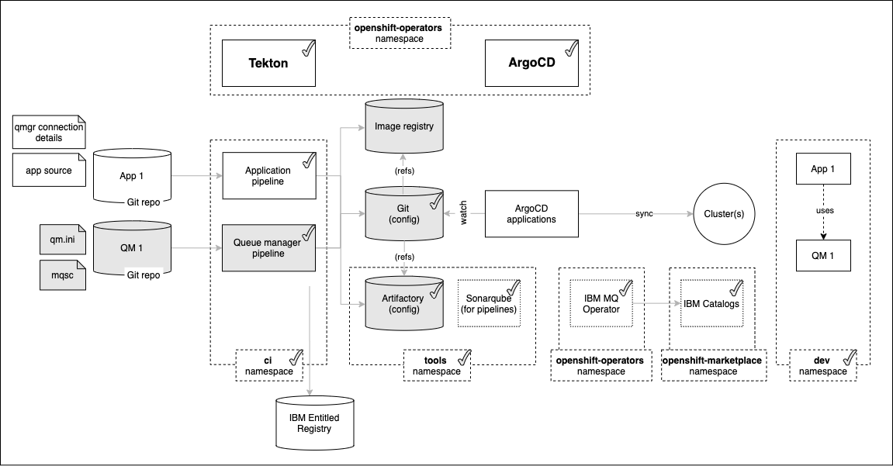
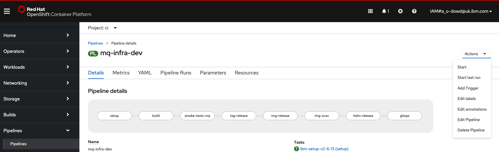
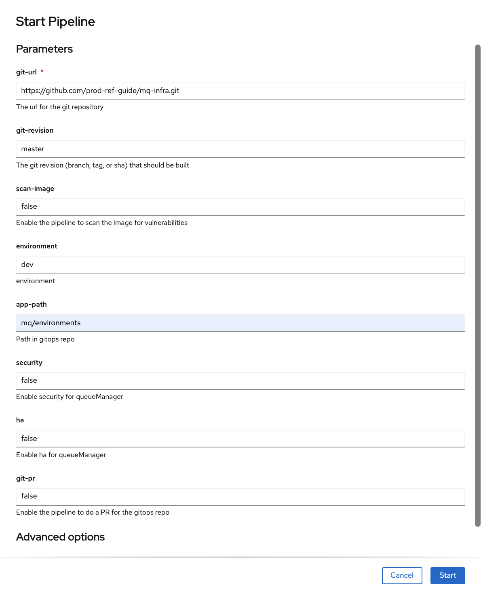
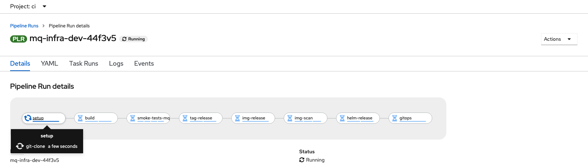
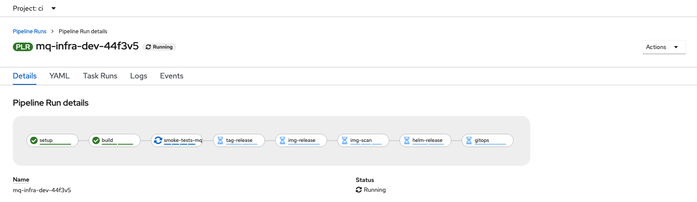
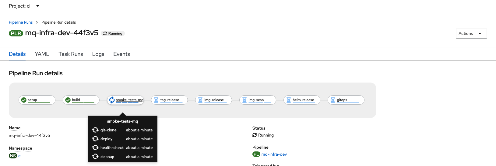
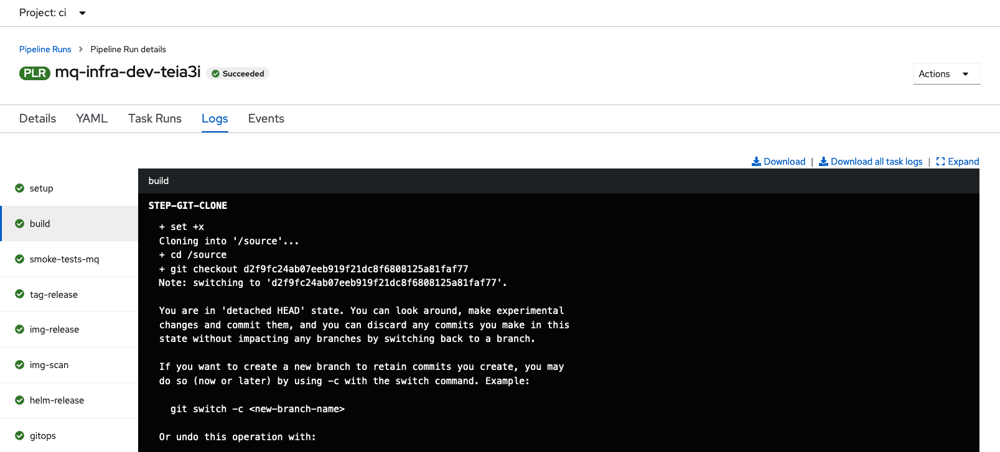
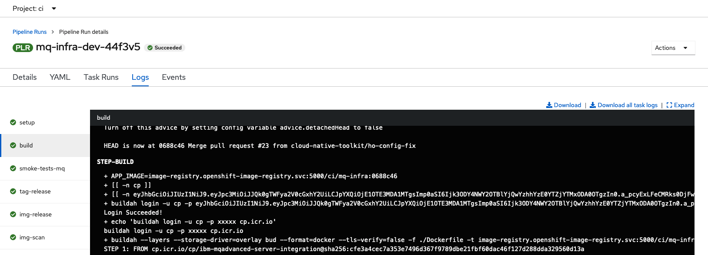
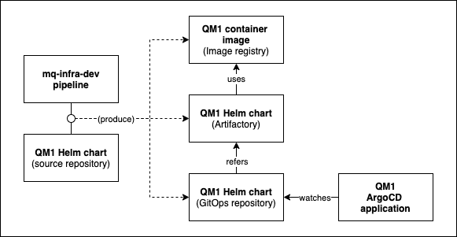

# Running the Pipeline

<!--- cSpell:ignore  pipelinerun resyncs mqsc msqc runmqsc dockerconfigjson queuemanager QMID podman ibmgaragecloud cntk cnkt eventid gitrevision gitrepositoryurl odowdaibm MQSC replicaset eventlistener triggerbinding triggertemplate mqcicd qmgr Artifactory configmaps OIDC CHLAUTH templating sealedsecret -->

## Overview

In the [previous topic](topic1.md) of this chapter, we installed and customized
the queue manager repository for `QM1` and configured the queue manager pipeline
to access it.

In this topic, we will perform our first full iteration of continuous
integration for `QM1`. We'll run the queue manager pipeline to build
and test the queue manager `QM1`. The successful pipeline run will store a new
Helm chart representing `QM1` in the the GitOps repository, ready for
deployment.

Look at the following diagram:



We've highlighted the components we're going to explore in this topic:

* The `QM1 Git repo` that contains the source definition for queue manager
  `QM1`. It includes the queue manager `qm.ini` and `MQSC` files, as well as
  its default Helm configuration.
* The `queue manager pipeline` that will use the `QM1` repository as input. It
  will perform a set of tasks to build and test `QM1`. If successful, the
  pipeline stores updated artifacts in the Image registry, GitOps apps
  repository and Artifactory as required.
* The `Image registry` that will store the newly built version of the queue
  manager image.
* The `GitOps apps repository` that stores the latest good build and test of `QM1`
  represented as a Helm chart. This chart will be subsequently used by ArgoCD to
  deploy `QM1` to the cluster.
* The `Artifactory` repository that stores a base Helm chart containing all the
  default values for `QM1`, including its name, container image for example.
  These can be overridden by the GitOps Helm chart when required.

In this topic, we're going to:

* Run the queue manager pipeline to build and test `QM1`.
* Explore the queue manager pipeline.
* Explore the Artifactory Helm chart.
* Explore the GitOps apps repository Helm chart.

By the end of this topic we'll have a fully built and tested queue manager `QM1`
ready to deploy to the cluster.

---

## Pre-requisites

Before attempting this topic, you should have successfully completed the
[previous topic](../qmgr-pipeline/topic1.md).

---

## Run the queue manager pipeline

As we can see in the diagram above, the queue manager pipeline is responsible
for building and testing `QM1` from a source repository. If successful, it
stores updated artifacts in Artifactory and the GitOps apps repository, which are
used by ArgoCD to deploy the updated `QM1` to the cluster.

It's usually the case a pipeline runs automatically whenever a source repository
changes. However, our first pipeline run is manual so that you can be in
control, making it easier to understand what's happening.

The queue manager **pipeline** performs a set of operations called **tasks**.
Each task is responsible for a specific function such as building a queue
manager image, or unit testing a queue manager. In turn, each **task** comprises
a set of individual **steps**.

For example, the build task might comprise three steps:

- Clone a source repository git,
- Build an image with `buildah` and
- Store an image in an image registry.

If you'd like to know more about Tekton pipelines, here's [an
introduction](https://tekton.dev/docs/concepts/). You will also find [this
video](https://www.ibm.com/cloud/blog/tekton) very helpful. Come back to these
later if you'd like to keep going now.

1. *Locate the* `ci` *pipelines in the web console*

      Let's find the queue manager pipeline using the OpenShift web console.

      Navigate to `Pipelines->Pipelines` in the left hand pane, and select
      `Project: ci`, to show all pipelines in the `ci` namespace:

      {: style="max-height:600px"}

      You can see all the pipeline that we installed into the `ci` namespace in the
      previous chapter.  We'll use different pipelines for different activities
      throughout the tutorial.

      For this topic, we're going to use the `mq-infra-dev` pipeline. When applied
      to the `QM1` source repository, this pipeline will build and test a new
      instance of `QM1` ready for deployment to the `dev` namespace.

2. *The* `mq-infra-dev` *queue manager pipeline*

      Select the `mq-infra-dev` pipeline from the list of all pipelines:

      {: style="max-height:500px"}

      Like all pipelines, `mq-infra-dev` is composed from a set of **tasks**:

      * `setup`
      * `build`
      * `smoke-tests-mq`
      * `tag-release`
      * `image-release`
      * `img-scan`
      * `helm-release`
      * `gitops`

      The task name often provides a strong hint of each task's specific function.
      We'll examine some of these tasks in detail as the pipeline runs.

3. *The* `oc` *command as an alternative to the Web console*

      As well as using the OpenShift web console, you can also interact with
      pipeline using the `oc` or `tekton` commands.

      Ensure you're logged in to cluster, and issue the following command to list
      the `mq-infra-dev` pipeline details:

      ```bash
      oc get pipeline mq-infra-dev -n ci
      ```

      which shows a brief summary of the pipeline:

      ``` { .bash .no-copy }
      NAME           AGE
      mq-infra-dev   46h
      ```

      You can get more detail by adding the `-o yaml` option; we'll do that later.

      We use the command line and the web console in the tutorial so that you
      become familiar with both. As a general rule, you can do the same things in
      the command line as you can with the web console. The web console tends to be
      better for simple interactive tasks; the command line tends to be better for
      scripting and bulk tasks.

4. *Configure your first pipeline run*

      Every time we run the `mq-infra-dev` pipeline, we create a new **pipeline
      run**.  We can think of a **pipeline run** as an instance of a pipeline.
      `Pipeline` and `PipelineRun` are new custom resources that were added to the
      cluster when we installed Tekton.

      In `pipeline details` view above, you'll see an `Actions` button.  Select
      `Start` to configure a pipeline run.

      You'll be presented with the following dialog:

      {: style="max-height:900px"}

      The supplied arguments allow the user of the pipeline to configure its
      behavior. For example, a user can use this pipeline with different queue
      manager source repositories.

      Configure the run as follows:

      * Set `git-url` to your fork of the `mq-infra` repository
      * Set `git-revision` to `master`. (Later in the tutorial, we will use a new branch.)
      * Set `scan-image: false` (temporary fix while issues with UBI are resolved)

      Hit `Start` to start the pipeline run.

      You can also use the command line to run a pipeline; we'll explore that option
      later.

5. *Watch a pipeline run executing*

      The pipeline run has now started.

      Notice how the view changes to `Pipeline Run details`:

      

      We're now looking at the live output from a pipeline run, rather than the
      pipeline used to create the run.

      Notice that the pipeline run name `mq-infra-dev-44f3v5` is based on the
      pipeline name -- with a unique suffix. Every new pipeline run will have a
      unique name.

      See also how the first `setup` task is running, while the remaining tasks are
      waiting to start.

      Hover over `setup` or `build` task and you will see the **steps** that
      comprise it.

6. *Watch pipeline steps complete*

      As the pipeline run proceeds, notice the `build` step complete and the
      `smoke-tests-mq` step start:

      

      This pipeline will take about 15 minutes to complete.  While it's doing that,
      let's explore its tasks in a little more detail.

7. *List the pipeline run from the command line*

      You can also explore the pipeline run from the command line.

      Issue the following command, replacing `mq-infra-dev-44f3v5` with your
      pipeline run name:

      ```bash
      oc get pipelinerun mq-infra-dev-44f3v5 -n ci -o yaml
      ```

      which will show the details of your pipeline run:

      ``` { .yaml .no-copy }
      apiVersion: tekton.dev/v1beta1
      kind: PipelineRun
      metadata:
      ...
      spec:
         ...
         startTime: "2021-07-27T07:34:06Z"
         taskRuns:
            mq-infra-dev-44f3v5-build-gw5bm:
            pipelineTaskName: build
            status:
               completionTime: "2021-07-27T07:35:51Z"
               conditions:
               - lastTransitionTime: "2021-07-27T07:35:51Z"
                  message: All Steps have completed executing
                  reason: Succeeded
                  status: "True"
                  type: Succeeded
               podName: mq-infra-dev-44f3v5-build-gw5bm-pod-w8chs
               startTime: "2021-07-27T07:34:35Z"
               steps:
               - container: step-git-clone
                  imageID: quay.io/ibmgaragecloud/alpine-git@sha256:70f7b70d9324314642b324ac79655862656255dd71b4d18357e5a22f76215ade
                  name: git-clone
                  terminated:
                  containerID: cri-o://256775d430edcc5c4e87fa57d3029b9776ea6dcff7c7e80ae306c1aee49aab06
                  exitCode: 0
                  finishedAt: "2021-07-27T07:34:57Z"
                  reason: Completed
                  startedAt: "2021-07-27T07:34:56Z"
               - container: step-build
                  imageID: quay.io/buildah/stable@sha256:04803d2144a2df5bf3aa2875f130e2b6cfc6ee45003125dc4df13f05f0898f9a
                  name: build
                  terminated:
                  containerID: cri-o://043c8661b91bf02e3f726a9ab9f5bc445f9b7bf5c354070e0d432f5914b55810
                  exitCode: 0
                  finishedAt: "2021-07-27T07:35:50Z"
                  reason: Completed
                  startedAt: "2021-07-27T07:34:57Z"
               taskSpec:
                  params:
                  ...
                  stepTemplate:
                  name: ""
                  resources: {}
                  volumeMounts:
                  - mountPath: $(params.source-dir)
                     name: source
                  steps:
                  - env:
                  - name: GIT_PASSWORD
                     valueFrom:
                        secretKeyRef:
                        key: password
                        name: git-credentials
                        optional: true
                  - name: GIT_USERNAME
                     valueFrom:
                        secretKeyRef:
                        key: username
                        name: git-credentials
                        optional: true
                  image: quay.io/ibmgaragecloud/alpine-git
                  name: git-clone
                  resources: {}
                  script: |
                     set +x
                     if [[ -n "${GIT_USERNAME}" ]] && [[ -n "${GIT_PASSWORD}" ]]; then
                        git clone "$(echo $(params.git-url) | awk -F '://' '{print $1}')://${GIT_USERNAME}:${GIT_PASSWORD}@$(echo $(params.git-url) | awk -F '://' '{print $2}')" $(params.source-dir)
                     else
                        set -x
                        git clone $(params.git-url) $(params.source-dir)
                     fi
                     set -x
                     cd $(params.source-dir)
                     git checkout $(params.git-revision)
                  - env:
      ```

      The full output is very large; we've abbreviated it significantly.

      This output contains the same information displayed as we see in the web
      console. Indeed the web console view is graphical representation of this
      information.

      Here's just a few of the interesting things that you can see:

      * `spec.startTime:` identifies when the pipeline run started
      * `pipelineTaskName: build` holds lots of interesting information on the
        `build` task. For example, we can see the `build` start and completion
        times and that it `succeeded`.
      * `steps` identifies lots of interesting information on each of the steps
        within the `build` task. For example we can see the `git-clone` start and
        completion times, and that it also succeeded.

      There's no need to try to understand all this output right now; we're going to
      do that during this topic. Moreover, we'll make extensive use of the web
      console because it's easier to see what's happening. However, as we do this,
      you might like to link the console display back to this `PipelineRun`
      output.

      Let's continue exploring while the pipeline run completes.

---

##  Explore the pipeline

Let's look more closely at how the `mq-infra-dev` pipeline is structured as the
pipeline run proceeds. Let's also examine the tasks and steps that make up the
pipeline, and how they progressively build and test a queue manager, resulting
in the production of a Helm chart ready for deployment.

The `mq-infra-dev` pipeline run may still be running, so you'll be looking at a
live pipeline run. Don't worry if the run has already completed, all the
information remains available because its held in a `PipelineRun` custom
resource for that run.

1. *Pipeline, Task, Step*

      Let's start with the pipeline, its tasks and steps.

      Hover over the `smoke-tests-mq` task:

      

      See how our pipeline is made up of a set of tasks such as `setup`, `build` or
      `gitops`. These run in the order defined by the pipeline. Our pipeline is
      linear, though Tekton supports more sophisticated pipeline graphs if
      necessary.

      See how each task comprises a set of steps such as `git-clone` or `setup`.
      These run in the order defined by the task.

2. *The pipeline run logs*

      When a pipeline runs, all its output is captured in a set of logs, one for
      each task.

      Click on the `setup` task to show its logs:

      

      (*Alternatively, you can select the `Logs` tab from the UI, and then select
      the tasks on the left pane within the pipeline run view.*)

      See how the `setup` task has its output in a dedicated log. You can select any
      log for any task that has completed or is executing. When a pipeline run
      completes, all its logs remain available, which can help diagnosing problems
      for example.

3. *Exploring an example task output:* `build`

      It's easy to examine a task log; you simply select the relevant task and
      scroll the log up or down. For active tasks the log will be dynamically
      updated.

      Click on the `build` task:

      

      This console window shows the output generated by `build` task.  As the task
      script proceeds, its output is captured; that's what we can see in this
      window.

      Notice that the `build` task output is from the **first step** in the `build`
      task. This step is called `STEP-GIT-CLONE`. Note how the step names are
      capitalized in the web console output.

      Let's look at another task and its steps more closely.

4. *Exploring a task step in detail*: `STEP-BUILD`

      A task is built of multiple steps. Let's explore the `build` task and its
      `step-build` step.

      Select the `build` task and scroll through its logs to see its **second
      step**, `STEP-BUILD`:

      

      See how the `step-build` output is captured in the same log as the previous
      step `git-clone`.

      Each step runs in a separate container -- if you re-examine the `PipelineRun`
      YAML, you'll see those containers. When you scroll through the `build` task
      output, you're seeing what's happening in those containers.

      Read some of the log output to get a feeling for what's happening.  Later,
      we'll see how `step-build` and `step-git-clone` are coded.

5. *The pipeline definition*

      Up to this point, we've examined the pipeline run and the logs it
      generates. Let's now look at how a pipeline is defined.

      Issue the following command to show the `mq-infra-dev` pipeline:

      ```bash
      oc describe pipeline mq-infra-dev -n ci
      ```

      which shows the pipeline YAML in considerable detail:

      ``` { .yaml .no-copy }
      Name:         mq-infra-dev
      Namespace:    ci
      Labels:       app.kubernetes.io/instance=ci-pipelines
      Annotations:  app.openshift.io/runtime: mq
      API Version:  tekton.dev/v1beta1
      Kind:         Pipeline
      Metadata:
         Creation Timestamp:  2021-07-26T11:46:57Z
         Generation:          1
         Managed Fields:
            API Version:  tekton.dev/v1beta1
            Fields Type:  FieldsV1
            fieldsV1:
            f:metadata:
               f:annotations:
                  .:
                  f:app.openshift.io/runtime:
                  f:kubectl.kubernetes.io/last-applied-configuration:
               f:labels:
                  .:
                  f:app.kubernetes.io/instance:
            f:spec:
               .:
               f:params:
               f:tasks:
            Manager:         argocd-application-controller
            Operation:       Update
            Time:            2021-07-26T11:46:56Z
         Resource Version:  2163788
         Self Link:         /apis/tekton.dev/v1beta1/namespaces/ci/pipelines/mq-infra-dev
         UID:               9bc6eaaa-a217-4bef-81fb-5ff30d5952e1
      Spec:
         Params:
            Description:  The url for the git repository
            Name:         git-url
            Type:         string
            Default:      master
            Description:  The git revision (branch, tag, or sha) that should be built
            Name:         git-revision
            Type:         string
            Default:      true
            Description:  Enable the pipeline to scan the image for vulnerabilities
            Name:         scan-image
            Type:         string
            Default:      namespace-dev
            Description:  environment
            Name:         environment
            Type:         string
            Default:      2-services/instances
            Description:  Service
            Name:         app-type
            Type:         string
            Default:      false
            Description:  Enable security for queueManager
            Name:         security
            Type:         string
            Default:      false
            Description:  Enable ha for queueManager
            Name:         ha
            Type:         string
         Tasks:
            Name:  setup
            Params:
            Name:   git-url
            Value:  $(params.git-url)
            Name:   git-revision
            Value:  $(params.git-revision)
            Name:   scan-image
            Value:  $(params.scan-image)
            Task Ref:
            Kind:  Task
            Name:  ibm-setup-v2-6-13
            Name:    build
            Params:
            Name:   git-url
            Value:  $(tasks.setup.results.git-url)
            Name:   git-revision
            Value:  $(tasks.setup.results.git-revision)
            Name:   source-dir
            Value:  $(tasks.setup.results.source-dir)
            Name:   image-server
            Value:  $(tasks.setup.results.image-server)
            Name:   image-namespace
            Value:  $(tasks.setup.results.image-namespace)
            Name:   image-repository
            Value:  $(tasks.setup.results.image-repository)
            Name:   image-tag
            Value:  $(tasks.setup.results.image-tag)
            Run After:
            setup
            Task Ref:
            Kind:  Task
            Name:  ibm-build-tag-push-v2-6-13
            Name:    smoke-tests-mq
            Params:
            Name:   git-url
            Value:  $(tasks.setup.results.git-url)
            Name:   git-revision
            Value:  $(tasks.setup.results.git-revision)
            Name:   source-dir
            Value:  $(tasks.setup.results.source-dir)
            Name:   image-server
            Value:  $(tasks.setup.results.image-server)
            Name:   image-namespace
            Value:  $(tasks.setup.results.image-namespace)
            Name:   image-repository
            Value:  $(tasks.setup.results.image-repository)
            Name:   image-tag
            Value:  $(tasks.setup.results.image-tag)
            Name:   app-namespace
            Value:  $(tasks.setup.results.app-namespace)
            Name:   app-name
            Value:  $(tasks.setup.results.app-name)
            Name:   deploy-ingress-type
            Value:  $(tasks.setup.results.deploy-ingress-type)
            Name:   tools-image
            Value:  $(tasks.setup.results.tools-image)
            Name:   security
            Value:  $(params.security)
            Name:   ha
            Value:  $(params.ha)
            Run After:
            build
            Task Ref:
            Kind:  Task
            Name:  ibm-smoke-tests-mq
            Name:    tag-release
            Params:
            Name:   git-url
            Value:  $(tasks.setup.results.git-url)
            Name:   git-revision
            Value:  $(tasks.setup.results.git-revision)
            Name:   source-dir
            Value:  $(tasks.setup.results.source-dir)
            Name:   js-image
            Value:  $(tasks.setup.results.js-image)
            Run After:
            smoke-tests-mq
            Task Ref:
            Kind:  Task
            Name:  ibm-tag-release-v2-6-13
            Name:    img-release
            Params:
            Name:   image-from
            Value:  $(tasks.setup.results.image-url)
            Name:   image-to
            Value:  $(tasks.setup.results.image-release):$(tasks.tag-release.results.tag)
            Run After:
            tag-release
            Task Ref:
            Kind:  Task
            Name:  ibm-img-release-v2-6-13
            Name:    img-scan
            Params:
            Name:   image-url
            Value:  $(tasks.img-release.results.image-url)
            Name:   scan-trivy
            Value:  $(tasks.setup.results.scan-trivy)
            Name:   scan-ibm
            Value:  $(tasks.setup.results.scan-ibm)
            Run After:
            img-release
            Task Ref:
            Kind:  Task
            Name:  ibm-img-scan-v2-6-13
            Name:    helm-release
            Params:
            Name:   git-url
            Value:  $(tasks.setup.results.git-url)
            Name:   git-revision
            Value:  $(tasks.setup.results.git-revision)
            Name:   source-dir
            Value:  $(tasks.setup.results.source-dir)
            Name:   image-url
            Value:  $(tasks.img-release.results.image-url)
            Name:   app-name
            Value:  $(tasks.setup.results.app-name)
            Name:   deploy-ingress-type
            Value:  $(tasks.setup.results.deploy-ingress-type)
            Name:   tools-image
            Value:  $(tasks.setup.results.tools-image)
            Run After:
            img-scan
            Task Ref:
            Kind:  Task
            Name:  ibm-helm-release-v2-6-13
            Name:    gitops
            Params:
            Name:   app-name
            Value:  $(tasks.setup.results.app-name)
            Name:   version
            Value:  $(tasks.tag-release.results.tag)
            Name:   helm-url
            Value:  $(tasks.helm-release.results.helm-url)
            Name:   tools-image
            Value:  $(tasks.setup.results.tools-image)
            Name:   environment
            Value:  $(params.environment)
            Name:   app-type
            Value:  $(params.app-type)
            Run After:
            helm-release
            Task Ref:
            Kind:  Task
            Name:  ibm-gitops
      Events:      <none>
      ```

      Don't be intimidated by this output -- it's actually just a more detailed
      source view of the information shown for the `mq-infra-dev` pipeline in the
      web console.

      Locate the following key structures in the `Pipeline` YAML:

      * `API Version: tekton.dev/v1beta1` and `Kind: Pipeline` identify this as
        a Tekton pipeline.
      * `Spec: Params` identifies the **pipeline input parameters**
      * `Tasks:` is a list of the tasks in this pipeline, each of which has
        * A `Name:` naming the task
        * A set of `Params:` identifying the **task input parameters**
        * An optional `Run After:` value indicating when the task is run
        * A `Task Ref:` identifying the actual task code to be run using the
          task's input

      Notice that there's **no code** in the pipeline definition; instead, the
      definition specifies the required inputs to the pipeline, as well as the set
      of required tasks and their order of execution. The code executed by each task
      is identified by `Task Ref:`, rather than in the pipeline; the pipeline
      definition merely defines the order of task execution and how parameters are
      marshaled between tasks.

      Let's now examine the pipeline definition in a little more detail.

6. *The pipeline input* `Spec: Params`

      When we configure a pipeline run, the arguments map precisely to `Spec:
      Params` in the pipeline YAML file.

      Below, we've just shown the `Spec: Params:` for the `mq-infra-dev` pipeline:

      ``` { .yaml .no-copy }
      spec:
        params:
          - name: git-url
            description: The url for the git repository
          - name: git-revision
            description: The git revision (branch, tag, or sha) that should be built
            default: master
          - name: scan-image
            description: Enable the pipeline to scan the image for vulnerabilities
            default: "false"
          - name: environment
            description: environment
            default: dev
          - name: app-path
            description: Path in gitops repo
            default: mq/environments
          - name: security
            description: Enable security for queueManager
            default: "false"
          - name: ha
            description: Enable ha for queueManager
            default: "false"
          - name: git-pr
            description: Enable the pipeline to do a PR for the gitops repo
            default: "false"
      ```

      Spend a few moments mapping each of these parameters maps to those on the
      `Start Pipeline` input dialog where you specified the pipeline run arguments.
      For example, map `Names:`, `Description:`  and `Default:` to the different
      fields in the dialog.

7. *Parameters for the first* `setup` *task*

      We can see that the first task in the pipeline is called `setup`. Let's
      examine its YAML to see how it gets its input parameters:

      ``` { .yaml .no-copy }
      tasks:
        - name: setup
          taskRef:
            name: ibm-setup-v2-6-13
          params:
            - name: git-url
              value: $(params.git-url)
            - name: git-revision
              value: $(params.git-revision)
            - name: scan-image
              value: $(params.scan-image)
      ```

      See how the `setup` task derives its `git-url` parameter using the
      **pipeline** input parameter value `$(params.git-url)`. See how `git-revision`
      and `scan-image` work in a similar way. The first task in a pipeline typically
      works like this -- its parameters are mapped from the pipeline's input
      parameters.

      Notice also that some pipeline input parameters are not referred to by the
      `setup` task; they will be used by subsequent tasks using the appropriate
      `$(params.)` value.

8. *Passing arguments between tasks*

      As each task completes, the pipeline proceeds. When a new task starts it often
      requires one or more results generated by a previous task.

      We can see a good example of this in the `build` task:

      ``` { .yaml .no-copy }
      - name: build
        taskRef:
          name: ibm-build-tag-push-v2-6-13
        runAfter:
          - setup
        params:
          - name: git-url
            value: "$(tasks.setup.results.git-url)"
          - name: git-revision
            value: "$(tasks.setup.results.git-revision)"
          - name: source-dir
            value: "$(tasks.setup.results.source-dir)"
          - name: image-server
            value: "$(tasks.setup.results.image-server)"
          - name: image-namespace
            value: "$(tasks.setup.results.image-namespace)"
          - name: image-repository
            value: "$(tasks.setup.results.image-repository)"
          - name: image-tag
            value: "$(tasks.setup.results.image-tag)"
      ```

      See how the `build` task specifies that the `image-tag` parameter should use
      value generated by the `setup` task using the syntax:
      `$(tasks.setup.results.image-tag)`.

      Also notice how the `build` tasks uses `Run After:` to specify that it should
      execute **after** the `setup` task. This follows the Kubernetes idiom of
      resources being declarative -- the order of execution is defined by
      `RunAfter:` rather than the order in which tasks appear in the YAML.

      Again, notice that the `build` task **doesn't** contain the code that the task
      executes. This is contained in `Task Ref:` which identifies
      `ibm-build-tag-push-v2-6-13` as the task to execute using the specified
      parameters.  It's the code in `ibm-build-tag-push-v2-6-13` which generates the
      log output for the task; we'll examine it later.

      The way pipelines tasks are designed makes them highly reusable. As we'll see
      later, tasks are written with defined inputs and outputs such that they can be
      re-used by different pipelines. Pipelines focus on organizing the order of
      task execution and how parameters are marshaled into and between tasks; it's
      the tasks that do the actual work.

9. *Locating the pipeline and tasks source YAMLs*

      Finally, let's locate the source for the `mq-infra-dev` pipeline and the tasks
      within it.

      It is located in the following folder:

      ```bash
      cd $HOME/git
      cd multi-tenancy-gitops-apps
      tree mq/environments/ci/pipelines/
      ```

      We can see the other pipelines for the `ci` namespace in this folder:

      ``` { .text .no-copy }
      mq/environments/ci/pipelines/
      ├── ibm-test-pipeline-for-dev.yaml
      ├── ibm-test-pipeline-for-stage.yaml
      ├── java-maven-dev-pipeline.yaml
      ├── mq-pipeline-dev.yaml
      └── mq-spring-app-dev-pipeline.yaml
      ```

      These map to the MQ-related pipelines we saw in the `Pipelines->Pipelines`
      view in the web console.

10. *Exploring the* `mq-infra-dev` *source YAML*

      View the source for the `mq-pipeline-dev.yaml` pipeline with the command:

      ```bash
      cat mq/environments/ci/pipelines/mq-pipeline-dev.yaml
      ```

      which shows the source YAML for the `mq-infra-dev` pipeline:

      ``` { .yaml .no-copy }
      apiVersion: tekton.dev/v1beta1
      kind: Pipeline
      metadata:
        name: mq-infra-dev
        annotations:
          app.openshift.io/runtime: mq
      spec:
        params:
          - name: git-url
            description: The url for the git repository
          - name: git-revision
            description: The git revision (branch, tag, or sha) that should be built
            default: master
          - name: scan-image
            description: Enable the pipeline to scan the image for vulnerabilities
            default: "false"
          - name: environment
            description: environment
            default: dev
          - name: app-path
            description: Path in gitops repo
            default: mq/environments
          - name: security
            description: Enable security for queueManager
            default: "false"
          - name: ha
            description: Enable ha for queueManager
            default: "false"
          - name: git-pr
            description: Enable the pipeline to do a PR for the gitops repo
            default: "false"
        tasks:
          - name: setup
            taskRef:
              name: ibm-setup-v2-6-13
            params:
              - name: git-url
                value: $(params.git-url)
              - name: git-revision
                value: $(params.git-revision)
              - name: scan-image
                value: $(params.scan-image)
          - name: build
            taskRef:
              name: ibm-build-tag-push-v2-6-13
            runAfter:
              - setup
            params:
              - name: git-url
                value: "$(tasks.setup.results.git-url)"
              - name: git-revision
                value: "$(tasks.setup.results.git-revision)"
              - name: source-dir
                value: "$(tasks.setup.results.source-dir)"
              - name: image-server
                value: "$(tasks.setup.results.image-server)"
              - name: image-namespace
                value: "$(tasks.setup.results.image-namespace)"
              - name: image-repository
                value: "$(tasks.setup.results.image-repository)"
              - name: image-tag
                value: "$(tasks.setup.results.image-tag)"
          - name: smoke-tests-mq
            taskRef:
              name: ibm-smoke-tests-mq
            runAfter:
              - build
            params:
              - name: git-url
                value: "$(tasks.setup.results.git-url)"
              - name: git-revision
                value: "$(tasks.setup.results.git-revision)"
              - name: source-dir
                value: "$(tasks.setup.results.source-dir)"
              - name: image-server
                value: "$(tasks.setup.results.image-server)"
              - name: image-namespace
                value: "$(tasks.setup.results.image-namespace)"
              - name: image-repository
                value: "$(tasks.setup.results.image-repository)"
              - name: image-tag
                value: "$(tasks.setup.results.image-tag)"
              - name: app-namespace
                value: "$(tasks.setup.results.app-namespace)"
              - name: app-name
                value: "$(tasks.setup.results.app-name)"
              - name: deploy-ingress-type
                value: "$(tasks.setup.results.deploy-ingress-type)"
              - name: tools-image
                value: "$(tasks.setup.results.tools-image)"
              - name : security
                value: "$(params.security)"
              - name: ha
                value: "$(params.ha)"
          - name: tag-release
            taskRef:
              name: ibm-tag-release-v2-6-13
            runAfter:
              - smoke-tests-mq
            params:
              - name: git-url
                value: "$(tasks.setup.results.git-url)"
              - name: git-revision
                value: "$(tasks.setup.results.git-revision)"
              - name: source-dir
                value: "$(tasks.setup.results.source-dir)"
              - name: js-image
                value: "$(tasks.setup.results.js-image)"
          - name: img-release
            taskRef:
              name: ibm-img-release-v2-6-13
            runAfter:
              - tag-release
            params:
              - name: image-from
                value: "$(tasks.setup.results.image-url)"
              - name: image-to
                value: "$(tasks.setup.results.image-release):$(tasks.tag-release.results.tag)"
          - name: img-scan
            taskRef:
              name: ibm-img-scan-v2-6-13
            runAfter:
              - img-release
            params:
              - name: image-url
                value: $(tasks.img-release.results.image-url)
              - name: scan-trivy
                value: $(tasks.setup.results.scan-trivy)
              - name: scan-ibm
                value: $(tasks.setup.results.scan-ibm)
          - name: helm-release
            taskRef:
              name: ibm-helm-release-v2-6-13
            runAfter:
              - img-scan
            params:
              - name: git-url
                value: "$(tasks.setup.results.git-url)"
              - name: git-revision
                value: "$(tasks.setup.results.git-revision)"
              - name: source-dir
                value: "$(tasks.setup.results.source-dir)"
              - name: image-url
                value: "$(tasks.img-release.results.image-url)"
              - name: app-name
                value: "$(tasks.setup.results.app-name)"
              - name: deploy-ingress-type
                value: "$(tasks.setup.results.deploy-ingress-type)"
              - name: tools-image
                value: "$(tasks.setup.results.tools-image)"
          - name: gitops
            taskRef:
              name: ibm-gitops
            runAfter:
              - helm-release
            params:
              - name: app-name
                value: "$(tasks.setup.results.app-name)"
              - name: version
                value: "$(tasks.tag-release.results.tag)"
              - name: helm-url
                value: $(tasks.helm-release.results.helm-url)
              - name: tools-image
                value: "$(tasks.setup.results.tools-image)"
              - name: app-path
                value: "$(params.app-path)"
              - name: dest-environment
                value: "$(params.environment)"
              - name: git-pr
                value: "$(params.git-pr)"
      ```

      This YAML is *slightly* different to the output of the `oc get pipeline`
      command, because extra information is added during deployment such as
      `Creation Timestamp:`.

11. *Finding the ArgoCD application that manages pipelines*

      You can see how the `mq-infra-dev` and other pipeline YAMLs were deployed by
      examining the ArgoCD application that watches the folder containing the `ci`
      namespace pipelines.

      Issue the following command:

      ```bash
      cat mq/config/argocd/ci/ci-app-rest.yaml
      ```

      which shows the `apps-mq-rest-ci-1` ArgoCD application that watches for updates:

      ``` { .yaml .no-copy hl_lines="15-17"}
      apiVersion: argoproj.io/v1alpha1
      kind: Application
      metadata:
        name: apps-mq-rest-ci-1
        annotations:
          argocd.argoproj.io/sync-wave: "300"
        finalizers:
          - resources-finalizer.argocd.argoproj.io
      spec:
        destination:
          namespace: ci
          server: https://kubernetes.default.svc
        project: applications
        source:
          path: mq/environments/ci
          repoURL: https://github.com/hp-gitops-test/multi-tenancy-gitops-apps
          targetRevision: master
        syncPolicy:
          automated:
            prune: true
            selfHeal: true
      ```

      See how this `apps-mq-rest-ci-1` watches: `path: mq/environments/ci`. As
      we know, this folder contains the YAML for the `mq-infra-dev` and other
      pipelines under `pipelines` folder. When this ArgoCD application was made
      active in the cluster, it installed all the pipelines along with other
      resources in this folder.

      Later in the tutorial, we'll examine how tasks are coded to perform their
      tasks, but for now, you should have a good feeling for how pipelines are
      structured and how they work.

      By now, the pipeline run should have completed successfully. In the next
      section, we're going to examine the Helm charts that it created.


---

## Understanding the `QM1` Helm chart

The successful completion of the `mq-infra-dev` pipeline run which used the
`QM1` source repository as input has resulted in three new objects being
produced:

* A versioned container image for `QM1` stored in the cluster image registry.
* A versioned Helm chart for `QM1` stored in Artifactory. This chart
  contains a full default configuration for `QM1` based largely on the Helm
  chart in the source repository.
* A versioned Helm chart for `QM1` stored in the GitOps repository. This
  chart is created the first time the pipeline runs. It has a much sparser
  structure, and points to the full Helm chart stored in Artifactory.

The following diagram represents this structure and process:



This diagram shows how:

* The Helm chart stored in Artifactory points to the container image used by
  `QM1` in the Image registry. This Helm chart contains the default
  configuration for the `queuemanager` custom resource YAML for `QM1` derived
  from it source repository. This YAML refers to the container that was built
  during the pipeline run.
* This Helm chart stored in the GitOps repository merely refers to the full
  Helm chart stored in Artifactory. This Helm chart will be used by ArgoCD
  to deploy `QM1` to the cluster.

In this topic we're going to examine these Helm charts in more detail. We'll see
how they are structured and how they are used. We'll see how, in combination,
these Helm charts provide a well governed deployment of `QM1` to the cluster.

1. *The source repository for the Helm chart*

      **Return to the terminal window** you're using for the `mq-infra` source
      repository. (*Rather than the terminal window you're using for the*
      `multi-tenancy-gitops` *GitOps repository.*)

      In the previous topic, we forked and cloned the `mq-infra` repository. This
      contains the source Helm chart for queue manager `QM1`. Let's quickly recap
      this Helm chart.

      Ensure you're in the correct directory:

      ```bash
      cd $HOME/git/mq-infra
      ```

2. *The source Helm chart*

      Let's see how the source Helm chart for `QM1` is structured.

      Issue the following command:

      ```bash
      tree chart/base
      ```

      to show the Helm folder structure and detail:

      ``` { .text .no-copy }
      chart/base
      ├── Chart.yaml
      ├── config
      │   └── config.mqsc
      ├── security
      │   └── config.mqsc
      ├── templates
      │   ├── NOTES.txt
      │   ├── _helpers.tpl
      │   ├── configmap.yaml
      │   └── qm-template.yaml
      └── values.yaml
      ```

      The key folders and files are as follows:

      * The `templates` folder contains the templates that will be used to
        generate the `queuemanager` custom resource and `configmap` for `QM1`.
      * The `values.yaml` file contains a set of values that are used by these
        templates. For example, `qm-template` gets the queue manager name and
        CPU/memory limits from `values.yaml`.
      * The `config` folder contains the MQSC definitions that will be placed in
        the config map used by `QM1` when the queue manager **is not configured**
        for security.
      * The `security` folder contains the MQSC definitions that will be placed
        in the config map used by `QM1` when the queue manager **is configured**
        for security.

      Feel free to learn more about [Helm
      charts](https://v2.helm.sh/docs/developing_charts/) before you proceed.

3. *Exploring Helm charts in Artifactory*

      Every successful `mq-infra-dev` pipeline run stores a new version of
      the `QM1` Helm chart in Artifactory.  The Artifactory Helm chart is almost a
      verbatim copy of the source Helm chart. However, the pipeline adds vitally
      important data that is generated when the pipeline in run, and cannot be known
      ahead of time. This includes the name of the successfully built and tested
      container image, as well as chart version information. These calculated values
      are stored in the `values.yaml` file in Artifactory alongside the defaults
      from the source repository.

      You can access Artifactory via an OpenShift route. Using a browser, navigate
      to the URL returned by following command:

      ```bash
      oc get route -n tools | grep artifactory | awk '{print "https://"$2}'
      ```

      This will list the route to the Artifactory, for example:

      ``` { .text .no-copy }
      https://artifactory-tools.xxxxx.containers.appdomain.cloud
      ```

      Copy the URL into your browser to launch the Artifactory UI.

      (*You can safely ignore any browser certificate warnings.*)

      Grab the user and password using the below commands.

      ```bash
      echo "User: "; oc get secret/artifactory-access -n tools -o json | jq -r '.data."ARTIFACTORY_USER"' | base64 -D
      echo "Password: "; oc get secret/artifactory-access -n tools -o json | jq -r '.data.ARTIFACTORY_PASSWORD' | base64 -D
      ```

4. *Locating the Artifactory Helm chart*

      We can locate the Helm chart produced by the pipeline in the Artifactory UI.

      On the left hand pane select `Artifactory->Artifacts`.

      Within this view, select `generic-local->ci->mq-infra-0.0.1.tgz->mq-infra`.

      Select the `values.yaml` file and `View Source` tab:

      

      Notice:

      * The chart folder structure folder is exactly the same as the source
        repository.
      * The chart is stored in a binary zipped form, indicated by the `.tgz` file
        extension.
      * The chart has a version `0.0.1` -- each pipeline run will increment this
        value.
      * The `image:` specified in the `QM1` custom resource YAML has been
        updated to specify the exact image and version that should be used from
        the image registry.

      Let's have a more detailed look at the Helm chart for `QM1` stored in
      Artifactory.

5. *Examine the Artifactory Helm chart* `Chart.yaml`

      We'll start with the `Chart.yaml` file; it's the starting point for the `QM1`
      Helm chart. Its contents are almost exactly the same as those in the `QM1`
      source repository, but with one important difference. As we'll see, the chart
      version stored in Artifactory must be generated dynamically by the pipeline
      run.

      In the Artifactory UI, select the `Chart.yaml` file and `View Source` tab:

      ``` { .yaml .no-copy }
      apiVersion: v2
      appVersion: 1.16.0
      description: A Helm chart for Kubernetes
      name: mq-infra
      type: application
      version: 0.0.1
      ```

      This file contains the high level information about the chart.

      * The `apiVersion` is the Helm API version for the chart. We're using Helm
        3, which requires `v2`.
      * The `name` field specifies the name of the chart. We've used `base`
        because the GitOps Helm chart will will be based on this one, inheriting
        most of its properties. This name could be more helpful -- `QM1 base
        chart` for example.
      * The `description` could be more helpful -- `Helm chart for QM1`, for
        example.
      * The `type` field identifies whether the chart is a Helm application or
        Helm library. The `QM1` chart is an `application` type -- a collection of
        templates (a queue manager and configmap) that are packaged and versioned
        for deployment.
      * The `version` field specifies the chart version. Every time the
        `mq-infra-dev` pipeline run is successful, the version is incremented.
      * The `appVersion` field is purely informational in Helm. The
        `mq-infra-dev` pipeline should keep `appVersion` the same as the
        `version`, but it's currently fixed at `1.16.0`. (This isn't helpful and
        will be addressed.)

      In summary, the most important aspect of `Chart.yaml` is its `version`.  This
      version is stored within the chart, as well forming the chart name:
      `mq-infra-0.0.1.tgz`.  Every time the `mq-infra-dev` pipeline run is
      successful, a new, versioned instance of the `QM1` Helm chart is produced
      and stored in Artifactory.

6. *Examine the Artifactory Helm chart* `values.yaml`

     The `values.yaml` file is created by the designer of the Helm chart to allow
     users to control its behavior.  Its contents are used by the queue manager and
     configmap templates to generate deployable `queuemanager` and `configmap`
     YAMLs. These YAMLs are customized according by their corresponding templates
     using the values specified in `values.yaml`.

     To re-iterate, the `values.yaml` file has almost the same contents as the
     `QM1` source repository, but with a few important differences. For example,
     the queue manager container image name stored in Artifactory must be generated
     dynamically by the pipeline run.

     In the Artifactory UI, select the `values.yaml` file and `View Source` tab:

     ``` { .yaml .no-copy }
     name: qm-dev
     version: 9.2.3.0-r1
     web:
       enabled: true

     license:
       accept: true
       license: L-RJON-BN7PN3
       halicense: L-RJON-BYRMYW
       use: NonProduction

     image:
       repository: replace
       tag: replace
       pullPolicy: Always

     queuemanager:
       debug: false
       imagePullPolicy: IfNotPresent
       livenessProbe:
         failureThreshold: 1
         initialDelaySeconds: 90
         periodSeconds: 10
         successThreshold: 1
         timeoutSeconds: 5
       logFormat: Basic
       metrics:
         enabled: true
       name: QM1
       readinessProbe:
         failureThreshold: 1
         initialDelaySeconds: 10
         periodSeconds: 5
         successThreshold: 1
         timeoutSeconds: 3
       resources:
         limits:
           cpu: "1"
           memory: 1Gi
         requests:
           cpu: "1"
           memory: 1Gi

     storage:
       persistedData:
         enabled: false
       queueManager:
         type: ephemeral
         hatype: persistent-claim
         size: 2Gi
       recoveryLogs:
         enabled: false

     availability:
       type: SingleInstance
       hatype: NativeHA

     mqsc:
       configmap: mqsc-configmap
       name: config.mqsc

     ini:
       configmap:
       name:

     securityContext:
       initVolumeAsRoot: false

     template:
       pod:
         containers:
         - name: qmgr
           # env:
           # - name: MQSNOAUT
           #   value: "yes"

     configmap:
       path: config
       pathWithSecurity: security

     cert:
       secretName: mq-server-cert

     terminationGracePeriodSeconds: 30

     tracing:
       agent: {}
       collector: {}
       enabled: false
       namespace: ""

     security: false

     ha: false
     ```

     Notice how:

     * Most of these values exactly correspond to the same literal values in the
       `queuemanager` custom resource YAML. For example, `license:`, `resources`
       and `readinessProbe:` are  simple mappings to those found in a
       `queuemanager` custom resource YAML.
     * Other values are not literal mappings; they are used by the queue manager
       or configmap templates in more sophisticated ways. For example `security:
       false` is used in combination `pathWithSecurity:` to configure a different
       MQSC file for `QM1` depending on the security requirements.  The logic to
       accomplish this processing is held within the template files.
     * `image:` identifies the name and version of the queue manager
       container image to retrieve from the container registry. This value was
       set by the pipeline run, and corresponds to the image that was
       successfully smoke tested.

7. *A short digression on Helm templating*

      As we've just seen with our security example, it's often helpful for the
      `values.yaml` file to contain a YAML node such as `security:` that is more
      than a literal equivalent to the YAML node found in a Kubernetes resource.

      We're going to take a short detour to explain how this works by exploring the
      `templates/configmap.yaml` file in Artifactory.

      In the Artifactory UI, select the `/templates/configmap.yaml` file and `View
      Source` tab:

      ``` { .yaml .no-copy hl_lines="4 6" }
      apiVersion: v1
      kind: ConfigMap
      metadata:
         name: {{ .Values.mqsc.configmap }}
      data:
      {{- if eq .Values.security true }}
      {{- $path := printf "%s/*" .Values.configmap.pathWithSecurity }}
      {{ (.Files.Glob $path).AsConfig | indent 2 }}
      {{ else }}
      {{- $path := printf "%s/*" .Values.configmap.path }}
      {{ (.Files.Glob $path).AsConfig | indent 2 }}
      {{ end }}
      ```

      This is a Helm template, and it uses the Go templating language. Learn more
      about [Helm templates](https://helm.sh/docs/chart_best_practices/templates/)
      if you'd like; for now it's enough to have this basic understanding.

      In the example above, notice how:

      * configmap `name` is derived from the `values.yaml` file using
        `{{.Values.mqsc.configmap}}`.
      * `.Values.security` is used to control the configmap that
        is generated.

      You can also view the queue manager template. In the Artifactory UI, select
      the `/templates/qm-template.yaml` file and `View Source` tab:

      ``` { .yaml .no-copy }
      apiVersion: mq.ibm.com/v1beta1
      kind: QueueManager
      metadata:
        name: {{ .Values.name }}
        annotations:
          argocd.argoproj.io/sync-wave: "300"
          helm.sh/hook-weight: "300"
      spec:
        license:
          accept: {{ .Values.license.accept }}
          {{ if eq .Values.ha true }}
          license: {{ .Values.license.halicense }}
          {{ else }}
          license: {{ .Values.license.license }}
          {{ end }}
          use: {{ .Values.license.use }}
        queueManager:
          {{- toYaml .Values.queuemanager | nindent 4 }}
          {{ if eq .Values.ha true }}
          availability:
            type: {{ .Values.availability.hatype }}
            tls:
              secretName: {{ .Values.cert.secretName }}
              cipherSpec: ANY_TLS12_OR_HIGHER
          {{ else }}
          availability:
            type: {{ .Values.availability.type }}
          {{ end }}
          image: "{{ .Values.image.repository }}:{{ .Values.image.tag }}"
          imagePullPolicy: {{ .Values.image.pullPolicy }}
          mqsc:
          - configMap:
              name: {{ .Values.mqsc.configmap }}
              items:
              - {{ .Values.mqsc.name }}
          {{ if eq .Values.ha true }}
          storage:
            queueManager:
              size: {{ .Values.storage.queueManager.size }}
              type: {{ .Values.storage.queueManager.hatype }}
          {{ else }}
          storage:
            persistedData:
              enabled: {{ .Values.storage.persistedData.enabled }}
            queueManager:
              type: {{ .Values.storage.queueManager.type }}
            recoveryLogs:
              enabled: {{ .Values.storage.recoveryLogs.enabled }}
          {{ end }}
        securityContext:
          initVolumeAsRoot: {{ .Values.securityContext.initVolumeAsRoot }}
        template:
          pod:
            containers:
            - name: qmgr
              {{- if eq .Values.security false }}
              env:
              - name: MQSNOAUT
                value: "yes"
              {{- end }}
        terminationGracePeriodSeconds: {{ .Values.terminationGracePeriodSeconds }}
        tracing:
          {{- toYaml .Values.tracing | nindent 4 }}
        version: {{ .Values.version }}
        web:
          enabled: {{ .Values.web.enabled }}
        {{- if eq .Values.security true }}
        pki:
          keys:
            - name: certificate
              secret:
                items:
                  - tls.key
                  - tls.crt
                secretName: {{ .Values.cert.secretName }}
          trust:
            - name: ca
              secret:
                items:
                  - ca.crt
                secretName: {{ .Values.cert.secretName }}
        {{- end }}
      ```

      Spend a few moments examining this template, to see how it uses the
      `values.yaml` file.

8. *Re-merging local clone to view Helm chart in GitOps repository*

      The `mq-infra-dev` pipeline run updated the GitOps repository with the Helm
      chart. This means that our local clone of the GitOps repository is one commit
      behind GitHub. To allow us to view the Helm chart locally, we must re-merge
      our local branch with GitHub.

      **Return to the terminal window** you're using for the `multi-tenancy-gitops-apps`
      GitOps apps repository. (*Rather than the terminal window you're using for the*
      `mq-infra` *source repository.*)

      Issue the following commands to merge the local branch:

      ```bash
      git fetch origin
      git merge origin/$GIT_BRANCH
      ```

      which shows our local branch being updated:

      ``` { .text .no-copy }
      Updating 0c0e5b9..8cf318d
      Fast-forward
       mq/environments/dev/mq-infra/Chart.yaml        | 4 ++++
       mq/environments/dev/mq-infra/requirements.yaml | 4 ++++
       mq/environments/dev/mq-infra/values.yaml       | 3 +++
       3 files changed, 11 insertions(+)
       create mode 100644 mq/environments/dev/mq-infra/Chart.yaml
       create mode 100644 mq/environments/dev/mq-infra/requirements.yaml
       create mode 100644 mq/environments/dev/mq-infra/values.yaml
      ```

      Notice how these files correspond to the new Helm chart created in the GitOps
      repository by the `mq-infra-dev` pipeline run.

9. *Explore the Helm chart in the GitOps repository*

      Let's examine the newly produced Helm chart in the GitOps repository; it was
      created by the pipeline run.

      Issue the following command:

      ```bash
      tree mq/environments/dev/mq-infra/
      ```

      which shows the newly produced Helm chart:

      ``` { .text .no-copy }
      mq/environments/dev/mq-infra/
      ├── Chart.yaml
      ├── requirements.yaml
      └── values.yaml
      ```

      Notice that:

      * The chart for `QM1` was created in the `mq/environments/` folder to
        reflect the fact this queue manager is part of the **applications** layer.
      * The chart was created in the `dev` subfolder to reflect the fact that
        it's going to be deployed to the `dev` namespace.
      * The chart was created in a new folder `/mq-infra`. This folder is
        dedicated to `QM1`.  A different queue manager would have a different
        folder.

10. *Examine the GitOps Helm chart* `requirements.yaml`

      We need a Helm chart in the GitOps repository for a few reasons:

      * ArgoCD requires a Git repository to watch for updates
      * Git is our source of truth. Although Artifactory contains the base Helm
        chart, we link to it from Git.
      * We can override the Artifactory Helm chart with a GitOps repository
        `values.yaml` file. For example, we might want to change the CPU or memory
        used by `QM1`. This should not require a re-run of the `mq-infra-dev`
        pipeline because it not that `QM1` has changed, but its **environment**.
        (*An example of a change that should require a pipeline run is an updated
        MQSC or qm.ini file.*)

      Helm makes it easy for one Helm chart to build upon an existing Helm chart
      using a `requirements.yaml` file. Let's see how the GitOps chart builds upon
      the Helm chart in Artifactory.

      Issue the following command:

      ```bash
      cat mq/environments/dev/mq-infra/requirements.yaml
      ```

      to see the `requirements.yaml` file:

      ``` { .yaml .no-copy }
      dependencies:
        - name: mq-infra
          version: 0.0.1
          repository: http://artifactory-artifactory.tools:8082/artifactory/generic-local/ci
      ```

      See how this Helm chart identifies the dependent Helm chart in the Artifactory
      repository. This information effectively provides a link to the
      `mq-infra-0.0.1.tgz` zipped Helm chart we explored earlier.

11. *Examine the GitOps Helm chart* `values.yaml`

      Recall that the `values.yaml` file in the `QM1` source repository provides
      sensible defaults for `QM1`.  As we saw, the `values.yaml` file in Artifactory
      is largely a copy of this file.  The `values.yaml` file in the GitOps
      repository performs a very different role; it allows these defaults to be
      overridden.

      Issue the following command:

      ```bash
      cat mq/environments/dev/mq-infra/values.yaml
      ```

      to see the GitOps `values.yaml` file:

      ``` { .yaml .no-copy }
      global: {}
      mq-infra:
         replicaCount: 1
      ```

      See how sparsely populated this file is; it really just provides overrides and
      extensions to the `mq-infra` chart stored in Artifactory. The example provided
      of `replicaCount` is not a good example because its copied from the MQ
      application chart.

      Imagine a production scenario where we wanted to increase the CPU and memory
      requirements of the deployed `QM1`. We could update the GitOps repository
      `values.yaml` file as follows:

      ``` { .yaml .no-copy }
      global: {}
      mq-infra:
         resources:
            limits:
            cpu: "2"
            memory: 2Gi
            requests:
            cpu: "2"
            memory: 2Gi
      ```

      This would result in the already deployed `QM1` being re-deployed with
      these new values, but the base Helm chart in Artifactory wouldn't change.

      To support this practice, the `mq-infra-dev` pipeline will create an initial
      version of the GitOps `value.yaml` file, but subsequently pipeline run will
      not change it, as they assume that it is being used for GitOps operational
      overrides such as our CPU/memory example.

12. *Examine the GitOps Helm chart* `Chart.yaml`

      Finally, we examine the GitOps `Chart.yaml` file.

      Issue the following command:

      ```bash
      cat mq/environments/dev/mq-infra/Chart.yaml
      ```

      to see the Helm chart details:

      ``` { .yaml .no-copy }
      apiVersion: v2
      version: 0.1.0
      name: mq-infra
      description: Chart to configure ArgoCD with the mq-infra project and its applications
      ```

      Notice that this chart is similar in structure to the Helm chart in
      Artifactory. However, it's important to realize that its `version` is
      independently maintained. For example, if we modified the GitOps `values.yaml`
      file to override CPU and memory, the GitOps Helm chart `version` would be
      incremented, but the Artifactory base Helm chart `version` would remain
      unchanged.


!!! success "Congratulations!" 

    You've completed your first run of the queue manager pipeline.

    Feel free to run the `mq-infra-dev` pipeline more than once to get a feeling for
    how it works.

    You've used it to build and test an instance of `QM1` ready for deployment to the cluster. You've explored how the queue manager pipeline is structured as tasks and steps. You've examined a pipeline run log to understand how a pipeline works and how tasks are implemented. Finally, you've examined the Helm chart that resulted from a successful run of the pipeline.

    In the next topic of this chapter we're going to deploy this Helm chart to the cluster to instantiate `QM1` in the `dev` namespace.
